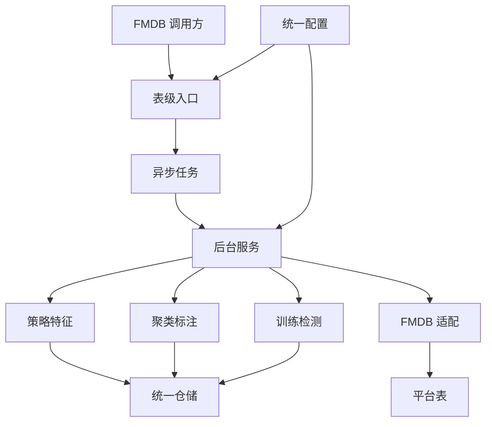
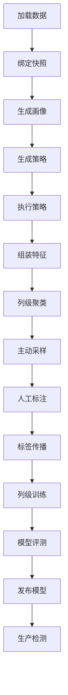

# fmdb-udf-raha

## 概述

`fmdb-udf-raha` 是面向 FMDB 和 Spark 的单元格级数据错误检测组件。工程参考 Raha 的弱监督错误检测思路，将字段画像、检测策略、稀疏特征、聚类采样、标签传播、列级模型、检测和 FMDB 适配整合为 Java 组件，并提供训练、检测、采样三个可注册到 Spark SQL 的异步表级 UDF。

工程不是带 `main` 方法的独立应用。它以组件库和 UDF Jar 的形式交付，由 FMDB 宿主进程负责组装 Spark 会话、共享仓储和后台任务消费者。

核心能力包括：

1. 从 CSV、JSON、Parquet、FMDB 表或只读 SQL 加载数据并生成稳定快照。
2. 生成字段空值、频率、长度、数值分布和字符类型画像。
3. 执行离群检测、模式违规检测和关系违规检测策略。
4. 将策略命中与上下文信号组装为版本化稀疏特征。
5. 对单列样本进行层次聚类，并按聚类覆盖度生成主动标注任务。
6. 合并直接标签与聚类传播标签，构建列级训练样本。
7. 使用 Spark MLlib 逻辑回归或规则加权模型完成训练和检测。
8. 管理模型候选、评测、发布、停用和回滚。
9. 计算精确率、召回率、F1 和平均精确率等检测指标。
10. 通过 FMDB 表保存任务、模型、特征字典和检测结果。
11. 通过三个 Spark SQL UDF 严格解析请求并异步创建幂等任务。

## 当前交付边界

必须区分“已经实现的组件能力”和“已经装配完成的生产链路”：

| 项目 | 当前状态 |
| --- | --- |
| Raha 算法组件 | 已实现画像、OD、PVD、RVD、特征、聚类、采样、传播、训练、检测和评测 |
| FMDB 适配 | 已实现表或只读 SQL 加载、任务与结果写入和模型存储 |
| Spark SQL UDF | 已实现训练、检测、采样三个字符串入参、JSON 文本返回的异步入口 |
| UDF 后台执行 | 当前仓库没有持续消费异步任务的后台工作器，需由宿主平台实现 |
| 核心共享仓储 | 当前提供完整仓储契约和进程内实现，生产共享持久化需由宿主补充 |
| 安装脚本 | 当前仓库未提供 FMDB 安装包和自动注册脚本，交付物为 Maven Jar |

UDF 返回 `ACCEPTED` 只表示任务已通过校验并成功持久化，不表示训练、检测或采样算法已经执行完成。

## 技术基线

| 项目 | 版本或约束 |
| --- | --- |
| Java | JDK 8，构建插件强制限制为 `[1.8,1.9)` |
| Maven | 3.8 及以上 |
| Spark | 3.3.1 |
| Scala 二进制版本 | 2.12 |
| Spark SQL | `provided`，由 FMDB 运行环境提供 |
| Spark MLlib | `provided`，由 FMDB 运行环境提供 |
| 日志 | SLF4J 1.7.36，`provided` |
| 测试 | JUnit Jupiter 5.10.2 |
| 编码 | UTF-8，无 BOM |
| 换行 | LF |

工程禁止引入 Spark 4 和 Scala 2.13 对应的 Spark 依赖，并使用 Animal Sniffer 检查 Java 8 API 兼容性。

## 总体架构



主要层次如下：

| 层次 | 包 | 职责 |
| --- | --- | --- |
| 平台入口层 | `udf` | 注册函数、解析请求、幂等建单和 JSON 应答 |
| 用例编排层 | `service`、`job` | 训练、采样、检测服务以及任务状态、阶段、重试和失败容忍 |
| 算法层 | `strategy`、`feature`、`cluster`、`sampling`、`label`、`model`、`detection`、`evaluation` | 完成 Raha 检测闭环 |
| 数据接入层 | `data.loader`、`data.profile`、`fmdb` | 加载文件或 FMDB 数据，生成画像并写入平台产物 |
| 运行治理层 | `parallel` | 受控并发、超时和失败恢复 |
| 基础设施层 | `repository`、`checkpoint`、`observability`、`error`、`util`、`config` | 持久化、检查点、日志上下文、异常、工具和配置 |

## 目录说明

| 路径 | 用途 |
| --- | --- |
| `src/main/java/com/fiberhome/ml/raha` | 主代码，按平台入口、业务编排、算法和基础设施分包 |
| `src/main/resources/raha-defaults.properties` | 全量内置默认配置及每个配置项的中文说明 |
| `src/test/java/com/fiberhome/ml/raha` | 单元测试和 Spark 集成测试 |
| `datasets` | Beers、Flights、Movies、Rayyan、Tax、Toy 等开发和对齐数据集 |
| `scripts/generate_iteration5_python_baseline.py` | 生成迭代五 Python 基线产物 |
| `design` | Raha、Baran、KATARA、Metanome 等设计和论文资料 |
| `doc/<日期>` | 方案、概要设计、迭代验收、源码分析和生产资源建议 |
| `target` | Maven 构建产物，不纳入版本控制 |

## 构建与测试

### 环境检查

构建前确认 Maven 实际使用 JDK 8：

```powershell
java -version
mvn -version
```

`mvn -version` 输出中的 Java 版本必须为 1.8。仅设置 `JAVA_HOME` 而没有更新当前终端的 `PATH`，可能仍会调用其他 JDK。

PowerShell 示例：

```powershell
$env:JAVA_HOME = "<JDK 8 安装目录>"
$env:Path = "$env:JAVA_HOME\bin;$env:Path"
mvn -version
```

### 执行测试

```powershell
mvn clean test
```

测试范围包括配置加载、数据加载、画像、策略、特征、聚类、采样、标签传播、训练、检测、模型生命周期、任务状态机、检查点、FMDB 适配、UDF 和并行恢复。

Spark 3.3.1 在未配置模块开放参数的 JDK 17 环境可能因访问 `sun.nio.ch.DirectBuffer` 失败而无法初始化。项目正式支持的构建和测试环境是 JDK 8，不应通过跳过 Enforcer 将 JDK 17 测试结果作为交付结论。

### 打包

```powershell
mvn clean package
```

需要执行 Java 8 API 兼容性检查时使用：

```powershell
mvn clean verify
```

主要产物如下：

| 产物 | 用途 |
| --- | --- |
| `target/fmdb-udf-raha-1.0.0-SNAPSHOT.jar` | 普通工程 Jar |
| `target/fmdb-udf-raha-1.0.0-SNAPSHOT-all.jar` | 供 FMDB 注册和部署使用的 Shade Jar |

Spark SQL、Spark MLlib 和 SLF4J 被声明为 `provided`，不会被打入完整 Jar，目标 FMDB 环境必须提供兼容版本。

## 配置

### 加载顺序

配置按以下优先级从低到高合并：

1. 类路径内置配置 `raha-defaults.properties`。
2. UTF-8 外部属性文件。
3. JVM 中以 `raha.` 开头的系统属性。

外部文件可通过环境变量或系统属性指定；系统属性优先于环境变量：

```powershell
$env:RAHA_CONFIG_FILE = "D:\fmdb\conf\raha.properties"
```

```powershell
mvn test "-Draha.config.file=D:\fmdb\conf\raha.properties"
```

也可以直接覆盖单个配置：

```powershell
mvn test "-Draha.model.threshold=0.65" "-Draha.resource.max-parallel-columns=6"
```

配置加载器会拒绝默认配置中未声明的键，避免拼写错误被静默忽略。共享默认配置采用首次访问时延迟加载，同一 JVM 中后续修改环境变量或系统属性不会自动刷新已经创建的共享工厂。

### 常用配置

| 配置项 | 默认值 | 说明 |
| --- | ---: | --- |
| `raha.strategy.families` | `OD,PVD,RVD` | 默认启用的策略族 |
| `raha.strategy.max-count` | `1000` | 单任务最大策略数 |
| `raha.model.classifier-type` | `WEIGHTED_RULE` | 默认列级分类器 |
| `raha.model.threshold` | `0.5` | 疑似错误判定阈值 |
| `raha.model.fallback-enabled` | `true` | 训练不可用时是否允许规则模型降级 |
| `raha.sampling.labeling-budget` | `20` | 默认主动标注预算 |
| `raha.clustering.max-sample-count` | `500` | 单列精确聚类最大样本数 |
| `raha.resource.max-parallel-strategies` | `4` | 策略并发上限 |
| `raha.resource.max-parallel-columns` | `4` | 字段并发上限 |
| `raha.failure.max-retry-count` | `1` | 阶段最大重试次数 |
| `raha.udf.max-request-length` | `65536` | UDF 请求最大字符数 |

全部配置项、取值范围和说明以 `src/main/resources/raha-defaults.properties` 为准。

## 数据输入要求

### 支持的来源

| 使用入口 | 支持来源 |
| --- | --- |
| 开发期文件加载器 | CSV、JSON、Parquet |
| FMDB 数据加载器 | FMDB Catalog 表、只读 SQL |
| UDF | `sourceType=TABLE` 或 `sourceType=SQL` |

FMDB SQL 来源只接受以 `SELECT` 或 `WITH` 开头的只读语句。UDF 使用 `TABLE` 来源时，表名只能包含一至三级英文标识，例如 `table_name`、`database.table_name` 或 `catalog.database.table_name`。

### 稳定行标识

每个数据集必须提供 `rowIdColumn`。该字段用于形成稳定单元格坐标、关联标签、执行幂等检测和追踪结果。行标识不能为空、不能重复，也不能在不同快照中无规则变化。

### 快照与字段过滤

加载请求支持显式 `snapshotId`、字段白名单、字段黑名单、敏感字段集合和读取选项。未显式提供快照时，加载层根据来源、模式和配置生成稳定摘要。UDF 请求当前只暴露可选 `snapshotId`，更细的文件选项和字段过滤应由宿主服务入口提供。

## 核心处理流程



通用任务编排器提供幂等任务、阶段状态机、失败分类、重试和失败比例控制；高层 `RahaTrainService`、`RahaSampleService` 和 `RahaDetectService` 分别提供训练、采样和检测用例入口。

## FMDB UDF

### 函数清单

| 默认函数名 | Java 类 | 用途 |
| --- | --- | --- |
| `F_DW_RAHATRAIN` | `com.fiberhome.ml.raha.udf.F_DW_RAHATRAIN` | 异步提交列级模型训练任务 |
| `F_DW_RAHADETECT` | `com.fiberhome.ml.raha.udf.F_DW_RAHADETECT` | 异步提交整表检测任务 |
| `F_DW_RAHASAMPLE` | `com.fiberhome.ml.raha.udf.F_DW_RAHASAMPLE` | 异步提交聚类覆盖采样任务 |

函数名可通过 `raha.udf.train-function`、`raha.udf.detect-function` 和 `raha.udf.sample-function` 修改，三个名称必须唯一。

三个函数均接收一个字符串并返回一个 JSON 字符串：

```text
STRING function_name(STRING encodedRequest)
```

### 请求编码

UDF 入参不是 JSON，而是 UTF-8 URL 表单编码文本，格式为 `key=value&key=value`。请求具有以下约束：

1. 参数名必须位于固定白名单中，未知参数会被拒绝。
2. 不允许重复参数名。
3. 参数值中的空格、等号、连接符、中文和 SQL 特殊字符必须进行 URL 编码。
4. 请求总长度默认不能超过 65536 个字符。
5. 相同 `datasetId` 和 `idempotencyKey` 对应的任务类型及规范配置必须一致。

允许的公共参数如下：

| 参数 | 必填 | 说明 |
| --- | --- | --- |
| `datasetId` | 是 | 逻辑数据集标识 |
| `inputReference` | 是 | FMDB 表名或 URL 编码后的只读 SQL |
| `sourceType` | 是 | 只允许 `TABLE` 或 `SQL`，忽略大小写 |
| `rowIdColumn` | 是 | 稳定且唯一的行标识字段 |
| `snapshotId` | 否 | 可选输入快照标识 |
| `idempotencyKey` | 是 | 调用方生成的幂等键 |
| `caller` | 是 | 调用方身份，用于任务追踪和日志上下文 |
| `resultTable` | 是 | 任务结果表，必须为合法 FMDB 表名 |

任务专属参数如下：

| 任务 | 必填参数 | 禁止携带的参数 |
| --- | --- | --- |
| 训练 | `annotationReference` | `modelVersion`、`labelingBudget` |
| 检测 | `modelVersion` | `annotationReference`、`labelingBudget` |
| 采样 | 正整数 `labelingBudget` | `annotationReference`、`modelVersion` |

### 最小 SQL 示例

训练任务：

```sql
SELECT F_DW_RAHATRAIN(
  'datasetId=orders_202607&inputReference=ods.orders_dirty&sourceType=TABLE&rowIdColumn=id&idempotencyKey=train_orders_202607_v1&caller=data_quality&resultTable=dw.raha_task_result&annotationReference=dw.raha_labels'
) AS submission_result;
```

检测任务：

```sql
SELECT F_DW_RAHADETECT(
  'datasetId=orders_202607&inputReference=ods.orders_dirty&sourceType=TABLE&rowIdColumn=id&snapshotId=orders_snapshot_001&idempotencyKey=detect_orders_202607_v1&caller=data_quality&resultTable=dw.raha_detection_result&modelVersion=orders_model_v1'
) AS submission_result;
```

采样任务：

```sql
SELECT F_DW_RAHASAMPLE(
  'datasetId=orders_202607&inputReference=ods.orders_dirty&sourceType=TABLE&rowIdColumn=id&idempotencyKey=sample_orders_202607_v1&caller=data_quality&resultTable=dw.raha_annotation_task&labelingBudget=20'
) AS submission_result;
```

只读 SQL 来源示例，其中 `inputReference` 的原始值为 `SELECT * FROM ods.orders_dirty WHERE dt='20260715'`：

```sql
SELECT F_DW_RAHADETECT(
  'datasetId=orders_202607&inputReference=SELECT+%2A+FROM+ods.orders_dirty+WHERE+dt%3D%2720260715%27&sourceType=SQL&rowIdColumn=id&idempotencyKey=detect_orders_sql_v1&caller=data_quality&resultTable=dw.raha_detection_result&modelVersion=orders_model_v1'
) AS submission_result;
```

生产调用方应使用标准 URL 编码库生成请求，不应手工拼接包含特殊字符的参数。

### 返回协议

成功受理示例：

```json
{
  "jobId": "job-001",
  "taskType": "DETECT",
  "status": "ACCEPTED",
  "resultLocation": "fmdb://dw.raha_detection_result/job-001",
  "configVersion": "<SHA-256 配置摘要>",
  "errorCode": null,
  "errorMessage": null,
  "submittedAt": 1784073600000
}
```

| 字段 | 说明 |
| --- | --- |
| `jobId` | 已创建或已存在的任务标识；拒绝时为 `null` |
| `taskType` | `TRAIN`、`DETECT` 或 `SAMPLE` |
| `status` | `ACCEPTED`、`DUPLICATE` 或 `REJECTED` |
| `resultLocation` | 预期结果位置，格式为 `fmdb://<resultTable>/<jobId>` |
| `configVersion` | 规范任务配置的 SHA-256 摘要 |
| `errorCode` | 拒绝错误码，成功时为 `null` |
| `errorMessage` | 不包含原始输入值的错误摘要，成功时为 `null` |
| `submittedAt` | 提交响应时间，Unix 毫秒时间戳 |

常见错误码如下：

| 错误码 | 含义 |
| --- | --- |
| `INVALID_UDF_ARGUMENT` | 缺少必填项、来源非法、参数格式错误或请求超长 |
| `UNKNOWN_UDF_ARGUMENT` | 请求包含未声明参数 |
| `IDEMPOTENCY_CONFLICT` | 相同幂等键已用于其他任务配置 |
| `UDF_RUNTIME_UNAVAILABLE` | UDF 注册进程尚未配置任务提交器 |
| `UDF_SUBMISSION_FAILED` | 仓储或 FMDB 写入等提交过程发生未预期异常 |

### 注册与宿主装配

不能只通过 `CREATE TEMPORARY FUNCTION` 实例化 UDF 类后直接调用。默认无参 UDF 会从进程级 `RahaUdfRuntime` 获取提交器，未初始化时返回 `UDF_RUNTIME_UNAVAILABLE`。

宿主应完成以下装配：

1. 将 `fmdb-udf-raha-1.0.0-SNAPSHOT-all.jar` 放入 FMDB Spark Driver 和 Executor 可访问的类路径。
2. 创建 Spark 会话及 FMDB 表网关、任务结果写入器和共享任务仓储。
3. 创建 `RepositoryBackedRahaUdfJobSubmitter`。
4. 调用 `new RahaUdfRegistrar().register(sparkSession, submitter)` 注册三个函数。
5. 启动后台任务消费者，将已创建任务交给训练、检测或采样服务执行。
6. 根据任务状态和 `resultLocation` 查询最终结果，不在 SQL UDF 调用中同步等待算法完成。

注册器会先配置运行时提交器，再向当前 Spark 会话注册三个函数；任一函数注册失败时会清理运行时提交器并记录异常堆栈。

生产环境不得使用以下进程内实现：

- `InMemoryRahaRepository`：仅适合测试和单进程开发，不提供跨进程共享持久化。

## 策略与模型

### 已实现策略

| 策略族 | 策略 | 主要用途 |
| --- | --- | --- |
| OD | 低频值、数值距离、四分位异常 | 发现低频值和数值离群点 |
| PVD | 字符集、长度、空值占位、类型格式 | 发现字段内部模式违规 |
| RVD | 一对多关系冲突 | 发现字段之间的关系违规 |

`KBVD` 和 `TFIDF` 当前只有策略族枚举语义，没有具体策略实现。

### 分类器

| 分类器 | 当前状态 |
| --- | --- |
| `WEIGHTED_RULE` | 已实现，默认使用 |
| `LOGISTIC_REGRESSION` | 已实现，依赖 Spark MLlib |
| `DECISION_TREE` | 未接入训练器；允许降级时回退到规则模型，否则训练失败 |
| `GBT` | 未接入训练器；允许降级时回退到规则模型，否则训练失败 |

列级训练可能因没有特征、没有标签、仅有单一类别或冲突样本剔除后为空而跳过。训练和检测按字段汇总状态，允许部分字段成功、部分字段跳过或失败。

## 数据保护与可观测性

1. 验证版本不在工程内执行权限判断和审计落库，访问控制由 FMDB 宿主或上游平台负责。
2. 特征和检测结果仅保留稳定值哈希，`masked_value` 兼容字段固定写空，不保存原始值或脱敏展示值。
3. 日志覆盖配置读取、Spark 或 FMDB 外部调用、核心阶段、耗时、关键分支和异常堆栈。
4. 日志和 UDF 错误响应不得写出原始单元格值、完整 SQL 或敏感参数。
5. FMDB 幂等写入通过业务键左反连接减少重复数据，但不构成跨进程原子事务，生产表仍应配置平台侧唯一约束或等价治理。

## 性能边界

验证版本不再内置性能基准生成、容量分档和资源推荐模块。删除这些模块不会改变当前策略并发、字段并发、Spark 缓存或分区行为，因为原资源建议对象未接入核心执行链路。目标环境仍需关注以下 Driver 风险：

1. 部分策略会使用 `collectAsList` 收集候选。
2. 特征组装会按列收集值和频率结果。
3. 精确层次聚类计算复杂度较高，默认单列上限为 500 个样本。
4. 当前生产预测主路径仍包含 Driver 侧列表处理。
5. 执行器、磁盘和网络指标需要由宿主监控平台采集。

历史资源建议详见 `doc/20260715/Raha数据检测生产资源建议-202607151228.md`，当前验证工程不再内置该模块。

## 测试和验收建议

提交前至少执行：

```powershell
mvn clean verify
```

部署前还应在目标 FMDB 环境完成以下验收：

1. 验证 Spark 3.3.1、Scala 2.12 和 JDK 8 版本一致性。
2. 验证 FMDB Catalog 表读取、只读 SQL 和追加写入。
3. 验证三个 UDF 注册、合法请求、非法请求、重复提交和幂等冲突。
4. 验证后台消费者可以将建单任务推进到最终状态。
5. 验证原始单元格值不会写入特征和检测结果表。
6. 验证模型训练、发布、检测、停用和回滚闭环。
7. 使用真实规模数据执行宽表、并发、失败恢复和容量基准测试。
8. 在宿主平台验证访问控制、审计、保留清理和上线门禁。

## 已知限制

1. 当前仓库没有 UDF 后台任务消费者和一站式生产装配器。
2. 核心 `RahaRepository` 尚无完整 FMDB 共享实现，两套持久化体系的一致性由宿主处理。
3. 通用阶段流水线尚未包含标签传播、模型训练、评测和最终持久化处理器。
4. 阶段检查点执行器和 Spark 资源管理器尚未完整接入通用主流程。
5. 生产检测要求调用方先准备兼容特征，尚无从原始数据到最终检测的一键入口。
6. 决策树和梯度提升树分类器尚未接入训练实现。
7. FMDB 结果幂等追加不是跨进程分布式事务。
8. 权限、审计、保留清理、性能基准和生产门禁不在当前验证工程内实现。
9. 聚类和部分策略仍存在 Driver 内存及单机计算边界。
10. 当前没有自动生成 FMDB 安装包、创建平台表或注册函数的部署脚本。

## 参考文档

| 文档 | 用途 |
| --- | --- |
| `doc/20260715/Raha工程-源码完整分析-202607150943.md` | 当前源码包、调用关系、流程和实现边界的完整分析 |
| `doc/20260715/Raha工程配置项分析与外置化改造报告-202607151316.md` | 配置加载、覆盖优先级和配置项说明 |
| `doc/20260715/Raha数据检测生产资源建议-202607151228.md` | 已移除资源建议模块的历史容量和压测记录 |
| `doc/20260715/Raha数据检测迭代9落地与FMDB-UDF验收报告-202607151133.md` | FMDB 适配和 UDF 验收说明 |
| `doc/20260715/Raha数据检测迭代10落地与P2生产验收报告-202607151228.md` | 已移除治理模块的历史设计与验收记录 |
| `design/raha论文中文翻译-202607071430.md` | Raha 论文中文资料 |
