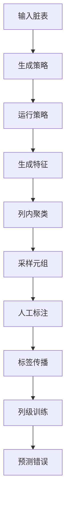
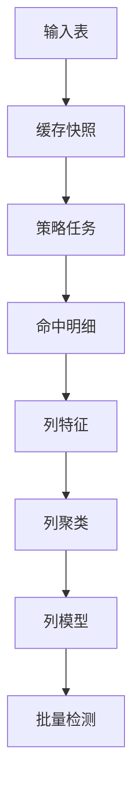
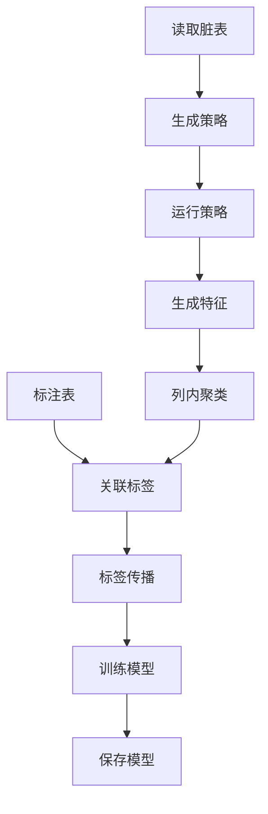
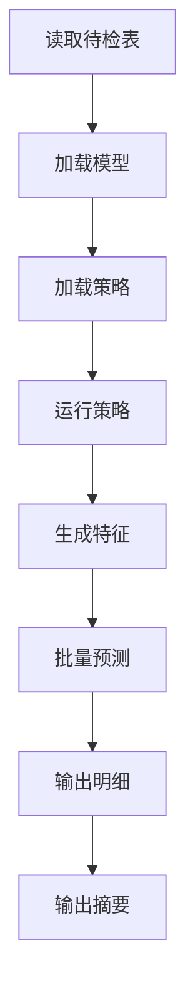
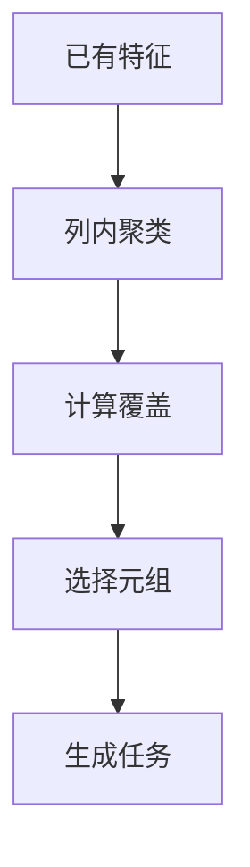

# Raha Java 工程化与 FMDB Spark UDF 检测方案

## 1. 本次修订结论

本次修订将文档定位从“复用现有 FMDB 工程能力”调整为“新建完整 Raha 数据检测工程”。原 `## 3. 当前 FMDB 工程能力` 已删除，后续设计不再以 `dw_fmdb_udf` 源码为工程基础。

核心结论如下：

1. 本工程是一个完整新工程，目标是实现 Raha 风格的数据错误检测，不做 Baran 数据纠正。
2. 本工程通过 Maven 管理编译依赖，由 FMDB 平台提供兼容的 Spark 运行环境，不依赖旧工程源码、旧 UDF 类或旧命令类。
3. 工程不扫描本地依赖目录，也不执行运行时 Classpath 或精确 Jar 文件名校验。
4. 论文主线以 Raha 错误检测流程为核心，同时参考 `raha-baran-fast.pdf` 的并行化思想和 `baran-effective-error-correction-unified-context-transfer-learning-2020.pdf` 的上下文表示思想。
5. Python demo 路径为 `F:\ai-code\raha\raha-master\`，其中 `raha\detection.py` 是 Java 化检测流程的主要行为参考。
6. 输出结果只描述“哪个单元格疑似错误、置信度、命中特征和原因”，不输出修复值，不生成清洗后数据表。
7. 新工程需要把 Raha 的策略运行、特征生成、聚类采样、标签传播、列级分类和批量检测拆成可持久化、可观测、可复跑的 Spark 流程。

## 2. 工程定位与边界

本工程定位为 FMDB 环境下的 Raha 数据检测引擎，服务形态是 Java Maven 工程加 Spark UDF 或 Spark 批处理入口。

### 2.1 工程目标

| 目标 | 说明 |
| --- | --- |
| 单元格级检测 | 判断表中每个单元格是否疑似错误 |
| 无配置或少配置 | 自动生成有限策略集合，降低人工配置规则成本 |
| 少量标注学习 | 利用少量已标注元组或标注表训练列级模型 |
| 可解释输出 | 输出命中的策略、特征贡献和检测原因 |
| 可复跑 | 策略结果、特征、模型、检测批次都可落表或落文件 |
| 可扩展 | 大表场景下使用 Spark 做策略级、列级和分区级并行 |

### 2.2 明确不做

| 不做事项 | 原因 |
| --- | --- |
| 不做数据纠正 | 当前项目聚焦 Raha 检测，Baran 修复流程不进入首期范围 |
| 不输出推荐修复值 | 修复值属于 Baran 候选生成和纠正模型范畴 |
| 不覆盖清洗回写 | 检测结果只作为质量问题明细或复核输入 |
| 不依赖旧工程源码 | 本工程是新工程，只复用 jar 能力和论文思路 |
| 不把单元格 UDF 作为主检测形态 | Raha 依赖全表策略和列级上下文，表级批处理更合适 |

### 2.3 与 Baran 的关系

Baran 论文是重要参考，但不作为本工程实现范围。可借鉴的内容只有三类：

| Baran 思路 | 在本工程中的使用方式 |
| --- | --- |
| 值上下文 | 用于设计字符类型、长度、格式、值频率等检测特征 |
| 邻近上下文 | 用于设计列间依赖、函数依赖冲突、一对多冲突检测特征 |
| 领域上下文 | 用于设计列内分布、低频值、异常值、值域特征 |
| 迁移学习 | 用于历史策略过滤和历史字段画像复用，不用于纠正候选生成 |

Baran 的纠正候选、纠正模型、候选排序、最终修复值预测、Wikipedia 修订历史预训练不进入本工程。

## 3. 论文依据与落地取舍

### 3.1 Raha 论文要点

Raha 的核心是把数据错误检测转成单元格级二分类问题。它不要求用户预先提供完整规则，而是自动生成多类错误检测策略，并把每个策略是否命中某个单元格编码为二值特征。

Raha 检测流程如下：



论文中最重要的工程结论：

1. 错误粒度是单元格，不是整行或整表。
2. 策略输出不是直接投票结果，而是用于构造特征向量。
3. 每一列单独聚类、单独训练分类器。
4. 聚类采样的目标是用少量元组覆盖尽量多的未知错误类型。
5. 标签传播是提升小样本训练效果的关键。
6. 分类器选择不是最核心因素，特征和采样更关键。
7. 历史数据可以用于过滤无关策略，降低特征生成耗时。

### 3.2 Raha 策略族

| 策略族 | 论文含义 | 工程落地 |
| --- | --- | --- |
| `OD` | 离群点检测 | 值频率、数值分布、低频桶、统计距离 |
| `PVD` | 模式违规检测 | 字符集合、长度、空值、格式、类型模式 |
| `RVD` | 规则违规检测 | 单属性函数依赖、一对多冲突、列间一致性 |
| `KBVD` | 知识库违规检测 | 外部字典、主数据、知识库关系 |
| `TFIDF` | 文本补充特征 | 可选，只作为文本列增强特征 |

首期建议优先实现 `OD`、`PVD`、`RVD`，再接入 `KBVD`。原因是 `KBVD` 依赖外部知识库质量和映射准确性，工程不确定性更高。

### 3.3 `raha-baran-fast.pdf` 的落地启发

`raha-baran-fast.pdf` 的核心贡献是通过任务并行、数据并行和只读共享对象降低运行时间。虽然论文实现使用 Dask，本工程运行环境更适合 Spark。

可落地为以下 Spark 设计原则：

| 论文思想 | Spark 工程映射 |
| --- | --- |
| 策略级并行 | 每个策略配置独立执行，输出策略命中表 |
| 列级并行 | 每列独立生成特征、聚类、训练和预测 |
| 只读输入表 | 输入 Dataset 缓存后不修改，中间结果写新表 |
| 中间结果只追加 | 策略命中、特征、标签、预测结果按批次写入 |
| 避免共享可写状态 | 任务之间通过批次表和模型元数据传递结果 |
| 大对象少复制 | 配置和字典广播，明细数据保持分布式 Dataset |
| 按列均衡任务 | 错误多、特征多的列需要单独拆分和限流 |

推荐并行流程如下：



### 3.4 Baran 论文的边界取舍

Baran 论文强调值上下文、邻近上下文、领域上下文和迁移学习。本工程只把这些概念转换为检测特征和历史画像，不进入纠正。

| Baran 能力 | 本工程取舍 |
| --- | --- |
| 生成纠正候选 | 不实现 |
| 更新纠正模型 | 不实现 |
| 预测最终修复值 | 不实现 |
| 值上下文抽象 | 转成检测特征 |
| 邻近上下文抽象 | 转成列间依赖特征 |
| 领域上下文抽象 | 转成列内分布特征 |
| 迁移学习 | 转成历史策略过滤和画像复用 |

## 4. Maven 依赖与运行基线

### 4.1 构建版本

| 项目 | 基线 |
| --- | --- |
| JDK | 1.8 |
| Spark | 3.3.1 |
| Scala 二进制版本 | 2.12 |
| Spark SQL | Maven `provided` 依赖 |
| Spark MLlib | Maven `provided` 依赖 |

### 4.2 约束方式

- 版本和依赖范围统一由 `pom.xml` 管理。
- Maven Enforcer 在构建阶段拒绝 Spark 4 和 Scala 2.13 依赖。
- Animal Sniffer 检查代码只使用 Java 8 API。
- 运行平台负责提供与构建版本兼容的 Spark 环境。
- 工程不扫描运行时 Classpath，不检查 Jar 所在目录或精确文件名。

## 5. Python demo 到 Java 化的映射

Python demo 中 `raha\detection.py` 的 `Detection` 类是行为参考。Java 工程不逐行翻译 Python，而是保留核心状态和流程。

### 5.1 核心配置映射

| Python 配置 | Java 建议 | 说明 |
| --- | --- | --- |
| `LABELING_BUDGET` | `labelingBudget` | 标注元组预算 |
| `USER_LABELING_ACCURACY` | `labelingAccuracy` | 仅评测或仿真使用 |
| `SAVE_RESULTS` | `saveIntermediate` | 是否保存中间表 |
| `CLUSTERING_BASED_SAMPLING` | `clusteringBasedSampling` | 是否启用聚类采样 |
| `STRATEGY_FILTERING` | `strategyFilteringEnabled` | 是否启用历史策略过滤 |
| `CLASSIFICATION_MODEL` | `classifierType` | 列级分类器类型 |
| `LABEL_PROPAGATION_METHOD` | `labelPropagationMethod` | 标签传播冲突处理 |
| `ERROR_DETECTION_ALGORITHMS` | `strategyFamilies` | 启用的策略族 |

### 5.2 核心状态映射

| Python 状态 | Java 持久化对象 | 说明 |
| --- | --- | --- |
| `strategy_profiles` | 策略运行画像表 | 策略配置、命中单元、耗时 |
| `column_features` | 单元格特征表 | 每列的稀疏特征向量 |
| `clusters_k_j_c_ce` | 聚类成员表 | 不同轮次的列内聚类结果 |
| `labeled_tuples` | 标注元组表 | 已标注的行 |
| `labeled_cells` | 标注单元格表 | 单元格脏或净标签 |
| `extended_labeled_cells` | 扩展标签表 | 标签传播后的训练标签 |
| `detected_cells` | 检测结果表 | 最终疑似错误单元格 |

### 5.3 行为差异

| Python demo | Java Spark 工程 |
| --- | --- |
| 使用 pandas DataFrame | 使用 Spark Dataset |
| 使用 multiprocessing | 使用 Spark 任务并行 |
| 使用 pickle 保存状态 | 使用表、JSON、模型目录保存状态 |
| 有 `clean_path` 时自动标注 | 有真值表时进入评测模式 |
| 交互 notebook 标注 | 生成采样任务表供外部标注 |
| 返回 Python 字典 | 输出检测明细表和批次摘要 |

## 6. Raha 检测主流程

新工程建议拆成四种运行模式。

| 模式 | 输入 | 输出 | 用途 |
| --- | --- | --- | --- |
| 评测模式 | 脏表、真值表 | 指标和检测结果 | 对齐论文和 demo |
| 训练模式 | 脏表、标注表 | 模型和画像 | 训练列级检测模型 |
| 采样模式 | 脏表、已有标签 | 待标注元组 | 主动学习补样 |
| 检测模式 | 待检测表、模型 | 错误单元格明细 | 生产检测 |

训练模式流程：



检测模式流程：



采样模式流程：



## 7. 检测策略体系

### 7.1 首期策略清单

| 策略 | 输入范围 | 输出 | 说明 |
| --- | --- | --- | --- |
| 值频低频 | 单列 | 候选错误单元 | 对应 OD 直方图思想 |
| 数值离群 | 单列 | 候选错误单元 | 对应 OD 高斯思想 |
| 空值异常 | 单列 | 候选错误单元 | 对应 PVD 扩展 |
| 字符模式 | 单列 | 候选错误单元 | 对应 PVD 字符袋 |
| 长度异常 | 单列 | 候选错误单元 | 补充 PVD 和 OD |
| 类型异常 | 单列 | 候选错误单元 | 数字、字母、中文、符号等 |
| 一对多冲突 | 两列 | 候选错误单元 | 对应 RVD 函数依赖近似 |
| 字典违规 | 单列 | 候选错误单元 | 对应 KBVD 的轻量形态 |
| 知识关系违规 | 多列 | 候选错误单元 | 后续增强 |

### 7.2 策略输出规范

每个策略只输出命中的候选错误单元，不直接决定最终错误。

| 字段 | 说明 |
| --- | --- |
| `batch_id` | 检测批次 |
| `strategy_id` | 策略唯一标识 |
| `strategy_type` | 策略族 |
| `row_id` | 行标识 |
| `column_name` | 字段名 |
| `hit_value` | 命中时的原始值 |
| `reason_code` | 命中原因编码 |
| `reason_detail` | 命中原因详情 |
| `runtime_ms` | 策略耗时 |

### 7.3 策略配置生成

| 策略族 | 配置生成方式 |
| --- | --- |
| `OD` | 生成固定频率阈值和数值距离阈值 |
| `PVD` | 根据列内出现字符、长度、类型自动生成 |
| `RVD` | 枚举单列到单列依赖，必要时按字段数量限流 |
| `KBVD` | 根据可用字典或知识关系生成 |

对字段数很多的表，`RVD` 的列对数量为 `n * (n - 1)`，必须支持白名单、字段类型过滤、最大列对数量和历史策略过滤。

## 8. 特征、聚类、采样与标签传播

### 8.1 特征设计

Raha 特征以策略命中为主，值上下文特征为辅。

| 特征来源 | 示例 |
| --- | --- |
| 策略命中 | `strategy_001_hit` |
| 策略族汇总 | `od_hit_count`、`rvd_hit_count` |
| 值上下文 | `value_length`、`has_digit`、`has_symbol` |
| 列内上下文 | `value_frequency_bucket`、`length_bucket` |
| 邻近上下文 | `pair_conflict_count`、`dependency_hit_count` |
| 历史画像 | `historical_strategy_score` |

特征向量建议保存为稀疏格式，避免宽表过大。

### 8.2 聚类设计

Raha 论文使用列内层次聚类。Java Spark 工程有两种落地方式：

| 方式 | 优点 | 风险 | 建议 |
| --- | --- | --- | --- |
| 精确层次聚类 | 更贴近论文和 Python demo | 大表内存压力高 | 评测模式和小表使用 |
| Spark 近似聚类 | 更适合大表 | 与论文结果有偏差 | 生产大表默认候选 |

聚类模块必须抽象成接口，避免首期算法选择锁死后续演进。

```text
ColumnClusterer
  HierarchicalColumnClusterer
  SparkKMeansColumnClusterer
  SparkBisectingColumnClusterer
```

### 8.3 采样设计

采样目标是选择信息量高的元组，让一行标注覆盖多个列的未知聚类。

采样评分参考 Python demo：

1. 已标注元组不再采样。
2. 每个单元格找到当前轮次所属聚类。
3. 聚类已有标注越少，该单元格贡献越高。
4. 一行覆盖多个低标注聚类时，采样概率更高。

### 8.4 标签传播设计

标签传播只在同一列、同一聚类内部进行。

| 传播方式 | 说明 | 建议 |
| --- | --- | --- |
| `homogeneity` | 簇内已标注标签完全一致才传播 | 默认，更保守 |
| `majority` | 使用多数标签传播 | 标注噪声较高时可试验 |

标签传播产生的是训练标签，不是人工真值。模型评估时必须区分直接标注和传播标签。

## 9. 训练与检测模型

### 9.1 模型粒度

| 粒度 | 适用场景 | 建议 |
| --- | --- | --- |
| 每列一个模型 | 字段含义差异明显 | 默认 |
| 字段类型模型 | 字段多且标签少 | 可选 |
| 全表模型 | 只做粗粒度质量筛查 | 不作为主线 |

### 9.2 分类器选择

Raha Python demo 默认使用 Gradient Boosting。Spark 工程需要结合可用依赖选择。

| 分类器 | Spark 依赖 | 说明 |
| --- | --- | --- |
| `LogisticRegression` | 需要 MLlib | 稳定、可解释、适合首期 |
| `DecisionTreeClassifier` | 需要 MLlib | 规则解释更直观 |
| `GBTClassifier` | 需要 MLlib | 更接近 demo 中的集成模型思想 |
| 规则加权融合 | 不依赖 MLlib | 兜底方案 |

首期建议以 `LogisticRegression` 打通闭环，同时保留 `GBTClassifier` 对比实验。原因是论文实验表明分类模型选择不是决定性因素，工程首期更需要稳定、可解释和易排障。

### 9.3 训练数据格式

| 字段 | 类型 | 说明 |
| --- | --- | --- |
| `dataset_id` | string | 数据集标识 |
| `batch_id` | string | 批次标识 |
| `row_id` | string | 行标识 |
| `column_name` | string | 字段名 |
| `label` | double | `1.0` 表示错误，`0.0` 表示正确 |
| `label_source` | string | 人工、真值、传播、历史 |
| `features` | vector | 稀疏特征向量 |
| `weight` | double | 样本权重 |

### 9.4 检测输出格式

| 字段 | 说明 |
| --- | --- |
| `dataset_id` | 数据集标识 |
| `batch_id` | 检测批次 |
| `table_name` | 表名 |
| `row_id` | 行标识 |
| `column_name` | 字段名 |
| `dirty_value` | 原始值 |
| `is_error` | 是否疑似错误 |
| `score` | 错误概率或分数 |
| `strategy_hits_json` | 命中策略列表 |
| `reason_json` | 检测原因 |
| `model_name` | 模型名称 |
| `model_version` | 模型版本 |
| `detected_at` | 检测时间 |

检测输出不包含 `correct_value`。如果评测模式需要真值，只能写入评测结果表，不能混入生产检测结果。

## 10. 数据表与中间结果设计

### 10.1 标注表

| 字段 | 说明 |
| --- | --- |
| `label_id` | 标注唯一标识 |
| `dataset_id` | 数据集标识 |
| `table_name` | 表名 |
| `row_id` | 行标识 |
| `column_name` | 字段名 |
| `value_snapshot` | 标注时原始值 |
| `label` | `1` 表示错误，`0` 表示正确 |
| `label_source` | 人工、规则确认、真值、传播 |
| `annotator` | 标注人或系统 |
| `created_at` | 标注时间 |

### 10.2 策略画像表

| 字段 | 说明 |
| --- | --- |
| `strategy_id` | 策略唯一标识 |
| `strategy_family` | 策略族 |
| `strategy_config_json` | 策略配置 |
| `target_columns` | 目标字段 |
| `hit_count` | 命中数量 |
| `runtime_ms` | 运行耗时 |
| `status` | 成功或失败 |
| `message` | 运行说明 |

### 10.3 模型元数据表

| 字段 | 说明 |
| --- | --- |
| `model_name` | 模型名称 |
| `model_version` | 模型版本 |
| `dataset_id` | 训练数据集 |
| `column_name` | 字段名 |
| `classifier_type` | 分类器类型 |
| `feature_dict_path` | 特征字典路径 |
| `model_path` | 模型路径 |
| `profile_path` | 画像路径 |
| `metrics_json` | 指标 |
| `status` | 草稿、启用、停用 |
| `created_at` | 创建时间 |

## 11. 新工程目录建议

建议使用单 Maven 工程，不拆 Maven modules。包名按职责分层。

```text
src/main/java/com/fiberhome/ml/raha/
  api/
    RahaDetectRequest.java
    RahaTrainRequest.java
    RahaSampleRequest.java
    RahaJobResult.java
  config/
    RahaJobConfig.java
    StrategyConfig.java
    ModelConfig.java
  data/
    RahaDataset.java
    CellCoordinate.java
    CellLabel.java
    DetectionResult.java
  strategy/
    DetectionStrategy.java
    StrategyGenerator.java
    StrategyRunner.java
    od/
    pvd/
    rvd/
    kbvd/
  feature/
    FeatureAssembler.java
    FeatureDictionary.java
    SparseFeatureRow.java
  cluster/
    ColumnClusterer.java
    ClusterAssignment.java
    SamplingPlanner.java
  label/
    LabelRepository.java
    LabelPropagator.java
  model/
    RahaColumnModel.java
    ModelTrainer.java
    ModelPredictor.java
    ModelRepository.java
  train/
    RahaTrainService.java
    TrainingDatasetBuilder.java
    TrainingMetrics.java
  detect/
    RahaDetectService.java
    DetectionExplainService.java
  fmdb/
    FmdbDatasetLoader.java
    FmdbResultWriter.java
    FmdbLibAdapter.java
  udf/
    F_DW_RAHATRAIN.java
    F_DW_RAHADETECT.java
    F_DW_RAHASAMPLE.java
  metrics/
    EvaluationService.java
    MetricsCalculator.java
  util/
    JsonUtils.java
    ValueNormalizer.java
    HashUtils.java
```

不建议创建 `correction`、`repair`、`baran` 等包，避免范围漂移。

## 12. Spark 与 FMDB 执行设计要点

### 12.1 数据读取

输入优先抽象成 Spark Dataset。FMDB 相关读取细节放入 `fmdb` 适配层，核心 Raha 流程不直接依赖具体数据源。

| 层 | 职责 |
| --- | --- |
| `FmdbDatasetLoader` | 根据库表或 SQL 读取 Dataset |
| `RahaDataset` | 统一行标识、字段列表、字段类型 |
| `StrategyRunner` | 接收 Dataset 和策略配置，输出命中明细 |
| `FmdbResultWriter` | 写检测明细、批次摘要和指标 |

### 12.2 并行边界

| 阶段 | 并行粒度 |
| --- | --- |
| 策略运行 | 策略配置 |
| 特征生成 | 字段和分区 |
| 聚类 | 字段 |
| 标签传播 | 字段和聚类 |
| 模型训练 | 字段 |
| 批量预测 | 字段和分区 |

### 12.3 中间结果不可变

每个批次的中间结果只写入，不原地修改。后续阶段通过 `batch_id` 读取上一阶段结果。

这样做的好处：

1. 方便失败重跑。
2. 避免并发写冲突。
3. 便于审计策略命中和模型结果。
4. 与 `raha-baran-fast.pdf` 中只读共享对象思想一致。

## 13. Maven 依赖建议

POM 不再按旧工程源码组织，只保留新工程必需依赖。以下是关键原则，不是完整 POM。

```xml
<properties>
    <maven.compiler.source>1.8</maven.compiler.source>
    <maven.compiler.target>1.8</maven.compiler.target>
    <project.build.sourceEncoding>UTF-8</project.build.sourceEncoding>
    <spark.version>3.3.1</spark.version>
    <scala.binary.version>2.12</scala.binary.version>
</properties>
```

Spark 依赖建议：

```xml
<dependency>
    <groupId>org.apache.spark</groupId>
    <artifactId>spark-sql_${scala.binary.version}</artifactId>
    <version>${spark.version}</version>
    <scope>provided</scope>
</dependency>
```

Spark MLlib 依赖：

```xml
<dependency>
    <groupId>org.apache.spark</groupId>
    <artifactId>spark-mllib_${scala.binary.version}</artifactId>
    <version>${spark.version}</version>
    <scope>provided</scope>
</dependency>
```

运行平台负责提供与 Spark 3.3.1 和 Scala 2.12 兼容的 MLlib。逻辑回归训练失败时，可按模型配置使用规则加权融合兜底，但不执行预先 Classpath 探测。

## 14. UDF 与服务入口

### 14.1 推荐入口

| 入口 | 说明 |
| --- | --- |
| `F_DW_RAHATRAIN` | 根据脏表和标注表训练检测模型 |
| `F_DW_RAHADETECT` | 对整张表执行批量检测 |
| `F_DW_RAHASAMPLE` | 生成下一批待标注元组 |

### 14.2 不推荐入口

不建议首期提供单元格即时检测 UDF。原因：

1. Raha 的关键特征依赖全表策略和列内分布。
2. 单元格 UDF 看不到完整列上下文。
3. 每行加载模型或画像会造成严重性能问题。
4. 单元格检测很容易退化成简单规则判断，不再是 Raha。

如果后续必须提供单元格评分，只能基于已训练模型和已保存画像做轻量评分，并明确标注为近似结果。

## 15. 模型与元数据存储

模型产物建议包含：

| 产物 | 内容 |
| --- | --- |
| 特征字典 | 策略到特征下标的映射 |
| 列级模型 | 每个字段的分类器 |
| 字段画像 | 频率、长度、类型、历史策略得分 |
| 策略配置 | 训练时使用的策略集合 |
| 训练指标 | 精确率、召回率、F1、样本量 |

模型读取必须缓存：

1. 同一 executor 内同一模型版本只加载一次。
2. 缓存 key 使用 `model_name + model_version + column_name`。
3. 模型切换必须通过版本号完成。
4. 禁止每行读取数据库、HDFS 或本地文件。

## 16. 日志与可观测性

### 16.1 必须记录的日志

| 位置 | 日志内容 |
| --- | --- |
| 任务开始 | 数据集、批次、配置摘要 |
| 读取数据 | 表名、行数、列数、耗时 |
| 策略生成 | 策略数量、各策略族数量 |
| 策略运行 | 策略编号、命中数、耗时、异常 |
| 特征生成 | 字段名、特征数、稀疏度 |
| 聚类采样 | 字段名、聚类数、采样行数 |
| 标签传播 | 直接标签数、传播标签数 |
| 模型训练 | 字段名、样本数、正负样本比例、指标 |
| 批量检测 | 输出错误数、平均分数、耗时 |
| 异常捕获 | 批次、阶段、策略、字段、异常堆栈 |

### 16.2 指标建议

| 指标 | 说明 |
| --- | --- |
| `strategy_count` | 策略总数 |
| `strategy_hit_count` | 策略命中数 |
| `feature_count` | 特征数 |
| `label_count` | 标注数 |
| `propagated_label_count` | 传播标签数 |
| `detected_cell_count` | 检测错误单元数 |
| `stage_runtime_ms` | 阶段耗时 |
| `failed_strategy_count` | 失败策略数 |

## 17. 评估指标

评测模式需要脏表和真值表，按单元格位置对齐计算。

| 指标 | 说明 |
| --- | --- |
| `precision` | 预测为错的单元中真实错误占比 |
| `recall` | 真实错误中被检出的占比 |
| `f1` | 精确率和召回率调和平均 |
| `false_positive_count` | 误报数 |
| `false_negative_count` | 漏报数 |
| `labeled_tuple_count` | 使用的标注元组数 |
| `runtime_ms` | 总耗时 |

必须区分两类评估：

1. 与真值表对比的离线评估。
2. 生产检测批次的运行摘要。

生产环境没有真值表时不能伪造精确率、召回率和 F1。

## 18. 不做数据纠正的边界

为了避免后续设计混入 Baran 修复逻辑，本工程输出和接口都需要保持检测语义。

| 检测语义 | 修复语义 |
| --- | --- |
| 这个单元格可能错误 | 这个单元格应该改成某值 |
| 输出错误概率 | 输出修复候选概率 |
| 输出命中策略 | 输出候选生成模型 |
| 输出复核任务 | 输出清洗后数据 |
| 可进入人工复核 | 可自动回写 |

本工程只实现左侧，不实现右侧。

## 19. 实施路线

### 第一阶段：论文流程最小闭环

目标：

1. 建立新 Maven 工程。
2. 完成数据读取和统一行标识。
3. 实现 `OD`、`PVD`、`RVD` 三类基础策略。
4. 生成策略命中表和稀疏特征表。
5. 支持读取标注表训练列级模型。
6. 输出检测明细表。

### 第二阶段：聚类采样与标签传播

目标：

1. 实现列内聚类接口。
2. 实现聚类覆盖采样。
3. 实现待标注元组输出。
4. 实现 `homogeneity` 标签传播。
5. 区分人工标签和传播标签。

### 第三阶段：Spark 工程化增强

目标：

1. 策略级并行。
2. 列级训练并行。
3. 模型和画像缓存。
4. 批次级可复跑。
5. 阶段日志和指标落地。

### 第四阶段：历史策略过滤

目标：

1. 建立历史字段画像。
2. 记录历史策略效果。
3. 根据字段相似度筛选策略。
4. 降低大表策略运行耗时。

### 第五阶段：FMDB UDF 接入

目标：

1. 实现训练入口。
2. 实现检测入口。
3. 实现采样入口。
4. 接入 FMDB 结果输出。
5. 完成异常日志和运行摘要。

## 20. 风险与控制

| 风险 | 控制 |
| --- | --- |
| Spark 3 和 Spark 4 混用 | 只使用 Spark 3.3.1 `_2.12` |
| MLlib jar 不存在 | 平台提供或补齐 jar，必要时用规则加权兜底 |
| 策略数量爆炸 | 启用字段过滤、列对限流和历史策略过滤 |
| 聚类内存过高 | 小表精确聚类，大表近似聚类 |
| 标签噪声影响模型 | 区分标签来源，传播标签降低权重 |
| 单元格 UDF 误用 | 主入口保持表级批量检测 |
| 结果不可解释 | 保存策略命中和特征贡献 |
| 旧工程假设混入 | 只引用 jar 和论文，不复用旧源码 |
| 修复范围漂移 | 接口和输出禁止 `correct_value` 主字段 |

## 21. 当前文档基于的本地资料

| 文件或目录 | 用途 |
| --- | --- |
| `design\raha-a-configuration-free-error-detection-system-2019.pdf` | Raha 检测主论文 |
| `design\raha论文中文翻译-202607071430.md` | Raha 论文中文理解参考 |
| `design\raha-baran-fast.pdf` | 并行化设计参考 |
| `design\raha-baran-fast论文中文翻译-202607071439.md` | 并行化论文中文理解参考 |
| `design\baran-effective-error-correction-unified-context-transfer-learning-2020.pdf` | 上下文表示和迁移学习边界参考 |
| `design\baran论文中文翻译-202607071418.md` | Baran 论文中文理解参考 |
| `F:\ai-code\raha\raha-master\raha\detection.py` | Python 检测 demo 行为参考 |
| `F:\ai-code\raha\raha-master\README.md` | Raha 和 Baran 项目说明 |
| `F:\ai-code\dw_fmdb_udf\lib` | 可用 jar 清单参考 |
