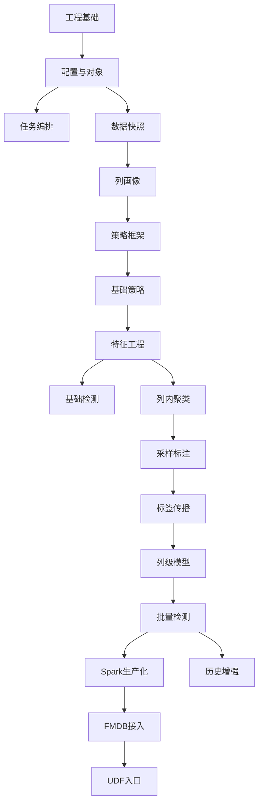
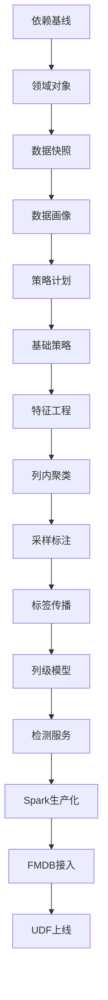

# Raha 数据检测功能模块与任务计划

## 1. 文档说明

### 1.1 文档目的

本文档依据 `Raha数据检测概要设计-202607141718.md`，将 Raha 数据检测工程拆分为可开发、可测试、可交付的功能模块，并给出模块优先级、依赖关系、任务清单、迭代顺序和验收门槛。

本文档用于后续：

- 创建研发任务和测试任务。
- 安排模块开发顺序和并行工作流。
- 明确每个阶段的交付物和完成标准。
- 控制工程范围，确保只实现数据检测，不进入数据纠正。
- 作为详细设计文档拆分和代码实现的任务索引。

### 1.2 设计依据

| 文档                                                                                    | 用途                      |
| ------------------------------------------------------------------------------------- | ----------------------- |
| `doc\\20260714\\Raha数据检测概要设计-202607141718.md`                                         | 功能模块和任务拆分的直接依据          |
| `doc\\20260714\\Raha-Java工程化与SparkUDF检测方案-202607141549.md`                            | Java、Spark、FMDB 和依赖约束依据 |
| `design\\raha-baran-fast.pdf`                                                         | 并行任务和只读中间结果设计依据         |
| `design\\baran-effective-error-correction-unified-context-transfer-learning-2020.pdf` | 上下文特征和历史迁移思路依据          |
| `F:\\ai-code\\raha\\raha-master\\raha\\detection.py`                                  | Raha Python demo 行为对齐依据 |

### 1.3 范围约束

所有任务必须遵循以下边界：

1. 工程只检测疑似错误单元格。
2. 工程不生成修复值、纠正候选或清洗后数据。
3. 工程不回写和覆盖输入表。
4. 主处理形态是表级 Spark 批处理。
5. UDF 只作为任务提交和平台适配入口。
6. `lib2.12` 目录不作为依赖来源。
7. 只从 `lib` 选择与 Spark 3.3.1、Scala 2.12 兼容的唯一依赖版本组合。

## 2. 优先级定义

| 优先级  | 定义           | 进入条件       | 完成目标                               |
| ---- | ------------ | ---------- | ---------------------------------- |
| `P0` | 阻塞性基础和最小检测闭环 | 项目启动后立即执行  | 能读取数据、运行基础策略、生成特征并输出可解释检测结果        |
| `P1` | Raha 核心学习能力  | `P0` 闭环稳定  | 补齐聚类、采样、标注、标签传播和列级模型               |
| `P2` | 生产化和平台接入     | `P1` 流程可验证 | 完成 Spark 并行、失败恢复、FMDB 适配、UDF、性能和安全 |
| `P3` | 增强和优化能力      | 生产主流程稳定    | 增加历史策略过滤、知识库、文本特征和算法对比             |

优先级判断原则：

- 没有该模块就无法形成检测闭环的任务归入 `P0`。
- 属于 Raha 论文核心学习流程，但可以在基础策略闭环之后补齐的任务归入 `P1`。
- 不改变核心检测语义，主要解决规模、平台和运维问题的任务归入 `P2`。
- 依赖外部资源、历史数据或额外算法验证的增强任务归入 `P3`。

## 3. 功能模块全景

### 3.1 模块依赖图



### 3.2 模块清单

| 模块编号  | 功能模块            | 优先级  | 主要依赖              | 核心交付物                    |
| ----- | --------------- | ---- | ----------------- | ------------------------ |
| `M01` | 工程骨架与依赖治理       | `P0` | 无                 | Maven 工程、POM、编码和测试基线     |
| `M02` | 配置与参数校验         | `P0` | `M01`             | 任务、策略、特征、模型和资源配置对象       |
| `M03` | 核心领域对象          | `P0` | `M01`             | 数据集、单元格、策略命中、特征、标签和结果对象  |
| `M04` | 任务编排与状态管理       | `P0` | `M02`、`M03`       | 任务状态机、阶段编排、幂等和重跑骨架       |
| `M05` | 数据读取与快照         | `P0` | `M02`、`M03`       | Spark 数据读取、稳定行标识、模式哈希和快照 |
| `M06` | 数据画像            | `P0` | `M05`             | 列类型、频率、长度、字符和分布画像        |
| `M07` | 中间结果与仓储接口       | `P0` | `M03`、`M04`       | 任务、策略、特征、标签、模型和结果仓储接口    |
| `M08` | 策略框架与策略计划       | `P0` | `M02`、`M06`、`M07` | 策略接口、策略生成器、稳定策略标识和计划表    |
| `M09` | `OD` 离群策略       | `P0` | `M06`、`M08`       | 频率、数值和分位数离群检测            |
| `M10` | `PVD` 模式策略      | `P0` | `M06`、`M08`       | 字符、长度、空值、类型和格式异常检测       |
| `M11` | `RVD` 关系策略      | `P0` | `M06`、`M08`       | 列对依赖、一对多和共现冲突检测          |
| `M12` | 特征工程            | `P0` | `M09`、`M10`、`M11` | 特征字典、稀疏向量和上下文基础特征        |
| `M13` | 基础检测与结果解释       | `P0` | `M12`、`M07`       | 规则加权检测、原因结构和检测结果表        |
| `M14` | 日志、指标与异常基础      | `P0` | `M04`             | 关联日志、阶段指标、错误编码和异常上下文     |
| `M15` | 基础测试与 Python 对齐 | `P0` | `M09` 至 `M14`     | 单元测试、端到端样例和 demo 对齐报告    |
| `M16` | 列内聚类            | `P1` | `M12`             | 聚类接口、层次聚类实现和聚类成员结果       |
| `M17` | 主动采样与标注任务       | `P1` | `M16`、`M07`       | 元组采样、标注预算和标注任务状态         |
| `M18` | 标签仓储与标签传播       | `P1` | `M16`、`M17`       | 直接标签、传播标签、冲突处理和来源追踪      |
| `M19` | 列级模型训练与预测       | `P1` | `M12`、`M18`       | 训练数据构建、分类器、阈值和预测器        |
| `M20` | 模型版本与发布管理       | `P1` | `M19`、`M07`       | 模型元数据、特征版本、发布和回滚         |
| `M21` | Raha 训练、采样和检测服务 | `P1` | `M16` 至 `M20`     | 三类业务服务和完整 Raha 流程        |
| `M22` | 评测服务            | `P1` | `M19`、`M21`       | 精确率、召回率、F1 和阈值评估         |
| `M23` | Spark 并行与资源治理   | `P2` | `M21`             | 策略级、列级、分区级并行和并发限制        |
| `M24` | 检查点、恢复与幂等增强     | `P2` | `M04`、`M07`、`M23` | 阶段检查点、断点续跑和重复结果去重        |
| `M25` | FMDB 数据与结果适配    | `P2` | `M07`、`M21`       | FMDB 读取、写入、模型存储和审计适配     |
| `M26` | FMDB UDF 入口     | `P2` | `M25`、`M21`       | 训练、检测和采样表级 UDF           |
| `M27` | 安全、脱敏与审计        | `P2` | `M14`、`M25`       | 敏感值保护、权限检查和操作审计          |
| `M28` | 性能、容量与稳定性       | `P2` | `M23`、`M24`       | 性能基准、大表测试、宽表测试和资源建议      |
| `M29` | 历史画像与策略过滤       | `P3` | `M06`、`M22`       | 历史字段画像、字段相似度和策略选择        |
| `M30` | `KBVD` 知识策略     | `P3` | `M08`、`M25`       | 字典、主数据和知识关系检测插件          |
| `M31` | 文本特征增强          | `P3` | `M12`、`M19`       | 文本列稀疏特征和一致性验证            |
| `M32` | 备选聚类与分类器        | `P3` | `M16`、`M19`、`M22` | 近似聚类、决策树和梯度提升对比          |

## 4. `P0` 功能模块

### 4.1 `M01` 工程骨架与依赖治理

#### 功能范围

- 创建单 Maven 工程和标准目录。
- 固定 Java 8、Spark 3.3.1 和 Scala 2.12 基线。
- 只从 `lib` 目录选择依赖。
- 排除 Spark 4 `_2.13` 和多版本重复 jar。
- 建立 UTF-8 无 BOM、LF、中文注释和日志规范。
- 建立单元测试、集成测试和构建命令。

#### 任务

| 任务编号   | 任务                      | 优先级  | 工作量 | 前置任务   | 验收结果              |
| ------ | ----------------------- | ---- | --- | ------ | ----------------- |
| `T001` | 创建 Maven 工程和包目录         | `P0` | `S` | 无      | 工程可编译，目录符合概要设计    |
| `T002` | 固定 JDK、Spark 和 Scala 版本 | `P0` | `S` | `T001` | POM 中版本唯一且集中管理    |
| `T003` | 盘点并建立本地 jar 白名单         | `P0` | `M` | `T002` | 不加载 Spark 4 和重复版本 |
| `T004` | 验证 MLlib 是否由平台提供        | `P0` | `M` | `T002` | 形成 MLlib 使用或降级结论  |
| `T005` | 建立编译、测试和依赖冲突检查          | `P0` | `M` | `T003` | 构建可自动发现重复类和版本冲突   |

#### 完成标准

- `mvn test` 可执行。
- classpath 不包含 `lib2.12` 目录。
- Spark 主组件只使用 3.3.1 `_2.12`。
- MLlib 可用性有明确结论和兜底方案。

### 4.2 `M02` 配置与参数校验

#### 功能范围

- 任务类型、数据源、行标识和结果位置配置。
- 策略族、策略上限、列白名单和列对上限配置。
- 特征、聚类、采样、标签传播和模型配置。
- Spark 并行、缓存、超时和失败容忍配置。
- 配置默认值、版本、序列化和校验错误编码。

#### 任务

| 任务编号   | 任务           | 优先级  | 工作量 | 前置任务          | 验收结果            |
| ------ | ------------ | ---- | --- | ------------- | --------------- |
| `T006` | 定义任务级配置对象    | `P0` | `M` | `T001`        | 支持评测、训练、采样和检测模式 |
| `T007` | 定义策略、特征和模型配置 | `P0` | `M` | `T006`        | 配置字段与概要设计一致     |
| `T008` | 定义资源和失败容忍配置  | `P0` | `S` | `T006`        | 支持并发、超时、重试和失败阈值 |
| `T009` | 实现配置校验器      | `P0` | `M` | `T007`、`T008` | 非法输入返回稳定错误编码    |
| `T010` | 实现配置版本和摘要哈希  | `P0` | `S` | `T007`        | 同一配置产生稳定版本标识    |

### 4.3 `M03` 核心领域对象

#### 功能范围

建立不依赖 FMDB 具体实现的核心对象：

- `RahaDataset`。
- `ColumnProfile`。
- `CellCoordinate` 和 `CellValue`。
- `StrategyPlan` 和 `StrategyHit`。
- `FeatureDictionary` 和 `SparseFeatureRow`。
- `CellLabel` 和 `ClusterAssignment`。
- `RahaColumnModel` 和 `DetectionResult`。
- `RahaJob` 和 `RahaStage`。

#### 任务

| 任务编号   | 任务            | 优先级  | 工作量 | 前置任务   | 验收结果          |
| ------ | ------------- | ---- | --- | ------ | ------------- |
| `T011` | 定义数据集、列和单元格对象 | `P0` | `M` | `T001` | 对象可定位到稳定单元格   |
| `T012` | 定义策略计划和命中对象   | `P0` | `M` | `T011` | 策略配置和命中原因可追溯  |
| `T013` | 定义特征、聚类和标签对象  | `P0` | `M` | `T011` | 支持稀疏特征和标签来源   |
| `T014` | 定义模型和检测结果对象   | `P0` | `M` | `T013` | 结果不含任何修复值字段   |
| `T015` | 定义任务、阶段和状态枚举  | `P0` | `S` | `T011` | 状态转换可以被任务编排使用 |

### 4.4 `M04` 任务编排与状态管理

#### 功能范围

- 创建任务和阶段。
- 管理任务状态和阶段状态。
- 控制阶段依赖和失败分支。
- 生成 `jobId`、`stageId`、`attemptId` 和幂等键。
- 为后续检查点和恢复预留接口。

#### 任务

| 任务编号   | 任务          | 优先级  | 工作量 | 前置任务          | 验收结果             |
| ------ | ----------- | ---- | --- | ------------- | ---------------- |
| `T016` | 实现任务状态机     | `P0` | `M` | `T015`        | 非法状态跳转被拒绝        |
| `T017` | 实现阶段编排接口    | `P0` | `L` | `T016`、`T009` | 可串联读取、策略、特征和检测阶段 |
| `T018` | 实现任务幂等键     | `P0` | `M` | `T010`、`T016` | 重复提交可识别同一请求      |
| `T019` | 实现阶段失败和终止规则 | `P0` | `M` | `T017`        | 支持失败阈值和可恢复状态     |

### 4.5 `M05` 数据读取与快照

#### 功能范围

- 通过抽象接口读取 Spark `Dataset<Row>`。
- 识别和校验稳定行标识。
- 生成输入快照和模式哈希。
- 统一字段类型和可检测字段集合。
- 禁止在检测流程中修改原始输入数据。

#### 任务

| 任务编号   | 任务           | 优先级  | 工作量 | 前置任务   | 验收结果                 |
| ------ | ------------ | ---- | --- | ------ | -------------------- |
| `T020` | 定义数据加载接口     | `P0` | `S` | `T011` | 核心层不依赖 FMDB 具体类      |
| `T021` | 实现文件或测试数据加载器 | `P0` | `M` | `T020` | 本地测试数据可读取为 Spark 数据集 |
| `T022` | 实现行标识校验      | `P0` | `M` | `T021` | 缺失和重复行标识可被发现         |
| `T023` | 实现模式哈希和快照元数据 | `P0` | `M` | `T021` | 相同模式产生稳定哈希           |
| `T024` | 实现值哈希和脱敏基础工具 | `P0` | `M` | `T011` | 日志和结果可避免暴露完整敏感值      |

### 4.6 `M06` 数据画像

#### 功能范围

- 空值和非空率画像。
- 不同值数量、值频率和重复率画像。
- 数值统计和分位数画像。
- 字符集合、长度和类型比例画像。
- 模式摘要和策略生成所需的列元数据。

#### 任务

| 任务编号   | 任务           | 优先级  | 工作量 | 前置任务          | 验收结果           |
| ------ | ------------ | ---- | --- | ------------- | -------------- |
| `T025` | 实现基础列画像      | `P0` | `M` | `T021`        | 输出行数、空值和不同值统计  |
| `T026` | 实现数值和分位数画像   | `P0` | `M` | `T025`        | 可识别数值列及长尾分布    |
| `T027` | 实现字符、长度和类型画像 | `P0` | `L` | `T025`        | 为 `PVD` 生成稳定画像 |
| `T028` | 实现画像持久化接口    | `P0` | `M` | `T025`、`T027` | 画像可按快照和列读取     |

### 4.7 `M07` 中间结果与仓储接口

#### 功能范围

定义并实现开发期仓储接口，后续由 FMDB 适配替换或扩展：

- 任务仓储。
- 阶段仓储。
- 策略计划和策略命中仓储。
- 特征字典和特征仓储。
- 聚类、采样和标签仓储。
- 模型元数据和检测结果仓储。

#### 任务

| 任务编号   | 任务            | 优先级  | 工作量 | 前置任务            | 验收结果            |
| ------ | ------------- | ---- | --- | --------------- | --------------- |
| `T029` | 定义统一仓储接口和事务边界 | `P0` | `L` | `T011` 至 `T015` | 核心服务只依赖仓储接口     |
| `T030` | 实现开发期文件或内存仓储  | `P0` | `M` | `T029`          | 本地端到端流程可保存中间结果  |
| `T031` | 实现结果主键和去重规则   | `P0` | `M` | `T029`          | 同一批次重写不产生重复有效记录 |
| `T032` | 实现中间结果版本字段    | `P0` | `M` | `T029`          | 结果可追溯配置、快照和阶段版本 |

### 4.8 `M08` 策略框架与策略计划

#### 功能范围

- 统一 `DetectionStrategy` 接口。
- 统一策略输入、输出、日志、超时和异常语义。
- 根据画像生成策略配置。
- 生成确定性的 `strategyId`。
- 支持策略白名单、黑名单、上限和优先级。

#### 任务

| 任务编号   | 任务           | 优先级  | 工作量 | 前置任务          | 验收结果           |
| ------ | ------------ | ---- | --- | ------------- | -------------- |
| `T033` | 定义策略接口和执行上下文 | `P0` | `M` | `T012`、`T029` | 所有策略使用统一契约     |
| `T034` | 实现策略计划生成器    | `P0` | `L` | `T027`、`T033` | 相同画像和配置生成相同计划  |
| `T035` | 实现策略标识和配置哈希  | `P0` | `S` | `T034`        | 策略结果可稳定去重      |
| `T036` | 实现策略超时和失败隔离  | `P0` | `M` | `T033`、`T019` | 单策略失败不会破坏状态一致性 |
| `T037` | 实现策略运行摘要     | `P0` | `M` | `T033`        | 输出命中数、耗时和失败原因  |

### 4.9 `M09` `OD` 离群策略

#### 功能范围

- 低频值和频率桶异常。
- 数值均值和标准差距离异常。
- 分位数和四分位距异常。
- 阈值配置组合和画像适用性判断。

#### 任务

| 任务编号   | 任务           | 优先级  | 工作量 | 前置任务            | 验收结果              |
| ------ | ------------ | ---- | --- | --------------- | ----------------- |
| `T038` | 实现值频和低频策略    | `P0` | `M` | `T033`、`T025`   | 可输出低频候选及原因        |
| `T039` | 实现数值距离策略     | `P0` | `M` | `T026`、`T033`   | 可输出数值离群候选及分数      |
| `T040` | 实现分位数离群策略    | `P0` | `M` | `T026`、`T033`   | 长尾数据具备稳定检测行为      |
| `T041` | 完成 `OD` 单元测试 | `P0` | `M` | `T038` 至 `T040` | 覆盖正常、离群、空值和不可解析场景 |

### 4.10 `M10` `PVD` 模式策略

#### 功能范围

- 字符集合异常。
- 长度异常。
- 空值、空白值和特殊占位值异常。
- 数字、字母、中文和符号类型异常。
- 可配置日期、时间、电话和编号格式检测。

#### 任务

| 任务编号   | 任务            | 优先级  | 工作量 | 前置任务            | 验收结果          |
| ------ | ------------- | ---- | --- | --------------- | ------------- |
| `T042` | 实现字符集合策略      | `P0` | `M` | `T027`、`T033`   | 可识别列内少数字符模式   |
| `T043` | 实现长度异常策略      | `P0` | `M` | `T027`、`T033`   | 可识别长度分布异常     |
| `T044` | 实现空值和占位值策略    | `P0` | `M` | `T025`、`T033`   | 区分空值、空白和特殊占位值 |
| `T045` | 实现类型和格式策略     | `P0` | `L` | `T027`、`T033`   | 输出类型或格式异常原因   |
| `T046` | 完成 `PVD` 单元测试 | `P0` | `M` | `T042` 至 `T045` | 覆盖多字符类型和空值边界  |

### 4.11 `M11` `RVD` 关系策略

#### 功能范围

- 枚举允许的单列到单列依赖。
- 检测同一左值对应多个右值的冲突。
- 输出目标单元格、依赖方向和冲突统计。
- 控制宽表列对数量和执行成本。

#### 任务

| 任务编号   | 任务            | 优先级  | 工作量 | 前置任务          | 验收结果           |
| ------ | ------------- | ---- | --- | ------------- | -------------- |
| `T047` | 实现列对筛选和上限控制   | `P0` | `M` | `T034`、`T027` | 宽表不会无限枚举列对     |
| `T048` | 实现一对多冲突检测     | `P0` | `L` | `T033`、`T047` | 可定位依赖冲突单元格     |
| `T049` | 实现冲突分数和原因结构   | `P0` | `M` | `T048`        | 结果可解释冲突规模和方向   |
| `T050` | 完成 `RVD` 单元测试 | `P0` | `M` | `T048`、`T049` | 覆盖唯一映射、冲突和空值场景 |

### 4.12 `M12` 特征工程

#### 功能范围

- 将策略命中转换成单元格二值特征。
- 生成策略族命中数量和分数摘要。
- 生成值长度、字符类型和值频率桶等上下文基础特征。
- 删除无区分度特征。
- 生成稳定特征字典和稀疏向量。

#### 任务

| 任务编号   | 任务         | 优先级  | 工作量 | 前置任务            | 验收结果           |
| ------ | ---------- | ---- | --- | --------------- | -------------- |
| `T051` | 实现策略命中特征组装 | `P0` | `L` | `T038` 至 `T050` | 每个单元格可生成策略二值向量 |
| `T052` | 实现上下文基础特征  | `P0` | `L` | `T025` 至 `T027` | 生成值和列内上下文特征    |
| `T053` | 实现无区分度特征过滤 | `P0` | `M` | `T051`、`T052`   | 全零和常量特征被移除     |
| `T054` | 实现特征字典和版本  | `P0` | `M` | `T053`、`T032`   | 训练和检测可使用同一字典   |
| `T055` | 实现稀疏向量持久化  | `P0` | `L` | `T054`、`T029`   | 特征可按列和批次读取     |

### 4.13 `M13` 基础检测与结果解释

#### 功能范围

在列级机器学习模型完成前，使用规则加权融合作为最小检测闭环：

- 按策略族和策略可靠度计算候选分数。
- 使用配置阈值输出 `isError`。
- 输出命中策略、原因、特征摘要和版本。
- 明确标记 `fallback` 或 `weighted_rule` 模型类型。

#### 任务

| 任务编号   | 任务         | 优先级  | 工作量 | 前置任务          | 验收结果           |
| ------ | ---------- | ---- | --- | ------------- | -------------- |
| `T056` | 定义基础检测评分规则 | `P0` | `M` | `T051`、`T052` | 评分规则可配置和解释     |
| `T057` | 实现基础检测服务   | `P0` | `L` | `T056`、`T055` | 输入表可输出单元格检测结果  |
| `T058` | 实现结果解释服务   | `P0` | `M` | `T037`、`T057` | 结果可反查策略和原因     |
| `T059` | 实现检测结果持久化  | `P0` | `M` | `T057`、`T029` | 结果包含任务、快照和版本信息 |
| `T060` | 校验结果不含纠正字段 | `P0` | `S` | `T059`        | 对象、表和接口均无修复值   |

### 4.14 `M14` 日志、指标与异常基础

#### 功能范围

- 建立统一日志上下文。
- 记录任务和阶段开始、结束、耗时和摘要。
- 记录外部数据访问和异常堆栈。
- 建立错误编码和异常分类。
- 记录策略、特征和检测指标。

#### 任务

| 任务编号   | 任务          | 优先级  | 工作量 | 前置任务          | 验收结果              |
| ------ | ----------- | ---- | --- | ------------- | ----------------- |
| `T061` | 定义日志上下文字段   | `P0` | `S` | `T016`        | 日志包含任务、阶段和尝试标识    |
| `T062` | 定义错误编码和异常层次 | `P0` | `M` | `T009`、`T019` | 异常可区分参数、数据、策略和存储  |
| `T063` | 接入任务和阶段关键日志 | `P0` | `M` | `T017`、`T061` | 核心路径有开始、关键分支和结束日志 |
| `T064` | 接入策略和检测指标   | `P0` | `M` | `T037`、`T059` | 可统计命中数、失败数和检测数    |
| `T065` | 建立敏感值日志检查   | `P0` | `S` | `T024`、`T063` | 日志不直接输出完整敏感值      |

### 4.15 `M15` 基础测试与 Python 对齐

#### 功能范围

- 建立固定小型脏数据集和真值数据集。
- 对齐 Python demo 的策略生成和特征语义。
- 完成基础策略、特征和检测闭环测试。
- 输出差异说明和已知偏差。

#### 任务

| 任务编号   | 任务                  | 优先级  | 工作量 | 前置任务                        | 验收结果            |
| ------ | ------------------- | ---- | --- | --------------------------- | --------------- |
| `T066` | 准备固定测试数据集           | `P0` | `M` | `T021`                      | 覆盖缺失、格式、离群和依赖冲突 |
| `T067` | 建立 Python demo 基线输出 | `P0` | `M` | `T066`                      | 保存策略、特征和检测基线    |
| `T068` | 完成基础策略对齐测试          | `P0` | `L` | `T041`、`T046`、`T050`、`T067` | 差异有可解释结论        |
| `T069` | 完成端到端检测测试           | `P0` | `L` | `T057`、`T059`               | Spark 本地模式可完整运行 |
| `T070` | 输出 `P0` 验收报告        | `P0` | `M` | `T068`、`T069`               | 确认检测、定位、解释和复跑成立 |

## 5. `P1` 功能模块

### 5.1 `M16` 列内聚类

#### 功能范围

- 定义列聚类统一接口。
- 实现小表层次聚类。
- 支持余弦距离、簇数量和随机种子配置。
- 保存单元格到聚类的映射和聚类版本。
- 处理空特征、单样本和距离不可计算场景。

#### 任务

| 任务编号   | 任务           | 优先级  | 工作量 | 前置任务          | 验收结果         |
| ------ | ------------ | ---- | --- | ------------- | ------------ |
| `T071` | 定义列聚类接口      | `P1` | `M` | `T055`        | 聚类实现可替换      |
| `T072` | 实现层次聚类版本     | `P1` | `L` | `T071`        | 小表聚类结果可复现    |
| `T073` | 实现聚类成员持久化    | `P1` | `M` | `T072`、`T029` | 可按列和版本读取聚类成员 |
| `T074` | 实现聚类异常和空结果处理 | `P1` | `M` | `T072`        | 异常列不导致无说明失败  |

### 5.2 `M17` 主动采样与标注任务

#### 功能范围

- 根据聚类标签覆盖程度给元组评分。
- 按标注预算选择待标注元组。
- 生成标注任务和状态。
- 避免重复采样已经标注的元组。
- 保持随机种子可复现。

#### 任务

| 任务编号   | 任务         | 优先级  | 工作量 | 前置任务          | 验收结果           |
| ------ | ---------- | ---- | --- | ------------- | -------------- |
| `T075` | 实现聚类覆盖评分   | `P1` | `L` | `T073`        | 低标签聚类获得更高采样分数  |
| `T076` | 实现元组采样器    | `P1` | `M` | `T075`        | 在预算内输出不重复元组    |
| `T077` | 实现标注任务状态   | `P1` | `M` | `T029`、`T076` | 支持待标注、完成、过期和取消 |
| `T078` | 实现真值自动标注适配 | `P1` | `M` | `T077`        | 仅评测模式可由真值生成标签  |

### 5.3 `M18` 标签仓储与标签传播

#### 功能范围

- 保存人工、真值、规则确认和传播标签。
- 实现 `homogeneity` 同质性传播。
- 实现 `majority` 多数传播。
- 记录标签冲突、来源、置信度和权重。
- 保证传播标签不覆盖直接标签。

#### 任务

| 任务编号   | 任务        | 优先级  | 工作量 | 前置任务            | 验收结果          |
| ------ | --------- | ---- | --- | --------------- | ------------- |
| `T079` | 实现标签仓储    | `P1` | `M` | `T029`、`T077`   | 标签来源和版本可追溯    |
| `T080` | 实现同质性传播   | `P1` | `M` | `T073`、`T079`   | 簇内标签一致时正确传播   |
| `T081` | 实现多数传播    | `P1` | `M` | `T073`、`T079`   | 冲突时记录多数比例     |
| `T082` | 实现传播冲突和权重 | `P1` | `M` | `T080`、`T081`   | 传播标签权重低于直接标签  |
| `T083` | 完成标签传播测试  | `P1` | `M` | `T080` 至 `T082` | 覆盖一致、冲突和无标签场景 |

### 5.4 `M19` 列级模型训练与预测

#### 功能范围

- 按列构造训练集。
- 处理正负类别不平衡。
- 首选 Spark MLlib 逻辑回归。
- 支持无 MLlib 时规则加权降级。
- 按列输出错误分数和阈值判断。
- 处理单类别和无有效特征场景。

#### 任务

| 任务编号   | 任务          | 优先级  | 工作量 | 前置任务                 | 验收结果             |
| ------ | ----------- | ---- | --- | -------------------- | ---------------- |
| `T084` | 实现列级训练数据构建  | `P1` | `L` | `T055`、`T079`、`T082` | 标签和特征可按列关联       |
| `T085` | 实现类别权重和样本权重 | `P1` | `M` | `T084`               | 直接标签与传播标签权重可区分   |
| `T086` | 实现逻辑回归训练器   | `P1` | `L` | `T004`、`T084`        | MLlib 可用时完成列级训练  |
| `T087` | 实现规则加权降级训练器 | `P1` | `M` | `T056`、`T084`        | MLlib 不可用时闭环仍可运行 |
| `T088` | 实现列级预测器     | `P1` | `L` | `T086` 或 `T087`      | 输出分数、阈值和模型类型     |
| `T089` | 实现不可训练列处理   | `P1` | `M` | `T084`、`T088`        | 单类别和空特征列不会生成伪模型  |

### 5.5 `M20` 模型版本与发布管理

#### 功能范围

- 保存列级模型、特征字典、策略计划和模式哈希关系。
- 管理草稿、候选、已发布和已停用状态。
- 支持模型发布、停用和回滚。
- 检测前校验模型与输入模式兼容性。

#### 任务

| 任务编号   | 任务          | 优先级  | 工作量 | 前置任务                 | 验收结果         |
| ------ | ----------- | ---- | --- | -------------------- | ------------ |
| `T090` | 实现模型元数据仓储   | `P1` | `M` | `T029`、`T088`        | 模型版本和依赖版本可追溯 |
| `T091` | 实现模型文件保存和加载 | `P1` | `L` | `T086`、`T090`        | 模型可重启后加载预测   |
| `T092` | 实现发布状态机     | `P1` | `M` | `T090`               | 只有已发布模型可生产使用 |
| `T093` | 实现模式和特征兼容校验 | `P1` | `M` | `T023`、`T054`、`T090` | 不兼容模型被拒绝加载   |
| `T094` | 实现模型回滚      | `P1` | `M` | `T092`               | 可切回前一个已发布版本  |

### 5.6 `M21` Raha 训练、采样和检测服务

#### 功能范围

- `RahaTrainService` 编排策略、特征、标签传播和模型训练。
- `RahaSampleService` 编排聚类和采样任务。
- `RahaDetectService` 加载已发布模型并执行批量预测。
- 服务输出统一任务结果和阶段摘要。

#### 任务

| 任务编号   | 任务       | 优先级  | 工作量 | 前置任务            | 验收结果         |
| ------ | -------- | ---- | --- | --------------- | ------------ |
| `T095` | 实现训练服务   | `P1` | `L` | `T084` 至 `T093` | 可产出候选列级模型    |
| `T096` | 实现采样服务   | `P1` | `M` | `T075` 至 `T079` | 可生成待标注任务     |
| `T097` | 实现检测服务   | `P1` | `L` | `T088`、`T093`   | 可使用已发布模型批量检测 |
| `T098` | 实现统一任务结果 | `P1` | `M` | `T095` 至 `T097` | 返回状态、结果位置和摘要 |

### 5.7 `M22` 评测服务

#### 功能范围

- 读取脏表和真值表。
- 计算单元格级精确率、召回率、F1 和平均精确率。
- 比较采样预算、传播方式、分类器和阈值。
- 输出 Python demo 对齐报告。

#### 任务

| 任务编号   | 任务             | 优先级  | 工作量 | 前置任务            | 验收结果             |
| ------ | -------------- | ---- | --- | --------------- | ---------------- |
| `T099` | 实现真值差异计算       | `P1` | `M` | `T078`          | 可生成单元格真值标签       |
| `T100` | 实现检测指标计算       | `P1` | `M` | `T097`、`T099`   | 输出精确率、召回率和 F1    |
| `T101` | 实现阈值对比         | `P1` | `M` | `T100`          | 可选择候选阈值并写模型元数据   |
| `T102` | 完成 Raha 流程对齐测试 | `P1` | `L` | `T095` 至 `T101` | 策略、聚类、传播和检测差异可解释 |
| `T103` | 输出 `P1` 验收报告   | `P1` | `M` | `T102`          | Raha 核心学习流程验收通过  |

## 6. `P2` 功能模块

### 6.1 `M23` Spark 并行与资源治理

#### 功能范围

- 策略配置级并行。
- 列级特征、聚类、训练和预测并行。
- 大列分区或块级预测。
- 小型配置和字典广播。
- 缓存、持久化、并发和超时控制。

#### 任务

| 任务编号   | 任务          | 优先级  | 工作量 | 前置任务            | 验收结果            |
| ------ | ----------- | ---- | --- | --------------- | --------------- |
| `T104` | 实现策略级并行执行   | `P2` | `L` | `T037`、`T102`   | 多策略并发且结果幂等      |
| `T105` | 实现列级特征和聚类并行 | `P2` | `L` | `T055`、`T073`   | 列任务独立执行并可限流     |
| `T106` | 实现列级训练和预测并行 | `P2` | `L` | `T095`、`T097`   | 多列模型任务可并发       |
| `T107` | 实现分区和块级预测   | `P2` | `L` | `T106`          | 大列预测不收集到 Driver |
| `T108` | 实现缓存和广播大小控制 | `P2` | `M` | `T104` 至 `T107` | 超过上限的数据不广播      |
| `T109` | 实现并发和资源限流   | `P2` | `M` | `T104` 至 `T107` | 可配置最大策略和列并发数    |

### 6.2 `M24` 检查点、恢复与幂等增强

#### 功能范围

- 每阶段保存输入版本、输出位置、摘要和状态。
- 成功阶段在版本一致时复用。
- 失败阶段支持重试和新尝试记录。
- 防止重复有效结果和模型版本污染。

#### 任务

| 任务编号   | 任务          | 优先级  | 工作量 | 前置任务            | 验收结果        |
| ------ | ----------- | ---- | --- | --------------- | ----------- |
| `T110` | 实现阶段检查点     | `P2` | `L` | `T017`、`T032`   | 阶段输出和摘要可恢复  |
| `T111` | 实现阶段复用判断    | `P2` | `M` | `T110`          | 版本一致时跳过重复计算 |
| `T112` | 实现失败重试和尝试记录 | `P2` | `M` | `T019`、`T110`   | 每次尝试可审计     |
| `T113` | 实现部分策略失败恢复  | `P2` | `L` | `T104`、`T112`   | 可只重跑失败策略    |
| `T114` | 完成幂等和恢复测试   | `P2` | `L` | `T110` 至 `T113` | 重跑不产生重复有效记录 |

### 6.3 `M25` FMDB 数据与结果适配

#### 功能范围

- FMDB 表和 SQL 数据读取。
- FMDB 模式、字段和行标识解析。
- 任务、中间结果、模型元数据和检测结果写入。
- 模型文件和特征字典存储。
- FMDB 外部调用日志和异常处理。

#### 任务

| 任务编号   | 任务                 | 优先级  | 工作量 | 前置任务            | 验收结果                 |
| ------ | ------------------ | ---- | --- | --------------- | -------------------- |
| `T115` | 确认 FMDB jar 唯一版本组合 | `P2` | `M` | `T003`          | 形成可运行 classpath 清单   |
| `T116` | 实现 FMDB 数据加载器      | `P2` | `L` | `T020`、`T115`   | FMDB 表可读取为 Spark 数据集 |
| `T117` | 实现 FMDB 结果写入器      | `P2` | `L` | `T029`、`T115`   | 任务和检测结果可落表           |
| `T118` | 实现 FMDB 模型存储       | `P2` | `L` | `T091`、`T115`   | 模型和字典可保存与加载          |
| `T119` | 完成 FMDB 适配集成测试     | `P2` | `L` | `T116` 至 `T118` | 训练和检测可在 FMDB 环境运行    |

### 6.4 `M26` FMDB UDF 入口

#### 功能范围

- `F_DW_RAHATRAIN`。
- `F_DW_RAHADETECT`。
- `F_DW_RAHASAMPLE`。
- 参数解析、权限校验、任务提交和统一结果返回。
- 禁止单元格即时 Raha 检测入口。

#### 任务

| 任务编号   | 任务               | 优先级  | 工作量 | 前置任务                 | 验收结果           |
| ------ | ---------------- | ---- | --- | -------------------- | -------------- |
| `T120` | 确认 UDF 同步或异步调用语义 | `P2` | `S` | `T119`               | 接口返回契约确定       |
| `T121` | 实现训练 UDF         | `P2` | `M` | `T095`、`T119`、`T120` | 可提交训练任务并返回任务信息 |
| `T122` | 实现检测 UDF         | `P2` | `M` | `T097`、`T119`、`T120` | 可提交表级检测任务      |
| `T123` | 实现采样 UDF         | `P2` | `M` | `T096`、`T119`、`T120` | 可生成标注任务        |
| `T124` | 完成 UDF 参数和异常测试   | `P2` | `M` | `T121` 至 `T123`      | 非法参数和失败结果可追溯   |

### 6.5 `M27` 安全、脱敏与审计

#### 功能范围

- 输入表、结果表和模型目录权限检查。
- 日志和结果中的值脱敏。
- 标注任务最小字段展示。
- 任务提交、模型发布和结果访问审计。
- 结果保留和过期清理。

#### 任务

| 任务编号   | 任务          | 优先级  | 工作量 | 前置任务                   | 验收结果           |
| ------ | ----------- | ---- | --- | ---------------------- | -------------- |
| `T125` | 实现权限校验适配接口  | `P2` | `M` | `T116`、`T117`          | 无权限任务被拒绝       |
| `T126` | 实现结果值脱敏策略   | `P2` | `M` | `T024`、`T117`          | 敏感值按配置保存哈希或脱敏值 |
| `T127` | 实现任务和模型审计   | `P2` | `M` | `T092`、`T121` 至 `T123` | 提交、发布和停用操作可追溯  |
| `T128` | 实现结果保留和清理策略 | `P2` | `M` | `T117`                 | 过期中间结果可按规则清理   |

### 6.6 `M28` 性能、容量与稳定性

#### 功能范围

- 小表、中表、大表和宽表基准。
- 低错误率和高错误率数据测试。
- 策略数、列数、行数和特征数容量曲线。
- Driver、Executor、内存、磁盘和网络指标。
- 并发数、缓存和分区参数建议。

#### 任务

| 任务编号   | 任务               | 优先级  | 工作量 | 前置任务                 | 验收结果            |
| ------ | ---------------- | ---- | --- | -------------------- | --------------- |
| `T129` | 建立性能基准数据集        | `P2` | `M` | `T066`               | 覆盖规模和错误率维度      |
| `T130` | 建立阶段耗时和资源基线      | `P2` | `L` | `T104` 至 `T109`      | 输出各阶段耗时和资源占用    |
| `T131` | 完成宽表和 `RVD` 压力测试 | `P2` | `L` | `T047`、`T109`        | 列对上限和限流有效       |
| `T132` | 完成大表和恢复测试        | `P2` | `L` | `T107`、`T114`        | 大表可运行且失败可恢复     |
| `T133` | 输出生产资源建议         | `P2` | `M` | `T130` 至 `T132`      | 给出分区、并发、缓存和保留建议 |
| `T134` | 输出 `P2` 生产验收报告   | `P2` | `M` | `T119`、`T124`、`T133` | FMDB 生产流程达到上线条件 |

## 7. `P3` 功能模块

### 7.1 `M29` 历史画像与策略过滤

#### 功能范围

- 保存历史列画像和策略有效性指标。
- 计算新列与历史列的相似度。
- 为新数据集选择更有希望的策略。
- 记录被选择和被过滤策略的原因。
- 对比过滤前后的运行时间和检测质量。

#### 任务

| 任务编号   | 任务         | 优先级  | 工作量 | 前置任务          | 验收结果        |
| ------ | ---------- | ---- | --- | ------------- | ----------- |
| `T135` | 定义历史画像模型   | `P3` | `M` | `T028`、`T100` | 可保存列画像和策略效果 |
| `T136` | 实现字段相似度    | `P3` | `L` | `T135`        | 新列可匹配历史相似列  |
| `T137` | 实现策略过滤器    | `P3` | `L` | `T034`、`T136` | 可按历史得分选择策略  |
| `T138` | 完成策略过滤对比评测 | `P3` | `L` | `T137`、`T100` | 输出耗时和 F1 变化 |

### 7.2 `M30` `KBVD` 知识策略

#### 功能范围

- 定义知识库和字典适配接口。
- 支持版本化本地字典或主数据快照。
- 支持字段到知识实体的映射。
- 区分未命中、冲突和外部查询失败。
- 防止外部知识库失败导致全列误报。

#### 任务

| 任务编号   | 任务         | 优先级  | 工作量 | 前置任务          | 验收结果         |
| ------ | ---------- | ---- | --- | ------------- | ------------ |
| `T139` | 定义知识策略接口   | `P3` | `M` | `T033`        | 外部知识源可插拔     |
| `T140` | 实现版本化字典策略  | `P3` | `L` | `T139`、`T116` | 字典不命中可生成候选信号 |
| `T141` | 实现知识策略失败隔离 | `P3` | `M` | `T036`、`T140` | 外部失败不产生全列误报  |
| `T142` | 完成知识策略评测   | `P3` | `M` | `T140`、`T141` | 输出准确性和运行成本   |

### 7.3 `M31` 文本特征增强

#### 功能范围

- 识别适用文本列。
- 生成文本稀疏特征。
- 固化词表、停用词、规范化和特征版本。
- 控制高维特征和内存占用。
- 对比是否提升检测效果。

#### 任务

| 任务编号   | 任务          | 优先级  | 工作量 | 前置任务          | 验收结果          |
| ------ | ----------- | ---- | --- | ------------- | ------------- |
| `T143` | 定义文本列适用规则   | `P3` | `S` | `T027`        | 只有适用列进入文本特征流程 |
| `T144` | 实现文本稀疏特征    | `P3` | `L` | `T054`、`T143` | 词表和向量可版本化     |
| `T145` | 实现高维限制和降维配置 | `P3` | `M` | `T144`        | 特征规模受控        |
| `T146` | 完成文本特征对比评测  | `P3` | `M` | `T100`、`T144` | 明确效果收益和资源成本   |

### 7.4 `M32` 备选聚类与分类器

#### 功能范围

- Spark 近似聚类实现。
- 决策树和梯度提升分类器。
- 算法参数、随机种子和模型版本管理。
- 与默认层次聚类和逻辑回归进行效果及性能对比。

#### 任务

| 任务编号   | 任务            | 优先级  | 工作量 | 前置任务                   | 验收结果                   |
| ------ | ------------- | ---- | --- | ---------------------- | ---------------------- |
| `T147` | 实现 Spark 近似聚类 | `P3` | `L` | `T071`、`T105`          | 大表聚类可分布式执行             |
| `T148` | 实现决策树分类器      | `P3` | `M` | `T086`                 | 可作为列级模型候选              |
| `T149` | 实现梯度提升分类器     | `P3` | `L` | `T086`                 | 与 Python demo 集成模型思路对比 |
| `T150` | 完成算法效果和性能对比   | `P3` | `L` | `T100`、`T147` 至 `T149` | 给出生产算法选择建议             |

## 8. 里程碑计划

### 8.1 里程碑总表

| 里程碑   | 优先级  | 主要任务            | 交付目标          | 退出条件                 |
| ----- | ---- | --------------- | ------------- | -------------------- |
| `MS0` | `P0` | `T001` 至 `T010` | 工程和依赖基线       | 工程可编译，版本和 MLlib 路径明确 |
| `MS1` | `P0` | `T011` 至 `T037` | 数据、任务、仓储和策略框架 | 可读取数据并生成可执行策略计划      |
| `MS2` | `P0` | `T038` 至 `T070` | 最小检测闭环        | 可输出可解释单元格检测结果        |
| `MS3` | `P1` | `T071` 至 `T103` | Raha 学习闭环     | 聚类、采样、传播、模型和评测可运行    |
| `MS4` | `P2` | `T104` 至 `T114` | Spark 并行和恢复   | 并行任务可限流、幂等和断点续跑      |
| `MS5` | `P2` | `T115` 至 `T134` | FMDB 生产接入     | UDF、权限、性能和生产验收完成     |
| `MS6` | `P3` | `T135` 至 `T150` | 检测增强          | 历史、知识、文本和备选算法有评测结论   |

### 8.2 推荐迭代顺序

以下计划按一个迭代约 10 个工作日组织，不绑定具体人员和自然日期。实际排期应在确认团队规模、FMDB 环境和 MLlib 可用性后调整。

| 迭代    | 目标                | 建议包含任务          | 可并行工作            |
| ----- | ----------------- | --------------- | ---------------- |
| 迭代 1  | 工程、依赖、配置和领域对象     | `T001` 至 `T015` | 依赖治理与对象设计可并行     |
| 迭代 2  | 任务编排、数据快照、画像和仓储   | `T016` 至 `T032` | 画像与仓储接口可并行       |
| 迭代 3  | 策略框架、`OD` 和 `PVD` | `T033` 至 `T046` | `OD` 与 `PVD` 可并行 |
| 迭代 4  | `RVD`、特征和基础检测     | `T047` 至 `T065` | `RVD` 与特征骨架可部分并行 |
| 迭代 5  | 基础对齐测试和聚类采样       | `T066` 至 `T078` | 对齐测试与聚类开发可并行     |
| 迭代 6  | 标签传播、列级模型和版本管理    | `T079` 至 `T094` | 标签传播与模型仓储可并行     |
| 迭代 7  | Raha 服务和评测闭环      | `T095` 至 `T103` | 训练、采样、检测服务可分工    |
| 迭代 8  | Spark 并行、检查点和恢复   | `T104` 至 `T114` | 并行执行与恢复机制可并行     |
| 迭代 9  | FMDB 适配和 UDF      | `T115` 至 `T124` | 读取、写入、模型存储可并行    |
| 迭代 10 | 安全、性能和生产验收        | `T125` 至 `T134` | 安全审计与性能测试可并行     |
| 后续迭代  | 历史和算法增强           | `T135` 至 `T150` | 四个 `P3` 模块可独立排期  |

### 8.3 关键路径



关键路径上的任务不能用临时接口长期占位。尤其是行标识、特征字典、模型版本和结果主键，一旦后期变更会影响全部下游模块。

## 9. 并行开发建议

### 9.1 工作流划分

| 工作流        | 主要模块                    | 可以开始的条件     |
| ---------- | ----------------------- | ----------- |
| 工程与平台流     | `M01`、`M04`、`M07`、`M14` | 项目启动即可开始    |
| 数据与画像流     | `M03`、`M05`、`M06`       | 核心对象初版完成    |
| 策略与特征流     | `M08` 至 `M12`           | 画像接口和策略接口稳定 |
| 学习算法流      | `M16` 至 `M22`           | 特征对象和字典稳定   |
| Spark 生产化流 | `M23`、`M24`、`M28`       | Raha 服务流程稳定 |
| FMDB 接入流   | `M25` 至 `M27`           | 仓储和服务接口稳定   |
| 增强流        | `M29` 至 `M32`           | 评测服务和生产基线完成 |

### 9.2 接口先行要求

以下接口应在实现前先完成详细设计和评审：

- `RahaDatasetLoader`。
- `DetectionStrategy`。
- `FeatureAssembler`。
- `ColumnClusterer`。
- `LabelRepository`。
- `ModelTrainer` 和 `ModelPredictor`。
- `ModelRepository`。
- `FmdbDatasetLoader` 和 `FmdbResultWriter`。
- 三个表级 UDF 的请求和返回结构。

接口评审通过后，不应在没有兼容方案的情况下频繁修改字段语义。

## 10. 工作量标识

任务表中的工作量是相对估算，不代表最终人日承诺：

| 标识  | 参考范围      | 说明                  |
| --- | --------- | ------------------- |
| `S` | 1 至 2 人日  | 单一对象、单一配置或小范围测试     |
| `M` | 3 至 5 人日  | 一个完整功能点及对应测试        |
| `L` | 6 至 10 人日 | 跨对象、Spark 计算或复杂集成任务 |

以下情况需要重新估算：

- FMDB 接口资料和运行环境不完整。
- MLlib 需要额外补包或处理复杂冲突。
- 行标识无法由输入表稳定提供。
- 聚类算法需要从零实现分布式版本。
- 人工标注需要新建前端或外部系统。
- 知识库需要实时远程调用而非本地快照。

## 11. 全局完成标准

每个任务只有同时满足以下条件才可以标记完成：

1. 代码实现符合模块边界，没有引入数据纠正逻辑。
2. 新增和修改注释使用中文简体。
3. 关键路径、外部调用和异常处理具备日志。
4. 核心对象、私有变量和关键方法具备用途和边界说明。
5. 单元测试覆盖正常、边界和异常场景。
6. 文件编码为 UTF-8 无 BOM，换行使用 LF。
7. 检测输出能够追溯任务、快照、策略、特征和模型版本。
8. 对输入表没有更新、覆盖和清洗回写操作。
9. 任务相关文档同步更新。
10. 依赖没有引入 Spark 4 `_2.13` 或同组件多版本冲突。

## 12. 阶段验收门槛

### 12.1 `P0` 验收门槛

- 一张固定测试表可以通过 Spark 本地模式完成检测。
- `OD`、`PVD`、`RVD` 均有可运行策略。
- 每个单元格可以生成策略特征。
- 基础检测结果包含定位、分数、策略命中和原因。
- 同一任务重跑不会生成重复有效结果。
- 结果没有修复值字段和清洗回写行为。

### 12.2 `P1` 验收门槛

- 支持列内聚类和基于聚类覆盖的元组采样。
- 支持直接标签、同质性传播和多数传播。
- 支持每列训练模型和批量预测。
- 模型、特征字典、策略计划和模式哈希相互绑定。
- 能输出单元格级精确率、召回率和 F1。
- 与 Python demo 的主要行为差异有书面说明。

### 12.3 `P2` 验收门槛

- 策略、列和分区任务可以并行执行并受限流控制。
- 阶段失败后可以从检查点恢复。
- FMDB 环境中能够读取输入并写入检测结果。
- 三个表级 UDF 完成参数、异常和权限测试。
- 大表和宽表有性能基线和生产资源建议。
- 日志、指标、脱敏和审计达到生产要求。

### 12.4 `P3` 验收门槛

- 每个增强模块都有独立开关和版本。
- 增强能力关闭时不影响生产主流程。
- 每项增强都有检测质量、运行时间和资源成本对比。
- 只有有明确收益的增强能力才进入默认配置。

## 13. 启动前必须确认的决策

以下决策建议在 `MS0` 结束前确认：

| 决策编号  | 决策事项                     | 影响模块              | 未确认时的临时方案            |
| ----- | ------------------------ | ----------------- | -------------------- |
| `D01` | MLlib 3.3.1 `_2.12` 是否可用 | `M19`、`M32`       | 使用规则加权完成 `P0`        |
| `D02` | 输入表稳定行标识来源               | `M05` 及全部下游       | 测试环境使用显式测试主键         |
| `D03` | 中间结果存储位置                 | `M07`、`M24`、`M25` | 开发期使用文件或测试仓储         |
| `D04` | 模型文件存储位置                 | `M20`、`M25`       | 开发期使用本地版本目录          |
| `D05` | FMDB jar 唯一版本组合          | `M25`、`M26`       | `P0` 使用核心 Spark 依赖开发 |
| `D06` | UDF 同步或异步语义              | `M26`             | 推荐异步返回 `jobId`       |
| `D07` | 人工标注承载系统                 | `M17`、`M18`       | 先使用标注任务表和评测真值        |
| `D08` | 首期聚类算法                   | `M16`             | 小表使用层次聚类             |

## 14. 推荐立即启动的任务

项目启动后，第一批建议立即执行以下任务：

1. `T001` 创建 Maven 工程和包目录。
2. `T002` 固定 JDK、Spark 和 Scala 版本。
3. `T003` 建立本地 jar 白名单。
4. `T004` 确认 MLlib 可用性。
5. `T006` 至 `T010` 完成配置对象和校验。
6. `T011` 至 `T015` 完成核心领域对象。
7. `T066` 提前准备固定测试数据集。
8. `T067` 提前生成 Python demo 基线输出。

其中 `T003`、`T004`、`T066` 和 `T067` 可以与工程骨架并行，尽早暴露依赖和算法对齐风险。

## 15. 计划结论

本任务计划建议严格按照以下主线推进：

```text
工程基础
  -> 数据快照和画像
  -> 基础检测策略
  -> 单元格特征
  -> 最小检测闭环
  -> 聚类和采样
  -> 标签传播
  -> 列级模型
  -> Spark 并行和恢复
  -> FMDB 与 UDF 接入
  -> 历史和知识增强
```

`P0` 和 `P1` 决定 Raha 检测能力是否成立，必须优先保证语义正确和行为可验证；`P2` 负责把正确的检测流程变成可上线、可恢复和可观测的生产系统；`P3` 只在主流程稳定后按评测收益逐项引入。

任何阶段都不得通过加入纠正候选、修复值或清洗回写来扩展任务范围。需要数据纠正时，应另行建立独立工程、接口、模型和审计边界。

## 16. 迭代执行状态

| 迭代    | 任务范围            | 状态  | 完成时间       | 验收记录                                               |
| ----- | --------------- | --- | ---------- | -------------------------------------------------- |
| 迭代 1  | `T001` 至 `T015` | 已完成 | 2026-07-14 | `Raha数据检测迭代1落地与测试报告-202607141943.md`               |
| 迭代 2  | `T016` 至 `T032` | 已完成 | 2026-07-14 | `Raha数据检测迭代2落地与测试报告-202607142038.md`               |
| 迭代 3  | `T033` 至 `T046` | 已完成 | 2026-07-14 | `Raha数据检测迭代3落地与测试报告-202607142123.md`               |
| 迭代 4  | `T047` 至 `T065` | 已完成 | 2026-07-14 | `Raha数据检测迭代4落地与测试报告-202607142213.md`               |
| 迭代 5  | `T066` 至 `T078` | 已完成 | 2026-07-14 | `Raha数据检测迭代5落地与P0验收报告-202607142318.md`             |
| 迭代 6  | `T079` 至 `T094` | 已完成 | 2026-07-15 | `Raha数据检测迭代6落地与P1验收报告-202607150010.md`             |
| 迭代 7  | `T095` 至 `T103` | 已完成 | 2026-07-15 | `../20260715/Raha数据检测迭代7落地与P1验收报告-202607150727.md` |
| 迭代 8  | `T104` 至 `T114` | 未开始 | -          | -                                                  |
| 迭代 9  | `T115` 至 `T124` | 未开始 | -          | -                                                  |
| 迭代 10 | `T125` 至 `T134` | 未开始 | -          | -                                                  |

迭代 1 已统一使用根包 `com.fiberhome.ml.raha`。JDK 8 完整构建、Java 8 API 检查、依赖禁止规则、单元测试、jar 打包、字节码版本和文件编码检查均已通过。

迭代 2 已完成任务编排、文件数据读取、快照绑定、列画像、值保护和统一内存仓储。`T016` 至 `T032` 逐项核对通过，Spark 本地端到端链路和 38 个测试全部成功，具体记录见 `Raha数据检测迭代2落地与测试报告-202607142038.md`。

迭代 3 已完成统一策略契约、确定性策略计划、超时失败隔离、运行摘要、`OD` 和 `PVD` 候选检测。`T033` 至 `T046` 逐项核对通过，Spark 端到端策略链路和 56 个测试全部成功，具体记录见 `Raha数据检测迭代3落地与测试报告-202607142123.md`。

迭代 4 已完成 `RVD` 有向列对与一对多冲突检测、策略和上下文特征、稳定字典、稀疏持久化、规则加权检测、结果解释、检测结果持久化，以及日志、指标、异常和敏感值保护。`T047` 至 `T065` 逐项核对通过，Spark 端到端检测链路和 69 个测试全部成功，具体记录见 `Raha数据检测迭代4落地与测试报告-202607142213.md`。

迭代 5 已完成固定脏表和真值表、实际 Python demo 基线、P0 检测验收、可替换层次聚类、聚类版本和成员持久化、聚类覆盖采样、标注任务状态和评测真值自动标注。`T066` 至 `T078` 逐项核对通过，Spark 端到端评测链路和 81 个测试全部成功，具体记录见 `Raha数据检测迭代5落地与P0验收报告-202607142318.md`。

迭代 6 已完成标签仓储、同质性和多数传播、传播冲突与权重、列级训练数据、类别和样本权重、Spark MLlib 逻辑回归、规则加权降级、列级预测、不可训练列处理、模型元数据和文件、发布状态机、兼容校验及历史发布模型回滚。`T079` 至 `T094` 逐项核对通过，真实本地 Spark MLlib 训练和 94 个全量测试全部成功，具体记录见 `Raha数据检测迭代6落地与P1验收报告-202607150010.md`。

迭代 7 已完成训练、采样和已发布模型检测服务，统一任务结果，全量真值差异，单元格级精确率、召回率、F1 和平均精确率，候选阈值比较与模型元数据写回，以及 Raha 学习流程端到端对齐。`T095` 至 `T103` 逐项核对通过，99 个全量测试全部成功，具体记录见 `../20260715/Raha数据检测迭代7落地与P1验收报告-202607150727.md`。
