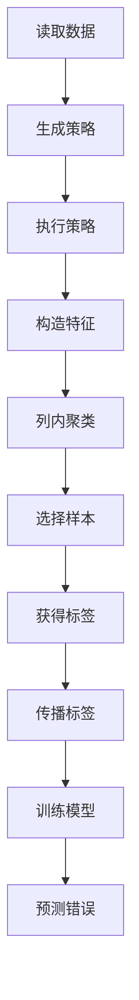
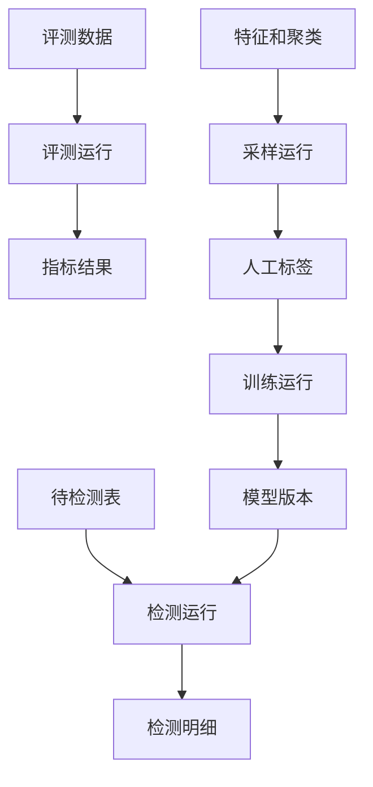
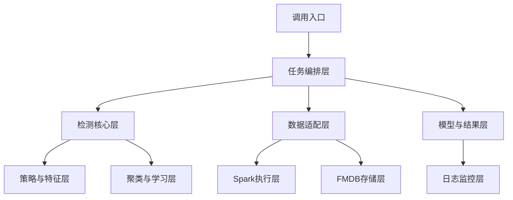
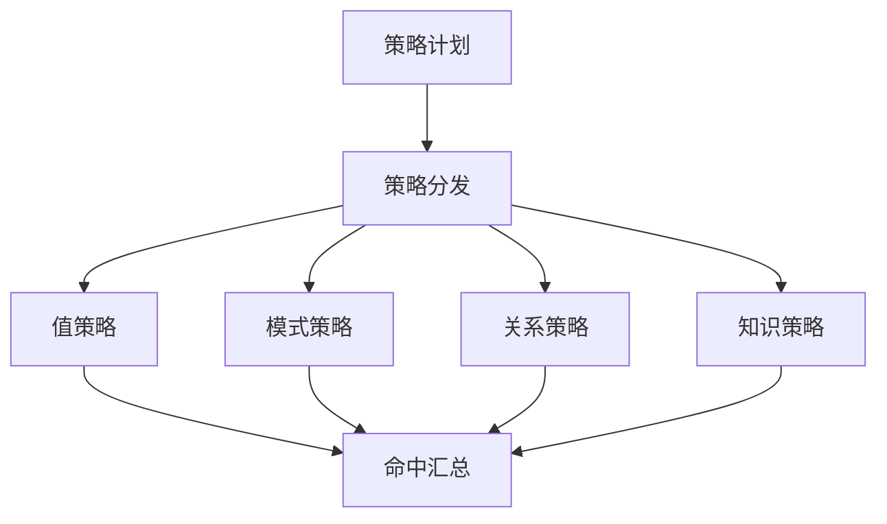
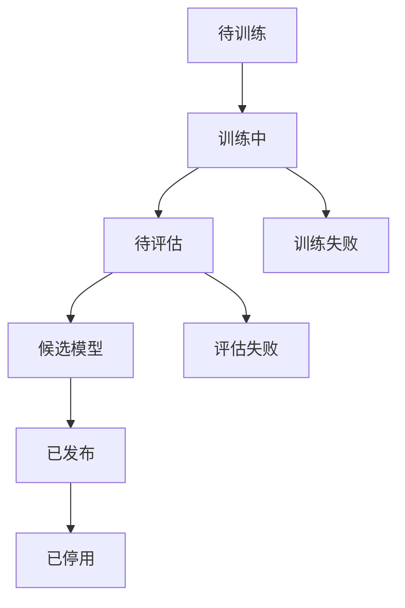

# Raha 数据检测工程概要设计

## 1. 文档说明

### 1.1 文档目的

本文档是 Raha Java 数据检测新工程的概要设计，作为后续详细架构设计、模块设计、数据表设计、接口设计、编码实现和测试验收的统一依据。

本文档重点回答以下问题：

- 工程解决什么问题，明确不解决什么问题。
- 如何把 Raha 论文和 Python demo 转换为 Java 加 Spark 的工程流程。
- 各个处理阶段的输入、输出、状态和失败边界是什么。
- 如何在 FMDB 环境中组织数据读取、结果落盘和 UDF 接入。
- 如何保证检测结果可解释、可复跑、可审计，并避免范围漂移到数据纠正。

### 1.2 设计状态

| 项目 | 内容 |
| --- | --- |
| 文档状态 | 概要设计初稿 |
| 设计日期 | 2026-07-14 |
| 工程类型 | Java Maven 新工程 |
| 计算引擎 | Apache Spark 3.3.1 主线 |
| 运行语言 | Java 8，Scala 二进制版本 2.12 |
| 主要能力 | Raha 风格的单元格级数据错误检测 |
| 明确边界 | 不做数据纠正，不生成修复值，不回写清洗数据 |

### 1.3 输入依据

本设计基于以下本地资料形成：

| 资料 | 用途 |
| --- | --- |
| `doc\\20260714\\Raha-Java工程化与SparkUDF检测方案-202607141549.md` | Java 化工程方案和前置约束 |
| `design\\baran-effective-error-correction-unified-context-transfer-learning-2020.pdf` | 值上下文、邻近上下文、领域上下文和迁移学习思想参考 |
| `design\\raha-baran-fast.pdf` | 任务并行、列级并行、数据并行和只读中间结果思想参考 |
| `design\\raha论文中文翻译-202607071430.md` | Raha 检测流程和算法说明参考 |
| `design\\raha-baran-fast论文中文翻译-202607071439.md` | Raha 并行化流程参考 |
| `design\\baran论文中文翻译-202607071418.md` | Baran 上下文建模边界参考 |
| `F:\\ai-code\\raha\\raha-master\\raha\\detection.py` | Python demo 的行为和状态参考 |
| `F:\\ai-code\\raha\\raha-master\\README.md` | Python demo 的运行方式参考 |

## 2. 设计结论

### 2.1 总体结论

本工程是一个完整的新工程，不复用旧 FMDB 工程的源码结构、旧 UDF 类、旧命令类或旧业务对象。工程只在运行环境允许的范围内使用 `lib` 目录中的 jar 能力。

工程的核心实现是 Raha 检测流程：自动生成多个错误检测策略，执行策略得到候选信号，将策略输出编码为单元格特征，再通过列内聚类、有限标注、标签传播和列级分类器预测疑似错误单元格。

Baran 论文只作为上下文特征和历史信息利用的参考，不把 Baran 的错误纠正模型、纠正候选、纠正值排序和清洗回写带入本工程。

### 2.2 范围约束

| 范围 | 本工程结论 |
| --- | --- |
| 检测粒度 | 单元格级，结果必须能够定位到数据集、行、列和原始值 |
| 主流程 | 策略生成、策略执行、特征生成、聚类、采样、标注、传播、训练、预测 |
| 监督方式 | 支持人工标注、真值评测和已确认标签，不要求生产环境必须提供真值表 |
| 运行方式 | 支持离线评测、训练、采样和生产检测 |
| 结果形式 | 检测明细、原因、命中策略、分数、模型版本和批次摘要 |
| 纠正能力 | 不提供推荐修复值，不产生清洗后表，不执行原表回写 |
| UDF 形态 | 以表级批处理入口为主，不实现单元格即时 Raha 检测 UDF |

### 2.3 禁止范围

以下内容不应出现在首期工程的接口、主表、核心包和生产结果中：

- `correct_value`、`repair_value`、`fixed_value` 等修复值字段。
- 纠正候选生成、候选排序和最终修复值预测。
- 自动覆盖原始数据或生成清洗后数据集。
- 以 Baran 名义建立纠正模块或纠正服务。
- 将单个单元格 UDF 作为主要检测入口。
- 依赖旧工程源码完成核心流程。

## 3. 理论依据与工程取舍

### 3.1 Raha 检测主线

Raha 将数据错误检测建模为单元格级二分类问题。系统先运行多个基础检测策略，把每个策略是否命中某个单元格编码成特征，再利用少量标注和聚类传播训练列级分类器。

标准检测流程如下：



工程必须保留以下 Raha 语义：

1. 基础策略是候选信号提供者，不直接决定最终错误。
2. 特征以列为边界组织，列级模型用于处理字段语义差异。
3. 聚类采样的目标是覆盖更多未知错误类型，降低人工标注数量。
4. 标签传播只能产生扩展训练标签，不能冒充人工真值。
5. 生产检测必须使用与训练阶段一致的值规范化、策略配置和特征字典。
6. 模型输出是疑似错误判断，不代表系统已经知道正确值。

### 3.2 Raha 策略族

| 策略族 | 论文含义 | 首期工程用途 |
| --- | --- | --- |
| `OD` | 离群点检测 | 低频值、数值分布异常、统计距离异常 |
| `PVD` | 模式违规检测 | 字符模式、长度、空值、类型和格式异常 |
| `RVD` | 规则违规检测 | 列间函数依赖近似、一对多冲突、共现冲突 |
| `KBVD` | 知识库违规检测 | 外部字典、主数据和知识关系校验 |
| `TFIDF` | 文本补充特征 | 文本列的可选稀疏语义补充特征 |

首期默认启用 `OD`、`PVD`、`RVD`。`KBVD` 需要外部知识库和字段映射，属于可插拔增强能力；`TFIDF` 需要额外验证 Java 侧特征一致性，不作为首个生产闭环的强依赖。

### 3.3 并行化依据

`raha-baran-fast.pdf` 的主要工程启发是把可独立的工作拆成任务并行，把列特征、列聚类、列模型和列预测拆成列级并行，并让输入和中间对象尽量只读。

本工程将论文中的 Dask 设计映射到 Spark：

| 论文思想 | Spark 落地方式 |
| --- | --- |
| 策略级并行 | 策略计划拆为独立任务，按策略标识写命中结果 |
| 列级并行 | 每列独立生成特征、聚类、训练和预测 |
| 数据级并行 | 大表特征生成、命中聚合和预测使用分区并行 |
| 只读输入表 | 读取快照后不在流程中修改输入数据 |
| 中间结果只写新版本 | 以 `job_id`、`stage_id` 和版本字段区分批次结果 |
| 避免共享可写状态 | 通过中间表和模型元数据传递阶段结果 |
| 减少大对象复制 | 小型配置、字典和特征索引可广播，大数据不广播 |
| 负载均衡 | 按列数据量、策略数量和预计命中量拆分任务 |

并行化不能改变 Raha 的算法语义。并行任务失败、重复执行或乱序完成时，结果仍必须通过确定性主键实现幂等和合并。

### 3.4 Baran 参考边界

Baran 的价值在于把数据值放入值上下文、邻近上下文和领域上下文中，并利用历史信息增强模型。本工程只提取其中可用于“判断异常”的部分：

| Baran 概念 | 本工程落地 |
| --- | --- |
| 值上下文 | 原始值规范化、字符形态、长度、数字和符号特征 |
| 邻近上下文 | 同一行其他列的共现关系和依赖冲突 |
| 领域上下文 | 同列频率、分布、模式和主数据集合 |
| 迁移学习 | 历史列画像和策略有效性用于策略过滤或优先级排序 |
| 错误纠正模型 | 不实现 |
| 纠正候选 | 不生成 |
| 清洗后值预测 | 不实现 |

## 4. 用户场景与运行模式

### 4.1 角色

| 角色 | 主要操作 |
| --- | --- |
| 数据检测调用方 | 提交数据集、检测配置和模型版本，获取检测批次 |
| 数据质量人员 | 查看采样元组、标注单元格、确认检测原因 |
| 模型维护人员 | 发布、停用和回滚列级检测模型 |
| 平台运维人员 | 管理 Spark 资源、依赖、日志、失败重跑和结果保留 |
| 评测人员 | 提供带真值数据集，比较精确率、召回率和运行性能 |

### 4.2 运行模式

| 模式 | 输入 | 主要输出 | 是否需要真值 |
| --- | --- | --- | --- |
| 评测模式 | 脏表、真值表、配置 | 检测结果和评估指标 | 是 |
| 训练模式 | 脏表、人工标注或确认标签 | 列级模型、策略画像和特征字典 | 否 |
| 采样模式 | 脏表、策略特征、已有标签 | 待标注元组任务 | 否 |
| 检测模式 | 待检测表、已发布模型、策略配置 | 疑似错误单元格明细 | 否 |
| 策略分析模式 | 数据集和策略配置 | 策略命中画像、耗时和失败明细 | 否 |

### 4.3 模式关系



## 5. 总体架构

### 5.1 逻辑分层

工程采用单 Maven 工程、分层包结构。核心检测逻辑只依赖抽象数据集和结果接口，FMDB、Spark 和 UDF 放在适配层或入口层。



### 5.2 组件职责

| 组件 | 主要职责 | 不负责 |
| --- | --- | --- |
| `RahaJobController` | 接收任务请求、校验参数、返回任务标识 | 不执行复杂算法 |
| `RahaJobOrchestrator` | 编排阶段、管理状态、控制重试和恢复 | 不保存全量数据到内存 |
| `RahaDatasetLoader` | 读取输入快照、统一字段和行标识 | 不判断错误 |
| `StrategyGenerator` | 根据列画像生成策略配置 | 不直接写最终检测结果 |
| `StrategyRunner` | 执行单个策略并输出命中单元格 | 不聚合最终错误结论 |
| `FeatureAssembler` | 将策略命中和上下文组装为特征 | 不训练模型 |
| `ColumnClusterer` | 在列内构建单元格聚类 | 不产生修复值 |
| `SamplingPlanner` | 按信息量选择待标注元组 | 不替代人工标签 |
| `LabelPropagator` | 在同列同簇范围内扩展标签 | 不把传播标签标记为真值 |
| `ColumnModelTrainer` | 为列训练检测模型 | 不生成纠正候选 |
| `ColumnModelPredictor` | 对列内单元格预测错误分数 | 不修改输入表 |
| `FmdbDatasetAdapter` | 适配 FMDB 表、SQL 和结果存储 | 不侵入 Raha 算法 |
| `RahaUdfAdapter` | 将表级任务封装为平台调用入口 | 不实现单元格实时检测 |
| `EvaluationService` | 计算评测指标和对比报告 | 不参与生产判断阈值发布 |

### 5.3 推荐包结构

```text
src/main/java/com/fiberhome/ml/raha/
  api/
    RahaTrainRequest.java
    RahaDetectRequest.java
    RahaSampleRequest.java
    RahaJobResult.java
  config/
    RahaJobConfig.java
    StrategyConfig.java
    FeatureConfig.java
    ModelConfig.java
  data/
    RahaDataset.java
    CellCoordinate.java
    CellValue.java
    ColumnProfile.java
    DetectionResult.java
  strategy/
    DetectionStrategy.java
    StrategyGenerator.java
    StrategyRunner.java
    od/
    pvd/
    rvd/
    kbvd/
  feature/
    FeatureAssembler.java
    FeatureDictionary.java
    SparseFeatureRow.java
    ContextFeatureBuilder.java
  cluster/
    ColumnClusterer.java
    ClusterAssignment.java
    SamplingPlanner.java
  label/
    LabelRepository.java
    LabelPropagator.java
  model/
    RahaColumnModel.java
    ModelTrainer.java
    ModelPredictor.java
    ModelRepository.java
  train/
    RahaTrainService.java
    TrainingDatasetBuilder.java
    TrainingMetrics.java
  detect/
    RahaDetectService.java
    DetectionExplainService.java
  fmdb/
    FmdbDatasetLoader.java
    FmdbResultWriter.java
    FmdbModelStore.java
  udf/
    F_DW_RAHATRAIN.java
    F_DW_RAHADETECT.java
    F_DW_RAHASAMPLE.java
  metrics/
    EvaluationService.java
    MetricsCalculator.java
  util/
    ValueNormalizer.java
    HashUtils.java
    JsonUtils.java
```

首期不创建 `correction`、`repair`、`baran` 包，避免目录结构把实现引向数据纠正。

## 6. 核心数据对象

### 6.1 数据集对象

`RahaDataset` 是检测核心使用的数据集抽象，至少包含以下信息：

| 属性 | 说明 | 要求 |
| --- | --- | --- |
| `datasetId` | 逻辑数据集标识 | 在训练、采样和检测期间稳定 |
| `snapshotId` | 输入快照标识 | 用于保证一次任务读取的数据不变化 |
| `tableName` | 来源表名 | 仅用于追溯和输出 |
| `rowIdColumn` | 行标识字段 | 生产模式必须稳定、非空或可补齐 |
| `columns` | 字段元数据 | 包含字段名、顺序、类型和可检测属性 |
| `dataFrame` | Spark 数据集 | 只读使用，不原地修改 |
| `schemaHash` | 模式哈希 | 用于模型和特征字典兼容检查 |
| `profile` | 列画像摘要 | 用于策略生成和任务估算 |

### 6.2 行标识和单元格标识

生产检测不能依赖 Spark 分区内的物理行号作为唯一定位，因为重分区、排序和重跑可能改变物理顺序。

推荐规则如下：

- 优先使用输入表已有的稳定主键作为 `rowId`。
- 没有稳定主键时，由调用方提供行标识表达式或在快照阶段生成稳定行标识。
- `cellId` 由 `datasetId`、`snapshotId`、`rowId` 和 `columnName` 共同确定。
- 行标识缺失、重复或变化时，任务应进入失败或人工确认状态，不能静默继续。

### 6.3 策略命中对象

每个基础策略只产生 `StrategyHit`，其语义是“该策略认为该单元格值得关注”。

| 字段 | 说明 |
| --- | --- |
| `jobId` | 所属任务 |
| `stageId` | 策略阶段标识 |
| `strategyId` | 策略唯一标识 |
| `strategyFamily` | `OD`、`PVD`、`RVD` 或 `KBVD` |
| `strategyConfig` | 可重放的策略配置 |
| `datasetId` | 数据集标识 |
| `snapshotId` | 输入快照 |
| `rowId` | 行标识 |
| `columnName` | 命中字段 |
| `valueHash` | 原始值哈希，便于审计和去重 |
| `reasonCode` | 稳定原因编码 |
| `reasonDetail` | 结构化原因详情 |
| `strategyScore` | 策略自身分数，可为空 |
| `runtimeMs` | 策略执行耗时 |
| `status` | 成功、跳过或失败 |

策略命中对象不能包含修复值字段。

### 6.4 特征对象

特征对象定位到一个单元格，使用稀疏特征表示。

| 字段 | 说明 |
| --- | --- |
| `cellId` | 单元格稳定标识 |
| `columnName` | 所属列 |
| `featureDictionaryVersion` | 特征字典版本 |
| `sparseFeatures` | 特征编号和值组成的稀疏结构 |
| `featureSummary` | 便于解释的策略族聚合信息 |
| `sourceStageId` | 特征来源阶段 |
| `createdAt` | 生成时间 |

特征字典必须可持久化。训练阶段和检测阶段使用不同字典时，任务必须拒绝执行或明确进入兼容转换流程。

### 6.5 标签对象

标签对象同时保存标签值和标签来源，防止把传播标签、自动标签和人工标签混为一谈。

| 字段 | 说明 |
| --- | --- |
| `cellId` | 单元格标识 |
| `label` | `1` 表示疑似错误，`0` 表示正常 |
| `labelSource` | 人工、真值、规则确认或传播 |
| `confidence` | 标签置信度 |
| `sourceLabelId` | 传播时的来源标签 |
| `clusterId` | 传播所在聚类 |
| `annotator` | 标注人或系统 |
| `createdAt` | 生成时间 |

生产结果中的 `label` 是检测判断，不应被解释为人工确认事实；人工确认事实必须通过 `labelSource` 区分。

## 7. 端到端处理流程

### 7.1 任务初始化

任务开始时创建 `jobId`，完成参数校验并固定以下信息：

- 数据集和输入快照。
- 模式哈希和列元数据。
- 策略族、策略过滤、聚类、采样和模型配置。
- 运行用户、提交时间和幂等键。
- 结果保留策略和日志关联字段。

任务初始化失败时不创建可用模型，不输出检测明细。

### 7.2 快照和画像

读取阶段将外部数据源转换成只读 `RahaDataset`，并生成列画像：

- 非空率和空值类型。
- 不同值数量和重复率。
- 数值、日期、字符和混合类型比例。
- 最小、最大、均值、分位数等统计摘要。
- 长度分布、字符集合和模式摘要。
- 可用主数据、字典和列关系摘要。

列画像只保存用于策略生成的统计信息，不保存超出权限范围的原始敏感数据。

### 7.3 策略计划

`StrategyGenerator` 根据列画像和配置生成确定性的策略计划。每个策略配置必须具备稳定的 `strategyId`，相同快照、相同配置和相同版本应得到相同标识。

策略计划生成约束：

1. `OD` 根据数值列、可解析数值列和频率分布生成有限阈值。
2. `PVD` 根据字符、长度、空值和类型分布生成模式策略。
3. `RVD` 只在允许的字段类型、字段白名单和列数上限内枚举列对。
4. `KBVD` 必须明确字典版本、字段映射和连接方式。
5. 历史策略过滤只能减少候选策略，不能改变输入数据和标签语义。
6. 策略数量超过上限时，任务应记录告警并按优先级截断或失败，不能无限生成。

### 7.4 策略执行

策略执行以策略为并行边界。每个策略读取输入快照和自己的配置，输出命中明细及策略运行摘要。



策略执行必须满足：

- 同一个 `strategyId` 在同一个 `snapshotId` 上可重跑且结果可去重。
- 单个策略失败时记录失败原因、输入规模和耗时。
- 是否允许跳过失败策略由任务配置控制，默认在失败比例超过阈值时终止任务。
- 策略只输出候选命中，不输出最终 `is_error`。
- 运行结果必须保留策略配置，确保后续解释和复跑。

### 7.5 特征生成

`FeatureAssembler` 将策略命中转成特征，并补充上下文特征。每个列形成一个单独的训练和预测特征空间。

特征生成步骤：

1. 读取当前批次成功的策略命中。
2. 按 `cellId` 聚合策略命中，生成策略二值特征。
3. 生成策略族命中计数、覆盖数量和分数摘要。
4. 生成值上下文、列内上下文和邻近上下文特征。
5. 删除所有单元格取值完全相同的无区分度特征。
6. 根据特征字典转换为稀疏向量。
7. 保存特征字典、特征摘要和特征生成统计。

Python demo 中 `generate_features` 会按列建立矩阵并过滤无区分度列。Java 实现保留这一语义，但不要求把整列矩阵一次性加载到 Driver 内存。

### 7.6 列内聚类

聚类的对象是同一列中的单元格特征向量。目标是把策略信号相似的单元格放到同一簇，使少量标注能够覆盖更多相似单元格。

首期支持两种实现：

| 实现 | 适用场景 | 说明 |
| --- | --- | --- |
| 层次聚类 | 小表、论文对齐和评测 | 更接近 Python demo，可能有较高内存开销 |
| Spark 近似聚类 | 大表生产检测 | 可分布式执行，但需通过对比测试确认效果 |

聚类结果必须保存单元格到聚类的映射，且记录算法版本、距离度量、簇数量和随机种子。生产环境不允许只保存模型而丢失聚类版本。

### 7.7 主动采样和标注

采样单位是元组，标注单位是元组中的单元格。采样评分优先覆盖尚未有标签的列内聚类。

采样原则：

- 已经标注过的元组不重复采样，除非显式开启复核模式。
- 一个元组覆盖多个低标签聚类时，评分更高。
- 各列的标签覆盖不足时，对缺少标签的列增加权重。
- 采样使用可配置随机种子，保证评测和重跑可复现。
- 达到 `labelingBudget` 后停止采样，不因结果为空而无限重试。

人工标注任务只展示原始值、字段名、同行上下文、策略原因和必要的样本信息，不展示或要求填写修复值。若未来业务确实需要修复值，应另建纠正工程和独立数据边界。

### 7.8 标签传播

标签传播只在“同一列、同一聚类版本”内部进行。传播结果必须保留来源和冲突处理方式。

| 方式 | 规则 | 默认建议 |
| --- | --- | --- |
| `homogeneity` | 簇内直接标签完全一致时传播 | 默认 |
| `majority` | 簇内多数标签决定传播 | 标注噪声较高时试验 |

如果同一簇中同时出现正常和错误标签，`homogeneity` 模式不传播；`majority` 模式记录冲突数量和多数比例。传播标签权重应低于直接人工标签，训练时不能覆盖直接标签。

### 7.9 列级训练

训练阶段按照字段分别构造训练集，并使用直接标签和传播标签训练列级模型。

训练前检查：

- 特征字典版本与训练批次一致。
- 标签至少包含一个有效类别；单类别时不能强行训练二分类模型。
- 正负样本数量和类别比例满足配置要求。
- 传播标签冲突比例不超过阈值。
- 训练数据中的原始值快照与输入快照一致。

推荐分类器顺序：

1. 默认使用 Spark MLlib `LogisticRegression` 打通首期工程闭环。
2. 需要非线性表达时增加 `GBTClassifier` 或决策树对比实现。
3. MLlib 训练失败时使用规则加权融合兜底，但必须明确标记模型类型和可解释性差异。

论文和 Python demo 的结果表明，分类器选择不是主要影响因素，策略特征和采样质量更重要。因此首期不以复杂模型为优先目标。

### 7.10 批量预测

检测阶段按模型版本读取模型、特征字典和策略配置，对输入快照重新执行相同策略和特征生成流程，再按列预测。

预测结果至少包含：

- 单元格定位信息。
- 输入原始值或脱敏值。
- `isError` 和 `score`。
- 命中的策略族、策略标识和原因。
- 模型名称、模型版本、特征字典版本。
- 任务、快照和生成时间。

预测结果不包含任何修复值字段，不生成修复候选列表。

## 8. 检测策略概要设计

### 8.1 `OD` 离群策略

`OD` 面向值频率和数值分布异常，建议拆成可独立运行的策略配置：

| 子策略 | 适用列 | 主要信号 |
| --- | --- | --- |
| 频率直方图 | 离散值或可分桶值 | 低频值、异常频率桶 |
| 高斯距离 | 可解析数值列 | 均值、标准差和距离阈值 |
| 分位数距离 | 长尾数值列 | 四分位距和极端值 |
| 重复率异常 | 业务编码或标识列 | 过度重复或异常唯一 |

配置必须记录阈值算法、阈值值、空值处理、异常值处理和列类型判断结果。

### 8.2 `PVD` 模式策略

`PVD` 面向单列值的句法和格式模式：

- 字符集合异常。
- 长度异常。
- 数字、字母、中文、空格和符号占比异常。
- 日期、时间、电话、邮箱、编号等可识别格式异常。
- 空值、空白值和特殊占位值异常。
- 同列主模式之外的少数模式。

模式策略输出原因编码，不把“未匹配主模式”直接等价为错误，因为合法少数值也可能存在。

### 8.3 `RVD` 关系策略

`RVD` 用同一行的列间关系近似函数依赖或一对多冲突：

- `A -> B` 中同一 `A` 对应多个 `B`。
- `A` 与 `B` 的组合出现低频或不一致。
- 主键候选列与属性列之间的共现冲突。
- 同一业务实体在多个字段中的值不一致。

列对枚举的风险是字段数增加后组合数量快速增长。必须支持字段白名单、字段黑名单、类型过滤、最大列对数、历史策略过滤和超时终止。

### 8.4 `KBVD` 知识策略

`KBVD` 只在外部字典、主数据或知识关系具备明确版本和访问方式时启用。每次运行必须记录：

- 知识库名称和版本。
- 连接方式和超时配置。
- 字段与知识实体的映射。
- 未命中、冲突和查询失败的区分。
- 是否使用本地广播快照。

外部知识库不可用时，默认不把所有值判为错误，应按策略失败处理并进入可配置的跳过或终止分支。

### 8.5 策略结果解释

每条检测结果应能反查到至少一个原因：

```text
检测结果
  -> 命中策略
    -> 策略配置
      -> 策略原因
        -> 输入快照和列画像
```

解释信息建议使用结构化字段保存，避免只拼接一段不可解析文本。对敏感数据可以保存值哈希、模式摘要和脱敏片段，不强制保存完整原始值。

## 9. 特征设计

### 9.1 特征分层

| 层次 | 特征示例 | 生成方式 |
| --- | --- | --- |
| 策略命中 | 单策略是否命中 | 策略结果透视或稀疏聚合 |
| 策略族汇总 | `odHitCount`、`pvdHitCount` | 按单元格聚合 |
| 值上下文 | 长度、字符类别、空值类型 | 值规范化器 |
| 列内上下文 | 值频率桶、模式频率、分位数距离 | 列画像 |
| 邻近上下文 | 依赖冲突数、共现异常数 | `RVD` 或关系特征 |
| 领域上下文 | 字典命中、主数据命中、实体频率 | `KBVD` 或领域适配器 |
| 历史画像 | 历史策略有效性、字段相似度 | 画像仓库 |

### 9.2 特征命名和字典

特征名称必须稳定、可读和可版本化。建议使用以下结构：

```text
<feature_family>.<feature_name>[.<parameter_hash>]
```

示例：

```text
strategy.od.histogram.hit
strategy.pvd.length.outlier
context.value.length.bucket
context.neighbor.rvd.conflict.count
context.domain.dictionary.miss
```

特征字典至少保存特征名称、编号、类型、来源策略、默认值、缺失处理和版本。

### 9.3 值规范化

值规范化用于特征生成，不得覆盖检测输出中的原始值。

规范化规则应显式配置：

- 是否去除首尾空白。
- 是否统一大小写。
- 是否统一全角半角。
- 是否将空字符串转换为空值类别。
- 是否保留原始符号。
- 数值和日期解析失败的处理方式。
- 脱敏后的值是否可以参与频率统计。

训练和检测必须使用同一版本的规范化规则。规则版本改变时，应重新生成特征字典或明确兼容策略。

### 9.4 类别不平衡

数据错误通常远少于正常值，训练阶段需要关注类别不平衡：

- 保存正负样本数量和比例。
- 支持类别权重或样本权重。
- 评估使用精确率、召回率、F1 和平均精确率，不以准确率作为唯一指标。
- 阈值不能只按默认 `0.5` 固定，应在评测集上验证并写入模型元数据。

## 10. 聚类、采样和标签传播设计

### 10.1 聚类接口

聚类模块建议抽象为以下输入输出：

| 项目 | 内容 |
| --- | --- |
| 输入 | 单列单元格特征、聚类参数、随机种子、算法版本 |
| 输出 | `cellId`、`clusterId`、列名、聚类版本、距离和算法信息 |
| 约束 | 同一聚类版本内一个单元格只能属于一个簇 |
| 失败 | 特征为空、样本不足或距离不可计算时返回可解释状态 |

Python demo 会按标注预算尝试不同簇数量。Java 工程可以保留这一行为作为评测模式，同时在生产模式使用可配置簇数量或近似聚类，不能把某一个实现细节写死为唯一方案。

### 10.2 采样接口

采样输入：

- 当前批次的列特征和聚类成员。
- 已有直接标签和传播标签。
- 标注预算、采样方式和随机种子。
- 每列最低覆盖目标和每轮最大任务数。

采样输出：

- 采样任务标识。
- 元组行标识。
- 覆盖的列和聚类。
- 采样分数及其组成。
- 采样轮次和策略版本。
- 待标注状态。

采样任务必须支持过期、取消、提交和复核状态，避免重复向用户展示同一行。

### 10.3 标签传播接口

标签传播输入直接标签、聚类成员和冲突处理方式，输出扩展标签。传播时必须写入来源信息：

| 情况 | 处理 |
| --- | --- |
| 同簇标签全为正常 | 可传播正常标签 |
| 同簇标签全为错误 | 可传播错误标签 |
| 同簇标签冲突且使用同质性 | 不传播并记录冲突 |
| 同簇标签冲突且使用多数 | 按多数比例传播并记录比例 |
| 没有直接标签 | 不传播 |

## 11. 模型设计

### 11.1 模型粒度

默认每个字段训练一个模型，因为不同字段的错误类型、值域和合法模式差异明显。可以在字段标签不足时退化到字段类型模型，但必须在模型元数据中记录退化原因。

| 模型粒度 | 使用条件 | 风险 |
| --- | --- | --- |
| 每列一个模型 | 默认方案 | 列数很多时模型数量增加 |
| 字段类型模型 | 单列标签不足 | 不同业务字段语义可能混淆 |
| 全表模型 | 仅用于粗筛实验 | 解释性和字段差异处理较弱 |

### 11.2 模型训练状态

模型生命周期建议如下：



只有 `已发布` 模型可以被生产检测任务使用。模型发布必须同时确认模型文件、特征字典、策略配置、模式哈希和阈值存在且可读取。

### 11.3 模型元数据

| 字段 | 说明 |
| --- | --- |
| `modelName` | 模型逻辑名称 |
| `modelVersion` | 不可变版本号 |
| `datasetId` | 训练数据集 |
| `columnName` | 目标列 |
| `schemaHash` | 训练模式哈希 |
| `classifierType` | 分类器类型 |
| `featureDictionaryVersion` | 特征字典版本 |
| `strategyPlanVersion` | 策略计划版本 |
| `threshold` | 生产判断阈值 |
| `labelStatistics` | 标签数量和类别比例 |
| `metrics` | 评估指标 |
| `modelPath` | 模型存储路径 |
| `status` | 草稿、候选、已发布或已停用 |
| `createdBy` | 创建人或任务 |
| `createdAt` | 创建时间 |

模型对象不得保存修复值、纠正候选或清洗后数据。

### 11.4 无法训练时的降级

以下情况不应产生伪模型：

- 只有正常标签或只有错误标签。
- 特征全部为空或没有区分度。
- 模式哈希与训练配置不一致。
- 传播冲突超过阈值。
- 模型依赖不可用。

可以按配置使用规则加权结果作为“候选检测结果”，但结果必须标记为 `fallback`，不能伪装成列级机器学习模型输出。

## 12. 数据存储概要设计

### 12.1 任务表

建议建立 `raha_job`，保存任务生命周期和运行配置摘要。

| 字段 | 说明 |
| --- | --- |
| `job_id` | 任务唯一标识 |
| `idempotent_key` | 幂等键 |
| `job_type` | 评测、训练、采样、检测或策略分析 |
| `dataset_id` | 数据集标识 |
| `snapshot_id` | 输入快照 |
| `config_version` | 配置版本 |
| `status` | 创建、运行、成功、失败、取消 |
| `current_stage` | 当前阶段 |
| `started_at` | 开始时间 |
| `finished_at` | 结束时间 |
| `error_code` | 失败编码 |
| `error_message` | 脱敏后的失败摘要 |

### 12.2 快照和画像表

建议建立 `raha_dataset_snapshot` 和 `raha_column_profile`：

- 保存输入表来源、快照时间和模式哈希。
- 保存列名、列序号、类型和可检测标识。
- 保存频率、长度、空值、模式和数值分布摘要。
- 保存画像生成版本和统计采样方式。

### 12.3 策略计划表

建议建立 `raha_strategy_plan`：

| 字段 | 说明 |
| --- | --- |
| `strategy_plan_id` | 策略计划版本 |
| `job_id` | 所属任务 |
| `strategy_id` | 策略标识 |
| `strategy_family` | 策略族 |
| `target_columns` | 目标列或列对 |
| `config_json` | 完整配置 |
| `historical_score` | 历史画像得分 |
| `priority` | 执行优先级 |
| `status` | 待执行、成功、跳过或失败 |

### 12.4 策略命中表

建议建立 `raha_strategy_hit`。大表场景应按 `job_id`、`strategy_id` 和列名分区或分桶，避免单批次全表扫描。

### 12.5 特征表

建议建立 `raha_cell_feature` 和 `raha_feature_dictionary`：

- 特征表保存单元格稀疏特征和解释摘要。
- 字典表保存特征名称到编号的稳定映射。
- 训练和检测只能使用已冻结的特征字典。
- 特征存储应支持按列读取，便于列级并行。

### 12.6 聚类和标签表

建议建立：

- `raha_cluster_assignment`：单元格到聚类的映射。
- `raha_sampling_task`：待标注元组任务。
- `raha_cell_label`：直接标签和传播标签。
- `raha_label_conflict`：标签冲突和传播拒绝原因。

### 12.7 模型和结果表

建议建立：

- `raha_column_model`：模型元数据和发布状态。
- `raha_detection_result`：单元格检测结果。
- `raha_job_metric`：任务级指标和性能摘要。
- `raha_stage_metric`：阶段级行数、命中数、耗时和资源摘要。

检测结果核心字段如下：

| 字段 | 说明 |
| --- | --- |
| `job_id` | 检测任务 |
| `dataset_id` | 数据集 |
| `snapshot_id` | 输入快照 |
| `row_id` | 行标识 |
| `column_name` | 字段名 |
| `value_hash` | 原始值哈希 |
| `value_masked` | 可选脱敏值 |
| `is_error` | 是否疑似错误 |
| `score` | 错误分数 |
| `threshold` | 使用的阈值 |
| `strategy_hits` | 命中策略结构 |
| `reason_json` | 结构化原因 |
| `model_name` | 模型名称 |
| `model_version` | 模型版本 |
| `feature_dictionary_version` | 特征字典版本 |
| `detected_at` | 检测时间 |

表中禁止出现 `correct_value`、`repair_value` 和 `clean_value` 等纠正语义字段。

## 13. Spark 执行设计

### 13.1 Driver 和 Executor 职责

| 运行位置 | 职责 |
| --- | --- |
| Driver | 参数校验、任务编排、阶段状态、模型发布和结果汇总 |
| Executor | 策略执行、分区计算、特征生成、列级局部计算和预测 |
| 外部存储 | 快照、中间结果、模型、日志摘要和检测结果 |

Driver 不得收集全量明细数据。只有列元数据、策略配置、特征字典和小型字典可以在满足大小上限时广播。

### 13.2 并行边界

| 阶段 | 首选并行粒度 | 说明 |
| --- | --- | --- |
| 策略计划 | 策略配置 | 每个策略可独立重试 |
| 策略执行 | 分区和策略 | 大策略按数据分区拆分 |
| 特征生成 | 列和分区 | 结果按列组织 |
| 聚类 | 列 | 聚类不跨列混合 |
| 采样 | 任务轮次 | 需要读取全列覆盖状态 |
| 标签传播 | 列和聚类 | 只读聚类成员和标签 |
| 模型训练 | 列 | 允许按列限流 |
| 模型预测 | 列和分区 | 大列拆成分区任务 |

### 13.3 缓存和持久化

只在阶段间重复使用且成本较高的数据集上缓存：

- 输入快照在多个策略重复读取时可以缓存。
- 策略命中在特征生成和解释阶段重复使用时可以持久化。
- 特征数据优先写外部中间表，避免长期占用 Executor 内存。
- 任务结束后清理临时缓存和过期中间数据。

缓存级别、过期时间和预计大小必须进入配置，并输出实际命中率和淘汰情况。

### 13.4 大表和大列处理

论文中的并行方案会增加内存占用，尤其是在多个列同时生成特征和聚类时。工程必须提供资源保护：

- 对大列按分区或块处理。
- 对高基数字段限制频率字典大小。
- 对 `RVD` 列对数量设置硬上限。
- 对 `KBVD` 知识库使用版本化快照或分区查询。
- 对同时运行的列任务设置并发上限。
- 监测 Driver、Executor、磁盘和网络使用量。
- OOM 或执行器频繁丢失时自动降级并发，而不是盲目重试。

### 13.5 幂等和重跑

阶段结果主键建议包含：

```text
job_id + stage_id + snapshot_id + strategy_id + cell_id
```

同一主键重复写入时应覆盖同一版本或被去重，不能产生多个互相矛盾的结果。阶段重跑必须保留失败尝试记录，但对外只暴露当前有效版本。

## 14. FMDB 适配和 UDF 入口

### 14.1 数据访问适配

FMDB 相关代码只放在适配层：

| 组件 | 职责 |
| --- | --- |
| `FmdbDatasetLoader` | 根据表名、SQL 或快照标识读取 Spark 数据集 |
| `FmdbSchemaResolver` | 读取字段、类型、主键和元数据 |
| `FmdbResultWriter` | 写任务、策略、标签、模型元数据和检测结果 |
| `FmdbModelStore` | 读写模型文件、特征字典和模型状态 |
| `FmdbAuditWriter` | 写调用人、配置摘要和审计信息 |

检测核心不能直接依赖 FMDB 的具体 JDBC 类、旧工程对象或平台私有实现。

### 14.2 推荐 UDF

UDF 只负责把平台调用转换为任务请求，真正的检测在 Spark 批处理流程中完成。

| 入口 | 语义 | 返回内容 |
| --- | --- | --- |
| `F_DW_RAHATRAIN` | 提交训练任务 | `jobId`、状态和摘要 |
| `F_DW_RAHADETECT` | 提交表级检测任务 | `jobId`、结果表标识和摘要 |
| `F_DW_RAHASAMPLE` | 生成待标注元组任务 | 采样任务标识和任务表标识 |

UDF 参数建议统一使用请求结构或 JSON 配置，至少包含数据集标识、输入表或快照、策略配置、模型版本、运行模式和幂等键。

### 14.3 UDF 约束

- UDF 不能接收一个单元格并试图推断完整 Raha 结果。
- UDF 不能在执行期间直接修改输入表。
- UDF 不能隐藏失败策略、失败模型或部分结果。
- UDF 必须记录调用参数摘要、调用人、任务标识和耗时。
- UDF 返回结果不包含修复值。

## 15. 配置设计

配置分为任务级、策略级、特征级、聚类级、模型级和资源级。

### 15.1 任务级配置

| 配置项 | 说明 | 建议默认 |
| --- | --- | --- |
| `jobType` | 运行模式 | 必填 |
| `datasetId` | 数据集标识 | 必填 |
| `snapshotId` | 输入快照 | 必填或由系统生成 |
| `rowIdColumn` | 行标识字段 | 生产必填 |
| `saveIntermediate` | 是否保留中间结果 | 评测开启，生产按保留策略 |
| `randomSeed` | 采样和算法随机种子 | 固定值 |
| `failureTolerance` | 阶段失败容忍度 | 配置项 |
| `resultRetentionDays` | 结果保留天数 | 平台约定 |

### 15.2 Raha 配置

| 配置项 | Python 对应 | 说明 |
| --- | --- | --- |
| `labelingBudget` | `LABELING_BUDGET` | 最大标注元组数 |
| `labelingAccuracy` | `USER_LABELING_ACCURACY` | 仅评测或模拟标注噪声 |
| `clusteringBasedSampling` | `CLUSTERING_BASED_SAMPLING` | 是否按聚类覆盖采样 |
| `strategyFilteringEnabled` | `STRATEGY_FILTERING` | 是否使用历史策略过滤 |
| `classifierType` | `CLASSIFICATION_MODEL` | 分类器类型 |
| `labelPropagationMethod` | `LABEL_PROPAGATION_METHOD` | `homogeneity` 或 `majority` |
| `strategyFamilies` | `ERROR_DETECTION_ALGORITHMS` | 启用的策略族 |

生产环境禁止使用 `labelingAccuracy` 随机翻转真实人工标签；该配置只用于论文复现和鲁棒性评测。

### 15.3 配置校验

任务提交时必须校验：

- 策略族是否在白名单内。
- 预算、阈值、并发数和列对上限是否为合法范围。
- 模型、特征字典和策略版本是否匹配。
- 输入模式是否满足模型要求。
- 结果表和模型目录是否具备写权限。
- 依赖版本是否符合运行基线。

## 16. 日志与可观测性

### 16.1 日志要求

日志必须使用项目确定的现有日志框架和统一格式。每条关键日志至少带 `jobId`、`stageId`、`datasetId`、`snapshotId` 和 `attemptId`。

必须记录的节点：

- 任务开始、参数校验结果和输入摘要。
- 快照读取开始、结束、行数、列数和模式哈希。
- 策略计划生成数量、过滤数量和原因。
- 每类策略开始、结束、命中数和耗时。
- 特征数量、无区分度特征删除数量和字典版本。
- 聚类数量、空特征列和失败列。
- 采样预算、已覆盖聚类和待标注任务数。
- 标签传播数量、冲突数量和拒绝数量。
- 每列模型训练结果、指标和失败原因。
- 预测结果数量、疑似错误数量和平均分数。
- 任务结束、阶段耗时、资源摘要和结果位置。

异常捕获处必须记录上下文和完整异常堆栈，不能只记录异常消息。

### 16.2 指标

| 指标 | 说明 |
| --- | --- |
| `input_row_count` | 输入行数 |
| `input_column_count` | 输入列数 |
| `strategy_count` | 策略数量 |
| `strategy_hit_count` | 策略命中数 |
| `strategy_failure_count` | 策略失败数 |
| `feature_count` | 有效特征数 |
| `cluster_count` | 聚类数量 |
| `label_count` | 直接标签数量 |
| `propagated_label_count` | 传播标签数量 |
| `detected_cell_count` | 检测结果数量 |
| `stage_runtime_ms` | 阶段耗时 |
| `executor_failure_count` | 执行器失败数量 |
| `model_f1` | 评测模式 F1 |

## 17. 安全、隐私和审计

数据检测可能处理业务敏感字段，设计需要默认保护原始值：

- 任务日志不直接打印完整单元格值。
- 结果表优先保存值哈希和脱敏值，完整值按权限保留。
- 策略原因应避免把敏感值拼入普通日志。
- 模型和特征字典目录需要访问控制。
- 人工标注任务按照最小字段原则展示上下文。
- 任务配置、模型发布、结果查看和人工标签修改都需要审计。
- 检测结果保留期限必须可配置并支持清理。

## 18. 依赖和运行基线

### 18.1 Maven 版本基线

| 项目 | 基线 |
| --- | --- |
| JDK | 1.8 |
| Spark | 3.3.1 |
| Scala 二进制版本 | 2.12 |
| Spark SQL | `provided` |
| Spark MLlib | `provided` |

### 18.2 依赖约束

- `pom.xml` 是 Java、Spark、Scala 和 MLlib 版本的唯一工程配置来源。
- Maven Enforcer 在构建阶段限制不兼容的 Spark 和 Scala 依赖。
- 工程不读取本地 Jar 目录，不扫描运行时 Classpath，不校验精确 Jar 文件名。
- FMDB 平台负责提供与 Spark 3.3.1 和 Scala 2.12 兼容的运行环境。

### 18.3 MLlib 处理

逻辑回归直接使用 Maven 声明的 Spark MLlib API。训练执行失败且允许降级时，使用规则加权融合完成检测闭环；禁止降级时返回训练失败，不通过硬编码类名预先探测 MLlib。

### 18.4 依赖验收

- Maven 编译、测试和依赖规则通过。
- Java 8 API 检查通过。
- Spark Driver 和 Executor 使用同一业务 Jar 和兼容的 Spark 运行版本。

## 19. 异常和恢复设计

### 19.1 异常分类

| 类别 | 示例 | 处理 |
| --- | --- | --- |
| 参数异常 | 缺少数据集、非法预算 | 任务不启动，返回可定位错误 |
| 数据异常 | 行标识重复、模式变化、空输入 | 终止或按配置跳过 |
| 策略异常 | 单策略超时、外部知识库失败 | 记录策略失败，按容忍度继续或终止 |
| 资源异常 | OOM、执行器丢失、磁盘不足 | 降低并发、清理临时数据或失败重试 |
| 模型异常 | 模型缺失、版本不匹配、加载失败 | 不允许进入生产预测 |
| 标签异常 | 标签冲突、单类别、传播比例异常 | 阻止模型发布或进入人工复核 |
| 存储异常 | 中间表写失败、权限不足 | 阶段失败并保留可重跑状态 |

### 19.2 阶段恢复

每个阶段完成后写入检查点：

- 阶段状态。
- 输入版本。
- 输出位置。
- 输出行数和摘要哈希。
- 配置版本。
- 尝试次数和最后错误。

重跑时优先复用成功且版本一致的阶段结果；输入快照、模式、配置或依赖版本发生变化时，必须创建新阶段版本，不能复用旧结果。

## 20. 测试和验收标准

### 20.1 单元测试

必须覆盖：

- 值规范化和空值分类。
- `OD`、`PVD`、`RVD` 的典型命中和不命中。
- 策略配置生成的确定性和上限控制。
- 特征字典生成、无区分度特征过滤和稀疏向量组装。
- 聚类空数据、单样本和无法计算距离的处理。
- 同质性传播、多数传播和冲突处理。
- 单类别训练、模型缺失和阈值判断。
- 结果解释和敏感值脱敏。

### 20.2 集成测试

- Spark 本地模式完成一张小表的端到端训练和检测。
- 同一输入、配置和随机种子重复执行得到一致的策略计划和采样结果。
- 策略阶段失败可按容忍度继续或终止。
- 中间结果重跑不产生重复有效记录。
- 训练模型可在相同模式和特征字典下加载预测。
- 输入模式变化时，检测任务被拒绝而不是静默输出错误结果。

### 20.3 对齐 Python demo

选取一组小型固定数据集，对比 Java 和 Python demo 的以下行为：

- 策略族配置和策略数量。
- 策略命中单元格集合。
- 特征是否按列组织。
- 聚类和采样覆盖趋势。
- 标签传播结果。
- 评测模式下的错误检测指标。

Java Spark 实现可以因为数据结构、随机数和聚类实现不同而产生细微差异，但必须能解释差异来源，不能在未说明的情况下改变检测粒度和标签语义。

### 20.4 论文流程验收

验收必须确认：

1. 不提供完整规则时也能生成有限策略并运行。
2. 策略结果可以组合成单元格特征。
3. 支持列内聚类和有限预算采样。
4. 支持直接标签和标签传播。
5. 能够训练列级模型并输出单元格级检测结果。
6. 结果可以解释到策略、特征和模型版本。
7. 结果没有修复值，没有清洗回写行为。

### 20.5 性能验收

性能验收不预先承诺论文中的绝对耗时，而是建立统一基准：

- 小表：验证结果一致性和阶段开销。
- 中表：验证策略级、列级和分区级并行收益。
- 大表：验证内存上限、磁盘中间结果和失败恢复。
- 宽表：验证 `RVD` 列对上限和策略过滤。
- 高错误率表：验证模型训练和结果写入吞吐。
- 低错误率表：验证采样对少数错误的覆盖能力。

每次性能测试必须同时记录运行配置、资源规格、输入规模、策略数量、缓存策略和结果质量。

## 21. 实施分期

### 第一阶段：最小检测闭环

交付内容：

- 新工程骨架和依赖校验。
- `RahaDataset`、任务状态和快照读取。
- `OD`、`PVD`、`RVD` 最小策略。
- 策略命中、特征、训练和检测结果表。
- 规则加权或首个可用分类器。
- 小表端到端测试。

验收重点是“能检测、能定位、能解释、能复跑”。

### 第二阶段：Raha 学习流程

交付内容：

- 列内聚类接口。
- 基于聚类覆盖的采样。
- 人工标注任务表。
- 同质性和多数标签传播。
- 列级模型训练和发布。
- 评测模式和 Python demo 对齐测试。

### 第三阶段：Spark 工程化

交付内容：

- 策略级并行。
- 列级特征、聚类、训练和预测并行。
- 中间结果检查点和失败恢复。
- 资源限流、缓存和大表处理。
- 阶段级指标和运行监控。

### 第四阶段：上下文增强和历史策略过滤

交付内容：

- 值上下文和邻近上下文特征增强。
- 领域字典适配。
- 历史列画像。
- 历史策略有效性评估和过滤。
- `KBVD` 可插拔实现。

### 第五阶段：FMDB UDF 接入

交付内容：

- `F_DW_RAHATRAIN`。
- `F_DW_RAHADETECT`。
- `F_DW_RAHASAMPLE`。
- FMDB 结果表和模型目录适配。
- 调用审计、权限和生产运行手册。

UDF 接入必须在核心批处理流程稳定后进行，不能先用单元格 UDF 替代表级 Raha 流程。

## 22. 关键风险和控制措施

| 风险 | 影响 | 控制措施 |
| --- | --- | --- |
| Spark 3 和 Spark 4 混用 | 编译或运行冲突 | 固定 Spark 3.3.1 和 Scala 2.12，禁止 `_2.13` 主组件 |
| 本地 jar 多版本 | 类加载结果不确定 | POM 白名单、依赖树检查和启动前校验 |
| MLlib 训练失败 | 分类器无法生成有效模型 | 按配置使用规则加权兜底或返回失败 |
| 策略数量过多 | 运行时间和内存失控 | 策略上限、历史过滤、列白名单和超时 |
| `RVD` 列对爆炸 | 任务数量指数增长 | 字段过滤、列对上限、优先级和采样 |
| 聚类内存过高 | Executor OOM | 大列分块、近似聚类、并发限流和结果落盘 |
| 标签传播错误 | 误报和模型污染 | 保存标签来源、冲突不传播或降低权重 |
| 行标识不稳定 | 结果无法追溯 | 快照阶段校验稳定唯一行标识 |
| 结果范围漂移到纠正 | 影响产品边界和审计 | 禁止修复字段、禁止纠正包、接口只输出检测语义 |
| 单元格 UDF 被滥用 | 失去全表上下文 | 只提供表级任务 UDF，单元格入口不纳入首期 |
| 外部知识库不稳定 | 策略结果不可复现 | 知识库版本化、快照化和失败隔离 |
| 模式变化 | 模型失效 | 模式哈希和字段兼容校验 |

## 23. 待详细设计阶段确认的问题

以下问题不影响概要设计成立，但会影响详细接口和部署方案：

1. FMDB 生产环境是否提供 Spark MLlib 3.3.1 的 `_2.12` 组件。
2. 新工程最终使用哪个唯一的 FMDB 和 SQL 公共包版本组合。
3. 输入表是否总能提供稳定唯一的行标识。
4. 中间结果和模型使用 FMDB 表、文件系统还是统一对象存储。
5. 人工标注由现有平台承载，还是由本工程提供标注任务接口。
6. 生产检测是否必须保留完整原始值，还是只保留脱敏值和哈希。
7. 首期列级聚类采用论文对齐实现还是 Spark 近似实现。
8. `KBVD` 的知识库来源、版本管理和字段映射由哪个系统负责。
9. 表级 UDF 是否允许同步等待任务完成，还是统一返回异步 `jobId`。
10. 训练模型的发布审批、回滚和保留周期如何接入平台流程。

## 24. 设计验收结论

本概要设计完成后，后续详细设计应遵循以下最终判断：

- 这是新建的 Raha 数据检测工程，不是旧 FMDB 工程的功能改造。
- Java、Spark、Scala 和 MLlib 版本统一由 `pom.xml` 管理，不扫描本地依赖目录或运行时 Classpath。
- Raha 是核心算法主线，Python demo 是行为参考。
- `raha-baran-fast.pdf` 提供并行和中间结果组织的工程参考。
- Baran 论文只提供上下文特征和历史信息利用的设计启发。
- 系统输出疑似错误单元格、分数、策略和原因，不输出修复值。
- 主入口是表级 Spark 批处理，UDF 只是任务提交和平台适配入口。
- 所有中间结果、模型和检测结果都必须具备版本、批次、可解释和可重跑属性。

后续详细设计可以直接从本文档继续拆分为：模块详细设计、策略算法详细设计、特征和聚类详细设计、数据表详细设计、模型管理详细设计、Spark 调度详细设计、FMDB UDF 接口详细设计和测试方案详细设计。
