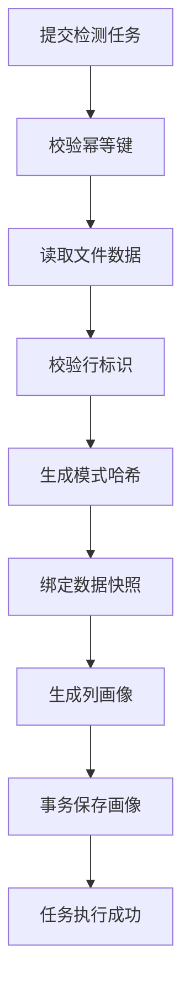

# Raha 数据检测迭代 2 落地与测试报告

## 1. 验收结论

根据《Raha 数据检测功能模块与任务计划》8.2 节，迭代 2 覆盖 `T016` 至 `T032`，目标为任务编排、数据快照、数据画像和开发期仓储。

本次已完成全部 17 项任务，并通过功能核对、端到端集成测试、全量单元测试、Java 8 兼容性检查、依赖边界检查、字节码检查和文件编码检查。工程根包统一为 `com.fiberhome.ml.raha`，实现只负责数据错误检测基础能力，不包含纠正候选、修复值或数据回写逻辑。

最终验收结论：迭代 2 功能完备，可以进入迭代 3 的策略框架、`OD` 和 `PVD` 实现。

## 2. 落地范围

### 2.1 任务编排与状态管理

- 实现 `RahaJobOrchestrator`，统一处理任务提交、阶段执行、状态迁移、重试、容忍失败和任务终止。
- 实现 `StageHandler`、`StageExecutionContext`、`StageResult` 和 `JobRunResult`，后续策略、特征和检测阶段可按同一契约接入。
- 实现任务、阶段和尝试标识生成器，并为阶段持久化绑定配置版本、快照版本、阶段版本和尝试次数。
- 实现确定性幂等键，相同数据集、输入、配置和配置版本的重复提交返回已有任务。
- 实现失败决策器，支持不可恢复失败立即终止、可恢复失败重试、失败率阈值判断和允许继续分支。
- 在执行前拒绝重复阶段类型，避免任务开始后才发现流水线定义冲突。
- 在数据加载后绑定实际快照；任务预期快照与实际快照冲突时，以 `SNAPSHOT_CONFLICT` 终止。

### 2.2 数据读取与快照

- 定义 `RahaDatasetLoader` 抽象接口，核心编排不依赖 FMDB 具体实现。
- 实现 `FileRahaDatasetLoader`，支持 Spark 读取 `CSV`、`JSON` 和 `Parquet`。
- 实现行标识字段存在性、空值、空白值和重复值校验，并使用稳定错误编码返回失败原因。
- 实现有序模式哈希，字段顺序、名称、类型或可空性变化都会生成不同哈希。
- 实现数据集快照，记录来源、模式哈希、行列规模、来源版本和创建时间。
- 相同数据、来源版本和模式生成稳定快照标识；显式快照标识可用于上游版本绑定。
- 实现字段包含、排除、敏感字段和可检测字段规则，行标识字段自动排除出检测集合。
- Spark `Dataset<Row>` 按只读引用传递，检测流程不修改原始输入。

### 2.3 值保护与数据画像

- 实现稳定的 SHA-256 值哈希和前后缀脱敏工具，空值使用固定标记。
- 实现总数、空值数、空白值数、非空率、不同值数、重复数和重复率画像。
- 实现数值可解析数量、数值占比、最小值、最大值、均值和四分位数画像。
- 实现最小长度、最大长度、平均长度、整数、小数、字母、字母数字、混合类型及字符存在性画像。
- 高频值摘要最多保留 20 项，只保存 SHA-256 哈希和计数，不保存原始值。
- 画像聚合在 Spark 侧执行，仅收集单列统计结果和受限频率摘要，避免全量值进入驱动端。
- 实现 `ColumnProfileService` 和 `ColumnProfileRepository`，支持按快照和列持久化与读取画像。

### 2.4 统一仓储

- 定义 `RahaRepository`、`RepositoryKey`、`RepositoryRecord`、`ArtifactVersion` 和事务回调接口。
- 定义任务、阶段、画像、策略、特征、聚类、标签、模型和检测结果命名空间，为后续迭代预留统一存储契约。
- 实现线程安全的 `InMemoryRahaRepository`，用于开发和本地端到端测试。
- 相同主键和相同版本重复写入返回 `UNCHANGED`，不产生重复有效记录。
- 相同主键写入新版本返回 `UPDATED`，保留当前有效版本语义。
- 事务回调失败时恢复事务前快照，画像批量保存使用该事务边界。
- 任务、阶段和画像仓储仅依赖统一仓储接口，后续可替换为 FMDB 适配实现。

## 3. 任务逐项核对

| 任务 | 验收要求 | 落地结果 | 状态 |
| --- | --- | --- | --- |
| `T016` | 非法状态跳转被拒绝 | 任务和阶段状态机校验非法迁移 | 已完成 |
| `T017` | 可串联读取、策略、特征和检测阶段 | 通用阶段处理器已串联读取、策略、特征和预测测试链路 | 已完成 |
| `T018` | 重复提交可识别同一请求 | 确定性幂等键和任务仓储查询已落地 | 已完成 |
| `T019` | 支持失败阈值和可恢复状态 | 已覆盖重试、容忍继续、不可恢复终止和快照冲突 | 已完成 |
| `T020` | 核心层不依赖 FMDB 具体类 | 数据加载使用 `RahaDatasetLoader` 抽象 | 已完成 |
| `T021` | 本地测试数据可读取为 Spark 数据集 | 文件加载器和 Spark 本地集成测试通过 | 已完成 |
| `T022` | 缺失和重复行标识可被发现 | 缺字段、空白和重复标识均有稳定错误编码 | 已完成 |
| `T023` | 相同模式产生稳定哈希 | 模式哈希和快照稳定性测试通过 | 已完成 |
| `T024` | 避免暴露完整敏感值 | 值哈希、脱敏和仅哈希频率摘要已落地 | 已完成 |
| `T025` | 输出行数、空值和不同值统计 | 同时补齐非空率、频率摘要和重复率 | 已完成 |
| `T026` | 可识别数值列及长尾分布 | 数值占比、范围、均值和四分位数已落地 | 已完成 |
| `T027` | 为 `PVD` 生成稳定画像 | 长度、类型和字符存在性画像已落地 | 已完成 |
| `T028` | 画像可按快照和列读取 | 画像仓储接口和批量事务保存已落地 | 已完成 |
| `T029` | 核心服务只依赖仓储接口 | 统一仓储、专用仓储和事务边界已落地 | 已完成 |
| `T030` | 本地流程可保存中间结果 | 内存仓储和端到端持久化测试通过 | 已完成 |
| `T031` | 同一批次重写不产生重复记录 | 主键、版本和保存结果语义测试通过 | 已完成 |
| `T032` | 结果可追溯配置、快照和阶段版本 | `ArtifactVersion` 完整记录四类版本字段 | 已完成 |

## 4. 端到端链路



集成测试已实际执行 `CSV` 读取、快照绑定、三列画像生成、画像事务保存和任务成功结束，不是仅验证接口定义。

## 5. 测试与质量检查

### 5.1 全量构建

执行命令：

```powershell
$env:JAVA_HOME='D:\Program Files\java\jdk8u492-b09'
mvn -B -ntp clean verify
```

最终结果：

| 检查项 | 结果 |
| --- | --- |
| 主源码编译 | 83 个 Java 文件通过 |
| 测试源码编译 | 12 个 Java 文件通过 |
| 测试数量 | 38 |
| 失败数量 | 0 |
| 错误数量 | 0 |
| 跳过数量 | 0 |
| JAR 打包 | `target/fmdb-udf-raha-1.0.0-SNAPSHOT.jar` 已生成 |
| Java 8 API 检查 | `animal-sniffer` 通过 |
| Maven 依赖禁止规则 | 全部通过 |
| 最终构建状态 | `BUILD SUCCESS` |

### 5.2 测试覆盖

- 状态机非法迁移、任务快照隔离和失败状态。
- 重复任务提交、四类阶段串联、重试、容忍继续和终止。
- 重复阶段定义和任务快照冲突。
- 文件读取、字段元数据、稳定快照和稳定模式哈希。
- 行标识缺失、空白、重复及外部文件读取失败。
- 值哈希、短值和长值脱敏。
- 原始值频率键拒绝和高频摘要数量上限。
- 空值、非空率、不同值、重复率、长度、字符、类型和数值分位数画像。
- 统一仓储新增、重复写入、新版本更新、分区查询和事务回滚。
- 文件读取、快照、画像、仓储和任务状态的实际端到端链路。
- 领域对象无纠正、修复和清洗字段。

### 5.3 静态核验

| 核验项 | 结果 |
| --- | --- |
| 根包路径 | 全部为 `com.fiberhome.ml.raha` |
| 纠正实现关键词 | 主源码未发现 |
| Spark 依赖 | `spark-sql_2.12:3.3.1`，作用域为 `provided` |
| Scala 版本 | 仅 2.12 构件 |
| Java 字节码 | 主版本 52，即 Java 8 |
| UTF-8 BOM | 0 个文件 |
| CRLF | 0 个受检文件 |
| 乱码替换字符 | 0 个文件 |

## 6. 环境提示与后续边界

Windows 本地测试环境未配置 `winutils.exe` 和原生 Hadoop 库，Spark 自动回退到 Java 内置实现。该提示未影响本轮 38 个测试和构建结果；部署到实际 Spark 集群时仍需使用集群统一的 Hadoop 环境进行验证。

开发期仓储当前为进程内内存实现，重启后不保留数据。FMDB 持久化适配属于后续生产接入范围，不在迭代 2 内。

迭代 2 只提供通用策略、特征和检测阶段的编排契约，`OD`、`PVD` 等具体策略实现属于迭代 3。当前未提前加入数据纠正、修复候选或回写能力。

## 7. 最终判定

`T016` 至 `T032` 全部完成，功能范围、异常边界、敏感值保护、端到端链路和质量门禁均有实现及测试证据。未发现阻止进入迭代 3 的遗留问题。
