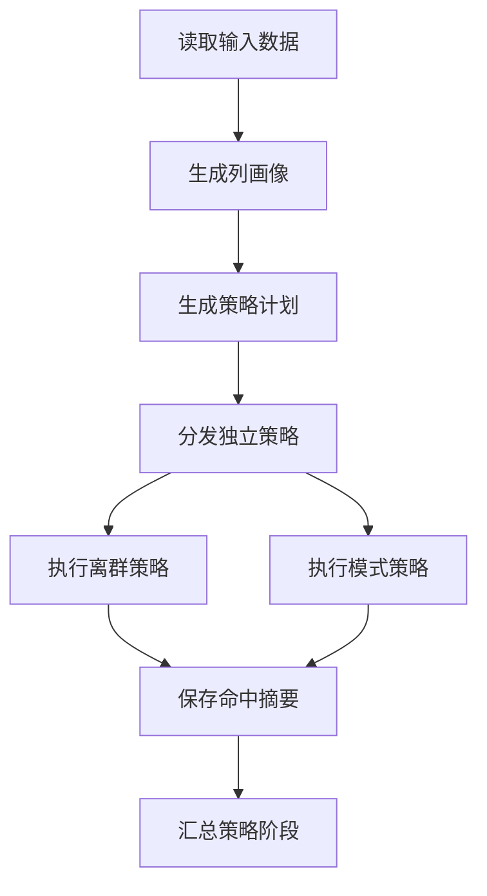

# Raha 数据检测迭代 3 落地与测试报告

## 1. 验收结论

根据《Raha 数据检测功能模块与任务计划》8.2 节，迭代 3 覆盖 `T033` 至 `T046`，目标为策略框架、`OD` 离群策略和 `PVD` 模式策略。

本次已完成全部 14 项任务，形成从列画像生成策略计划、隔离执行策略、输出候选命中、生成运行摘要到版本化持久化的完整链路。工程根包保持为 `com.fiberhome.ml.raha`，所有策略只输出候选错误信号，不输出最终 `isError`，也不包含纠正候选、修复值或数据回写。

最终验收结论：迭代 3 功能完备，可以进入迭代 4 的 `RVD`、特征组装和基础检测实现。

## 2. 策略框架落地

### 2.1 统一策略契约

- 定义 `DetectionStrategy`，统一策略类型、策略族和候选检测方法。
- 定义 `StrategyExecutionContext`，绑定任务、阶段、只读数据集和策略计划。
- 定义 `StrategyCandidate`，只保存行标识、字段、值哈希、原因和分数。
- 定义 `StrategyExecutionResult` 和 `StrategyRunSummary`，统一成功、失败、命中数量、输入规模、耗时和失败原因。
- 定义 `StrategyRegistry`，按策略类型分发具体实现，编排层不依赖算法类。
- 失败策略不允许保留部分命中，避免摘要状态和结果状态不一致。

### 2.2 策略计划

- 实现 `StrategyPlanGenerator`，根据字段可检测属性、列画像和策略配置生成计划。
- 同一画像、目标字段和配置生成相同 `strategyId` 与配置哈希。
- 策略标识由策略族、目标字段顺序和配置哈希共同生成。
- 支持字段白名单、字段黑名单、策略类型白名单、策略类型黑名单和策略族过滤。
- 支持策略类型优先级覆盖，计划按优先级和策略标识稳定排序。
- 策略数量超过上限时按稳定顺序截断并记录告警。
- 数值策略只对具备足够数值样本和完整统计的字段生成。
- 全空字段只在启用 `PVD` 时生成空值策略，不会越过策略族配置。

### 2.3 超时和失败隔离

- 每个策略使用独立工作线程执行。
- 每个 Spark 策略绑定独立作业组，超时时取消对应作业组。
- 超时统一返回 `STRATEGY_TIMEOUT`，线程中断返回 `STRATEGY_INTERRUPTED`。
- 未处理异常统一返回 `STRATEGY_EXECUTION_FAILED`，并记录任务、策略和异常堆栈。
- 一个策略失败时，其他策略继续执行和保存；失败数量交给任务失败比例规则判断。
- 策略开始、完成、超时、失败和批次摘要均有日志记录。

### 2.4 策略仓储

- 新增策略计划、策略命中和策略运行摘要仓储契约。
- 计划按数据集和快照分区，读取时保持优先级顺序。
- 命中按任务、策略、单元格和原因组成稳定主键。
- 摘要按任务和策略组成稳定主键。
- 单策略摘要和全部命中在同一事务中保存。
- 相同主键和版本重复执行不产生重复有效记录。

## 3. `OD` 策略

| 策略类型 | 实现方式 | 原因编码 | 边界处理 |
| --- | --- | --- | --- |
| `OD_LOW_FREQUENCY` | 按值哈希统计频率并识别低频值 | `OD_LOW_FREQUENCY` | 空值不参与，结果不包含原始值 |
| `OD_NUMERIC_DISTANCE` | 根据画像均值和总体标准差计算标准距离 | `OD_NUMERIC_DISTANCE` | 空值和不可解析值跳过，标准差为零时不误报 |
| `OD_QUANTILE` | 使用第一、第三四分位数和四分位距边界 | `OD_QUANTILE_OUTLIER` | 四分位距为零时不强制生成离群结果 |

策略计划默认使用以下配置：

- 低频阈值为非空数量的百分之一，最小为一次。
- 标准距离阈值为 `3.0`。
- 四分位距倍数为 `1.5`。
- 阈值均保存在策略计划中并进入配置哈希，可通过自定义计划重放不同配置。

## 4. `PVD` 策略

| 策略类型 | 实现方式 | 原因编码 |
| --- | --- | --- |
| `PVD_CHARACTER_SET` | 统计数字、拉丁字母、中文、空格和符号组合，识别少数模式 | `PVD_MINOR_CHARACTER_SET` |
| `PVD_LENGTH` | 使用长度四分位距和少数长度分布识别异常 | `PVD_LENGTH_OUTLIER` |
| `PVD_NULL_PLACEHOLDER` | 区分空值、空白值和特殊占位值 | `PVD_NULL_VALUE`、`PVD_BLANK_VALUE`、`PVD_PLACEHOLDER_VALUE` |
| `PVD_TYPE_FORMAT` | 识别少数类型并检查受控格式 | `PVD_TYPE_MISMATCH`、`PVD_FORMAT_MISMATCH` |

类型识别支持整数、小数、拉丁字母、中文、字母数字和混合类型。格式检测支持：

- 日期。
- 时间。
- 电话。
- 邮箱。
- 编号。

`AUTO` 格式模式根据字段名称选择候选格式，只有匹配比例达到适用阈值时才输出不匹配候选，避免字段名称误导导致整列误报。显式格式配置可直接执行指定格式规则。

## 5. 任务阶段链路

新增 `StrategyPlanStageHandler` 和 `StrategyRunStageHandler`，已接入迭代 2 的任务编排器。



端到端测试已实际执行文件读取、行标识校验、快照绑定、画像、计划生成、`OD` 和 `PVD` 执行、候选命中保存、摘要保存和任务成功结束。

## 6. 任务逐项核对

| 任务 | 验收要求 | 落地结果 | 状态 |
| --- | --- | --- | --- |
| `T033` | 所有策略使用统一契约 | 统一接口、上下文、候选、结果和注册表已落地 | 已完成 |
| `T034` | 相同画像和配置生成相同计划 | 确定性计划和顺序测试通过 | 已完成 |
| `T035` | 策略结果可稳定去重 | 配置哈希、策略标识和仓储主键测试通过 | 已完成 |
| `T036` | 单策略失败不破坏状态一致性 | 异常、超时和批次独立持久化测试通过 | 已完成 |
| `T037` | 输出命中数、耗时和失败原因 | 运行摘要已持久化并可按任务查询 | 已完成 |
| `T038` | 输出低频候选及原因 | 值频策略覆盖低频、空值边界 | 已完成 |
| `T039` | 输出数值离群候选及分数 | 标准差距离策略覆盖不可解析值 | 已完成 |
| `T040` | 长尾数据具备稳定检测行为 | 四分位距策略覆盖长尾离群 | 已完成 |
| `T041` | 覆盖正常、离群、空值和不可解析 | 三类 `OD` Spark 测试通过 | 已完成 |
| `T042` | 识别列内少数字符模式 | 五类字符签名和少数模式已落地 | 已完成 |
| `T043` | 识别长度分布异常 | 长度四分位距和少数长度已落地 | 已完成 |
| `T044` | 区分空值、空白和特殊占位值 | 三类原因编码测试通过 | 已完成 |
| `T045` | 输出类型或格式异常原因 | 多类型及五类受控格式测试通过 | 已完成 |
| `T046` | 覆盖多字符类型和空值边界 | 四组 `PVD` Spark 测试通过 | 已完成 |

## 7. 测试与质量检查

### 7.1 全量构建

执行命令：

```powershell
$env:JAVA_HOME='D:\Program Files\java\jdk8u492-b09'
mvn -B -ntp clean verify
```

最终结果：

| 检查项 | 结果 |
| --- | --- |
| 主源码编译 | 109 个 Java 文件通过 |
| 测试源码编译 | 18 个 Java 文件通过 |
| 测试报告文件 | 17 个 |
| 测试数量 | 56 |
| 失败数量 | 0 |
| 错误数量 | 0 |
| 跳过数量 | 0 |
| JAR 打包 | `target/fmdb-udf-raha-1.0.0-SNAPSHOT.jar` 已生成 |
| Java 8 API 检查 | `animal-sniffer` 通过 |
| Maven 依赖禁止规则 | 全部通过 |
| 最终构建状态 | `BUILD SUCCESS` |

### 7.2 迭代 3 新增测试

- 策略配置过滤冲突。
- 策略计划稳定标识、配置哈希、适用性、优先级和上限。
- 全空字段策略族边界。
- 策略计划、命中和摘要去重及优先级读取。
- 单策略异常、超时和批次失败隔离。
- `OD` 低频、标准差距离和四分位距。
- `PVD` 字符集合、长度、空值、空白和占位值。
- 整数、小数、中文、拉丁字母和混合类型。
- 日期、时间、电话、邮箱和编号格式。
- 文件读取到候选命中持久化的完整任务链路。

### 7.3 静态核验

| 核验项 | 结果 |
| --- | --- |
| 根包路径 | 全部为 `com.fiberhome.ml.raha` |
| 纠正实现关键词 | 主源码未发现 |
| Spark 依赖 | `spark-sql_2.12:3.3.1`，作用域为 `provided` |
| Scala 版本 | 仅 2.12 构件 |
| Java 字节码 | 主版本 52，即 Java 8 |
| UTF-8 BOM | 0 个文件 |
| CRLF | 0 个受检文件 |
| 乱码替换字符 | 0 个文件 |

## 8. 环境提示与后续边界

Windows 本地环境未配置 `winutils.exe` 和原生 Hadoop 库，Spark 自动使用 Java 内置实现。该提示未影响 56 个测试和完整构建；实际集群部署仍需使用集群统一 Hadoop 环境验证。

迭代 3 的策略命中只是候选检测信号。候选到最终 `isError` 的评分、特征组装和解释属于迭代 4，当前不得把任一单策略命中直接视为最终错误。

`RVD` 关系策略属于迭代 4，本轮未提前实现。工程仍不包含任何数据纠正、修复候选或原始数据回写能力。

## 9. 最终判定

`T033` 至 `T046` 全部完成，策略计划、执行隔离、`OD`、`PVD`、候选持久化、运行摘要和质量门禁均有实现及测试证据。未发现阻止进入迭代 4 的遗留问题。
