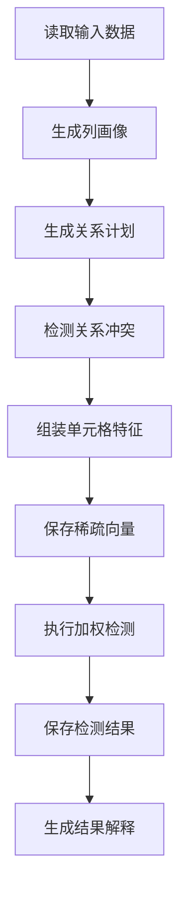

# Raha 数据检测迭代 4 落地与测试报告

## 1. 验收结论

根据《Raha 数据检测功能模块与任务计划》8.2 节，迭代 4 覆盖 `T047` 至 `T065`，目标为 `RVD` 关系检测、特征工程、基础检测与结果解释，以及日志、指标和异常基础能力。

本次已完成全部 19 项任务，形成从有向列对计划、一对多冲突检测、策略与上下文特征组装、稳定特征字典、稀疏向量持久化，到规则加权评分、最终单元格检测结果、结果解释和版本化持久化的完整链路。工程根包统一为 `com.fiberhome.ml.raha`。

最终验收结论：迭代 4 功能完备，`mvn clean verify` 全量构建成功，69 个测试全部通过，可以进入迭代 5 的基础对齐测试和聚类采样实现。

## 2. `RVD` 关系检测

### 2.1 列对计划

- `StrategyPlanGenerator` 支持生成有向单列到单列 `RVD` 计划。
- 只枚举可检测、未被字段过滤器排除且具备非空画像数据的字段。
- 数组、映射、结构体和二进制字段不参与关系依赖枚举。
- 支持策略族、策略类型白名单和黑名单过滤。
- 通过 `maxRvdColumnPairs` 对宽表列对数量实施硬上限。
- 列对达到上限时停止继续枚举并记录候选数量和上限告警。
- 依赖方向进入目标字段顺序、配置哈希和稳定策略标识。

### 2.2 一对多冲突

- 新增 `RVD_ONE_TO_MANY` 策略。
- 对同一左值对应多个不同右值的关系输出冲突候选。
- 空值和空白值不参与依赖统计。
- 冲突组内左侧和右侧单元格均可定位。
- 原因编码统一为 `RVD_ONE_TO_MANY_CONFLICT`。
- 原因详情包含依赖方向、目标侧、不同右值数量和冲突组规模。
- 冲突分数使用 `1 - 1 / 不同右值数量`，并限制在零到一之间。

## 3. 特征工程

### 3.1 策略与上下文特征

- 每个可检测单元格生成对应策略计划的二值命中特征。
- 按策略族生成唯一命中策略数量摘要。
- 生成单元格最大策略分数。
- 生成值长度、空值、空白、数字、字母、中文和符号特征。
- 生成数值、字母、中文、字母数字和混合类型特征。
- 生成列内频次、频次比例和稀有值桶特征。
- 生成相邻 `RVD` 冲突数量特征。
- 值规范化支持去除首尾空白、统一小写和全半角规范化配置。

### 3.2 字典与稀疏向量

- 全零和常量特征可按配置移除。
- 单列特征数量受 `maxFeatureCount` 限制。
- 字典按字段、特征名称、类型、来源和配置生成稳定版本。
- 相同输入和配置重复组装得到相同字典版本。
- 稀疏向量只保存非零值，并携带单元格坐标、值哈希和字典版本。
- 特征字典按任务和字段保存，稀疏向量按任务、字段和单元格保存。
- 同质列全部特征被过滤后，仍保留每个单元格的空稀疏向量，保证检测覆盖不丢行。
- 敏感字段只保存掩码和值哈希，不保存完整原始值。

## 4. 基础检测与解释

### 4.1 可配置评分

- `ModelConfig` 支持配置各策略族可靠度权重和上下文信号权重。
- 默认权重覆盖 `OD`、`PVD`、`RVD`、`KBVD` 和 `TFIDF`。
- 同一策略多条原因只使用最强信号参与融合，避免重复计分。
- 不同策略使用噪声或方式融合，分数稳定限制在零到一之间。
- 上下文信号受独立权重上限约束，不会无界放大。
- 模型阈值、策略族权重和上下文权重均校验零到一范围。

### 4.2 检测闭环

- `weighted_rule` 模式直接执行规则加权检测。
- 其他尚未实现的分类器在允许降级时明确标记为 `fallback_weighted_rule`。
- 禁止降级时抛出带稳定错误编码的统一检测异常。
- 每个特征单元格均输出 `DetectionResult`，由配置阈值决定 `isError`。
- 结果包含任务、配置版本、阶段、快照坐标、值哈希、掩码、模型版本和特征字典版本。
- 检测结果按任务和单元格稳定主键持久化。
- 解释服务可反查策略类型、策略配置、原因详情、策略分数和特征摘要。
- 结果对象、仓储和接口均不包含纠正值、修复值或建议值字段。

## 5. 日志、指标与异常

- 新增 `RahaLogContext`，统一任务、阶段、尝试序号和快照标识。
- 任务日志覆盖创建、开始、成功、失败和重复提交分支。
- 阶段日志覆盖开始、成功、跳过、失败、重试和继续分支。
- 阶段结束日志包含耗时、处理总数和失败数摘要。
- 任务结束日志包含总耗时和阶段尝试数量。
- 策略批次记录计划数、命中数和失败数。
- 特征组装记录单元格数、字典数、保留特征数和常量移除数。
- 检测记录检测单元格数、疑似错误数和平均分数。
- 新增参数、数据、策略、特征、检测、存储和系统异常分类。
- `RahaException` 携带稳定错误编码、错误分类和可恢复标识。
- `SensitiveLogGuard` 可拒绝包含完整敏感值的日志文本。
- 主源码日志静态扫描未发现原始值直接输出路径。

## 6. 端到端链路



端到端测试使用包含 `id`、`code` 和敏感 `city` 字段的文件数据，实际执行加载、画像、两条有向 `RVD` 计划、冲突命中、12 个单元格特征、12 个检测结果、6 个疑似错误、敏感值掩码、仓储读取和结果解释。

## 7. 任务逐项核对

| 任务 | 验收要求 | 落地结果 | 状态 |
| --- | --- | --- | --- |
| `T047` | 宽表不会无限枚举列对 | 有向列对过滤和硬上限测试通过 | 已完成 |
| `T048` | 可定位依赖冲突单元格 | 一对多冲突双侧定位已落地 | 已完成 |
| `T049` | 可解释冲突规模和方向 | 分数、依赖方向和冲突统计已输出 | 已完成 |
| `T050` | 覆盖唯一映射、冲突和空值 | 三组 `RVD` Spark 测试通过 | 已完成 |
| `T051` | 每个单元格生成策略二值向量 | 策略计划和命中映射已落地 | 已完成 |
| `T052` | 生成值和列内上下文特征 | 值形态、类型、频率和关系上下文已落地 | 已完成 |
| `T053` | 全零和常量特征被移除 | 常量过滤及同质列保行测试通过 | 已完成 |
| `T054` | 训练和检测使用稳定字典 | 确定性字典版本测试通过 | 已完成 |
| `T055` | 特征可按列和批次读取 | 字典和稀疏向量事务持久化测试通过 | 已完成 |
| `T056` | 评分规则可配置和解释 | 策略族权重、上下文权重和原因摘要已落地 | 已完成 |
| `T057` | 输入表输出单元格检测结果 | 全单元格基础检测服务已落地 | 已完成 |
| `T058` | 结果可反查策略和原因 | 解释服务端到端测试通过 | 已完成 |
| `T059` | 结果包含任务、快照和版本 | 结果对象及仓储版本字段齐全 | 已完成 |
| `T060` | 对象、表和接口无修复值 | 反射测试和关键词扫描通过 | 已完成 |
| `T061` | 日志包含任务、阶段和尝试标识 | 统一日志上下文测试通过 | 已完成 |
| `T062` | 区分参数、数据、策略和存储异常 | 错误编码、分类和统一异常已落地 | 已完成 |
| `T063` | 核心路径有开始、分支和结束日志 | 任务及阶段关键日志和耗时摘要已落地 | 已完成 |
| `T064` | 可统计命中、失败和检测数量 | 策略、特征和检测指标已落地 | 已完成 |
| `T065` | 日志不输出完整敏感值 | 日志保护测试和静态扫描通过 | 已完成 |

## 8. 测试与质量检查

### 8.1 全量构建

执行命令：

```powershell
$env:JAVA_HOME='D:\Program Files\java\jdk8u492-b09'
mvn -B -ntp clean verify
```

| 检查项 | 结果 |
| --- | --- |
| 主源码编译 | 135 个 Java 文件通过 |
| 测试源码编译 | 23 个 Java 文件通过 |
| 测试报告文件 | 22 个 |
| 测试数量 | 69 |
| 失败数量 | 0 |
| 错误数量 | 0 |
| 跳过数量 | 0 |
| JAR 打包 | `target/fmdb-udf-raha-1.0.0-SNAPSHOT.jar` 已生成 |
| Java 8 API 检查 | `animal-sniffer` 通过 |
| Maven 依赖禁止规则 | 全部通过 |
| 最终构建状态 | `BUILD SUCCESS` |

### 8.2 迭代 4 新增测试

- `RVD` 有向列对上限和复杂字段过滤。
- 唯一映射、一对多冲突、空值和空白边界。
- 冲突双侧坐标、分数、方向和规模详情。
- 策略二值特征、策略族摘要和上下文特征。
- 全零、常量特征过滤和同质列保行。
- 特征字典版本稳定性和稀疏持久化。
- 敏感字段掩码和值哈希保护。
- 策略族权重、上下文权重和阈值校验。
- 加权检测、降级标记和禁止降级异常。
- 检测结果持久化、版本字段和解释反查。
- 日志上下文、错误分类和敏感值日志检查。
- 文件读取到最终检测结果的完整任务流水线。

### 8.3 静态核验

| 核验项 | 结果 |
| --- | --- |
| 根包路径 | 全部为 `com.fiberhome.ml.raha` |
| 纠正结果字段 | 主源码未发现 |
| Java 字节码 | 主版本 52，即 Java 8 |
| 受检文本文件 | 165 个 |
| UTF-8 BOM | 0 个文件 |
| CRLF | 0 个受检文件 |
| 非法 UTF-8 | 0 个文件 |
| 完整敏感值日志路径 | 未发现 |

## 9. 环境提示与后续边界

Windows 本地环境未配置 `winutils.exe` 和原生 Hadoop 库，Spark 自动使用 Java 内置实现。该提示未影响 69 个测试和完整构建；后续仍需在目标 Hadoop 与 Spark 集群环境执行兼容性验证。

当前基础检测只提供 `weighted_rule` 和明确标记的 `fallback_weighted_rule`。聚类、主动采样、标签传播和列级机器学习模型属于后续迭代，不应把当前规则权重视为最终 Raha 学习模型。

本工程只做数据检测。所有输出只表达候选信号、特征、检测分数、错误判断和解释，不生成纠正候选，不推荐修复值，也不回写原始数据。

## 10. 最终判定

`T047` 至 `T065` 全部完成。`RVD`、特征组装、稳定字典、稀疏持久化、基础检测、结果解释、检测结果持久化、日志、指标、异常和敏感值保护均有实现及测试证据，未发现阻止进入迭代 5 的遗留问题。
