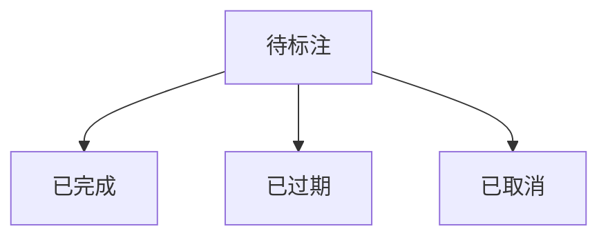
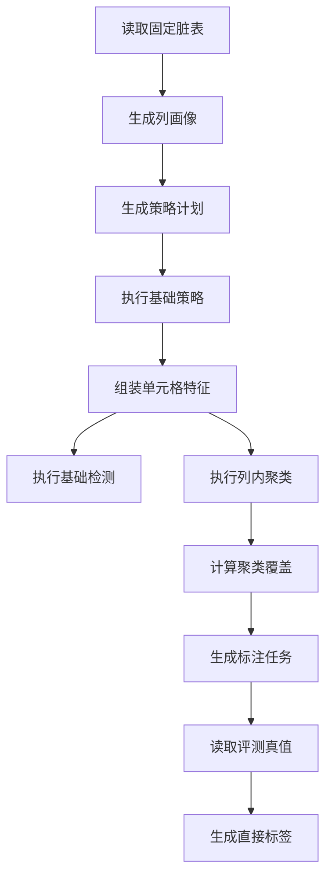

# Raha 数据检测迭代 5 落地与 P0 验收报告

## 1. 验收结论

根据《Raha 数据检测功能模块与任务计划》8.2 节，迭代 5 覆盖 `T066` 至 `T078`，目标为固定数据和 Python demo 对齐、P0 检测闭环验收、列内聚类、主动采样、标注任务状态和评测真值自动标注。

本次已完成全部 13 项任务。工程形成以下新增闭环：

- 固定脏表和真值表。
- 实际 Python demo 策略、特征、采样和检测基线。
- 可替换列聚类接口和小表精确层次聚类。
- 聚类结果状态、版本和成员持久化。
- 聚类覆盖评分和可复现加权无放回采样。
- 待标注、完成、过期和取消四态标注任务。
- 仅评测模式可用的真值自动标注。
- Spark 本地模式从读取、策略、特征、检测到聚类、采样和标注的完整流水线。

最终验收结论：迭代 5 功能完备，P0 检测、定位、解释和复跑能力成立，列内聚类与有限预算采样可运行。全量 `mvn clean verify` 构建成功，81 个测试全部通过，可以进入迭代 6 的标签仓储、标签传播、列级模型和版本管理实现。

## 2. 固定数据和 Python 基线

### 2.1 固定测试数据

固定数据位于：

- `src/test/resources/alignment/iteration5-dirty.csv`
- `src/test/resources/alignment/iteration5-clean.csv`

数据规模为 10 行、6 列，其中 `id` 为行标识，5 个字段参与检测。真值差异共 7 个单元格，覆盖：

- 依赖冲突：`code`。
- 缺失值：`city`。
- 数值离群和不可解析数值：`amount`。
- 日期格式和占位值：`event_date`。
- 邮箱格式：`email`。

固定数据哈希：

| 文件 | SHA-256 |
| --- | --- |
| 脏表 | `57b9ee3335a855dc564887ac75e63a2f728ebb84e5cfc843f4a154e312be7069` |
| 真值表 | `4234359d12a43fa8ccdf38b8d53184b41d4951fc19c689c02671736f2e2ab813` |

### 2.2 Python demo 基线

基线生成脚本：

- `scripts/generate_iteration5_python_baseline.py`

基线产物：

- `src/test/resources/alignment/iteration5-python-baseline.json`
- `src/test/resources/alignment/iteration5-python-baseline.properties`

Python demo 来源：

| 项目 | 值 |
| --- | --- |
| 路径 | `F:\ai-code\raha\raha-master\raha\detection.py` |
| Git 提交 | `c24abd8a9c8effaf2bc29e88bb769c781ceb0d8e` |
| 随机种子 | `20260714` |
| 标注预算 | 5 |
| 全流程策略族 | `PVD`、`RVD` |
| 代表性 OD 配置 | `gaussian 3.0`、`histogram 0.1 0.1` |

基线摘要：

| 项目 | Python 输出 |
| --- | --- |
| `PVD` 和 `RVD` 策略画像数量 | 102 |
| `code` 到 `city` 的 RVD 命中 | `3:code`、`3:city`、`4:code`、`4:city` |
| 日期斜杠字符策略命中 | `7:event_date` |
| OD 高斯代表配置命中 | `5:city`、`9:amount`、`10:event_date` |
| OD 直方图代表配置命中数 | 48 |
| 列特征数量 | `id:13`、`code:14`、`city:20`、`amount:14`、`event_date:18`、`email:17` |
| 采样行下标 | 2、5、7、6、1 |
| 最终检测单元格 | `6:amount`、`7:event_date`、`8:email` |

基线生成脚本连续运行两次得到相同 JSON SHA-256：

`52da1f0db2e5787f3b7ad64c7aa60da37cf77af5f6f1369f40d954bf8cda50ce`

Python OD 使用的 dBoost 在 Windows 下存在临时输入文件句柄延迟释放问题。生成脚本只对该已知问题实施延迟回收和临时文件清理，不修改算法输出；运行结束后临时文件残留数量为零。

## 3. Python 和 Java 对齐结论

### 3.1 一致行为

- `RVD` 均按有向列对检查同一左值对应多个右值。
- 固定数据中 `code` 到 `city` 的四个冲突单元格完全一致。
- 特征均按字段独立组织。
- 无区分度特征均从后续聚类输入中移除。
- 聚类对象均为同一字段的单元格特征。
- 聚类距离均使用余弦距离。
- 低标注聚类使用 `exp(-已有标签数)` 获得更高覆盖贡献。
- 已标注元组不会在非复核模式重复采样。
- 固定随机种子可以复现基线和 Java 采样结果。
- Python 最终检测的三个单元格均被 Java 基础检测结果覆盖。

### 3.2 可解释差异

| 差异 | Python demo | Java Spark 工程 | 结论 |
| --- | --- | --- | --- |
| 行标识字段 | 与普通字段一起生成策略和特征 | `id` 只做稳定坐标，不参与检测 | Java 避免行标识噪声，检测粒度不变 |
| 策略数量 | 每字符和全部列对枚举，固定数据产生 102 个 PVD 和 RVD 画像 | 使用类型、画像、白黑名单和列对上限生成有限计划 | Java 数量更少且可治理 |
| 日期斜杠 | PVD 字符策略把 `/` 作为命中字符 | 日期格式明确允许 `-` 和 `/` | Java 不输出错误格式原因，该差异已测试锁定 |
| OD | 通过 dBoost 生成多组高斯和直方图配置 | 使用低频、数值距离和四分位距策略 | 命中集合不要求完全一致，原因和阈值均可解释 |
| 聚类簇数 | 按标注轮次预生成 2 到预算加一的多个簇数 | 每次任务使用配置簇数并写入聚类版本 | Java 可通过多次配置运行复现多粒度行为 |
| 采样选择 | 按权重随机选择一行并逐轮更新 | 固定种子加权无放回，一次生成预算内任务 | 低覆盖趋势一致，具体行序列允许不同 |
| 最终模型 | 默认梯度提升分类器 | 当前使用规则加权基础检测 | 列级机器学习模型属于迭代 6，不伪装为已完成 |

因此，基础策略、特征组织、关系冲突、聚类方向和采样趋势已对齐；实现差异均有明确工程原因和回归测试，不存在未说明的检测粒度或标签语义变化。

## 4. 列内聚类

### 4.1 统一接口和配置

- 新增 `ColumnClusterer` 可替换接口。
- 聚类实现通过依赖注入接入服务和任务阶段。
- `ClusteringConfig` 支持余弦距离、目标簇数量和精确聚类样本上限。
- 随机种子使用任务级 `randomSeed`，进入配置版本、聚类版本和并列合并决策。
- 默认精确聚类样本上限为 500，超过上限返回状态，不在 Driver 上继续无界计算。

### 4.2 层次聚类实现

- 新增平均连接层次聚类 `hierarchical_average_cosine_v1`。
- 稀疏向量直接计算余弦距离，不转换为包含原始值的对象。
- 完全相同方向的向量优先合并。
- 距离并列时使用随机种子和成员签名生成稳定决策键。
- 最终聚类编号按成员签名稳定排序。
- 每个成员保存到所在簇质心的余弦距离。
- 聚类版本包含字段、特征字典、算法、距离、簇数、样本上限、随机种子、状态和成员映射。

### 4.3 空结果和异常状态

支持以下可解释状态：

- `SUCCEEDED`
- `EMPTY_INPUT`
- `EMPTY_FEATURES`
- `SINGLE_SAMPLE`
- `INPUT_LIMIT_EXCEEDED`
- `DISTANCE_UNDEFINED`
- `FAILED`

空输入、空特征、单样本和样本超限不会产生无说明异常。单列未处理异常由 `ColumnClusteringService` 捕获并记录堆栈，返回带实际算法名称和异常类别的 `FAILED` 结果，其他字段继续执行。

### 4.4 持久化

- 聚类运行结果保存在 `CLUSTER_RUN_SUMMARY` 命名空间。
- 聚类成员保存在 `CLUSTER_ASSIGNMENT` 命名空间。
- 成员可按任务、字段和聚类版本读取。
- 摘要和全部成员在统一仓储事务中提交。
- 空结果仍保存运行摘要，便于解释字段为何没有聚类成员。

## 5. 主动采样与标注任务

### 5.1 聚类覆盖评分

- 只使用直接标签统计聚类覆盖，传播标签不冒充直接标注。
- 未标注聚类的单列贡献为 `exp(0)`。
- 已有标签越多，贡献按 `exp(-标签数)` 下降。
- 一行覆盖多个低标签聚类时累加贡献。
- 累积贡献再次指数放大，保持 Python demo 的元组权重趋势。
- 采样分数保存每列贡献和覆盖聚类，结果可解释。

### 5.2 元组采样

- 使用固定随机种子的加权无放回算法。
- 采样结果不超过 `labelingBudget`。
- 同一批次不会输出重复行。
- 非复核模式排除已有直接标签的行。
- 待标注任务始终排除，防止重复展示。
- 非复核模式还排除已经完成、过期或取消的历史任务。
- 相同输入、配置、排除集合和随机种子得到相同采样版本和结果。

### 5.3 标注任务状态

标注任务只保存任务、行标识、轮次、采样分数、覆盖聚类、采样版本和状态，不包含修复值。

状态转换：



- 终态任务不能再次修改。
- 未到过期时间不能标记过期。
- 超过有效期的任务不能提交完成。
- 复核必须生成新的采样任务和采样版本。
- 任务状态快照按任务标识持久化。

## 6. 真值自动标注

- `GroundTruthLabelAdapter` 只接受 `EVALUATION` 任务。
- 生产检测、训练和普通采样模式调用时直接拒绝。
- 脏表和真值表必须使用相同行标识字段。
- 每个待标注行在两张表中必须且只能出现一次。
- 只比较可检测字段。
- 相同值生成标签零，不同值生成标签一。
- 标签来源固定为 `GROUND_TRUTH`，置信度为一。
- 适配器不保存真值内容，不输出纠正值，也不记录行值日志。
- 自动标注完成后，标注任务进入 `COMPLETED` 并更新仓储状态。

## 7. 端到端验收



Spark 本地端到端测试实际得到：

| 项目 | 结果 |
| --- | --- |
| 可检测字段 | 5 |
| 单元格特征 | 50 |
| 检测结果 | 50 |
| 聚类成员 | 50 |
| 采样预算 | 3 |
| 标注任务 | 3 |
| 真值直接标签 | 15 |
| 标注任务最终状态 | 全部 `COMPLETED` |
| Python RVD 固定命中对齐 | 完全一致 |
| Python 最终检测单元格覆盖 | 全部覆盖 |
| 任务最终状态 | `SUCCEEDED` |

## 8. 任务逐项核对

| 任务 | 验收要求 | 落地结果 | 状态 |
| --- | --- | --- | --- |
| `T066` | 覆盖缺失、格式、离群和依赖冲突 | 固定脏表和真值表已建立并冻结哈希 | 已完成 |
| `T067` | 保存策略、特征和检测基线 | 实际 Python demo JSON 和属性基线已生成 | 已完成 |
| `T068` | 基础策略差异有可解释结论 | RVD 精确对齐，PVD 和 OD 差异已测试和记录 | 已完成 |
| `T069` | Spark 本地模式可完整运行 | 检测、聚类、采样和标注端到端测试通过 | 已完成 |
| `T070` | 确认检测、定位、解释和复跑成立 | 本报告完成 P0 逐项验收 | 已完成 |
| `T071` | 聚类实现可替换 | `ColumnClusterer` 接口和注入式服务已落地 | 已完成 |
| `T072` | 小表聚类结果可复现 | 平均连接余弦聚类和固定种子测试通过 | 已完成 |
| `T073` | 可按列和版本读取聚类成员 | 聚类摘要和成员事务持久化测试通过 | 已完成 |
| `T074` | 异常列不导致无说明失败 | 七类状态和单列异常隔离测试通过 | 已完成 |
| `T075` | 低标签聚类获得更高采样分数 | 覆盖贡献排序测试通过 | 已完成 |
| `T076` | 在预算内输出不重复元组 | 加权无放回、预算和复现测试通过 | 已完成 |
| `T077` | 支持待标注、完成、过期和取消 | 四态状态机和仓储已落地 | 已完成 |
| `T078` | 仅评测模式可由真值生成标签 | 模式限制和 Spark 真值适配测试通过 | 已完成 |

## 9. 测试与质量检查

### 9.1 全量构建

执行命令：

```powershell
$env:JAVA_HOME='D:\Program Files\java\jdk8u492-b09'
mvn -B -ntp clean verify
```

| 检查项 | 结果 |
| --- | --- |
| 主源码编译 | 164 个 Java 文件通过 |
| 测试源码编译 | 28 个 Java 文件通过 |
| 测试报告文件 | 27 个 |
| 测试数量 | 81 |
| 失败数量 | 0 |
| 错误数量 | 0 |
| 跳过数量 | 0 |
| JAR 打包 | `target/fmdb-udf-raha-1.0.0-SNAPSHOT.jar` 已生成 |
| Java 8 API 检查 | `animal-sniffer` 通过 |
| Maven 依赖禁止规则 | 全部通过 |
| 最终构建状态 | `BUILD SUCCESS` |

### 9.2 迭代 5 新增测试

- 固定数据和 Python 基线哈希防漂移。
- Python 代表性 OD、PVD、RVD 输出。
- Python 特征数量、采样序列和最终检测结果。
- 层次聚类余弦分组和固定种子复现。
- 聚类成员和运行摘要持久化。
- 空特征、单样本、样本上限和意外异常隔离。
- 低标签聚类优先评分。
- 预算内加权无放回和重复行排除。
- 标注任务完成、过期、取消和非法状态转换。
- 真值标注评测模式限制。
- Spark 本地完整评测流水线。
- 聚类和采样非法配置校验。

### 9.3 静态核验

| 核验项 | 结果 |
| --- | --- |
| 根包路径 | 全部为 `com.fiberhome.ml.raha` |
| 纠正结果字段 | 主源码未发现 |
| Java 字节码 | 主版本 52，即 Java 8 |
| 受检文本文件 | 206 个 |
| UTF-8 BOM | 0 个文件 |
| CRLF | 0 个受检文件 |
| 非法 UTF-8 | 0 个文件 |
| Python 临时文件残留 | 0 个 |

## 10. 环境提示与后续边界

Windows 本地环境未配置 `winutils.exe` 和原生 Hadoop 库，Spark 自动使用 Java 内置实现。该提示未影响 81 个测试和完整构建。

精确层次聚类当前用于小表、论文对齐和评测。超过配置样本上限时返回 `INPUT_LIMIT_EXCEEDED`，不会自动在 Driver 上执行无界计算。大表 Spark 近似聚类属于后续增强，不在本迭代伪实现。

迭代 5 只生成直接真值标签，不实现标签仓储和标签传播；这些任务从 `T079` 开始，属于迭代 6。当前基础检测仍是规则加权模式，列级逻辑回归和模型版本管理同样属于迭代 6。

本工程只做数据检测。标注任务和真值适配只产生错误零一标签，不生成纠正候选，不保存正确值，不推荐修复内容，也不回写原始数据。

## 11. 最终判定

`T066` 至 `T078` 全部完成。固定数据、Python 基线、P0 检测验收、可替换层次聚类、聚类版本和成员、覆盖采样、标注任务状态、评测真值适配及质量门禁均有实现和测试证据，未发现阻止进入迭代 6 的遗留问题。
