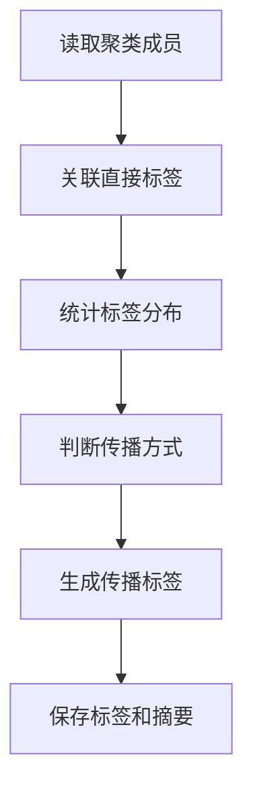
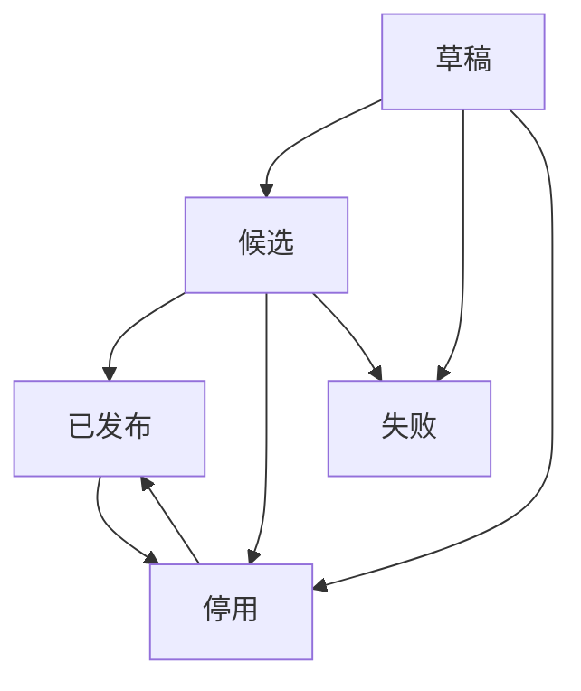

# Raha 数据检测迭代 6 落地与 P1 验收报告

## 1. 验收结论

根据《Raha 数据检测功能模块与任务计划》8.2 节，迭代 6 覆盖 `T079` 至 `T094`，目标为标签仓储与传播、列级模型训练与预测、模型版本和发布管理。

本次已完成全部 16 项任务，形成以下能力：

- 直接标签、传播标签、聚类传播摘要及仓储业务版本可追溯。
- 支持同质性传播和多数传播，直接标签不会被传播标签覆盖。
- 记录传播来源、聚类版本、传播方式、置信度、冲突数量、多数比例和样本权重。
- 按列关联稀疏特征与标签，直接标签优先于传播标签。
- 类别平衡权重与标签来源样本权重同时生效。
- Spark MLlib 可用时训练列级逻辑回归模型。
- MLlib 不可用或训练失败时，可按配置切换到规则加权降级模型。
- 列级预测输出分数、阈值、错误判断、分类器类型和模型版本。
- 单类别、空特征、无标签和标签冲突列不会生成伪模型。
- 模型文件可在进程重启后重新加载并保持预测结果一致。
- 只有 `PUBLISHED` 模型可通过生产加载入口读取。
- 模式哈希、特征字典版本和策略计划版本不兼容时拒绝加载。
- 模型可回滚到前一个历史已发布版本，从未发布的停用模型不会成为回滚目标。

最终验收结论：`T079` 至 `T094` 全部完成，定向测试和全量回归均通过，可以进入迭代 7 的训练服务、采样服务、检测服务和评测闭环集成。

## 2. 标签仓储与标签传播

### 2.1 标签元数据

`CellLabel` 在原有标签值和来源基础上补充：

- 稳定标签标识 `labelId`。
- 传播来源指纹 `sourceLabelId`。
- 聚类标识和聚类版本。
- 传播方式 `HOMOGENEITY` 或 `MAJORITY`。
- 训练样本权重。
- 冲突标签数量。
- 多数标签比例。

直接标签默认样本权重为一。传播标签必须保存直接来源、聚类版本和传播方式，且权重上限低于直接标签，避免传播结果被当作人工真值使用。

### 2.2 标签仓储

新增 `CellLabelRepository` 和 `DefaultCellLabelRepository`：

- 标签保存在 `CELL_LABEL` 命名空间。
- 聚类传播摘要保存在 `LABEL_PROPAGATION_SUMMARY` 命名空间。
- 标签和传播摘要在统一仓储事务中提交。
- 可按任务读取全部标签。
- 可按任务和单元格读取标签。
- 每个标签返回对应 `ArtifactVersion` 和更新时间。

因此，标签来源、配置版本、快照版本、阶段标识和重试次数均可追溯。

### 2.3 同质性传播

同质性传播只在同一字段、同一聚类版本和同一聚类内的直接标签完全一致时执行：

- 没有直接标签时返回 `NO_LABELS`。
- 同时存在零和一时返回 `CONFLICT`。
- 所有成员均已直接标注时返回 `NO_UNLABELED_MEMBERS`。
- 只有尚未直接标注的成员会新增传播标签。

### 2.4 多数传播

多数传播根据直接标签数量计算多数比例：

- 多数比例必须严格超过配置的最低比例。
- 平票或未超过最低比例时返回 `NO_MAJORITY`。
- 传播标签保存多数比例和少数标签数量。
- 传播置信度使用多数比例。
- 传播权重同时受配置权重、置信度和直接标签最小权重约束。

传播流程如下：



## 3. 列级训练与预测

### 3.1 训练数据构建

`ColumnTrainingDataBuilder` 按字段关联 `SparseFeatureRow` 和 `CellLabel`：

- 特征字段和字典版本必须一致。
- 同一单元格存在直接标签和传播标签时选择直接标签。
- 同一优先级标签出现零一冲突时剔除该单元格。
- 类别平衡权重使用样本总数和正负样本数量计算。
- 最终训练权重等于类别权重乘以标签样本权重。

训练数据状态包括：

- `TRAINABLE`
- `NO_LABELS`
- `SINGLE_CLASS`
- `EMPTY_FEATURES`
- `LABEL_CONFLICT`

只有 `TRAINABLE` 状态可进入训练器。

### 3.2 Spark MLlib 逻辑回归

新增 `spark-mllib_2.12:3.3.1` 的 `provided` 依赖，与现有 Spark SQL 和 Scala 版本保持一致。依赖白名单已将 MLlib 状态调整为已确认。

`SparkMllibLogisticRegressionTrainer`：

- 使用 Spark ML `LogisticRegression`。
- 设置独立的标签列、权重列和稀疏特征列。
- 支持最大迭代次数、正则化和弹性网络参数。
- 从训练模型提取截距和系数，生成不依赖 Spark 会话生命周期的可移植模型参数。
- 训练开始、完成和异常均记录字段、数据集和模型版本上下文。

### 3.3 规则加权降级

`WeightedRuleFallbackTrainer` 分别计算正负样本的加权特征均值，以均值差作为线性系数，并根据正负总权重计算截距。

`AdaptiveColumnModelTrainer` 的选择规则为：

1. 首选类型为规则加权时直接使用降级训练器。
2. 首选逻辑回归且 MLlib 可用时使用 MLlib。
3. MLlib 不可用或训练失败且允许降级时使用规则加权模型。
4. MLlib 不可用且禁止降级时返回 `MLLIB_UNAVAILABLE`，不生成模型。

### 3.4 预测输出

`ColumnModelPredictor` 对每个单元格输出：

- `cellId`
- 零到一之间的分数
- 模型阈值
- 是否疑似错误
- 分类器类型
- 模型版本

逻辑回归和规则加权模型统一使用可移植线性参数预测，检测阶段无需保留训练时的 Spark MLlib 模型对象。

## 4. 模型版本与发布管理

### 4.1 模型元数据

`RahaColumnModel` 和 `ModelMetadataRepository` 保存：

- 模型名称和不可变模型版本。
- 数据集和目标字段。
- 输入模式哈希。
- 分类器类型。
- 特征字典版本。
- 策略计划版本。
- 判断阈值。
- 模型文件路径。
- 模型状态和指标。
- 创建时间和首次发布时间。

模型元数据按数据集和字段分区、按模型版本寻址，可读取指定版本、字段全部版本和当前唯一已发布版本。

### 4.2 模型文件

`FileColumnModelStore` 使用 UTF-8 属性文件保存可移植参数：

- 文件名使用 64 位模型版本哈希。
- 临时文件写完后原子替换目标文件。
- 模型路径必须位于配置根目录内。
- 文件不保存训练原始值和标签。
- 文件缺失、损坏或越界路径会拒绝加载并记录异常堆栈。

重启加载测试使用新的存储对象读取已保存文件，加载前后对同一特征的预测分数完全一致。

### 4.3 发布状态机

状态转换如下：



- 草稿必须先成为候选模型才能首次发布。
- 候选和发布操作要求模型文件路径存在于元数据中。
- 发布新模型时，当前已发布模型在同一仓储事务中转为停用。
- `PublishedColumnModelLoader` 只读取仓储中状态为 `PUBLISHED` 的模型。
- 同一数据集和字段出现多个已发布模型时立即报错，不静默选择。

### 4.4 兼容校验和回滚

生产加载前校验：

- 元数据模型版本与文件模型版本一致。
- 字段、分类器类型和特征字典版本一致。
- 当前模式哈希与训练模式哈希一致。
- 当前特征字典版本与训练版本一致。
- 当前策略计划版本与训练版本一致。

回滚只选择首次发布时间早于当前模型的历史已发布版本。仅从草稿或候选状态停用、从未发布的模型没有首次发布时间，因此不会被误选为回滚目标。

## 5. 任务逐项核对

| 任务 | 验收要求 | 落地结果 | 状态 |
| --- | --- | --- | --- |
| `T079` | 标签来源和版本可追溯 | 标签和 `ArtifactVersion` 可按任务及单元格读取 | 已完成 |
| `T080` | 簇内标签一致时正确传播 | 同质性传播只扩展未直接标注成员 | 已完成 |
| `T081` | 冲突时记录多数比例 | 多数传播保存比例、少数数量和传播摘要 | 已完成 |
| `T082` | 传播标签权重低于直接标签 | 权重受配置、置信度和直接标签权重上限约束 | 已完成 |
| `T083` | 覆盖一致、冲突和无标签场景 | 四个标签传播测试全部通过 | 已完成 |
| `T084` | 标签和特征可按列关联 | 字段、字典版本和单元格标识关联已实现 | 已完成 |
| `T085` | 直接标签与传播标签权重可区分 | 直接优先，类别权重和来源权重共同生效 | 已完成 |
| `T086` | MLlib 可用时完成列级训练 | 真实本地 Spark 逻辑回归测试通过 | 已完成 |
| `T087` | MLlib 不可用时闭环仍可运行 | 自适应训练器可生成规则加权模型 | 已完成 |
| `T088` | 输出分数、阈值和模型类型 | 列级预测对象和批量预测器已实现 | 已完成 |
| `T089` | 单类别和空特征列不生成伪模型 | 显式状态返回且模型参数为空 | 已完成 |
| `T090` | 模型版本和依赖版本可追溯 | 模式、字典、策略和仓储业务版本均可读取 | 已完成 |
| `T091` | 模型可重启后加载预测 | 文件重载前后预测一致测试通过 | 已完成 |
| `T092` | 只有已发布模型可生产使用 | 生产加载器只读取唯一 `PUBLISHED` 模型 | 已完成 |
| `T093` | 不兼容模型被拒绝加载 | 模式、字典和策略三类不兼容测试通过 | 已完成 |
| `T094` | 可切回前一个已发布版本 | 回滚历史发布版本并排除未发布停用模型 | 已完成 |

## 6. 测试与质量检查

### 6.1 迭代 6 定向测试

新增测试类：

- `LabelPropagationServiceTest`
- `ColumnTrainingDataBuilderTest`
- `ColumnModelTrainerIntegrationTest`
- `ModelLifecycleIntegrationTest`

定向测试共 13 个：

- 同质传播、冲突和无标签。
- 多数比例、冲突数量和传播权重。
- 标签仓储来源和业务版本追溯。
- 直接标签优先和类别权重。
- 标签冲突、单类别和空特征处理。
- 真实 Spark MLlib 逻辑回归训练。
- MLlib 不可用时降级和禁止降级。
- 预测分数、阈值和分类器类型。
- 模型文件重启加载和预测一致性。
- 候选、发布、兼容拒绝和历史版本回滚。

定向测试结果：13 个通过，0 失败，0 错误，0 跳过。

### 6.2 全量回归

执行命令：

```powershell
$env:JAVA_HOME='D:\Program Files\java\jdk8u492-b09'
mvn -B -ntp clean verify
```

| 检查项 | 结果 |
| --- | --- |
| 主源码 | 200 个 Java 文件编译通过 |
| 测试类 | 31 个 |
| 测试方法 | 94 个 |
| 测试失败 | 0 |
| 测试错误 | 0 |
| 测试跳过 | 0 |
| Maven Enforcer | 通过 |
| Java 8 API 检查 | 通过 |
| 最终构建 | `BUILD SUCCESS` |

### 6.3 依赖和静态核验

Spark 依赖树：

- `spark-sql_2.12:3.3.1:provided`
- `spark-mllib_2.12:3.3.1:provided`
- `scala-library:2.12.15:provided`

静态检查结果：

| 核验项 | 结果 |
| --- | --- |
| 根包路径 | 全部为 `com.fiberhome.ml.raha` |
| UTF-8 BOM | 0 个文件 |
| CRLF | 0 个文件 |
| 非法 UTF-8 | 0 个文件 |
| Unicode 替换字符 | 0 个文件 |
| 本地 `lib2.12` 依赖 | 未引入 |

Windows 本地 Spark 仍提示未配置 `winutils.exe` 和原生 Hadoop 库，并提示未加载原生 BLAS。Spark 自动使用 Java 实现，未影响逻辑回归训练和 94 个测试结果。

## 7. 迭代边界

本迭代提供可复用的标签传播、训练器、预测器、模型存储和发布管理组件，但不提前实现迭代 7 的统一训练服务、采样服务和生产检测服务编排。后续应由 `T095` 至 `T098` 将这些组件接入统一任务结果和 Raha 服务入口。

本工程只做数据检测。标签只表示疑似错误或正常，模型只输出错误分数和阈值判断；不生成纠正候选，不保存修复值，不推荐正确内容，也不回写原始数据。

## 8. 最终判定

`T079` 至 `T094` 全部完成。标签传播语义、样本权重、真实 MLlib 训练、规则降级、不可训练列处理、模型重启加载、发布隔离、依赖兼容和历史发布回滚均有实现与测试证据，未发现阻止进入迭代 7 的遗留问题。
