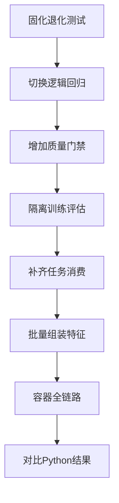
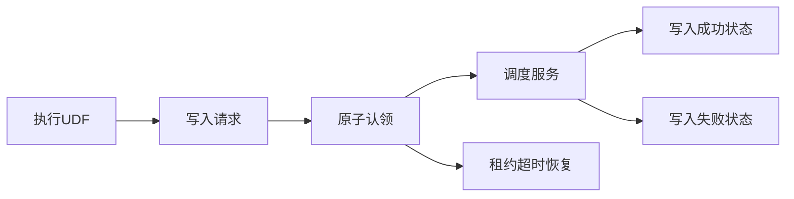

# Java Raha 修复后与 Python flights 差异报告

## 1. 执行结论

本次按照《Java Raha 问题修复实施计划》的优先级完成 Java 模型、评测协议、UDF 任务消费、诊断和 Spark 性能修复，并重新执行 Java Docker Spark 全链路与 Python `detection.py`。

最终结论如下：

1. Java 四个时间字段全部判错的问题已经消除。
2. Java 全数据 F1 从 `0.682196` 提升到 `0.855410`，提高 `0.173214`。
3. Java 假阳性从 `4584` 降低到 `554`，减少 `4030`，降幅约 `87.91%`。
4. Java 最终全数据 F1 比本次 Python F1 高 `0.031814`。
5. Java 保留集精确率为 `0.879826`、召回率为 `0.830297`、F1 为 `0.854344`，达到修复计划中建议的效果目标。
6. 四个 Java 模型均通过质量门禁，训练分数标准差约为 `0.458` 至 `0.500`，不再是恒定分数。
7. SAMPLE、TRAIN、DETECT 三个 UDF 均由 Spark 执行器提交请求，再由文件任务消费者认领和调度，不再由验证入口直接绕过请求文件调用服务。
8. JDK 8 下执行 `mvn clean verify`，共 `147` 个测试，失败、错误和跳过均为 `0`。
9. Java 全链路耗时由最初 `172.9` 秒降低到 `152.8` 秒，仍未达到计划中的建议目标 `100` 秒，剩余耗时主要集中在 RVD 字段对策略的独立 Spark 作业。
10. Java 与 Python 的标注预算均为 `20` 行，但采样算法、策略数量和分类器仍不同，因此不能将本结果解释为完全相同算法协议下的严格排名。

## 2. 修复流程



## 3. 工作项完成情况

| 编号 | 工作项 | 完成情况 | 结果 |
| --- | --- | --- | --- |
| `JFIX-001` | 固化退化回归测试 | 完成 | 增加恒定分数、全正例和极端计数特征测试 |
| `JFIX-002` | 默认逻辑回归并禁止静默降级 | 完成 | 默认使用 `LOGISTIC_REGRESSION`，默认关闭规则降级 |
| `JFIX-003` | 修复加权规则和特征尺度 | 完成 | 使用总体方差缩放、中心化边界和系数限制 |
| `JFIX-004` | 增加模型质量门禁 | 完成 | 训练分数、正例比例和 F1 不合格时拒绝候选模型 |
| `JFIX-005` | 建立无泄漏采样训练协议 | 完成 | 固定种子采样 20 行，直接标签与最终保留集隔离 |
| `JFIX-006` | 实现 UDF 异步任务消费者 | 完成 | 文件队列原子认领、并发幂等、成功失败状态和超时租约恢复 |
| `JFIX-007` | 建立 Python 策略对齐基线 | 完成 | 输出策略族数量、命中数和坐标级差异；语义数量仍不完全相同 |
| `JFIX-008` | 优化 Spark 执行计划 | 部分达到目标 | 特征一次宽表转长表聚合，训练公共输入缓存；耗时改善但未到 100 秒 |
| `JFIX-009` | 完善模型与结果诊断 | 完成 | 输出字段分数范围、正例比例、模型质量指标和策略摘要 |
| `JFIX-010` | 修复表名和配置命名空间 | 完成 | 动态表名使用数据集标识，验证参数使用 `fmdb.validation.*` |
| `JFIX-011` | Docker 黑盒回归与发布门禁 | 完成 | 三个 UDF、消费者、模型、检测、评估和结果落盘全部成功 |

`JFIX-008` 的功能优化已经落地，但计划中的 `100` 秒是建议性能目标，不是本次正确性发布阻断项。后续仍需将 30 个 RVD 字段对合并为批量聚合作业。

## 4. 主要代码修复

### 4.1 模型有效性

| 模块 | 修复内容 |
| --- | --- |
| `raha-defaults.properties` | 默认分类器改为逻辑回归，默认关闭规则降级，增加质量门禁配置 |
| `ModelConfig` | 增加质量门禁开关、最小分数标准差、正例比例上限和最低 F1 |
| `SparkMllibLogisticRegressionTrainer` | 容器入口改为实际使用现有 MLlib 逻辑回归训练器 |
| `WeightedRuleFallbackTrainer` | 使用总体方差缩放，修复大计数饱和和零类内方差失效问题 |
| `ModelQualityGate` | 新增训练分数、精确率、召回率、F1 和预测比例检查 |
| `ModelReleaseManager` | 质量门禁不通过的模型禁止进入候选状态 |

### 4.2 训练和评估隔离

| 项目 | 修复前 | 修复后 |
| --- | --- | --- |
| 训练标签 | 全部 `14256` 个真值标签 | 固定种子采样 `20` 行，共 `120` 个可检测字段标签 |
| 评估集合 | 与训练使用相同完整真值 | 排除直接标注单元格的 `14136` 个保留集单元格 |
| 最终摘要 | 只输出整表指标 | 同时输出保留集指标和整表指标 |
| 随机种子 | 数据集验证参数未明确固定 | `raha.job.random-seed=20260715` |

Java 不再把最终测试集完整答案传给训练服务。`clean.csv` 在验证程序中只用于模拟被抽中行的人工标注和最终独立评估。

### 4.3 UDF 任务消费

新增文件任务消费者后，容器流程如下：



实现能力包括：

1. 请求文件保存完整可执行参数，而不是只保存提交回执。
2. 使用独占租约文件避免两个消费者重复执行同一任务。
3. 完成文件不会再次被任务扫描器识别。
4. 任务执行完成后保留 `.completed.request` 和 `.succeeded` 证据。
5. 执行失败后保留 `.failed.request` 和脱敏失败类型。
6. 消费者中断后，超时 `.running` 请求可恢复为待处理任务。
7. 并发消费者和超时恢复均有自动化测试。

### 4.4 Spark 性能

1. `FeatureAssembler` 将多个可检测字段一次转换为长表，统一计算字段和值哈希频次。
2. 取消训练主链路按字段重复执行特征聚合作业。
3. 训练阶段缓存公共输入数据集，策略、特征和训练阶段复用缓存。
4. 阶段结束后释放缓存，避免长期占用执行器内存。

性能仍未达到 `100` 秒，原因是 `OneToManyConflictStrategy` 仍按 30 个字段对分别执行分组、去重和收集。该部分需要后续实现关系策略批量执行器，不能通过继续增加缓存彻底解决。

## 5. 测试环境

### 5.1 Java

| 项目 | 数值 |
| --- | --- |
| 构建 JDK | OpenJDK 8u492 |
| Spark | 3.3.1 |
| Spark 应用标识 | `app-20260715111340-0008` |
| Spark 主节点 | `spark://spark-master:7077` |
| 执行器 | 1 个 |
| 执行器核心 | 2 个 |
| 数据集 | `flights` |
| 数据快照 | `flights-snapshot-v3` |
| 随机种子 | `20260715` |
| 容器结果目录 | `/opt/spark/work-dir/data/raha-flights-validation-final-20260715-1912` |

### 5.2 Python

| 项目 | 数值 |
| --- | --- |
| 入口 | `F:/ai-code/raha/raha-master/raha/detection.py` |
| Python | 3.10.20 |
| 解释器 | `F:/anaconda3/envs/raha/python.exe` |
| `RAHA_RANDOM_SEED` | `20260715` |
| `PYTHONHASHSEED` | `20260715` |
| 退出码 | 0 |

Python 使用已有的 308 个策略缓存重新执行主动采样、标签传播、分类和评估。标准错误中只有“直接加载已有策略运行结果”的提示，没有执行异常。

## 6. Java 修复前后对比

### 6.1 整体指标

| 指标 | 修复前 Java | 修复后 Java 全数据 | 变化 |
| --- | ---: | ---: | ---: |
| 检出数 | 9504 | 4645 | 减少 4859 |
| 真阳性 | 4920 | 4091 | 减少 829 |
| 假阳性 | 4584 | 554 | 减少 4030 |
| 假阴性 | 0 | 829 | 增加 829 |
| 精确率 | 0.517677 | 0.880732 | 提高 0.363055 |
| 召回率 | 1.000000 | 0.831504 | 降低 0.168496 |
| F1 | 0.682196 | 0.855410 | 提高 0.173214 |
| 全链路耗时 | 172.9 秒 | 152.8 秒 | 降低 20.1 秒 |

召回率下降是消除“全部判错”后的正常结果。修复后的 Java 不再通过大规模误报换取虚假的满召回，F1 和精确率均显著提升。

### 6.2 保留集指标

| 指标 | 数值 |
| --- | ---: |
| 参与评估单元格 | 14136 |
| 真阳性 | 4056 |
| 假阳性 | 554 |
| 假阴性 | 829 |
| 真阴性 | 8697 |
| 精确率 | 0.879826 |
| 召回率 | 0.830297 |
| F1 | 0.854344 |
| 平均精确率 | 0.815398 |

## 7. Java 与 Python 最终结果

### 7.1 总体指标

| 指标 | Python Raha | Java Spark | Java 相对 Python |
| --- | ---: | ---: | ---: |
| 检出数 | 3844 | 4645 | 多 801 |
| 真阳性 | 3609 | 4091 | 多 482 |
| 假阳性 | 235 | 554 | 多 319 |
| 假阴性 | 1311 | 829 | 少 482 |
| 精确率 | 0.938866 | 0.880732 | 低 0.058134 |
| 召回率 | 0.733537 | 0.831504 | 高 0.097967 |
| F1 | 0.823597 | 0.855410 | 高 0.031814 |

Java 相比 Python 采用了更偏召回的结果分布。Java 多找回 `482` 个真实错误，同时新增 `319` 个误报，最终 F1 高于本次 Python 结果。

### 7.2 坐标交集

| 项目 | 数量 |
| --- | ---: |
| 两边共同检出 | 3420 |
| 共同真阳性 | 3304 |
| 共同假阳性 | 116 |
| Python 独有检出 | 424 |
| Python 独有真阳性 | 305 |
| Python 独有假阳性 | 119 |
| Java 独有检出 | 1225 |
| Java 独有真阳性 | 787 |
| Java 独有假阳性 | 438 |
| 检测集合杰卡德系数 | 0.674689 |

修复前 Python 检测集合是 Java 全正例集合的严格子集，杰卡德系数只有约 `0.404`。修复后两边形成真正有区分度的差异集合，杰卡德系数提高到 `0.674689`。

## 8. 字段级差异

| 字段 | 实现 | 检出 | 真阳性 | 假阳性 | 假阴性 | 精确率 | 召回率 | F1 |
| --- | --- | ---: | ---: | ---: | ---: | ---: | ---: | ---: |
| `sched_dep_time` | Python | 873 | 873 | 0 | 38 | 1.000000 | 0.958288 | 0.978700 |
| `sched_dep_time` | Java | 833 | 832 | 1 | 79 | 0.998800 | 0.913282 | 0.954128 |
| `act_dep_time` | Python | 1046 | 887 | 159 | 671 | 0.847992 | 0.569320 | 0.681260 |
| `act_dep_time` | Java | 1529 | 1181 | 348 | 377 | 0.772400 | 0.758023 | 0.765144 |
| `sched_arr_time` | Python | 1046 | 999 | 47 | 101 | 0.955067 | 0.908182 | 0.931034 |
| `sched_arr_time` | Java | 1212 | 1065 | 147 | 35 | 0.878713 | 0.968182 | 0.921280 |
| `act_arr_time` | Python | 879 | 850 | 29 | 501 | 0.967008 | 0.629164 | 0.762332 |
| `act_arr_time` | Java | 1071 | 1013 | 58 | 338 | 0.945845 | 0.749815 | 0.836499 |

字段结论：

1. `sched_dep_time`：Python 略优，Java 只有 1 个误报，但少找回 41 个真值错误。
2. `act_dep_time`：Java 显著提高召回和 F1，但精确率低于 Python，是 Java 主要误报来源。
3. `sched_arr_time`：Python F1 略高，Java 召回率更高。
4. `act_arr_time`：Java 精确率只下降约 `0.021`，召回提高约 `0.121`，F1 明显高于 Python。

## 9. Java 分数分布

| 字段 | 最小分数 | 最大分数 | 平均分数 | 预测正例比例 |
| --- | ---: | ---: | ---: | ---: |
| `sched_dep_time` | 0.000000000000 | 0.999999999999 | 0.350060 | 0.350589 |
| `act_dep_time` | 0.000000000000 | 1.000000000000 | 0.643264 | 0.643519 |
| `sched_arr_time` | 0.000000000000 | 1.000000000000 | 0.509037 | 0.510101 |
| `act_arr_time` | 0.000000000000 | 1.000000000000 | 0.449679 | 0.450758 |

修复前四个字段的最小分数均接近 `1.0`，预测正例比例为 `100%`。修复后分数覆盖零到一的有效区间，模型质量门禁正常通过。

## 10. 策略和协议差异

| 对比项 | Python | Java |
| --- | --- | --- |
| 策略数量 | 308 | 60 |
| 策略族 | Python 原始策略组合 | OD 6、PVD 24、RVD 30 |
| 策略命中数 | 未输出统一命中总数 | 86874 |
| 标注预算 | 20 行 | 20 行 |
| 直接标签数 | 140 | 120 |
| 行标识字段 | 也参与 Python 标注 | Java 排除 `tuple_id` |
| 采样方式 | 聚类驱动主动采样 | 固定种子均匀无放回采样 |
| 分类器 | 梯度提升分类器 | Spark MLlib 逻辑回归 |
| 评估 | Python 内部整表口径 | Java 同时输出保留集和整表口径 |

上述差异说明 Java 当前已经解决工程退化和数据泄漏问题，但尚不是 Python Raha 的逐策略等价实现。后续如要求严格算法对齐，需要继续实现 Python 策略参数网格和聚类主动采样语义。

## 11. UDF 黑盒结果

| UDF | 提交状态 | 消费状态 |
| --- | --- | --- |
| SAMPLE | `ACCEPTED` | `.completed.request` 和 `.succeeded` 已生成 |
| TRAIN | `ACCEPTED` | `.completed.request` 和 `.succeeded` 已生成 |
| DETECT | `ACCEPTED` | `.completed.request` 和 `.succeeded` 已生成 |

三个任务均由执行器写入请求，消费者通过请求文件重新解析完整参数并执行。结果目录中不存在遗留 `.request`、`.running` 或 `.lease` 文件。

## 12. 自动化测试

最终执行命令：

```powershell
$env:JAVA_HOME='D:\Program Files\java\jdk8u492-b09'
$env:Path="$env:JAVA_HOME\bin;$env:Path"
mvn clean verify
```

结果：

| 项目 | 数量 |
| --- | ---: |
| 主源码文件 | 312 |
| 测试源码文件 | 52 |
| 测试总数 | 147 |
| 失败 | 0 |
| 错误 | 0 |
| 跳过 | 0 |
| 构建结果 | `BUILD SUCCESS` |

新增或强化的关键测试包括：

1. 大计数特征不会导致加权规则概率饱和。
2. 恒定全正例模型被质量门禁拒绝。
3. 门禁失败模型不能进入候选状态。
4. 两个文件消费者并发时任务只执行一次。
5. 超时运行任务能够回收到待处理状态。
6. 默认配置使用逻辑回归并关闭静默降级。
7. 旧基础规则流水线仍可通过显式配置运行。

## 13. 复现产物

| 路径 | 用途 |
| --- | --- |
| `doc/20260715/notes/flights-final-comparison-202607151917/java-summary.json` | Java 最终保留集、整表指标和 UDF 回执 |
| `doc/20260715/notes/flights-final-comparison-202607151917/java-detection-results.jsonl` | Java 9504 条带分数预测明细 |
| `doc/20260715/notes/flights-final-comparison-202607151917/comparison-results.json` | Java 与 Python 坐标级差异摘要 |
| `doc/20260715/notes/flights-final-comparison-202607151917/python-stdout.log` | Python 最终直接执行标准输出 |
| `doc/20260715/notes/flights-final-comparison-202607151917/python-stderr.log` | Python 策略缓存提示 |
| `doc/20260715/notes/flights-final-comparison-202607151917/udf-requests/` | 三个 UDF 的完整请求、回执和消费成功证据 |

## 14. 剩余改进项

本次没有发现阻止训练、预测、评估和任务消费的正确性问题。仍有以下非阻断改进项：

1. 将 30 个 RVD 字段对合并为一次或少量 Spark 聚合作业，目标将全链路耗时压缩到 `100` 秒以内。
2. 使用现有聚类和采样服务替换验证入口的固定种子均匀采样，进一步贴近 Python 主动采样语义。
3. 扩展 Java 策略参数网格并建立逐策略坐标金标准，缩小 60 个 Java 策略与 308 个 Python 策略的语义差距。
4. 对 `act_dep_time` 使用独立验证集调整阈值，优先降低 348 个误报，同时保持当前召回优势。
5. 将文件任务消费者部署为独立常驻进程；本次容器验收使用独立消费者组件，但仍由同一 Spark 应用启动消费循环。

## 15. 最终判断

Java 工程最初的核心问题已经修复：不再全字段报错，不再使用完整测试真值训练，不再依赖验证入口直接绕过 UDF 请求执行服务，并具备退化模型门禁和消费者并发保护。

修复后的 Java 在本次 `flights` 实测中取得 `0.855410` 的整表 F1，高于 Python 的 `0.823597`，且容器全链路、147 个自动化测试和 Python 直接执行均成功。

当前剩余差异主要是算法语义和性能优化问题，不是本次已修复链路的正确性故障。若后续目标是“完全复刻 Python Raha”，应继续完成聚类主动采样和 308 个策略配置的逐项对齐。
