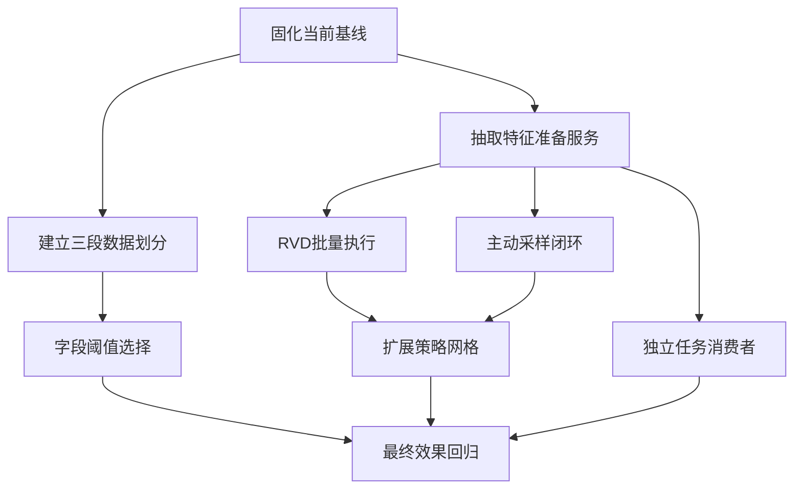
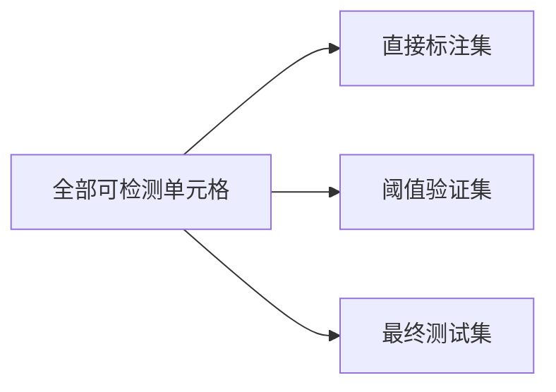
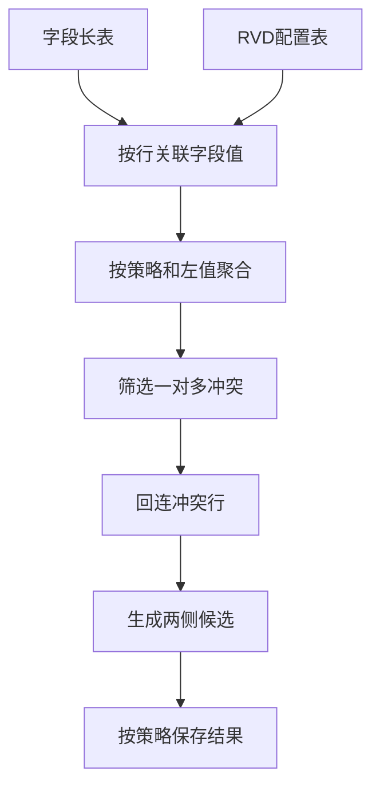
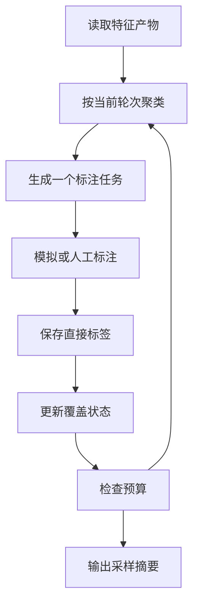
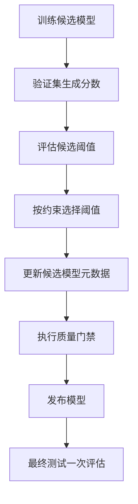

# Java Raha 剩余改进项实施分析

## 1. 文档目的

本文基于《Java Raha 修复后与 Python flights 差异报告》中第 14 节的五个剩余改进项，进一步给出可执行的技术设计、改动范围、测试方案、验收指标、实施顺序和风险控制。

本文只分析后续改进方案，不改变已经通过验证的 Java 代码、模型和测试基线。

## 2. 当前基线

### 2.1 效果基线

| 指标 | Java Spark | Python Raha |
| --- | ---: | ---: |
| 检出数 | 4645 | 3844 |
| 真阳性 | 4091 | 3609 |
| 假阳性 | 554 | 235 |
| 假阴性 | 829 | 1311 |
| 精确率 | 0.880732 | 0.938866 |
| 召回率 | 0.831504 | 0.733537 |
| F1 | 0.855410 | 0.823597 |

Java 当前整体 F1 高于 Python，但结果分布明显偏向召回。554 个 Java 假阳性中，`act_dep_time` 占 348 个，是后续精度改进的首要字段。

### 2.2 协议基线

| 项目 | Java 当前实现 | Python 当前实现 |
| --- | --- | --- |
| 标注预算 | 20 行 | 20 行 |
| 直接标签 | 120 个可检测字段单元格 | 140 个全部字段单元格 |
| 采样方式 | 固定种子均匀无放回 | 基于聚类覆盖逐轮主动采样 |
| 策略数量 | 60 | 308 |
| 策略组成 | OD 6、PVD 24、RVD 30 | OD 34、动态 PVD、RVD 42 |
| 分类器 | Spark 逻辑回归 | 梯度提升分类器 |
| 阈值 | 默认 0.5 | 分类器内部判定 |

### 2.3 工程基线

1. `mvn clean verify` 已通过 147 个测试，失败、错误和跳过均为 0。
2. SAMPLE、TRAIN、DETECT 已通过文件请求和消费者完成黑盒验证。
3. `FeatureAssembler` 已将多字段特征组装合并为批量计算。
4. `OneToManyConflictStrategy` 仍按 30 个字段对分别执行分组、连接和驱动端收集。
5. `RahaContainerValidationApplication` 仍负责启动消费者，并通过内存引用在三个任务之间传递采样和训练结果。
6. 全链路耗时为 152.8 秒，尚未达到 100 秒建议目标。

## 3. 总体判断

五个改进项不是五个彼此独立的小修改，存在明显依赖关系：



建议先建立可复用的特征准备产物和独立验证集，再做性能、采样、阈值和策略扩展。否则采样阶段会重复执行一次完整策略和特征计算，策略扩展也会继续放大当前 RVD 作业数量。

## 4. 工作项优先级

| 编号 | 工作项 | 建议优先级 | 核心原因 | 前置依赖 |
| --- | --- | --- | --- | --- |
| `RIMP-001` | RVD 批量聚合 | P0 | 为主动采样和策略扩展释放性能空间 | 固化坐标基线 |
| `RIMP-002` | 聚类主动采样 | P0 | 当前 Java 与 Python 最大的训练协议差异 | 可复用特征准备产物 |
| `RIMP-003` | 策略参数网格和坐标金标准 | P1 | 决定算法语义是否真正接近 Python | RVD 批量执行、规范化坐标 |
| `RIMP-004` | `act_dep_time` 独立验证阈值 | P0 | 直接处理当前最大误报来源 | 三段数据划分 |
| `RIMP-005` | 独立常驻消费者 | P0 | 当前仍是验证应用内启动，未形成生产部署形态 | 持久化任务上下文 |

其中 P0 不表示必须串行完成。RVD 优化、评测划分和消费者接口改造可以并行推进，但最终容器回归必须使用同一份已冻结代码和配置。

## 5. 公共前置改造

### 5.1 抽取特征准备服务

当前 `RahaTrainService` 内部完成策略计划、策略执行和特征组装，而正式 `RahaSampleService` 又要求调用方提供特征。要让 SAMPLE 真正使用聚类采样，必须先解决“采样需要特征、特征当前由训练生成”的顺序矛盾。

建议新增 `RahaFeaturePreparationService`，统一完成以下工作：

1. 读取并校验数据快照。
2. 生成稳定的策略计划和计划版本。
3. 执行或复用策略结果。
4. 组装并持久化特征。
5. 返回不可变的特征产物引用和摘要。

建议新增的结果对象为 `PreparedFeatureArtifact`，至少包含：

| 字段 | 用途 |
| --- | --- |
| `datasetId` | 数据集标识 |
| `snapshotId` | 输入快照标识 |
| `planVersion` | 策略计划版本 |
| `featureVersion` | 特征版本 |
| `configurationHash` | 配置摘要 |
| `featureReference` | 特征仓储引用 |
| `strategySummary` | 策略数量、命中数量和失败数量 |
| `createdAt` | 产物创建时间 |

SAMPLE 和 TRAIN 必须按 `datasetId + snapshotId + planVersion + featureVersion + configurationHash` 复用同一份产物，避免 SAMPLE 计算一次、TRAIN 再计算一次。

### 5.2 建立三段数据划分

当前已经隔离直接标注坐标和最终保留集，但阈值调整还需要独立验证集。建议固定为三段：



划分要求如下：

1. 直接标注集仅由主动采样选中的行产生。
2. 阈值验证集只用于模型选择、阈值选择和质量门禁。
3. 最终测试集只用于最终报告，不允许参与阈值选择。
4. 三者坐标必须无交集，并将坐标数量和摘要哈希写入运行产物。
5. 使用稳定行标识哈希划分，不依赖 Spark 分区顺序或 `collectAsList` 返回顺序。
6. 对有正负样本的字段，应保证验证集和测试集都包含正负样本；无法满足时明确跳过字段阈值优化。

建议新增 `EvaluationSplitService` 和 `EvaluationSplitArtifact`。默认可在排除直接标注行后，将剩余行按稳定哈希划分为 20% 阈值验证集和 80% 最终测试集。

需要说明的是，`flights` 真值已经被本轮分析使用，因此后续结果属于工程回归，不再是完全未知测试集上的无偏估计。正式效果评估还应增加至少一个未参与调参的新数据集。

## 6. RIMP-001：RVD 批量聚合

### 6.1 当前问题

`OneToManyConflictStrategy` 对每个 RVD 计划分别执行以下流程：

1. 选择左字段和右字段。
2. 清洗并计算左右值哈希。
3. 按左值哈希分组。
4. 统计不同右值数量。
5. 连接回原始行。
6. 使用 `collectAsList` 收集候选结果。

`flights` 有 6 个可检测字段，形成 30 个有方向字段对，因此相同数据被重复扫描、分组和洗牌 30 次。继续增加缓存只能减少读取成本，不能消除 30 次独立聚合和作业调度。

### 6.2 改进目标

1. 将 30 个字段对压缩为一次或少量 Spark 批量作业。
2. 优化前后每个策略的候选坐标、原因、分数和配置摘要保持一致。
3. 取消无上限驱动端收集，防止宽表或大数据集导致驱动内存风险。
4. 在现有一个执行器、两个核心环境下，将全链路稳定压缩到 100 秒以内。

### 6.3 推荐设计

先把全部可检测字段转换为统一长表：

| 字段 | 含义 |
| --- | --- |
| `row_id` | 稳定行标识 |
| `column_name` | 字段名 |
| `value_hash` | 规范化值哈希 |
| `is_valid` | 非空且非空白标记 |

再把 RVD 计划转换为小型配置表：

| 字段 | 含义 |
| --- | --- |
| `strategy_id` | Java 稳定策略标识 |
| `left_column` | 左字段 |
| `right_column` | 右字段 |
| `configuration_hash` | 配置摘要 |

批量执行流程如下：



建议新增 `RvdBatchStrategyExecutor`，由 `StrategyExecutionService` 识别 RVD 计划后批量执行；OD、PVD 和不支持批量的策略仍沿用现有 `StrategyExecutor`。

### 6.4 关键实现细节

1. RVD 配置表数据量很小，可使用广播连接。
2. 长表只保留 RVD 所需字段，避免携带原始宽表全部列。
3. 聚合键必须包含 `strategy_id` 和 `left_hash`，不能只按左值哈希聚合，否则不同字段对会互相污染。
4. 结果需要保留 `distinctRightCount`、`groupSize`、依赖方向和目标侧，确保与当前详情字段一致。
5. 候选结果按仓储分区写入，不在驱动端一次性收集全部坐标。
6. 对字段很多的数据集增加 `maxRvdPairsPerBatch`，按左字段或固定字段对数量分批，避免行级自连接中间结果按字段数平方增长。
7. 批量内部单个策略失败时，要能定位到具体配置；配置错误在执行前校验，Spark 运行失败则整批失败并允许按较小批次重试。
8. 保持策略标识、配置哈希和计划顺序稳定，不能因为批量执行改变下游特征列顺序。

### 6.5 涉及模块

| 模块 | 调整建议 |
| --- | --- |
| `StrategyExecutionService` | 将计划拆分为批量 RVD 和普通策略两组 |
| `OneToManyConflictStrategy` | 保留单策略实现作为兼容和对照路径 |
| `RvdBatchStrategyExecutor` | 新增批量关系策略执行器 |
| `SparkStrategySupport` | 增加长表构建、广播配置和分区写出公共方法 |
| `ResourceConfig` | 增加每批字段对数、最大驱动收集数和结果分区数 |
| `RahaTrainService` | 记录批量作业数量、耗时和缓存释放结果 |

### 6.6 测试方案

1. 使用 `toy` 和 `flights` 对比单策略路径与批量路径的逐策略坐标集合。
2. 对候选的 `reason`、`details`、`score` 和值哈希进行完全一致性校验。
3. 覆盖空值、空白、重复值、特殊字符、左右字段相同和字段不存在场景。
4. 构造超过单批字段对上限的数据，验证分批结果与一次执行一致。
5. 验证 Spark 失败时不会保存部分成功但被标记为完整的策略结果。
6. 记录优化前后的 Spark 作业数、阶段数、洗牌量、驱动收集行数和全链路耗时。

### 6.7 验收标准

1. `flights` 的 30 个 RVD 策略逐策略候选坐标完全一致。
2. RVD 相关 Spark 作业降低到不超过 6 个，目标为 3 个以内。
3. 驱动端不存在无配置上限的 `collectAsList`。
4. 相同模型和阈值下最终检测坐标不变。
5. 连续执行至少 3 次，去除首次类加载影响后的全链路中位耗时不超过 100 秒。

### 6.8 风险与回退

主要风险是字段长表自连接产生较大中间结果。必须通过字段对配置过滤、广播连接、分批上限和分区控制限制规模。上线时保留 `raha.strategy.rvd.batch-enabled` 开关，出现性能或一致性问题时可回退到现有单策略路径。

## 7. RIMP-002：聚类主动采样

### 7.1 当前问题

`RahaContainerValidationApplication.sampleLabels` 当前为所有行构造相同分数，再使用 `TupleSampler` 固定种子抽取 20 行。这保证了无泄漏和可复现，但没有使用策略特征、聚类覆盖或已标注簇信息。

工程已经存在 `RahaSampleService`、`ColumnClusteringService`、`SamplingService`、`ClusterCoverageScorer` 和 `TupleSampler`，但验证入口没有走这条正式链路。

### 7.2 与 Python 的关键语义差异

Python 不是一次选择 20 行，而是执行 20 轮：

1. 根据当前已标注行数选择聚类粒度。
2. 统计每个簇已经覆盖的标签。
3. 为未标注行计算跨字段簇覆盖分数。
4. 按权重选择 1 行。
5. 获取该行全部字段标签。
6. 更新覆盖状态后进入下一轮。

因此，仅把现有 `SamplingService.createTasks` 一次预算设置为 20，虽然优于均匀采样，但仍不等价于 Python 的逐轮主动采样。

### 7.3 推荐设计

新增 `ActiveSamplingOrchestrator`，按轮次组织现有服务：



验证环境可以使用 `clean.csv` 模拟人工标注，但必须在采样任务已经产生后，按任务中的 `rowId` 查询该行真值。采样器、聚类器和训练服务不得接触未被选中行的真值。

### 7.4 实施步骤

1. SAMPLE 先调用 `RahaFeaturePreparationService` 获取特征产物。
2. 每轮把有效预算固定为 1，累计到全局预算 20。
3. 每轮排除已经直接标注或已有有效任务的行。
4. 按当前轮次和已有标签更新聚类覆盖分数。
5. 标注完成后持久化直接标签，再开始下一轮。
6. 任务中断后从已完成轮次恢复，不能重新抽取前面已经标注的行。
7. TRAIN 复用 SAMPLE 的策略和特征产物，只执行标签传播、模型训练和质量门禁。
8. 采样摘要保存轮次、行标识、选择概率、主要覆盖贡献、随机种子和产物版本。

### 7.5 随机性处理

Java 和 Python 使用的随机数实现不同，不能仅靠相同整数种子保证每轮抽中完全相同的行。建议把验收分为两层：

1. Java 内部可复现：相同快照、配置、产物版本和种子必须得到相同采样行。
2. Python 语义接近：比较簇覆盖率、样本类别分布、最终传播标签和检测结果，不把 20 行完全一致作为强制条件。

如业务明确要求逐行坐标完全一致，则需要额外实现 Python 随机数序列、聚类算法和距离计算兼容层，工作量和维护成本都会明显增加。

### 7.6 涉及模块

| 模块 | 调整建议 |
| --- | --- |
| `RahaContainerValidationApplication` | 删除固定均匀采样实现，只保留真值模拟器和结果汇总 |
| `RahaSampleService` | 支持复用特征产物和单轮采样 |
| `SamplingService` | 明确单轮预算、排除行和恢复语义 |
| `ColumnClusteringService` | 支持按轮次或目标簇数生成聚类 |
| `RahaSampleRequest` | 增加特征引用、轮次、已有标签摘要和恢复标识 |
| `RahaSampleOutput` | 输出任务、轮次指标和特征产物版本 |
| `ActiveSamplingOrchestrator` | 新增 20 轮主动采样编排器 |

### 7.7 测试方案

1. 相同种子重复执行，20 个采样行和顺序完全一致。
2. 任意两轮不能重复选择同一行。
3. 修改未选中行的 `clean.csv` 真值，不应改变前续采样任务。
4. 训练请求中只能出现已采样行产生的直接标签。
5. 中断到第 10 轮后重启，应从第 11 轮继续且前 10 轮不变化。
6. 比较均匀采样和主动采样的簇覆盖率、传播标签数、字段级指标和总体指标。
7. 增加“特征为空”“某字段无法聚类”“候选行不足预算”等边界测试。

### 7.8 验收标准

1. SAMPLE UDF 的任务来自正式聚类和采样服务，不再构造固定 `uniform` 分数。
2. 标注行数严格为 20，Java 生产口径直接标签仍为 120 个可检测字段单元格。
3. 未采样真值不会进入策略、聚类、传播或训练阶段。
4. 相同种子和版本可复现，消费者重启可续跑。
5. 主动采样相对均匀采样的最终 F1 不回退超过 0.005；如回退，必须以多种子结果判断而不是只看单次运行。

### 7.9 风险与回退

主动采样可能提高效果，也可能因少量标签和聚类不稳定产生波动。建议保留 `UNIFORM` 和 `ACTIVE_ROUND` 两种模式，先在 `toy`、`flights` 和新增数据集上进行多种子对比，再把主动采样设为默认值。

## 8. RIMP-003：策略参数网格和逐策略坐标金标准

### 8.1 当前问题

Java 的 60 个策略与 Python 的 308 个策略不仅数量不同，参数和候选语义也不同。只把 Java 策略数量扩展到 308，不能证明实现等价。

Python `flights` 的策略构成可以拆为：

1. OD 共 34 个配置，其中直方图配置 25 个、高斯配置 9 个。
2. PVD 按每个字段实际出现过的字符动态生成配置。
3. RVD 对 7 个字段生成 42 个有方向字段对，其中包含 `tuple_id`。

Java 生产协议排除 `tuple_id` 是合理设计，不应仅为了凑齐 308 个策略而把行标识作为可检测业务字段。

### 8.2 改进目标

1. 为 Python 每个策略建立可审计映射，而不是只比较总数量。
2. 对可以等价实现的策略建立坐标级金标准。
3. 对只能近似实现或生产上不适用的策略明确记录原因。
4. 新增策略后不得破坏当前模型质量和性能门禁。

### 8.3 双口径策略清单

建议同时维护两种口径：

| 口径 | 用途 | `tuple_id` 处理 |
| --- | --- | --- |
| Python 对齐口径 | 解释算法差异和复现实验 | 保留并标记仅用于对齐 |
| Java 生产口径 | 实际训练和检测 | 排除行标识字段 |

这样既能解释 308 与 60 的差异，又不会把无业务意义的行标识错误检测引入生产模型。

### 8.4 金标准产物设计

建议定义统一的策略清单文件，每个策略至少包含：

| 字段 | 含义 |
| --- | --- |
| `source` | PYTHON 或 JAVA |
| `family` | OD、PVD 或 RVD |
| `canonicalConfiguration` | 规范化配置 |
| `strategyId` | 稳定标识 |
| `mappingStatus` | EXACT、APPROXIMATE、MISSING 或 NOT_APPLICABLE |
| `candidateCount` | 候选坐标数 |
| `coordinateHash` | 排序后坐标集合摘要 |
| `baselineVersion` | 数据和代码基线版本 |

Python 坐标是零基行列下标，Java 坐标是 `rowId + columnName`。比较前必须通过固定快照坐标映射统一转换为 `rowId + columnName`，禁止直接比较数组位置。

### 8.5 推荐实施阶段

#### 第一阶段：建立导出和比较工具

1. 从 Python 策略缓存导出策略名称、配置、候选坐标和运行时间为结构化 JSON。
2. 从 Java 策略仓储导出相同结构。
3. 对坐标排序并生成 SHA-256 摘要。
4. 计算交集、Python 独有、Java 独有、精确率、召回率和杰卡德系数。
5. 将比较逻辑接入 `PythonBaselineArtifactTest` 或新的差异测试。

#### 第二阶段：对齐 RVD

RVD 算法定义最清晰，应最先对齐。重点确认空值、空白、值规范化、左右两侧同时报错、重复行和 `tuple_id` 排除策略。

#### 第三阶段：对齐 PVD

Python PVD 是“字段值是否包含某个已观察字符”，Java 当前 PVD 为固定类型策略组合。建议新增观察字符策略计划生成器，但必须设置字符数上限、控制字符过滤和配置稳定排序，防止任意文本字段生成过多策略。

#### 第四阶段：评估 OD 等价路径

Python OD 依赖 dBoost 的 34 组参数。Java 可以选择以下两条路径之一：

1. 直接实现 dBoost 对应统计算法，追求坐标级等价。
2. 保留现有 Spark 原生 OD，将映射状态标为近似，不宣称完全复刻。

如果目标是严格复刻 Python Raha，应选择第一条；如果目标是生产效果和 Spark 原生运行，应选择第二条，并以效果和性能为主要验收指标。

### 8.6 涉及模块

| 模块 | 调整建议 |
| --- | --- |
| `StrategyPlanGenerator` | 支持策略清单、动态 PVD 和对齐模式 |
| `StrategyIdentityGenerator` | 对规范化配置生成跨运行稳定标识 |
| `StrategyExecutionService` | 输出逐策略坐标摘要和失败原因 |
| `strategy/od` | 补齐或映射 Python OD 参数 |
| `strategy/pvd` | 增加观察字符策略并限制规模 |
| `strategy/rvd` | 明确空值和行标识字段协议 |
| `PythonBaselineArtifactTest` | 增加逐策略坐标金标准回归 |

### 8.7 测试和验收

1. 每个 Python 策略都有唯一映射记录，不允许静默遗漏。
2. EXACT 策略的坐标杰卡德系数必须为 1.0。
3. APPROXIMATE 策略必须记录差异原因、坐标指标和预期影响。
4. NOT_APPLICABLE 仅允许用于明确的生产协议差异，例如排除 `tuple_id`。
5. 策略顺序变化不能改变策略标识和特征列映射。
6. 扩展后执行多种子效果测试，整体 F1 不回退超过 0.005，精确率和召回率变化必须有字段级解释。
7. 策略扩展后的全链路仍应满足 100 秒目标；若不满足，不能仅通过提高超时掩盖性能回退。

### 8.8 风险与回退

动态 PVD 和完整 OD 网格会显著增加策略数、特征维度和训练成本，也可能增加高度相关或无信息特征。建议按策略族设置开关和上限，新增策略先进入影子对比，不直接替换当前生产策略集合。

## 9. RIMP-004：`act_dep_time` 独立验证阈值

### 9.1 当前问题

`act_dep_time` 当前检出 1529 个单元格，其中真阳性 1181、假阳性 348、假阴性 377，精确率为 0.772400、召回率为 0.758023、F1 为 0.765144。

该字段贡献了 Java 全部 554 个假阳性中的 62.82%，是最适合先通过字段阈值进行精度和召回权衡的对象。

工程已有 `ThresholdComparisonService`，但当前选择规则按 F1、精确率、召回率和较低阈值排序。最后的“同分选择较低阈值”更偏向召回，与本次优先降低误报的目标不完全一致，因此不能只把现有服务接入验证入口。

### 9.2 推荐目标函数

建议新增可配置的 `ThresholdSelectionPolicy`，对 `act_dep_time` 使用“召回约束下优先提高精确率”的策略：

1. 先排除召回低于下限的阈值。
2. 在合格阈值中优先选择精确率最高者。
3. 精确率相同时选择假阳性更少者。
4. 再按 F1、召回率和较高阈值确定稳定结果。

召回下限不应直接使用最终测试结果调节。建议在阈值验证集上设置为以下两者的较大值：

1. 默认最低召回 0.72。
2. 阈值 0.5 在同一验证集上的召回减去 0.03。

### 9.3 阈值候选生成

固定使用 0.1 间隔过粗，遍历全部不同分数又可能成本过高。推荐组合候选集：

1. 固定网格 0.01 到 0.99。
2. 当前阈值 0.5。
3. 验证集分数的主要分位点。
4. 精确率或召回率发生变化位置的相邻分数中点。

候选阈值去重排序后再评估，并保存完整曲线摘要。

### 9.4 执行流程



阈值必须随模型版本持久化。`PublishedColumnModelLoader` 和检测服务只能读取已发布模型的阈值，禁止在预测数据上重新计算。

### 9.5 涉及模块

| 模块 | 调整建议 |
| --- | --- |
| `ThresholdComparisonService` | 支持选择策略和召回约束，不再固定同分取低阈值 |
| `ThresholdSelectionPolicy` | 新增字段级阈值目标和排序规则 |
| `EvaluationSplitService` | 生成独立验证集和最终测试集 |
| `RahaColumnModel` | 保存阈值来源、验证指标和策略版本 |
| `ModelQualityGate` | 使用独立验证指标执行发布门禁 |
| `PublishedColumnModelLoader` | 校验并加载模型版本绑定阈值 |

### 9.6 测试方案

1. 验证集、训练坐标和最终测试集必须无交集。
2. 修改最终测试标签不能影响选中阈值。
3. 相同分数和配置必须稳定选择同一阈值。
4. 模型序列化、加载和重启后阈值保持一致。
5. 构造无正例、无负例和全部相同分数验证集，确认明确跳过或拒绝，不产生误导阈值。
6. 在同一最终测试子集上同时评估阈值 0.5 和新阈值，输出坐标级增减明细。

### 9.7 验收标准

由于三段划分会改变最终测试集大小，不建议直接用“348 降到某个绝对数”作为唯一标准。应在同一冻结测试子集上比较：

1. `act_dep_time` 假阳性相对阈值 0.5 至少降低 20%。
2. `act_dep_time` 召回率下降不超过 0.03，且不低于 0.72。
3. `act_dep_time` F1 不低于阈值 0.5 的基线。
4. Java 总体 F1 回退不超过 0.005。
5. 阈值来源、验证集摘要、候选曲线和最终选择原因完整落盘。

### 9.8 风险与回退

当前每字段直接训练样本只有 20 个，阈值验证结果可能随划分波动。应至少执行多个稳定种子或交叉验证评估阈值稳定区间。上线时保留字段默认阈值 0.5，只有通过独立验证和质量门禁的模型版本才使用新阈值。

## 10. RIMP-005：独立常驻任务消费者

### 10.1 当前问题

`FileRahaUdfJobWorker` 已支持请求扫描、原子租约、成功失败文件和超时任务恢复，但当前只有 `runOnce`，并由 `RahaContainerValidationApplication` 创建消费者后手动执行。

验证应用还通过三个 `AtomicReference` 在 SAMPLE、TRAIN 和 DETECT 之间传递内存结果。这意味着任务只能在同一 Java 进程和同一次验证生命周期内连续执行，不满足独立进程、容器重启和多实例部署要求。

### 10.2 目标架构


建议新增 `RahaUdfWorkerApplication` 作为独立主类，由单独 Java 进程或容器常驻运行。验证应用只负责提交 UDF 和轮询任务结果，不再创建消费者或直接持有服务结果。

### 10.3 消除内存耦合

三个任务之间需要通过持久化引用衔接：

| 上游任务 | 必须持久化的输出 | 下游使用方式 |
| --- | --- | --- |
| SAMPLE | 特征引用、采样任务、直接标签引用、采样版本 | TRAIN 按引用加载 |
| TRAIN | 模型候选、已发布模型版本、阈值和质量摘要 | DETECT 按模型版本加载 |
| DETECT | 结果表、检测摘要和结果版本 | 评估或调用方查询 |

任务请求必须包含完整可恢复上下文，至少包括数据集、快照、输入引用、标注引用、模型版本、结果表、配置版本、随机种子和幂等键。

### 10.4 文件队列和仓储队列选择

文件队列适合当前共享卷容器验证，但生产环境更推荐基于任务仓储的原子认领：

1. 文件队列要求所有消费者看到同一可靠共享文件系统。
2. 文件租约依赖文件时间和原子创建语义，跨主机文件系统行为需要单独验证。
3. 数据库或 FMDB 任务表可以通过版本号或条件更新实现原子认领，状态查询和运维也更直接。

建议短期保留 `FileRahaUdfJobWorker` 完成独立进程部署，长期将 `RepositoryBackedRahaUdfJobSubmitter`、`JobRepository` 和任务消费者统一为仓储队列。

### 10.5 建议新增能力

1. 常驻轮询和可配置轮询间隔。
2. 工作实例标识、租约所有者和定期心跳。
3. 最大并发任务数和 Spark 资源保护。
4. 可恢复异常的有限重试、指数退避和最大尝试次数。
5. 不可恢复任务进入失败终态或死信目录。
6. 优雅停机：停止认领新任务，等待当前任务结束或保存可恢复状态。
7. 健康检查、最近心跳、队列积压、成功失败数和任务耗时指标。
8. 结果写入幂等，任务重试不得产生重复模型版本或重复结果行。

### 10.6 仓储接口建议

`JobRepository` 后续至少需要支持：

1. 按 `jobId` 查询任务。
2. 分页查询待处理任务。
3. 使用状态和版本条件原子认领任务。
4. 更新租约、心跳、尝试次数和当前阶段。
5. 完成、失败、取消和超时恢复。
6. 保存完整请求或请求产物引用。

状态建议统一为 CREATED、RUNNING、SUCCEEDED、FAILED 和 CANCELLED。租约超时不是最终业务状态，而是允许 RUNNING 任务重新进入可认领状态的恢复条件。

### 10.7 部署建议

1. 在现有 Spark 环境旁增加独立 `fmdb-raha-worker` 服务。
2. 挂载相同 JAR、配置目录、任务共享卷和结果目录。
3. 通过 `spark://spark-master:7077` 连接 Spark 主节点。
4. 配置固定工作实例标识、轮询间隔、租约时间、重试次数和最大并发数。
5. 容器健康检查同时验证进程存活、最近心跳和 Spark 连接状态。
6. 发布时先单实例运行，完成故障恢复测试后再启用多实例。

### 10.8 测试方案

1. 两个消费者并发认领，同一幂等任务只产生一次业务结果。
2. 消费者认领后强制终止，租约到期后另一实例能够恢复。
3. 外部 Spark 暂时不可用时有限重试，恢复后任务成功。
4. 非法请求直接失败，不进行无意义重试。
5. 重试后的模型和检测结果写入保持幂等。
6. 收到停机信号后不再认领新任务，当前任务状态可恢复。
7. 验证应用进程退出后，独立消费者仍能完成已提交任务。
8. 容器黑盒测试只调用 UDF 和任务查询接口，不允许直接调用核心服务。

### 10.9 验收标准

1. `RahaContainerValidationApplication` 不再创建 `FileRahaUdfJobWorker`。
2. 不再使用 `AtomicReference` 传递 SAMPLE、TRAIN 和 DETECT 结果。
3. 独立消费者重启后可以从持久化上下文恢复任务。
4. 两个消费者并发时，同一任务只有一次有效业务结果。
5. 三个 UDF 均能在提交进程退出后独立完成。
6. 任务状态、结果引用、日志和监控指标一致。

### 10.10 风险与回退

独立消费者会把当前进程内依赖显式化，容易暴露特征产物、标签和模型元数据未完整持久化的问题。应先完成单实例文件队列部署，再迁移到仓储队列。回退时可以停止独立消费者并恢复验证环境内的旧启动方式，但生产发布门禁不得把旧方式视为最终完成状态。

## 11. 配置建议

以下键名为建议方案，实际加入时必须同步更新配置常量、加载器、校验器、版本摘要和自动化测试：

```properties
raha.strategy.rvd.batch-enabled=true
raha.strategy.rvd.max-pairs-per-batch=30
raha.strategy.rvd.max-driver-collect-rows=0

raha.sampling.mode=ACTIVE_ROUND
raha.sampling.round-budget=1
raha.sampling.total-budget=20
raha.sampling.reuse-prepared-features=true

raha.strategy.alignment-mode=PRODUCTION
raha.strategy.pvd.max-observed-characters-per-column=256

raha.model.threshold-selection.enabled=true
raha.model.threshold-selection.policy=PRECISION_WITH_RECALL_FLOOR
raha.model.threshold-selection.minimum-recall=0.72
raha.model.threshold-selection.maximum-recall-drop=0.03

raha.worker.poll-interval-millis=1000
raha.worker.lease-timeout-millis=300000
raha.worker.heartbeat-interval-millis=30000
raha.worker.max-attempts=3
raha.worker.max-concurrent-jobs=1
```

`max-driver-collect-rows=0` 建议表示禁止驱动端收集，而不是不设上限。具体语义必须在配置注释和校验器中明确。

## 12. 分阶段实施顺序

### 12.1 阶段一：冻结基线和公共产物

1. 固化当前 60 个策略的逐策略坐标、特征摘要、采样行、模型和检测结果。
2. 新增特征准备产物和复用接口。
3. 建立直接标注集、阈值验证集和最终测试集三段划分。
4. 为任务结果增加持久化引用，消除后续对内存对象的依赖。

### 12.2 阶段二：先解决性能瓶颈

1. 实现 RVD 批量执行器。
2. 完成逐策略坐标一致性回归。
3. 执行至少 3 次容器性能测试。
4. 只有在结果一致并达到性能门禁后，才默认启用批量路径。

### 12.3 阶段三：切换主动采样

1. 先以一次预算 20 验证现有聚类采样服务接入正确。
2. 再实现每轮预算 1 的 20 轮主动采样。
3. 对均匀采样和主动采样执行多种子对比。
4. 冻结新的训练协议基线。

### 12.4 阶段四：调整字段阈值

1. 在新主动采样模型上生成独立验证分数。
2. 为 `act_dep_time` 选择召回约束下的精度优先阈值。
3. 对其他字段继续保留 0.5，除非独立验证证明有稳定收益。
4. 发布阈值和模型绑定的候选版本。

### 12.5 阶段五：扩展策略并建立严格差异基线

1. 先对齐 RVD。
2. 再补动态 PVD。
3. 最后决定 OD 是严格复刻还是保留近似实现。
4. 每批策略扩展都执行性能和效果门禁。

### 12.6 阶段六：完成独立消费者部署

1. 启动独立单实例文件消费者。
2. 删除验证入口内消费者和内存结果传递。
3. 执行重启、租约恢复和多实例测试。
4. 条件具备后迁移到仓储队列。

## 13. 完整测试矩阵

| 测试层级 | 必测内容 |
| --- | --- |
| 单元测试 | RVD 批量语义、采样轮次、阈值排序、任务状态和租约 |
| Spark 集成测试 | 批量聚合、特征复用、聚类采样、模型阈值持久化 |
| 协议测试 | 训练、验证、测试坐标无交集，真值无泄漏 |
| 差异测试 | Java 与 Python 逐策略和最终坐标对比 |
| 性能测试 | 作业数、阶段数、洗牌量、驱动收集量和耗时 |
| 故障测试 | 消费者中断、Spark 断连、租约超时、重复提交和重试 |
| 容器黑盒 | 只通过 UDF 提交和任务查询完成 SAMPLE、TRAIN、DETECT |

每次正式回归至少保存以下产物：

1. 数据文件 SHA-256 和行列摘要。
2. 策略计划清单和逐策略坐标摘要。
3. 采样轮次、采样行和覆盖分数。
4. 训练、验证、测试坐标摘要哈希。
5. 模型训练指标、验证阈值曲线和质量门禁结果。
6. Java 与 Python 总体、字段级和坐标级差异。
7. Spark 作业、阶段、洗牌和耗时统计。
8. UDF 请求、消费者认领、重试和终态证据。

## 14. 发布阻断条件

出现以下任一情况不得将改进设为默认路径：

1. RVD 批量执行与旧路径的逐策略坐标不一致。
2. SAMPLE 或 TRAIN 能访问未采样行的真值。
3. 阈值验证集与最终测试集存在坐标交集。
4. 策略数量增加但没有逐策略映射和差异原因。
5. Java 总体 F1 回退超过 0.005 且没有经批准的精确率收益目标。
6. 全链路性能超过 100 秒且没有明确的硬件或数据规模偏差说明。
7. 独立消费者重试产生重复模型、重复结果或不一致任务终态。
8. 验证应用仍需直接调用核心服务才能完成黑盒流程。

## 15. 工作量和风险评估

以下为熟悉当前工程的单人粗略工作量，不包含外部 FMDB 接口改造和正式生产发布审批：

| 工作项 | 预计工作量 | 风险等级 |
| --- | ---: | --- |
| 公共特征产物和三段划分 | 4 至 7 人日 | 中 |
| RVD 批量执行 | 4 至 7 人日 | 中高 |
| 20 轮主动采样 | 6 至 10 人日 | 高 |
| 阈值选择和持久化 | 3 至 5 人日 | 中 |
| 策略金标准和参数扩展 | 10 至 20 人日 | 高 |
| 独立消费者和容器部署 | 6 至 10 人日 | 高 |

最大不确定性来自 Python OD 语义复刻、Java 聚类与 Python 层次聚类差异，以及独立消费者所需的持久化仓储能力。

## 16. 最终建议

建议不要以“补到 308 个策略”作为第一目标。最合理的顺序是：先把 RVD 批量化，避免策略扩展放大 Spark 性能问题；再让 SAMPLE 真正进入逐轮主动采样；随后基于独立验证集调整 `act_dep_time` 阈值；最后用逐策略坐标金标准决定哪些 Python 策略需要严格复刻。

独立消费者属于生产化必做项，应与算法改造并行完成接口和持久化设计，最终在算法链路稳定后进行容器黑盒验收。

完成上述工作后，Java 与 Python 的差异报告才可以从“整体效果对比”升级为“同一采样协议、可解释策略映射、独立阈值验证和独立任务运行环境下的严格差异报告”。
