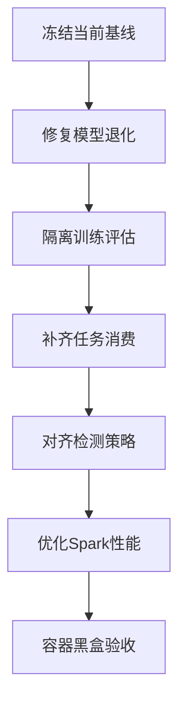
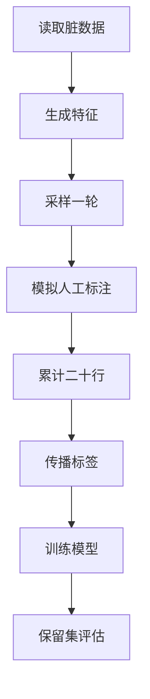
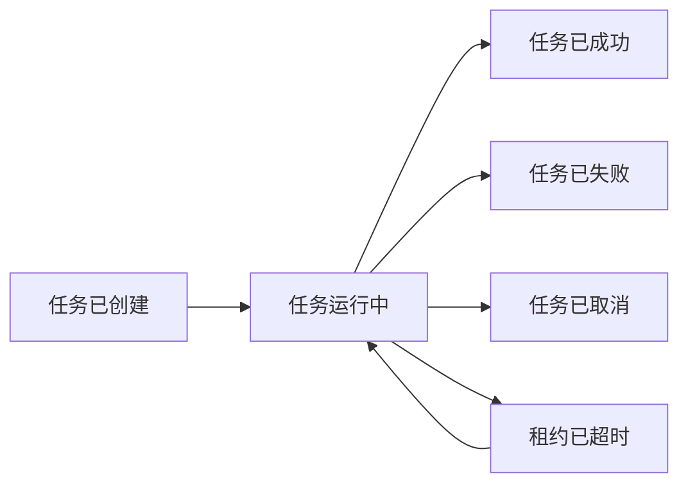

# Java Raha 问题修复实施计划

## 1. 文档目的

本文档基于《Python Raha 与 Java Spark flights 结果对比分析》，将已经确认的 Java 问题拆分为可实施、可测试、可验收的修复任务。

计划只覆盖 Java 工程及其 Spark 容器运行链路，不包含 Python Raha 的进一步重构。

## 2. 当前基线

`flights` 数据集当前 Java 实测基线如下：

| 指标 | 当前值 |
| --- | ---: |
| 检出数 | 9504 |
| 真阳性 | 4920 |
| 假阳性 | 4584 |
| 假阴性 | 0 |
| 精确率 | 0.517677 |
| 召回率 | 1.000000 |
| F1 | 0.682196 |
| 全链路耗时 | 172.9 秒 |
| 候选模型数 | 4 |
| 预测正例比例 | 四个时间字段均为 100% |

对照基线为 Python Raha：精确率 `0.938818`、召回率 `0.732927`、F1 `0.823194`。

当前 Java 结果的主要问题不是召回不足，而是模型分数饱和、训练数据泄漏和生产 UDF 消费闭环缺失。

## 3. 修复目标

### 3.1 必须达到的目标

1. 消除四个时间字段全部判错的模型退化现象。
2. 训练过程不再使用最终测试集完整真值。
3. 建立固定随机种子、固定标注预算和固定评估坐标的可重复基线。
4. UDF 提交后由独立任务消费者完成采样、训练或检测，不再依赖验证程序直接调用服务。
5. 模型发布前必须完成分数分布、预测比例和验证指标门禁。
6. `toy` 和 `flights` 必须在 Docker Spark 环境完成黑盒回归。

### 3.2 建议效果目标

在与 Python 相同的 `20` 行标注预算和固定随机种子条件下，`flights` 最终建议达到：

| 指标 | 目标值 |
| --- | ---: |
| 精确率 | 不低于 0.85 |
| 召回率 | 不低于 0.70 |
| F1 | 不低于 0.80 |
| 任一有正负样本字段的预测正例比例 | 不得无解释地达到 100% |
| 任一有正负样本字段的分数范围 | 必须跨越最终阈值 |
| 相同种子重复执行 | 坐标级结果一致 |

效果目标是最终验收目标，不要求第一批代码修改一次全部达到。每个阶段应先保证机制正确，再逐步逼近效果目标。

## 4. 总体实施顺序



必须按依赖顺序推进。模型输出仍然退化时，不应提前投入大量时间调整阈值或扩展策略；训练和评估未隔离时，不应使用指标判断模型优劣。

## 5. 工作项总览

| 编号 | 优先级 | 工作项 | 前置依赖 | 建议工作量 |
| --- | --- | --- | --- | ---: |
| `JFIX-001` | P0 | 固化退化回归测试 | 无 | 1 至 2 人日 |
| `JFIX-002` | P0 | 切换默认逻辑回归并禁止静默降级 | `JFIX-001` | 1 至 2 人日 |
| `JFIX-003` | P0 | 修复加权规则和特征尺度 | `JFIX-001` | 3 至 5 人日 |
| `JFIX-004` | P0 | 增加模型质量门禁 | `JFIX-002` | 2 至 4 人日 |
| `JFIX-005` | P0 | 建立无泄漏采样训练协议 | `JFIX-001` | 3 至 5 人日 |
| `JFIX-006` | P0 | 实现 UDF 异步任务消费者 | `JFIX-002`、`JFIX-005` | 5 至 8 人日 |
| `JFIX-007` | P1 | 建立 Python 策略对齐基线 | `JFIX-005` | 3 至 5 人日 |
| `JFIX-008` | P1 | 优化 Spark 执行计划 | `JFIX-002`、`JFIX-007` | 4 至 7 人日 |
| `JFIX-009` | P1 | 完善模型与结果诊断 | `JFIX-004` | 2 至 3 人日 |
| `JFIX-010` | P2 | 修复表名和配置命名空间 | 无 | 1 至 2 人日 |
| `JFIX-011` | P0 | Docker 黑盒回归与发布门禁 | 前述全部 P0 | 2 至 4 人日 |

单人串行实施预计约 `27` 至 `47` 人日。若模型、任务消费和性能优化由不同开发者并行推进，可压缩日历时间，但 `JFIX-001`、`JFIX-005` 和 `JFIX-011` 的基线与验收标准必须保持统一。

## 6. P0 修复任务

### 6.1 JFIX-001：固化模型退化回归测试

#### 目标

在修改模型前，先把当前四字段全正例问题固化为自动化失败用例，确保后续修改能够证明问题被修复且不会再次出现。

#### 涉及模块

| 路径或类 | 调整内容 |
| --- | --- |
| `src/test/java/com/fiberhome/ml/raha/model/ColumnModelTrainerIntegrationTest.java` | 增加分数饱和和全正例回归场景 |
| `src/test/java/com/fiberhome/ml/raha/model/ModelLifecycleIntegrationTest.java` | 增加退化模型禁止发布测试 |
| `src/test/java/com/fiberhome/ml/raha/feature/FeatureAssemblerIntegrationTest.java` | 验证频次和计数特征的数值范围 |
| `datasets/flights` | 作为容器级正式基线，不复制生成另一份数据 |

#### 实施步骤

1. 从 `flights` 结果中选取能够稳定复现分数饱和的最小字段样本，作为测试资源。
2. 记录训练样本正负数量、特征维度、原始特征最大值、线性分数和最终概率。
3. 增加断言：有正负样本时，所有预测分数完全相同或所有结果均过阈值应判定为退化。
4. 增加坐标级基线文件，记录当前 `9504` 个检出结果和 `4584` 个误报，供修复前后比较。
5. 测试名称和失败信息应明确指出字段、模型版本、分数范围和预测正例比例。

#### 验收标准

1. 修复前新增退化用例能够稳定失败。
2. 测试不依赖执行顺序和当前时间。
3. 固定随机种子重复运行结果一致。
4. 测试日志不输出原始敏感值，只输出哈希、字段名和汇总指标。

### 6.2 JFIX-002：切换默认逻辑回归并禁止静默降级

#### 问题

`raha-defaults.properties` 当前默认使用 `WEIGHTED_RULE`，且 `raha.model.fallback-enabled=true`。逻辑回归训练失败时会静默回退到已知存在分数饱和风险的规则模型。

#### 涉及模块

| 路径或类 | 调整内容 |
| --- | --- |
| `src/main/resources/raha-defaults.properties` | 默认分类器改为 `LOGISTIC_REGRESSION`，默认禁止规则降级 |
| `AdaptiveColumnModelTrainer` | 细化训练失败和降级状态，不允许无标记发布降级模型 |
| `SparkMllibLogisticRegressionTrainer` | 补充收敛、系数和训练分数诊断 |
| `RahaConfigFactory`、`RahaConfigValidator` | 校验分类器和降级配置组合 |
| `ColumnModelTrainerIntegrationTest` | 增加逻辑回归成功、失败和禁止降级测试 |

#### 建议配置

```properties
raha.model.classifier-type=LOGISTIC_REGRESSION
raha.model.fallback-enabled=false
```

#### 实施步骤

1. 先只切换默认分类器，在 `toy` 和 `flights` 上记录逻辑回归分数分布及指标。
2. 逻辑回归训练失败时返回明确失败状态和错误码，不自动生成可发布候选模型。
3. 如业务必须允许降级，要求调用方显式开启，并在模型元数据中写入 `fallback=true` 和降级原因。
4. 发布管理器默认拒绝发布降级模型，只有带审批标记的特殊流程可以放行。
5. 记录逻辑回归迭代次数、正负样本数、系数绝对值范围和训练耗时。

#### 验收标准

1. 默认配置训练产物的分类器类型为 `LOGISTIC_REGRESSION`。
2. MLlib 训练失败时任务状态可追踪，且不会静默发布 `WEIGHTED_RULE` 模型。
3. `flights` 四个时间字段不再全部输出相同分数。
4. 现有 142 个测试和新增测试全部通过。

### 6.3 JFIX-003：修复加权规则和特征尺度

#### 问题

`WeightedRuleFallbackTrainer` 使用正负样本特征均值差作为系数，`ColumnModelArtifact` 将系数与未缩放特征直接相乘。频次、长度和冲突计数等特征会使线性值快速超过 `35`，最终概率直接变为 `1.0`。

#### 设计决策

加权规则不再作为默认生产模型，但仍需修复，避免显式降级时重新引入同一问题。

#### 涉及模块

| 路径或类 | 调整内容 |
| --- | --- |
| `FeatureAssembler` | 对无上界计数类特征执行统一变换 |
| `FeatureDefinition`、`FeatureDictionary` | 记录特征变换类型和版本 |
| `WeightedRuleFallbackTrainer` | 使用变换后的特征计算均值差，限制异常系数 |
| `ColumnModelArtifact` | 保存并校验训练和预测使用的变换版本 |
| `ColumnModelVersioner` | 将变换配置纳入模型版本摘要 |
| `ColumnModelCompatibilityValidator` | 拒绝变换版本不一致的预测输入 |

#### 实施步骤

1. 对频次、命中数、冲突数等计数特征使用 `log1p` 或归一化占比。
2. 对长度等连续特征使用训练集统计量进行稳健缩放。
3. 将每个特征的变换类型、中心值、缩放值和版本写入不可变模型产物。
4. 预测阶段必须复用训练阶段参数，禁止根据待预测数据重新计算缩放值。
5. 对极端值增加有限值检查和合理裁剪，禁止产生无穷值或非数值。
6. 对加权规则系数增加绝对值上限，并记录触发裁剪的特征数量。
7. 保留旧模型读取能力，但旧模型不得自动升级为已修复模型版本。

#### 验收标准

1. 训练和预测的特征变换版本严格一致。
2. 构造极端频次样本时，线性分数保持有限且概率不直接饱和。
3. `flights` 任一有正负样本字段的预测结果不再全部为正例。
4. 模型序列化、反序列化后坐标级预测完全一致。

### 6.4 JFIX-004：增加模型质量门禁

#### 问题

`ModelReleaseManager` 当前主要校验候选状态和模型文件是否存在，没有基于验证指标和分数分布阻止退化模型发布。

#### 涉及模块

| 路径或类 | 调整内容 |
| --- | --- |
| `ColumnModelTrainingResult` | 增加分数分布和验证指标 |
| `RahaColumnModel` | 持久化质量指标和门禁结论 |
| `ColumnModelMetadataFactory` | 从训练结果构建完整质量元数据 |
| `ModelReleaseManager` | 发布前执行质量门禁 |
| `ThresholdComparisonService` | 基于独立验证集选择阈值 |
| `ModelLifecycleIntegrationTest` | 增加门禁拒绝和正常发布测试 |

#### 最低门禁项

1. 训练样本必须同时包含正例和负例；单一类别字段按明确策略跳过。
2. 验证集必须同时包含正例和负例，且与训练坐标不重叠。
3. 分数最小值、最大值、均值、标准差和分位数必须完整记录。
4. 当验证集有正负样本时，预测正例比例达到 `0%` 或 `100%` 默认拒绝发布。
5. 分数标准差低于配置阈值时拒绝发布。
6. F1、精确率或召回率低于配置下限时拒绝发布。
7. 候选模型必须优于当前已发布模型或通过显式审批，避免自动效果回退。

#### 建议新增配置

```properties
raha.model.quality-gate.enabled=true
raha.model.quality-gate.minimum-score-stddev=0.000001
raha.model.quality-gate.maximum-positive-ratio=0.98
raha.model.quality-gate.minimum-f1=0.70
raha.model.quality-gate.require-holdout=true
```

具体默认值应通过 `toy`、`flights` 和新增大数据集校准，不能只针对单个数据集硬编码。

#### 验收标准

1. 当前四字段全正例模型必须被门禁拒绝。
2. 门禁拒绝后，原已发布模型状态不变。
3. 拒绝原因写入任务状态、模型元数据、审计记录和日志。
4. 调整阈值只能基于独立验证集，最终测试集不参与阈值选择。

### 6.5 JFIX-005：建立无泄漏采样训练协议

#### 问题

`RahaContainerValidationApplication` 当前将 `truth.getLabels()` 全量传给 `RahaTrainRequest`，随后又使用同一真值评估，导致测试答案进入训练过程。

工程已经具备 `RahaSampleService`、`SamplingService`、`TupleSampler` 和 `LabelPropagationService`，应优先复用现有能力。

#### 涉及模块

| 路径或类 | 调整内容 |
| --- | --- |
| `RahaContainerValidationApplication` | 改为采样、模拟标注、训练、保留集评估流程 |
| `RahaSampleService` | 支持按轮次执行到固定标注预算 |
| `RahaSampleRequest`、`RahaSampleOutput` | 明确轮次、随机种子和已标注坐标 |
| `RahaTrainRequest` | 接收采样得到的标签，不接收完整测试真值 |
| `DetectionEvaluationService` | 支持排除训练坐标的保留集评估 |
| `GroundTruthDifferenceService` | 只在验证程序中模拟标注和最终评估使用 |

#### 推荐流程



#### 实施步骤

1. 固定随机种子 `20260715`，并将随机种子写入任务摘要。
2. 按 Python 口径逐轮采样，直到标注行数达到 `20`。
3. 验证程序可使用 `clean.csv` 模拟人工标注，但只返回被采样行对应的标签。
4. 训练请求只接收采样标签及其传播结果，禁止接收最终测试集全量标签。
5. 最终评估排除直接标注行，另行输出包含和不包含标注行的两套指标。
6. 保存训练坐标、验证坐标和最终评估坐标摘要，三者必须可审计。
7. 生产检测路径不允许配置或读取 `clean.csv`。

#### 验收标准

1. 训练输入不再出现 `truth.getLabels()` 全量传递。
2. 直接标注行数严格等于配置预算 `20`。
3. 训练坐标与最终测试坐标无交集。
4. 相同种子重复执行时采样行、传播标签和检测坐标一致。
5. 报告同时输出标注预算、传播数量和保留集指标。

### 6.6 JFIX-006：实现 UDF 异步任务消费者

#### 问题

`RepositoryBackedRahaUdfJobSubmitter` 已能创建任务并写入任务表，但当前没有独立消费者从 `CREATED` 状态认领任务并调用 `RahaSampleService`、`RahaTrainService` 或 `RahaDetectService`。

`JobRepository` 当前只有保存和按幂等键查询能力，缺少按任务标识查询、待处理任务扫描和跨进程原子认领接口。

#### 建议新增组件

| 组件 | 责任 |
| --- | --- |
| `RahaJobRequestRepository` | 持久化经过校验的任务请求和配置摘要 |
| `RahaJobWorker` | 轮询、认领、分发和结束任务 |
| `RahaTaskDispatcher` | 按任务类型调用采样、训练或检测服务 |
| `RahaJobLease` | 保存认领者、租约到期时间和尝试次数 |
| `RahaJobWorkerApplication` | Spark 容器内的独立消费者入口 |

#### 仓储调整

`JobRepository` 建议增加：

1. 按 `jobId` 查询任务。
2. 按状态和创建时间分页查询待处理任务。
3. 带版本号或租约的原子认领方法。
4. 更新当前阶段、重试次数和心跳时间的方法。
5. 回收超时租约的方法。

任务请求必须持久化任务类型、数据集、快照、输入引用、标注引用、模型版本、结果表、配置版本和调用方。不得只保存无法还原执行参数的 `RahaJob` 摘要。

#### 状态流转



#### 实施步骤

1. UDF 提交时在同一逻辑事务中保存任务和完整执行请求。
2. 消费者通过租约原子认领任务，避免多个容器重复执行。
3. 调度器把 UDF 请求转换为现有三个服务的请求对象。
4. 每个核心阶段更新 `currentStageId`，并同步写入 FMDB 任务表。
5. 可恢复异常按配置重试，不可恢复异常直接失败并记录错误码。
6. 重试必须复用相同输入快照和配置版本。
7. 结果写入成功后再将任务标记为 `SUCCEEDED`。
8. 增加优雅停机，停止认领新任务并等待当前任务完成或保存检查点。

#### 验收标准

1. 验证程序只调用 UDF，不直接调用三个核心服务，也能完成全链路。
2. 相同幂等键重复提交只执行一次。
3. 两个消费者并发运行时，同一任务只能被一个消费者认领。
4. 消费者中断后，租约到期任务能够被重新认领。
5. 成功、失败、取消和重试状态在仓储、FMDB 表和日志中一致。
6. 任务失败不得留下被标记为成功的部分结果。

## 7. P1 修复任务

### 7.1 JFIX-007：建立 Python 策略对齐基线

#### 目标

从“整体结果不同”推进到“每个策略为何不同”的可定位状态。

#### 涉及模块

| 路径或类 | 调整内容 |
| --- | --- |
| `StrategyPlanGenerator` | 输出稳定策略标识和完整配置摘要 |
| `StrategyIdentityGenerator` | 保证跨运行策略标识稳定 |
| `StrategyExecutionService` | 输出每个策略的候选坐标统计 |
| `strategy/od`、`strategy/pvd`、`strategy/rvd` | 按优先级补齐 Python 语义 |
| `PythonBaselineArtifactTest` | 扩展为逐策略对齐测试 |

#### 实施步骤

1. 从 Python 导出每个策略的名称、配置、候选坐标和候选数量。
2. 定义 Python 策略到 Java 策略的映射表。
3. 第一批优先对齐对 `flights` 贡献最大的时间字段策略。
4. 对每个策略计算坐标集合的交集、差集和杰卡德系数。
5. 无法等价实现的策略必须记录差异原因，不允许使用相同名称掩盖语义差异。

#### 验收标准

1. 每个启用策略都有稳定配置摘要和候选坐标产物。
2. 对齐策略的坐标差异能够自动生成报告。
3. 新增策略不得导致模型质量门禁回退。

### 7.2 JFIX-008：优化 Spark 执行计划

#### 问题

当前多个策略使用 `collectAsList`，`FeatureAssembler` 按字段执行聚合和连接，关系策略按字段对重复扫描数据，导致大量细粒度 Spark 作业。

#### 涉及模块

| 路径或类 | 调整内容 |
| --- | --- |
| `FeatureAssembler` | 合并多字段统计和频次计算 |
| `StrategyExecutionService` | 批量执行相同类型策略 |
| `OneToManyConflictStrategy` | 按源字段批量计算关系冲突 |
| `SparkStrategySupport` | 统一持久化、广播和释放策略 |
| `RahaTrainService` | 管理阶段级缓存生命周期 |
| `ResourceConfig` | 增加收集行数和广播大小保护 |

#### 实施步骤

1. 对清洗、哈希后的公共数据集执行一次持久化，并在训练阶段结束后释放。
2. 将长度、空值、类型、字符和频次统计合并为少量聚合作业。
3. 将同类策略的字段配置转换为批量表达式，减少重复扫描。
4. 移除无边界 `collectAsList`，大结果使用分区迭代或落盘。
5. 对关系策略先计算公共分组结果，再派生各字段对冲突。
6. 增加 Spark 监听器，记录作业数、阶段数、扫描量、洗牌量和驱动端收集行数。
7. 使用与当前实测相同的一个执行器、两个核心作为性能验收环境。

#### 验收标准

1. `flights` 全链路耗时由 `172.9` 秒降低到建议目标 `100` 秒以内。
2. Spark 作业数相对当前基线减少至少 `50%`。
3. 驱动端不存在无配置上限的大规模收集。
4. 优化前后相同模型和阈值的检测坐标一致。

### 7.3 JFIX-009：完善模型与结果诊断

#### 实施内容

1. 训练摘要增加每字段正负样本数、特征维度、训练器、是否降级和耗时。
2. 模型摘要增加系数范围、分数分位数、验证指标、阈值来源和门禁结果。
3. 检测摘要增加每字段结果数、正例比例、分数最小值、最大值、均值和标准差。
4. 任务摘要增加 Spark 作业数、失败策略数、跳过字段数和重试次数。
5. 所有异常捕获日志必须包含 `jobId`、`datasetId`、`snapshotId`、阶段和模型版本。
6. 原始单元格值继续采用哈希或脱敏输出，不得写入普通日志。

#### 验收标准

仅查看任务摘要即可判断是否出现全正例、全负例、恒定分数、单一类别训练和异常降级，不需要再次解析全部预测明细。

## 8. P2 修复任务

### 8.1 JFIX-010：修复表名和配置命名空间

#### 表名调整

`RahaContainerValidationApplication` 中的 `raha_toy_*` 临时表名改为按数据集标识生成。数据集标识必须经过合法字符清洗，并限制最终表名长度。

建议格式：

```text
raha_validation_<dataset>_dirty
raha_validation_<dataset>_clean
raha_validation_<dataset>_result
```

#### 配置调整

1. `raha.*` 继续用于受严格校验的核心配置。
2. `fmdb.validation.*` 用于容器验证入口参数。
3. 如需业务扩展，定义明确的 `raha.extension.*` 白名单规则，不直接放开所有未知配置。
4. 配置加载失败日志必须同时输出属性键、来源和允许前缀，不输出敏感属性值。

#### 验收标准

1. `toy` 和 `flights` 回执中的输入表、结果表与实际数据集一致。
2. 未声明核心配置仍然会被拒绝。
3. 合法验证配置不再被核心配置加载器误判。

## 9. JFIX-011：Docker 黑盒回归与发布门禁

### 9.1 必测场景

| 场景 | 数据集 | 验证重点 |
| --- | --- | --- |
| 正常小数据 | `toy` | 训练、检测、评估链路不回退 |
| 正常效果数据 | `flights` | 分数分布、误报、F1 和标注预算 |
| 无正例字段 | `flights` 的 `src`、`flight` | 单一类别字段处理 |
| 重复提交 | `toy` | 幂等执行一次 |
| 消费者重启 | `toy` | 租约恢复和任务续跑 |
| 非法配置 | 任意 | 明确拒绝和错误码 |
| 模型退化 | 构造数据 | 质量门禁拒绝发布 |
| 模型回滚 | `toy` | 发布失败后恢复上一版本 |

### 9.2 固定执行环境

1. 使用 JDK 8 构建，执行 `mvn clean verify`。
2. 使用 `fmdb-spark-client`、`fmdb-spark-master` 和 `fmdb-spark-worker`。
3. Spark 固定一个执行器和两个核心，便于与当前基线对比。
4. 数据文件执行 SHA-256 校验，防止基线数据被修改。
5. 所有随机流程固定种子并写入结果摘要。

### 9.3 发布阻断条件

出现以下任一情况不得发布：

1. 单元测试或集成测试失败。
2. `flights` 任一有正负样本字段全部判为同一类别。
3. 最终测试标签进入训练或阈值选择流程。
4. UDF 返回成功但任务消费者没有生成终态和结果位置。
5. 相同幂等键产生两次实际执行。
6. 模型门禁被绕过或门禁结果未落审计。
7. Docker 黑盒流程需要验证程序直接调用核心服务才能完成。

## 10. 测试分层

### 10.1 单元测试

1. 特征变换、有限值和版本兼容测试。
2. 加权规则极端特征测试。
3. 逻辑回归失败和禁止降级测试。
4. 模型质量门禁边界测试。
5. 任务状态转换、租约和幂等测试。
6. 配置前缀和动态表名测试。

### 10.2 Spark 集成测试

1. 逻辑回归训练和可移植模型预测一致性。
2. 特征组装批量聚合结果一致性。
3. 采样、标签传播、训练和保留集评估。
4. 多消费者并发认领和超时恢复。
5. 模型发布拒绝和回滚。

### 10.3 容器黑盒测试

1. 完整打包并将阴影包提交到 Spark 容器。
2. 只调用三个 UDF，不在验证程序中直接调用核心服务。
3. 等待任务消费者完成并查询任务状态。
4. 从结果表读取预测并独立评估。
5. 保存请求、任务状态、模型摘要、检测明细和评估报告。

## 11. 配置迁移建议

第一版修复建议保留原配置键，但修改默认值：

```properties
raha.model.classifier-type=LOGISTIC_REGRESSION
raha.model.fallback-enabled=false
raha.model.quality-gate.enabled=true
```

新增配置必须完成以下工作：

1. 加入 `RahaProperties` 常量。
2. 加入 `RahaConfigLoader` 已知键集合。
3. 在 `RahaConfigFactory` 中完成类型转换。
4. 在 `RahaConfigValidator` 中校验范围和组合关系。
5. 在配置版本摘要中包含新值。
6. 增加默认值、覆盖值、非法值和未知键测试。

## 12. 数据与产物约定

每次基线和回归至少保存：

| 产物 | 必需内容 |
| --- | --- |
| 数据摘要 | 路径、行数、字段数、SHA-256 |
| 运行摘要 | 代码版本、配置版本、随机种子、Spark 资源 |
| 采样摘要 | 轮次、预算、采样行、直接标签数、传播标签数 |
| 模型摘要 | 分类器、训练器、特征版本、阈值、验证指标、门禁结果 |
| 检测摘要 | 每字段分数分布、预测比例和结果数量 |
| 评估摘要 | 总体与字段级混淆矩阵、精确率、召回率和 F1 |
| 性能摘要 | 总耗时、Spark 作业数、阶段数和失败重试数 |

大明细继续写入 `doc/<日期>/notes/`，正式结论写入 `doc/<日期>/`。

## 13. 实施分支与提交建议

为降低回滚风险，每个工作项独立提交，不把模型、任务消费者和性能优化混在同一个提交中。

建议提交顺序：

1. 退化回归测试。
2. 默认逻辑回归和禁止静默降级。
3. 模型质量门禁。
4. 无泄漏采样训练协议。
5. 加权规则和特征尺度修复。
6. UDF 任务请求持久化。
7. 任务消费者和租约。
8. 策略对齐产物。
9. Spark 性能优化。
10. 表名、配置和最终黑盒回归。

每个提交必须包含对应测试，不能先合并实现、后补测试。

## 14. 上线与回滚方案

### 14.1 上线步骤

1. 在测试环境启用逻辑回归和质量门禁，保持生产旧模型不变。
2. 使用 `toy` 和 `flights` 生成候选模型，不立即发布。
3. 核对分数分布、保留集指标和坐标差异。
4. 启动单实例任务消费者，验证幂等和状态流转。
5. 扩展为多消费者，执行并发和故障恢复测试。
6. 通过黑盒门禁后，按字段逐个发布新模型。

### 14.2 回滚策略

1. 模型效果异常时使用现有 `ModelReleaseManager.rollback` 回滚到上一已发布版本。
2. 消费者异常时停止认领新任务，不修改已成功任务。
3. 新特征版本与旧模型不兼容时拒绝预测，不进行隐式转换。
4. 新配置可通过显式开关关闭，但不得回退到未修复且无门禁的加权规则模型。

## 15. 风险与控制

| 风险 | 影响 | 控制措施 |
| --- | --- | --- |
| 逻辑回归在少量标签下不稳定 | 效果波动 | 固定种子、多种子评估、类别平衡和正则化调参 |
| 特征变换改变旧模型语义 | 预测不兼容 | 特征版本化、拒绝隐式升级、保留旧读取路径 |
| 门禁阈值过严 | 无模型可发布 | 配置化阈值、候选保留、人工审批但必须审计 |
| 消费者重复执行 | 重复写结果 | 原子租约、幂等键、结果写入幂等 |
| 消费者中断 | 任务长期运行 | 心跳、租约超时、检查点和有限重试 |
| Spark 优化改变结果 | 效果回退 | 优化前后坐标级一致性测试 |
| Python 策略无法完全等价 | 对齐延期 | 分层对齐、记录差异、不伪装完全一致 |

## 16. 完成定义

只有同时满足以下条件，Java 问题修复才视为完成：

1. JDK 8 下 `mvn clean verify` 全部通过。
2. `toy` 和 `flights` Docker 黑盒测试全部通过。
3. `flights` 不再出现四字段全量报错和分数恒定为 `1.0`。
4. 训练、验证和最终测试坐标已隔离并可审计。
5. UDF 提交后由独立消费者完成任务，无验证程序直接服务调用。
6. 模型发布门禁能够拒绝全正例、全负例和恒定分数模型。
7. 相同种子重复执行结果一致。
8. 效果达到精确率不低于 `0.85`、召回率不低于 `0.70`、F1 不低于 `0.80` 的建议目标，或对未达到项形成经批准的偏差说明。
9. 全链路性能相对当前 `172.9` 秒有明确改善，建议达到 `100` 秒以内。
10. 正式测试报告、配置清单、模型摘要和回滚说明完整落盘。

## 17. 建议立即启动的第一批任务

第一批不应同时修改所有模块，建议按以下顺序启动：

1. 完成 `JFIX-001`，把当前全正例问题固化为失败测试。
2. 完成 `JFIX-002`，切换默认逻辑回归并关闭静默规则降级。
3. 在不改动策略的情况下重新执行 `flights`，确认分数是否恢复区分度。
4. 完成 `JFIX-005`，将容器验证改为 20 行标注预算和保留集评估。
5. 完成 `JFIX-004`，把已确认的退化条件固化为发布门禁。

第一批结束后必须生成一次新的 Java 与 Python 坐标级对比报告。只有当模型输出和评测协议均正常后，才进入任务消费者、策略对齐和 Spark 性能优化阶段。
