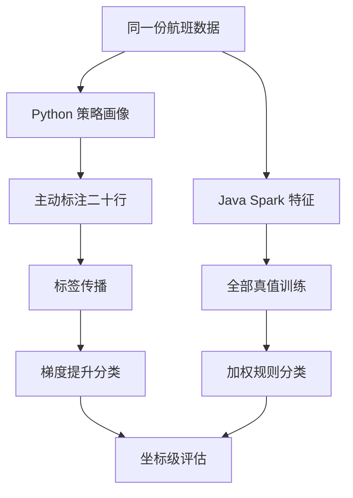

# Python Raha 与 Java Spark flights 结果对比分析

## 1. 测试结论

本次使用两份内容完全一致的 `flights` 脏数据和标注数据，分别直接执行 Python Raha 原始入口和 Docker Spark 容器内的 Java 工程。

核心结论如下：

1. Python Raha 检测精确率为 `0.938818`，召回率为 `0.732927`，F1 为 `0.823194`。
2. Java Spark 检测精确率为 `0.517677`，召回率为 `1.000000`，F1 为 `0.682196`。
3. Java 的满召回不是有效优势。Java 对四个存在错误的时间字段全部 `2376` 行都判定为错误，共产生 `4584` 个误报。
4. Python 检出的 `3841` 个单元格全部包含在 Java 检测集合中；Java 额外检出 `5663` 个单元格，其中 `4349` 个是误报。
5. Java 四个模型的分数全部大于等于 `0.5`，绝大部分等于或无限接近 `1.0`，存在明确的分数饱和和分类退化。
6. Java 当前验证流程直接使用全部真值标签训练，而 Python 只主动标注 `20` 行后进行标签传播。两者不是同一训练协议，Java 还存在评估真值泄漏到训练集的问题。
7. Java 默认使用 `WEIGHTED_RULE`，Python 使用梯度提升分类器；两边的策略目录、特征语义、采样方式和分类器均未对齐，因此当前 Java 工程不能视为 Python Raha 的等价移植。
8. Java UDF 已在 Spark 执行器中成功提交训练和检测请求，后续训练、预测、评估由验证程序直接调用服务完成。当前证据不能替代生产环境任务消费者的独立验收。

综合判断：Java 工程的 UDF 提交、Spark 作业、模型持久化、预测落盘和评估链路已经可运行，但模型效果尚不具备上线条件。第一优先级不是调整阈值，而是修复特征尺度和打分公式导致的分数饱和，并建立与 Python 一致且无数据泄漏的评测协议。

## 2. 数据一致性

两边实际使用的数据如下：

| 实现 | 脏数据 | 标注数据 |
| --- | --- | --- |
| Python | `F:/ai-code/raha/raha-master/datasets/flights/dirty.csv` | `F:/ai-code/raha/raha-master/datasets/flights/clean.csv` |
| Java | `F:/ai-code/fmdb_udf_raha/datasets/flights/dirty.csv` | `F:/ai-code/fmdb_udf_raha/datasets/flights/clean.csv` |

文件摘要一致：

| 文件 | SHA-256 |
| --- | --- |
| `dirty.csv` | `1B5C1AFA10AA0E7C20FD7E14D05C56772715B2771AA0F5FA67ED1709E1EECD46` |
| `clean.csv` | `0ACFCFD8985B06FDD363965C9E8D9522C43E7589A93D79AE7DC311E1C37FDF3B` |

数据规模：

| 项目 | 数值 |
| --- | ---: |
| 行数 | 2376 |
| 总字段数 | 7 |
| 稳定行标识字段 | `tuple_id` |
| 参与检测字段数 | 6 |
| 可检测单元格数 | 14256 |
| 真值错误数 | 4920 |
| 真值正常数 | 9336 |

真值错误只出现在四个时间字段中：

| 字段 | 真值错误数 |
| --- | ---: |
| `sched_dep_time` | 911 |
| `act_dep_time` | 1558 |
| `sched_arr_time` | 1100 |
| `act_arr_time` | 1351 |
| 合计 | 4920 |

## 3. 执行环境

### 3.1 Python 环境

| 项目 | 数值 |
| --- | --- |
| 入口 | `F:/ai-code/raha/raha-master/raha/detection.py` |
| Python | 3.10.20 |
| 解释器 | `F:/anaconda3/envs/raha/python.exe` |
| NumPy | 1.22.4 |
| Pandas | 2.1.0 |
| SciPy | 1.10.0 |
| scikit-learn | 1.2.2 |
| 随机种子 | 20260715 |

直接执行命令：

```powershell
$env:RAHA_RANDOM_SEED='20260715'
F:\anaconda3\envs\raha\python.exe raha\detection.py
```

工作目录为 `F:/ai-code/raha/raha-master`。检测产物写入：

```text
F:/ai-code/raha/raha-master/datasets/flights/raha-baran-results-flights/error-detection/detection.dataset
```

### 3.2 Java 与 Spark 环境

| 项目 | 数值 |
| --- | --- |
| Docker Compose 工程 | `fmdb_udf_schmatch` |
| Spark 客户端容器 | `fmdb-spark-client` |
| Spark 主节点容器 | `fmdb-spark-master` |
| Spark 工作节点容器 | `fmdb-spark-worker` |
| Spark | 3.3.1 |
| Spark 主节点 | `spark://spark-master:7077` |
| 应用标识 | `app-20260715090649-0006` |
| 执行器实例数 | 1 |
| 执行器核心数 | 2 |
| Java 构建版本 | OpenJDK 8u492 |

容器内数据目录：

```text
/opt/spark/work-dir/data/raha-flights/
```

容器内结果目录：

```text
/opt/spark/work-dir/data/raha-flights-validation-20260715-1710/
```

提交命令的关键参数如下：

```text
--master spark://spark-master:7077
--deploy-mode client
--conf spark.executor.instances=1
--conf spark.executor.cores=2
--conf spark.cores.max=2
--conf spark.ui.showConsoleProgress=false
--conf spark.driver.extraJavaOptions=-Dfmdb.validation.dataset-id=flights -Dfmdb.validation.snapshot-id=flights-snapshot-v1 -Dfmdb.validation.row-id-column=tuple_id
--class com.fiberhome.ml.raha.app.RahaContainerValidationApplication
```

Java 作业退出码为 `0`，训练 UDF 和检测 UDF 均返回 `ACCEPTED`，两个提交回执均记录执行器编号 `0`。

## 4. 两套流程差异



| 对比项 | Python Raha | Java Spark |
| --- | --- | --- |
| 策略数量 | 308 个策略画像 | 使用 Java 固定策略目录，语义未与 Python 完全对齐 |
| 标注预算 | 主动标注 20 行 | 验证程序直接传入全部 14256 个真值标签 |
| 标签传播 | 同质性传播到 13494 个单元格 | 服务内部标签处理，但输入已包含完整真值 |
| 分类器 | `GradientBoostingClassifier` | 默认 `WEIGHTED_RULE` |
| 模型数 | 按字段训练 | 4 个候选模型，仅四个有正样本的时间字段 |
| 输出 | 检测坐标集合 | 9504 条时间字段预测结果 |
| 评估隔离 | 20 行标注以外参与预测 | 训练和评估使用同一份完整真值，存在泄漏 |

因此，本次对比适合发现工程实现问题和输出退化问题，不适合声明两种算法在完全相同协议下的最终优劣。

## 5. 总体结果

| 指标 | Python Raha | Java Spark | 差值 |
| --- | ---: | ---: | ---: |
| 检出数 | 3841 | 9504 | Java 多 5663 |
| 真阳性 | 3606 | 4920 | Java 多 1314 |
| 假阳性 | 235 | 4584 | Java 多 4349 |
| 假阴性 | 1314 | 0 | Java 少 1314 |
| 精确率 | 0.938818 | 0.517677 | Java 低 0.421141 |
| 召回率 | 0.732927 | 1.000000 | Java 高 0.267073 |
| F1 | 0.823194 | 0.682196 | Java 低 0.140997 |

Java 的平均精确率为 `0.517220`，与其整体精确率接近。由于四个时间字段全部过阈值，这个指标主要反映字段本身的错误比例，不能证明模型具备有效排序能力。

Java 全链路耗时为 `172911` 毫秒，约 `172.9` 秒。Python 命令端到端实测约 `74` 秒。两边使用的核心数和执行模型不同，耗时不能直接作为公平性能排名，但 Java 运行期间产生大量细粒度 Spark 作业，说明当前执行计划存在明显优化空间。

## 6. 字段级结果

| 字段 | 真值错误 | Python 检出 | Python 精确率 | Python 召回率 | Python F1 | Java 检出 | Java 精确率 | Java 召回率 | Java F1 |
| --- | ---: | ---: | ---: | ---: | ---: | ---: | ---: | ---: | ---: |
| `sched_dep_time` | 911 | 873 | 1.000000 | 0.958288 | 0.978700 | 2376 | 0.383418 | 1.000000 | 0.554305 |
| `act_dep_time` | 1558 | 1046 | 0.847992 | 0.569320 | 0.681260 | 2376 | 0.655724 | 1.000000 | 0.792069 |
| `sched_arr_time` | 1100 | 1046 | 0.955067 | 0.908182 | 0.931034 | 2376 | 0.462963 | 1.000000 | 0.632911 |
| `act_arr_time` | 1351 | 876 | 0.966895 | 0.626943 | 0.760665 | 2376 | 0.568603 | 1.000000 | 0.724980 |

`tuple_id`、`src` 和 `flight` 没有真值错误，两套实现均未输出这些字段的错误坐标。Java 没有为 `src` 和 `flight` 生成候选模型，因此不能据此证明全负样本字段上的泛化能力。

## 7. 坐标级交集

| 项目 | 数量 |
| --- | ---: |
| 两边共同检出 | 3841 |
| 共同真阳性 | 3606 |
| 共同假阳性 | 235 |
| Python 独有检出 | 0 |
| Java 独有检出 | 5663 |
| Java 独有真阳性 | 1314 |
| Java 独有假阳性 | 4349 |
| 检测集合杰卡德系数 | 0.404146 |

Python 检测集合是 Java 检测集合的严格子集。Java 相比 Python 找回了全部 `1314` 个漏检真值，但为此新增了 `4349` 个误报，新增结果的精确率仅为约 `23.2%`。这说明 Java 当前不是在合理扩展召回，而是在将四个时间字段整体判为错误。

## 8. Java 分数退化证据

| 字段 | 最小分数 | 最大分数 | 平均分数 | 大于等于 0.5 |
| --- | ---: | ---: | ---: | ---: |
| `sched_dep_time` | 1.000000000000 | 1.000000000000 | 1.000000000000 | 2376 |
| `act_dep_time` | 0.999969367819 | 1.000000000000 | 0.999999979311 | 2376 |
| `sched_arr_time` | 1.000000000000 | 1.000000000000 | 1.000000000000 | 2376 |
| `act_arr_time` | 0.999999999735 | 1.000000000000 | 1.000000000000 | 2376 |

这不是阈值略有偏差，而是模型输出失去区分度。即使将阈值从 `0.5` 提高到 `0.9` 或 `0.99`，结果几乎不会变化。

## 9. Java 根因分析

### 9.1 P0：加权规则在原始大尺度特征上发生分数饱和

`WeightedRuleFallbackTrainer` 对每个特征使用“正样本均值减负样本均值”作为系数，并将正负样本权重比的对数作为截距。`ColumnModelArtifact` 再把所有激活特征的“系数乘原始特征值”直接相加并做逻辑函数变换；线性值达到 `35` 时直接返回 `1.0`。

当前特征中包含值长度、字段频次、冲突计数和命中计数等非标准化数值。小幅正系数乘以较大的频次或计数后，多个特征继续累加，线性值很容易超过 `35`。本次四个模型的输出与该机制完全一致。

建议调整：

1. 在训练和预测共用的特征管道中增加标准化或稳健缩放，并将缩放参数写入模型产物。
2. 计数和频次特征优先使用 `log1p`、占比或分位数，不直接使用无上界原值。
3. 将 `LOGISTIC_REGRESSION` 设为默认可训练分类器；`WEIGHTED_RULE` 只作为显式降级方案，不作为生产默认模型。
4. 增加模型发布门禁，至少检查分数唯一值数量、最小值、最大值、分位数、预测正例比例和验证集 F1。
5. 当所有分数相同、预测正例比例为 `0%` 或 `100%` 时，模型训练必须失败或回退，不能正常发布。
6. 仅调整 `0.5` 阈值不能解决本问题，应在分数可分后再基于独立验证集选择阈值。

### 9.2 P0：训练数据泄漏，评测协议与 Python 不一致

Java 容器验证入口把 `GroundTruthDifferenceService` 产生的全部真值标签直接传给训练服务。随后又使用同一份真值评估同一份数据，导致完整评估答案进入训练过程。

Python 的正式流程只主动标注 `20` 行，直接标签为 `140` 个单元格，再传播到 `13494` 个单元格。即使在这种更严格的协议下，Python F1 仍高于 Java。

建议调整：

1. 建立统一的评测协议，固定数据、随机种子、标注预算、训练坐标和评估坐标。
2. 首轮至少实现与 Python 相同的 `20` 行主动标注预算和同质性标签传播。
3. 将训练集、阈值验证集和最终测试集按稳定行标识隔离，最终测试标签不得进入特征选择、训练和阈值选择。
4. 对比报告同时输出宏平均、微平均、每字段指标和坐标交集，避免只看总体召回率。
5. 增加无真值输入的预测验收，确认生产流程不依赖 `clean.csv`。

### 9.3 P0：UDF 只完成请求提交，生产任务消费链路尚未独立验收

本次训练 UDF 和检测 UDF 在 Spark 执行器中均成功返回 `ACCEPTED`，说明 UDF 注册、参数解析和请求落盘有效。验证程序随后在驱动端直接调用训练、预测和评估服务，才完成全链路。

建议调整：

1. 明确实现并部署请求消费者，负责认领请求、幂等执行、状态更新、失败重试和结果位置回写。
2. 为提交、执行、完成、失败建立统一任务状态表，使用 `jobId` 贯穿日志和产物。
3. 增加真正的黑盒验收：只执行 UDF，不由验证程序手动调用服务，等待消费者完成后查询结果和指标。
4. 增加重复提交、执行器重启、任务超时、部分结果和失败恢复测试。

### 9.4 P1：策略与 Python Raha 未对齐

Python 本次生成 `308` 个策略画像，包括按观测字符枚举的模式策略、多组异常检测配置和字段关系策略。Java 使用自身固定策略目录，策略数量、参数网格、候选单元格语义和 Python 不等价。

建议调整：

1. 建立策略对照表，为每个 Python 策略定义 Java 输入、参数、候选坐标和预期画像。
2. 先选择对效果贡献最大的策略完成坐标级一致性测试，再逐步扩展，而不是只比较策略名称。
3. 为每个策略保存稳定标识、配置摘要、候选数量和样例坐标，支持两边逐策略比对。
4. 对同一数据和同一配置增加金标准测试，规定候选坐标集合的允许差异。

### 9.5 P1：Spark 作业过于碎片化

Java 全链路约耗时 `172.9` 秒，运行日志显示策略和字段组合触发了大量独立 Spark 作业。多个策略内部使用 `collectAsList`，特征组装按字段执行 `groupBy`、`count`、`join` 和收集，关系策略还会按字段对重复扫描数据。

建议调整：

1. 在清洗和哈希后的公共数据集上统一持久化，并在阶段结束后释放。
2. 将多字段频次、长度、类型和空值统计合并为少量聚合作业。
3. 将关系策略按源字段批量计算，避免每个字段对单独触发扫描和收集。
4. 限制驱动端收集的数据规模，对大基数中间结果使用分区写出或广播阈值控制。
5. 增加 Spark 监听指标，记录每阶段作业数、阶段数、扫描字节、洗牌字节和驱动端收集行数。

### 9.6 P1：模型和结果缺少退化诊断信息

当前汇总提供总体指标，但生产训练阶段没有阻止全正例模型发布，也没有把字段级分数分布作为一等产物。

建议调整：

1. 模型产物增加训练正负样本数、特征尺度、系数分布、分数分位数和阈值来源。
2. 检测结果汇总增加每字段预测正例比例、分数直方图和异常退化标记。
3. 模型选择必须基于独立验证集，并保存所有候选模型的对比指标和淘汰原因。
4. 对只有单一类别标签的字段定义明确策略：跳过、使用无监督分数或要求补充负例，不能默默产生不可比较结果。

### 9.7 P2：验证入口的表名仍带 toy 语义

本次已将 `datasetId`、`snapshotId` 和 `rowIdColumn` 参数化，但临时表名和结果表名仍使用 `raha_toy_*`。这不会改变检测指标，却会使回执和日志在多数据集测试时产生误导。

建议将临时表名按经过合法字符清洗的数据集标识生成，或通过独立的验证参数传入，并在回执中同时记录数据摘要。

### 9.8 P2：配置命名空间不支持扩展参数

首次尝试使用 `raha.validation.*` 系统属性时，配置加载器将其视为未声明的 Raha 配置并拒绝启动。最终改用 `fmdb.validation.*` 才能运行。

建议明确区分核心配置、验证配置和业务扩展配置。核心配置可继续严格校验，扩展前缀应有清晰规则，避免合法的运行参数被当作拼写错误。

## 10. Python 实现发现的问题与已修复项

### 10.1 本次已修复

1. 原实现创建 `multiprocessing.Pool` 后未可靠关闭和等待，Windows 下 dBoost 子进程会继续占用临时输入文件。
2. 删除临时文件时可能出现 `PermissionError: [WinError 32]`，导致完整流程中断。
3. 已改为上下文管理器管理进程池，并在工作进程退出后清理延迟删除的 OD 临时文件。
4. 已增加 `RAHA_RANDOM_SEED` 可选环境变量，使对比和回归测试能够固定 Python 与 NumPy 随机序列。
5. 使用修改后的原始 `detection.py` 直接执行成功，退出码为 `0`。

### 10.2 后续建议

1. 多处裸 `except:` 会隐藏正则、聚类和向量化异常，应捕获明确异常并记录策略、字段和配置上下文。
2. 策略缓存目录存在时直接复用已有文件，缺少完整性清单。中断后留下的部分缓存可能被误当作完整结果。
3. 建议为缓存增加清单文件，记录数据摘要、代码版本、预期策略数、已完成策略数和完成标记。
4. `detection.dataset` 使用 Python Pickle，不适合跨版本交换且不能加载不可信文件。建议额外输出结构化 JSON 或 Parquet 摘要。
5. 命令行只打印四舍五入指标，建议输出机器可读的精确指标、随机种子、耗时和环境版本。
6. 多进程默认使用全部可用核心，建议增加可配置的工作进程数，保证共享环境中的资源可控。

## 11. 建议调整顺序

### 第一阶段：修复模型有效性

1. 特征缩放和计数变换。
2. 默认切换到逻辑回归训练器。
3. 增加分数退化发布门禁。
4. 使用独立验证集选择阈值。

阶段验收标准：四个字段的分数必须存在有效分布，任一字段的预测正例比例不得无解释地达到 `100%`；同一固定协议下 Java F1 应不低于当前 `0.682196`，并首先显著降低 `4584` 个误报。

### 第二阶段：建立公平基线

1. 复现 20 行标注预算。
2. 对齐随机种子和标签传播。
3. 隔离训练、验证和测试坐标。
4. 自动生成两边坐标级对比报告。

阶段验收标准：两边训练标签来源、预算和评估集合一致，报告可重复生成，连续相同种子运行结果一致。

### 第三阶段：策略和性能对齐

1. 建立逐策略金标准。
2. 优先补齐高收益策略。
3. 合并 Spark 聚合并减少驱动端收集。
4. 建立阶段级性能预算。

阶段验收标准：记录策略候选集合一致率；在相同资源限制下显著减少 Spark 作业数和重复扫描，且效果不回退。

### 第四阶段：生产 UDF 闭环

1. 部署独立任务消费者。
2. 完成幂等、重试和状态查询。
3. 执行只调用 UDF 的黑盒训练、预测和评估。
4. 补充故障恢复与并发任务测试。

阶段验收标准：验证程序不直接调用训练和检测服务，仅通过 UDF 与任务状态完成全流程，并能从结果表获取可追溯产物。

## 12. 构建与回归验证

Java 最终源码使用 JDK 8 执行：

```powershell
$env:JAVA_HOME='D:\Program Files\java\jdk8u492-b09'
$env:Path="$env:JAVA_HOME\bin;$env:Path"
mvn clean verify
```

结果：

| 项目 | 结果 |
| --- | --- |
| 编译主源码 | 309 个文件，通过 |
| 编译测试源码 | 51 个文件，通过 |
| 测试数 | 142 |
| 失败 | 0 |
| 错误 | 0 |
| 跳过 | 0 |
| 阴影包 | `target/fmdb-udf-raha-1.0.0-SNAPSHOT-all.jar` |
| 构建结论 | `BUILD SUCCESS` |

默认终端为 JDK 17 时，Maven Enforcer 会按设计拒绝构建并提示工程必须使用 JDK 8。这是构建环境前置条件，不是本次代码回归失败。

Python 修改和对比脚本均使用 Raha Python 3.10 环境通过 `py_compile` 检查，对比摘要已重新生成。

## 13. 复现产物

| 路径 | 用途 |
| --- | --- |
| `doc/20260715/notes/flights-direct-comparison-202607151715/java-summary.json` | Java 容器全链路总体指标与 UDF 回执 |
| `doc/20260715/notes/flights-direct-comparison-202607151715/java-train.request` | Spark 执行器写出的训练 UDF 请求 |
| `doc/20260715/notes/flights-direct-comparison-202607151715/java-detect.request` | Spark 执行器写出的检测 UDF 请求 |
| `doc/20260715/notes/flights-direct-comparison-202607151715/java-detection-results.jsonl` | Java 9504 条字段级检测结果与分数 |
| `doc/20260715/notes/flights-direct-comparison-202607151715/comparison-results.json` | Python 与 Java 坐标级对比摘要 |
| `scripts/compare_flights_detection_results.py` | 从两边正式产物重建坐标级对比摘要 |

## 14. 测试边界

1. Python 本次使用一个固定随机种子，结论代表该可复现实验，不代表多种子均值和方差。
2. Python 与 Java 的核心数、策略、分类器和训练标签协议不同，耗时和效果不能作为严格算法排名。
3. Java 使用全部真值训练使当前指标偏乐观，但仍出现全正例退化，说明模型问题具有较高确定性。
4. 本次已验证 UDF 在 Spark 执行器提交请求，尚未验证独立生产消费者自动完成任务。
5. 本次只使用 `flights` 数据集做双实现对比；后续修复应至少增加 `toy` 回归和一个更大规模数据集。

## 15. 最终判断

Java 工程当前最严重的问题是模型打分退化，而不是召回不足。其完整真值训练、四字段全量报错和接近恒定的 `1.0` 分数共同表明，现有 `WEIGHTED_RULE` 不能直接用于当前原始特征空间。

应先完成特征尺度治理、分类器替换、退化门禁和无泄漏评测，再讨论阈值优化与策略扩展。完成这些调整后，才能将 Java 结果与 Python Raha 放在同一协议下做有效的效果验收，并进一步推进生产 UDF 消费闭环。
