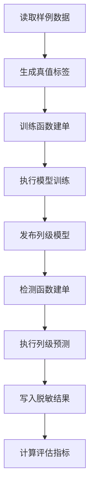

# Raha UDF 容器全链路测试报告

## 1. 测试结论

本次测试完成工程干净构建、交付包校验、容器部署、独立 Spark 集群提交、训练 UDF 建单、模型训练与发布、检测 UDF 建单、预测结果持久化和标注真值评估。最终集群应用退出码为 0，工程 142 项自动化测试全部通过。

样例数据共有 7 行、2 个可检测字段和 14 个可检测单元格。标注真值包含 5 个错误单元格和 9 个正确单元格。模型对 `Kingdom` 字段生成 7 条预测，混淆矩阵为真正例 2、假正例 0、假负例 3、真负例 9，精确率为 1.0，召回率为 0.4，F1 为 0.571428571429，平均精确率为 0.871428571429。

综合结论为“功能链路通过，但当前样例上的召回率需要继续优化”。

## 2. 测试范围

| 范围 | 实测内容 | 结果 |
| --- | --- | --- |
| 工程构建 | Java 8 干净构建、单元测试、集成测试、API 兼容检查、阴影包生成 | 通过 |
| 容器部署 | 将最终 Jar 和样例数据部署到 Spark 客户端容器 | 通过 |
| 集群健康 | Spark 主节点、工作节点、客户端和任务调度 | 通过 |
| 训练入口 | `F_DW_RAHATRAIN` 在工作节点执行并生成异步任务回执 | 通过 |
| 训练流程 | 数据加载、画像、策略、特征、聚类、标签传播、模型训练、模型发布 | 通过 |
| 检测入口 | `F_DW_RAHADETECT` 在工作节点执行并生成异步任务回执 | 通过 |
| 检测流程 | 模型重新加载、列级预测、结果幂等写入、脱敏导出 | 部分成功，符合服务契约 |
| 评估流程 | 使用干净表生成全量真值并计算混淆矩阵和检测指标 | 通过 |
| 安全检查 | 结果不输出原始字段值，仅保留哈希和算法信息 | 通过 |

工程当前提供训练、检测和采样三个 UDF，没有独立评估 UDF。本次评估在检测 UDF 对应任务完成后，调用工程内置 `DetectionEvaluationService` 完成，未伪造不存在的函数入口。

## 3. 测试环境

| 项目 | 实际值 |
| --- | --- |
| 测试时间 | 2026-07-15 |
| Docker 上下文 | `desktop-linux` |
| Compose 项目 | `fmdb_udf_schmatch` |
| Spark 客户端 | `fmdb-spark-client` |
| Spark 主节点 | `fmdb-spark-master` |
| Spark 工作节点 | `fmdb-spark-worker` |
| Spark 版本 | 3.3.1 |
| Scala 版本 | 2.12.15 |
| 容器 Java 版本 | 11.0.16 |
| 构建 Java 版本 | 1.8.0_492 |
| Maven 版本 | 3.9.12 |
| Spark 主地址 | `spark://spark-master:7077` |
| 最终应用编号 | `app-20260715082828-0004` |
| 最终应用耗时 | 69.607 秒 |

`fmdb_udf_schmatch` 是 Compose 项目名，不是单个容器名。实际交付和提交节点为 `fmdb-spark-client`。

## 4. 输入数据核验

| 文件 | 行数 | 字段 |
| --- | ---: | --- |
| `datasets/toy/dirty.csv` | 7 | `ID`、`Lord`、`Kingdom` |
| `datasets/toy/clean.csv` | 7 | `ID`、`Lord`、`Kingdom` |

`ID` 作为稳定行标识，不参与检测。`Lord` 和 `Kingdom` 参与检测。脏表与干净表按 `ID` 对齐后，5 个真实错误全部位于 `Kingdom`，对应第 3、4、5、6、7 行；`Lord` 没有正例。

## 5. 最终交付包

| 项目 | 实际值 |
| --- | --- |
| 宿主机路径 | `target/fmdb-udf-raha-1.0.0-SNAPSHOT-all.jar` |
| 容器路径 | `/opt/spark/work-dir/fmdb-udf-raha-1.0.0-SNAPSHOT-all.jar` |
| 文件大小 | 619504 字节 |
| SHA-256 | `fbebc56b148d44d2bbce9fa8f60a52389601d0a42eb2647cc64d0a37a3b61f02` |

宿主机与容器内校验和完全一致，容器实测使用的就是最终完成 `mvn clean verify` 的交付包。

## 6. 执行流程



训练和检测 UDF 均在工作节点的执行器编号 0 中执行。回执文件记录的关键字段如下：

| 任务 | 任务编号 | 状态 | 执行器 |
| --- | --- | --- | --- |
| 训练 | `raha-toy-train-job` | `ACCEPTED` | `0` |
| 检测 | `raha-toy-detect-job` | `ACCEPTED` | `0` |

这证明测试不是驱动端直接调用 Java 方法，也不是仅在本地模式执行 UDF。

## 7. 训练结果

| 项目 | 实际值 |
| --- | --- |
| 训练任务状态 | 成功 |
| 候选模型数量 | 1 |
| 建模字段 | `Kingdom` |
| 分类器 | `WEIGHTED_RULE` |
| 训练模式 | `fallback_weighted_feature_rule` |
| 模型版本 | `379db3d3775afe7403fbbac799d038946fc337359c4ac8025c4b265321d9323d` |
| 特征字典版本 | `45717ce54b02dabb932d75106c0cc3b9fbe20d0c1d458189189fb4f3aac6b651` |

`Lord` 的 7 个标签全部为负类，训练数据不满足二分类建模条件，因此没有生成该字段模型。这是训练器的边界行为，不是任务异常。

## 8. 检测与评估结果

检测服务状态为 `PARTIAL_SUCCESS`。`Kingdom` 有已发布模型并成功生成 7 条预测；`Lord` 没有可用模型，因此该列按未检出处理并记录 `PARTIAL_DETECTION_FAILURE`。

| 指标 | 数值 |
| --- | ---: |
| 可评估单元格 | 14 |
| 有显式预测分数的单元格 | 7 |
| 真实错误 | 5 |
| 真实正确 | 9 |
| 真正例 | 2 |
| 假正例 | 0 |
| 假负例 | 3 |
| 真负例 | 9 |
| 精确率 | 1.000000000000 |
| 召回率 | 0.400000000000 |
| F1 | 0.571428571429 |
| 平均精确率 | 0.871428571429 |

模型正确检出第 3、4 行的 `Kingdom` 错误，没有误报；第 5、6、7 行错误未达到 0.5 阈值，形成 3 个假负例。当前结果偏向高精确率、低召回率。

## 9. 持久化与安全检查

| 检查项 | 结果 |
| --- | --- |
| 检测结果内存表写入 | 7 行 |
| 脱敏 JSON 导出 | 7 行 |
| 幂等结果计数 | 与预测数一致 |
| 原始字段值 | 未输出 |
| 值哈希 | 已输出 |
| 单元格标识哈希 | 已输出 |
| 模型和字典版本 | 已输出 |
| 策略证据和训练模式 | 已输出 |

最终运行产物位于容器目录：

- `/opt/spark/work-dir/data/raha-validation-20260715-1628/validation-summary.json`
- `/opt/spark/work-dir/data/raha-validation-20260715-1628/udf-requests/`
- `/opt/spark/work-dir/data/raha-validation-20260715-1628/detection-results/`

## 10. 自动化测试结果

| 项目 | 数量 |
| --- | ---: |
| 测试套件 | 50 |
| 测试用例 | 142 |
| 失败 | 0 |
| 错误 | 0 |
| 跳过 | 0 |

`maven-enforcer-plugin` 的 Java、Maven 和依赖基线检查通过，`animal-sniffer-maven-plugin` 的 Java 8 API 检查通过，最终构建结果为成功。

测试日志中的模拟异常堆栈来自预期的失败分支测试，未计入失败或错误；最终测试汇总为 0 失败、0 错误。

## 11. 实测发现与修复

### 11.1 容器定位

最初按单容器名查找 `fmdb_udf_schmatch` 时不存在对应对象。核对后确认该名称是 Compose 项目，实际 Spark 提交节点为 `fmdb-spark-client`。测试流程已按真实容器拓扑修正。

### 11.2 默认文件系统解析

首次集群读取失败：

`Path does not exist: hdfs://hdfs:9000/opt/spark/work-dir/data/raha-toy/dirty.csv`

中文解释：集群把没有协议的绝对路径按 HDFS 路径解析，而样例数据位于所有 Spark 节点共享的本地挂载目录。

验收入口已将本地输入和输出统一转换为 `file:///` URI，同时保留显式 HDFS 等协议路径的兼容能力。

### 11.3 UDF 分布式提交器

原注册逻辑依赖驱动进程静态运行时，执行器进程无法共享该静态对象。注册器已改为将调用方传入的可序列化提交器直接注入三个 UDF，并通过清空驱动静态状态的测试验证不再依赖驱动进程变量。

容器验收入口使用共享文件任务提交器模拟生产异步队列边界，并通过 `spark.range` 强制 UDF 在工作节点运行。训练和检测回执均记录 `executorId=0`。

### 11.4 检测部分成功契约

样例的 `Lord` 字段只有负类，无法训练二分类模型。验收入口已按服务契约接受 `PARTIAL_SUCCESS`，继续持久化其他字段预测并把缺少模型的字段纳入假负例和真负例统计，避免把可用检测结果整体丢弃。

### 11.5 干净构建要求

失败编译后使用增量打包曾生成不可执行的旧字节码。最终流程固定使用 `mvn clean verify` 清理构建目录后再交付，避免复用失败编译残留。

## 12. 复现命令

```powershell
$env:JAVA_HOME='D:\Program Files\java\jdk8u492-b09'
$env:Path="$env:JAVA_HOME\bin;$env:Path"
mvn clean verify
docker cp target\fmdb-udf-raha-1.0.0-SNAPSHOT-all.jar fmdb-spark-client:/opt/spark/work-dir/fmdb-udf-raha-1.0.0-SNAPSHOT-all.jar
docker exec fmdb-spark-client /opt/spark/bin/spark-submit --master spark://spark-master:7077 --deploy-mode client --conf spark.executor.instances=1 --conf spark.executor.cores=1 --conf spark.cores.max=1 --conf spark.ui.showConsoleProgress=false --class com.fiberhome.ml.raha.app.RahaContainerValidationApplication /opt/spark/work-dir/fmdb-udf-raha-1.0.0-SNAPSHOT-all.jar /opt/spark/work-dir/data/raha-toy/dirty.csv /opt/spark/work-dir/data/raha-toy/clean.csv /opt/spark/work-dir/data/raha-validation-20260715-1628
```

## 13. 遗留风险与建议

1. 当前样例只有 7 行，适合功能验收，不代表生产性能和泛化能力。最终应用执行了完整算法链路并耗时约 70 秒，后续应使用中等规模数据进行性能基线测试。
2. 当前模型在样例上的召回率为 0.4。建议增加具有代表性的正负标注，比较逻辑回归和规则模型，并在独立验证集上选择阈值。
3. 全负类字段不会生成模型。生产检测应在任务摘要中明确列出未建模字段，并决定使用规则兜底、跳过还是补充标注。
4. 容器验收使用共享文件模拟异步任务队列，生产部署仍应注入真实 FMDB 任务仓储或可靠消息队列，并实现任务消费、重试和状态回写。
5. 工程当前没有独立评估 UDF。如果平台要求通过 SQL 单独发起评估任务，需要新增正式函数契约、权限、幂等、任务仓储和结果表设计，不能仅把本次验收入口当作生产函数。

## 14. 最终判定

构建、部署、训练 UDF、模型训练、检测 UDF、预测持久化和真值评估链路均已真实运行。交付包、容器包和测试证据可互相校验，功能验收通过。

质量指标方面，精确率达到 1.0，但召回率仅为 0.4，因此本次结论不等同于算法效果达标。上线前应完成更大数据集评测、阈值选择和生产任务队列接入。
