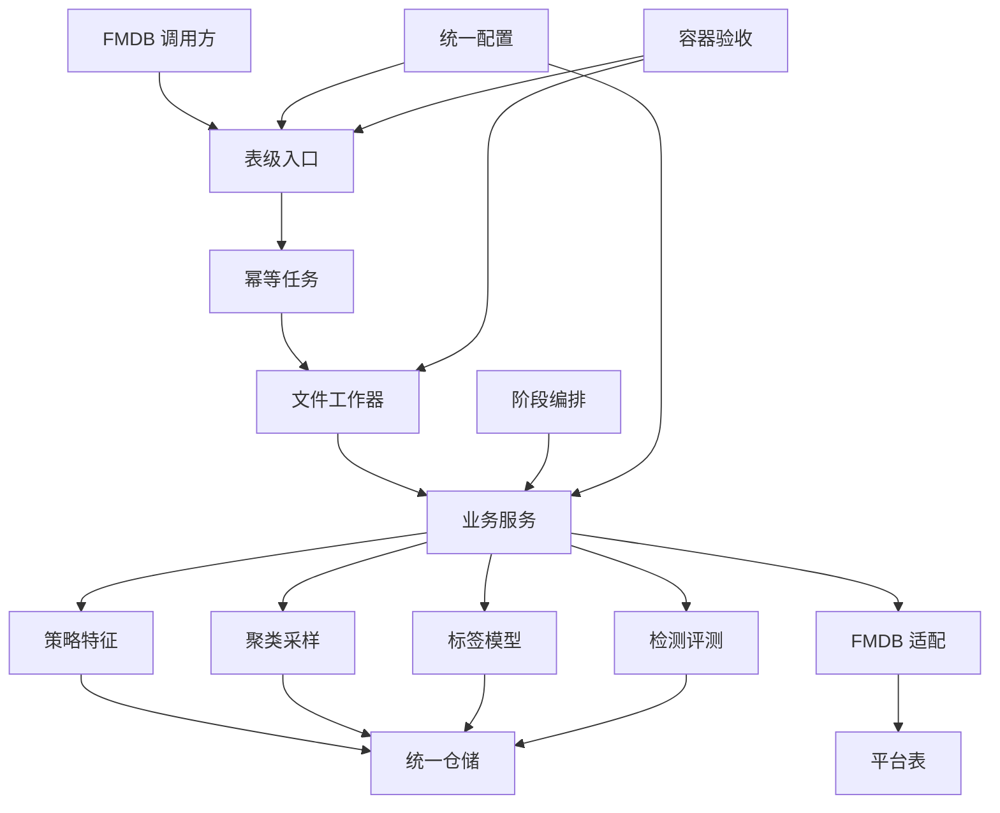
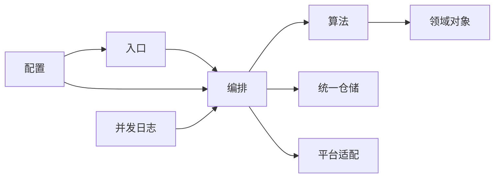
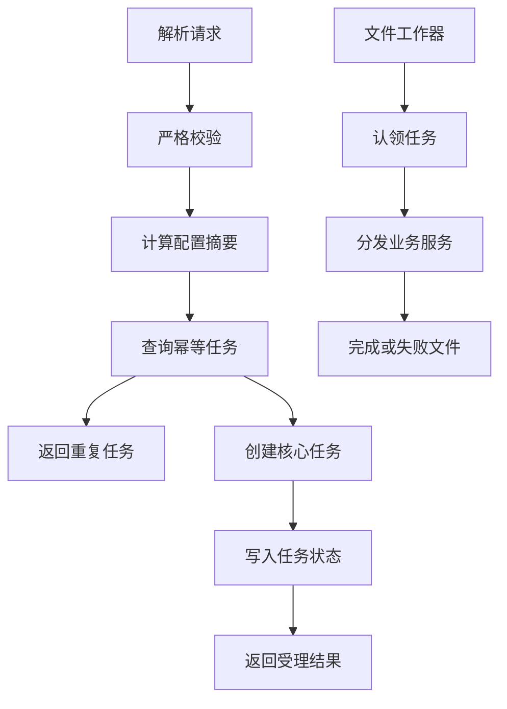
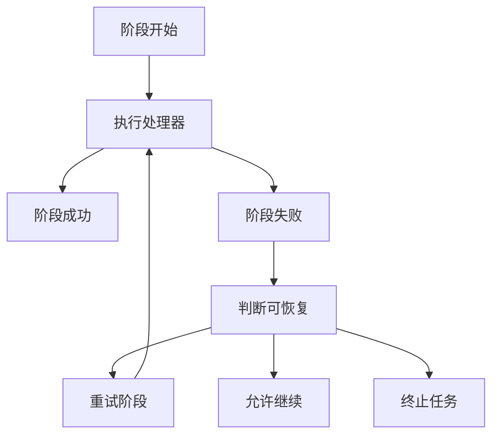
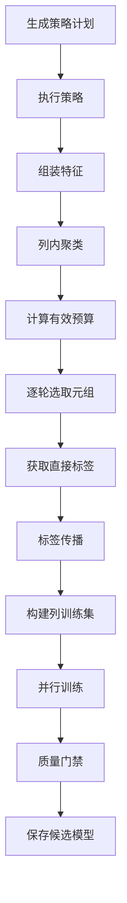
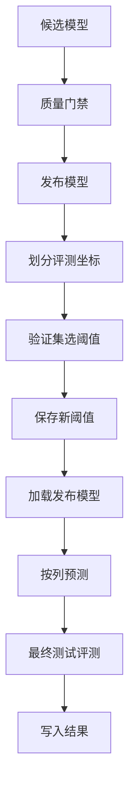

# Raha 工程源码完整分析

## 1. 分析范围与结论

本文分析对象为 `F:/ai-code/fmdb_udf_raha` 当前工作区，重点覆盖 `src/main`、`src/test`、`pom.xml`、`README.md`、默认配置和容器验收入口。

文档首次生成于 2026-07-15 09:43，本次于 2026-07-17 10:09 按提交 `863a2d9` 重新分析。与上一版文档对应的源码快照相比，工程从“包含部分生产治理能力的组件”收缩为“Raha 核心算法、FMDB 适配和集群验证组件”。

当前源码规模如下：

| 项目 | 当前数量 | 上一版数量 | 变化 |
| --- | ---: | ---: | ---: |
| 主代码 Java 文件 | 279 | 324 | -45 |
| 主代码行数 | 23513 | 25735 | -2222 |
| 测试 Java 文件 | 49 | 56 | -7 |
| 测试代码行数 | 7213 | 7975 | -762 |
| 测试方法 | 136 | 154 | -18 |
| 主代码包 | 27 | 32 | -5 |

当前工程的核心能力为：

1. 从 CSV、JSON、Parquet、FMDB 表或只读 SQL 加载数据并生成稳定快照。
2. 生成字段空值、频率、长度、数值分布和字符类型画像。
3. 生成并执行 OD、PVD、RVD 三类弱监督检测策略。
4. 将策略命中与上下文信号组装为版本化稀疏特征。
5. 对单列样本执行精确或可扩展聚类，并按聚类覆盖度逐轮主动采样。
6. 合并直接标签和聚类传播标签，构建列级训练数据。
7. 使用 Spark MLlib 逻辑回归或规则加权模型完成训练与检测。
8. 通过质量门禁管理候选模型，并支持发布、停用和回滚。
9. 使用独立验证坐标选择阈值，使用最终测试坐标计算检测指标。
10. 通过统一仓储契约保存任务、阶段、标签、策略、特征和模型元数据。
11. 通过 FMDB 适配器加载数据、保存模型和写入任务及检测结果。
12. 提供训练、检测、采样三个 Spark SQL 异步表级 UDF。
13. 提供带租约的共享目录工作器和可执行容器黑盒验收入口。

本次最重要的边界变化如下：

- `security`、`audit`、`retention`、`performance`、`production` 五个包已经整体删除。
- 权限、专用审计、自动过期清理、内置压测、容量建议和生产就绪门禁不再由本工程提供。
- 特征和 FMDB 检测结果标准落库链路固定只保留值哈希，`masked_value` 兼容字段固定写空。
- UDF 的 `caller` 只用于追踪和日志，不再参与授权。
- 上述治理责任必须由 FMDB 宿主、上游平台或发布流程承担，当前版本不能直接按生产安全版本交付。

一句话概括：当前工程是具备完整 Raha 学习闭环、FMDB 接入、异步 UDF 和容器验收能力的验证组件，不是自带生产治理的常驻服务。

## 2. 技术基线与交付形态

| 项目 | 当前配置 |
| --- | --- |
| Java | JDK 8，Maven Enforcer 限制为 `[1.8,1.9)` |
| Maven | 3.8 及以上 |
| Spark | 3.3.1 |
| Scala 二进制版本 | 2.12 |
| Spark SQL | `provided` |
| Spark MLlib | `provided` |
| 日志 | SLF4J 1.7.36，`provided` |
| 测试 | JUnit Jupiter 5.10.2 |
| 交付 | 普通 Jar 和 `all` 分类的 Shade Jar |
| 编码 | UTF-8，无 BOM，LF |

Spark SQL、Spark MLlib 和 SLF4J 由 FMDB 运行环境提供，不会打入完整 Jar。构建通过 Animal Sniffer 检查 Java 8 API 兼容性。

工程同时具有三种交付入口：

| 入口 | 主要类 | 定位 |
| --- | --- | --- |
| Spark SQL UDF | `F_DW_RAHATRAIN`、`F_DW_RAHADETECT`、`F_DW_RAHASAMPLE` | 异步校验、幂等建单和结果定位 |
| Java 服务 | `RahaTrainService`、`RahaDetectService`、`RahaSampleService` | 宿主组装后的核心用例入口 |
| 容器验收应用 | `RahaContainerValidationApplication` | Spark 和文件队列全链路黑盒验证 |

容器验收类具有 `main` 方法，但它不是通用生产启动器。工程没有依赖注入容器、长期运行的统一调度器或完整 FMDB 安装脚本。

## 3. 总体架构

架构划分如下：

| 层次 | 包 | 职责 |
| --- | --- | --- |
| 验收应用层 | `app` | 运行本地、工作器和组合模式的黑盒验收 |
| 平台入口层 | `udf` | 注册函数、解析请求、幂等建单和文件任务消费 |
| 用例编排层 | `service`、`job`、`job.stage` | 训练、采样、检测和通用阶段控制 |
| 算法层 | `strategy`、`feature`、`cluster`、`sampling`、`label`、`model`、`detection`、`evaluation` | 完成 Raha 核心闭环 |
| 数据接入层 | `data.loader`、`data.profile`、`fmdb` | 加载文件或平台数据，生成画像并写入产物 |
| 领域层 | `data`、`checkpoint` | 定义数据集、坐标、状态、快照和检查点 |
| 基础设施层 | `repository`、`parallel`、`observability`、`error` | 持久化、并发、日志上下文和统一异常 |
| 公共工具层 | `config`、`util` | 配置、哈希、表单编解码和通用校验 |

## 4. 包结构与职责

当前 27 个主代码包及文件数如下，合计 279 个 Java 文件：

| 包 | 文件数 | 主要职责 |
| --- | ---: | --- |
| `com.fiberhome.ml.raha.app` | 1 | 容器黑盒验收 |
| `com.fiberhome.ml.raha.checkpoint` | 6 | 阶段检查点执行与复用 |
| `com.fiberhome.ml.raha.cluster` | 11 | 精确和可扩展列聚类 |
| `com.fiberhome.ml.raha.config` | 19 | 算法、资源和 UDF 配置 |
| `com.fiberhome.ml.raha.data` | 17 | 核心领域对象与状态 |
| `com.fiberhome.ml.raha.data.loader` | 12 | 文件加载、行标识和快照 |
| `com.fiberhome.ml.raha.data.profile` | 2 | 列画像计算与保存 |
| `com.fiberhome.ml.raha.detection` | 9 | 规则评分、解释和指标 |
| `com.fiberhome.ml.raha.error` | 3 | 统一错误分类与异常 |
| `com.fiberhome.ml.raha.evaluation` | 11 | 真值差异、切分、阈值和评测 |
| `com.fiberhome.ml.raha.feature` | 8 | 特征字典和稀疏特征 |
| `com.fiberhome.ml.raha.fmdb` | 9 | FMDB 加载、模型和结果适配 |
| `com.fiberhome.ml.raha.job` | 13 | 任务状态机和阶段编排 |
| `com.fiberhome.ml.raha.job.stage` | 10 | 十类阶段处理器 |
| `com.fiberhome.ml.raha.label` | 10 | 真值适配和标签传播 |
| `com.fiberhome.ml.raha.model` | 25 | 训练、预测、质量和模型生命周期 |
| `com.fiberhome.ml.raha.observability` | 2 | 日志上下文和敏感日志保护 |
| `com.fiberhome.ml.raha.parallel` | 5 | 受控并发、超时和 Spark 资源管理 |
| `com.fiberhome.ml.raha.repository` | 31 | 统一仓储契约和内存实现 |
| `com.fiberhome.ml.raha.sampling` | 9 | 聚类覆盖采样和标注任务 |
| `com.fiberhome.ml.raha.service` | 19 | 训练、检测、采样和主动学习入口 |
| `com.fiberhome.ml.raha.strategy` | 20 | 策略计划、注册和批量执行 |
| `com.fiberhome.ml.raha.strategy.od` | 3 | 离群检测策略 |
| `com.fiberhome.ml.raha.strategy.pvd` | 4 | 模式违规策略 |
| `com.fiberhome.ml.raha.strategy.rvd` | 1 | 关系违规策略 |
| `com.fiberhome.ml.raha.udf` | 16 | Spark SQL UDF 和文件任务工作器 |
| `com.fiberhome.ml.raha.util` | 3 | 哈希、表单和通用值校验 |

### 4.1 `service`

该包提供完整用例入口，而不是简单的算法工具集合。

| 关键类 | 职责 |
| --- | --- |
| `RahaFeaturePreparationService` | 生成策略计划、批量执行策略并组装特征 |
| `ActiveSamplingOrchestrator` | 按一轮一个元组执行主动采样并累计直接标签 |
| `RahaSampleService` | 复用或生成聚类，创建和完成标注任务 |
| `RahaTrainService` | 编排特征、聚类、传播、并行列训练和候选模型 |
| `RahaDetectService` | 加载已发布模型并按字段检测，汇总部分成功状态 |
| `RahaFeaturePreparationResult` | 保存策略、特征及可选聚类，并支持释放命中对象 |

训练服务可以接收采样阶段已经准备的特征和聚类。未提供聚类时才重新计算；容器验收链路当前会显式复用主动采样聚类。

### 4.2 `job` 与 `job.stage`

`job` 定义 `RahaJob`、`RahaStage`、状态转换、幂等键、失败决策和阶段上下文。`RahaJobOrchestrator` 按顺序执行阶段处理器，并根据可恢复性、失败比例和重试次数决定继续、重试或终止。

`job.stage` 保存数据加载、画像、策略计划、策略执行、特征、聚类、采样、真值标签和检测等十个处理器。`StageType` 还定义传播、训练、评测和最终持久化语义，但当前没有全部对应的阶段处理器；完整学习闭环主要由 `service` 包编排。

### 4.3 `config`

配置包聚合 `StrategyConfig`、`FeatureConfig`、`ModelConfig`、`ClusteringConfig`、`SamplingConfig`、`ResourceConfig`、`FailureToleranceConfig` 和 `UdfConfig`。`RahaConfigLoader` 按内置属性、外部 UTF-8 文件、系统属性的顺序覆盖，并拒绝默认配置未声明的键。

`RahaConfigFactory` 当前只负责算法、资源、失败容忍和 UDF 配置，不再生成安全、保留、性能或生产资源对象。`RahaJobConfig` 已删除结果保留天数，配置指纹也不再包含该字段。

### 4.4 `data`、`data.loader` 与 `data.profile`

`data` 提供不可变 `RahaDataset`、`DatasetSnapshot`、`ColumnMetadata`、`ColumnProfile`、`CellCoordinate`、`CellValue`、`DetectionResult` 及任务、阶段、策略和模型状态枚举。

`data.loader` 使用 `DataLoadRequest` 描述输入，支持 CSV、JSON、Parquet、FMDB 表和 FMDB SQL。`FileRahaDatasetLoader` 处理文件来源；`FmdbDatasetLoader` 处理平台来源。`RowIdValidator` 强制行标识存在、非空且唯一，`SchemaHasher` 和 `SnapshotMetadataFactory` 生成稳定模式及快照标识。

`data.profile` 计算总数、空值、空白、不同值、长度、数值统计、四分位数、字符类型和高频值哈希，为策略计划提供依据。

### 4.5 `strategy`、`strategy.od`、`strategy.pvd` 与 `strategy.rvd`

`StrategyPlanGenerator` 根据画像、字段范围和配置生成确定性计划；`StrategyRegistry` 保存可执行策略；`StrategyExecutionService` 负责并发、超时、失败隔离和批次汇总。

| 策略族 | 当前实现 | 作用 |
| --- | --- | --- |
| OD | 低频值、数值距离、四分位异常 | 发现低频值和数值离群 |
| PVD | 字符集、长度、空值占位、类型格式 | 发现列内模式违规 |
| RVD | 一对多关系冲突 | 发现列间函数依赖冲突 |

RVD 计划不再一次性全部执行。`RvdBatchStrategyExecutor` 默认每 16 个计划形成一个 Spark 子批，各子批共享长表、关联和聚合逻辑；总超时在全部子批之间共享。单个子批失败只影响该子批，剩余子批继续执行；总预算耗尽时剩余计划统一标记超时。数字 16 当前为代码常量，不是外部配置。

### 4.6 `feature`

`FeatureAssembler` 将策略命中和稀有值、关系冲突、空值、空白、混合类型等上下文信号转换为 `SparseFeatureRow`。`FeatureDictionary` 固定特征顺序，`FeatureDictionaryVersioner` 生成稳定版本，常量特征可以删除。

标准组装链路只保留 `valueHash`，`maskedValue` 固定为 `null`。这表示工程不再提供可配置的展示值脱敏策略；领域对象保留该字段仅用于兼容现有结构。

### 4.7 `cluster`、`sampling` 与 `label`

`HierarchicalColumnClusterer` 适合不超过配置样本上限的小样本精确聚类；`ScalableColumnClusterer` 对大样本使用确定性余弦分区。`ColumnClusteringService` 按字段并行执行并保存结果。

`SamplingService` 根据聚类覆盖度生成元组级标注任务。`ActiveSamplingOrchestrator` 将总预算拆成多轮，每轮只选一个元组；它从特征坐标提取候选行，并排除已经存在非传播直接标签的整行。有效预算为请求预算与剩余候选行数的较小值，没有候选行时失败。

`LabelPropagationService` 在同一聚类内传播标签，保留直接标签优先级、冲突聚类和未标注聚类统计。训练样本不可用时，训练服务可回退到仅直接标签的数据集，但单一类别仍会导致该列跳过训练。

### 4.8 `model`

该包完成列级训练数据构建、Spark MLlib 逻辑回归、规则加权降级、模型文件保存、模型兼容检查、预测和生命周期管理。

`ModelQualityGate` 检查评分标准差、预测正例比例和最低 F1。`ModelReleaseManager` 保留候选、发布、停用和回滚，并拒绝发布质量门禁未通过的候选；它已经删除调用方、权限检查和专用审计依赖。

`PublishedColumnModelLoader` 校验数据集、字段、模式哈希、特征字典和策略计划版本。当前 `RahaDetectService` 使用 `ColumnModelPredictor` 的 Java 列表路径；`PartitionedColumnModelPredictor` 已实现但尚未成为默认检测路径。

### 4.9 `detection` 与 `evaluation`

`detection` 提供基础规则评分、权重评分、检测解释、字段诊断和指标对象。模型预测结果保存错误标志、分数、阈值、原因、策略标识及版本信息。

`evaluation` 负责脏数据与干净数据的真值差异、检测指标、阈值候选比较以及评测坐标切分。`EvaluationSplitService` 先排除训练直接标签坐标，再按稳定哈希划分阈值验证集与最终测试集；至少需要两个非训练坐标。极小数据集全部落入同一侧时，会按 `cellId` 稳定顺序移动一个坐标，保证两侧均非空。

### 4.10 `repository` 与 `checkpoint`

`repository` 定义任务、阶段、检查点、画像、策略、特征、标签、聚类、模型和检测结果等仓储接口。所有 `Default...Repository` 仍建立在统一 `RahaRepository` 之上，当前只提供 `InMemoryRahaRepository` 进程内实现。

内存仓储已对单条记录保存和事务回调增加同步控制，但不提供跨进程共享持久化。FMDB 模型表和结果表适配器是另一套平台持久化机制，不等价于统一仓储的 FMDB 实现。

`checkpoint` 提供严格版本匹配、历史成功复用、输入变化重算和失败重试。`StageCheckpointRunner` 尚未接入 `RahaJobOrchestrator`，因此通用任务流水线不会自动跳过历史成功阶段。

### 4.11 `parallel`、`observability` 与 `error`

`BoundedParallelExecutor` 对策略和列任务提供固定并发、超时、异常归档和稳定结果顺序。`SparkResourceManager` 管理广播和缓存资源释放。并行失败会进入任务摘要，允许训练或检测返回部分成功。

`RahaLogContext` 统一保存任务、阶段、数据集和快照上下文，`SensitiveLogGuard` 避免原始值进入日志。`error` 包提供稳定错误码、分类和统一运行时异常。

### 4.12 `fmdb`

`FmdbDatasetLoader` 读取目录表或只读 SQL；SQL 只接受以 `SELECT` 或 `WITH` 开头的语句。`FmdbModelStore` 保存模型参数和特征字典。`SparkSqlFmdbResultWriter` 写入任务及检测结果，并在写入前按业务键过滤已有记录。

`FmdbTableGateway` 仍保留按时间删除的底层原语，但当前主代码没有保留规则或清理服务调用它，因此不能视为已提供自动保留清理。

`InMemoryFmdbTableGateway` 在幂等追加后立即执行本地检查点并释放旧数据集，以截断连续追加造成的 Spark 血缘；这是验收网关优化，不代表生产 `SparkSqlFmdbTableGateway` 具有分布式事务。

### 4.13 `udf`

三个 UDF 接收 URL 表单编码字符串并返回 JSON 文本。`RahaUdfRequestParser` 拒绝未知键、重复键、非法表名、非只读 SQL、任务参数串用和超长请求。

`RepositoryBackedRahaUdfJobSubmitter` 当前只执行请求校验、配置摘要、幂等冲突检查、核心任务保存和 FMDB 任务状态写入，不再执行权限或审计。`RahaUdfRuntime` 保存进程级提交器，`RahaUdfRegistrar` 完成三个函数的注册和失败清理。

`FileRahaUdfJobWorker` 使用 `request`、`running`、`completed`、`failed` 和 `lease` 文件表达状态，通过原子移动认领任务；启动时可恢复租约缺失或过期的运行中任务。它提供单次扫描能力，不是自带守护循环的生产消费者。

### 4.14 `app` 与 `util`

`RahaContainerValidationApplication` 支持组合模式和分离的提交、消费模式，串联 UDF、文件工作器、主动采样、训练、模型发布、阈值选择、检测、评测和策略对齐产物输出。

容器链路会在采样后复用聚类，写出策略对齐文件后删除仓储中的策略命中并释放内存对象，再进入训练。`util` 当前只保留 `HashUtils`、`FormDataCodec` 和 `ValueUtils`；原值保护工具已经删除。

## 5. 主依赖与数据关系

核心依赖方向为入口依赖编排、编排依赖算法与仓储、算法依赖领域对象。算法包不依赖 UDF 或容器应用，便于宿主替换入口和持久化实现。

工程同时存在两类持久化关系：

| 类型 | 组件 | 当前边界 |
| --- | --- | --- |
| 核心统一仓储 | `RahaRepository` 及各领域仓储 | 只有进程内实现，适合测试和单进程验证 |
| FMDB 平台适配 | `FmdbTableGateway`、`FmdbModelStore`、`FmdbResultWriter` | 保存平台任务、模型、字典和检测结果 |

两者没有统一事务。任务仓储保存成功后 FMDB 写入失败，或文件队列状态变化后业务仓储失败，都可能产生跨介质不一致。

## 6. 配置体系

配置优先级从低到高为：

1. 类路径 `raha-defaults.properties`。
2. `RAHA_CONFIG_FILE` 或 `raha.config.file` 指定的 UTF-8 属性文件。
3. JVM 中以 `raha.` 开头的系统属性。

当前默认配置包含 81 个算法、模型、资源、失败容忍和 UDF 键。关键默认值如下：

| 配置项 | 默认值 | 说明 |
| --- | ---: | --- |
| `raha.strategy.families` | `OD,PVD,RVD` | 默认策略族 |
| `raha.strategy.max-count` | `1000` | 最大策略数 |
| `raha.strategy.max-rvd-column-pairs` | `500` | 最大关系列对数 |
| `raha.model.classifier-type` | `LOGISTIC_REGRESSION` | 默认分类器 |
| `raha.model.fallback-enabled` | `false` | 默认禁止规则静默降级 |
| `raha.model.quality-gate.enabled` | `true` | 启用模型质量门禁 |
| `raha.sampling.labeling-budget` | `20` | 主动标注预算 |
| `raha.clustering.max-sample-count` | `500` | 精确聚类样本上限 |
| `raha.resource.max-parallel-strategies` | `4` | 策略并发上限 |
| `raha.resource.max-parallel-columns` | `4` | 字段并发上限 |
| `raha.failure.max-retry-count` | `1` | 阶段最大重试次数 |
| `raha.udf.max-request-length` | `65536` | UDF 请求最大字符数 |

旧外部配置必须删除 `raha.security.*`、`raha.retention.*`、`raha.performance.*` 和 `raha.job.result-retention-days`。配置加载器会把这些旧键视为未知配置并在组装阶段失败。

## 7. 通用任务与 UDF 流程

UDF 返回 `ACCEPTED` 只表示请求通过校验并成功建单，不表示算法已经完成。相同数据集和幂等键若任务类型或规范配置不同，会返回幂等冲突。

文件工作器通过租约和原子移动降低多进程重复消费风险，但共享目录语义仍取决于底层文件系统。宿主需要负责轮询、进程保活、失败告警、任务重放和最终结果查询。

通用 `RahaJobOrchestrator` 的阶段失败处理如下：

## 8. 主动采样与训练闭环

关键语义如下：

- 主动采样按行选择任务，但标签和评测坐标按单元格表达。
- 一行存在任何非传播直接标签时，该整行不会再次进入主动采样候选。
- 请求预算超过剩余候选行时自动收缩；没有候选时直接失败。
- 聚类结果可由采样传给训练复用，通用调用方未提供时训练服务自行计算。
- 容器链路在策略对齐产物写出后释放策略命中，`getHitCount` 仍从摘要返回原始数量，但 `getHits` 不再含已释放对象。
- 每列独立构建训练集和训练模型，缺少特征、缺少标签、标签冲突或单一类别时可以跳过该列。
- 部分列失败或跳过时，训练任务可返回部分成功，而不是强制整表失败。

## 9. 发布、阈值、检测与评测

同一数据集和字段只允许一个当前发布模型。发布新版本时旧版本转为停用；回滚只允许恢复曾发布过的历史版本。权限和专用审计已从模型生命周期中删除。

阈值选择和独立评测切分目前由容器验收入口显式编排，不是 `RahaTrainService` 的通用内建步骤。调用高层训练服务的宿主必须自行决定何时发布、如何准备独立真值以及是否调整阈值。

生产检测只加载已发布且版本兼容的模型。当前列表预测路径会将每列稀疏特征收集到 Driver；大规模数据应接入已存在的分区预测器或提供新的分布式实现。

## 10. 确定性、数据保护与可观测性

### 10.1 确定性

- 模式哈希、快照标识、配置指纹、策略标识、字典版本和模型版本均使用规范化文本及稳定哈希。
- 策略、字段、特征、聚类和并行结果按稳定顺序输出。
- 聚类、采样和训练使用显式随机种子。
- 评测切分使用盐值与单元格标识的稳定哈希，极小集合重平衡也使用稳定顺序。
- 幂等键同时校验任务类型和规范配置，避免同键异义。

### 10.2 数据保护

- 策略命中、稀疏特征和检测结果以值哈希关联，不应记录原始单元格值。
- 标准特征组装和 FMDB 结果写入固定将 `masked_value` 写空。
- 日志保护类用于检查敏感上下文，异常摘要避免回显完整请求。
- 工程已无应用内权限判断、数据集访问隔离、结果读取审计或可配置脱敏展示。
- 实际访问安全必须由 FMDB 账户、表权限、网络隔离、传输安全和宿主鉴权共同保证。

### 10.3 日志与指标

外部文件、Spark 和 FMDB 调用，核心任务开始、关键分支、结束及异常捕获均使用 SLF4J 记录上下文和异常堆栈。任务摘要、策略摘要、聚类指标、传播指标和检测字段诊断可用于问题定位。

工程不再包含阶段资源探针、容量档位和生产门禁，因此这些业务日志不能替代 Spark 指标、FMDB 监控或独立容量测试。

## 11. 2026-07-16 至 2026-07-17 变更分析

### 11.1 删除治理能力

| 删除范围 | 文件数 | 当前影响 |
| --- | ---: | --- |
| `security` | 13 | 无应用内权限、隔离和结果访问保护 |
| `audit` | 8 | 无专用审计事件及 FMDB 审计表写入 |
| `retention` | 3 | 无规则化自动清理 |
| `performance` | 17 | 无内置基准、阶段探针、容量建议 |
| `production` | 3 | 无生产就绪检查 |
| `ValueProtectionUtils` | 1 | 无可配置掩码算法 |

核心算法没有依赖这些包，OD、PVD、RVD、特征、聚类、采样、传播、训练、检测、评测和 UDF 建单仍然保留。代价是当前版本只能用于隔离验证环境，或由宿主完整补齐治理边界。

### 11.2 主动学习与评测修正

- 主动采样预算按剩余未标注候选行收缩，避免小数据集重复选行或预算不可达。
- 容器验收还会预留至少一行用于评测，避免所有行都进入直接标签。
- 评测切分要求至少两个非训练坐标，并在单侧为空时稳定重平衡。

### 11.3 内存与聚类复用

- `RahaFeaturePreparationResult` 新增可选聚类结果及 `withClustering`、`withoutStrategyHits`。
- 容器采样后将聚类传给训练，避免重复聚类。
- 策略对齐产物生成后删除仓储策略命中并释放对象，只保留摘要计数。
- 内存 FMDB 网关追加后截断 Spark 血缘，降低长期验证中的递归重算和内存压力。

### 11.4 RVD 分批执行

- 默认每 16 个 RVD 计划形成一个子批。
- 每个子批单独设置 Spark 作业组，超时可取消当前作业。
- 全部子批共享总超时，失败半径由全部计划缩小到单个子批。
- 子批末端仍使用 `collectAsList`，只是限制瞬时规模，没有彻底消除 Driver 压力。

### 11.5 破坏性兼容变化

以下类型已删除旧治理参数或重载，直接依赖旧接口的宿主需要重新编译和修改装配：

- `RahaJobConfig`
- `RahaConfigFactory`
- `FeatureAssembler`
- `SparkSqlFmdbResultWriter`
- `ModelReleaseManager`
- `RepositoryBackedRahaUdfJobSubmitter`

## 12. 测试覆盖与本次验证

当前 49 个测试类覆盖 136 个测试方法，主要范围如下：

| 范围 | 代表测试 |
| --- | --- |
| 配置和领域对象 | `RahaConfigLoaderTest`、`DomainObjectTest` |
| 文件与 FMDB 加载 | `FileRahaDatasetLoaderIntegrationTest`、`FmdbAdapterIntegrationTest` |
| 画像和策略 | `ColumnProfilerIntegrationTest`、OD、PVD、RVD 集成测试 |
| 特征和聚类 | `FeatureAssemblerIntegrationTest`、两个列聚类测试 |
| 主动采样和传播 | `ActiveSamplingOrchestratorTest`、`SamplingServiceTest`、`LabelPropagationServiceTest` |
| 训练和模型 | `ColumnModelTrainerIntegrationTest`、`ModelLifecycleIntegrationTest` |
| 检测和评测 | `BasicDetectionServiceTest`、评测与阈值测试 |
| 任务和检查点 | `RahaJobOrchestratorTest`、`StageCheckpointRunnerTest` |
| 并行恢复 | `BoundedParallelExecutorTest`、策略并行恢复测试 |
| UDF 和文件工作器 | 三类 UDF、配置和工作器测试 |
| Python 对齐 | `PythonBaselineArtifactTest` |

本次在 JDK 8u492 和 Maven 3.9.12 环境执行 `mvn -q clean test`，Surefire 汇总为 136 项测试全部通过，0 失败、0 错误、0 跳过。测试日志中出现的模拟阶段失败、聚类失败和非法 UDF 请求异常均为故障隔离测试的预期分支。随后执行 `mvn -q -DskipTests verify` 验证编译、打包和 Java 8 API 兼容性。

## 13. 当前实现边界与风险

### 13.1 平台接入

- `RahaRepository` 只有内存实现，生产共享仓储需要宿主补充。
- FMDB 写入的读取、过滤、追加不是集群级原子事务，跨进程强幂等依赖平台约束。
- UDF 只建单，后台工作器只有单次扫描方法，宿主必须提供持续调度和故障告警。
- 核心仓储、FMDB 表和文件队列之间没有统一事务。

### 13.2 算法与规模

- 多个 OD、PVD 和 RVD 实现仍在边界调用 `collectAsList`。
- 默认检测路径仍按 Java 列表预测，宽表和大数据量存在 Driver 内存压力。
- 精确层次聚类只适合小样本，大样本近似聚类需要继续用真实数据验证效果。
- RVD 子批大小硬编码为 16，不能按目标集群动态调整。
- `KBVD` 和 `TFIDF` 只有策略族语义，没有具体策略实现。
- `DECISION_TREE` 和 `GBT` 未接入训练器。

### 13.3 主动学习与评测

- 每轮同步调用标签提供器，尚无标注事务、并发编辑或撤销机制。
- 一行有任意直接标签就排除整行，这是当前固定采样语义，可能降低部分标注场景的候选利用率。
- 稳定重平衡只保证极小评测集两侧非空，不保证类别分层或统计代表性。
- 阈值选择、发布和最终测试仍由容器或宿主显式编排，不是训练服务自动闭环。

### 13.4 治理与运行

- 当前没有权限、专用审计、自动清理、内置容量测试和生产上线门禁。
- `caller` 不代表已认证身份，不能作为安全边界。
- 结果表会持续增长，验证环境需要外部清表、重建或生命周期策略。
- 旧治理配置会导致未知键错误，升级时必须同步更新外部配置。
- 当前业务日志与测试通过不等于完成真实 FMDB 集群的长期稳定性和灾难恢复验收。

## 14. 关键类调用关系摘要

| 入口类 | 主要依赖 | 输出或副作用 |
| --- | --- | --- |
| `RahaContainerValidationApplication` | Spark、UDF、工作器、三类服务、评测组件 | 验收摘要和对齐产物 |
| `RahaUdfRegistrar` | Spark 会话、运行时提交器、UDF 配置 | 注册三个函数 |
| `RepositoryBackedRahaUdfJobSubmitter` | 任务仓储、FMDB 结果写入器、标识生成器 | 幂等任务和提交响应 |
| `FileRahaUdfJobWorker` | 共享目录、任务分发器、时钟 | 完成或失败任务文件 |
| `RahaJobOrchestrator` | 任务仓储、阶段仓储、处理器、失败决策器 | 通用任务状态与阶段结果 |
| `RahaFeaturePreparationService` | 策略计划、执行和特征服务 | 可复用策略特征产物 |
| `ActiveSamplingOrchestrator` | 采样服务、标签提供器 | 多轮任务、顺序和直接标签 |
| `RahaTrainService` | 特征、聚类、传播、训练、模型发布管理 | 候选模型和训练摘要 |
| `RahaDetectService` | 已发布模型加载器、预测器、结果仓储 | 单元格检测结果和字段诊断 |
| `RvdBatchStrategyExecutor` | Spark 数据集、RVD 计划 | 分批策略摘要和命中 |
| `ModelReleaseManager` | 模型元数据仓储、时钟 | 候选、发布、停用和回滚状态 |
| `EvaluationSplitService` | 全量真值、直接标签坐标、盐值 | 验证集和最终测试集 |
| `ThresholdComparisonService` | 分数、真值、阈值候选、模型仓储 | 更新阈值后的模型元数据 |
| `SparkSqlFmdbResultWriter` | FMDB 网关、模式解析器 | 任务和检测结果表记录 |
| `InMemoryRahaRepository` | 统一记录存储和事务回调 | 版本化进程内数据 |

## 15. 总结

当前工程仍然具备完整的 Raha 工程化闭环：文件和 FMDB 数据加载、字段画像、OD/PVD/RVD 策略、版本化稀疏特征、可扩展聚类、逐轮主动采样、标签传播、列级训练、模型质量门禁、阈值验证、模型生命周期、生产检测、真值评测、任务状态机、检查点、表级 UDF、文件任务消费和容器黑盒验收。

本轮变化不是简单删代码，而是明确改变了产品边界。五个治理包和相关配置、构造器、测试已退出，工程不再宣称自身提供权限、专用审计、自动清理、容量建议和上线门禁。与此同时，主动采样预算、极小评测切分、采样聚类复用、策略命中释放、RVD 子批和内存 FMDB 血缘都得到修正或优化。

后续最优先的工作应是：为统一仓储提供共享持久化实现，将分区预测器接入默认检测链路，减少策略边界的 Driver 收集，建立文件队列与平台表的一致性恢复机制，并由宿主平台补齐鉴权、审计、生命周期、容量测试和发布门禁。
