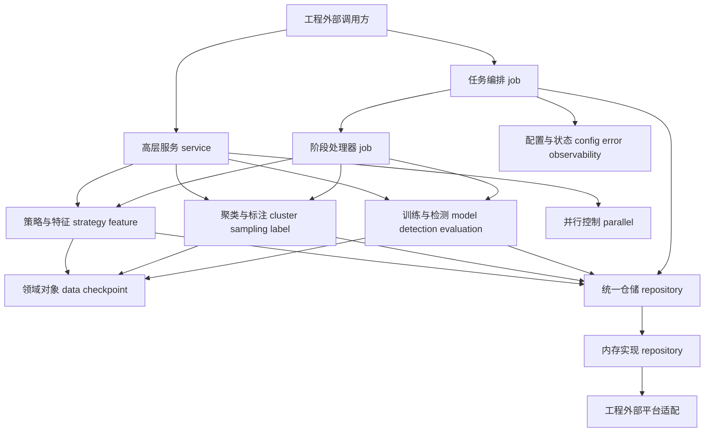
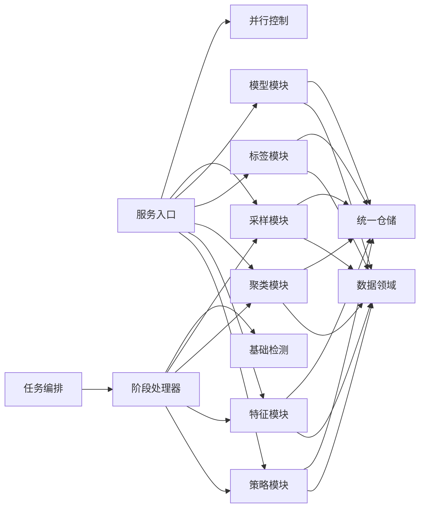
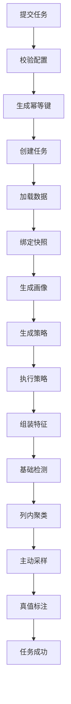
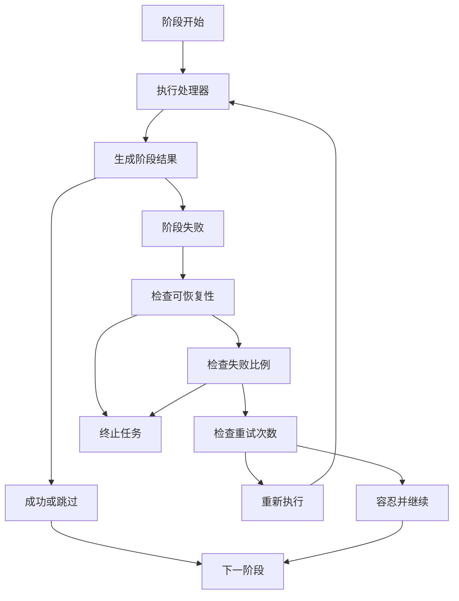
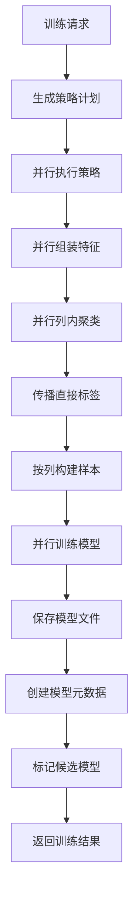
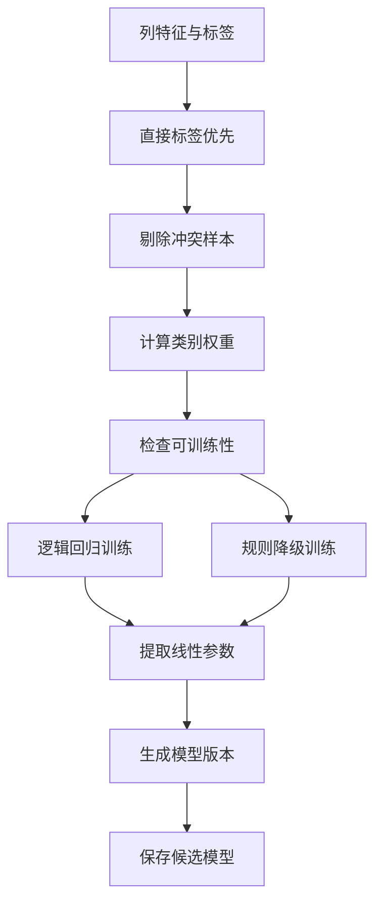
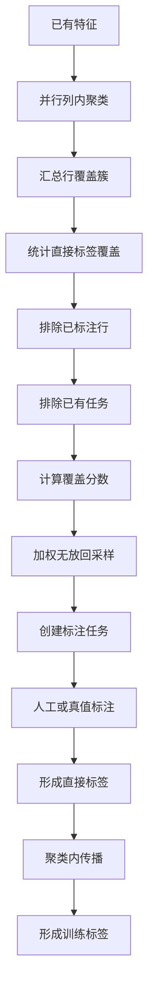
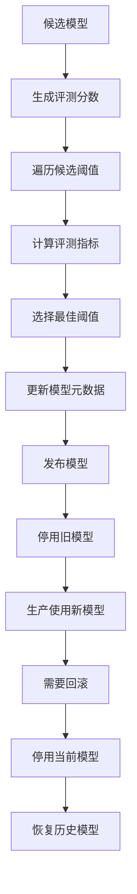
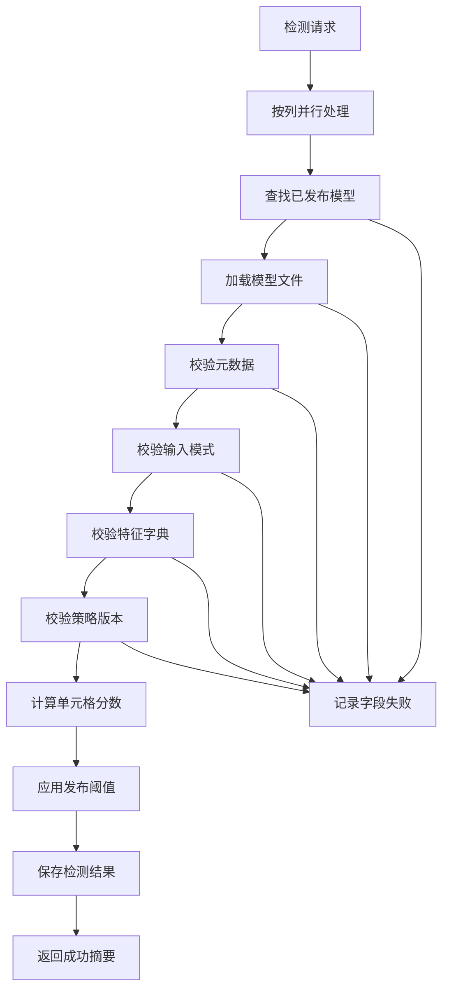
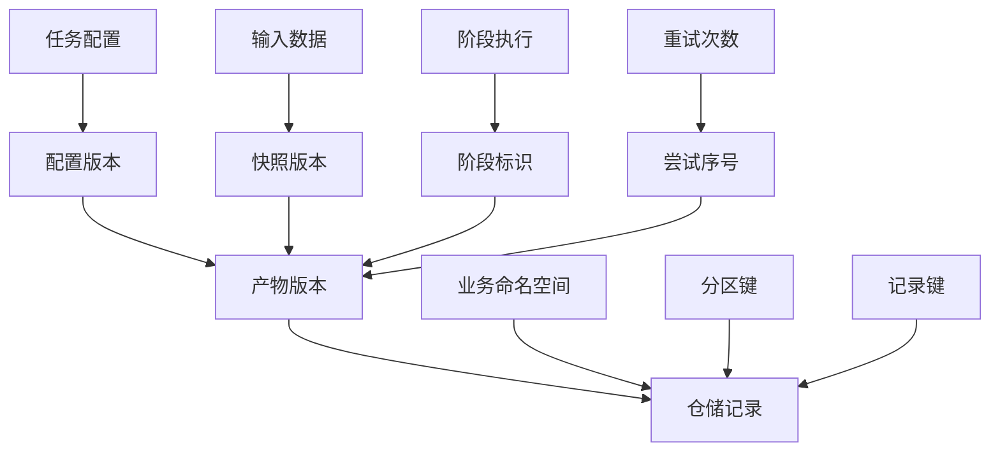

# Raha 工程源码完整分析

## 1. 分析范围与结论

本文分析对象为 `F:/ai-code/fmdb_udf_raha/src`，同时参考 `pom.xml`、测试代码和资源基线文件。

分析快照时间为 2026-07-15 09:43，快照规模如下：

| 项目 | 数量 |
| --- | ---: |
| 主代码 Java 文件 | 235 |
| 主代码行数 | 17440 |
| 测试 Java 文件 | 39 |
| 测试代码行数 | 5508 |
| 主代码包数量 | 23 |

工程本质上不是一个带 `main` 方法的独立应用，也不是已经完成 FMDB 注册入口的 Spark SQL UDF。它是一个面向 FMDB 和 Spark 的 Raha 单元格级数据错误检测算法组件库，提供以下核心能力：

1. 从 CSV、JSON、Parquet 加载数据并建立稳定快照。
2. 对每个字段生成空值、频率、长度、数值分布和字符类型画像。
3. 根据画像生成离群、模式违规和关系违规策略。
4. 使用 Spark 执行策略，得到单元格级候选命中。
5. 将策略命中和上下文信号转换为版本化稀疏特征。
6. 对单列特征执行层次聚类，按聚类覆盖度生成主动标注任务。
7. 将直接标签在同一聚类中传播，构造列级训练样本。
8. 使用 Spark MLlib 逻辑回归或规则加权降级模型进行训练。
9. 管理模型候选、阈值评测、发布、停用和回滚。
10. 使用已发布且版本兼容的列级模型执行生产检测。
11. 使用真值表计算精确率、召回率、F1 和平均精确率。
12. 通过统一仓储接口保存任务、阶段、中间产物、标签、模型和检测结果。

一句话概括：该工程实现了从数据画像、弱监督策略、主动采样、标签传播、列级模型训练到模型发布和生产检测的 Raha 学习闭环。

## 2. 技术基线与交付形态

| 项目 | 当前配置 |
| --- | --- |
| Java | JDK 8 |
| Maven | 3.8 及以上 |
| Spark | 3.3.1 |
| Scala 二进制版本 | 2.12 |
| Spark SQL | `provided` |
| Spark MLlib | `provided` |
| 日志 | SLF4J 1.7.36，`provided` |
| 测试 | JUnit Jupiter 5.10.2 |
| 交付 | 普通 Jar 和 `all` 分类的 Shade Jar |

Spark 和 SLF4J 由 FMDB 运行环境提供，Shade Jar 主要收拢工程自身和非平台依赖。构建通过 Maven Enforcer 强制 JDK 8，并通过 Animal Sniffer 限制 Java 8 API。

工程没有启动类、依赖注入容器或统一工厂。调用方需要自行组装 Spark 会话、仓储、算法服务和高层服务。这符合“嵌入 FMDB 作业或 UDF 适配层”的定位，但当前 `src` 内还没有真正的 FMDB 注册适配器。

## 3. 总体架构



图中英文名称均为根包 `com.fiberhome.ml.raha` 下的相对包名；“工程外部调用方”和“工程外部平台适配”不属于当前源码包。

架构可以划分为六层：

| 层次 | 包 | 职责 |
| --- | --- | --- |
| 用例入口层 | `service`、`job` | 提供训练、采样、检测用例和通用阶段编排 |
| 算法层 | `strategy`、`feature`、`cluster`、`sampling`、`label`、`model`、`detection`、`evaluation` | 完成 Raha 核心算法闭环 |
| 数据接入层 | `data.loader`、`data.profile` | 读取 Spark 数据并生成画像 |
| 领域层 | `data`、`checkpoint` | 定义数据集、坐标、状态、快照和检查点 |
| 基础设施层 | `repository`、`parallel`、`observability`、`error` | 提供持久化、并发、日志上下文和统一异常 |
| 公共工具层 | `util`、`config` | 提供配置、哈希、校验和敏感值保护 |

## 4. 每个包的具体职责

### 4.1 `com.fiberhome.ml.raha.service`

对外用例服务层，封装调用方最关心的训练、采样、检测三个业务动作，并返回统一的任务状态、结果位置、统计摘要和错误信息。

关键类：

| 类 | 职责 |
| --- | --- |
| `RahaTrainService` | 编排策略、特征、聚类、传播和列级训练，输出候选模型 |
| `RahaSampleService` | 对已有特征重新聚类并生成待标注任务 |
| `RahaDetectService` | 按字段加载已发布模型并生成生产检测结果 |
| `RahaTrainRequest` | 训练所需数据集、直接标签、配置、传播和训练参数 |
| `RahaSampleRequest` | 采样所需特征、标签、聚类配置、预算和资源配置 |
| `RahaDetectRequest` | 检测所需数据集、特征、策略计划版本和资源配置 |
| `RahaTaskResult` | 统一包装成功、部分成功、失败及结果位置 |

关系说明：

- 训练服务依赖 `strategy`、`feature`、`cluster`、`label`、`model`、`parallel`。
- 采样服务依赖 `cluster` 和 `sampling`。
- 检测服务依赖 `model` 和 `repository`。
- 这些服务不负责原始文件加载和列画像，调用前必须准备好相应输入。

### 4.2 `com.fiberhome.ml.raha.job`

通用任务和阶段编排层，解决幂等提交、状态转换、阶段顺序、重试、失败容忍、快照绑定和阶段属性传递。

关键类：

| 类 | 职责 |
| --- | --- |
| `RahaJobOrchestrator` | 创建幂等任务并顺序执行阶段处理器 |
| `RahaJob` | 维护任务状态机和失败上下文 |
| `RahaStage` | 维护单次阶段尝试状态机 |
| `StageHandler` | 阶段扩展接口 |
| `StageExecutionContext` | 传递任务、配置、阶段和共享属性 |
| `StageFailureDecider` | 根据可恢复性、失败比例和重试次数决策 |
| `StageAttributeKeys` | 约定阶段间共享数据的键 |
| 各类 `StageHandler` | 将加载、画像、策略、特征、检测、聚类、采样和真值标注接入编排器 |

当前已有处理器覆盖：加载、画像、策略计划、策略执行、特征、基础检测、聚类、采样、真值标注。

`StageType` 中虽然定义了传播、训练、评测和最终持久化，但当前没有对应处理器。完整学习闭环主要由 `service` 包实现，而不是全部通过 `RahaJobOrchestrator` 实现。

### 4.3 `com.fiberhome.ml.raha.config`

集中定义任务配置、算法参数、资源限制、失败容忍和稳定配置版本。

关键类：

| 类 | 职责 |
| --- | --- |
| `RahaJobConfig` | 聚合完整任务配置 |
| `RahaConfigValidator` | 校验必填项、范围和冲突 |
| `ConfigVersioner` | 对规范化配置生成稳定版本 |
| `StrategyConfig` | 控制策略族、字段、策略类型、数量、优先级和超时 |
| `FeatureConfig` | 控制上下文特征、归一化和特征上限 |
| `ModelConfig` | 控制分类器、阈值、降级、策略族权重和上下文权重 |
| `ClusteringConfig` | 控制余弦距离、目标簇数和精确聚类样本上限 |
| `SamplingConfig` | 控制标注预算、聚类采样、复核和任务有效期 |
| `ResourceConfig` | 控制策略并发、列并发、广播、缓存和阶段超时 |
| `FailureToleranceConfig` | 控制失败比例、快速失败和最大重试次数 |

配置通过规范化字符串和 SHA-256 形成稳定版本，参与任务幂等和所有产物版本。

### 4.4 `com.fiberhome.ml.raha.data`

核心领域对象和枚举，负责表达数据集、单元格、画像、检测结果及状态语义。

关键类：

| 类 | 职责 |
| --- | --- |
| `RahaDataset` | 保存逻辑数据集、快照、字段、Spark 数据集、模式哈希和画像 |
| `DatasetSnapshot` | 保存输入来源、规模、模式和版本信息 |
| `ColumnMetadata` | 标识字段顺序、类型、可检测性和敏感性 |
| `ColumnProfile` | 保存列级统计画像 |
| `CellCoordinate` | 使用数据集、快照、行标识和字段定位单元格 |
| `CellValue` | 表达受保护的单元格值信息 |
| `DetectionResult` | 保存检测判断、分数、原因、模型和字典版本 |
| 各状态枚举 | 约束任务、阶段、策略、模型和标签语义 |

`RahaDataset` 采用不可变设计，通过 `withDataFrame` 和 `withProfiles` 返回新对象，避免阶段之间修改输入对象。

### 4.5 `com.fiberhome.ml.raha.data.loader`

数据接入包，使用 Spark 文件数据源读取 CSV、JSON、Parquet，并建立稳定快照。

关键类：

| 类 | 职责 |
| --- | --- |
| `FileRahaDatasetLoader` | 读取外部文件并转换为 `RahaDataset` |
| `DataLoadRequest` | 描述文件、格式、字段范围、敏感字段和快照信息 |
| `RowIdValidator` | 校验行标识字段存在、非空且唯一 |
| `SchemaHasher` | 对字段顺序、名称、类型和可空性生成模式哈希 |
| `ColumnMetadataFactory` | 根据 Spark 模式生成字段元数据 |
| `SnapshotMetadataFactory` | 生成调用方指定或确定性派生的快照标识 |
| `DataValidationException` | 将文件和数据校验错误转换为稳定错误码 |

外部文件读取失败会记录上下文和异常堆栈，并转换为 `DATA_LOAD_FAILED`。

### 4.6 `com.fiberhome.ml.raha.data.profile`

列画像计算和持久化包。

`ColumnProfiler` 使用 Spark 聚合生成：总数、空值、空白、不同值、长度、数值数量、均值、标准差、四分位数、字符类型计数和高频值哈希。

`ColumnProfileService` 调用画像器，保存结果，并返回绑定画像的新 `RahaDataset`。

画像是策略计划生成的主要依据。

### 4.7 `com.fiberhome.ml.raha.strategy`

策略计划、策略注册、单策略执行、批量执行和命中结果的核心包。

关键类：

| 类 | 职责 |
| --- | --- |
| `StrategyPlanGenerator` | 根据画像和配置生成确定性策略计划 |
| `StrategyPlanService` | 生成并保存策略计划 |
| `StrategyRegistry` | 将策略类型映射到算法实现 |
| `DetectionStrategy` | 策略算法扩展接口 |
| `StrategyExecutor` | 执行单策略，隔离超时和异常，管理 Spark 作业组 |
| `StrategyExecutionService` | 批量并行执行、保存结果并支持失败策略恢复 |
| `StrategyPlan` | 保存策略标识、目标字段、配置和优先级 |
| `StrategyHit` | 保存单元格坐标、值哈希、原因和策略分数 |
| `SparkStrategySupport` | 提供 Spark 字段引用、值哈希、参数读取和候选构造 |

策略计划按优先级和稳定标识排序，超出上限时截断。策略标识和配置哈希保证相同输入产生相同计划。

### 4.8 `com.fiberhome.ml.raha.strategy.od`

离群点检测策略包。

| 策略类 | 算法语义 |
| --- | --- |
| `LowFrequencyStrategy` | 按值哈希频率识别低频值 |
| `NumericDistanceStrategy` | 使用均值和总体标准差计算标准距离 |
| `QuantileOutlierStrategy` | 使用四分位距边界识别长尾数值 |

这些策略不保存原始值，只使用哈希、统计量和安全原因摘要。

### 4.9 `com.fiberhome.ml.raha.strategy.pvd`

模式违规检测策略包。

| 策略类 | 算法语义 |
| --- | --- |
| `CharacterSetStrategy` | 识别数字、拉丁字母、中文、空格和符号组成的少数模式 |
| `LengthAnomalyStrategy` | 使用长度四分位距和少数长度分布识别异常 |
| `NullPlaceholderStrategy` | 区分空值、空白值和特殊占位值 |
| `TypeFormatStrategy` | 识别少数值类型及日期、时间、电话、邮箱、编号格式异常 |

格式自动推断依赖字段名称，只有匹配比例达到阈值时才应用，减少字段名误导造成的整列误报。

### 4.10 `com.fiberhome.ml.raha.strategy.rvd`

关系违规检测策略包。

`OneToManyConflictStrategy` 检测同一个左值映射到多个右值的依赖冲突，同时在左右两个字段生成候选命中。

策略计划按有方向列对生成，并受最大列对数量限制。空值和空白值不参与关系冲突检测。

### 4.11 `com.fiberhome.ml.raha.feature`

将策略命中和单元格上下文转换为列级版本化稀疏特征。

关键类：

| 类 | 职责 |
| --- | --- |
| `FeatureAssembler` | 组装策略特征、统计特征和值上下文特征 |
| `FeatureService` | 串行或按列并行组装并持久化特征 |
| `FeatureDictionary` | 保存稳定特征编号和定义 |
| `SparseFeatureRow` | 保存单元格坐标、值哈希、脱敏值和非零特征 |
| `FeatureDictionaryVersioner` | 根据定义和配置生成字典版本 |

主要特征包括：

- 单个策略命中。
- 各策略族命中数量。
- 最大策略分数。
- 值长度、空值、空白、数字、字母、中文和符号。
- 值类型。
- 值频率、频率比例和低频桶。
- 关系冲突数量。

可配置删除常量特征，并限制每列最大特征数量。敏感字段只保留掩码，不写入原始值。

### 4.12 `com.fiberhome.ml.raha.detection`

不经过训练模型的基础规则检测和结果解释包。

关键类：

| 类 | 职责 |
| --- | --- |
| `BasicDetectionService` | 使用加权规则生成检测结果并持久化 |
| `WeightedRuleScoringRule` | 融合策略族可靠度、策略分数和上下文信号 |
| `DetectionExplanationService` | 反查策略计划、命中原因和特征摘要 |
| `DetectionBatchResult` | 汇总检测结果和指标 |

规则评分使用噪声或组合多个策略信号，再融合受限上下文信号。该能力用于通用阶段流水线和无训练模型场景，与 `service.RahaDetectService` 的已发布模型检测是两种不同路径。

### 4.13 `com.fiberhome.ml.raha.cluster`

列内聚类包，为主动采样和标签传播提供簇结构。

关键类：

| 类 | 职责 |
| --- | --- |
| `HierarchicalColumnClusterer` | 使用平均连接和余弦距离执行精确层次聚类 |
| `ColumnClusteringService` | 按列隔离执行，支持串行和受限并行模式 |
| `ClusterAssignment` | 保存单元格到簇的映射和到质心距离 |
| `ClusterVersioner` | 根据字典、算法、配置、种子和成员生成版本 |

实现会将单列特征放入内存执行精确层次聚类。默认每列最多 500 个样本，超限返回可解释状态而不是继续计算。当前实现适合小表或抽样数据，不适合直接处理超大列。

### 4.14 `com.fiberhome.ml.raha.sampling`

主动采样和标注任务生命周期包。

关键类：

| 类 | 职责 |
| --- | --- |
| `ClusterCoverageScorer` | 对低标注覆盖簇赋予更高采样贡献 |
| `TupleSampler` | 使用固定随机种子执行加权无放回采样 |
| `SamplingService` | 排除已标注和已采样行，生成预算内任务 |
| `AnnotationTask` | 维护待标注、完成、过期和取消状态 |
| `SamplingVersioner` | 生成可复现采样版本 |

采样单位是整行元组，不是单个单元格。一行可以同时覆盖多个字段的低标注簇，因此优先级更高。

### 4.15 `com.fiberhome.ml.raha.label`

直接标签、真值自动标注和聚类内标签传播包。

关键类：

| 类 | 职责 |
| --- | --- |
| `CellLabel` | 保存零一标签、来源、权重和传播溯源 |
| `GroundTruthLabelAdapter` | 在评测模式下用真值表完成采样任务 |
| `LabelPropagationService` | 在同字段、同聚类版本内传播直接标签 |
| `LabelPropagationConfig` | 控制传播权重和多数比例 |

传播支持两种语义：

- 同质传播，簇内直接标签必须一致。
- 多数传播，多数比例必须达到配置阈值。

直接标签永远优先，不会被传播标签覆盖。冲突簇、无标签簇和无多数簇都会生成摘要，不会静默传播。

### 4.16 `com.fiberhome.ml.raha.model`

列级训练数据、训练器、可移植模型、模型文件、预测和发布生命周期包。

关键类：

| 类 | 职责 |
| --- | --- |
| `ColumnTrainingDataBuilder` | 按字段关联特征和标签，处理冲突及类别平衡 |
| `AdaptiveColumnModelTrainer` | 在 MLlib 和规则降级训练器之间选择 |
| `SparkMllibLogisticRegressionTrainer` | 训练逻辑回归并提取系数和截距 |
| `WeightedRuleFallbackTrainer` | 根据正负样本特征均值差生成线性模型 |
| `ColumnModelArtifact` | 保存不依赖 MLlib 对象的可移植线性参数 |
| `FileColumnModelStore` | 将参数保存为 UTF-8 属性文件 |
| `ColumnModelPredictor` | 在 Driver 侧对稀疏特征列表预测 |
| `PartitionedColumnModelPredictor` | 在 Spark 分区中对向量数据集预测 |
| `ColumnModelCompatibilityValidator` | 校验模式、字典、策略计划和元数据一致性 |
| `PublishedColumnModelLoader` | 只加载唯一已发布且兼容的模型 |
| `ModelReleaseManager` | 管理候选、发布、停用和回滚 |
| `RahaColumnModel` | 保存模型元数据和生命周期状态 |

训练数据构建规则：

1. 直接标签优先于传播标签。
2. 同一单元格直接标签冲突时剔除该样本。
3. 没有标签、只有单一类别或没有特征时不训练。
4. 可对少数类别增加类别平衡权重。

`ColumnModelArtifact` 统一使用线性系数、截距和逻辑函数进行预测，因此 MLlib 训练完成后不需要保留 `LogisticRegressionModel` 对象。

### 4.17 `com.fiberhome.ml.raha.evaluation`

真值构造、检测指标和阈值选择包。

关键类：

| 类 | 职责 |
| --- | --- |
| `GroundTruthDifferenceService` | 全外连接脏表和真值表，生成全量单元格标签 |
| `DetectionEvaluationService` | 计算混淆矩阵、精确率、召回率、F1 和平均精确率 |
| `ThresholdComparisonService` | 比较候选阈值并更新模型元数据 |

阈值选择顺序是 F1、精确率、召回率、较低阈值。选定阈值写入模型元数据，发布加载时覆盖参数文件中的初始阈值。

### 4.18 `com.fiberhome.ml.raha.repository`

统一仓储契约和各业务仓储适配器，是工程中间产物版本化、幂等和事务语义的核心。

关键类：

| 类 | 职责 |
| --- | --- |
| `RahaRepository` | 定义保存、按键读取、分区查询和事务执行 |
| `InMemoryRahaRepository` | 开发测试内存实现，支持事务失败回滚 |
| `RepositoryKey` | 使用命名空间、分区键和记录键组成主键 |
| `RepositoryRecord` | 保存业务对象、产物版本和更新时间 |
| `ArtifactVersion` | 保存配置版本、快照、阶段和尝试序号 |
| `RepositoryNamespace` | 隔离任务、阶段、策略、特征、聚类、标签、模型和检测结果 |
| 各 `Default...Repository` | 将领域对象映射到统一仓储键和事务 |

当前仓储实现只包含内存版本，没有数据库、FMDB、对象存储或分布式事务实现。所有默认业务仓储都建立在 `RahaRepository` 之上，后续可以通过实现同一接口切换平台存储。

### 4.19 `com.fiberhome.ml.raha.checkpoint`

定义阶段级检查点状态、执行任务、重试、复用和审计信息。

| 类 | 职责 |
| --- | --- |
| `StageCheckpoint` | 保存阶段尝试的输入版本、指纹、状态、输出、错误和时间 |
| `StageCheckpointRunner` | 执行检查点任务，记录每次尝试并复用一致输入的成功结果 |
| `CheckpointTask` | 定义可检查点化的业务任务 |
| `CheckpointTaskResult` | 表达单次尝试的成功、失败和可恢复性 |
| `CheckpointRunResult` | 汇总新执行、历史复用或最终失败结果 |
| `DefaultStageCheckpointRepository` | 保存尝试并查找可复用成功检查点 |

检查点能力已经可以被业务代码独立调用，并有重试、严格版本复用、输入变化重算和异常审计测试。当前 `RahaJobOrchestrator` 尚未组合 `StageCheckpointRunner`，因此通用阶段流水线还不会自动跳过历史成功阶段。

### 4.20 `com.fiberhome.ml.raha.parallel`

提供受限并行执行和 Spark 资源控制。

关键类：

| 类 | 职责 |
| --- | --- |
| `BoundedParallelExecutor` | 固定线程数执行工作项，应用批次超时并隔离单项失败 |
| `ParallelWorkItem` | 使用稳定业务键包装调用 |
| `ParallelBatchResult` | 保存有序成功结果、失败摘要和并发峰值 |
| `SparkResourceManager` | 按阈值控制广播变量和 Spark 数据集缓存 |

并行执行已接入高层训练、采样和检测服务，以及策略、特征、聚类服务的并行方法。通用阶段处理器仍调用这些服务的串行兼容方法。

`SparkResourceManager` 当前没有被其他类调用，属于已实现但未接入的资源控制工具。

### 4.21 `com.fiberhome.ml.raha.observability`

提供稳定日志上下文和敏感值泄漏防护。

- `RahaLogContext` 将任务、阶段、尝试和快照组合为日志上下文。
- `SensitiveLogGuard` 检查日志文本中是否包含完整敏感值。

业务服务普遍在开始、结束、外部文件或模型访问、异常捕获处记录日志。

### 4.22 `com.fiberhome.ml.raha.error`

定义统一错误分类、错误码和可恢复性。

`RahaException` 携带 `RahaErrorCode` 和是否可恢复。当前部分核心模块已使用统一异常，部分模块仍使用 `IllegalArgumentException` 和 `IllegalStateException`，错误模型尚未完全统一。

### 4.23 `com.fiberhome.ml.raha.util`

提供跨包基础工具。

| 类 | 职责 |
| --- | --- |
| `HashUtils` | 生成 SHA-256 十六进制哈希 |
| `ValueProtectionUtils` | 对值进行稳定哈希和脱敏掩码 |
| `ValueUtils` | 校验非空字符串 |

## 5. 包之间的关系

### 5.1 主依赖方向



### 5.2 两套编排方式

工程同时存在两套编排方式，它们复用同一批算法服务：

| 方式 | 入口 | 特点 | 适用场景 |
| --- | --- | --- | --- |
| 通用阶段编排 | `RahaJobOrchestrator` | 幂等、状态机、重试、阶段属性 | 平台作业、评测流水线、逐阶段审计 |
| 高层用例编排 | 三个 `Raha...Service` | 直接形成训练、采样、检测结果 | API、服务封装、算法闭环 |

高层训练服务已经使用资源配置控制并行度。通用阶段处理器为了兼容既有行为，目前仍主要使用串行方法。

## 6. 通用任务阶段完整流程

集成测试给出的最完整阶段顺序如下：



阶段间通过 `StageExecutionContext.attributes` 传递：

| 键 | 数据 |
| --- | --- |
| `RAHA_DATASET` | 已加载或已画像数据集 |
| `DATASET_SNAPSHOT` | 输入快照 |
| `STRATEGY_PLANS` | 策略计划 |
| `STRATEGY_BATCH_RESULT` | 策略批次结果 |
| `STRATEGY_HITS` | 策略命中 |
| `FEATURE_ASSEMBLY_RESULT` | 特征字典和稀疏特征 |
| `DETECTION_BATCH_RESULT` | 基础检测结果 |
| `CLUSTERING_BATCH_RESULT` | 聚类结果 |
| `SAMPLING_BATCH_RESULT` | 采样结果 |
| `ANNOTATION_TASKS` | 待标注或已完成任务 |
| `CELL_LABELS` | 直接标签 |

### 6.1 失败、重试和继续流程



不可恢复失败、快速失败开启、失败比例超限时直接终止。可恢复失败在重试次数内重试，超过次数后可按配置继续。

## 7. 训练闭环完整流程

训练服务的输入必须已经包含 Spark 数据集和列画像，并提供一批直接标签。



### 7.1 单列训练分支



不可训练状态包括：没有特征、没有标签、只有一个类别、冲突剔除后无样本。训练服务允许不同字段分别成功、跳过或失败，并据此返回成功、部分成功或失败。

## 8. 主动采样和标签传播流程



采样强调覆盖“尚未充分标注的簇”。传播强调同一字段和同一聚类版本，避免跨列或跨版本污染标签。

## 9. 模型评测、发布与回滚流程



同一数据集和字段只允许一个已发布模型。发布新模型时自动停用旧模型，回滚只允许恢复曾经发布过的更早版本。

## 10. 生产检测完整流程

生产检测服务不从原始文件开始，也不重新生成策略和特征。调用方必须提供与训练阶段一致的特征字典和策略计划版本。



单字段模型缺失或不兼容不会丢弃其他字段结果。至少一个字段成功时可返回部分成功，全部字段失败时返回失败。

当前 `ColumnModelPredictor` 仍对 Java 列表逐行预测。`PartitionedColumnModelPredictor` 已提供 Spark 分区预测能力，但尚未接入 `RahaDetectService`。

## 11. 仓储、幂等和版本关系



幂等和可追溯性由三组标识共同保证：

1. 任务幂等键，由配置版本和任务输入生成。
2. 产物版本，由配置、快照、阶段和尝试组成。
3. 仓储主键，由命名空间、分区和记录键组成。

相同主键和相同产物版本重复保存返回 `UNCHANGED`，不同版本保存返回 `UPDATED`。内存仓储事务失败时恢复整个写入前快照。

## 12. 确定性、隐私和可观测性设计

### 12.1 确定性

- 配置、模式、策略、特征字典、聚类和采样均使用稳定哈希版本。
- 集合在生成哈希前进行排序或规范化。
- 聚类和采样使用显式随机种子。
- 并列聚类候选使用随机种子和成员签名生成稳定排序键。
- 结果集合多数按字段、单元格或策略标识稳定排序。

### 12.2 隐私保护

- 策略候选和命中使用值哈希，不保存原始值。
- 特征行对敏感字段只保留掩码。
- 日志主要记录标识、数量、版本和错误类型。
- `SensitiveLogGuard` 可用于检查日志是否泄漏完整敏感值。

### 12.3 可观测性

- 文件读取、模型文件读写、Spark 策略执行等外部调用有日志。
- 核心服务记录开始、完成、数量、耗时和状态。
- 异常捕获处通常包含任务、阶段或字段上下文及完整堆栈。
- 任务编排使用 `RahaLogContext` 统一任务、阶段、尝试和快照。

## 13. 测试覆盖与本次验证

当前测试代码包含 108 个 `@Test` 方法，覆盖以下方面：

- 配置校验和稳定版本。
- 数据对象不可变性和状态机。
- 文件加载、行标识校验、模式哈希和列画像。
- OD、PVD、RVD 策略。
- 策略超时、异常隔离和结果持久化。
- 稀疏特征和敏感值保护。
- 基础检测和解释。
- 层次聚类、主动采样和标签传播。
- MLlib 训练、规则降级、模型文件和生命周期。
- 真值差异、阈值选择和检测评测。
- 迭代二到迭代七的端到端流程。
- 与 Python 演示基线的确定性对齐。
- 受限并行执行器的并发上限、顺序、异常隔离和超时。
- 阶段检查点的重试、复用、输入变化重算和异常审计。
- Spark 分区预测、广播阈值和缓存阈值。
- 策略并发限流、结果顺序和失败策略局部恢复。

本次使用当前机器的 JDK 17 执行：

```text
mvn -q "-Denforcer.skip=true" test
```

该次完整测试执行发生在最后一批并行和检查点测试文件加入前，结果为 99 个测试中 70 个通过，4 个失败，25 个错误。失败集中在 Spark 集成测试，主要原因是 Spark 3.3.1 在当前 JDK 17 模块访问环境中初始化 `StorageUtils` 失败，并连带造成 Spark 上下文重复创建。纯 Java 单元测试、状态机、配置、仓储、采样、传播、模型生命周期等测试通过。

新增检查点和通用并行执行器测试随后单独执行：

```text
mvn -q "-Denforcer.skip=true" "-Dtest=StageCheckpointRunnerTest,BoundedParallelExecutorTest" test
```

这 6 个测试全部通过。新增的 2 个 Spark 资源与分区预测测试依赖 Spark 初始化，没有在 JDK 17 环境继续重复执行。

新增策略并行恢复集成测试也进行了单独尝试，但同样在 Spark 初始化阶段因 JDK 17 模块访问限制失败，尚未进入策略并发和局部恢复断言。

这次结果不能判定源码在目标环境失败。工程明确要求 JDK 8，应该在 JDK 8 环境重新执行完整测试和 `mvn verify`。

## 14. 当前工作区中的演进能力

分析时工作区不是干净状态，包含已修改和未跟踪源码。当前演进内容主要包括：

1. 策略、特征、聚类、训练和生产检测的受限并行化。
2. `ResourceConfig` 新增缓存大小阈值。
3. Spark 广播和缓存资源管理器。
4. Spark 分区内模型预测器。
5. 阶段检查点领域对象和仓储。
6. Shade Jar 和资源编码构建配置调整。

接入状态如下：

| 能力 | 当前状态 |
| --- | --- |
| 高层训练并行 | 已接入 `RahaTrainService` |
| 高层采样聚类并行 | 已接入 `RahaSampleService` |
| 高层生产检测并行 | 已接入 `RahaDetectService` |
| 策略批次并行 | 已接入 `StrategyExecutionService` |
| 特征按列并行 | 已提供并被训练服务调用 |
| 聚类按列并行 | 已提供并被训练、采样服务调用 |
| 通用阶段流水线并行 | 尚未接入，处理器仍调用串行兼容方法 |
| Spark 资源管理 | 类已实现，尚未被调用 |
| 分区预测 | 类已实现，尚未被生产检测调用 |
| 阶段检查点执行和复用 | 执行器、仓储和单元测试已完成，任务编排器尚未接入 |

基础并行、检查点、Spark 资源控制、分区预测和策略局部恢复已经有专项测试。合入前仍需在 JDK 8 环境执行这些 Spark 测试，并补充高层训练、采样、检测并行路径的端到端回归，以及通用任务编排器接入检查点后的恢复测试。

## 15. 当前实现边界与风险

### 15.1 平台接入边界

- 没有 FMDB 仓储实现。
- 没有 FMDB UDF 注册类或统一入口。
- 没有依赖注入或默认装配器。
- Spark 和 SLF4J 必须由运行平台提供。

### 15.2 数据规模边界

- 多个策略使用 `collectAsList` 将候选收集到 Driver。
- 特征组装会按列收集值和频率结果。
- 精确层次聚类适合小样本，计算复杂度较高。
- 默认单列聚类上限为 500。
- 当前生产预测主路径仍使用 Driver 侧列表预测。

### 15.3 功能边界

- 已实现 OD、PVD、RVD。
- `KBVD` 和 `TFIDF` 只有枚举语义，没有策略实现。
- 已实现规则加权和逻辑回归。
- 决策树和梯度提升树只有分类器枚举，没有训练器实现。
- 通用阶段流水线缺少传播、训练、评测和最终持久化处理器。
- 生产检测要求调用方先准备兼容特征，尚无原始数据一键检测入口。

### 15.4 基础设施边界

- 默认仓储只在进程内有效。
- 模型文件存储依赖本地文件系统。
- 检查点执行器尚未接入通用任务编排。
- 并行批次调度失败会使高层流程整体失败，算法内部失败才会转换为字段或策略级结果。
- 高层并行服务和任务编排检查点接入尚缺完整端到端测试。

## 16. 关键类调用关系摘要

| 入口类 | 直接调用 | 主要输出 |
| --- | --- | --- |
| `RahaJobOrchestrator` | 各阶段处理器、任务仓储、阶段仓储 | `JobRunResult` |
| `RahaTrainService` | 策略、特征、聚类、传播、训练、模型发布 | 候选模型和训练摘要 |
| `RahaSampleService` | 聚类服务、采样服务 | 标注任务 |
| `RahaDetectService` | 发布模型加载器、模型预测器、检测仓储 | 生产检测结果 |
| `FileRahaDatasetLoader` | Spark、行标识校验、模式和快照工厂 | `LoadedDataset` |
| `StrategyPlanGenerator` | 列画像、策略配置 | `StrategyPlan` 列表 |
| `StrategyExecutor` | 策略注册表、Spark 作业组 | `StrategyExecutionResult` |
| `FeatureAssembler` | 数据集、策略计划、策略命中 | `FeatureAssemblyResult` |
| `HierarchicalColumnClusterer` | 稀疏特征、聚类配置 | `ColumnClusteringResult` |
| `SamplingService` | 聚类覆盖评分、无放回采样 | `SamplingBatchResult` |
| `LabelPropagationService` | 聚类成员、直接标签 | `LabelPropagationResult` |
| `AdaptiveColumnModelTrainer` | MLlib 训练器、规则降级训练器 | `ColumnModelTrainingResult` |
| `ModelReleaseManager` | 模型元数据仓储 | 发布、停用、回滚结果 |
| `PublishedColumnModelLoader` | 模型元数据、模型文件、兼容校验 | `ColumnModelArtifact` |
| `DetectionEvaluationService` | 检测结果、真值标签 | 评测指标 |
| `InMemoryRahaRepository` | 统一记录和事务回调 | 版本化内存数据 |

## 17. 总结

该工程已经具备较完整的 Raha 工程化骨架，不只是若干异常检测规则。它同时实现了弱监督策略、特征版本、主动采样、标签传播、列级训练、模型生命周期、生产兼容校验、评测指标、任务状态机和统一仓储。

现阶段最成熟的部分是算法闭环和领域模型，最需要继续补齐的是 FMDB 实际接入、分布式持久化、统一装配入口、大数据量执行路径，以及正在演进的并行、检查点和分区预测专项测试。

从调用方角度，推荐将工程理解为三个层次：

1. `RahaJobOrchestrator` 是平台级阶段控制器。
2. `RahaTrainService`、`RahaSampleService`、`RahaDetectService` 是业务用例入口。
3. 其余算法包是可复用、可替换、可版本化的 Raha 处理组件。
