# Raha 工程源码完整分析

## 1. 分析范围与结论

本文分析对象为 `F:/ai-code/fmdb_udf_raha/src`，同时参考 `pom.xml`、测试代码和资源基线文件。

文档首次生成于 2026-07-15 09:43，本次按 2026-07-16 10:14 的当前工作区源码重新分析，包含提交 `df51409` 的主动采样、评测切分、RVD 批处理和容器验收增强，以及当前尚未提交的预算收缩与极小评测集修正。快照规模如下：

| 项目          | 数量    |
| ----------- | -----:|
| 主代码 Java 文件 | 324   |
| 主代码行数       | 25735 |
| 测试 Java 文件  | 56    |
| 测试代码行数      | 7975  |
| 测试方法        | 154   |
| 主代码包数量      | 32    |

工程主体是可嵌入 FMDB Spark 会话的 Raha 单元格级数据错误检测组件库，并额外提供一个容器验收 `main` 方法；它不是通用常驻服务。当前已经提供三类可注册的 Spark SQL UDF、FMDB 数据与结果适配、安全审计和生产容量辅助能力，核心功能如下：

1. 从 CSV、JSON、Parquet、FMDB 表或只读 SQL 加载数据并建立稳定快照。
2. 对每个字段生成空值、频率、长度、数值分布和字符类型画像。
3. 根据画像生成离群、模式违规和关系违规策略。
4. 使用 Spark 执行策略，得到单元格级候选命中。
5. 将策略命中和上下文信号转换为版本化稀疏特征。
6. 对小样本执行精确层次聚类，对大样本切换确定性余弦分区聚类。
7. 按聚类覆盖度逐轮主动采样，一轮选择一个元组并累计直接标签。
8. 在采样和训练之间复用策略计划、策略命中和特征产物。
9. 将直接标签在同一聚类中传播，必要时回退到直接标签构造训练样本。
10. 使用 Spark MLlib 逻辑回归或规则加权降级模型训练，并通过质量门禁拒绝退化模型。
11. 使用独立验证标签比较阈值，管理模型候选、发布、停用和回滚。
12. 使用已发布且版本兼容的列级模型执行生产检测并生成分数字段诊断。
13. 使用真值表计算精确率、召回率、F1 和平均精确率，并确定性划分阈值验证集与最终测试集。
14. 通过统一仓储接口保存任务、阶段、中间产物、标签、模型和检测结果。
15. 注册训练、检测、采样三个表级 UDF，严格解析请求并异步创建幂等任务。
16. 使用带租约的共享目录工作器原子认领、恢复和分发 UDF 文件任务。
17. 通过 FMDB 表保存任务状态、模型参数、特征字典、检测结果和审计事件。
18. 对任务提交、模型生命周期、结果访问和过期清理执行权限控制与审计。
19. 从统一配置文件生成算法、安全、UDF、保留和性能配置。
20. 生成性能基准数据、采集阶段指标、给出容量分档建议并执行生产就绪检查。
21. 通过可执行容器验收应用串联 UDF、采样、训练、阈值、检测、评测和 Java/Python 策略对齐产物。

一句话概括：该工程已经从 Raha 算法库演进为包含 FMDB 接入、异步 UDF 消费、主动学习、模型质量控制、容器黑盒验收和生产治理能力的数据质量组件。

## 2. 技术基线与交付形态

| 项目          | 当前配置                             |
| ----------- | -------------------------------- |
| Java        | JDK 8                            |
| Maven       | 3.8 及以上                          |
| Spark       | 3.3.1                            |
| Scala 二进制版本 | 2.12                             |
| Spark SQL   | `provided`                       |
| Spark MLlib | `provided`                       |
| 日志          | SLF4J 1.7.36，`provided`          |
| 测试          | JUnit Jupiter 5.10.2             |
| 交付          | 普通 Jar 和 `all` 分类的 Shade Jar     |
| UDF         | 三个字符串入参、JSON 文本返回的 Spark SQL UDF |
| 配置          | 内置属性、外部 UTF-8 属性文件、系统属性三级覆盖      |

Spark 和 SLF4J 由 FMDB 运行环境提供，Shade Jar 主要收拢工程自身和非平台依赖。构建通过 Maven Enforcer 强制 JDK 8，并通过 Animal Sniffer 限制 Java 8 API。默认配置集中在 `src/main/resources/raha-defaults.properties`，可由 `RAHA_CONFIG_FILE`、`raha.config.file` 和 `raha.*` 系统属性覆盖。

工程已新增 `RahaContainerValidationApplication` 可执行入口，用于容器和 Spark 集群黑盒验收，但仍没有通用生产启动器或依赖注入容器。`RahaConfigFactory` 提供统一配置工厂，`RahaUdfRegistrar` 提供 UDF 注册入口，`FileRahaUdfJobWorker` 提供共享目录任务消费；实际 FMDB 部署仍需组装 Spark、共享仓储、权限、审计和长期运行的任务调度机制。

## 3. 总体架构

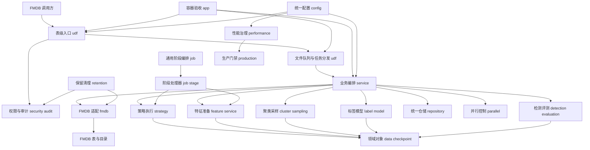

图中英文名称均为根包 `com.fiberhome.ml.raha` 下的相对包名；“FMDB 调用方”和“FMDB 表与目录”属于工程外部运行环境。

架构可以划分为十层：

| 层次    | 包                                                                                  | 职责                    |
| ----- | ---------------------------------------------------------------------------------- | --------------------- |
| 验收应用层 | `app`                                                                              | 提供容器和 Spark 集群全链路黑盒验收入口 |
| 平台入口层 | `udf`                                                                              | 注册三个表级函数，建单并消费文件队列任务  |
| 用例入口层 | `service`、`job`、`job.stage`                                                       | 提供训练、采样、检测用例和通用阶段编排   |
| 算法层   | `strategy`、`feature`、`cluster`、`sampling`、`label`、`model`、`detection`、`evaluation` | 完成 Raha 核心算法闭环        |
| 数据接入层 | `data.loader`、`data.profile`、`fmdb`                                                | 读取文件或 FMDB 数据，写入平台产物  |
| 领域层   | `data`、`checkpoint`                                                                | 定义数据集、坐标、状态、快照和检查点    |
| 安全治理层 | `security`、`audit`、`retention`                                                     | 提供权限、审计、值保护和过期清理      |
| 运行治理层 | `performance`、`production`                                                         | 提供基准数据、指标、容量建议和生产门禁   |
| 基础设施层 | `repository`、`parallel`、`observability`、`error`                                    | 提供核心持久化、并发、日志上下文和统一异常 |
| 公共工具层 | `util`、`config`                                                                    | 提供配置、哈希、校验和敏感值保护      |

## 4. 每个包的具体职责

当前 32 个主代码包及 Java 文件数量如下，合计 324 个文件：

| 包                                     | 文件数 |
| ------------------------------------- | ---:|
| `com.fiberhome.ml.raha.app`           | 1   |
| `com.fiberhome.ml.raha.audit`         | 8   |
| `com.fiberhome.ml.raha.checkpoint`    | 6   |
| `com.fiberhome.ml.raha.cluster`       | 11  |
| `com.fiberhome.ml.raha.config`        | 19  |
| `com.fiberhome.ml.raha.data`          | 17  |
| `com.fiberhome.ml.raha.data.loader`   | 12  |
| `com.fiberhome.ml.raha.data.profile`  | 2   |
| `com.fiberhome.ml.raha.detection`     | 9   |
| `com.fiberhome.ml.raha.error`         | 3   |
| `com.fiberhome.ml.raha.evaluation`    | 11  |
| `com.fiberhome.ml.raha.feature`       | 8   |
| `com.fiberhome.ml.raha.fmdb`          | 9   |
| `com.fiberhome.ml.raha.job`           | 13  |
| `com.fiberhome.ml.raha.job.stage`     | 10  |
| `com.fiberhome.ml.raha.label`         | 10  |
| `com.fiberhome.ml.raha.model`         | 25  |
| `com.fiberhome.ml.raha.observability` | 2   |
| `com.fiberhome.ml.raha.parallel`      | 5   |
| `com.fiberhome.ml.raha.performance`   | 17  |
| `com.fiberhome.ml.raha.production`    | 3   |
| `com.fiberhome.ml.raha.repository`    | 31  |
| `com.fiberhome.ml.raha.retention`     | 3   |
| `com.fiberhome.ml.raha.sampling`      | 9   |
| `com.fiberhome.ml.raha.security`      | 13  |
| `com.fiberhome.ml.raha.service`       | 19  |
| `com.fiberhome.ml.raha.strategy`      | 20  |
| `com.fiberhome.ml.raha.strategy.od`   | 3   |
| `com.fiberhome.ml.raha.strategy.pvd`  | 4   |
| `com.fiberhome.ml.raha.strategy.rvd`  | 1   |
| `com.fiberhome.ml.raha.udf`           | 16  |
| `com.fiberhome.ml.raha.util`          | 4   |

### 4.1 `com.fiberhome.ml.raha.service`

对外用例和主动学习编排层，封装特征准备、逐轮采样、训练、检测四类业务动作，并返回统一任务状态、结果位置、统计摘要和错误信息。

关键类：

| 类                   | 职责                        |
| ------------------- | ------------------------- |
| `RahaFeaturePreparationService` | 统一执行策略计划、策略批次和特征组装，生成 SAMPLE 与 TRAIN 可复用产物 |
| `ActiveSamplingOrchestrator` | 按一轮一个元组执行覆盖采样，按剩余候选行收缩预算，获取直接标签并完成任务 |
| `RahaTrainService`  | 复用或生成策略特征，编排聚类、传播、质量门禁和列级训练，输出候选模型 |
| `RahaSampleService` | 复用或生成聚类结果并创建单轮待标注任务         |
| `RahaDetectService` | 按字段加载已发布模型并生成生产检测结果       |
| `RahaFeaturePreparationResult` | 保存策略计划、执行命中、特征字典、计划版本和耗时 |
| `ActiveSamplingResult` | 保存逐轮任务、采样顺序、累计标签和末轮聚类结果 |
| `RahaTrainRequest`  | 训练输入以及可选的采样阶段已准备特征产物   |
| `RahaSampleRequest` | 采样输入以及可选的已准备聚类结果    |
| `SampledTupleLabelProvider` | 将抽中的元组任务转换为直接标签的同步适配接口 |
| `RahaDetectRequest` | 检测所需数据集、特征、策略计划版本和资源配置    |
| `RahaTaskResult`    | 统一包装成功、部分成功、失败及结果位置       |

关系说明：

- 特征准备服务依赖 `strategy` 和 `feature`，并负责公共 Spark 输入缓存的创建与释放。
- 主动采样编排依赖 `cluster` 和 `sampling`，每轮更新标签覆盖但复用首轮聚类。
- 训练服务依赖 `strategy`、`feature`、`cluster`、`label`、`model`、`parallel`，可直接复用 SAMPLE 阶段的策略和特征产物。
- 检测服务依赖 `model` 和 `repository`。
- 这些服务不负责原始文件加载和列画像，调用前必须准备好相应输入。

### 4.2 `com.fiberhome.ml.raha.job`

通用任务和阶段编排层，解决幂等提交、状态转换、阶段顺序、重试、失败容忍、快照绑定和阶段属性传递。

关键类：

| 类                       | 职责                              |
| ----------------------- | ------------------------------- |
| `RahaJobOrchestrator`   | 创建幂等任务并顺序执行阶段处理器                |
| `RahaJob`               | 维护任务状态机和失败上下文                   |
| `RahaStage`             | 维护单次阶段尝试状态机                     |
| `StageExecutionContext` | 传递任务、配置、阶段和共享属性                 |
| `StageFailureDecider`   | 根据可恢复性、失败比例和重试次数决策              |
| `StageAttributeKeys`    | 约定阶段间共享数据的键                     |

具体 `StageHandler` 接口和十个处理器已经迁移到 `job.stage` 子包，`job` 包只保留状态机、阶段上下文、失败决策和编排器。

`StageType` 中虽然定义了传播、训练、评测和最终持久化，但当前没有对应处理器。完整学习闭环主要由 `service` 包实现，而不是全部通过 `RahaJobOrchestrator` 实现。

### 4.3 `com.fiberhome.ml.raha.config`

集中定义任务配置、算法参数、资源限制、失败容忍、平台配置加载和稳定配置版本。

关键类：

| 类                           | 职责                            |
| --------------------------- | ----------------------------- |
| `RahaJobConfig`             | 聚合完整任务配置                      |
| `RahaConfigValidator`       | 校验必填项、范围和冲突                   |
| `ConfigVersioner`           | 对规范化配置生成稳定版本                  |
| `RahaConfigLoader`          | 按固定优先级合并内置、外部文件和系统属性，并拒绝未知配置项 |
| `RahaProperties`            | 提供严格的字符串、数字、布尔和列表类型读取         |
| `RahaConfigFactory`         | 从统一属性构造算法、UDF、安全、性能和保留配置      |
| `RahaDefaultConfigProvider` | 提供默认配置文件加载入口                  |
| `UdfConfig`                 | 定义三个互不重复的函数名和请求长度上限           |
| `StrategyConfig`            | 控制策略族、字段、策略类型、数量、优先级和超时       |
| `StrategyGenerationConfig`  | 控制策略生成阈值、占位符、优先级和关系列对上限       |
| `FeatureConfig`             | 控制上下文特征、归一化和特征上限              |
| `ModelConfig`               | 控制分类器、阈值、降级、质量门禁、策略族权重和上下文权重       |
| `ClusteringConfig`          | 控制余弦距离、目标簇数和精确聚类样本上限          |
| `SamplingConfig`            | 控制标注预算、聚类采样、复核和任务有效期          |
| `ResourceConfig`            | 控制策略并发、列并发、广播、缓存和阶段超时         |
| `FailureToleranceConfig`    | 控制失败比例、快速失败和最大重试次数            |

配置合并优先级从低到高为：`raha-defaults.properties`、外部 UTF-8 属性文件、`raha.*` 系统属性。外部文件可通过环境变量 `RAHA_CONFIG_FILE` 或系统属性 `raha.config.file` 指定。所有受支持配置进入规范化字符串并通过 SHA-256 形成执行配置指纹，参与任务幂等和所有产物版本；未知键、格式错误和越界值都会在启动组装阶段直接失败。当前生产默认分类器为 `LOGISTIC_REGRESSION`，默认关闭规则静默降级并启用模型质量门禁。

### 4.4 `com.fiberhome.ml.raha.data`

核心领域对象和枚举，负责表达数据集、单元格、画像、检测结果及状态语义。

关键类：

| 类                 | 职责                              |
| ----------------- | ------------------------------- |
| `RahaDataset`     | 保存逻辑数据集、快照、字段、Spark 数据集、模式哈希和画像 |
| `DatasetSnapshot` | 保存输入来源、规模、模式和版本信息               |
| `ColumnMetadata`  | 标识字段顺序、类型、可检测性和敏感性              |
| `ColumnProfile`   | 保存列级统计画像                        |
| `CellCoordinate`  | 使用数据集、快照、行标识和字段定位单元格            |
| `CellValue`       | 表达受保护的单元格值信息                    |
| `DetectionResult` | 保存检测判断、分数、原因、模型和字典版本            |
| 各状态枚举             | 约束任务、阶段、策略、模型和标签语义              |

`RahaDataset` 采用不可变设计，通过 `withDataFrame` 和 `withProfiles` 返回新对象，避免阶段之间修改输入对象。

### 4.5 `com.fiberhome.ml.raha.data.loader`

数据接入包定义统一加载请求，并使用 Spark 文件数据源读取 CSV、JSON、Parquet。FMDB 表和只读 SQL 格式由 `fmdb.FmdbDatasetLoader` 实现，二者共享行标识、模式哈希、字段元数据和快照规则。

关键类：

| 类                         | 职责                                        |
| ------------------------- | ----------------------------------------- |
| `FileRahaDatasetLoader`   | 读取外部文件并转换为 `RahaDataset`                  |
| `DataLoadRequest`         | 描述文件、格式、字段范围、敏感字段和快照信息                    |
| `DataFormat`              | 定义 CSV、JSON、Parquet、FMDB 表和 FMDB SQL 五种来源 |
| `RowIdValidator`          | 校验行标识字段存在、非空且唯一                           |
| `SchemaHasher`            | 对字段顺序、名称、类型和可空性生成模式哈希                     |
| `ColumnMetadataFactory`   | 根据 Spark 模式生成字段元数据                        |
| `SnapshotMetadataFactory` | 生成调用方指定或确定性派生的快照标识                        |
| `DataValidationException` | 将文件和数据校验错误转换为稳定错误码                        |

外部文件读取失败会记录上下文和异常堆栈，并转换为 `DATA_LOAD_FAILED`。`FileRahaDatasetLoader` 不直接处理 FMDB 来源，平台来源会由 UDF 请求转换后交给 `FmdbDatasetLoader`。

### 4.6 `com.fiberhome.ml.raha.data.profile`

列画像计算和持久化包。

`ColumnProfiler` 使用 Spark 聚合生成：总数、空值、空白、不同值、长度、数值数量、均值、标准差、四分位数、字符类型计数和高频值哈希。

`ColumnProfileService` 调用画像器，保存结果，并返回绑定画像的新 `RahaDataset`。

画像是策略计划生成的主要依据。

### 4.7 `com.fiberhome.ml.raha.strategy`

策略计划、策略注册、单策略执行、批量执行和命中结果的核心包。

关键类：

| 类                          | 职责                          |
| -------------------------- | --------------------------- |
| `StrategyPlanGenerator`    | 根据画像和配置生成确定性策略计划            |
| `StrategyPlanService`      | 生成并保存策略计划                   |
| `StrategyRegistry`         | 将策略类型映射到算法实现                |
| `DetectionStrategy`        | 策略算法扩展接口                    |
| `StrategyExecutor`         | 执行单策略，隔离超时和异常，管理 Spark 作业组  |
| `StrategyExecutionService` | 批量并行执行、保存结果并支持失败策略恢复        |
| `RvdBatchStrategyExecutor` | 将同批一对多关系策略合并为共享长表、关联和聚合作业 |
| `StrategyAlignmentArtifactWriter` | 写出可与 Python 按策略比较的规范 JSONL 产物 |
| `StrategyPlan`             | 保存策略标识、目标字段、配置和优先级          |
| `StrategyHit`              | 保存单元格坐标、值哈希、原因和策略分数         |
| `SparkStrategySupport`     | 提供 Spark 字段引用、值哈希、参数读取和候选构造 |

`StrategyPlanGenerator` 同时接收 `StrategyConfig` 和 `StrategyGenerationConfig`，不再把画像阈值、特殊占位值和策略优先级散落在算法代码中。策略计划按优先级和稳定标识排序，超出上限时截断。普通 OD/PVD 计划继续受限并行执行，同批 `RVD_ONE_TO_MANY` 计划由 `RvdBatchStrategyExecutor` 一次构造长表和冲突聚合，最终按原计划顺序拆回仓储结果。

### 4.8 `com.fiberhome.ml.raha.strategy.od`

离群点检测策略包。

| 策略类                       | 算法语义             |
| ------------------------- | ---------------- |
| `LowFrequencyStrategy`    | 按值哈希频率识别低频值      |
| `NumericDistanceStrategy` | 使用均值和总体标准差计算标准距离 |
| `QuantileOutlierStrategy` | 使用四分位距边界识别长尾数值   |

这些策略不保存原始值，只使用哈希、统计量和安全原因摘要。

### 4.9 `com.fiberhome.ml.raha.strategy.pvd`

模式违规检测策略包。

| 策略类                       | 算法语义                       |
| ------------------------- | -------------------------- |
| `CharacterSetStrategy`    | 识别数字、拉丁字母、中文、空格和符号组成的少数模式  |
| `LengthAnomalyStrategy`   | 使用长度四分位距和少数长度分布识别异常        |
| `NullPlaceholderStrategy` | 区分空值、空白值和特殊占位值             |
| `TypeFormatStrategy`      | 识别少数值类型及日期、时间、电话、邮箱、编号格式异常 |

格式自动推断依赖字段名称，只有匹配比例达到阈值时才应用，减少字段名误导造成的整列误报。

### 4.10 `com.fiberhome.ml.raha.strategy.rvd`

关系违规检测策略包。

`OneToManyConflictStrategy` 检测同一个左值映射到多个右值的依赖冲突，同时在左右两个字段生成候选命中。

策略计划按有方向列对生成，并受最大列对数量限制。空值和空白值不参与关系冲突检测。

### 4.11 `com.fiberhome.ml.raha.feature`

将策略命中和单元格上下文转换为列级版本化稀疏特征。

关键类：

| 类                            | 职责                   |
| ---------------------------- | -------------------- |
| `FeatureAssembler`           | 组装策略特征、统计特征和值上下文特征   |
| `FeatureService`             | 串行或按列并行组装并持久化特征      |
| `FeatureDictionary`          | 保存稳定特征编号和定义          |
| `SparseFeatureRow`           | 保存单元格坐标、值哈希、脱敏值和非零特征 |
| `FeatureDictionaryVersioner` | 根据定义和配置生成字典版本        |

主要特征包括：

- 单个策略命中。
- 各策略族命中数量。
- 最大策略分数。
- 值长度、空值、空白、数字、字母、中文和符号。
- 值类型。
- 值频率、频率比例和低频桶。
- 关系冲突数量。

可配置删除常量特征，并限制每列最大特征数量。敏感字段只保留掩码，不写入原始值。`FeatureAssembler` 现在先将全部可检测列堆叠成长表并统一计算频率，再按列组装特征，避免每个字段重复扫描输入表；最终仍会把长表结果收集到 Driver。

### 4.12 `com.fiberhome.ml.raha.detection`

不经过训练模型的基础规则检测和结果解释包。

关键类：

| 类                             | 职责                  |
| ----------------------------- | ------------------- |
| `BasicDetectionService`       | 使用加权规则生成检测结果并持久化    |
| `WeightedRuleScoringRule`     | 融合策略族可靠度、策略分数和上下文信号 |
| `DetectionExplanationService` | 反查策略计划、命中原因和特征摘要    |
| `DetectionBatchResult`        | 汇总检测结果和指标           |

规则评分使用噪声或组合多个策略信号，再融合受限上下文信号。该能力用于通用阶段流水线和无训练模型场景，与 `service.RahaDetectService` 的已发布模型检测是两种不同路径。

### 4.13 `com.fiberhome.ml.raha.cluster`

列内聚类包，为主动采样和标签传播提供簇结构。

关键类：

| 类                             | 职责                   |
| ----------------------------- | -------------------- |
| `HierarchicalColumnClusterer` | 使用平均连接和余弦距离执行精确层次聚类  |
| `ScalableColumnClusterer`     | 小样本委托精确聚类，大样本切换确定性余弦分区聚类 |
| `ColumnClusteringService`     | 按列隔离执行，支持串行和受限并行模式   |
| `ClusterAssignment`           | 保存单元格到簇的映射和到质心距离     |
| `ClusterVersioner`            | 根据字典、算法、配置、种子和成员生成版本 |

`ScalableColumnClusterer` 在样本数不超过 `maxSampleCount` 时使用精确平均连接层次聚类；超限时按稳定哈希选择初始质心，最多迭代 100 次执行稀疏余弦分区，并根据成员签名稳定编号。两条路径都在 Driver 内处理特征列表，解决的是聚类时间复杂度而不是 Driver 内存分布式化。

### 4.14 `com.fiberhome.ml.raha.sampling`

主动采样和标注任务生命周期包。

关键类：

| 类                       | 职责                 |
| ----------------------- | ------------------ |
| `ClusterCoverageScorer` | 对低标注覆盖簇赋予更高采样贡献    |
| `TupleSampler`          | 使用固定随机种子执行加权无放回采样  |
| `SamplingService`       | 排除已标注和已采样行，生成任务并持久化完成状态 |
| `AnnotationTask`        | 维护待标注、完成、过期和取消状态   |
| `SamplingVersioner`     | 生成可复现采样版本          |

采样单位是整行元组，不是单个单元格。一行可以同时覆盖多个字段的低标注簇，因此优先级更高。逐轮主动采样会把总预算拆成每轮预算一，首轮完成聚类，后续轮复用同一聚类并根据累计直接标签与历史任务重新计算覆盖分数。

### 4.15 `com.fiberhome.ml.raha.label`

直接标签、真值自动标注和聚类内标签传播包。

关键类：

| 类                         | 职责                |
| ------------------------- | ----------------- |
| `CellLabel`               | 保存零一标签、来源、权重和传播溯源 |
| `GroundTruthLabelAdapter` | 在评测模式下用真值表完成采样任务  |
| `LabelPropagationService` | 在同字段、同聚类版本内传播直接标签 |
| `LabelPropagationConfig`  | 控制传播权重和多数比例       |

传播支持两种语义：

- 同质传播，簇内直接标签必须一致。
- 多数传播，多数比例必须达到配置阈值。

直接标签永远优先，不会被传播标签覆盖。冲突簇、无标签簇和无多数簇都会生成摘要，不会静默传播。

### 4.16 `com.fiberhome.ml.raha.model`

列级训练数据、训练器、可移植模型、模型文件、预测和发布生命周期包。

关键类：

| 类                                     | 职责                                 |
| ------------------------------------- | ---------------------------------- |
| `ColumnTrainingDataBuilder`           | 按字段关联特征和标签，处理冲突及类别平衡               |
| `AdaptiveColumnModelTrainer`          | 直接尝试 MLlib，并在训练失败或分类器未实现时按配置选择规则降级 |
| `SparkMllibLogisticRegressionTrainer` | 训练逻辑回归并提取系数和截距                     |
| `WeightedRuleFallbackTrainer`         | 根据正负样本特征均值差生成线性模型                  |
| `ModelQualityGate`                    | 计算训练分数标准差、预测正例比例和训练 F1，拒绝退化模型 |
| `ColumnModelArtifact`                 | 保存不依赖 MLlib 对象的可移植线性参数             |
| `FileColumnModelStore`                | 将参数保存为 UTF-8 属性文件                  |
| `FmdbModelStore`                      | 将不可变模型参数和特征字典保存到 FMDB 表，并按版本读取     |
| `ColumnModelPredictor`                | 在 Driver 侧对稀疏特征列表预测                |
| `PartitionedColumnModelPredictor`     | 在 Spark 分区中对向量数据集预测                |
| `ColumnModelCompatibilityValidator`   | 校验模式、字典、策略计划和元数据一致性                |
| `PublishedColumnModelLoader`          | 只加载唯一已发布且兼容的模型                     |
| `ModelReleaseManager`                 | 在权限检查和审计约束下管理候选、发布、停用和回滚           |
| `RahaColumnModel`                     | 保存模型元数据和生命周期状态                     |

训练数据构建规则：

1. 直接标签优先于传播标签。
2. 同一单元格直接标签冲突时剔除该样本。
3. 没有标签、只有单一类别或没有特征时不训练。
4. 可对少数类别增加类别平衡权重。
5. 传播训练集不可训练或正例比例低于 5% 或高于 95% 时，若直接标签仍可训练，则整列回退到直接标签。
6. 训练成功后必须通过分数方差、预测正例比例和训练 F1 质量门禁才能进入候选状态。

`ColumnModelArtifact` 统一使用线性系数、截距和逻辑函数进行预测，因此 MLlib 训练完成后不需要保留 `LogisticRegressionModel` 对象。

当前版本已删除基于类路径的 `MllibAvailability` 预判：首选逻辑回归时直接执行 MLlib 训练，只有训练结果不是 `TRAINED` 且允许降级时才调用规则训练器；未实现的决策树或梯度提升树在允许降级时使用规则模型，否则返回 `FAILED`。生产默认使用逻辑回归且禁止静默降级。规则训练器已改为方差缩放、中心化和系数截断，降低大计数特征导致概率饱和的风险。

`FmdbModelStore` 采用版本不可变语义：相同版本再次写入相同内容可视为幂等，相同版本写入不同内容会拒绝。`PartitionedColumnModelPredictor` 已通过资源集成测试，但当前 `RahaDetectService` 仍调用 Driver 侧 `ColumnModelPredictor`。

### 4.17 `com.fiberhome.ml.raha.evaluation`

真值构造、检测指标和阈值选择包。

关键类：

| 类                              | 职责                       |
| ------------------------------ | ------------------------ |
| `GroundTruthDifferenceService` | 全外连接脏表和真值表，生成全量单元格标签     |
| `DetectionEvaluationService`   | 计算混淆矩阵、精确率、召回率、F1 和平均精确率 |
| `ThresholdComparisonService`   | 比较候选阈值并更新模型元数据           |
| `EvaluationSplitService`       | 排除直接标签后按稳定单元格哈希划分验证集和测试集 |
| `EvaluationSplit`              | 保存互不重叠的阈值验证标签和最终测试标签 |
| `ThresholdSelectionPolicy`     | 定义最低召回、最大召回下降和基准阈值 |

基础阈值选择顺序仍是 F1、精确率、召回率、较低阈值。新增约束模式先计算 `max(最低召回, 基准阈值召回 - 最大允许下降)`，在满足召回下限的候选中按精确率、较少假阳性、F1、召回率和较高阈值选优；无人满足时回退基础规则并记录 `constraintFallback`。哈希划分后若极小数据全部落在一侧，会按稳定单元格顺序移动一个标签，保证验证集和测试集均非空。选定阈值写入模型元数据，发布加载时覆盖参数文件中的初始阈值。

### 4.18 `com.fiberhome.ml.raha.repository`

统一仓储契约和各业务仓储适配器，是工程中间产物版本化、幂等和事务语义的核心。

关键类：

| 类                        | 职责                          |
| ------------------------ | --------------------------- |
| `RahaRepository`         | 定义保存、按键读取、分区查询和事务执行         |
| `InMemoryRahaRepository` | 开发测试内存实现，支持事务失败回滚           |
| `RepositoryKey`          | 使用命名空间、分区键和记录键组成主键          |
| `RepositoryRecord`       | 保存业务对象、产物版本和更新时间            |
| `ArtifactVersion`        | 保存配置版本、快照、阶段和尝试序号           |
| `RepositoryNamespace`    | 隔离任务、阶段、策略、特征、聚类、标签、模型和检测结果 |
| 各 `Default...Repository` | 将领域对象映射到统一仓储键和事务            |

核心统一仓储当前只包含内存版本，没有 `RahaRepository` 的 FMDB、数据库、对象存储或分布式事务实现。新增的 `FmdbTableGateway`、`FmdbModelStore`、`SparkSqlFmdbResultWriter` 和审计写入器是独立的平台持久化适配层，并不等价于统一仓储的 FMDB 实现。所有 `Default...Repository` 仍建立在 `RahaRepository` 之上。

### 4.19 `com.fiberhome.ml.raha.checkpoint`

定义阶段级检查点状态、执行任务、重试、复用和审计信息。

| 类                                  | 职责                         |
| ---------------------------------- | -------------------------- |
| `StageCheckpoint`                  | 保存阶段尝试的输入版本、指纹、状态、输出、错误和时间 |
| `StageCheckpointRunner`            | 执行检查点任务，记录每次尝试并复用一致输入的成功结果 |
| `CheckpointTask`                   | 定义可检查点化的业务任务               |
| `CheckpointTaskResult`             | 表达单次尝试的成功、失败和可恢复性          |
| `CheckpointRunResult`              | 汇总新执行、历史复用或最终失败结果          |
| `DefaultStageCheckpointRepository` | 保存尝试并查找可复用成功检查点            |

检查点能力已经可以被业务代码独立调用，并有重试、严格版本复用、输入变化重算和异常审计测试。当前 `RahaJobOrchestrator` 尚未组合 `StageCheckpointRunner`，因此通用阶段流水线还不会自动跳过历史成功阶段。

### 4.20 `com.fiberhome.ml.raha.parallel`

提供受限并行执行和 Spark 资源控制。

关键类：

| 类                         | 职责                       |
| ------------------------- | ------------------------ |
| `BoundedParallelExecutor` | 固定线程数执行工作项，应用批次超时并隔离单项失败 |
| `ParallelWorkItem`        | 使用稳定业务键包装调用              |
| `ParallelBatchResult`     | 保存有序成功结果、失败摘要和并发峰值       |
| `SparkResourceManager`    | 按阈值控制广播变量和 Spark 数据集缓存   |

并行执行已接入高层训练、采样和检测服务，以及策略、特征、聚类服务的并行方法。通用阶段处理器仍调用这些服务的串行兼容方法。

`SparkResourceManager` 当前没有被其他类调用，属于已实现但未接入的资源控制工具。

### 4.21 `com.fiberhome.ml.raha.observability`

提供稳定日志上下文和敏感值泄漏防护。

- `RahaLogContext` 将任务、阶段、尝试和快照组合为日志上下文。
- `SensitiveLogGuard` 检查日志文本中是否包含完整敏感值。

业务服务普遍在开始、结束、外部文件或模型访问、异常捕获处记录日志。

### 4.22 `com.fiberhome.ml.raha.error`

定义统一错误分类、错误码和可恢复性。

`RahaException` 携带 `RahaErrorCode` 和是否可恢复。当前部分核心模块已使用统一异常，部分模块仍使用 `IllegalArgumentException` 和 `IllegalStateException`，错误模型尚未完全统一。

### 4.23 `com.fiberhome.ml.raha.util`

提供跨包基础工具。

| 类                      | 职责                   |
| ---------------------- | -------------------- |
| `HashUtils`            | 生成 SHA-256 十六进制哈希    |
| `ValueProtectionUtils` | 对值进行稳定哈希和脱敏掩码        |
| `ValueUtils`           | 校验非空字符串              |
| `FormDataCodec`        | 严格编解码表单参数，并稳定编码列表和映射 |

### 4.24 `com.fiberhome.ml.raha.udf`

FMDB Spark SQL 表级函数入口包，负责函数注册、请求解析、权限校验、幂等建单和 JSON 应答，不在 UDF 调用线程中运行完整 Raha 算法。

| 类                                     | 职责                                |
| ------------------------------------- | --------------------------------- |
| `F_DW_RAHATRAIN`                      | 接收训练请求字符串并返回任务提交结果 JSON           |
| `F_DW_RAHADETECT`                     | 接收检测请求字符串并返回任务提交结果 JSON           |
| `F_DW_RAHASAMPLE`                     | 接收采样请求字符串并返回任务提交结果 JSON           |
| `RahaUdfRegistrar`                    | 将三个配置化函数名注册到当前 Spark 会话           |
| `RahaUdfRequestParser`                | 校验请求长度、白名单参数、来源类型和任务专属参数          |
| `RahaUdfRequest`                      | 保存规范化请求，生成稳定配置与 `DataLoadRequest` |
| `RepositoryBackedRahaUdfJobSubmitter` | 执行权限、审计、幂等检查，保存核心任务并写 FMDB 任务表    |
| `RahaUdfRuntime`                      | 保存进程级任务提交器，供 Spark 实例化后的 UDF 获取   |
| `FileRahaUdfJobWorker`                | 从共享目录原子认领请求，维护租约、回收超时任务并写成功或失败终态 |
| `RahaUdfTaskDispatcher`               | 将重新解析的完整请求分发到采样、训练或检测核心服务 |

训练请求必须包含标注引用，检测请求必须包含模型版本，采样请求的标注预算必须为正数。建单成功只表示请求已经进入任务边界；`FileRahaUdfJobWorker` 已能按文件名识别任务类型、创建独占租约、将请求移动为 `.running`、恢复超时任务，并输出 `.completed.request`、`.succeeded` 或失败文件。该工作器适合容器验收和共享目录部署，但不是 FMDB 分布式队列或通用常驻调度器。

### 4.25 `com.fiberhome.ml.raha.fmdb`

FMDB 平台适配包，负责目录读取、表写入、模型存储、结果输出和表结构解析。

| 类                          | 职责                                          |
| -------------------------- | ------------------------------------------- |
| `FmdbDatasetLoader`        | 从 FMDB 表或以 `SELECT`、`WITH` 开头的只读 SQL 加载数据集  |
| `FmdbTableGateway`         | 抽象表存在、读取、幂等追加和按时间清理能力                       |
| `SparkSqlFmdbTableGateway` | 使用 Spark Catalog、`saveAsTable` 和 SQL 实现生产网关 |
| `InMemoryFmdbTableGateway` | 使用临时视图提供开发测试适配                              |
| `FmdbModelStore`           | 保存和加载列模型参数及特征字典                             |
| `SparkSqlFmdbResultWriter` | 按稳定模式幂等写入任务和检测结果                            |
| `FmdbSchemaResolver`       | 解析任务、模型、字典、结果和审计表名                          |

生产网关写入前使用左反连接过滤已有业务键，再执行追加；这可以降低重复写入，但不是跨进程分布式事务。过期清理依赖目标 FMDB 对 `DELETE FROM` 的支持。

### 4.26 `com.fiberhome.ml.raha.security`

定义平台权限模型、数据集隔离、结果访问控制和敏感值输出保护。

| 类                                | 职责                   |
| -------------------------------- | -------------------- |
| `RahaPermissionChecker`          | 权限判定扩展接口             |
| `RuleBasedRahaPermissionChecker` | 基于调用方授权规则执行默认拒绝判定    |
| `RahaAccessController`           | 将拒绝决策转换为统一访问异常       |
| `AuditedDetectionResultReader`   | 检查读取权限和数据集隔离，并记录访问审计 |
| `ResultValueProtectionPolicy`    | 在结果落表前执行仅哈希或掩码保护     |
| `AllowAllRahaPermissionChecker`  | 仅用于兼容开发环境的全放行实现      |

生产环境必须注入实际权限检查器；默认全放行实现只能保持旧构造器兼容，不能作为生产安全方案。

### 4.27 `com.fiberhome.ml.raha.audit`

定义统一审计事件以及 FMDB、内存和空操作三种写入方式。

| 类                         | 职责                       |
| ------------------------- | ------------------------ |
| `RahaAuditService`        | 生成并写入允许、拒绝、成功和失败审计事件     |
| `RahaAuditEvent`          | 保存事件标识、调用方、动作、资源、状态和上下文  |
| `RahaAuditAction`         | 定义任务提交、模型发布、结果访问和保留清理等动作 |
| `SparkSqlRahaAuditWriter` | 以事件标识为幂等键写入 FMDB 审计表     |
| `InMemoryRahaAuditWriter` | 为测试保存审计事件                |
| `NoOpRahaAuditWriter`     | 仅用于兼容开发环境的空实现            |

审计已接入 UDF 任务提交、模型发布与回滚、检测结果读取和保留清理。异常审计会保留业务上下文和失败摘要，生产环境不能使用空写入器。

### 4.28 `com.fiberhome.ml.raha.retention`

管理 FMDB 中间表和结果表的保留期限。

| 类                             | 职责                   |
| ----------------------------- | -------------------- |
| `FmdbRetentionCleanupService` | 校验清理权限，逐表删除过期记录并记录审计 |
| `RetentionTableRule`          | 定义目标表、时间字段和保留天数      |
| `RetentionCleanupResult`      | 汇总各表删除数量与执行状态        |

清理按规则逐表执行，任一表失败即停止后续规则，避免失败后继续扩大影响范围。

### 4.29 `com.fiberhome.ml.raha.performance`

提供标准基准数据、阶段资源观测、基线报告和生产容量建议。

| 类                             | 职责                           |
| ----------------------------- | ---------------------------- |
| `PerformanceBenchmarkCatalog` | 从统一配置加载小、中、大、宽表基准规格          |
| `BenchmarkDatasetGenerator`   | 使用 Spark 惰性表达式生成确定性合成数据和错误样本 |
| `StagePerformanceMonitor`     | 采集阶段耗时、Driver 内存和可注入资源指标     |
| `PerformanceBaselineReport`   | 汇总基准环境与各阶段性能数据               |
| `ProductionResourceAdvisor`   | 按容量分档建议分区数、并发数、列对上限和缓存策略     |

默认 JVM 探针只能直接获取 Driver 堆内存，执行器、磁盘和网络指标需要宿主平台注入探针。容量建议是起始基线，必须使用目标 FMDB 集群的真实压测数据校准。

### 4.30 `com.fiberhome.ml.raha.production`

提供上线前生产就绪门禁。

| 类                            | 职责                          |
| ---------------------------- | --------------------------- |
| `ProductionReadinessContext` | 保存九项平台能力和压测验收状态             |
| `ProductionReadinessChecker` | 检查数据访问、UDF、安全、审计、清理、宽表和恢复能力 |
| `ProductionReadinessReport`  | 汇总是否可上线及未满足项                |

当前门禁依据调用方传入的布尔验收结果生成报告，不会自动探测集群配置或主动执行压测，因此宿主部署流程必须保证输入证据真实可靠。

### 4.31 `com.fiberhome.ml.raha.app`

提供可通过 `spark-submit` 执行的容器黑盒验收应用。

| 类 | 职责 |
| --- | --- |
| `RahaContainerValidationApplication` | 从脏 CSV 和真值 CSV 建表，串联 UDF、文件消费者、主动采样、训练、阈值调优、模型发布、检测、FMDB 结果写入、保留集评测和策略对齐产物 |

应用支持 `COMBINED`、`SUBMITTER`、`WORKER` 三种模式：组合模式在单进程提交并消费任务；提交模式只调用 UDF 并等待共享目录终态；工作器模式持续扫描外部提交请求。数据集、快照、行标识、模式和等待超时通过 `fmdb.validation.*` 系统属性覆盖。应用会按可用元组数收缩采样预算并至少保留一行用于评测，每次本地消费后立即检查失败终态。该入口是验收装配，不是通用生产服务，包含面向 `flights` 对比的阈值字段和策略对齐输出逻辑。

### 4.32 `com.fiberhome.ml.raha.job.stage`

保存通用任务编排器使用的阶段扩展接口和具体适配器。

| 类 | 职责 |
| --- | --- |
| `StageHandler` | 定义阶段类型和执行契约 |
| `DataLoadStageHandler` | 接入数据加载 |
| `ColumnProfileStageHandler` | 接入字段画像 |
| `StrategyPlanStageHandler` | 接入策略计划生成 |
| `StrategyRunStageHandler` | 接入策略执行 |
| `FeatureStageHandler` | 接入特征组装 |
| `DetectionStageHandler` | 接入基础规则检测 |
| `ClusterStageHandler` | 接入列内聚类 |
| `SamplingStageHandler` | 接入主动采样任务生成 |
| `GroundTruthLabelStageHandler` | 接入评测真值标注 |

处理器目前覆盖通用流水线前半段；传播、模型训练、阈值评测、模型发布和最终平台持久化仍主要由 `service`、`model` 和容器验收入口编排。

## 5. 包之间的关系

### 5.1 主依赖方向

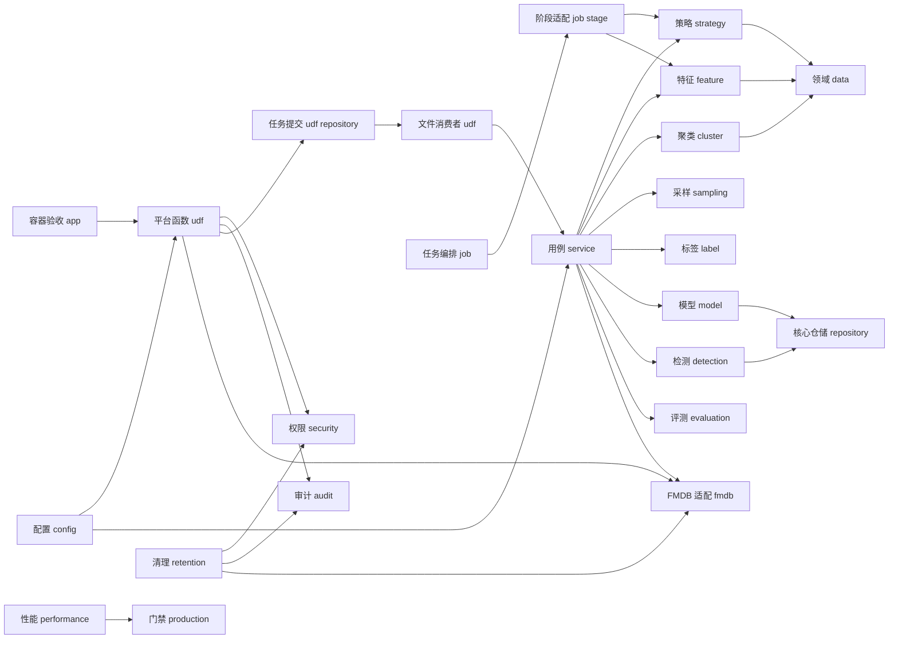

### 5.2 四类入口与编排方式

工程存在四种不同层级的入口，它们复用同一批领域和算法服务：

| 方式        | 入口                         | 特点               | 适用场景             |
| --------- | -------------------------- | ---------------- | ---------------- |
| 容器验收入口 | `RahaContainerValidationApplication` | 可执行、全链路、输出评测和对齐产物 | Spark 集群黑盒验收 |
| FMDB 表级入口 | `RahaUdfRegistrar` 和三个 UDF | 严格解析、权限审计、幂等异步建单 | FMDB SQL 调用      |
| 通用阶段编排    | `RahaJobOrchestrator`      | 幂等、状态机、重试、阶段属性   | 平台作业、评测流水线、逐阶段审计 |
| 高层用例编排    | `RahaFeaturePreparationService`、`ActiveSamplingOrchestrator` 和三个 `Raha...Service` | 直接形成特征、采样、训练和检测结果 | API、服务封装、主动学习闭环 |

UDF 函数调用仍只负责提交，不在线执行算法。`FileRahaUdfJobWorker` 已能消费共享目录任务并通过 `RahaUdfTaskDispatcher` 调用高层服务；`RepositoryBackedRahaUdfJobSubmitter` 的核心仓储建单链和文件队列链是两种不同实现，当前没有一个通用生产装配器把它们自动组合。通用阶段处理器仍主要使用串行兼容方法。

### 5.3 两类持久化关系

| 持久化体系    | 主要接口或实现                                                                  | 当前用途                          |
| -------- | ------------------------------------------------------------------------ | ----------------------------- |
| 核心统一仓储   | `RahaRepository`、`InMemoryRahaRepository`、各 `Default...Repository`       | 任务阶段、策略、特征、聚类、标签、模型元数据和检测领域对象 |
| FMDB 平台表 | `FmdbTableGateway`、`FmdbModelStore`、`FmdbResultWriter`、`RahaAuditWriter` | 平台任务记录、模型参数、字典、检测结果、审计和保留清理   |

两类体系当前并存，但没有一个 FMDB 类完整实现 `RahaRepository`。共享目录文件队列又形成第三种运行状态载体，用 `.request`、`.running`、`.lease` 和终态文件记录消费过程。宿主后台执行器必须明确核心仓储、FMDB 表和文件队列之间的一致性边界。

## 6. 通用任务阶段完整流程

集成测试给出的最完整阶段顺序如下：

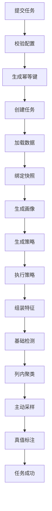

阶段间通过 `StageExecutionContext.attributes` 传递：

| 键                         | 数据         |
| ------------------------- | ---------- |
| `RAHA_DATASET`            | 已加载或已画像数据集 |
| `DATASET_SNAPSHOT`        | 输入快照       |
| `STRATEGY_PLANS`          | 策略计划       |
| `STRATEGY_BATCH_RESULT`   | 策略批次结果     |
| `STRATEGY_HITS`           | 策略命中       |
| `FEATURE_ASSEMBLY_RESULT` | 特征字典和稀疏特征  |
| `DETECTION_BATCH_RESULT`  | 基础检测结果     |
| `CLUSTERING_BATCH_RESULT` | 聚类结果       |
| `SAMPLING_BATCH_RESULT`   | 采样结果       |
| `ANNOTATION_TASKS`        | 待标注或已完成任务  |
| `CELL_LABELS`             | 直接标签       |

### 6.1 失败、重试和继续流程

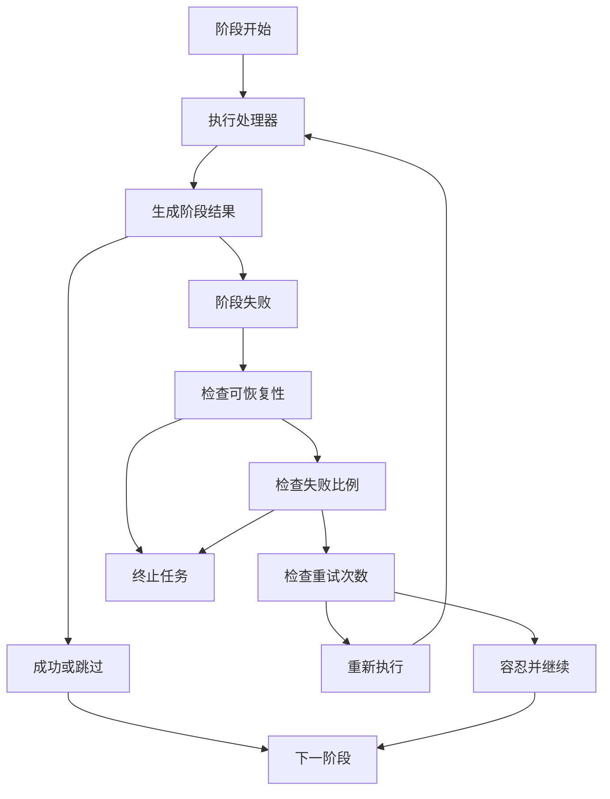

不可恢复失败、快速失败开启、失败比例超限时直接终止。可恢复失败在重试次数内重试，超过次数后可按配置继续。

### 6.2 FMDB UDF 异步建单流程

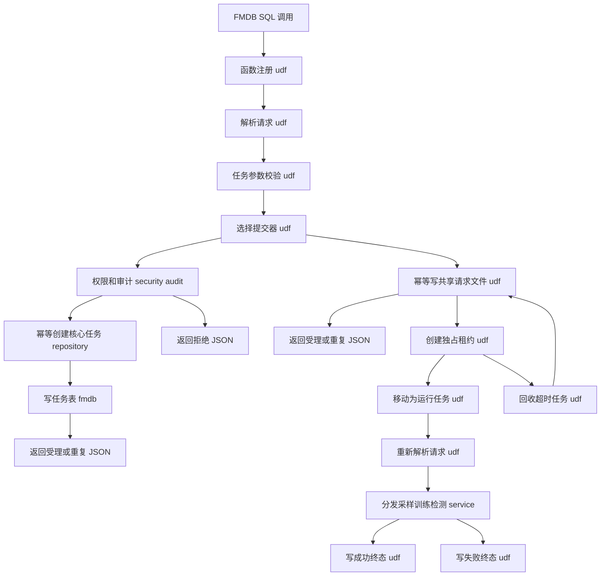

请求使用 URL 表单编码字符串，返回稳定 JSON 文本。允许字段由解析器白名单固定，未知字段、跨任务字段和非法来源会被拒绝。`ACCEPTED` 只表示提交成功；共享目录提交器与工作器通过原子创建租约和移动文件降低重复消费，租约缺失或超时的 `.running` 任务会被回收。

### 6.3 FMDB 算法产物链路

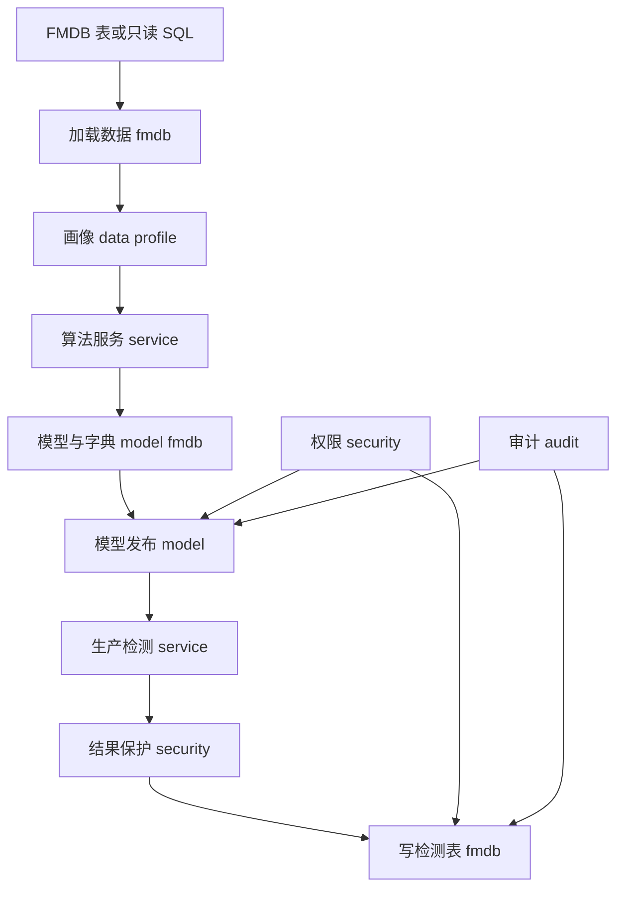

FMDB 加载器只允许目录表或以 `SELECT`、`WITH` 开头的只读 SQL。模型和字典按版本不可变保存；检测值在进入 FMDB 结果表前必须再次应用哈希或掩码策略。

### 6.4 容器黑盒验收流程

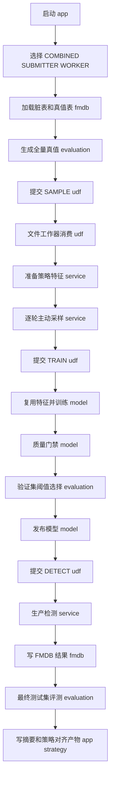

组合模式在一个应用中依次提交并消费三个请求；提交模式只调用 UDF 并等待外部消费者终态；工作器模式加载数据和算法依赖后持续轮询共享目录。该流程用于验收真实 Spark 执行与进程边界，不代表生产调度和共享仓储已经完成。

## 7. 训练闭环完整流程

训练服务的输入必须包含 Spark 数据集、列画像和一批直接标签。策略与特征可以在训练内生成，也可以复用采样阶段的 `RahaFeaturePreparationResult`。

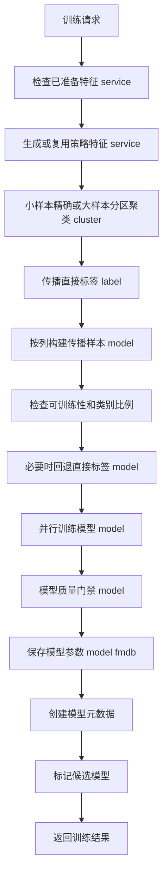

模型参数可以写入本地 `FileColumnModelStore`，也可以写入 `FmdbModelStore`。后者同时保存特征字典，适合平台版本化加载；具体实现由宿主组装时注入。

### 7.1 单列训练分支

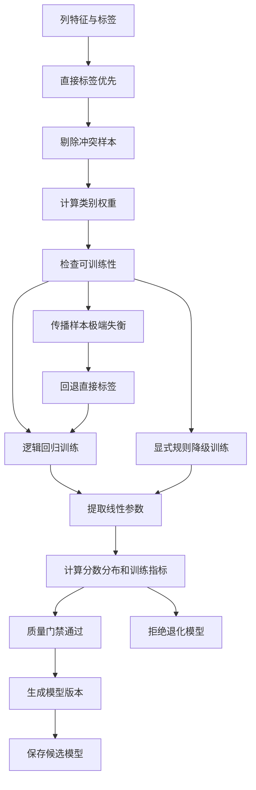

不可训练状态包括：没有特征、没有标签、只有一个类别、冲突剔除后无样本。质量门禁拒绝分数近似恒定、预测正例比例接近全零或全一、训练 F1 低于配置的模型。训练服务允许不同字段分别成功、跳过或失败，并据此返回成功、部分成功或失败。

## 8. 主动采样和标签传播流程

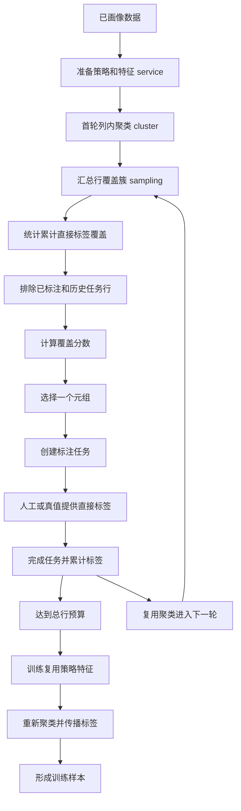

采样强调覆盖“尚未充分标注的簇”。请求预算是新增采样行的上限，编排器会按特征中的去重元组数排除已有直接标签所在行，并自动收缩到剩余候选行数量；容器验收还至少保留一行用于后续评测。首轮后固定聚类，只更新标签覆盖和任务排除。训练会复用策略与特征，但当前仍重新执行聚类，再按新的聚类版本传播标签。

## 9. 模型评测、发布与回滚流程

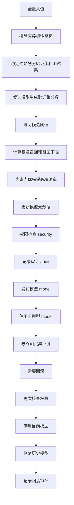

同一数据集和字段只允许一个已发布模型。发布新模型时自动停用旧模型，回滚只允许恢复曾经发布过的更早版本。约束阈值选择和验证测试切分目前由容器验收入口显式调用，不是 `RahaTrainService` 的通用内建步骤。带调用方参数的新接口会执行权限与审计；兼容构造器仍使用全放行和空审计实现。

## 10. 生产检测完整流程

生产检测服务不从原始文件开始，也不重新生成策略和特征。调用方必须提供与训练阶段一致的特征字典和策略计划版本。

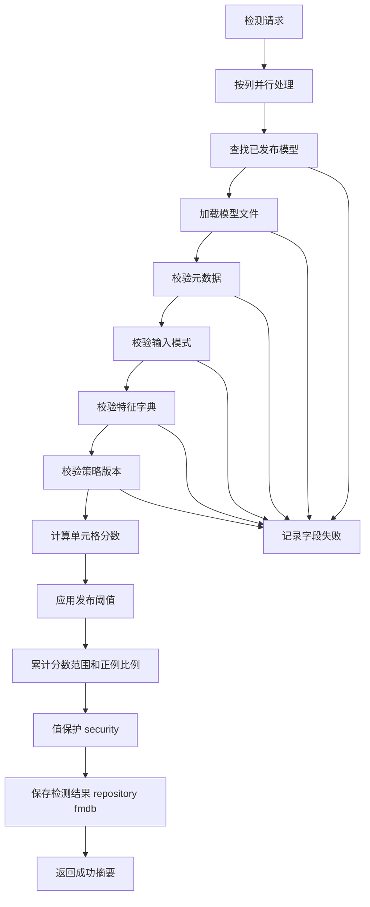

单字段模型缺失或不兼容不会丢弃其他字段结果。至少一个字段成功时可返回部分成功，全部字段失败时返回失败。

当前 `ColumnModelPredictor` 仍对 Java 列表逐行预测。`RahaDetectService` 已在任务摘要中按字段输出数量、最小值、最大值、均值和预测正例比例诊断；`PartitionedColumnModelPredictor` 尚未接入。FMDB 结果写入器会按业务键过滤重复记录，并在落表前再次执行结果值保护。结果读取必须通过 `AuditedDetectionResultReader` 做读取权限、数据集隔离和访问审计。

## 11. 仓储、幂等和版本关系

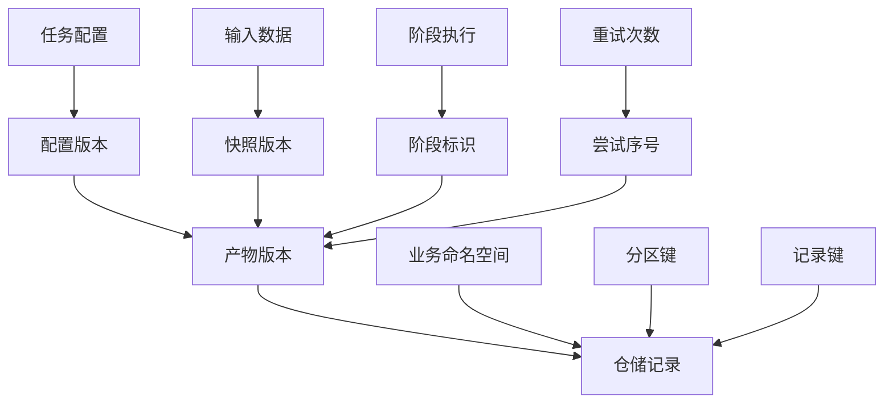

幂等和可追溯性由三组标识共同保证：

1. 任务幂等键，由配置版本和任务输入生成。
2. 产物版本，由配置、快照、阶段和尝试组成。
3. 仓储主键，由命名空间、分区和记录键组成。

相同主键和相同产物版本重复保存返回 `UNCHANGED`，不同版本保存返回 `UPDATED`。内存仓储事务失败时恢复整个写入前快照。

FMDB 表适配使用另一套幂等机制：任务、检测结果和审计事件各自定义稳定业务键，写入前对目标表执行左反连接，再追加不存在的记录。该操作在单 JVM 同步块内可避免本进程并发重复，但读取、过滤、追加不是集群级原子事务；多个进程同时提交相同键时仍依赖 FMDB 平台的唯一约束或事务能力兜底。

共享目录任务使用文件状态机提供第三套幂等边界：待处理请求为 `.request`，消费者先独占创建 `.lease` 再移动为 `.running`；成功生成 `.completed.request` 和 `.succeeded`，失败生成 `.failed.request` 和 `.failed`。租约缺失或超过默认五分钟时可回收到待处理状态。它解决单共享文件系统上的认领与恢复，不提供消息队列的确认、重试策略、顺序保证或跨存储事务。

## 12. 确定性、隐私和可观测性设计

### 12.1 确定性

- 配置、模式、策略、特征字典、聚类和采样均使用稳定哈希版本。
- 内置默认值、外部配置和系统属性合并后形成执行配置指纹，覆盖值会进入任务版本。
- 集合在生成哈希前进行排序或规范化。
- 聚类和采样使用显式随机种子。
- 大样本分区聚类使用种子与单元格标识哈希选择初始质心和处理距离并列。
- 阈值验证集与最终测试集使用盐值和单元格标识的 SHA-256 桶稳定划分。
- 并列聚类候选使用随机种子和成员签名生成稳定排序键。
- 结果集合多数按字段、单元格或策略标识稳定排序。
- 策略对齐产物按计划顺序输出规范配置、坐标排序、配置哈希和坐标哈希。

### 12.2 隐私保护

- 策略候选和命中使用值哈希，不保存原始值。
- 特征行对敏感字段只保留掩码。
- `ResultValueProtectionPolicy` 支持仅哈希和掩码两种模式，可保护全部字段或指定敏感字段。
- 上游已经掩码的值在写 FMDB 结果表前仍会按策略重新保护，避免跨链路泄漏。
- 检测结果读取执行权限检查、数据集隔离和访问审计。
- 日志主要记录标识、数量、版本和错误类型。
- `SensitiveLogGuard` 可用于检查日志是否泄漏完整敏感值。

### 12.3 可观测性

- 文件读取、模型文件读写、Spark 策略执行等外部调用有日志。
- FMDB 表读取、追加、清理、模型发布和 UDF 提交均有业务日志或审计事件。
- 核心服务记录开始、完成、数量、耗时和状态。
- 异常捕获处通常包含任务、阶段或字段上下文及完整堆栈。
- 任务编排使用 `RahaLogContext` 统一任务、阶段、尝试和快照。
- `StagePerformanceMonitor` 可记录阶段耗时和资源快照，但默认探针不能直接获得执行器、网络和磁盘指标。

### 12.4 安全审计与保留闭环

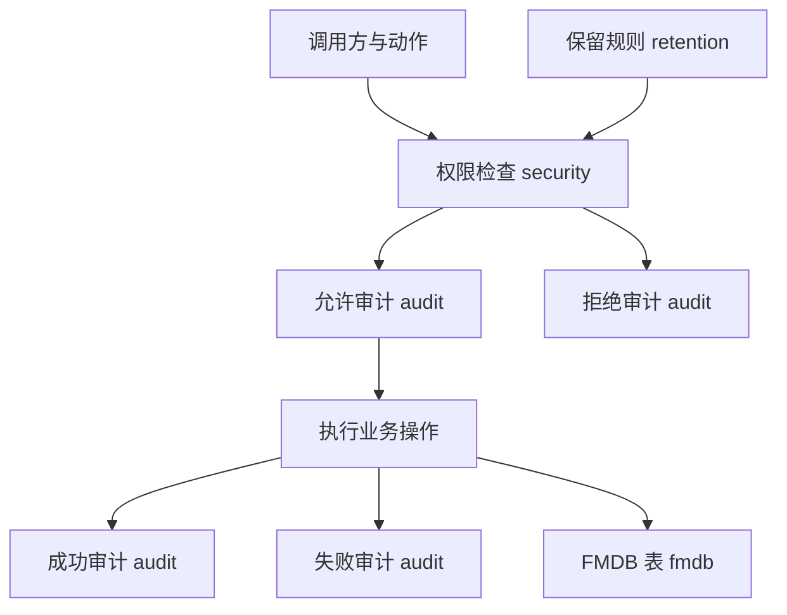

该闭环覆盖任务提交、模型发布、停用、回滚、结果访问和保留清理。安全强度取决于宿主注入的权限检查器和审计写入器；全放行与空审计实现不得用于生产。

## 13. 测试覆盖与本次验证

当前共有 56 个测试类、7975 行测试代码和 154 个 `@Test` 方法。除原有算法、状态机、仓储和迭代集成测试外，新增或强化覆盖包括：

- 统一配置加载、覆盖优先级、未知键拒绝和配置指纹。
- FMDB 表与只读 SQL 加载、模型和字典保存、检测结果幂等写入。
- 三个 Spark SQL UDF 的注册、严格请求解析、任务提交和重复提交。
- 基于规则的权限判定、结果数据集隔离、值保护和访问审计。
- 模型发布、停用、回滚的权限与审计。
- FMDB 保留清理的权限、失败停止和审计。
- 标准性能基准、阶段监控、容量建议和生产就绪门禁。
- 并行训练、并行检测、策略失败恢复、阶段检查点和分区预测。
- FMDB 加载到训练、模型发布、检测和结果写入的迭代九集成流程。
- 文件任务消费者的并发认领、租约超时回收和终态文件。
- 默认逻辑回归、禁止静默降级、规则模型方差缩放和模型质量门禁。
- 可扩展聚类的小样本精确路径、大样本确定性路径和全量覆盖。
- 评测验证集与测试集稳定切分，以及召回约束下的阈值选择。
- RVD 批量执行与逐策略执行结果一致性。
- 主动采样预算按剩余候选元组收缩，以及极小评测集的稳定重平衡。

本次在 Maven 3.9.12、Temurin JDK 1.8.0_492 环境执行：

```text
mvn -q clean test
mvn -q "-DskipTests" verify
```

全量结果如下：

| 项目   | 数量  |
| ---- | ---:|
| 测试总数 | 154 |
| 通过   | 154 |
| 失败   | 0   |
| 错误   | 0   |
| 跳过   | 0   |

当前 154 项测试全部通过；随后跳过重复测试执行 `verify` 也通过，说明 Shade Jar 构建、Maven Enforcer 和 Animal Sniffer Java 8 API 检查均成功。此前在 JDK 17 上运行前一版 151 项快照时出现 4 个失败和 45 个错误，根因是 Spark 3.3.1 对 `sun.nio.ch.DirectBuffer` 的模块访问限制；该结果保留为环境兼容警告，不再作为当前源码测试结论。

最新 `doc/20260716/notes/final-implementation-20260716-0945` 保存了独立提交端与工作器的集群运行产物。`flights` 数据为 2376 行、20 个主动采样元组、120 个直接标签、60 个策略、4 个候选模型和 9504 条检测结果；11259 个最终测试单元格上的精确率为 0.886196569562、召回率为 0.835472279261、F1 为 0.860087197780。该目录还保存 7 行 `raha-toy` 的预算自动收缩和一比一极小评测集结果。实测证明当前验收装配能够运行，但不是通用生产 SLA 或所有数据集质量结论。

## 14. 当前新增能力与接入状态

提交 `df51409` 已包含主动采样、评测切分、RVD 批处理、对齐脚本和容器验收产物。当前工作区继续修改了 `RahaContainerValidationApplication`、`EvaluationSplitService`、`ActiveSamplingOrchestrator` 和相关测试，本文已经按实际文件内容纳入分析。接入状态如下：

| 能力          | 实现状态                                  | 仍需宿主或后续完成的内容                   |
| ----------- | ------------------------------------- | ------------------------------ |
| 三个 FMDB UDF | 已完成注册、解析、权限审计、幂等建单和 JSON 应答           | 注入真实提交器并部署注册                   |
| UDF 文件消费    | 已有租约认领、超时回收、任务分发和成功失败终态             | 仍需部署为长期进程，并替换共享目录为正式任务基础设施或明确其运维边界 |
| FMDB 数据加载   | 已支持目录表和只读 SQL                         | 在目标目录权限和 SQL 方言下验收             |
| FMDB 模型存储   | 已支持模型参数和特征字典的版本化存取                    | 组装到实际训练与检测部署链路                 |
| FMDB 结果写入   | 已支持稳定模式、值保护和业务键去重                     | 依赖平台唯一约束实现跨进程强幂等               |
| 核心统一仓储      | 领域契约和内存实现完整                           | 仍没有 `RahaRepository` 的 FMDB 实现 |
| 权限与审计       | 已接入提交、模型生命周期、结果访问和清理                  | 生产必须替换全放行和空审计兼容实现              |
| 统一配置        | 已集中默认值、覆盖规则、严格校验和配置指纹                 | 部署侧维护外部配置文件与密钥边界               |
| 数据保留        | 已支持逐表规则、权限、审计和失败停止                    | 验证 FMDB 删除语法和大表清理代价            |
| 性能治理        | 已有四档基准、阶段监控和容量建议                      | 必须以目标集群实测重新校准默认档位              |
| 生产门禁        | 已检查九项上线条件                             | 当前依赖调用方传入验收布尔值，不会自动探测          |
| 高层服务并行      | 训练、采样、检测和策略恢复已接入                      | 在 JDK 8 和目标集群完成完整回归            |
| 策略特征复用      | SAMPLE 可生成 `RahaFeaturePreparationResult`，TRAIN 可直接复用 | 当前只支持进程内对象传递，没有仓储恢复契约和完整版本兼容校验 |
| 逐轮主动采样      | 一轮一个元组，复用聚类、累计直接标签，并按剩余候选行自动收缩预算 | 同步标签接口、任务完成和标签持久化尚无事务边界 |
| 可扩展聚类       | 超过精确上限时切换确定性余弦分区                       | 仍在 Driver 处理完整特征列表，空簇和空特征语义需加强 |
| RVD 批处理      | 同批一对多计划共享 Spark 长表与冲突聚合                | 批次失败会使全部 RVD 计划失败，当前专项测试受 JDK 17 环境阻断 |
| 模型质量门禁      | 默认启用，拒绝恒定分数和全同预测模型                    | 使用训练集指标，最终发布仍需独立验证证据 |
| 阈值验证与测试切分   | 容器入口已按单元格稳定切分，极小集合会稳定重平衡，并支持召回约束阈值 | 尚未进入通用训练服务，当前仅特定字段启用 |
| 容器验收应用      | 已支持组合、独立提交端和工作器模式并输出对齐产物              | 验收装配包含数据集专属逻辑，不是通用生产启动器 |
| 策略对齐工具      | `export_python_strategy_baseline.py` 导出 Python 缓存，`compare_strategy_artifacts.py` 比较逐策略坐标，检测对比脚本输出字段分数和阈值诊断 | Python 缓存使用 pickle，只能读取可信本地产物；OD/PVD 仍是近似或缺失映射 |
| 通用阶段流水线     | 状态机和阶段处理器可用                           | 仍调用串行兼容方法，且缺少后半段处理器            |
| 阶段检查点       | 执行器、仓储、重试与复用测试已完成                     | `RahaJobOrchestrator` 尚未接入     |
| Spark 资源管理  | `SparkResourceManager` 已实现            | 生产主流程尚未调用                      |
| 分区预测        | `PartitionedColumnModelPredictor` 已实现 | `RahaDetectService` 尚未调用       |

新增能力已经打通可执行的文件队列和容器黑盒链路，但“验收链路可运行”和“生产分布式部署完成”必须区分。当前最关键的缺口是共享状态持久化、工作器重启恢复、真实权限与审计适配器，以及核心仓储、FMDB 表和文件队列之间的一致性策略。

## 15. 当前实现边界与风险

### 15.1 平台接入边界

- 已有 FMDB UDF 注册、平台表适配和文件队列工作器，但没有通用常驻进程或 FMDB 原生任务队列适配。
- 没有依赖注入容器或一站式生产装配器，宿主必须显式组装 Spark、配置、仓储、提交器、权限和审计。
- 核心 `RahaRepository` 仍只有内存实现，FMDB 模型、结果、审计表是独立适配层。
- UDF 通过进程级 `RahaUdfRuntime` 获取提交器，注册前必须完成初始化，且需要注意多 Spark 会话隔离。
- FMDB 左反连接后追加只能提供尽力幂等，不是跨进程原子事务。
- 保留清理依赖 FMDB 支持对应的 `DELETE FROM` 语法和权限。
- 容器工作器的 SAMPLE、TRAIN、DETECT 中间状态保存在同一 JVM 的 `ValidationWorkerState`；进程重启或不同工作器分阶段消费时无法恢复采样特征和训练上下文。
- Spark 和 SLF4J 必须由运行平台提供。

### 15.2 数据规模边界

- 多个策略使用 `collectAsList` 将候选收集到 Driver。
- 特征组装已合并为一次长表频率计算，但仍将全部可检测单元格的结果收集到 Driver。
- 精确层次聚类适合小样本，计算复杂度较高。
- 默认 500 条以内使用精确层次聚类，超限切换确定性余弦分区聚类；两条路径仍使用 Driver 侧特征列表。
- RVD 批处理减少重复 Spark 作业，但最终仍按仓储契约收集全部冲突候选。
- 当前生产预测主路径仍使用 Driver 侧列表预测。

### 15.3 功能边界

- 已实现 OD、PVD、RVD。
- `KBVD` 和 `TFIDF` 只有枚举语义，没有策略实现。
- 已实现规则加权和逻辑回归。
- 决策树和梯度提升树只有分类器枚举，没有训练器实现。
- 通用阶段流水线缺少传播、训练、评测和最终持久化处理器。
- 生产检测要求调用方先准备兼容特征，尚无原始数据一键检测入口。
- 约束阈值选择和验证测试切分只接入容器验收入口，且当前只对 `act_dep_time` 使用硬编码策略。
- 容器验收应用是 `flights` 和样例链路的装配，不是任意数据集的通用生产应用。

### 15.4 基础设施边界

- 默认统一仓储只在进程内有效，生产需要补充共享持久化实现或清晰的 FMDB 映射层。
- 模型可写本地文件或 FMDB 表，但训练、发布、检测之间的生产装配由宿主负责。
- 检查点执行器尚未接入通用任务编排。
- `SparkResourceManager` 和分区预测器尚未进入生产主路径。
- 并行批次调度失败会使高层流程整体失败，算法内部失败才会转换为字段或策略级结果。
- RVD 合并批次失败会同时将该批全部关系策略标记失败。
- 当前 154 项全量测试已在 JDK 8 通过；仍需在目标 FMDB 集群持续回归资源和并发行为。

### 15.5 安全与生产治理边界

- `AllowAllRahaPermissionChecker` 和 `NoOpRahaAuditWriter` 为兼容构造器保留，生产使用会绕过真实安全治理。
- `ProductionReadinessChecker` 校验调用方提供的九项状态，不会自行采集证据。
- 默认性能探针主要覆盖 Driver 堆内存，执行器、磁盘和网络需要平台扩展。
- 容量分档和并发建议是通用初始值，不能替代目标 FMDB 集群压测。
- 结果保护发生在应用层，仍需结合 FMDB 表权限、传输安全和静态加密形成完整防护。

### 15.6 主动学习与评测边界

- `preparedFeatures` 只校验数据集和快照，未校验配置指纹、产物版本、策略版本和字典版本；`preparedClustering` 没有验证特征、配置和随机种子兼容性。
- 可复用产物目前只作为进程内对象传递，没有统一仓储读取和工作器重启恢复契约。
- 主动采样预算会排除初始直接标签所在行并按剩余候选行收缩，但“一个已标注单元格即排除整行”是当前固定语义。
- `ActiveSamplingResult.labels` 包含初始标签，但 `cellIds` 只累计新采样标签；两者不是同一集合视图。
- 标签提供器没有验证返回标签一定属于抽中任务的行，同轮重复单元格也缺少完整检查；标签获取、任务完成和标签持久化不是原子事务。
- `completeTask` 按传入快照完成任务，没有回读仓储验证当前状态，陈旧或伪造快照可能覆盖状态。
- 评测划分只隔离直接标注单元格坐标，策略、特征、聚类仍使用全量数据；按单元格而非整行切分，因此不能表述为严格独立的归纳测试集。
- 极小评测集会被强制重平衡为两侧至少一个标签，虽然保证流程可运行，但单样本指标没有统计稳定性。
- 大样本聚类可能产生空簇并使有效簇数少于目标数；全零特征在近似路径和精确路径的状态语义目前不一致。

## 16. 关键类调用关系摘要

| 入口类                                   | 直接调用                           | 主要输出                        |
| ------------------------------------- | ------------------------------ | --------------------------- |
| `RahaUdfRegistrar`                    | Spark UDF 注册器、`RahaUdfRuntime` | 三个已注册函数                     |
| `RahaUdfRequestParser`                | `FormDataCodec`、请求白名单和任务校验     | `RahaUdfRequest`            |
| `RepositoryBackedRahaUdfJobSubmitter` | 权限、审计、任务仓储、FMDB 结果写入器          | 受理、重复或拒绝 JSON               |
| `FileRahaUdfJobWorker`                | 共享目录、租约、请求解析器、任务分发器             | 成功、失败和完成请求文件                |
| `RahaContainerValidationApplication`  | UDF、文件工作器、FMDB 适配和算法服务             | 容器验收摘要、检测结果和策略对齐产物          |
| `RahaJobOrchestrator`                 | 各阶段处理器、任务仓储、阶段仓储               | `JobRunResult`              |
| `RahaFeaturePreparationService`       | 策略计划、策略执行、特征组装                 | 可复用策略与特征产物                  |
| `ActiveSamplingOrchestrator`          | 单轮采样服务、标签提供器                    | 逐轮任务、采样顺序和直接标签              |
| `RahaTrainService`                    | 特征准备、聚类、传播、训练、质量门禁和模型发布        | 候选模型和训练摘要                   |
| `RahaSampleService`                   | 聚类服务、采样服务和可选聚类复用               | 单轮标注任务                      |
| `RahaDetectService`                   | 发布模型加载器、模型预测器、检测仓储             | 生产检测结果                      |
| `FileRahaDatasetLoader`               | Spark、行标识校验、模式和快照工厂            | `LoadedDataset`             |
| `FmdbDatasetLoader`                   | Spark Catalog、只读 SQL、行标识和快照工厂  | `LoadedDataset`             |
| `RahaConfigLoader`                    | 默认资源、外部属性文件、系统属性               | `RahaProperties`            |
| `RahaConfigFactory`                   | 严格属性读取和各配置构造器                  | 完整运行配置                      |
| `StrategyPlanGenerator`               | 列画像、策略配置                       | `StrategyPlan` 列表           |
| `StrategyExecutor`                    | 策略注册表、Spark 作业组                | `StrategyExecutionResult`   |
| `RvdBatchStrategyExecutor`            | 共享长表、广播列对和冲突聚合                  | 多个 RVD 策略结果                  |
| `StrategyAlignmentArtifactWriter`     | 策略计划、命中坐标和稳定哈希                  | Java 策略对齐 JSONL              |
| `FeatureAssembler`                    | 数据集、策略计划、策略命中                  | `FeatureAssemblyResult`     |
| `HierarchicalColumnClusterer`         | 稀疏特征、聚类配置                      | `ColumnClusteringResult`    |
| `ScalableColumnClusterer`             | 精确聚类器、稳定质心初始化和余弦分区              | 小样本精确或大样本近似聚类结果             |
| `SamplingService`                     | 聚类覆盖评分、无放回采样                   | `SamplingBatchResult`       |
| `LabelPropagationService`             | 聚类成员、直接标签                      | `LabelPropagationResult`    |
| `AdaptiveColumnModelTrainer`          | MLlib 训练器、规则降级训练器              | `ColumnModelTrainingResult` |
| `ModelQualityGate`                    | 训练模型、训练集和模型配置                  | 带质量指标的训练结果或拒绝结果              |
| `ModelReleaseManager`                 | 模型元数据仓储                        | 发布、停用、回滚结果                  |
| `PublishedColumnModelLoader`          | 模型元数据、模型文件、兼容校验                | `ColumnModelArtifact`       |
| `FmdbModelStore`                      | FMDB 表网关、模式解析器                 | 模型参数和特征字典                   |
| `SparkSqlFmdbResultWriter`            | FMDB 表网关、结果保护策略                | 任务记录和检测结果                   |
| `AuditedDetectionResultReader`        | 权限检查器、结果仓储、审计服务                | 受控检测结果                      |
| `FmdbRetentionCleanupService`         | 权限、审计、FMDB 表网关                 | 清理汇总                        |
| `ProductionResourceAdvisor`           | 容量分档和资源配置                      | 生产资源建议                      |
| `ProductionReadinessChecker`          | 九项验收状态                         | 生产就绪报告                      |
| `DetectionEvaluationService`          | 检测结果、真值标签                      | 评测指标                        |
| `EvaluationSplitService`              | 全量真值、直接标签坐标和稳定盐值               | 阈值验证集与最终测试集                  |
| `ThresholdComparisonService`          | 候选分数、真值、阈值策略和模型仓储              | 更新阈值后的模型元数据                  |
| `InMemoryRahaRepository`              | 统一记录和事务回调                      | 版本化内存数据                     |

## 17. 总结

该工程已经具备较完整的 Raha 工程化和 FMDB 平台接入能力，不只是若干异常检测规则。它同时实现了弱监督策略、共享特征准备、逐轮主动采样、可扩展聚类、标签传播、列级训练、模型质量门禁、阈值验证、模型生命周期、任务状态机、表级 UDF、文件任务消费、FMDB 产物存储、安全审计、保留清理、性能门禁和容器黑盒验收。

现阶段算法闭环、领域模型、文件队列消费和容器验收已经成形，当前 154 项测试也已在 JDK 8 全部通过。最需要继续补齐的是可恢复的共享产物仓储、统一生产装配、主动采样事务一致性、严格独立评测、大数据量 Driver 去收集化、跨进程强幂等，以及真实 FMDB 集群的长期资源和故障恢复验收。

从调用方角度，推荐将工程理解为六个层次：

1. `RahaContainerValidationApplication` 是可执行验收入口，不是通用生产服务。
2. `RahaUdfRegistrar` 和三个 UDF 是 FMDB SQL 提交入口，`FileRahaUdfJobWorker` 是共享目录消费入口。
3. `RahaJobOrchestrator` 与 `job.stage` 是通用阶段控制器和阶段适配器。
4. `RahaFeaturePreparationService`、`ActiveSamplingOrchestrator`、`RahaTrainService`、`RahaSampleService`、`RahaDetectService` 是主动学习业务入口。
5. `fmdb`、`security`、`audit`、`retention`、`performance` 和 `production` 是平台治理与运行适配层。
6. 其余算法包是可复用、可替换、可版本化的 Raha 处理组件。
