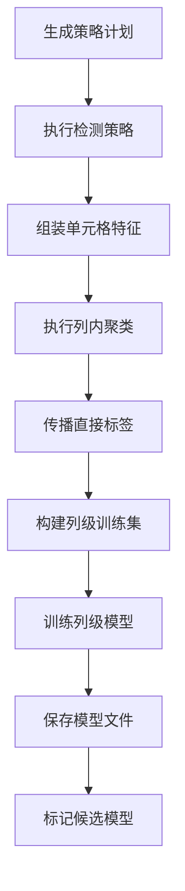
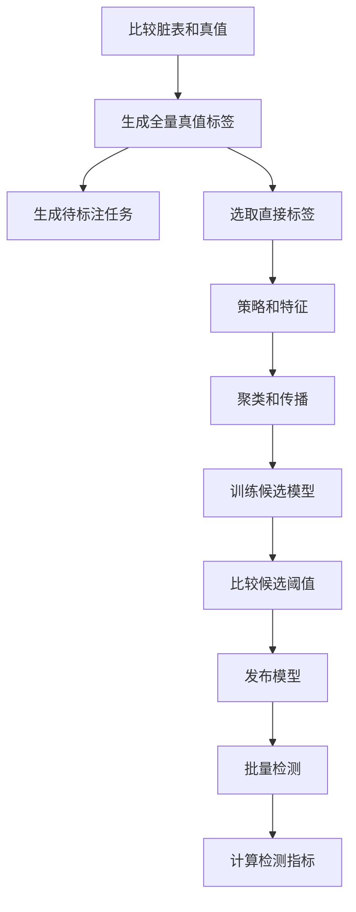

# Raha 数据检测迭代 7 落地与 P1 验收报告

## 1. 验收结论

根据《Raha 数据检测功能模块与任务计划》8.2 节，迭代 7 覆盖 `T095` 至 `T103`，目标是完成 Raha 训练、采样、检测服务和评测闭环。

本次已完成全部 9 项任务，形成以下闭环：

- `RahaTrainService` 编排策略、特征、聚类、标签传播、列级训练和候选模型保存。
- `RahaSampleService` 编排列内聚类和覆盖采样，生成待标注任务。
- `RahaDetectService` 只加载兼容的已发布模型并执行批量检测。
- 三类服务统一返回状态、结果位置、阶段摘要、业务输出和安全错误信息。
- 使用 Spark 全外连接比较脏表和真值表，生成全量单元格真值标签。
- 计算单元格级精确率、召回率、F1 和平均精确率。
- 比较候选阈值，将选定阈值和指标写入模型元数据。
- 已发布模型加载时使用元数据中的选定阈值，阈值评测会实际影响生产检测。
- 完成从真值、采样、传播、训练、阈值、发布到检测和评测的端到端测试。

最终结论：`T095` 至 `T103` 全部完成，Raha 核心学习流程验收通过，`MS3` 的聚类、采样、传播、模型和评测能力已经闭环，可以进入迭代 8 的 Spark 并行、检查点和恢复建设。

## 2. Raha 服务层

### 2.1 统一任务结果

新增统一服务对象：

- `RahaTaskType`：训练、采样、检测。
- `RahaTaskStatus`：成功、部分成功、失败。
- `RahaTaskSummary`：开始时间、完成时间、耗时、成功数、跳过数、失败数和阶段摘要。
- `RahaTaskResult`：任务标识、类型、状态、结果位置、摘要、类型化输出、错误码和错误信息。

结果位置使用逻辑仓储地址：

- 训练：`repository://column-model/<datasetId>`
- 采样：`repository://annotation-task/<jobId>`
- 检测：`repository://detection-result/<jobId>`

错误信息只保存异常类型和业务摘要，不写入原始值、标签内容或敏感字段。

### 2.2 训练服务

`RahaTrainService` 的实际流程：



关键行为：

- 策略计划版本由排序后的策略标识和配置哈希生成。
- 训练输入只接受人工、真值或规则确认的直接标签。
- 标签传播后按字段关联特征和标签。
- 单类别、空特征、无标签和冲突列记录为跳过，不生成伪模型。
- 训练失败字段与成功字段隔离。
- 成功模型先保存参数文件，再创建草稿元数据并进入 `CANDIDATE`。
- 没有任何候选模型时返回 `NO_CANDIDATE_MODEL`。

### 2.3 采样服务

`RahaSampleService` 执行：

1. 按字段和当前特征字典重新聚类。
2. 根据已有标签和历史任务排除重复元组。
3. 计算聚类覆盖分数。
4. 按预算执行可复现加权无放回采样。
5. 保存待标注任务并返回采样版本。

采样服务摘要包含聚类成员数、候选元组数、任务数和采样版本。

### 2.4 检测服务

`RahaDetectService` 按字段执行：

1. 查找当前唯一 `PUBLISHED` 模型。
2. 加载模型参数文件。
3. 校验模式哈希、特征字典版本和策略计划版本。
4. 使用发布元数据阈值批量预测。
5. 生成并事务保存 `DetectionResult`。

检测结果包含分数、阈值、模型类型、模型版本、字典版本和非敏感解释。单字段模型缺失或不兼容时隔离当前字段；部分字段成功返回 `PARTIAL_SUCCESS`，全部字段不可用返回失败。

发布前调用检测服务会返回 `NO_PUBLISHED_MODEL_RESULT`，不会将候选模型用于生产检测。

## 3. 评测服务

### 3.1 真值差异

`GroundTruthDifferenceService` 使用 Spark 对脏表和真值表执行全外连接：

- 行标识字段必须一致。
- 真值表必须包含全部可检测字段。
- 行集合不一致或行标识重复时拒绝评测。
- 空值使用对象语义比较，不把两个空值判断为差异。
- 相同单元格生成标签零，不同单元格生成标签一。
- 标签来源固定为 `GROUND_TRUTH`。
- 全部标签通过 `CellLabelRepository` 事务保存并携带 `ArtifactVersion`。

该服务只生成零一错误标签，不保存真值内容和纠正值。

### 3.2 检测指标

`DetectionEvaluationService` 输出：

- 真正例、假正例、假负例和真负例。
- 精确率。
- 召回率。
- F1。
- 平均精确率。
- 参与评测和具有分数的单元格数量。

缺少检测结果的真值单元格按未检出处理。检测分数若没有对应真值、同一单元格存在重复结果或输入传播标签冒充真值，评测会直接拒绝。

平均精确率按分数降序计算，并按相同分数组处理，避免同分单元格排序导致指标漂移。没有正样本时四项比例指标均返回零。

### 3.3 阈值比较

`ThresholdComparisonService`：

- 对候选阈值逐一计算完整指标。
- 先比较 F1，再比较精确率和召回率。
- 指标完全相同时选择较低阈值。
- 将选中阈值、四项指标和评测单元格数写入模型元数据。
- 只允许更新 `DRAFT` 或 `CANDIDATE` 模型。
- 已发布模型不能绕过发布流程直接修改阈值。

模型参数文件中的系数和截距保持不变。生产加载器在兼容校验通过后，以模型元数据中的选定阈值创建预测视图，因此阈值调整不需要改写训练参数文件，也不会造成“报告阈值与生产阈值不一致”。

## 4. Raha 流程对齐

### 4.1 端到端测试链路



固定学习测试数据包含 8 行和 1 个可检测字段：

| 项目 | 结果 |
| --- | --- |
| 全量真值标签 | 8 |
| 错误单元格 | 2 |
| 初始直接标签 | 2 |
| 特征字典 | 1 |
| 列内聚类 | 2 簇 |
| 标签传播 | 已产生传播标签 |
| 候选模型 | 1 |
| 待标注任务 | 2 |
| 发布前检测 | 被拒绝 |
| 发布后检测结果 | 8 |
| 精确率、召回率、F1 | 均大于零 |
| F1 和平均精确率 | 均大于 0.5 |

### 4.2 与 Python demo 的关系

迭代 5 已冻结实际 Python demo 的策略、特征、采样和最终检测基线。迭代 7 在该基线上继续验证学习闭环，差异如下：

| 环节 | Python demo | Java Spark 工程 | 结论 |
| --- | --- | --- | --- |
| 策略 | 大量参数化画像 | 配置约束下确定性计划 | 策略语义和异常方向一致，数量受治理 |
| 聚类 | 每列多粒度层次聚类 | 每次任务一个版本化目标簇数 | 都使用列内特征和余弦方向 |
| 采样 | 按聚类覆盖逐轮选择 | 固定种子加权无放回生成任务 | 低覆盖优先趋势一致 |
| 传播 | 簇内标签扩展 | 同质性和多数传播均可配置 | Java 额外保存冲突、来源和权重 |
| 分类器 | 默认梯度提升模型 | 首选 MLlib 逻辑回归并支持规则降级 | 分类器不同但输出统一错误分数 |
| 阈值 | 模型输出后统一判断 | 候选阈值评测后写发布元数据 | Java 阈值可追溯并受发布状态保护 |
| 输出 | 错误单元格集合 | 分数、阈值、模型版本和解释 | 检测粒度一致，Java 可审计性更强 |

分类器实现差异是明确的工程选择，不伪装为逐项数值完全一致。固定 Python 基线测试、迭代 5 对齐测试和迭代 7 学习闭环测试共同保证策略、聚类、传播和检测差异可解释。

## 5. 任务逐项核对

| 任务 | 验收要求 | 落地结果 | 状态 |
| --- | --- | --- | --- |
| `T095` | 可产出候选列级模型 | 完整训练编排保存模型文件并生成 `CANDIDATE` 元数据 | 已完成 |
| `T096` | 可生成待标注任务 | 聚类覆盖采样生成版本化待标注任务 | 已完成 |
| `T097` | 可使用已发布模型批量检测 | 发布隔离、兼容校验、批量预测和结果仓储已实现 | 已完成 |
| `T098` | 返回状态、结果位置和摘要 | 三类服务统一使用 `RahaTaskResult` | 已完成 |
| `T099` | 可生成单元格真值标签 | Spark 全外连接生成并保存全量零一标签 | 已完成 |
| `T100` | 输出精确率、召回率和 F1 | 同时输出混淆矩阵和平均精确率 | 已完成 |
| `T101` | 可选择候选阈值并写模型元数据 | 确定性选优、指标写回和发布加载联动已实现 | 已完成 |
| `T102` | 策略、聚类、传播和检测差异可解释 | Python 固定基线和 Java 学习闭环测试共同通过 | 已完成 |
| `T103` | Raha 核心学习流程验收通过 | 本报告完成 P1 逐项验收 | 已完成 |

## 6. 测试与质量门禁

### 6.1 新增测试

新增测试类：

- `DetectionEvaluationServiceTest`
- `GroundTruthDifferenceServiceIntegrationTest`
- `Iteration7RahaLearningPipelineIntegrationTest`

新增 5 个测试方法，覆盖：

- 混淆矩阵、精确率、召回率、F1 和平均精确率数学。
- 候选阈值选择、评测指标写回和发布阈值生效。
- Spark 全量真值差异和标签持久化。
- 脏表与真值表行集合不一致拒绝。
- 训练、采样、传播、阈值、发布、检测和评测端到端闭环。

迭代 7 新增能力与迭代 6 模型生命周期联合定向测试共 18 个，全部通过。

### 6.2 全量构建

执行命令：

```powershell
$env:JAVA_HOME='D:\Program Files\java\jdk8u492-b09'
mvn -B -ntp clean verify
```

| 检查项 | 结果 |
| --- | --- |
| 主源码 | 221 个 Java 文件编译通过 |
| 测试源码 | 35 个 Java 文件编译通过 |
| 测试方法 | 99 个 |
| 失败 | 0 |
| 错误 | 0 |
| 跳过 | 0 |
| JAR 打包 | 成功 |
| Maven Enforcer | 通过 |
| Java 8 API 检查 | 通过 |
| 最终状态 | `BUILD SUCCESS` |

### 6.3 静态检查

| 核验项 | 结果 |
| --- | --- |
| 根包路径 | 全部为 `com.fiberhome.ml.raha` |
| UTF-8 BOM | 0 个文件 |
| CRLF | 0 个文件 |
| 非法 UTF-8 | 0 个文件 |
| Unicode 替换字符 | 0 个文件 |
| 纠正或修复实现 | 未发现 |
| `spark-sql_2.12` | `3.3.1:provided` |
| `spark-mllib_2.12` | `3.3.1:provided` |
| `scala-library` | `2.12.15:provided` |

Windows 本地 Spark 仍提示未配置 `winutils.exe`、原生 Hadoop 库和原生 BLAS。Spark 自动使用 Java 实现，未影响 99 个测试、模型训练或评测结果。

## 7. 后续边界

迭代 7 服务当前按字段顺序执行。策略级并行、列级训练和预测并行属于迭代 8，不在本迭代提前引入线程调度和资源治理。

当前服务已经返回阶段摘要，但跨进程检查点、恢复、重试状态重建和输入漂移校验属于 `T104` 至 `T114`。

本工程只做数据检测。真值服务只生成错误零一标签，训练服务只生成检测模型，检测服务只输出错误分数和阈值判断；不存在纠正候选、修复值、正确内容推荐或原始数据回写。

## 8. 最终判定

`T095` 至 `T103` 全部完成。训练、采样、已发布模型检测、统一任务结果、全量真值差异、四项检测指标、阈值选择和 Raha 学习流程对齐均有实现与测试证据。全量质量门禁通过，未发现阻止进入迭代 8 的遗留问题。
