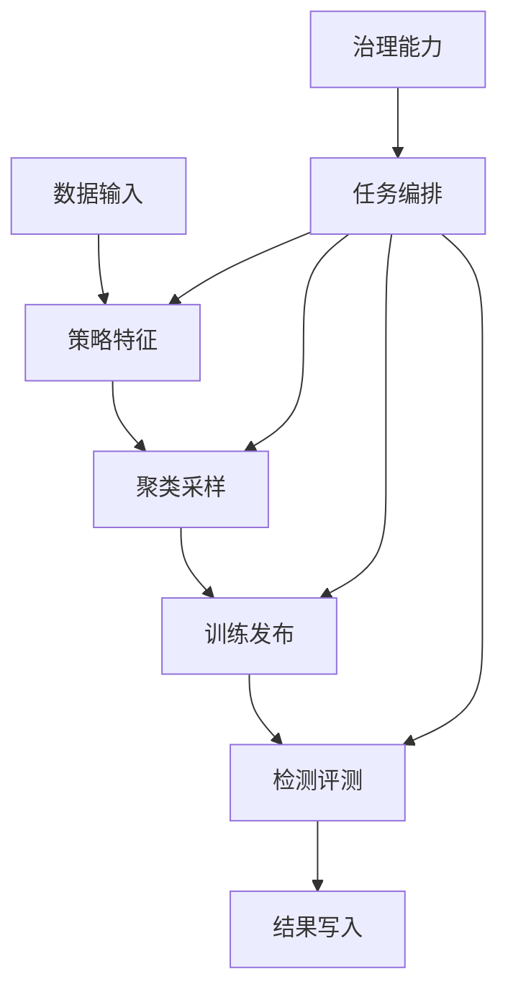

# Raha 验证阶段治理包删除评估与实施报告

## 一、结论

当前工程处于核心功能验证阶段，`security`、`audit`、`retention`、`performance`、`production` 五个包可以删除。

本次已经完成实际删除和调用链收缩。删除后，数据加载、字段画像、OD、PVD、RVD、特征组装、聚类、主动采样、标签传播、模型训练、模型发布、检测、评测、FMDB 读写、UDF 建单和幂等控制仍然可用。

需要明确：该结论只适用于隔离的验证环境。删除后工程不再具备生产所需的权限控制、审计证据、自动清理、性能基准和上线门禁，不能按当前形态直接作为生产版本发布。

## 二、删除规模

| 模块 | 删除文件数 | 删除代码行数 | 原主要职责 |
| --- | ---: | ---: | --- |
| `security` | 13 | 502 | 权限判定、访问拒绝、检测结果读取保护 |
| `audit` | 8 | 281 | 审计事件、内存或 Spark SQL 审计写入 |
| `retention` | 3 | 170 | FMDB 中间结果和检测结果过期清理 |
| `performance` | 17 | 735 | 基准数据生成、阶段测量、容量分档和资源建议 |
| `production` | 3 | 117 | 生产就绪条件汇总和门禁报告 |
| 合计 | 44 | 1805 | 五类非核心治理能力 |

此外删除了只被安全策略使用的 `ValueProtectionUtils`，共 1 个文件、48 行；删除 7 个只验证上述治理能力的测试类；默认配置从 305 行收缩到 81 行，移除了 224 行治理配置和说明。

主代码 Java 文件由 324 个减少到 279 个，测试 Java 文件由 56 个减少到 49 个。

## 三、依赖关系判断

删除前，五个包主要作为核心流程外围的治理能力存在。`retention`、`performance`、`production` 没有进入核心算法执行链；`security` 和 `audit` 进入了 UDF 提交、模型发布和结果读取边界，但不参与策略计算、特征数值、模型训练或检测评分。

本次通过收缩边界调用完成删除，而不是保留空接口或空实现。

## 四、逐包可行性评估

### 4.1 权限包

可删除，但存在明显的环境边界变化。

删除前，UDF 提交会检查任务提交、输入读取、结果写入、标注读取和模型读取权限；模型发布、停用和回滚也会执行权限检查。删除后这些操作直接进入核心逻辑，不再返回 `PERMISSION_DENIED`。

敏感展示值保护不参与特征数值计算。删除后特征与检测结果仍保存稳定 `value_hash`，兼容字段 `masked_value` 固定写空，不保存原始值或脱敏展示值。因此核心检测结果不受影响，数据泄露面反而小于直接保存原值。

验证环境必须依赖 FMDB 宿主、数据库账户或隔离网络限制访问，不能将当前代码暴露为无边界服务。

### 4.2 审计包

可删除，对算法结果没有影响。

原审计事件只记录任务提交、模型操作、结果读取和清理动作，不参与任务状态机、仓储幂等或模型计算。删除后不再生成专用审计表记录，但项目原有 SLF4J 业务日志、异常堆栈和外部调用日志仍保留。

影响是无法形成合规审计证据和操作追责链，而不是核心功能不可用。

### 4.3 清理包

可删除，短期验证无功能影响。

原清理服务通过 FMDB `DELETE FROM` 删除过期数据，没有被训练、检测或 UDF 主流程调用。删除后不会影响结果写入和查询，但中间结果、任务记录和检测结果会持续累积。

短期小数据验证通常不会出现性能问题；长时间运行或大数据量反复验证时，表规模增长可能增加存储成本、扫描耗时和元数据压力。验证结束后应由脚本、测试库重建或宿主平台统一清理。

### 4.4 性能包

可删除，当前运行性能不会因删除而下降。

原性能包生成基准数据、采集阶段指标并计算容量与资源建议，但建议对象没有接入策略执行、字段并发、Spark 分区或缓存控制。核心运行参数仍由 `raha.resource.*`、`raha.strategy.*`、`ResourceConfig` 和 `parallel` 包控制。

删除后的直接影响是失去内置压测数据生成、阶段资源报告和容量建议，不是失去现有并行执行能力。移除少量测量和对象构造路径可能带来可忽略的开销下降，但不应宣称存在可量化性能提升。

### 4.5 生产门禁包

可删除，对任务执行没有影响。

原生产就绪检查器只汇总若干布尔条件并生成报告，没有阻断 UDF、训练或检测调用。删除后核心流程保持不变，但工程不再提供“是否允许上线”的统一判定入口。

## 五、实际代码调整

1. 删除五个主包及其专用测试。
2. 删除安全策略专用的值脱敏工具及测试。
3. `RepositoryBackedRahaUdfJobSubmitter` 移除权限检查器和审计服务依赖，保留参数校验、幂等冲突、任务仓储和 FMDB 状态写入。
4. `ModelReleaseManager` 移除权限和审计包装，保留候选、发布、停用、回滚和质量门禁逻辑。
5. `FeatureAssembler` 不再生成敏感展示值，特征数值、值哈希和字典版本逻辑不变。
6. `SparkSqlFmdbResultWriter` 保留 `masked_value` 表字段以兼容已有结果表结构，但固定写入空值。
7. 删除任务结果保留天数、治理配置工厂方法及相关校验。
8. 更新 `README.md`，避免继续宣称已删除能力仍然存在。

## 六、功能影响矩阵

| 功能 | 删除后状态 | 说明 |
| --- | --- | --- |
| 文件和 FMDB 数据加载 | 可用 | 不依赖五个治理包 |
| 字段画像 | 可用 | 无调用关系变化 |
| OD、PVD、RVD 策略 | 可用 | 策略实现与执行器保留 |
| 稀疏特征 | 可用 | 特征数值不变，展示值改为空 |
| 聚类和主动采样 | 可用 | 无调用关系变化 |
| 标签传播 | 可用 | 无调用关系变化 |
| 模型训练和检测 | 可用 | 训练与评分逻辑不变 |
| 模型发布、停用和回滚 | 可用 | 不再执行权限检查和专用审计 |
| FMDB 任务与结果写入 | 可用 | 幂等写入逻辑保留 |
| 三类 UDF 建单 | 可用 | 参数校验和幂等契约保留 |
| 权限拒绝 | 不可用 | 必须由宿主平台承担 |
| 专用审计事件 | 不可用 | 仅保留普通业务日志 |
| 自动过期清理 | 不可用 | 需外部脚本或平台清理 |
| 内置性能基准与资源建议 | 不可用 | 需外部压测方案 |
| 生产就绪门禁 | 不可用 | 需在发布流程重新建立 |

## 七、性能影响

### 7.1 即时执行性能

预计无负面影响。被删除的容量建议并未驱动核心执行，权限和审计包装也不参与算法计算。训练和检测的 Spark 作业数量、特征维度、模型参数、并发配置与分区策略没有因为本次删除发生变化。

### 7.2 长期运行性能

存在间接风险。自动清理被删除后，FMDB 结果表持续增长可能导致后续查询和存储压力增加。该风险与单次检测算法性能无关，但会影响长周期验证环境。

### 7.3 性能判断能力

内置阶段测量、基准数据生成和容量建议被删除后，工程自身不再提供性能结论。后续若要评估吞吐量、Driver 内存、Executor 指标或宽表能力，应使用目标 FMDB 集群的监控和独立压测脚本。

## 八、兼容性变化

1. `RepositoryBackedRahaUdfJobSubmitter` 不再提供注入权限检查器和审计服务的构造方法。
2. `ModelReleaseManager` 不再提供带权限检查器、审计服务或操作人参数的重载方法。
3. `FeatureAssembler` 和 `SparkSqlFmdbResultWriter` 不再接收结果值保护策略。
4. 原 `raha.security.*`、`raha.retention.*`、`raha.performance.*` 和 `raha.job.result-retention-days` 配置键已删除。
5. 配置加载器会拒绝默认配置中不存在的外部键，因此旧外部配置文件必须同步删除上述键，否则启动时会报未知配置项。
6. UDF 不再产生 `PERMISSION_DENIED`，`caller` 仅用于任务追踪和日志上下文。
7. FMDB 检测结果表的 `masked_value` 字段仍存在，但值固定为空。

这些变化属于有意的验证版本接口收缩。如果还有其他工程直接编译依赖被删类型，需要同步修改，不能只替换 Jar。

## 九、验证结果

验证环境使用 JDK 8u492、Maven 和 Spark 3.3.1。

| 验证项 | 结果 |
| --- | --- |
| 干净主代码编译 | 279 个 Java 源文件编译成功 |
| 干净测试代码编译 | 49 个 Java 测试源文件编译成功 |
| 非 Spark 核心测试 | 27 个测试通过 |
| 特征、FMDB、UDF Spark 测试 | 10 个测试通过 |
| 全量干净测试 | 135 个测试通过，0 失败，0 错误 |
| 残留包引用扫描 | 未发现五个已删包和治理配置键引用 |
| 差异格式检查 | `git diff --check` 通过 |

默认 JDK 17 环境会被 Maven Enforcer 拒绝，跳过 Enforcer 后 Spark 3.3.1 也会因 Java 模块访问限制初始化失败。这是原工程技术基线问题，不是本次删除造成的回归；最终验收结论以项目要求的 JDK 8 干净构建为准。

## 十、验证阶段使用建议

1. 当前删除方案适合独立分支、隔离库和受控调用方，用于验证算法正确性、Python 对齐、UDF 契约和 FMDB 适配。
2. 验证库应设置容量上限，并在批次结束后整体清表或重建，避免缺少保留清理造成长期膨胀。
3. 不要把当前 UDF 直接暴露给不可信调用方，权限边界必须由宿主平台承担。
4. 性能结论应基于真实数据和目标集群独立压测，不能因为删除 `performance` 包而假设性能自动改善。
5. 准备生产化时，应将权限、审计、清理、性能基线和上线门禁作为宿主平台能力重新接入，或从历史版本按清晰接口恢复，而不是重新耦合进算法包。

## 十一、最终判断

本次删除是可行的，并且已经通过全量测试证明核心功能可用。对当前目标“验证 Raha 核心功能”而言，收益是减少 45 个非核心主代码文件、1853 行辅助代码、224 行治理配置和 7 个治理测试类，显著降低阅读、装配和维护复杂度。

删除不会造成当前算法功能不可用，也不会降低现有单次运行性能。真正需要接受的代价是工程从“带部分生产治理能力的组件”收缩为“核心算法与 FMDB 适配验证组件”。只要明确这一边界，并由外部环境承担基本隔离和数据清理，该方案适合当前验证阶段。
