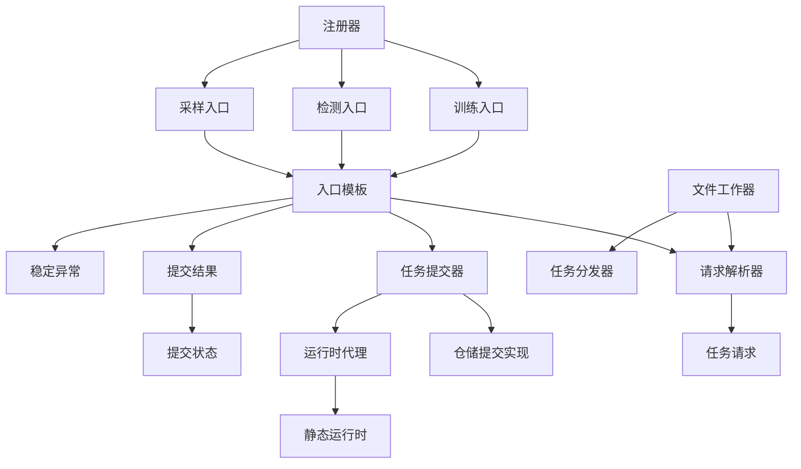
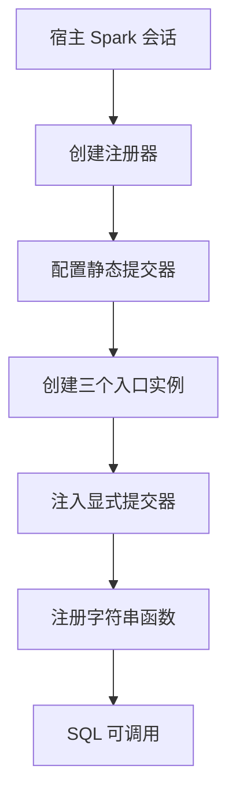
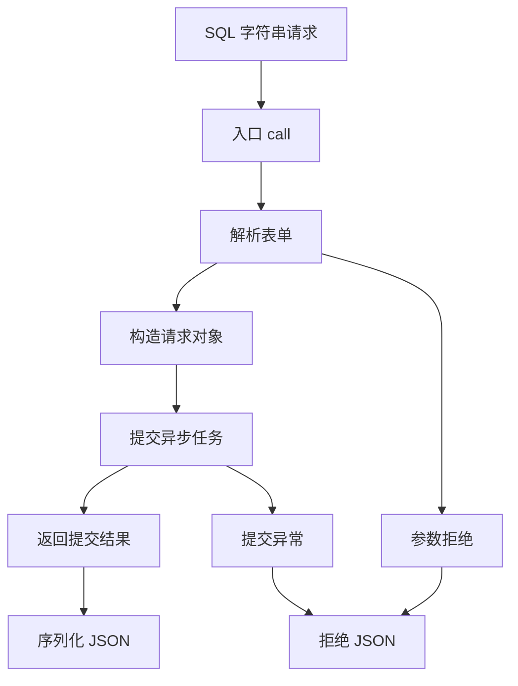
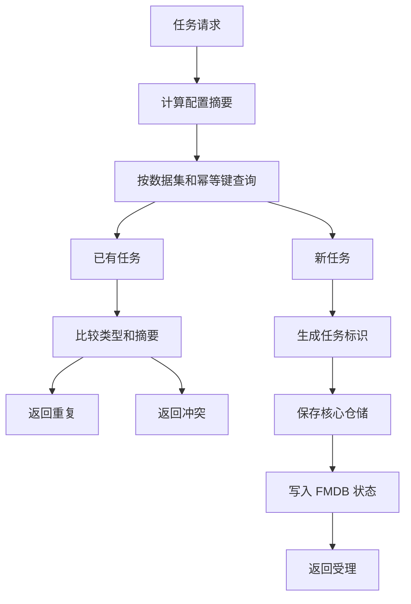
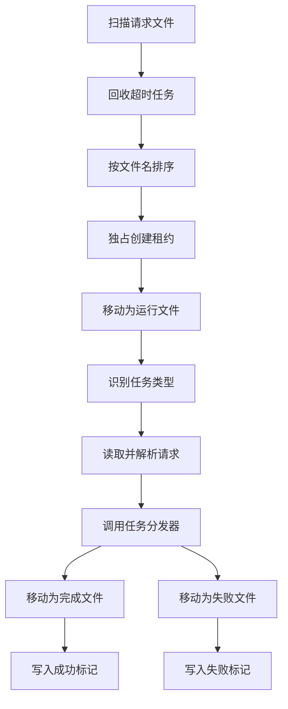

# Raha UDF 包类调用依赖关系分析

## 1. 分析范围

本文分析目录为：

```text
src/main/java/com/fiberhome/ml/raha/udf
```

分析基于 2026-07-17 10:48 的当前工作区。该包包含 16 个 Java 文件、1096 行源码，负责把 Spark SQL 字符串 UDF 请求转换为可追踪的异步任务，并提供文件队列消费能力。

本文重点回答以下问题：

1. 16 个类分别承担什么职责。
2. 三个 Spark SQL UDF 的继承和调用关系是什么。
3. 请求如何解析、校验、计算幂等摘要并持久化。
4. 无参 UDF、显式提交器和静态运行时之间是什么关系。
5. 文件任务工作器如何认领、恢复、执行和保存终态。
6. `udf` 包依赖哪些外部包，哪些外部类反向调用该包。
7. 当前实现有哪些装配边界、一致性风险和可改进点。

## 2. 包内类分组

| 分组 | 类 | 主要职责 |
| --- | --- | --- |
| SQL 入口 | `F_DW_RAHATRAIN`、`F_DW_RAHADETECT`、`F_DW_RAHASAMPLE` | 固定任务类型并暴露 Spark SQL UDF |
| 入口模板 | `AbstractRahaTableUdf` | 统一解析、提交、日志和异常转换 |
| 请求协议 | `RahaUdfRequestParser`、`RahaUdfRequest` | 解码表单、严格校验并构造任务请求 |
| 返回协议 | `RahaUdfSubmissionResult`、`RahaUdfSubmissionStatus`、`RahaUdfException` | 表达受理、重复、拒绝和稳定错误码 |
| 提交抽象 | `RahaUdfJobSubmitter` | 隔离 UDF 入口和具体任务持久化方式 |
| 仓储提交 | `RepositoryBackedRahaUdfJobSubmitter` | 幂等建单、核心仓储保存和 FMDB 状态写入 |
| 运行时代理 | `RuntimeRahaUdfJobSubmitter`、`RahaUdfRuntime` | 支持无参 UDF 从进程静态状态获取提交器 |
| 注册入口 | `RahaUdfRegistrar` | 配置运行时并向 Spark 注册三个函数 |
| 文件消费 | `FileRahaUdfJobWorker`、`RahaUdfTaskDispatcher` | 原子认领文件任务并分发到核心服务 |

## 3. 总体类依赖关系



依赖方向可以概括为：

```text
Spark SQL 入口
  -> 统一入口模板
  -> 请求解析与请求对象
  -> 提交器接口
  -> 仓储实现或运行时代理
  -> 提交结果
  -> JSON 文本
```

文件工作器复用 `RahaUdfRequestParser` 和 `RahaUdfRequest`，但不调用三个 SQL UDF，也不调用 `AbstractRahaTableUdf`。

## 4. Spark SQL 注册调用链

### 4.1 注册流程



`RahaUdfRegistrar.register` 的实际步骤如下：

1. 校验 `SparkSession` 和 `RahaUdfJobSubmitter` 非空。
2. 调用 `RahaUdfRuntime.configure` 保存进程级提交器。
3. 创建 `F_DW_RAHATRAIN`、`F_DW_RAHADETECT`、`F_DW_RAHASAMPLE`。
4. 将同一个提交器显式传给三个 UDF 实例。
5. 以 `String` 入参、`String` 返回类型注册到 Spark。
6. 任一注册操作异常时，调用 `RahaUdfRuntime.clear` 清理静态状态并重新抛出异常。

这里存在两条提交器获取路径：

| UDF 构造方式 | 实际提交器来源 | 是否依赖 `RahaUdfRuntime` |
| --- | --- | --- |
| `new F_DW_RAHATRAIN(submitter)` | 构造器显式注入 | 否 |
| `new F_DW_RAHADETECT(submitter)` | 构造器显式注入 | 否 |
| `new F_DW_RAHASAMPLE(submitter)` | 构造器显式注入 | 否 |
| 三个类的无参构造器 | `RuntimeRahaUdfJobSubmitter` | 是 |

注册器虽然配置了静态运行时，但注册到 Spark 的实例已经持有显式提交器。集成测试会在注册后清空 `RahaUdfRuntime`，已注册 UDF 仍能执行，证明主要注册链路依赖的是随 UDF 序列化的显式提交器。

无参构造器主要用于由外部框架直接反射创建 UDF 的场景。此时若宿主没有先配置 `RahaUdfRuntime`，调用会返回 `UDF_RUNTIME_UNAVAILABLE`。

### 4.2 三个入口类

三个入口类没有各自实现业务逻辑，只负责固定 `RahaTaskType`：

| 类 | 固定任务类型 | 专属必填字段 |
| --- | --- | --- |
| `F_DW_RAHATRAIN` | `TRAIN` | `annotationReference` |
| `F_DW_RAHADETECT` | `DETECT` | `modelVersion` |
| `F_DW_RAHASAMPLE` | `SAMPLE` | 正整数 `labelingBudget` |

三者均继承包可见的 `AbstractRahaTableUdf`，并创建新的 `RahaUdfRequestParser`。因此任务差异集中在请求对象的任务专属校验中，入口模板和返回协议完全复用。

## 5. 单次 UDF 调用链



`AbstractRahaTableUdf.call` 是三个入口的统一模板方法：

1. 记录开始时间。
2. 调用 `RahaUdfRequestParser.parse`。
3. 记录任务类型、数据集、调用方和请求长度，不记录完整原始请求。
4. 调用 `RahaUdfJobSubmitter.submit`。
5. 调用 `RahaUdfSubmissionResult.toJson` 返回稳定 JSON。
6. 捕获 `RahaUdfException`，保留稳定错误码和安全摘要。
7. 捕获其他运行时异常，统一转换为 `UDF_SUBMISSION_FAILED`，错误摘要只返回异常类名。

`RahaUdfSubmissionResult` 使用内部 JSON 转义逻辑，固定输出以下字段：

| 字段 | 说明 |
| --- | --- |
| `jobId` | 新建或重复任务标识；拒绝时为空 |
| `taskType` | `TRAIN`、`DETECT` 或 `SAMPLE` |
| `status` | `ACCEPTED`、`DUPLICATE` 或 `REJECTED` |
| `resultLocation` | 预期结果位置 |
| `configVersion` | 规范配置摘要 |
| `errorCode` | 稳定错误码 |
| `errorMessage` | 不包含原始输入值的错误摘要 |
| `submittedAt` | 提交响应时间 |

## 6. 请求解析与对象转换

### 6.1 `RahaUdfRequestParser`

解析器依赖关系如下：

```text
RahaDefaultConfigProvider
  -> UdfConfig.maxRequestLength
  -> RahaUdfRequestParser
  -> FormDataCodec.decode
  -> RahaUdfRequest
```

解析顺序为：

1. 检查请求字符数是否超过上限。
2. 使用 `FormDataCodec.decode` 解码 URL 表单。
3. 检查字段是否位于固定白名单。
4. 将 `sourceType` 映射为 `FMDB_TABLE` 或 `FMDB_SQL`。
5. 将 `labelingBudget` 转换为整数，缺失时使用零。
6. 构造 `RahaUdfRequest`，由请求对象继续执行必填项和跨任务校验。

允许的字段包括八个通用字段和三个任务专属字段：

| 字段 | 类型 | 适用范围 |
| --- | --- | --- |
| `datasetId` | 通用必填 | 全部任务 |
| `inputReference` | 通用必填 | 全部任务 |
| `sourceType` | 通用必填 | 全部任务 |
| `rowIdColumn` | 通用必填 | 全部任务 |
| `snapshotId` | 通用选填 | 全部任务 |
| `idempotencyKey` | 通用必填 | 全部任务 |
| `caller` | 通用必填 | 全部任务 |
| `resultTable` | 通用必填 | 全部任务 |
| `annotationReference` | 专属必填 | 仅训练 |
| `modelVersion` | 专属必填 | 仅检测 |
| `labelingBudget` | 专属必填 | 仅采样 |

未知字段返回 `UNKNOWN_UDF_ARGUMENT`。非法表单、来源类型错误、预算格式错误、必填项缺失和任务参数串用均返回 `INVALID_UDF_ARGUMENT`。

### 6.2 `RahaUdfRequest`

请求对象承担第二层语义校验和协议转换：

| 方法 | 下游依赖 | 用途 |
| --- | --- | --- |
| 构造器 | `ValueUtils`、`SparkSqlFmdbTableGateway` | 校验必填项、表名和任务专属参数 |
| `toDataLoadRequest` | `DataLoadRequest` | 转为 FMDB 数据加载请求 |
| `toCanonicalConfiguration` | `FormDataCodec` | 生成幂等配置摘要输入 |
| `toEncodedRequest` | `FormDataCodec` | 生成文件消费者可重新解析的完整请求 |
| `toJobType` | `JobType` | 映射为训练、检测或采样任务类型 |

`toCanonicalConfiguration` 不包含 `caller` 和 `idempotencyKey`。因此相同数据集和幂等键在调用方变化、其他执行配置不变时仍被视为重复任务；输入、结果表、模型版本、标注表或预算变化则会形成不同摘要并触发幂等冲突。

FMDB 表来源会在构造请求时立即校验表名。SQL 来源只校验类型和值非空，是否为只读 SQL 的检查由后续 FMDB 数据加载链路承担。

## 7. 仓储提交调用链



`RepositoryBackedRahaUdfJobSubmitter` 的直接依赖为：

| 依赖 | 用途 |
| --- | --- |
| `JobRepository` | 查询和保存核心任务 |
| `FmdbResultWriter` | 写入 FMDB 任务状态表 |
| `RahaIdGenerator` | 生成新任务标识 |
| `RahaJob` | 表达任务领域状态 |
| `HashUtils` | 对规范配置计算 SHA-256 摘要 |
| `Clock` | 生成可测试提交时间 |

提交方法使用 `synchronized`，只能避免同一个提交器实例中的并发竞态，不能提供跨 JVM 或跨 Driver 的分布式互斥。

新任务的持久化顺序为：

```text
JobRepository.save
  -> FmdbResultWriter.writeJob
```

如果核心仓储保存成功而 FMDB 写入失败，相同请求再次提交时会命中已有任务，并再次调用 `writeJob` 补写 FMDB 状态。这是一种可重试补偿路径，但核心仓储和 FMDB 之间仍不存在统一事务。

重复任务必须同时满足：

- 任务配置摘要相同。
- `JobType` 相同。

否则抛出 `IDEMPOTENCY_CONFLICT`。成功结果位置采用：

```text
fmdb://结果表/任务标识
```

`caller` 当前只进入日志，不参与授权判断。

## 8. 运行时代理调用链

无参 UDF 使用以下调用关系：

```text
F_DW 类无参构造器
  -> RuntimeRahaUdfJobSubmitter
  -> RahaUdfRuntime.requireSubmitter
  -> 实际 RahaUdfJobSubmitter
```

`RahaUdfRuntime` 使用 `volatile` 静态字段保存提交器，`configure` 和 `clear` 为同步方法，读取方法先复制当前引用再判空。

该设计的边界为：

- 状态仅在当前 JVM 内有效。
- 不同 Spark 执行进程不会共享该静态字段。
- 同一 JVM 只能保存一个全局提交器，多个 Spark 会话会相互覆盖。
- 注册失败会清理静态状态。
- 进程关闭或测试结束应主动调用 `clear`。

生产注册更可靠的方式是注入可序列化提交器，而不是依赖执行器进程中的静态运行时。

## 9. 文件任务工作器调用链



### 9.1 文件状态

以训练任务 `job-1-train` 为例：

| 文件 | 含义 |
| --- | --- |
| `job-1-train.request` | 等待认领的请求 |
| `job-1-train.lease` | 当前消费者租约 |
| `job-1-train.running` | 已认领且执行中 |
| `job-1-train.completed.request` | 执行成功的原请求 |
| `job-1-train.succeeded` | 成功时间和摘要 |
| `job-1-train.failed.request` | 执行失败的原请求 |
| `job-1-train.failed` | 脱敏失败类型 |

`runOnce` 只执行一次扫描，返回本轮成功任务数。持续消费、轮询间隔、进程保活和告警由外部宿主负责。

### 9.2 原子认领

认领顺序为先独占创建租约文件，再移动请求文件。这样可以避免多个 Windows 进程在目标替换语义下同时认领同一个请求。

请求按文件名排序，保证单次扫描中的稳定处理顺序。文件名必须包含 `-train`、`-detect` 或 `-sample`，任务类型由文件名推断，再交给解析器校验请求正文。

### 9.3 超时恢复

扫描前会回收以下运行中任务：

- 租约文件不存在。
- 租约最后修改时间加超时时间不晚于当前时间。

回收时将 `.running` 移回 `.request` 并删除租约。当前租约没有续租或心跳机制；如果单个任务执行时间超过默认 300000 毫秒，其他消费者可能将仍在执行的任务判定为过期并重复执行。

### 9.4 分发边界

`RahaUdfTaskDispatcher` 是函数式接口，只接收已经解析的 `RahaUdfRequest`，返回不包含原始数据的摘要。它不规定具体服务依赖，实际宿主可以根据任务类型调用：

- `RahaSampleService` 或主动采样编排器。
- `RahaTrainService`。
- `RahaDetectService`。

当前工程的容器验收应用通过 Lambda 实现该接口，并按 SAMPLE、TRAIN、DETECT 顺序保存进程内阶段状态。

## 10. 两种实际装配方式

### 10.1 核心仓储与 FMDB 建单

```text
RahaUdfRegistrar
  -> 三个 F_DW 入口
  -> RepositoryBackedRahaUdfJobSubmitter
  -> JobRepository
  -> FmdbResultWriter
```

该方式已经完成参数校验、幂等建单和 FMDB 任务状态写入，但不会自动调用训练、检测或采样服务。宿主还需要实现持续任务消费者。

### 10.2 共享文件队列验收

```text
RahaUdfRegistrar
  -> 三个 F_DW 入口
  -> SharedFileRahaUdfJobSubmitter
  -> request 文件
  -> FileRahaUdfJobWorker
  -> RahaUdfTaskDispatcher
  -> 核心服务
```

`SharedFileRahaUdfJobSubmitter` 不在 `udf` 包中，而是 `RahaContainerValidationApplication` 的私有内部类。它使用 `RahaUdfRequest.toEncodedRequest` 写入共享目录，并以文件已存在表示重复提交。

因此，`udf` 包本身并没有提供一个公开的“文件提交器”。`FileRahaUdfJobWorker` 与 SQL UDF 之间需要宿主提供实现 `RahaUdfJobSubmitter` 的桥接组件。

## 11. 逐类依赖清单

| 类 | 上游调用者 | 直接下游依赖 | 主要输出 |
| --- | --- | --- | --- |
| `F_DW_RAHATRAIN` | Spark SQL、注册器、测试 | `AbstractRahaTableUdf`、解析器、提交器 | 训练提交 JSON |
| `F_DW_RAHADETECT` | Spark SQL、注册器、测试 | `AbstractRahaTableUdf`、解析器、提交器 | 检测提交 JSON |
| `F_DW_RAHASAMPLE` | Spark SQL、注册器、测试 | `AbstractRahaTableUdf`、解析器、提交器 | 采样提交 JSON |
| `AbstractRahaTableUdf` | 三个 F_DW 类 | 解析器、提交器、结果、异常、日志 | 稳定 JSON 文本 |
| `RahaUdfRequestParser` | UDF 入口、文件工作器、测试 | 默认配置、表单解码、请求对象 | `RahaUdfRequest` |
| `RahaUdfRequest` | 解析器、提交器、分发器 | 数据加载请求、表名校验、表单编码 | 规范配置和执行请求 |
| `RahaUdfJobSubmitter` | UDF 入口、注册器 | 具体实现决定 | `RahaUdfSubmissionResult` |
| `RepositoryBackedRahaUdfJobSubmitter` | 宿主、测试 | 任务仓储、FMDB 写入、标识生成 | 新建或重复任务 |
| `RuntimeRahaUdfJobSubmitter` | 三个无参 UDF | `RahaUdfRuntime` | 代理提交结果 |
| `RahaUdfRuntime` | 注册器、运行时代理、测试 | 进程静态提交器 | 当前提交器引用 |
| `RahaUdfRegistrar` | 宿主应用、测试 | Spark、UDF 配置、三个入口、运行时 | 已注册函数 |
| `RahaUdfSubmissionResult` | 提交器、入口模板 | 提交状态、值校验 | JSON 文本 |
| `RahaUdfSubmissionStatus` | 提交结果 | 无 | 三种提交状态 |
| `RahaUdfException` | 解析器、请求、运行时、提交器 | 值校验 | 稳定错误码和摘要 |
| `FileRahaUdfJobWorker` | 容器应用、测试 | 文件系统、解析器、分发器、时钟 | 文件终态和成功数量 |
| `RahaUdfTaskDispatcher` | 文件工作器 | 宿主实现决定 | 业务执行摘要 |

## 12. 包外依赖

| 外部包 | 被哪些 UDF 类使用 | 依赖目的 |
| --- | --- | --- |
| `config` | 注册器、请求解析器 | 函数名和请求长度上限 |
| `service` | 入口类、请求、工作器、结果 | `RahaTaskType` 和后续服务分发语义 |
| `data` | 请求 | 映射 `JobType` |
| `data.loader` | 请求、解析器 | 来源类型和数据加载请求 |
| `fmdb` | 请求、仓储提交器 | 表名校验和任务状态写入 |
| `job` | 仓储提交器 | 任务对象和任务标识 |
| `repository` | 仓储提交器 | 幂等任务查询和保存 |
| `util` | 请求、结果、异常、提交器 | 表单、哈希和必填值校验 |
| Spark SQL | 入口模板、注册器 | UDF 接口和函数注册 |
| SLF4J | 入口、注册器、提交器、工作器 | 核心路径和异常日志 |
| Java NIO | 文件工作器 | 文件扫描、租约、移动和状态写入 |

主代码中反向调用 `udf` 包的主要类是 `RahaContainerValidationApplication`。它负责：

1. 注册三个 UDF。
2. 构造共享文件提交器。
3. 创建 `FileRahaUdfJobWorker`。
4. 实现任务分发 Lambda。
5. 按任务类型调用采样、训练和检测服务。

## 13. 错误码与状态关系

| 来源 | 错误码或状态 | 触发条件 |
| --- | --- | --- |
| 解析器 | `INVALID_UDF_ARGUMENT` | 超长、非法表单、来源或预算格式错误 |
| 解析器 | `UNKNOWN_UDF_ARGUMENT` | 出现白名单外字段 |
| 请求对象 | `INVALID_UDF_ARGUMENT` | 必填项缺失、表名非法、任务参数串用 |
| 运行时 | `UDF_RUNTIME_UNAVAILABLE` | 无参 UDF 未配置静态提交器 |
| 仓储提交器 | `IDEMPOTENCY_CONFLICT` | 同一幂等键对应不同任务配置 |
| 入口模板 | `UDF_SUBMISSION_FAILED` | 未预期仓储、FMDB 或提交器异常 |
| 提交结果 | `ACCEPTED` | 新任务成功创建 |
| 提交结果 | `DUPLICATE` | 已存在相同配置任务 |
| 提交结果 | `REJECTED` | 参数、运行时或提交过程失败 |

文件工作器不复用 `RahaUdfSubmissionStatus`。它使用文件后缀和 `SUCCEEDED`、`FAILED` 文本表达执行终态，表示的是业务消费结果，而不是 UDF 建单结果。

## 14. 当前设计风险与改进建议

### 14.1 配置一致性

`RahaUdfRegistrar` 的三个公开函数名常量从默认配置静态初始化，但实际注册名称来自实例字段 `config`。如果宿主通过 `new RahaUdfRegistrar(customConfig)` 使用自定义名称，静态常量可能与真实注册名称不一致。

同时，三个 F_DW 类和文件工作器都通过无参 `RahaUdfRequestParser` 读取默认配置中的请求长度上限。注册器传入的自定义 `UdfConfig.maxRequestLength` 没有传递给解析器。建议由注册器基于同一个 `UdfConfig` 创建解析器并注入三个 UDF，或移除容易产生双基线的自定义构造方式。

### 14.2 提交器序列化

显式提交器会随 Spark UDF 实例序列化。实际实现必须可序列化，或只包含可以在执行端安全重建的状态。`RahaUdfJobSubmitter` 接口本身没有继承 `Serializable`，编译期不会强制这一要求。

`RepositoryBackedRahaUdfJobSubmitter` 当前没有实现 `Serializable`，因此不能假设它可以直接安全注册到需要跨进程序列化的 Spark UDF。集成测试使用可序列化的静态提交器，容器验收使用可序列化的共享文件提交器。建议注册器在注册前显式校验提交器序列化能力，或将驱动端建单与执行器端 UDF 调用边界重新设计。

### 14.3 双写一致性

`RepositoryBackedRahaUdfJobSubmitter` 先保存核心仓储，再写 FMDB。补写路径可以修复部分失败，但没有统一事务、事务日志或明确的补偿任务。生产环境需要共享仓储、唯一约束和定期对账。

### 14.4 并发幂等

`synchronized` 只保护单对象。多个提交器实例、多个 JVM 或多个 Spark Driver 同时提交时，仍依赖 `JobRepository` 和 FMDB 的分布式唯一性。

### 14.5 文件租约

租约只在认领时创建，不会在长任务执行期间续租。建议增加心跳更新、执行所有权标识和完成前所有权校验，避免超时回收导致重复执行。

### 14.6 文件协议

成功摘要直接拼接为类似表单的文本，没有对 `summary` 再做 URL 编码。摘要包含连接符、等号或换行时可能产生解析歧义。建议使用 `FormDataCodec.encode` 或结构化 JSON。

文件名承担任务类型协议，改名或手工复制可能导致正文与任务类型不一致。建议将任务类型同时写入独立元数据，并在消费时交叉校验。

### 14.7 运行时全局状态

`RahaUdfRuntime` 是 JVM 全局单例，不支持多租户或多 Spark 会话隔离。更稳妥的方案是始终使用显式、可序列化提交器，并将静态运行时限制在兼容路径。

### 14.8 安全边界

当前包不执行权限判断或专用审计。`caller` 只是请求字段和日志上下文，不能证明调用方身份。鉴权、表权限、调用审计和结果访问控制必须由 FMDB 宿主或上游平台提供。

## 15. 测试覆盖

| 测试类 | 覆盖关系 |
| --- | --- |
| `RahaTableUdfIntegrationTest` | 三类 UDF、仓储提交、幂等冲突、稳定异常、Spark 注册和无参运行时 |
| `FileRahaUdfJobWorkerTest` | 并发原子认领、成功终态和过期租约恢复 |
| `RahaUdfConfigurationTest` | 请求长度上限和默认函数名 |

当前测试已经证明：

- 三类请求可以建单并写入任务表。
- 相同配置重复提交不会创建新任务。
- 配置冲突、未知参数和非法请求返回稳定错误。
- Spark 注册实例可使用序列化提交器执行。
- 两个文件工作器不会同时执行同一个正常待处理文件。
- 过期运行文件可以被恢复。

尚缺少的重点测试包括：

- 自定义 `UdfConfig` 下函数名和请求长度的一致性。
- 非序列化提交器注册到分布式 Spark 时的失败行为。
- 多 JVM 或多提交器实例并发幂等。
- FMDB 写入失败后的自动补偿和对账。
- 超出租约时间的长任务并发恢复。
- 文件摘要包含特殊字符时的协议完整性。
- 失败标记写入失败后的人工恢复路径。

## 16. 推荐源码阅读顺序

建议按以下顺序阅读，可以最快建立完整调用模型：

1. `F_DW_RAHATRAIN`、`F_DW_RAHADETECT`、`F_DW_RAHASAMPLE`。
2. `AbstractRahaTableUdf`。
3. `RahaUdfRequestParser` 和 `RahaUdfRequest`。
4. `RahaUdfJobSubmitter` 和 `RepositoryBackedRahaUdfJobSubmitter`。
5. `RahaUdfSubmissionResult`、`RahaUdfSubmissionStatus`、`RahaUdfException`。
6. `RahaUdfRegistrar`、`RuntimeRahaUdfJobSubmitter`、`RahaUdfRuntime`。
7. `FileRahaUdfJobWorker` 和 `RahaUdfTaskDispatcher`。
8. 最后阅读 `RahaContainerValidationApplication` 中的文件提交器和任务分发实现。

## 17. 总结

`udf` 包的核心设计是用 `RahaUdfJobSubmitter` 和 `RahaUdfTaskDispatcher` 两个接口，将同步 Spark SQL 调用、异步任务建单和后台业务执行分成三个边界。三个 F_DW 类非常薄，主要复杂度集中在统一入口模板、严格请求对象、幂等提交器和文件工作器。

当前 SQL 建单链路已经具备稳定参数、错误码、JSON 返回、进程内并发控制和可重试 FMDB 补写能力；文件工作器具备原子认领、稳定排序、失败留档和过期恢复能力。但生产化仍需要解决提交器序列化约束、跨进程强幂等、双写一致性、租约续期、持续消费、配置单一来源和宿主安全治理等问题。
