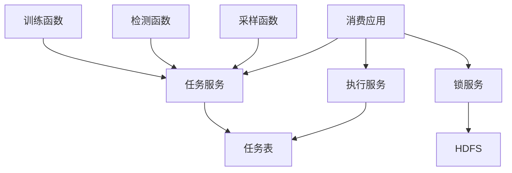
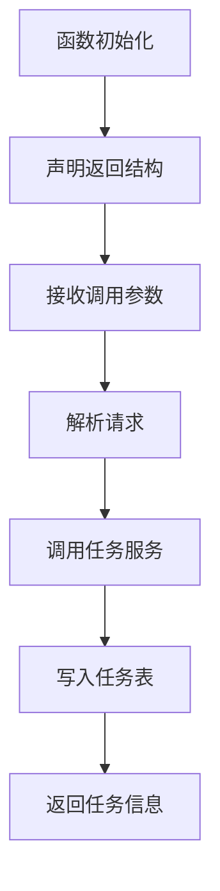
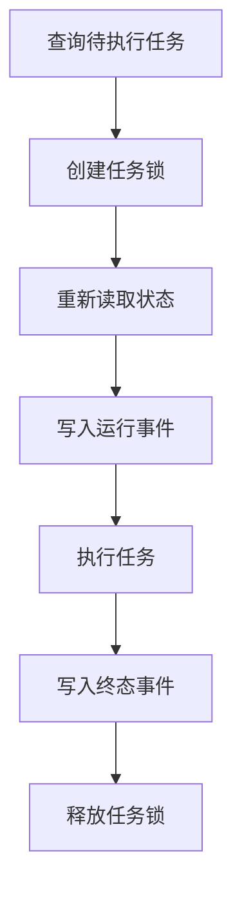
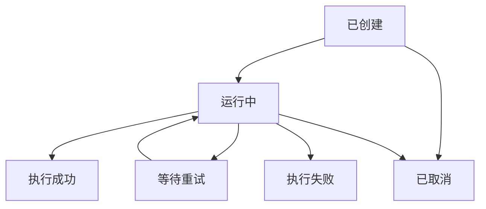

# Raha UDF 重构与 HDFS 任务锁可行性分析

## 一、分析目标

本次分析针对以下两个目标：

1. 删除生产链路对 `RahaContainerValidationApplication` 的依赖，
   对外只保留训练、检测和采样三个函数。
2. 参考 `F_DW_IMPORTEDA` 的 Hive `GenericUDF` 形式，
   让三个函数和一个独立消费应用共同调用统一服务。
3. 使用 `raha_job` ORC 表保存任务请求和状态。
4. 在消费任务前使用 HDFS 文件进行跨进程互斥，避免多个消费者重复执行同一任务。

本文只分析架构与可行性，不修改现有源码。

## 二、总体结论

整体重构方向可行，而且能够比当前文件队列方案更符合实际部署方式。

建议采用以下目标结构：



可行性结论如下：

| 设计项 | 结论 | 说明 |
| --- | --- | --- |
| 三个函数改为 `GenericUDF` | 可行 | 可以参考指定函数的生命周期和返回结构 |
| 三个函数调用统一服务 | 可行 | 函数只提交任务，不直接运行长时间算法 |
| 删除现有验收应用 | 可行 | 验收逻辑应迁移到测试，生产能力迁入服务层 |
| 新增独立消费应用 | 必须 | 异步任务需要独立进程查询并执行任务 |
| 使用 `raha_job` ORC 表 | 可行 | 必须保存完整请求，而不只是状态 |
| 所有任务名写入一个 HDFS 文件作为锁 | 不建议 | 并发改写、追加和故障恢复都很复杂 |
| 每个任务创建一个 HDFS 锁文件 | 有条件可行 | HDFS 独占建文件可以提供互斥，但仍是至少一次执行 |
| HDFS 锁保证严格一次执行 | 不可保证 | 锁超时、双写失败和进程暂停仍可能导致重复执行 |

首选建议分为两个场景：

- 如果生产上只运行一个消费应用，不需要 HDFS 任务锁，直接使用任务表即可。
- 如果允许多个消费应用并发运行，使用“一任务一锁文件”，并要求算法写入具备业务幂等性。
- 如果必须得到严格的跨进程原子认领，优先使用支持事务条件更新的任务表，
  不建议用 ORC 表和 HDFS 文件拼接出分布式事务。

## 三、参考函数的结构特点

指定参考类：

```text
F:\ai-code\dw_fmdb_udf\src\main\java\com\fiberhome\dw\F_DW_IMPORTEDA.java
```

该函数具有以下结构：

1. 继承 Hive `GenericUDF`。
2. 在 `initialize` 中校验参数数量。
3. 在 `initialize` 中取得活动 Spark 会话并设置本地执行模式。
4. 使用 `ObjectInspector` 定义返回字段。
5. 在 `evaluate` 中调用业务对象、FMDB DAO 和 HDFS。
6. 返回 `List<Object[]>`，可通过 SQL 的 `inline` 展开。
7. 通过 `CREATE FUNCTION` 直接注册 Java 类，不要求额外的程序化注册器。

这些形式可以参考，但不建议完整复制其业务执行方式。

### 3.1 可以参考的部分

- 使用 `GenericUDF` 作为 FMDB 函数入口。
- 在 `initialize` 中完成参数与返回模式声明。
- 使用活动 Spark 上下文获取 FMDB 和 HDFS 配置。
- 返回结构化结果，而不是只能返回难以查询的文本。
- 三个 Java 类分别对应三个 SQL 函数。
- 通过 `ADD JAR` 和 `CREATE FUNCTION` 独立部署。

### 3.2 不建议直接复制的部分

- 不建议在 `evaluate` 中直接执行完整训练或检测流程。
- 不建议在函数内部启动长时间 Spark 任务。
- 不建议使用全局可变上下文保存跨任务状态。
- 不建议捕获所有异常后只打印堆栈而不返回明确错误编码。
- 不建议让函数同时承担参数解析、文件处理、SQL 执行、算法执行和状态管理。

Hive 或 Spark 函数可能因为任务重试、分区执行或执行计划重算而重复调用。
如果函数直接执行有副作用的长任务，重复调用更难控制。

因此，本项目适合参考 `GenericUDF` 的“入口格式”，
但函数的实际职责应限制为“校验参数并提交幂等任务”。

## 四、推荐的三函数设计

建议对外只暴露以下三个函数类：

```text
F_DW_RAHATRAIN
F_DW_RAHADETECT
F_DW_RAHASAMPLE
```

三个函数都继承内部公共基类：

```text
AbstractRahaGenericUdf
```

公共基类不是新的 SQL 函数，只负责复用：

- 参数数量和类型校验。
- 请求解析。
- 活动 Spark 上下文获取。
- `RahaService` 创建。
- 提交日志。
- 异常到返回结果的转换。
- 返回字段模式声明。

三个具体函数只需要固定任务类型和专属参数规则。

### 4.1 推荐函数返回结构

参考 `F_DW_IMPORTEDA`，可以统一返回一行结构化数据：

| 字段 | 类型 | 含义 |
| --- | --- | --- |
| `job_id` | 字符串 | 任务唯一标识 |
| `task_type` | 字符串 | 训练、检测或采样 |
| `status` | 字符串 | 已受理、重复、拒绝或提交失败 |
| `result_location` | 字符串 | 任务结果位置 |
| `message` | 字符串 | 脱敏后的结果说明 |
| `submitted_at` | 长整数 | 提交时间 |

调用形式可以是：

```sql
SELECT inline(
    fmdbmeta.F_DW_RAHATRAIN(
        'datasetId=orders&inputReference=ods.orders_dirty&sourceType=TABLE&rowIdColumn=id&idempotencyKey=train_orders_v1&caller=data_quality&resultTable=dw.raha_result&annotationReference=dw.raha_labels'
    )
);
```

是否继续使用单个表单编码字符串，可以单独决定。

保留单字符串的优点是兼容当前请求解析器并避免大量位置参数；
改成多个位置参数的优点是 SQL 更直观，但训练、检测和采样参数数量不同，
后续新增参数也会改变函数签名。

本次重构建议先保留单字符串请求，减少同时改动的协议范围。

### 4.2 函数内部推荐流程



函数的 `evaluate` 不执行算法，只进行以下操作：

1. 取得请求文本。
2. 根据固定任务类型解析请求。
3. 生成或计算稳定任务编号。
4. 调用 `RahaService.submit`。
5. 把提交结果转换成结构化返回行。

### 4.3 活动 Spark 会话的注意事项

参考函数在初始化阶段取得 `SparkSession.active()`，并设置：

```text
spark.sql.udf.local.mode=true
```

这说明目标 FMDB 环境可能提供函数本地执行机制。
新函数可以参考这一方式，但必须在真实 FMDB 环境确认以下行为：

1. `evaluate` 是否始终在 Driver 或指定本地进程执行。
2. 函数内部是否允许执行 FMDB 表写入。
3. 函数内部执行 SQL 是否会形成嵌套 Spark 作业。
4. 同一 SQL 被重试时函数是否会重复调用。
5. `SparkSession.active()` 在函数执行进程中是否始终存在。

当前 `SparkSqlFmdbTableGateway.appendIdempotent` 会执行读取、计数和表写入，
如果这些操作在普通 Executor UDF 中触发，可能产生嵌套作业或上下文不可用问题。

因此必须用目标 FMDB 的实际部署方式完成集成测试，不能只根据本地单元测试判断可用。

## 五、统一服务设计

你提出“单个函数和应用类调用同一个服务”的方向是合理的。
建议对外提供一个 `RahaService` 门面，但内部不要把所有逻辑堆在一个大类中。

### 5.1 对外门面

```java
public interface RahaService {
    RahaJobSubmission submit(RahaTaskType taskType, String encodedRequest);

    int consumeOnce(String workerId);

    Optional<RahaJobView> findJob(String jobId);
}
```

三个函数调用 `submit`，消费应用调用 `consumeOnce`。

### 5.2 内部职责拆分

| 内部组件 | 职责 |
| --- | --- |
| `RahaJobService` | 幂等提交、任务查询和状态转换 |
| `RahaJobRepository` | `raha_job` 表读写 |
| `RahaJobLockService` | HDFS 任务锁获取、续期和释放 |
| `RahaTaskExecutionService` | 根据任务类型调用采样、训练或检测服务 |
| `RahaServiceFactory` | 根据 Spark、FMDB 和 HDFS 配置组装服务 |
| `RahaServiceImpl` | 组合以上组件并提供统一门面 |

这样既满足函数和应用调用同一服务，也不会重新形成一个新的超大应用类。

## 六、现有验收应用是否可以删除

`RahaContainerValidationApplication` 可以从生产链路删除。
它的定位本来就是容器黑盒验收，不是通用生产服务启动器。

但是不能简单删除文件而不迁移其中的生产能力。

### 6.1 可以移到测试代码的内容

- 加载脏数据样例和真值数据样例。
- 比较脏表与干净表行数。
- 生成真值差异。
- 计算准确率、召回率等验收指标。
- 输出验收摘要文件。
- 验证采样、训练和检测顺序。
- 测试组合、提交和消费三种验收模式。

这些内容属于集成测试或验收脚本，不应进入生产消费应用。

### 6.2 必须迁移到服务层的内容

- 从 FMDB 表或只读 SQL 加载数据集。
- 数据画像和特征准备。
- 根据任务类型调用采样、训练或检测服务。
- 模型、标注任务和检测结果持久化。
- 任务成功或失败状态更新。
- 日志上下文和错误脱敏。

### 6.3 必须删除的内存状态依赖

当前验收应用通过 `ValidationWorkerState` 在内存中传递：

- 采样结果。
- 训练上下文。
- 检测结果。

这种方式只适用于同一个 Java 进程中的连续验收。
新的消费应用必须能够重启，并且任意任务可能由不同进程执行。

因此以下产物必须通过稳定标识从持久化存储重新读取：

- 采样任务和人工标注结果。
- 特征字典与稀疏特征。
- 聚类结果。
- 训练模型与模型版本。
- 检测结果。
- 任务阶段和检查点。

检测任务应通过 `modelVersion` 加载已发布模型，
不能依赖上一个训练任务仍然保存在同一应用的内存中。

## 七、新消费应用设计

删除验收应用后，建议新增一个很薄的生产入口：

```text
RahaJobConsumerApplication
```

它只负责：

1. 创建或取得 Spark 会话。
2. 从配置创建 `RahaService`。
3. 生成稳定的消费者编号。
4. 按配置间隔调用 `consumeOnce`。
5. 处理关闭信号。
6. 输出启动、停止和轮询异常日志。

它不应该包含训练算法、检测算法、数据评估或大量依赖组装代码。

概念代码如下：

```java
public final class RahaJobConsumerApplication {
    public static void main(String[] args) {
        SparkSession spark = SparkSession.builder()
                .appName("Raha 任务消费者")
                .getOrCreate();
        RahaService service = RahaServiceFactory.create(spark);
        String workerId = WorkerIdProvider.current();
        while (!Thread.currentThread().isInterrupted()) {
            int consumed = service.consumeOnce(workerId);
            if (consumed == 0) {
                PollingSleeper.sleep();
            }
        }
    }
}
```

实际实现必须补充中文注释、关闭钩子、异常日志和轮询退避，
上面只表达职责边界。

## 八、`raha_job` 表设计

这张表不能只保存任务状态，还必须保存消费者重启后能够恢复执行的完整请求。

建议字段如下：

| 字段 | 类型 | 用途 |
| --- | --- | --- |
| `event_id` | 字符串 | 单次状态事件唯一标识 |
| `job_id` | 字符串 | 任务唯一标识 |
| `idempotency_key` | 字符串 | 调用方幂等键 |
| `config_version` | 字符串 | 完整任务配置摘要 |
| `task_type` | 字符串 | 训练、检测或采样 |
| `dataset_id` | 字符串 | 数据集标识 |
| `request_payload` | 字符串 | 可重新解析的完整请求 |
| `status` | 字符串 | 当前事件对应状态 |
| `status_version` | 长整数 | 同一任务的状态版本 |
| `worker_id` | 字符串 | 当前消费者编号 |
| `lock_token` | 字符串 | 本次认领令牌 |
| `attempt_count` | 整数 | 执行次数 |
| `created_at` | 长整数 | 任务创建时间 |
| `started_at` | 长整数 | 本次开始时间 |
| `updated_at` | 长整数 | 状态更新时间 |
| `finished_at` | 长整数 | 终态时间 |
| `next_retry_at` | 长整数 | 下次允许重试时间 |
| `result_location` | 字符串 | 结果位置 |
| `result_summary` | 字符串 | 脱敏执行摘要 |
| `error_code` | 字符串 | 失败编码 |
| `error_message` | 字符串 | 脱敏失败说明 |
| `created_date` | 字符串 | 表分区日期 |

概念建表语句如下，具体语法需根据 FMDB 版本调整：

```sql
CREATE TABLE IF NOT EXISTS dw.raha_job (
    event_id STRING,
    job_id STRING,
    idempotency_key STRING,
    config_version STRING,
    task_type STRING,
    dataset_id STRING,
    request_payload STRING,
    status STRING,
    status_version BIGINT,
    worker_id STRING,
    lock_token STRING,
    attempt_count INT,
    created_at BIGINT,
    started_at BIGINT,
    updated_at BIGINT,
    finished_at BIGINT,
    next_retry_at BIGINT,
    result_location STRING,
    result_summary STRING,
    error_code STRING,
    error_message STRING
)
PARTITIONED BY (created_date STRING)
STORED AS ORC;
```

### 8.1 为什么建议使用事件追加模式

当前项目的表网关主要提供幂等追加，不具备明确的跨进程原子更新保证。
对普通 ORC 表使用状态事件追加，比每次覆盖整行更符合现有能力。

同一个任务可能依次写入：

```text
CREATED
RUNNING
SUCCEEDED
```

查询当前状态时，根据 `job_id` 取最大的 `status_version`。

### 8.2 事件追加模式的限制

- 查询当前任务需要窗口排序或聚合。
- 任务每次状态变化都会增加一行。
- 高频单行写入可能产生 ORC 小文件。
- 状态版本生成仍需在任务锁内完成。
- 并发提交相同幂等键还需要单独去重。

需要定期执行小文件合并、历史归档和分区清理。

## 九、HDFS 锁方案分析

### 9.1 不要使用一个共享任务名文件

不建议采用以下模式：

```text
/raha/locks/running_jobs.txt
```

然后让所有消费者读取、追加和删除其中的任务名。

原因如下：

1. 多个消费者并发修改同一文件容易覆盖彼此结果。
2. HDFS 不适合频繁随机更新文件中的一小段内容。
3. 删除某个任务名通常需要重写整个文件。
4. 一个损坏或未关闭的文件会阻塞全部任务。
5. 锁粒度是全局的，不同任务也会互相影响。
6. 很难为单个任务独立设置超时、持有者和重试信息。

### 9.2 推荐一任务一锁文件

建议使用以下目录结构：

```text
hdfs:///raha/locks/submit/<idempotencyHash>.lock
hdfs:///raha/locks/execution/<jobId>.lock
```

提交锁用于串行化相同幂等键的并发提交。
执行锁用于保证同一时刻只有一个消费者执行指定任务。

Hadoop 文件系统规范要求：在 `overwrite=false` 时，
文件存在检查与创建应作为原子操作；HDFS 可以利用这一语义进行独占创建。
但该保证不能直接推广到对象存储适配器。

官方说明：

- [Hadoop 文件系统原子性说明](https://hadoop.apache.org/docs/r3.4.0/hadoop-project-dist/hadoop-common/filesystem/introduction.html)
- [Hadoop 文件系统操作规范](https://hadoop.apache.org/docs/r3.4.0/hadoop-project-dist/hadoop-common/filesystem/filesystem.html)

所以配置必须明确使用真正的 `hdfs` 文件系统，
不能未经验证就替换为 `s3a`、对象存储或其他兼容协议。

### 9.3 锁文件建议内容

每个锁文件至少记录：

```text
jobId=job-001
workerId=worker-host-a-1234
lockToken=8f7c...
acquiredAt=1784260000000
leaseUntil=1784263600000
```

锁令牌每次认领都必须重新生成，不能只使用消费者编号。

### 9.4 推荐认领流程



详细步骤：

1. 从 `raha_job` 查询当前状态为 `CREATED` 或允许重试的任务。
2. 使用 `FileSystem.create(path, false)` 或经过验证的等价接口独占创建锁文件。
3. 创建失败表示其他消费者已经持有锁，当前消费者跳过。
4. 创建成功后重新读取任务最新状态，防止第一次查询结果已经过期。
5. 状态仍可执行时写入 `RUNNING` 事件。
6. 调用执行服务。
7. 写入 `SUCCEEDED` 或 `FAILED` 事件。
8. 校验锁令牌后删除锁文件。

### 9.5 HDFS 写入租约不等于业务任务租约

HDFS 对“仍然打开并正在写入的文件”具有客户端写入租约和恢复能力。
锁文件完成写入并关闭后，业务上依赖的是“路径存在”，不是仍被 HDFS 写入租约保护。

HDFS 的 `recoverLease` 主要用于恢复未正常关闭的写入文件，
不能自动判断 Raha 算法任务是否仍然健康。

官方说明：

- [Hadoop 租约恢复接口](https://hadoop.apache.org/docs/current/hadoop-project-dist/hadoop-common/filesystem/leaserecoverable.html)
- [HDFS 写入租约说明](https://hadoop.apache.org/docs/current/hadoop-project-dist/hadoop-hdfs-client/build/source/hadoop-hdfs-project/hadoop-hdfs-client/target/api/index-all.html)

因此必须自行定义业务锁超时和恢复策略。

### 9.6 锁续期和超时恢复

训练任务可能持续较长时间，固定锁超时很容易误判。
建议由消费应用定期刷新锁的修改时间或独立心跳记录。

恢复者判断锁过期前应检查：

1. 锁文件最后心跳时间。
2. `raha_job` 最新状态和更新时间。
3. 当前消费者编号。
4. 任务允许的最长静默时间。
5. 是否已经存在成功或失败终态。

删除过期锁后，任务可以再次执行。

但是如果原消费者只是长时间暂停而没有真正退出，
恢复者删除锁后可能出现两个消费者同时执行。
普通 HDFS 文件锁没有数据库式栅栏令牌，无法彻底阻止旧消费者继续提交结果。

所以执行服务仍必须以 `job_id`、模型版本和结果业务主键实现幂等写入。

## 十、任务表与 HDFS 的双写风险

`raha_job` 和 HDFS 属于两个独立系统，无法在一个本地事务中同时提交。

必须处理以下异常组合：

| 场景 | 可能结果 | 恢复要求 |
| --- | --- | --- |
| 锁创建成功，运行状态写入失败 | 任务仍显示待执行但存在锁 | 锁超时后删除并重试 |
| 运行状态写入成功，进程立即退出 | 任务显示运行中并存在锁 | 心跳超时后重新执行 |
| 业务执行成功，成功状态写入失败 | 业务结果存在但任务仍运行 | 按任务编号幂等检查后补写终态 |
| 成功状态写入成功，锁删除失败 | 终态任务仍有锁 | 清理程序发现终态后删除锁 |
| 锁被误判过期，原任务仍在执行 | 两个消费者同时执行 | 业务结果写入必须幂等 |
| 表查询暂时不可用 | 无法判断任务状态 | 保留锁并停止执行，不可盲目删除 |
| HDFS 暂时不可用 | 无法取得互斥锁 | 不得消费任务，只记录错误并退避 |

这说明 HDFS 锁可以降低并发重复执行概率，
但不能把 ORC 表和 HDFS 组合成严格一次的分布式事务。

实际可实现的语义应定义为：

```text
至少执行一次，结果幂等落盘
```

而不是：

```text
算法严格只运行一次
```

## 十一、是否真的需要多个消费者

如果当前业务量不大，可以明确只部署一个 `RahaJobConsumerApplication`。

单消费者方案的优点：

- 不需要每个任务都创建 HDFS 锁。
- 不需要锁心跳和锁超时。
- 不存在两个消费者同时认领同一任务。
- 代码和运维最简单。
- ORC 表只负责请求、状态和历史记录。

仍需处理的情况：

- 消费应用崩溃后的运行任务恢复。
- 业务执行成功但终态写入失败。
- SQL 函数重复提交。
- 消费应用重复启动的部署错误。

可以使用一个全局应用锁防止误启动第二个消费者：

```text
hdfs:///raha/locks/consumer-leader.lock
```

但全局锁仍需要心跳和异常恢复。

如果部署平台本身能够保证副本数为一，
则不需要为了理论上的多工作器提前实现复杂的任务级 HDFS 锁。

## 十二、推荐状态机

建议使用以下任务状态：

```text
CREATED
RUNNING
RETRY_WAIT
SUCCEEDED
FAILED
CANCELLED
```

允许的主要转换：



规则如下：

1. 成功、失败和取消属于终态，不能被后续状态覆盖。
2. 只有取得任务锁的消费者可以写入运行状态。
3. 运行状态必须记录消费者编号和锁令牌。
4. 可恢复异常进入等待重试，并计算下次执行时间。
5. 不可恢复异常直接进入失败终态。
6. 成功写入必须携带结果位置和脱敏摘要。

## 十三、幂等设计

### 13.1 提交幂等

任务逻辑唯一键建议为：

```text
dataset_id + task_type + idempotency_key
```

相同逻辑键和相同 `config_version` 重复提交时返回已有任务。
相同逻辑键但不同配置版本应返回幂等冲突。

普通 ORC 表没有唯一约束。
如果函数可能并发提交相同幂等键，需要：

1. 使用幂等键哈希对应的 HDFS 提交锁。
2. 取得锁后重新查询任务表。
3. 再决定返回已有任务或追加创建事件。

### 13.2 执行幂等

所有业务产物应使用稳定主键去重：

- 模型：数据集、字段、模型版本。
- 检测结果：任务编号、单元格编号、模型版本。
- 标注任务：任务编号、轮次、行编号。
- 特征和聚类：配置版本、快照、阶段编号。

消费应用重试同一任务时，应返回或覆盖同一逻辑产物，
不能生成无法关联的新结果。

## 十四、推荐保留和删除的类

### 14.1 对外保留或重写

- `F_DW_RAHATRAIN`
- `F_DW_RAHADETECT`
- `F_DW_RAHASAMPLE`
- `RahaUdfRequest`
- `RahaUdfRequestParser`
- `RahaUdfSubmissionResult`
- 三个现有核心算法服务及其依赖

### 14.2 建议新增

- `AbstractRahaGenericUdf`
- `RahaService`
- `RahaServiceImpl`
- `RahaServiceFactory`
- `RahaJobRepository`
- `OrcRahaJobRepository`
- `RahaJobLockService`
- `HdfsRahaJobLockService`
- `RahaTaskExecutionService`
- `RahaJobConsumerApplication`
- `RahaJobEvent`
- `RahaJobView`

### 14.3 新架构稳定后可删除

- `RahaContainerValidationApplication` 的生产源码版本
- `FileRahaUdfJobSubmitter`
- `FileRahaUdfJobWorker`
- `RuntimeRahaUdfJobSubmitter`
- `RahaUdfRuntime`
- `RepositoryBackedRahaUdfJobSubmitter`

如果完全采用 `CREATE FUNCTION` 注册，可以不再依赖 `RahaUdfRegistrar`。
但是否删除应根据是否仍需要程序化注册测试决定。

### 14.4 建议迁移到测试目录

验收应用中的数据准备、真值比较、指标计算和完整链路验证，
可以改造成集成测试或独立验收工程，不建议全部丢弃。

## 十五、依赖和打包影响

当前工程没有直接声明 Hadoop 客户端依赖，
Hadoop 文件系统类通常由 `spark-hive` 的传递依赖提供，且 Spark 依赖使用 `provided` 范围。

新增 HDFS 锁实现时需要确认：

1. FMDB 运行环境已经提供兼容版本的 Hadoop 客户端。
2. 编译期是否需要显式声明 Hadoop 依赖为 `provided`。
3. Shade Jar 不应打入与 FMDB 冲突的 Hadoop 实现。
4. Kerberos 凭证是否能在函数进程和消费应用中获得。
5. HDFS 锁目录是否具有创建、读取、更新时间和删除权限。
6. 函数与消费应用是否使用同一个 HDFS 命名空间。

## 十六、两种最终实现方案

### 16.1 方案一：单消费者任务表

组成：

```text
三个 GenericUDF
RahaService
raha_job ORC 表
一个 RahaJobConsumerApplication
```

不使用任务级 HDFS 锁。

优点：

- 结构最简单。
- 工作器和文件状态机可以删除。
- 运维只需要任务表和一个消费进程。
- 符合目前业务对多消费者需求不明确的实际情况。

缺点：

- 无法横向扩容消费能力。
- 消费应用故障期间任务暂停。
- 必须由部署平台保证只启动一个实例。

推荐程度：高。

### 16.2 方案二：多消费者任务表加 HDFS 锁

组成：

```text
三个 GenericUDF
RahaService
raha_job ORC 表
多个 RahaJobConsumerApplication
HDFS 提交锁和任务锁
```

优点：

- 可以运行多个消费者。
- 单个消费者退出后其他消费者可以继续处理。
- 不要求 ORC 表支持行级锁。

缺点：

- 表和 HDFS 存在双写一致性问题。
- 必须实现锁续期、超时恢复和清理程序。
- 只能达到至少一次执行。
- 仍然要求所有业务写入幂等。
- 实现复杂度可能接近当前文件工作器。

推荐程度：中，只有确认需要多消费者时再实施。

### 16.3 方案三：事务任务表

如果 FMDB 或其他任务仓储支持原子条件更新，可以直接认领：

```sql
UPDATE raha_job
SET status = 'RUNNING',
    worker_id = :workerId,
    lock_token = :lockToken,
    updated_at = :now
WHERE job_id = :jobId
  AND status IN ('CREATED', 'RETRY_WAIT')
  AND status_version = :expectedVersion;
```

只有实际更新一行的消费者认领成功。

优点：

- 不需要 HDFS 锁。
- 状态和认领在一个存储系统内。
- 故障恢复和运维更直接。

缺点：

- 依赖 FMDB 或外部数据库提供可靠事务语义。
- 普通 ORC 追加表通常不能直接满足。

如果平台支持，推荐程度最高。

## 十七、推荐实施顺序

### 第一阶段：确认函数执行环境

1. 用最小 `GenericUDF` 验证活动 Spark 会话。
2. 验证本地执行模式。
3. 验证函数内部写入 `raha_job`。
4. 验证 SQL 重试时的重复调用行为。
5. 确定返回 `List<Struct>` 的实际类型兼容性。

### 第二阶段：建立任务表和仓储

1. 创建 `raha_job` 测试表。
2. 实现完整请求写入。
3. 实现按幂等键查询。
4. 实现当前状态视图。
5. 验证 ORC 小文件和查询延迟。

### 第三阶段：重写三个函数

1. 改为 `GenericUDF`。
2. 统一调用 `RahaService.submit`。
3. 返回结构化任务信息。
4. 保持三类参数的严格校验。
5. 验证独立 `CREATE FUNCTION` 注册。

### 第四阶段：迁移执行逻辑

1. 从验收应用中提取数据加载和任务分发。
2. 建立 `RahaTaskExecutionService`。
3. 删除对 `ValidationWorkerState` 的依赖。
4. 保证模型、标注和特征可持久化恢复。
5. 新增最小消费应用。

### 第五阶段：先上线单消费者

1. 部署副本数固定为一。
2. 验证提交、消费、重启和失败恢复。
3. 验证重复执行时结果幂等。
4. 观察任务量和消费延迟。

### 第六阶段：按实际需求增加锁

只有确认单消费者吞吐或可用性不足时，才增加：

1. HDFS 提交锁。
2. HDFS 任务锁。
3. 锁心跳。
4. 超时清理。
5. 多消费者并发测试。

## 十八、必须完成的验收测试

### 18.1 三函数测试

- 参数数量错误时初始化失败。
- 参数类型错误时初始化失败。
- 合法请求返回固定结构。
- 三个函数分别固定正确任务类型。
- 未知参数被拒绝。
- 同一请求重复调用返回同一任务。
- 同一幂等键不同配置返回冲突。

### 18.2 任务表测试

- 创建事件保存完整请求。
- 最新状态查询正确。
- 终态不会被后续运行状态覆盖。
- 分区查询和历史清理正确。
- 大量单行追加后的查询性能可接受。

### 18.3 HDFS 锁测试

- 两个线程同时创建同一锁时只有一个成功。
- 两个独立进程同时认领时只有一个成功。
- 不同任务可以并行取得不同锁。
- 持有者正常释放锁。
- 非持有者不能误删有效锁。
- 进程异常退出后锁可以恢复。
- 超时恢复时旧消费者结果不会破坏终态。
- 明确验证使用的是 HDFS，不是对象存储适配器。

### 18.4 故障恢复测试

- 锁创建后状态写入失败。
- 运行状态写入后进程退出。
- 算法成功后终态写入失败。
- 终态成功后锁删除失败。
- FMDB 暂时不可用。
- HDFS 暂时不可用。
- 消费应用重启后继续处理任务。

## 十九、最终建议

重新设计 UDF 是合理的，当前验收应用确实承担了过多生产链路之外的职责。

建议最终保留清晰的两条链路：

```text
函数链路：三个 GenericUDF -> RahaService.submit -> raha_job
消费链路：RahaJobConsumerApplication -> RahaService.consumeOnce -> 三个核心服务
```

`RahaContainerValidationApplication` 应退出生产架构，
其中验收逻辑迁移到测试，执行组装能力迁移到服务层。

`raha_job` 应保存完整请求和状态事件，而不只是保存一个状态字段。

对于并发控制，不能把所有任务名维护在一个 HDFS 文件中。
如果确实需要多消费者，应采用“一任务一锁文件”，并接受至少一次执行语义，
通过业务幂等保证最终结果一致。

从当前需求出发，最稳妥且可读性最好的落地顺序是：

1. 先完成三个 `GenericUDF`、统一服务、任务表和单消费应用。
2. 先部署一个消费者，不实现任务级 HDFS 锁。
3. 通过任务量和可用性数据确认是否真的需要多消费者。
4. 只有确有需要时，再增加按任务划分的 HDFS 锁。
5. 如果平台支持事务条件更新，优先使用事务任务表替代 HDFS 锁。

这样可以先解决当前代码结构和可读性问题，
同时避免为了尚未出现的多消费者需求再次引入一套复杂的文件状态机。
