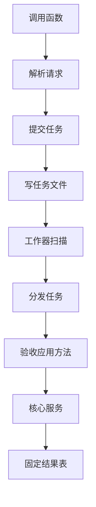
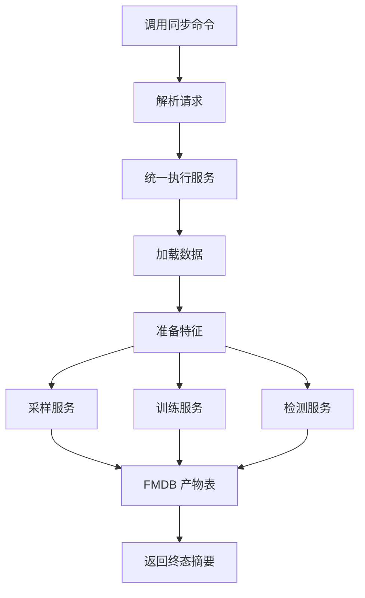
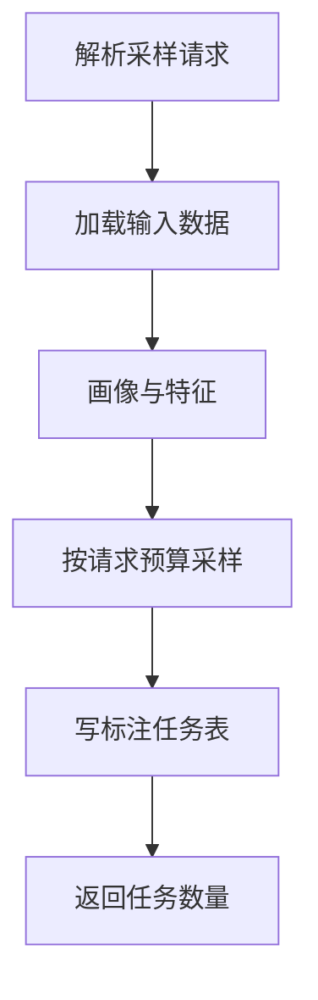
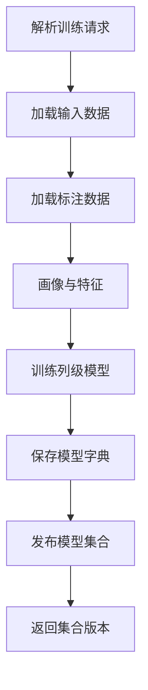
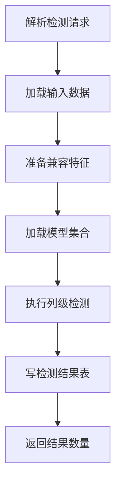
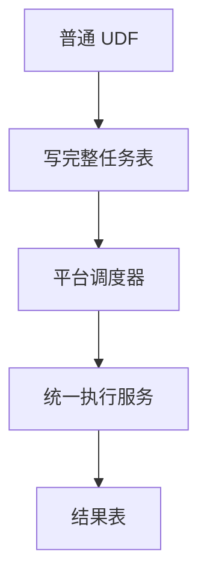

# Raha 三函数同步可行性、轻量化与代码删除完整分析

## 一、分析目标

本文针对以下疑问给出基于当前源码的完整结论：

1. `F_DW_RAHATRAIN`、`F_DW_RAHASAMPLE`、`F_DW_RAHADETECT` 为什么不能直接同步执行。
2. 用户通过 `ADD JAR` 注册函数后，能否调用训练、采样和检测并直接得到最终结果。
3. 当前任务提交、文件队列、工作器、任务分发和验收应用为什么显得复杂。
4. “请求未完整贯通到核心服务”具体缺少什么，风险有多大。
5. `RahaContainerValidationApplication` 是否必须保留。
6. 哪些代码可以立即移出生产包，哪些代码必须在替代实现完成后删除，哪些算法代码必须保留。
7. 如何改造成真正轻量、字段完整贯通、可在生产使用的结构。

本文基于 2026 年 7 月 17 日 14 时 19 分的工作区源码。分析对象是当前实际代码，不把历史设计文档中的计划能力当成已落地能力。

---

## 二、结论先行

### 2.1 业务接口可以同步，但当前普通标量 UDF 不能安全地直接执行完整算法

如果“同步”指调用方一直等待，直到采样任务已经生成、训练模型已经产出、检测结果已经写表，然后函数返回最终状态和结果位置，那么这种业务语义是可以设计的。

但是，当前三个函数是普通 Spark 或 Hive 标量 UDF。把依赖 Spark 会话、数据集动作、并行训练和 FMDB 写表的完整流程直接塞进 `evaluate` 或 `call`，不具备可靠的生产执行条件。

核心原因不是算法不能同步，而是当前入口类型选错了执行位置：

| 问题 | 当前普通标量 UDF 的实际约束 | 对完整算法的影响 |
| --- | --- | --- |
| 执行位置 | 函数表达式通常在 Spark 任务执行进程中求值，不保证在驱动进程执行 | 核心服务依赖驱动进程持有的 Spark 会话 |
| 调用次数 | SQL 优化、分区、失败重试和重复求值可能造成零次、一次或多次调用 | 训练、写表和发布模型都是有副作用操作，不能假定只执行一次 |
| 输入粒度 | 标量 UDF 按输入行求值 | Raha 的训练、采样和检测处理整张表，不是处理当前一行 |
| 返回粒度 | 每个输入值返回一个标量字符串 | 检测可能产生大量单元格结果，只适合返回摘要和结果表位置 |
| 依赖装配 | `ADD JAR` 只让类可见，`CREATE FUNCTION` 只按类名实例化函数 | 不会自动注入 Spark 会话、仓储、模型表、标注表和结果写入器 |
| 生命周期 | 临时函数跟随会话，实例生命周期由执行引擎控制 | 不能用函数对象内存保存跨采样、训练和检测的业务状态 |

因此需要区分两个结论：

1. **同步业务结果可以实现。**
2. **在当前普通标量 UDF 内直接启动完整 Spark 算法，不建议实现。**

### 2.2 `RahaContainerValidationApplication` 不是生产必需组件

该类是容器验收程序，职责包括：

- 从 CSV 加载固定脏数据和真值数据。
- 创建临时表和进程内仓储。
- 模拟采样后的人工标注。
- 在同一进程顺序执行采样、训练和检测。
- 计算精确率、召回率和阈值。
- 写出对齐产物和验收摘要。
- 验证文件队列提交端与工作器。

它不应作为生产应用层继续存在。正确处置是把验收逻辑移到集成测试或独立验收工程，把其中少量真正需要的依赖装配能力迁入一个普通服务工厂。生产交付不需要这个 `main` 类。

### 2.3 当前“未完整贯通”属于最高优先级问题

现在不是少量字段漏传，而是函数契约和算法真实执行之间存在两套输入：

- UDF 请求解析了用户传入的表、标注、模型、预算和结果位置。
- 验收分发器实际使用启动时固定加载的数据集、配置预算、内存标签、内存模型元数据和固定结果表。

这意味着当前链路只能证明各组件分别能运行，不能证明用户提交的请求会按请求内容执行。生产上线前必须先解决该问题。

### 2.4 当前复杂度主要来自三套并存但没有统一的编排

当前工程同时存在：

1. UDF 异步提交与文件队列。
2. `RahaJobOrchestrator`、阶段处理器和检查点体系。
3. `RahaContainerValidationApplication` 手写的采样、训练、检测闭环。

三套结构没有形成一条生产主链。文件工作器最终只调用一个接口，通用任务编排器没有接到三个高层服务，验收应用又绕过前两者自己保存状态。这是代码看起来复杂的主要原因。

### 2.5 首选轻量化方向

首选结构取决于 FMDB 是否提供“保证在驱动进程执行的存储过程、命令或表级函数扩展”。

| FMDB 平台能力 | 推荐方案 | 是否需要独立应用 |
| --- | --- | --- |
| 支持驱动进程命令或存储过程 | 三个同步命令直接调用统一执行服务 | 不需要 |
| 只支持普通 Hive 或 Spark 标量 UDF | UDF 只建单，由平台现有调度器执行 | 本工程不一定需要，但平台必须有执行载体 |
| 只支持普通标量 UDF，又要求同步等待 | UDF 同步调用外部服务 | 需要外部服务，不符合“完全不需要应用”的目标 |

若平台确认支持第一种能力，可以删除当前文件队列、工作器、任务分发器、运行时提交器和大部分通用任务状态代码。

若平台只支持普通标量 UDF，就不能同时满足“无执行载体、完整 Spark 算法、同步最终结果”三个条件。

---

## 三、当前真实架构及复杂度来源

### 3.1 当前 UDF 主链



对应源码如下：

| 环节 | 主要代码 | 当前行为 |
| --- | --- | --- |
| 函数入口 | `AbstractRahaTableUdf.call` | 解析请求，调用提交器，返回提交结果 |
| 独立提交 | `FileRahaUdfJobSubmitter.submit` | 写 `.receipt` 和 `.request` 文件 |
| 文件消费 | `FileRahaUdfJobWorker.runOnce` | 扫描、租约、认领、恢复、执行和归档 |
| 任务分发 | `RahaUdfTaskDispatcher.dispatch` | 只定义一个函数式接口，没有通用生产实现 |
| 唯一完整分发示例 | `RahaContainerValidationApplication.dispatchUdfTask` | 按任务类型调用验收应用内部方法 |
| 核心算法 | `RahaSampleService`、`RahaTrainService`、`RahaDetectService` | 接收已经准备好的强类型对象，不接收 UDF 请求 |

### 3.2 为什么文件工作器有四百多行

`FileRahaUdfJobWorker` 不只是“读取一个文件并调用服务”，它还自己实现了一个简化任务队列：

- 扫描等待文件。
- 创建租约文件。
- 原子认领请求。
- 标记运行状态。
- 回收过期租约。
- 处理多工作器竞争。
- 保存成功摘要。
- 保存失败摘要。
- 归档原始请求。
- 从文件名恢复任务类型。

这些复杂度不是 Raha 算法要求，而是选择文件系统承担任务队列后产生的基础设施复杂度。

### 3.3 为什么又有一套通用任务编排器

`job`、`job.stage` 和 `checkpoint` 包实现了另一套能力：

- 任务状态机。
- 阶段状态机。
- 失败分类。
- 阶段重试。
- 阶段处理器。
- 检查点执行和恢复。

但 `RahaJobOrchestrator` 没有被三个 UDF、三个高层服务或验收应用调用。它主要由迭代测试直接组装。

这套代码不是当前 UDF 文件工作器的下一层，也不是 `RahaTrainService` 的内部实现。它是一条并行存在的历史编排路径。

### 3.4 验收应用又实现了第三套状态衔接

`ValidationWorkerState` 在内存中保存：

- 采样结果。
- 训练上下文。
- 检测结果。

训练分支要求 `state.sampled` 已存在，检测分支要求 `state.training` 已存在。这种方式只能在同一进程、同一应用对象、固定顺序下工作，无法用于三个独立 SQL 调用。

因此当前不是“分层很多但职责清楚”，而是三套编排并存且生产主链未选定。

---

## 四、同步执行的完整可行性分析

### 4.1 从用户体验看，同步是合理的

用户希望下面的行为是合理的：

1. 注册一次函数或命令。
2. 调用采样，等待采样任务写入指定表，返回最终数量和位置。
3. 人工完成标注。
4. 调用训练，等待模型训练和发布完成，返回模型集合版本。
5. 调用检测，等待结果写入指定表，返回最终数量和位置。

这里的“同步”不代表把全部检测明细塞进一个字符串。合理返回值应是最终状态、数量、版本、耗时和结果表位置，明细仍写入 FMDB 表。

### 4.2 采样、训练和检测仍是三个独立业务步骤

不能把三者误解为一次连续调用：


采样完成后通常存在人工标注等待时间。单次采样调用可以同步返回“采样已经完成”，但不能自动同步到训练，除非调用前已经有可用标注。

### 4.3 当前核心服务确实需要驱动进程能力

源码中存在以下直接证据：

| 源码位置 | 依赖行为 |
| --- | --- |
| `FmdbDatasetLoader` | 调用 `sparkSession.table` 或 `sparkSession.sql` |
| `RahaTrainService` | 对输入数据执行 `persist` 和 `count` |
| `SparkMllibLogisticRegressionTrainer` | 使用 Spark 机器学习训练器 |
| `SparkSqlFmdbResultWriter` | 使用 Spark 会话构造数据集并写表 |
| `FmdbModelStore` | 使用 Spark 会话读写模型和字典表 |

这些代码不是普通纯 Java 计算。函数若在 Spark 任务执行进程中求值，无法假定能取得合法的驱动进程 Spark 会话，也不应在一个 Spark 任务内部再次发起整表 Spark 作业。

### 4.4 改成 `GenericUDF` 也不会自动解决问题

`GenericUDF` 可以改善参数类型检查、初始化和返回类型声明，但它仍然是 Hive 表达式求值入口。更换基类不会自动产生以下能力：

- 保证只在驱动进程调用一次。
- 自动注入 Spark 会话。
- 自动构建核心服务依赖。
- 自动获得跨调用持久状态。
- 自动提供副作用的恰好一次语义。

所以“把三个类改成 `GenericUDF`”和“让完整算法同步可靠执行”是两个不同问题。

### 4.5 `ADD JAR` 不等于启动 Raha 运行环境

当前独立注册方式执行：

```sql
ADD JAR /path/to/fmdb-udf-raha-all.jar;

CREATE TEMPORARY FUNCTION F_DW_RAHATRAIN
AS 'com.fiberhome.ml.raha.udf.F_DW_RAHATRAIN';
```

该过程只完成类加载和函数登记。它不会：

- 启动 `RahaContainerValidationApplication`。
- 创建 `FmdbDatasetLoader`。
- 创建各类仓储适配器。
- 确定模型表和字典表。
- 启动任务消费者。
- 建立人工标注读取协议。
- 建立模型发布状态表。

当前无参构造器只能创建 `RuntimeRahaUdfJobSubmitter`，后者最多退化为文件提交器。这正是目前只能返回 `ACCEPTED` 的直接原因。

### 4.6 四种同步方案对比

| 方案 | 可行性 | 复杂度 | 结论 |
| --- | --- | --- | --- |
| 普通标量 UDF 内直接跑核心服务 | 低 | 表面简单，运行风险高 | 不采用 |
| 普通标量 UDF 提交后轮询任务终态 | 技术上可做 | 仍保留队列，还占用执行线程 | 不采用 |
| 普通标量 UDF 同步调用外部服务 | 可行 | 需要长期服务、超时和重试 | 仅在平台无驱动命令时考虑 |
| 驱动进程命令或存储过程直接调用服务 | 高 | 最轻 | 首选 |

---

## 五、请求未贯通到核心服务的完整问题清单

### 5.1 公共字段和专属字段的实际去向

| UDF 请求字段 | 当前解析与校验 | 当前算法是否使用 | 生产后果 |
| --- | --- | --- | --- |
| `taskType` | 由三个函数类固定 | 分发器使用 | 已贯通 |
| `datasetId` | 必填并进入请求 | 验收应用使用固定常量 | 用户值不决定实际数据集 |
| `inputReference` | 必填并校验 | 未调用 `toDataLoadRequest` | 用户指定表或 SQL 没有进入算法 |
| `sourceType` | 只允许表或 SQL | 未用于实际加载 | 表和 SQL 的选择无效 |
| `rowIdColumn` | 必填 | 验收应用使用固定常量 | 用户字段不决定真实行标识 |
| `snapshotId` | 可选 | 验收应用使用固定常量 | 请求快照不能保证可追溯性 |
| `idempotencyKey` | 用于文件名或任务仓储 | 不进入核心服务 | 只能防重复提交，不能保证重复执行安全 |
| `caller` | 记录日志 | 不进入核心审计 | 没有形成算法执行审计 |
| `resultTable` | 必填并校验 | 验收应用写固定 `RESULT_TABLE` | 结果可能不在用户指定位置 |
| `annotationReference` | 训练必填 | 没有加载该表 | 训练函数并未使用用户标注 |
| `modelVersion` | 检测必填 | `RahaDetectRequest` 没有该字段 | 用户指定版本完全不控制模型加载 |
| `labelingBudget` | 采样必填 | 使用配置工厂预算 | 用户预算不会生效 |

### 5.2 数据加载转换存在，但没有调用者

`RahaUdfRequest.toDataLoadRequest()` 已经能够把输入引用、来源类型、行标识和快照转换成核心加载请求。

但是当前分发器没有调用它。`RahaContainerValidationApplication` 在启动时提前加载固定脏表，再把同一个 `RahaDataset` 传给所有请求。

这说明转换代码已经准备了一半，真正缺失的是“请求驱动的生产执行服务”。

### 5.3 训练标注完全没有生产加载链

`annotationReference` 当前只做存在性校验和序列化。工程没有一个生产适配器把 FMDB 标注表转换为 `List<CellLabel>`。

验收应用使用真值表计算全部错误，再用 `SampledTupleLabelProvider` 自动模拟人工标注。该逻辑只能用于测试，不能迁入生产。

必须新增明确的标注表模式和加载器，至少校验：

- 数据集标识。
- 快照标识。
- 行标识。
- 字段名。
- 标签值。
- 标签来源。
- 标注时间。
- 重复和冲突标签。

### 5.4 单个 `modelVersion` 与列级模型结构不匹配

当前模型是按字段训练的，每个字段有自己的 `RahaColumnModel.modelVersion`。一个多字段数据集会产生多个模型版本。

但 UDF 请求只允许一个 `modelVersion`。验收应用取第一个候选模型的版本填入检测请求，然后检测服务完全忽略这个版本，按数据集和字段查找当前已发布模型。

这不只是漏传，还存在契约歧义。生产接口应选择以下一种：

1. 使用“模型集合版本”统一标识一次训练发布的全部列模型，推荐。
2. 接收字段到模型版本的映射。
3. 不允许传版本，检测时固定选择提交时刻已发布且兼容的模型集合，并把解析出的实际版本固化到结果。

不建议继续保留一个含义不清的单值 `modelVersion`。

### 5.5 模型元数据只存在进程内

`FmdbModelStore` 已能把模型参数和特征字典写入 FMDB 表，但模型完整元数据还包括：

- 数据集标识。
- 模式哈希。
- 策略计划版本。
- 字典版本。
- 发布状态。
- 发布时间。
- 评测指标。
- 模型路径。

这些信息由 `ModelMetadataRepository` 管理。当前唯一通用实现建立在 `RahaRepository` 上，验收应用使用 `InMemoryRahaRepository`。

应用退出后，发布状态和兼容关系丢失。下一次独立检测调用即使能读到模型参数，也不能通过 `PublishedColumnModelLoader` 找到已发布模型。

因此必须新增 FMDB 模型元数据仓储，或者扩展模型表保存并查询完整元数据。

### 5.6 训练核心服务没有完成最终发布

`RahaTrainService.train` 的职责是生成候选模型。验收应用在服务返回后额外执行：

1. 保存特征字典。
2. 使用真值验证集调阈值。
3. 调用 `ModelReleaseManager.publish` 发布每个字段模型。

如果直接让 UDF 调用 `RahaTrainService.train`，最终只能得到候选模型，检测服务仍找不到已发布模型。

生产训练执行器必须明确：

- 训练完成后自动发布，还是进入待审核状态。
- 没有真值验证集时如何确定阈值。
- 部分字段训练失败时是否允许发布其余字段。
- 一次训练的模型集合版本如何生成。

### 5.7 检测前仍缺少特征准备

`RahaDetectService` 不接收原始表，它接收已经准备好的 `RahaDataset` 和 `FeatureAssemblyResult`。

所以生产检测链必须先执行：

1. FMDB 数据加载。
2. 字段画像。
3. 策略计划生成。
4. 策略执行。
5. 特征组装。
6. 模型和字典兼容校验。
7. 模型预测。
8. 结果写表。

当前没有一个由 `RahaUdfRequest` 驱动的方法完成这条链。

此外，检测时不能直接对新数据调用当前 `RahaFeaturePreparationService.prepare` 并重新生成一套策略计划。`StrategyPlanGenerator` 会根据数据画像生成频率、分位数、长度、类型等策略配置，新数据可能产生不同计划；`ColumnModelCompatibilityValidator` 又要求检测使用的策略计划版本和特征字典版本与训练模型完全一致。

因此生产训练还必须持久化训练期策略计划，检测时按模型集合版本加载并执行该计划，再按训练期字典定义组装特征。当前没有 FMDB 策略计划仓储，也没有“使用指定计划准备检测特征”的高层方法。

### 5.8 采样结果没有写入用户结果表

`RahaSampleService` 把任务保存到 `AnnotationTaskRepository`。验收应用使用进程内仓储，没有把待标注任务写入 `request.resultTable`。

即使采样服务执行成功，外部标注人员也无法从用户指定 FMDB 表取得任务。

### 5.9 当前幂等只覆盖提交，不覆盖算法副作用

文件提交器能防止同一个幂等键重复创建请求文件，仓储提交器能防止重复建单，但核心服务的以下动作还没有统一执行幂等协议：

- 保存策略命中。
- 保存特征。
- 保存采样任务。
- 保存候选模型。
- 发布模型。
- 写检测结果。

同步执行也不能直接删除幂等。普通 SQL 函数可能被重试，驱动进程命令也可能因网络超时被调用方重试。应把幂等键固化到最终结果表和模型集合版本中。

---

## 六、`RahaContainerValidationApplication` 的处置建议

### 6.1 可以直接移出生产源码的内容

以下内容属于验收，不应进入生产主包：

- `main` 方法和 Spark 会话启停。
- 固定 CSV 脏表和真值表加载。
- `COMBINED`、`SUBMITTER`、`WORKER` 三种验收模式。
- 固定数据集、快照、表名和任务标识常量。
- 用真值数据模拟人工标注。
- 计算精确率、召回率和 F1。
- 只针对 `act_dep_time` 的阈值调优。
- 写本地对齐文件和验收摘要。
- 轮询文件任务完成状态。
- `ValidationWorkerState`、`TrainingContext`、`SampledLabels` 等验收状态对象。

建议把整个类改造成集成测试或独立验收模块，而不是继续留在 `src/main/java`。

### 6.2 不能跟着验收类一起丢弃的能力

验收类中混入了少量生产所需能力，删除前必须迁移：

| 能力 | 当前所在方法 | 推荐迁移位置 |
| --- | --- | --- |
| 创建 FMDB 数据加载器 | `loadDataset` | `RahaExecutionComponentFactory` |
| 创建画像服务 | `profile` | `RahaDatasetPreparationService` |
| 组装训练依赖 | `train` | `RahaExecutionComponentFactory` |
| 保存模型字典 | `train` | `RahaTrainingExecutionService` |
| 发布候选模型 | `train` | `RahaTrainingExecutionService` |
| 组装检测依赖 | `detect` | `RahaExecutionComponentFactory` |
| 写检测结果 | `writeDetectionResults` | `RahaDetectionExecutionService` |
| 特征准备 | `sampleLabels` | 共用的数据准备服务 |

这些能力迁移后，生产代码不再需要任何名为应用的启动类。

### 6.3 不应迁移的验收逻辑

以下逻辑必须留在测试侧：

- 从干净真值表生成标签。
- 自动替代人工标注。
- 为了留出评测集而减少采样预算。
- 针对特定示例字段调整阈值。
- 输出 Python 对齐文件。
- 用固定模型版本占位值提交检测。

---

## 七、推荐的轻量同步架构

### 7.1 前置条件

必须先向 FMDB 平台确认一个问题：

> 是否支持通过已加载 `Jar` 注册一个保证在驱动进程执行一次的存储过程、命令扩展或等价表级入口？

只有确认支持，才能采用本节方案。普通 `CREATE TEMPORARY FUNCTION` 标量 UDF 不能视为满足该前提。

### 7.2 目标结构



建议生产入口只保留以下职责：

1. 参数解析和权限上下文取得。
2. 调用统一执行服务。
3. 把最终结果序列化成稳定字符串或单行表结果。
4. 记录开始、结束、耗时和异常日志。

不再包含任务文件、租约、工作器、轮询和验收状态。

### 7.3 推荐新增的最小服务

| 建议类 | 职责 |
| --- | --- |
| `RahaFunctionExecutor` | 接收强类型请求，按任务类型执行并返回终态 |
| `DefaultRahaFunctionExecutor` | 统一分派采样、训练和检测执行服务 |
| `RahaDatasetPreparationService` | 按请求加载、画像并准备共用特征 |
| `RahaSamplingExecutionService` | 执行采样并写待标注表 |
| `RahaTrainingExecutionService` | 读标注、训练、保存字典并发布模型集合 |
| `RahaDetectionExecutionService` | 加载模型集合、检测并写结果表 |
| `FmdbCellLabelLoader` | 把标注表转换为直接标签 |
| `FmdbAnnotationTaskWriter` | 把采样任务写入用户指定表 |
| `FmdbModelMetadataRepository` | 持久化模型元数据和发布状态 |
| `FmdbStrategyPlanRepository` | 持久化并按模型集合加载训练期策略计划 |
| `RahaFunctionResult` | 返回最终状态、数量、版本、位置和错误摘要 |

这不是重新创建一个大型应用。它们是普通可测试服务，由 FMDB 驱动进程入口在调用时组装。

### 7.4 三个同步流程

#### 7.4.1 同步采样



必须使用 `request.labelingBudget` 构造本次 `SamplingConfig`，不能继续读取固定默认预算覆盖请求值。

#### 7.4.2 同步训练



训练返回值应包含模型集合版本、成功字段数、跳过字段数、失败字段数和模型元数据表位置。

#### 7.4.3 同步检测



检测结果明细不应直接拼进 UDF 返回字符串。最终返回示例可以是：

```json
{
  "taskType": "DETECT",
  "status": "SUCCEEDED",
  "datasetId": "orders_202607",
  "modelSetVersion": "orders_models_20260717_01",
  "resultLocation": "fmdb://dw.raha_detection_result/detect_001",
  "resultCount": 126,
  "failedColumnCount": 0,
  "elapsedMillis": 35821
}
```

### 7.5 同步方案仍要保留的可靠性能力

轻量化不等于删除所有可靠性设计。至少保留：

- 请求长度和字段白名单校验。
- 稳定幂等键或由平台生成的调用标识。
- 结果表合法性校验。
- 数据快照和模式哈希。
- 模型与字典兼容校验。
- 外部读写日志。
- 异常堆栈和安全错误摘要。
- 模型与结果写入幂等键。

可以删除的是队列和状态机，不是数据一致性边界。

---

## 八、如果 FMDB 只支持普通标量 UDF

### 8.1 最轻的可用结构

若平台没有驱动进程命令入口，建议接受 UDF 只能提交任务，并使用平台已有调度能力执行：



这时仍可删除文件队列和文件租约，任务表必须保存完整请求。消费者可以由 FMDB 已有调度器承载，不一定由本工程新增应用。

### 8.2 不建议在 UDF 内提交后轮询

提交后阻塞等待终态看似能给用户同步体验，但问题仍然存在：

- 占用 Spark 任务执行线程。
- 查询取消和任务取消难以一致。
- 超时后算法可能仍在后台执行。
- 重试可能创建重复等待者。
- 长训练时间容易超过 SQL 网关超时。

所以如果只能使用普通 UDF，建议明确返回任务标识，不伪装成真正同步函数。

### 8.3 不存在“完全没有执行者”的异步方案

删除 `RahaContainerValidationApplication` 没有问题，但任务必须由某个运行主体执行。这个主体可以是：

- FMDB 平台调度器。
- 已有 Spark 作业服务。
- 统一数据质量任务引擎。
- 独立 Raha 消费进程。

如果平台没有任何现成执行主体，就必须保留一个很薄的消费者。删除所有应用和工作器后，异步任务不会自行执行。

---

## 九、代码删除与保留清单

### 9.1 第一类：可以立即移出生产交付

| 文件或代码 | 当前用途 | 建议 |
| --- | --- | --- |
| `app/RahaContainerValidationApplication.java` | 容器验收主程序，共 1136 行 | 移到集成测试或独立验收模块 |
| `strategy/StrategyAlignmentArtifactWriter.java` | 只由验收应用输出对齐文件 | 随验收代码移动 |
| `fmdb/InMemoryFmdbTableGateway.java` | 验收和测试用内存表网关 | 移到测试支持代码 |
| `repository/InMemoryRahaRepository.java` | 验收和测试用进程内仓储 | 生产适配器完成后移到测试支持代码 |
| `data/loader/FileRahaDatasetLoader.java` | 开发文件加载入口 | 若生产只允许 FMDB 来源，移到测试或工具模块 |
| `model/FileColumnModelStore.java` | 开发文件模型存储 | 若生产统一使用 FMDB 模型表，移到测试或工具模块 |
| `parallel/SparkResourceManager.java` | 当前只被测试调用 | 删除或移到实验模块 |

其中验收应用本身没有其他主源码调用者，也没有测试直接调用者。移动后需要同步修改 `README.md` 中的启动说明。

### 9.2 第二类：同步驱动入口落地后可删除的异步 UDF 设施

以下十个文件合计约 984 行：

| 文件 | 删除原因 |
| --- | --- |
| `udf/FileRahaUdfJobSubmitter.java` | 不再写文件任务 |
| `udf/FileRahaUdfJobWorker.java` | 不再扫描、租约和恢复文件任务 |
| `udf/RahaUdfTaskDispatcher.java` | 同步执行服务直接分派 |
| `udf/RuntimeRahaUdfJobSubmitter.java` | 不再解析运行时提交器 |
| `udf/RahaUdfRuntime.java` | 不再保存静态提交器 |
| `udf/RepositoryBackedRahaUdfJobSubmitter.java` | 不再异步建单 |
| `udf/RahaUdfJobSubmitter.java` | 入口改为执行器接口 |
| `udf/RahaUdfSubmissionStatus.java` | 用最终任务状态替代提交状态 |
| `udf/RahaUdfSubmissionResult.java` | 用最终执行结果替代 |
| `udf/RahaUdfRegistrar.java` | 仅使用类名注册时可删除；保留程序化注册时应重写 |

同时删除或修改：

- `raha.udf.queue-directory` 配置项。
- `UdfConfig.queueDirectory` 字段和校验。
- `FileRahaUdfJobWorkerTest`。
- `RahaTableUdfIntegrationTest` 中的文件提交、运行时提交器和仓储提交测试。
- `README.md` 中的文件队列部署说明。

注意：在同步执行器可用之前，不能先删除这些文件，否则当前三个无参函数将没有任何可执行后端。

### 9.3 第三类：生产主链确定后可删除的历史通用编排

当前 `checkpoint`、`job`、`job.stage` 以及配套任务仓储共约 2306 行。它们没有接入三个高层服务和当前 UDF 主链。

若最终采用同步驱动执行服务，可以删除以下整组：

#### 检查点组

- `checkpoint/CheckpointRunResult.java`
- `checkpoint/CheckpointTask.java`
- `checkpoint/CheckpointTaskResult.java`
- `checkpoint/StageCheckpoint.java`
- `checkpoint/StageCheckpointRunner.java`
- `checkpoint/StageCheckpointStatus.java`
- `repository/StageCheckpointRepository.java`
- `repository/DefaultStageCheckpointRepository.java`

#### 通用阶段组

- `job/RahaJobOrchestrator.java`
- `job/RahaStage.java`
- `job/StageAttributeKeys.java`
- `job/StageExecutionContext.java`
- `job/StageFailureDecider.java`
- `job/FailureDecision.java`
- `job/StageOutcome.java`
- `job/StageResult.java`
- `job/JobRunResult.java`
- `job/stage` 下全部十个文件
- `repository/StageRepository.java`
- `repository/DefaultStageRepository.java`
- `observability/RahaLogContext.java`

#### 异步任务组

在 `RepositoryBackedRahaUdfJobSubmitter` 删除后，还可删除：

- `job/RahaJob.java`
- `job/RahaIdGenerator.java`
- `job/DefaultRahaIdGenerator.java`
- `repository/JobRepository.java`
- `repository/DefaultJobRepository.java`
- `FmdbResultWriter.writeJob` 及 `SparkSqlFmdbResultWriter` 中的任务状态表模式和写入方法

`job/IdempotencyKeyGenerator.java` 不建议直接删除。同步执行仍需要幂等，可以保留或迁入统一执行服务。

### 9.4 第四类：按产品范围决定是否删除

#### 旧检测评分包

`detection` 包共约 581 行，当前只被旧 `DetectionStageHandler` 和测试调用。新的生产检测入口 `RahaDetectService` 使用列级模型预测，不依赖该包。

如果产品明确只保留模型检测，可以删除整个 `detection` 包及 `BasicDetectionServiceTest`。如果仍需要无模型规则评分或解释能力，则应保留并明确它与 `RahaDetectService` 的入口关系。

#### 离线评测包

`evaluation` 包共约 958 行，主源码中只有验收应用调用。

如果生产训练不提供真值评测、阈值对比和回滚门禁，可以移到测试或离线评测模块。如果生产要求自动阈值选择，则保留 `ThresholdComparisonService` 等相关代码，并由训练执行服务显式调用，不能继续藏在验收应用中。

#### 敏感日志检查工具

`SensitiveLogGuard` 当前只有测试使用。它可以保留为测试工具，也可以移到测试源码；不应把删除它理解为可以降低日志脱敏要求。

### 9.5 必须保留或重写的代码

| 范围 | 建议 |
| --- | --- |
| 三个 `F_DW_*` 类 | 保留对外名称，按平台入口类型重写 |
| `AbstractRahaTableUdf` | 若继续普通 UDF 则保留；改驱动命令后用新基类替代 |
| `RahaUdfRequestParser` | 保留严格解析能力，可简化字段 |
| `RahaUdfRequest` | 保留并真正贯通，不应因当前未使用而删除业务字段 |
| `RahaUdfException` | 保留稳定错误码 |
| `FmdbDatasetLoader` | 保留，作为请求输入的真实加载器 |
| `RahaFeaturePreparationService` | 保留，采样、训练和检测共用 |
| `RahaSampleService` | 保留核心采样能力 |
| `RahaTrainService` | 保留核心训练能力 |
| `RahaDetectService` | 保留核心模型检测能力 |
| `FmdbModelStore` | 保留并补充完整模型元数据能力 |
| `SparkSqlFmdbResultWriter` | 保留检测写入，删除异步任务写入部分 |
| 策略、特征、聚类、采样、标签和模型包 | 属于核心算法，不因入口轻量化删除 |

`RahaFeaturePreparationService` 需要增加按指定策略计划执行的检测路径，不能让检测总是重新生成计划。

### 9.6 预计缩减规模

当前主源码约 280 个 Java 文件、24459 行。

在不删除核心算法的前提下：

- 验收应用移出生产源码可减少 1136 行。
- 当前异步 UDF 设施最多可减少约 984 行。
- 未接入的通用任务、阶段和检查点体系最多可减少约 2300 行。
- 若再移出旧检测评分和纯验收评测，可继续减少约 1500 行。

前三项合计约 4400 行，接近当前主源码的五分之一。新增同步执行服务、FMDB 标注适配和模型元数据仓储会补回一部分代码，但结构会从三套编排收敛为一条生产主链。

---

## 十、建议的目标目录

```text
udf
  F_DW_RAHATRAIN
  F_DW_RAHASAMPLE
  F_DW_RAHADETECT
  RahaFunctionRequest
  RahaFunctionRequestParser
  RahaFunctionResult

service
  RahaFunctionExecutor
  RahaDatasetPreparationService
  RahaSamplingExecutionService
  RahaTrainingExecutionService
  RahaDetectionExecutionService
  RahaSampleService
  RahaTrainService
  RahaDetectService

fmdb
  FmdbDatasetLoader
  FmdbCellLabelLoader
  FmdbAnnotationTaskWriter
  FmdbModelStore
  FmdbModelMetadataRepository
  FmdbStrategyPlanRepository
  SparkSqlFmdbResultWriter

algorithm
  继续使用现有策略、特征、聚类、采样、标签和模型包
```

这里的 `service` 是普通业务服务，不是需要独立启动的应用。

---

## 十一、推荐改造顺序

### 第一阶段：确认 FMDB 入口执行语义

1. 用最小函数验证实际执行进程、调用次数和 Spark 会话可见性。
2. 确认是否支持驱动进程存储过程或命令扩展。
3. 确认 `ADD JAR` 后能否注册该类入口，还是必须在会话启动时配置扩展。
4. 确认 SQL 网关允许的最长同步执行时间和取消语义。

这一步没有结论前，不应开始把核心服务塞入当前 `evaluate`。

### 第二阶段：修正业务契约

1. 把单个 `modelVersion` 改为模型集合版本，或明确选择已发布模型的规则。
2. 定义标注表模式。
3. 定义采样结果表模式。
4. 定义模型元数据表模式。
5. 定义三个函数的最终返回结构。
6. 明确训练成功后是否自动发布。

### 第三阶段：实现请求驱动的生产执行服务

1. 实现 `inputReference` 到 `FmdbDatasetLoader` 的贯通。
2. 实现 `annotationReference` 到 `CellLabel` 的贯通。
3. 实现 `labelingBudget` 覆盖本次采样配置。
4. 实现模型集合版本到检测模型加载的贯通。
5. 实现训练期策略计划持久化和检测期复用。
6. 实现 `resultTable` 到采样或检测写入器的贯通。
7. 实现最终结果和异常转换。

### 第四阶段：补齐持久化

1. 实现 FMDB 模型元数据仓储。
2. 保存训练使用的特征字典。
3. 保存训练使用的策略计划及其版本。
4. 保存模型集合与列模型版本关系。
5. 让三个独立 SQL 调用不依赖进程内对象。
6. 对结果、模型和标注任务建立幂等业务键。

### 第五阶段：切换入口并验收

1. 接入驱动进程同步入口或平台调度器。
2. 用真实 FMDB 表执行采样、人工标注、训练和检测。
3. 验证每个请求字段确实改变实际执行行为。
4. 验证进程重启后训练模型仍可被检测调用加载。
5. 验证调用重试不会重复发布模型或重复写结果。

### 第六阶段：删除旧代码

1. 把验收应用迁到测试侧。
2. 删除文件提交器和文件工作器。
3. 删除未接入的任务阶段和检查点体系。
4. 根据产品范围移出旧检测评分和离线评测包。
5. 更新 README、注册脚本和部署说明。

删除必须放在新链路通过真实 FMDB 集成测试之后，不能先删执行后端再补服务。

---

## 十二、必须通过的验收条件

### 12.1 入口语义

- 一次调用只执行一个表级任务。
- 返回值是算法终态，不再返回 `ACCEPTED` 冒充完成。
- 普通标量 UDF 模式下明确只返回提交态，不混淆两种语义。
- 检测明细写表，函数只返回摘要和位置。

### 12.2 参数贯通

- 修改 `inputReference` 后，实际读取表随之变化。
- 修改 `rowIdColumn` 后，实际单元格坐标随之变化。
- 修改 `annotationReference` 后，训练标签来源随之变化。
- 修改 `labelingBudget` 后，采样任务上限随之变化。
- 修改模型集合版本后，实际加载模型随之变化。
- 检测复用训练期策略计划和字典，不重新生成不兼容版本。
- 修改 `resultTable` 后，实际结果写入位置随之变化。

### 12.3 跨调用持久化

- 采样调用结束后，另一个会话能读取标注任务。
- 训练调用结束并退出进程后，另一个会话能加载模型和字典。
- 检测不依赖 `ValidationWorkerState` 或任何静态内存对象。
- 模型发布状态、兼容版本和阈值在 FMDB 中可查询。

### 12.4 可靠性

- 相同幂等键和相同参数重复调用得到同一结果。
- 相同幂等键和不同参数被拒绝。
- SQL 重试不会重复发布模型。
- 部分字段失败时有明确的部分成功结果。
- 外部读写失败记录上下文和完整异常堆栈。
- 日志不包含原始单元格值和完整敏感 SQL。

### 12.5 资源和超时

- 真实数据规模下同步调用不超过 SQL 网关超时。
- 查询取消能停止或标记算法任务。
- 并行字段训练不会突破资源配置。
- 训练和检测结束后释放缓存。

---

## 十三、最终建议

### 13.1 对“为什么不能同步”的直接回答

不是 Raha 三个业务操作不能同步，而是当前通过 `ADD JAR` 和 `CREATE TEMPORARY FUNCTION` 注册的是普通标量 UDF。该入口不保证在驱动进程只执行一次，而核心算法明确依赖驱动进程 Spark 会话和整表动作，所以不能把当前异步提交器简单替换成 `RahaTrainService.train`、`RahaSampleService.sample` 或 `RahaDetectService.detect`。

### 13.2 对“应用是否必须”的直接回答

`RahaContainerValidationApplication` 不必须，也不应该进入生产架构。它应移到测试侧。生产只需要一个普通的统一执行服务和 FMDB 适配器；是否需要独立运行进程，由 FMDB 是否提供驱动进程命令入口决定。

### 13.3 对“哪些代码可以删除”的直接回答

可以先把 1136 行验收应用移出生产包。同步驱动入口落地后，可以删除约 984 行文件队列和异步提交设施。生产主链确定后，可以再删除约 2300 行未接入的通用任务、阶段和检查点代码。旧检测评分和离线评测包是否删除，由产品是否保留对应能力决定。

### 13.4 当前最高优先级

最高优先级不是继续优化文件锁，也不是先把函数改成 `GenericUDF`，而是：

1. 确认 FMDB 是否提供驱动进程同步入口。
2. 建立 `RahaUdfRequest` 到三个核心流程的完整参数映射。
3. 补齐标注加载、模型元数据持久化、模型集合版本和结果写表。
4. 用真实 FMDB 表证明三个独立调用跨进程可闭环。

完成这些以后，才可以安全删除当前复杂的异步设施。否则直接删除只会让代码看起来更少，但三个函数仍然无法执行真实训练、采样和检测。

---

## 附录：关键源码依据索引

| 结论 | 源码位置 | 证据 |
| --- | --- | --- |
| 当前函数只提交任务 | `udf/AbstractRahaTableUdf.java:37` | `call` 解析后只调用 `submitter.submit` |
| 独立注册只得到运行时提交代理 | `udf/F_DW_RAHATRAIN.java:13` 等 | 无参构造器创建 `RuntimeRahaUdfJobSubmitter` |
| 程序化注册依赖外部注入提交器 | `udf/RahaUdfRegistrar.java:43` | `register` 必须接收 `RahaUdfJobSubmitter` |
| UDF 请求已有数据加载转换 | `udf/RahaUdfRequest.java:113` | `toDataLoadRequest` 能构造核心加载请求 |
| 文件工作器只负责分发 | `udf/FileRahaUdfJobWorker.java:285` | 解析后调用 `dispatcher.dispatch` |
| 唯一完整分发在验收应用 | `app/RahaContainerValidationApplication.java:630` | `dispatchUdfTask` 使用验收状态对象 |
| 分发只读取任务类型 | `app/RahaContainerValidationApplication.java:637` | 分支没有读取输入、标注、模型、预算和结果表 |
| 实际数据在启动时固定加载 | `app/RahaContainerValidationApplication.java:248` | 先加载固定脏表和真值表 |
| 采样使用配置预算 | `app/RahaContainerValidationApplication.java:895` | 预算来自 `configFactory.samplingConfig` |
| 训练使用模拟采样标签 | `app/RahaContainerValidationApplication.java:452` | 直接传入 `sampledLabels.labels` |
| 字典保存位于验收应用 | `app/RahaContainerValidationApplication.java:466` | 训练返回后由应用逐个保存字典 |
| 模型发布位于验收应用 | `app/RahaContainerValidationApplication.java:473` | 应用逐字段调用 `releaseManager.publish` |
| 检测请求没有模型版本 | `service/RahaDetectRequest.java:12` | 字段列表中不存在 `modelVersion` |
| 检测按当前发布模型加载 | `model/PublishedColumnModelLoader.java:28` | 按数据集和字段调用 `findPublished` |
| 模型兼容校验要求计划版本一致 | `model/ColumnModelCompatibilityValidator.java:8` | 比较字典版本和策略计划版本 |
| 当前特征准备总是生成计划 | `service/RahaFeaturePreparationService.java:59` | 调用 `planService.generateAndSave` |
| 策略计划由数据画像决定 | `strategy/StrategyPlanGenerator.java:49` | 根据数据集字段画像生成计划 |
| FMDB 数据加载依赖 Spark 会话 | `fmdb/FmdbDatasetLoader.java:65` | 调用表读取或 SQL 读取 |
| 训练执行 Spark 数据动作 | `service/RahaTrainService.java:135` | 缓存输入并调用 `count` |
| 检测结果写入固定表 | `app/RahaContainerValidationApplication.java:583` | 使用固定 `RESULT_TABLE` |
| 模型表缺少完整发布元数据 | `fmdb/FmdbModelStore.java:44` | 模型参数模式没有数据集、模式哈希、计划版本和发布状态 |
| 通用编排没有接入主链 | `job/RahaJobOrchestrator.java:28` | 主源码中没有 UDF、应用或高层服务调用该类 |
