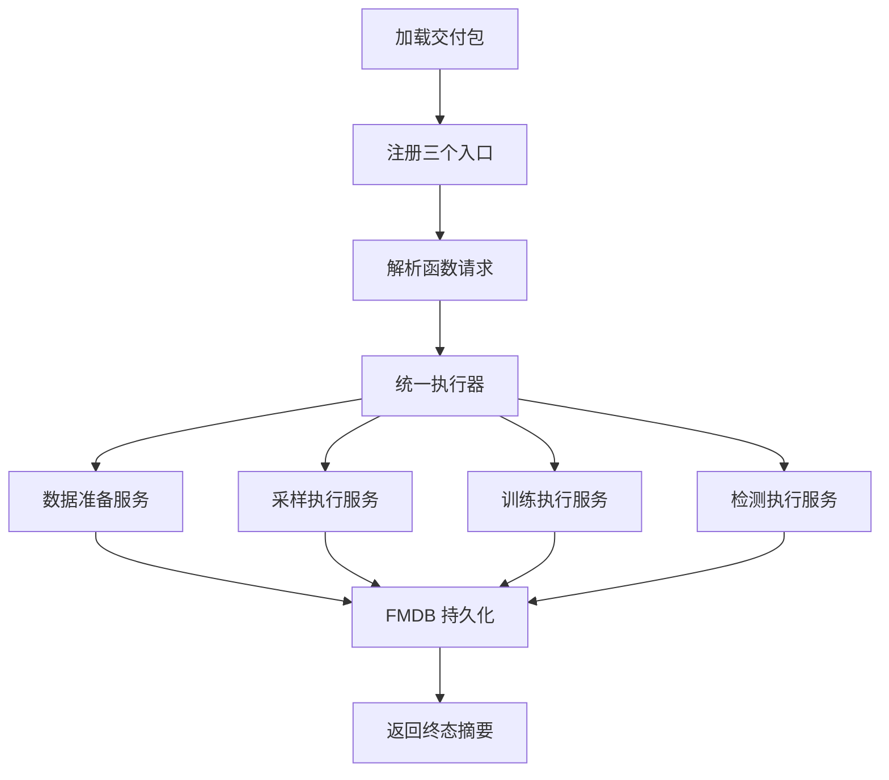
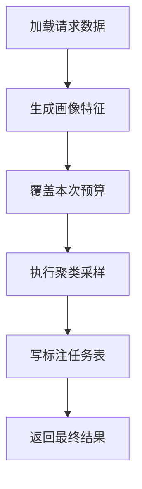
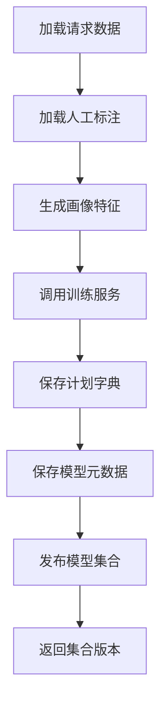
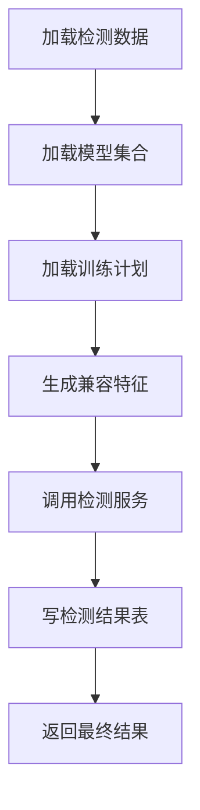

# Raha 三函数同步执行方案文件修改设计

## 一、文档目标

本文给出 Raha 三函数从当前异步文件任务模式改造成轻量同步执行模式时，完整的源码文件修改点、新增文件、删除文件、持久化表、注册方式、测试范围和实施顺序。

本文同时记录本次已经落地的默认配置清理：

- `src/main/resources/raha-defaults.properties` 中全部 `raha.udf.*` 属性已删除。
- UDF 请求长度和三个固定名称不再从默认属性读取。
- `UdfConfig` 已删除。
- 注册脚本已明确 `ADD JAR` 和类名注册的职责。

需要特别说明：默认配置清理已经完成，不代表同步核心链路已经实现。当前三个 UDF 类仍使用异步提交器，后续必须按本文继续改造。

---

## 二、最终设计结论

### 2.1 最终对外入口

对外保留三个固定业务名称：

| 名称 | 业务语义 | 最终返回 |
| --- | --- | --- |
| `F_DW_RAHASAMPLE` | 同步生成待标注任务 | 任务数量和结果表位置 |
| `F_DW_RAHATRAIN` | 同步训练并发布模型集合 | 模型集合版本和字段统计 |
| `F_DW_RAHADETECT` | 同步加载模型集合并检测 | 检测数量和结果表位置 |

最终稳定的 Java 业务入口统一为：

```java
public interface RahaFunctionExecutor {

    RahaFunctionResult execute(RahaFunctionRequest request);
}
```

三个 SQL 入口只负责固定任务类型、解析请求、调用执行器和序列化返回值。

### 2.2 最终部署入口

交付包不再读取 `raha.udf.*` 默认配置。加载和注册脚本形式为：

```sql
ADD JAR /opt/fmdb/lib/fmdb-udf-raha-1.0.0-SNAPSHOT-all.jar;

CREATE TEMPORARY FUNCTION F_DW_RAHATRAIN
AS 'com.fiberhome.ml.raha.udf.F_DW_RAHATRAIN';

CREATE TEMPORARY FUNCTION F_DW_RAHADETECT
AS 'com.fiberhome.ml.raha.udf.F_DW_RAHADETECT';

CREATE TEMPORARY FUNCTION F_DW_RAHASAMPLE
AS 'com.fiberhome.ml.raha.udf.F_DW_RAHASAMPLE';
```

必须准确理解这两类语句：

- `ADD JAR` 只把交付 Jar 加入当前会话类路径。
- `CREATE TEMPORARY FUNCTION` 才把 SQL 名称绑定到 Java 类。
- 因此“直接通过 `ADD JAR`”的准确含义是“不需要 Raha 默认配置和独立启动应用，只需加载 Jar 并按脚本注册类”，不是只执行一条 `ADD JAR` 就自动出现函数。

### 2.3 同步执行的前置条件

目标 FMDB 必须保证三个入口：

1. 在 Spark 驱动进程执行。
2. 每条 SQL 只触发一次表级调用。
3. 可以取得当前 Spark 会话。
4. 可以执行整表 Spark 动作和 FMDB 写入。
5. 可以传播查询取消和超时。

如果普通 `CREATE TEMPORARY FUNCTION` 不具备以上保证，则三个类必须改成 FMDB 提供的驱动过程或命令接口。若平台没有这种接口，最终只能使用任务表加平台调度器，不能在普通执行进程 UDF 内同步运行完整算法。

---

## 三、目标总体结构



最终不再包含：

- 文件请求队列。
- 文件租约。
- 文件工作器。
- 静态运行时提交器。
- `RahaContainerValidationApplication` 生产主程序。
- `ValidationWorkerState` 进程内跨任务状态。
- UDF 提交态 `ACCEPTED`。

---

## 四、本次已经完成的文件修改

### 4.1 默认属性文件

文件：`src/main/resources/raha-defaults.properties`

已删除：

```properties
raha.udf.train-function
raha.udf.detect-function
raha.udf.sample-function
raha.udf.max-request-length
raha.udf.queue-directory
```

已增加中文注释，说明 UDF 不读取默认属性，交付 Jar 通过 `ADD JAR` 加载，类名注册语句由 `scripts/register_raha_udfs.sql` 提供。

### 4.2 配置类

文件：`src/main/java/com/fiberhome/ml/raha/config/UdfConfig.java`

处理：已删除。

原因：函数名、请求长度和文件队列不再作为 Raha 算法默认配置。

文件：`src/main/java/com/fiberhome/ml/raha/config/RahaConfigFactory.java`

处理：已删除 `udfConfig()`，类说明改为只转换任务和算法配置。

### 4.3 请求解析器

文件：`src/main/java/com/fiberhome/ml/raha/udf/RahaUdfRequestParser.java`

已修改：

- 删除 `RahaDefaultConfigProvider` 依赖。
- 新增固定请求长度常量 `DEFAULT_MAX_REQUEST_LENGTH=65536`。
- 无参构造器直接使用固定上限。
- 保留带长度参数构造器，供边界测试使用。

固定请求上限属于安全协议边界，不再允许通过外部属性任意放大。

### 4.4 程序化注册器

文件：`src/main/java/com/fiberhome/ml/raha/udf/RahaUdfRegistrar.java`

已修改：

- 删除 `UdfConfig` 和默认配置工厂依赖。
- 三个函数名改为固定常量。
- 删除自定义函数名构造器。
- 程序化注册直接使用固定常量。

该类用于当前集成测试和过渡期宿主注册。最终只保留类名 SQL 注册时，可以删除该类。

### 4.5 文件提交器过渡处理

文件：`src/main/java/com/fiberhome/ml/raha/udf/FileRahaUdfJobSubmitter.java`

已修改：

- 不再从 `raha-defaults.properties` 读取队列目录。
- 过渡期仅允许显式 Java 系统属性 `raha.udf.queue-directory`。

该系统属性只用于当前文件队列测试和过渡运行，不属于最终同步设计。同步链路切换后，文件提交器和该系统属性一起删除。

### 4.6 注册脚本

文件：`scripts/register_raha_udfs.sql`

已修改中文注释：

- UDF 不读取 `raha.udf.*` 默认配置。
- `ADD JAR` 只加载 Jar。
- 三个函数仍需执行类名注册语句。

### 4.7 测试和 README

已修改：

- `src/test/java/com/fiberhome/ml/raha/config/RahaConfigLoaderTest.java`
- `src/test/java/com/fiberhome/ml/raha/udf/RahaUdfConfigurationTest.java`
- `README.md`

处理内容：

- 删除 `UdfConfig` 和 `udfConfig()` 断言。
- 删除 UDF 属性覆盖测试。
- 改为验证固定函数名和请求长度边界。
- 删除 README 默认 UDF 配置表项。
- 明确默认函数名称不从配置读取。

---

## 五、第一阶段新增文件设计

### 5.1 统一请求对象

建议新增：

`src/main/java/com/fiberhome/ml/raha/service/RahaFunctionRequest.java`

第一阶段可以从 `RahaUdfRequest` 迁移字段，最终字段建议如下：

| 字段 | 类型 | 任务 | 说明 |
| --- | --- | --- | --- |
| `taskType` | `RahaTaskType` | 全部 | 由入口类固定 |
| `datasetId` | `String` | 全部 | 逻辑数据集标识 |
| `inputReference` | `String` | 全部 | FMDB 表或只读 SQL |
| `sourceType` | `DataFormat` | 全部 | 表或 SQL |
| `rowIdColumn` | `String` | 全部 | 稳定行标识 |
| `snapshotId` | `String` | 全部 | 可选快照 |
| `idempotencyKey` | `String` | 全部 | 执行和写入幂等键 |
| `caller` | `String` | 全部 | 审计调用方 |
| `resultTable` | `String` | 全部 | 最终业务结果表 |
| `annotationReference` | `String` | 训练 | 人工标注表 |
| `modelSetVersion` | `String` | 检测 | 一次训练产生的模型集合 |
| `labelingBudget` | `int` | 采样 | 本次采样预算 |

当前 `modelVersion` 必须改为 `modelSetVersion`。一个多字段训练会产生多个列模型版本，单个列模型版本不能代表整次训练。

### 5.2 统一最终结果

建议新增：

`src/main/java/com/fiberhome/ml/raha/service/RahaFunctionResult.java`

建议字段：

```java
public final class RahaFunctionResult {

    /** 调用方幂等任务标识。 */
    private final String taskId;
    /** 当前业务任务类型。 */
    private final RahaTaskType taskType;
    /** 算法最终状态。 */
    private final RahaTaskStatus status;
    /** 逻辑数据集标识。 */
    private final String datasetId;
    /** 模型集合版本，非训练或检测任务时为空。 */
    private final String modelSetVersion;
    /** 最终结果位置。 */
    private final String resultLocation;
    /** 成功结果数量。 */
    private final long resultCount;
    /** 失败字段数量。 */
    private final long failedCount;
    /** 执行耗时。 */
    private final long elapsedMillis;
    /** 失败错误码。 */
    private final String errorCode;
    /** 安全错误摘要。 */
    private final String errorMessage;
}
```

该对象替代 `RahaUdfSubmissionResult`。最终不再返回 `ACCEPTED`、`DUPLICATE` 等提交状态，而是返回 `SUCCEEDED`、`PARTIAL_SUCCESS` 或 `FAILED`。

### 5.3 统一执行器

建议新增：

- `src/main/java/com/fiberhome/ml/raha/service/RahaFunctionExecutor.java`
- `src/main/java/com/fiberhome/ml/raha/service/DefaultRahaFunctionExecutor.java`

接口：

```java
public interface RahaFunctionExecutor {

    RahaFunctionResult execute(RahaFunctionRequest request);
}
```

实现类依赖：

- `RahaSamplingExecutionService`
- `RahaTrainingExecutionService`
- `RahaDetectionExecutionService`

核心分支必须记录开始、任务类型、数据集、结束状态和耗时日志。异常捕获必须记录上下文和完整堆栈。

### 5.4 组件工厂

建议新增：

`src/main/java/com/fiberhome/ml/raha/service/RahaExecutionComponentFactory.java`

职责：

1. 接收当前驱动进程 `SparkSession`。
2. 创建 FMDB 表网关。
3. 创建数据加载器。
4. 创建算法配置。
5. 创建模型、标注、策略计划和结果适配器。
6. 组装三个生产执行服务。
7. 返回唯一 `RahaFunctionExecutor`。

该类替代 `RahaContainerValidationApplication` 中散落的构造代码，但不包含 `main` 方法、CSV 验收数据、真值评测和文件轮询。

---

## 六、第二阶段生产执行服务设计

### 6.1 共用数据准备服务

建议新增：

`src/main/java/com/fiberhome/ml/raha/service/RahaDatasetPreparationService.java`

建议方法：

```java
public RahaPreparedDataset prepareForTrainingOrSampling(
        RahaFunctionRequest request);

public RahaPreparedDataset prepareForDetection(
        RahaFunctionRequest request,
        RahaModelSet modelSet);
```

训练和采样流程：

1. 调用 `request.toDataLoadRequest()`。
2. 使用 `FmdbDatasetLoader` 加载真实请求表或 SQL。
3. 使用 `ColumnProfileService` 生成画像。
4. 使用 `RahaFeaturePreparationService` 生成策略计划和特征。

检测流程：

1. 加载检测数据。
2. 加载模型集合绑定的训练期策略计划。
3. 执行固定策略计划。
4. 按训练期特征字典组装兼容特征。

检测不能重新生成策略计划，否则策略计划版本和字典版本可能与模型不兼容。

### 6.2 采样执行服务

建议新增：

`src/main/java/com/fiberhome/ml/raha/service/RahaSamplingExecutionService.java`

执行顺序：



修改点：

- 使用 `request.getLabelingBudget()` 构造本次采样配置。
- 不再使用验收应用中的固定配置预算。
- 不再使用真值数据自动模拟人工标注。
- 将 `AnnotationTask` 写入 `request.getResultTable()`。
- 使用幂等键和行标识防止重复任务。

### 6.3 训练执行服务

建议新增：

`src/main/java/com/fiberhome/ml/raha/service/RahaTrainingExecutionService.java`

执行顺序：



修改点：

- 从 `annotationReference` 加载 `List<CellLabel>`。
- 调用现有 `RahaTrainService.train`。
- 保存全部成功字段的特征字典。
- 保存训练期策略计划和计划版本。
- 保存候选模型完整元数据。
- 根据产品规则自动发布或进入待审核状态。
- 生成一个模型集合版本，关联全部列模型。
- 部分字段失败时返回 `PARTIAL_SUCCESS`。

### 6.4 检测执行服务

建议新增：

`src/main/java/com/fiberhome/ml/raha/service/RahaDetectionExecutionService.java`

执行顺序：



修改点：

- `RahaDetectRequest` 增加 `modelSetVersion`。
- `PublishedColumnModelLoader` 支持按模型集合和字段加载确定版本。
- 不再只按数据集和字段查找当前唯一发布模型。
- 检测特征必须复用训练期计划和字典。
- `SparkSqlFmdbResultWriter` 写入 `request.getResultTable()`。
- 返回检测单元格数量、成功字段数和失败字段数。

---

## 七、第三阶段 FMDB 适配器设计

### 7.1 标注加载器

建议新增：

`src/main/java/com/fiberhome/ml/raha/fmdb/FmdbCellLabelLoader.java`

建议标注表字段：

| 字段 | 类型 | 说明 |
| --- | --- | --- |
| `dataset_id` | 字符串 | 数据集标识 |
| `snapshot_id` | 字符串 | 标注对应快照 |
| `row_id` | 字符串 | 稳定行标识 |
| `column_name` | 字符串 | 字段名 |
| `label` | 整数 | 0 表示正常，1 表示错误 |
| `label_source` | 字符串 | 人工或审核来源 |
| `confidence` | 小数 | 置信度 |
| `labeled_by` | 字符串 | 标注人或系统 |
| `labeled_at` | 长整数 | 标注时间 |

加载器必须拒绝跨数据集、跨快照、未知字段、非法标签和同一单元格冲突标签。

### 7.2 标注任务写入器

建议新增：

`src/main/java/com/fiberhome/ml/raha/fmdb/FmdbAnnotationTaskWriter.java`

幂等业务键建议为：

```text
task_id + row_id
```

采样同步返回前必须确认标注任务已经写入目标表。

### 7.3 模型集合对象

建议新增：

- `src/main/java/com/fiberhome/ml/raha/model/RahaModelSet.java`
- `src/main/java/com/fiberhome/ml/raha/repository/ModelSetRepository.java`
- `src/main/java/com/fiberhome/ml/raha/fmdb/FmdbModelSetRepository.java`

模型集合至少记录：

- `model_set_version`
- `dataset_id`
- `training_snapshot_id`
- `schema_hash`
- `strategy_plan_version`
- `status`
- `created_at`
- `published_at`
- 字段到列模型版本的映射
- 字段到特征字典版本的映射

### 7.4 模型元数据仓储

建议新增：

`src/main/java/com/fiberhome/ml/raha/fmdb/FmdbModelMetadataRepository.java`

实现现有 `ModelMetadataRepository`，把 `RahaColumnModel` 的完整字段持久化到 FMDB。不能继续使用 `InMemoryRahaRepository` 保存发布状态。

### 7.5 策略计划仓储

建议新增：

`src/main/java/com/fiberhome/ml/raha/fmdb/FmdbStrategyPlanRepository.java`

必须保存：

- 模型集合版本。
- 策略标识。
- 策略族。
- 目标字段。
- 完整策略配置。
- 配置哈希。
- 优先级。
- 计划版本。

检测时按模型集合版本加载训练期计划。

### 7.6 结果写入器

修改：

`src/main/java/com/fiberhome/ml/raha/fmdb/SparkSqlFmdbResultWriter.java`

处理：

- 保留检测结果写入能力。
- 删除异步 `RahaJob` 状态写入能力。
- 增加统一最终摘要写入能力时，应使用独立结果接口，不继续耦合旧任务对象。
- 所有写入使用请求结果表和业务幂等键。

---

## 八、现有核心文件修改点

### 8.1 三个入口类

文件：

- `udf/F_DW_RAHASAMPLE.java`
- `udf/F_DW_RAHATRAIN.java`
- `udf/F_DW_RAHADETECT.java`

最终修改：

- 保留固定任务类型。
- 删除 `RuntimeRahaUdfJobSubmitter`。
- 注入或从 FMDB 驱动上下文取得 `RahaFunctionExecutor`。
- 调用后等待当前业务流程终态。
- 返回 `RahaFunctionResult.toJson()`。

如果 FMDB 只能反射调用无参构造器，必须由平台过程接口提供当前 Spark 会话和执行器工厂，不能使用静态变量保存跨执行进程 Spark 会话。

### 8.2 公共入口父类

文件：`udf/AbstractRahaTableUdf.java`

最终修改：

- 类说明从异步提交改为同步执行。
- 字段 `RahaUdfJobSubmitter submitter` 替换为 `RahaFunctionExecutor executor`。
- `call` 中调用 `executor.execute`。
- 成功日志记录最终状态、结果数量和耗时。
- 异常转换返回最终失败状态。

若平台要求使用专用过程基类，则删除该类并新增过程公共父类。

### 8.3 请求对象和解析器

文件：

- `udf/RahaUdfRequest.java`
- `udf/RahaUdfRequestParser.java`

最终修改：

- 移动或重命名到 `service` 包，避免继续绑定 UDF 技术名称。
- `modelVersion` 改为 `modelSetVersion`。
- 保留 `toDataLoadRequest()` 并在真实执行链调用。
- `toEncodedRequest()` 仅在任务表降级方案需要时保留。
- `toCanonicalConfiguration()` 继续用于执行幂等。
- 请求长度保持固定 65536。

### 8.4 采样配置

文件：`config/SamplingConfig.java`

建议增加：

```java
public SamplingConfig withLabelingBudget(int labelingBudget)
```

本次调用预算从请求覆盖，其他采样参数继续使用算法默认配置。

### 8.5 特征准备服务

文件：`service/RahaFeaturePreparationService.java`

建议增加：

```java
public RahaFeaturePreparationResult prepareWithPlans(
        RahaFeaturePreparationRequest request,
        List<StrategyPlan> plans,
        Map<String, FeatureDictionary> dictionaries)
```

训练和采样可以生成新计划；检测必须使用模型集合绑定的计划和字典。

### 8.6 检测请求和模型加载器

文件：

- `service/RahaDetectRequest.java`
- `model/PublishedColumnModelLoader.java`
- `model/ColumnModelCompatibilityValidator.java`

修改：

- 检测请求携带模型集合版本。
- 模型加载器按集合中明确记录的列模型版本加载。
- 兼容校验继续检查模式哈希、策略计划版本和字典版本。
- 结果中记录实际模型集合版本和列模型版本。

### 8.7 训练服务

文件：`service/RahaTrainService.java`

建议保持核心训练职责不变：生成候选列模型。

模型集合保存、字典保存和模型发布由新 `RahaTrainingExecutionService` 负责，避免把 FMDB 表名和发布策略塞进算法核心服务。

### 8.8 采样和检测服务

文件：

- `service/RahaSampleService.java`
- `service/RahaDetectService.java`

原则：

- 保留现有核心算法职责。
- 不直接解析表单请求。
- 不直接决定外部结果表名。
- 外部输入加载和最终写表由生产执行服务负责。

---

## 九、迁移完成后删除文件

### 9.1 异步 UDF 设施

删除：

- `udf/FileRahaUdfJobSubmitter.java`
- `udf/FileRahaUdfJobWorker.java`
- `udf/RahaUdfTaskDispatcher.java`
- `udf/RuntimeRahaUdfJobSubmitter.java`
- `udf/RahaUdfRuntime.java`
- `udf/RepositoryBackedRahaUdfJobSubmitter.java`
- `udf/RahaUdfJobSubmitter.java`
- `udf/RahaUdfSubmissionStatus.java`
- `udf/RahaUdfSubmissionResult.java`

最终只使用类名注册时，再删除：

- `udf/RahaUdfRegistrar.java`

### 9.2 验收应用

处理：

- 从 `src/main/java` 删除 `app/RahaContainerValidationApplication.java`。
- 将必要验收逻辑迁移到集成测试或独立验收模块。

不能迁入生产的内容：

- CSV 真值表。
- 自动模拟人工标注。
- 特定字段阈值调优。
- Python 对齐文件输出。
- `ValidationWorkerState`。
- 文件队列轮询。

### 9.3 旧任务和检查点体系

同步主链稳定后，删除未接入三个高层服务的：

- `checkpoint` 包。
- `job.stage` 包。
- `RahaJobOrchestrator` 及通用阶段状态对象。
- 配套 `JobRepository`、`StageRepository` 和 `StageCheckpointRepository`。

`IdempotencyKeyGenerator` 可以保留并迁入同步执行服务。

---

## 十、注册脚本最终修改

文件：`scripts/register_raha_udfs.sql`

最终应继续保持一个脚本完成加载和三个类名注册：

```sql
-- UDF 不读取 raha.udf.* 默认配置，替换为实际交付 Jar 路径。
ADD JAR /opt/fmdb/lib/fmdb-udf-raha-1.0.0-SNAPSHOT-all.jar;

-- ADD JAR 只加载 Jar，以下语句完成三个固定业务名称注册。
CREATE TEMPORARY FUNCTION F_DW_RAHATRAIN
AS 'com.fiberhome.ml.raha.udf.F_DW_RAHATRAIN';

CREATE TEMPORARY FUNCTION F_DW_RAHADETECT
AS 'com.fiberhome.ml.raha.udf.F_DW_RAHADETECT';

CREATE TEMPORARY FUNCTION F_DW_RAHASAMPLE
AS 'com.fiberhome.ml.raha.udf.F_DW_RAHASAMPLE';
```

如果 FMDB 要求使用驱动过程注册语法，只替换三条创建语句，Jar 和三个业务名称保持不变。

---

## 十一、最终调用示例

### 11.1 采样

```sql
SELECT F_DW_RAHASAMPLE(
  'datasetId=orders&inputReference=ods.orders_dirty&sourceType=TABLE&rowIdColumn=id&snapshotId=orders_001&idempotencyKey=sample_orders_001&caller=data_quality&resultTable=dw.raha_annotation_task&labelingBudget=20'
);
```

返回：

```json
{
  "taskId": "sample_orders_001",
  "taskType": "SAMPLE",
  "status": "SUCCEEDED",
  "resultLocation": "fmdb://dw.raha_annotation_task/sample_orders_001",
  "resultCount": 20
}
```

### 11.2 训练

```sql
SELECT F_DW_RAHATRAIN(
  'datasetId=orders&inputReference=ods.orders_dirty&sourceType=TABLE&rowIdColumn=id&snapshotId=orders_001&idempotencyKey=train_orders_001&caller=data_quality&resultTable=dw.raha_model_metadata&annotationReference=dw.raha_cell_label'
);
```

返回：

```json
{
  "taskId": "train_orders_001",
  "taskType": "TRAIN",
  "status": "SUCCEEDED",
  "modelSetVersion": "orders_models_001",
  "resultLocation": "fmdb://dw.raha_model_metadata/orders_models_001",
  "resultCount": 12
}
```

### 11.3 检测

```sql
SELECT F_DW_RAHADETECT(
  'datasetId=orders&inputReference=ods.orders_next&sourceType=TABLE&rowIdColumn=id&snapshotId=orders_002&idempotencyKey=detect_orders_001&caller=data_quality&resultTable=dw.raha_detection_result&modelSetVersion=orders_models_001'
);
```

返回：

```json
{
  "taskId": "detect_orders_001",
  "taskType": "DETECT",
  "status": "SUCCEEDED",
  "modelSetVersion": "orders_models_001",
  "resultLocation": "fmdb://dw.raha_detection_result/detect_orders_001",
  "resultCount": 126
}
```

若平台同步入口使用 `CALL`，只替换调用关键字，请求和返回契约不变。

---

## 十二、测试文件修改设计

### 12.1 保留并修改

| 测试 | 修改内容 |
| --- | --- |
| `RahaUdfConfigurationTest` | 验证固定名称、固定请求上限和未知参数 |
| `RahaTableUdfIntegrationTest` | 验证类名注册、同步终态和结果表 |
| `FmdbAdapterIntegrationTest` | 增加标注、模型集合、计划和结果持久化 |
| `ModelLifecycleIntegrationTest` | 增加模型集合发布和按版本加载 |
| `Iteration9FmdbPipelineIntegrationTest` | 改为真实请求贯通验收 |

### 12.2 新增

建议新增：

- `RahaFunctionExecutorTest`
- `RahaSamplingExecutionServiceIntegrationTest`
- `RahaTrainingExecutionServiceIntegrationTest`
- `RahaDetectionExecutionServiceIntegrationTest`
- `FmdbCellLabelLoaderTest`
- `FmdbModelSetRepositoryTest`
- `FmdbStrategyPlanRepositoryTest`
- `RahaAddJarRegistrationIntegrationTest`
- `RahaCrossSessionLifecycleIntegrationTest`

### 12.3 必测场景

- 三个类通过 Jar 和类名注册。
- 不存在任何 `raha.udf.*` 默认属性仍可实例化入口。
- 请求表名真正决定数据加载。
- 标注表真正决定训练标签。
- 采样预算真正决定任务上限。
- 模型集合版本真正决定检测模型。
- 结果表真正决定写入位置。
- 训练进程退出后，另一会话仍能加载模型检测。
- 相同幂等键重复调用不重复发布或写入。
- 相同幂等键不同参数被拒绝。
- 部分字段失败返回部分成功。
- 查询取消和超时能够终止或标记执行。

---

## 十三、实施顺序

### 第一批：平台验证

1. 验证当前类名 UDF 的实际执行进程。
2. 验证是否能够安全取得驱动 Spark 会话。
3. 验证一条 SQL 是否只调用一次。
4. 若不满足，确认 FMDB 驱动过程或命令接口。

### 第二批：生产执行器

1. 新增统一请求和最终结果。
2. 新增统一执行器和组件工厂。
3. 新增三个生产执行服务。
4. 先通过驱动进程 Java 集成测试。

### 第三批：FMDB 持久化

1. 新增标注加载器和采样任务写入器。
2. 新增模型集合仓储。
3. 新增完整模型元数据仓储。
4. 新增策略计划仓储。
5. 改造检测结果写入。

### 第四批：入口切换

1. 三个入口改为调用 `RahaFunctionExecutor`。
2. 注册脚本切换到平台确认的同步入口语法。
3. 验证三个真实 FMDB SQL 调用。

### 第五批：删除旧结构

1. 删除异步 UDF 设施。
2. 移出验收应用。
3. 删除文件队列配置和测试。
4. 删除未接入的通用任务和检查点体系。
5. 更新 README 和部署说明。

---

## 十四、验收门槛

同步方案只有同时满足以下条件才算完成：

1. `raha-defaults.properties` 不包含任何 `raha.udf.*` 属性。
2. UDF 或过程类实例化不访问 `RahaDefaultConfigProvider.udfConfig()`。
3. 交付方式只需要 Jar、平台 Spark 环境和注册脚本，不需要 Raha 验收应用。
4. 每个请求字段进入真实核心执行链。
5. 三个入口返回算法终态，不返回提交态。
6. 采样结果、人工标注、模型集合和检测结果全部跨进程持久化。
7. 检测复用训练期策略计划和字典。
8. 重试不会重复发布模型或重复写检测结果。
9. 真实 FMDB 环境确认入口在驱动进程单次执行。
10. 全量测试和跨会话集成测试通过。

---

## 十五、最终说明

本次已经完成 UDF 默认属性清理和相关代码解耦。当前默认配置文件中不再存在 `raha.udf.*` 键，函数名称和请求长度不再依赖默认属性。

最终交付说明应统一表述为：

> Raha 三函数不读取 `raha.udf.*` 默认配置。使用 `ADD JAR` 加载交付 Jar，并执行项目注册脚本中的类名注册语句即可创建三个入口；不需要启动 `RahaContainerValidationApplication`。

同时必须保留下一句技术边界：

> `ADD JAR` 本身只加载 Jar，不会自动注册函数；同步执行还要求 FMDB 提供驱动进程单次调用语义。

在平台能力未验证、统一执行器和 FMDB 持久化未完成前，当前代码仍属于异步过渡实现，不能提前删除文件提交器，也不能宣称三个函数已经同步贯通核心服务。

---

## 附录：本次修改验证结果

本次默认配置清理完成后已执行：

```text
配置和 UDF 边界测试：5 项通过
UDF 注册与调用集成测试：6 项通过
项目全量测试：137 项通过
失败：0
错误：0
跳过：0
```

当前机器使用 JDK 17，项目正式基线要求 JDK 8。本次验证通过临时 `JDK_JAVA_OPTIONS` 开放 Spark 3.3.1 所需模块，并使用 `-Denforcer.skip=true` 跳过 Java 版本门禁；这些参数没有写入项目文件。

Maven 已完成 279 个主源码文件和 49 个测试源码文件编译。正式交付仍应在 JDK 8 环境执行不跳过门禁的 `mvn clean verify`。
