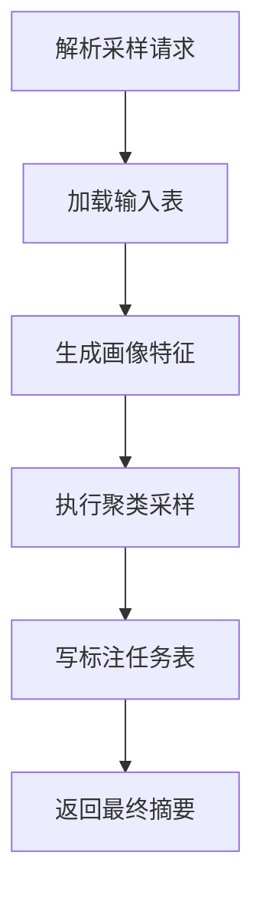
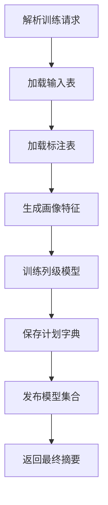
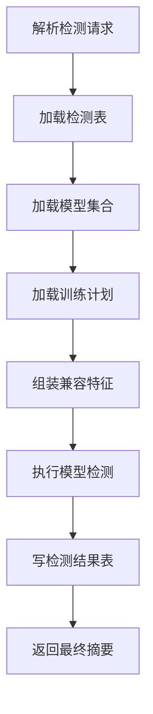
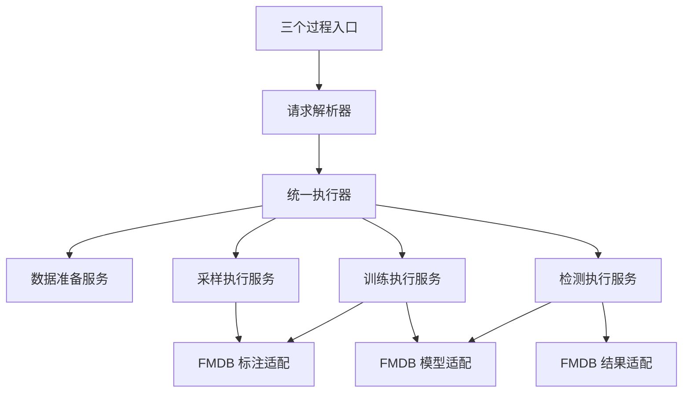

# Raha 三函数推荐最终入口与调用示例

## 一、我的明确建议

最终采用以下方案：

1. 对外仍保留 `F_DW_RAHASAMPLE`、`F_DW_RAHATRAIN`、`F_DW_RAHADETECT` 三个名称。
2. 三个入口改成保证在 Spark 驱动进程执行一次的同步过程或命令，不再作为普通标量 UDF 执行完整算法。
3. 三个入口内部只负责解析、校验、调用 `RahaFunctionExecutor` 和返回终态摘要。
4. `RahaFunctionExecutor` 根据任务类型调用三个生产执行服务。
5. 采样任务、模型、字典、模型元数据和检测明细全部写入 FMDB 表。
6. 删除文件队列、文件工作器、运行时提交器和验收应用生产版本。
7. 如果 FMDB 不支持驱动进程同步过程，则改用任务表异步方案，不在普通标量 UDF 内强行启动 Spark 算法。

这个方案同时满足以下目标：

- 用户入口只有三个业务函数或过程。
- 用户调用后得到最终成功或失败结果。
- 不需要 `RahaContainerValidationApplication`。
- 不需要文件队列和文件租约。
- 请求参数真正决定数据加载、标注、模型和结果表。
- 采样、训练和检测可以在不同会话、不同时间独立执行。

---

## 二、最终入口是什么

### 2.1 第一层：稳定的 Java 业务入口

无论 SQL 层最终使用哪种 FMDB 扩展，真正的生产入口统一为：

```java
public interface RahaFunctionExecutor {

    RahaFunctionResult execute(RahaFunctionRequest request);
}
```

实现类：

```java
public final class DefaultRahaFunctionExecutor implements RahaFunctionExecutor {

    /** 采样任务执行服务。 */
    private final RahaSamplingExecutionService samplingService;
    /** 训练任务执行服务。 */
    private final RahaTrainingExecutionService trainingService;
    /** 检测任务执行服务。 */
    private final RahaDetectionExecutionService detectionService;

    @Override
    public RahaFunctionResult execute(RahaFunctionRequest request) {
        if (request.getTaskType() == RahaTaskType.SAMPLE) {
            return samplingService.execute(request);
        }
        if (request.getTaskType() == RahaTaskType.TRAIN) {
            return trainingService.execute(request);
        }
        return detectionService.execute(request);
    }
}
```

该接口必须在 Spark 驱动进程调用。它不继承 Hive `UDF`，也不在 Spark 数据分区中执行。

### 2.2 第二层：SQL 同步过程适配器

如果 FMDB 支持驱动进程 Java 过程，最终 SQL 入口建议使用 `CALL` 语义：

```sql
CALL F_DW_RAHASAMPLE('<请求文本>');

CALL F_DW_RAHATRAIN('<请求文本>');

CALL F_DW_RAHADETECT('<请求文本>');
```

这里的 `CALL` 是推荐的目标接口语义。具体注册语法必须以目标 FMDB 提供的驱动进程过程接口为准，不能直接假定标准 Spark 3.3.1 支持上述语法。

SQL 适配器的职责只有：

```java
public final class RahaTrainProcedure {

    /** 统一请求解析器。 */
    private final RahaFunctionRequestParser parser;
    /** 驱动进程统一执行器。 */
    private final RahaFunctionExecutor executor;

    public String call(String encodedRequest) {
        RahaFunctionRequest request = parser.parse(
                RahaTaskType.TRAIN, encodedRequest);
        return executor.execute(request).toJson();
    }
}
```

`RahaSampleProcedure` 和 `RahaDetectProcedure` 只替换固定任务类型，不重复编写业务流程。

### 2.3 为什么最终入口不是当前 `evaluate`

当前 `evaluate` 是普通 Hive 表达式入口，执行位置和调用次数由 Spark 任务决定。最终同步入口必须满足：

- 只在驱动进程执行。
- 一条命令只调用一次。
- 可以直接取得平台 Spark 会话。
- 可以安全执行整表 Spark 动作。
- 可以把 SQL 取消传递给算法执行。

如果 FMDB 的函数扩展能明确保证以上条件，也可以继续显示为 `SELECT F_DW_RAHATRAIN(...)`。关键不是使用 `CALL` 还是 `SELECT`，而是平台必须保证驱动进程单次执行语义。

---

## 三、推荐保留当前单字符串请求

第一版重构建议继续使用当前表单编码字符串，不要同时修改执行架构和参数协议。

原因如下：

- `RahaUdfRequestParser` 已有严格字段白名单和长度限制。
- 当前测试已经覆盖合法参数、未知参数和跨任务参数。
- 单字符串方便平台过程只声明一个入参。
- 架构稳定后再考虑多个类型化参数或数据集注册表。

建议把类型名从 `RahaUdfRequest` 调整为更中性的 `RahaFunctionRequest`，因为它不再只服务普通 UDF。

---

## 四、最终调用示例

以下示例保留现有请求格式，便于直接与当前代码映射。

### 4.1 第一步：执行采样

注册完成后调用：

```sql
CALL F_DW_RAHASAMPLE(
  'datasetId=orders_202607&inputReference=ods.orders_dirty&sourceType=TABLE&rowIdColumn=id&snapshotId=orders_snapshot_001&idempotencyKey=sample_orders_202607_001&caller=data_quality&resultTable=dw.raha_annotation_task&labelingBudget=20'
);
```

内部同步执行：



最终返回示例：

```json
{
  "taskId": "sample_orders_202607_001",
  "taskType": "SAMPLE",
  "status": "SUCCEEDED",
  "datasetId": "orders_202607",
  "resultLocation": "fmdb://dw.raha_annotation_task/sample_orders_202607_001",
  "requestedBudget": 20,
  "createdTaskCount": 20,
  "elapsedMillis": 12683,
  "errorCode": null,
  "errorMessage": null
}
```

此时函数返回表示采样已经执行完成，20 个待标注任务已经写入 `dw.raha_annotation_task`，不再返回 `ACCEPTED`。

人工标注系统随后更新或另行写入审核后的标注表，例如 `dw.raha_cell_label`。

### 4.2 第二步：执行训练

人工标注完成后调用：

```sql
CALL F_DW_RAHATRAIN(
  'datasetId=orders_202607&inputReference=ods.orders_dirty&sourceType=TABLE&rowIdColumn=id&snapshotId=orders_snapshot_001&idempotencyKey=train_orders_202607_001&caller=data_quality&resultTable=dw.raha_model_metadata&annotationReference=dw.raha_cell_label'
);
```

内部同步执行：



最终返回示例：

```json
{
  "taskId": "train_orders_202607_001",
  "taskType": "TRAIN",
  "status": "SUCCEEDED",
  "datasetId": "orders_202607",
  "modelSetVersion": "orders_202607_models_001",
  "resultLocation": "fmdb://dw.raha_model_metadata/orders_202607_models_001",
  "trainedColumnCount": 12,
  "skippedColumnCount": 1,
  "failedColumnCount": 0,
  "elapsedMillis": 85342,
  "errorCode": null,
  "errorMessage": null
}
```

这里返回的是一次训练产生的模型集合版本，不是任意一个字段的列模型版本。

模型集合元数据必须记录：

- 数据集标识和快照。
- 模式哈希。
- 策略计划版本。
- 每个字段的字典版本。
- 每个字段的模型版本。
- 发布状态和发布时间。
- 模型表、字典表和计划表位置。

### 4.3 第三步：执行检测

训练成功后使用模型集合版本调用：

```sql
CALL F_DW_RAHADETECT(
  'datasetId=orders_202607&inputReference=ods.orders_dirty_next&sourceType=TABLE&rowIdColumn=id&snapshotId=orders_snapshot_002&idempotencyKey=detect_orders_202607_001&caller=data_quality&resultTable=dw.raha_detection_result&modelVersion=orders_202607_models_001'
);
```

为了兼容当前请求字段，示例仍使用 `modelVersion` 参数名；重构时建议正式改名为 `modelSetVersion`。

内部同步执行：



最终返回示例：

```json
{
  "taskId": "detect_orders_202607_001",
  "taskType": "DETECT",
  "status": "SUCCEEDED",
  "datasetId": "orders_202607",
  "modelSetVersion": "orders_202607_models_001",
  "resultLocation": "fmdb://dw.raha_detection_result/detect_orders_202607_001",
  "detectedCellCount": 126,
  "successfulColumnCount": 12,
  "failedColumnCount": 0,
  "elapsedMillis": 36812,
  "errorCode": null,
  "errorMessage": null
}
```

检测明细保存在 `dw.raha_detection_result`，SQL 返回值只保存终态摘要，不返回全部单元格结果。

---

## 五、最终注册示例

### 5.1 推荐的驱动进程过程注册

目标形式如下：

```sql
ADD JAR /opt/fmdb/lib/fmdb-udf-raha-1.0.0-SNAPSHOT-all.jar;

CREATE TEMPORARY PROCEDURE F_DW_RAHASAMPLE
AS 'com.fiberhome.ml.raha.procedure.RahaSampleProcedure';

CREATE TEMPORARY PROCEDURE F_DW_RAHATRAIN
AS 'com.fiberhome.ml.raha.procedure.RahaTrainProcedure';

CREATE TEMPORARY PROCEDURE F_DW_RAHADETECT
AS 'com.fiberhome.ml.raha.procedure.RahaDetectProcedure';
```

以上 `CREATE TEMPORARY PROCEDURE` 是目标形式示意，不是标准 Spark 3.3.1 已确认语法。实施前必须用 FMDB 的实际过程注册接口替换。

注册时由平台向三个适配器提供同一个驱动进程执行器：

```java
RahaFunctionExecutor executor = RahaExecutionComponentFactory.create(
        sparkSession, RahaDefaultConfigProvider.factory());

RahaProcedureRegistrar registrar = new RahaProcedureRegistrar(executor);
registrar.register(sparkSession);
```

`RahaProcedureRegistrar` 是由平台初始化调用的普通注册组件，不是独立 `main` 应用。

### 5.2 当前环境可以立即验证的 Java 入口

在 FMDB 过程接口没有确认前，可以先通过驱动进程 Java 集成测试验证完整同步链：

```java
SparkSession spark = SparkSession.builder().getOrCreate();
RahaFunctionExecutor executor = RahaExecutionComponentFactory.create(
        spark, RahaDefaultConfigProvider.factory());

RahaFunctionRequest request = new RahaFunctionRequestParser().parse(
        RahaTaskType.TRAIN, encodedRequest);
RahaFunctionResult result = executor.execute(request);

System.out.println(result.toJson());
```

该测试先证明核心链路正确，再把相同执行器包装进 FMDB 驱动过程。

### 5.3 如果 FMDB 只能注册普通函数

若最终只能执行：

```sql
CREATE TEMPORARY FUNCTION F_DW_RAHATRAIN
AS 'com.fiberhome.ml.raha.udf.F_DW_RAHATRAIN';
```

则不采用本地同步算法方案。最终入口改为普通 UDF 写完整任务表：

```sql
SELECT F_DW_RAHATRAIN('<请求文本>');
```

返回：

```json
{
  "taskId": "train_orders_202607_001",
  "taskType": "TRAIN",
  "status": "SUBMITTED",
  "resultLocation": "fmdb://dw.raha_job/train_orders_202607_001"
}
```

任务由 FMDB 现有调度器调用同一个 `RahaFunctionExecutor`。此时不需要文件工作器，但仍需要平台任务执行者。

---

## 六、最终内部类关系



### 6.1 数据准备服务

```java
public interface RahaDatasetPreparationService {

    RahaPreparedDataset prepare(RahaFunctionRequest request);

    RahaPreparedDataset prepareForDetection(
            RahaFunctionRequest request,
            RahaModelSet modelSet);
}
```

`prepareForDetection` 必须使用训练期持久化的策略计划和特征字典，不能重新生成另一套计划。

### 6.2 采样执行服务

```java
public interface RahaSamplingExecutionService {

    RahaFunctionResult execute(RahaFunctionRequest request);
}
```

内部顺序：

1. 数据加载和画像。
2. 策略与特征准备。
3. 按请求预算执行采样。
4. 写 `resultTable`。
5. 返回最终数量。

### 6.3 训练执行服务

```java
public interface RahaTrainingExecutionService {

    RahaFunctionResult execute(RahaFunctionRequest request);
}
```

内部顺序：

1. 数据加载和画像。
2. 从 `annotationReference` 加载直接标签。
3. 执行策略、特征、聚类、传播和训练。
4. 保存模型参数、字典和策略计划。
5. 保存完整模型元数据。
6. 发布模型集合。
7. 返回模型集合版本。

### 6.4 检测执行服务

```java
public interface RahaDetectionExecutionService {

    RahaFunctionResult execute(RahaFunctionRequest request);
}
```

内部顺序：

1. 加载检测数据。
2. 加载指定模型集合。
3. 加载训练期策略计划和字典。
4. 生成兼容检测特征。
5. 执行列级预测。
6. 写 `resultTable`。
7. 返回检测数量。

---

## 七、最终需要新增的生产代码

| 建议类 | 必要性 | 说明 |
| --- | --- | --- |
| `RahaFunctionExecutor` | 必须 | 唯一稳定业务入口 |
| `DefaultRahaFunctionExecutor` | 必须 | 按任务类型分派 |
| `RahaExecutionComponentFactory` | 必须 | 集中组装 Spark 和 FMDB 依赖 |
| `RahaFunctionRequest` | 必须 | 替代只面向 UDF 的请求命名 |
| `RahaFunctionResult` | 必须 | 返回算法终态而不是提交态 |
| `RahaDatasetPreparationService` | 必须 | 统一数据加载、画像和特征准备 |
| `RahaSamplingExecutionService` | 必须 | 完整采样链 |
| `RahaTrainingExecutionService` | 必须 | 完整训练、保存和发布链 |
| `RahaDetectionExecutionService` | 必须 | 完整模型加载、检测和写表链 |
| `FmdbCellLabelLoader` | 必须 | 贯通 `annotationReference` |
| `FmdbAnnotationTaskWriter` | 必须 | 贯通采样 `resultTable` |
| `FmdbModelMetadataRepository` | 必须 | 跨进程保存模型发布状态 |
| `FmdbStrategyPlanRepository` | 必须 | 检测复用训练期计划 |
| `RahaModelSet` | 必须 | 表示一次训练产生的列模型集合 |
| 三个过程适配器 | 条件必须 | 取决于 FMDB 驱动过程接口 |

---

## 八、修改后可以删除的入口设施

驱动同步入口完成并通过真实 FMDB 验收后，删除：

- `RahaContainerValidationApplication` 的生产源码版本。
- `FileRahaUdfJobSubmitter`。
- `FileRahaUdfJobWorker`。
- `RahaUdfTaskDispatcher`。
- `RuntimeRahaUdfJobSubmitter`。
- `RahaUdfRuntime`。
- `RepositoryBackedRahaUdfJobSubmitter`。
- `RahaUdfJobSubmitter`。
- `RahaUdfSubmissionStatus`。
- `RahaUdfSubmissionResult`。
- `raha.udf.queue-directory` 配置。
- 文件队列相关测试和部署说明。

三个对外类名可以保留，但建议移动到 `procedure` 包或改成平台要求的过程适配器基类。

---

## 九、实施前必须确认的唯一平台问题

需要 FMDB 平台方明确回答：

> 已加载的 Java `Jar` 是否可以注册一个保证在 Spark 驱动进程、每条 SQL 只执行一次、能够取得当前 Spark 会话的同步过程或命令？

判断结果如下：

| 回答 | 最终实施 |
| --- | --- |
| 支持 | 采用三个同步过程和 `RahaFunctionExecutor` |
| 不支持，但有任务调度器 | 普通 UDF 写任务表，调度器调用 `RahaFunctionExecutor` |
| 不支持，也没有任务调度器 | 必须新增一个薄消费者，不能删除所有运行入口 |

不要仅以“能够创建 `GenericUDF`”作为支持同步过程的证据。必须验证执行位置、调用次数和 Spark 会话可用性。

---

## 十、最终结论

我的首选最终入口是：

```text
三个驱动进程同步过程
  -> RahaFunctionExecutor
  -> 三个生产执行服务
  -> FMDB 数据、标注、模型和结果表
  -> 返回最终 JSON 摘要
```

用户最终只需要依次执行：

```sql
CALL F_DW_RAHASAMPLE('<采样请求>');
CALL F_DW_RAHATRAIN('<训练请求>');
CALL F_DW_RAHADETECT('<检测请求>');
```

每条命令都等待当前业务步骤执行完成。采样和训练之间仍保留人工标注环节；训练返回模型集合版本；检测使用该集合版本并把明细写入指定结果表。

`RahaContainerValidationApplication`、文件队列和文件工作器都不是最终架构的一部分。真正不能删除的是驱动进程执行能力、请求幂等、模型元数据持久化和训练期策略计划复用。
