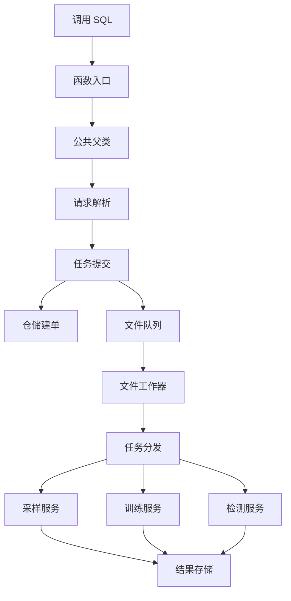
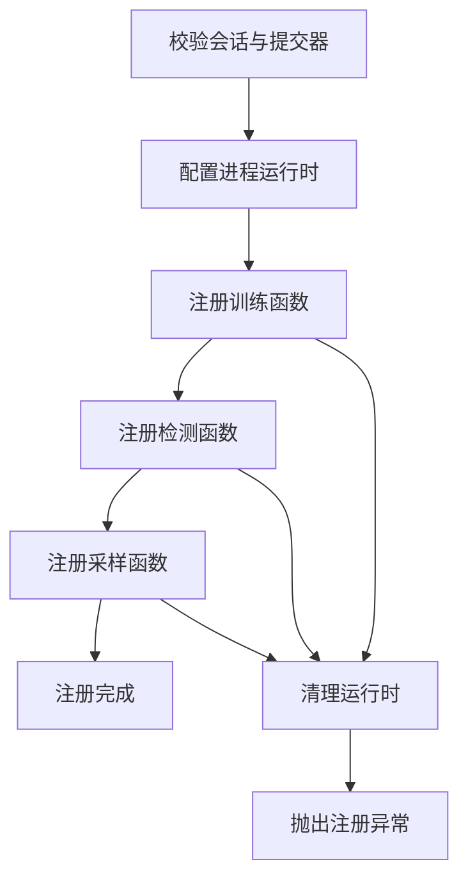
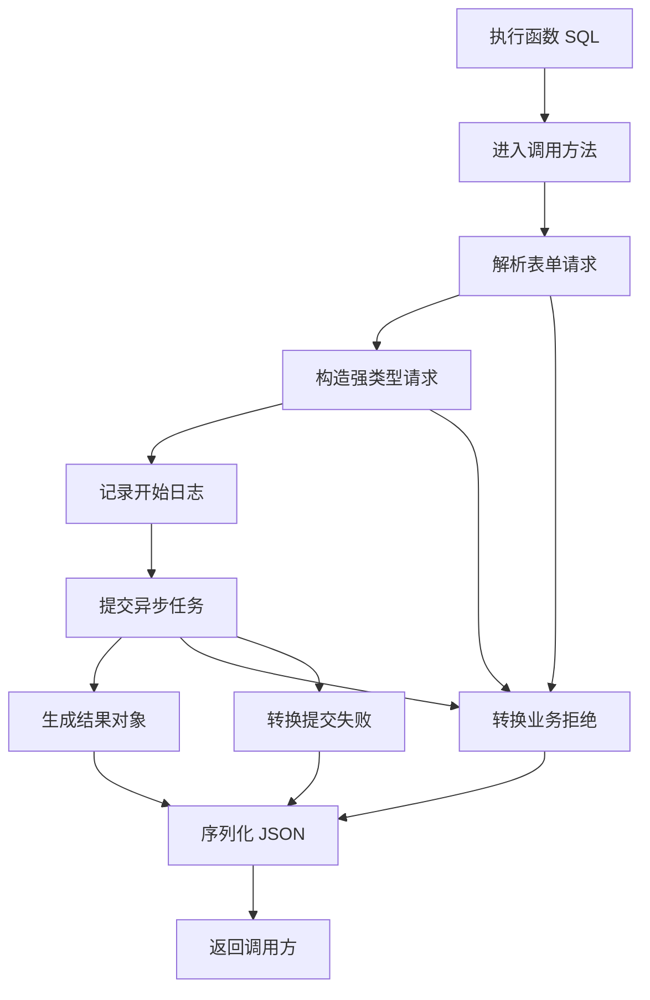
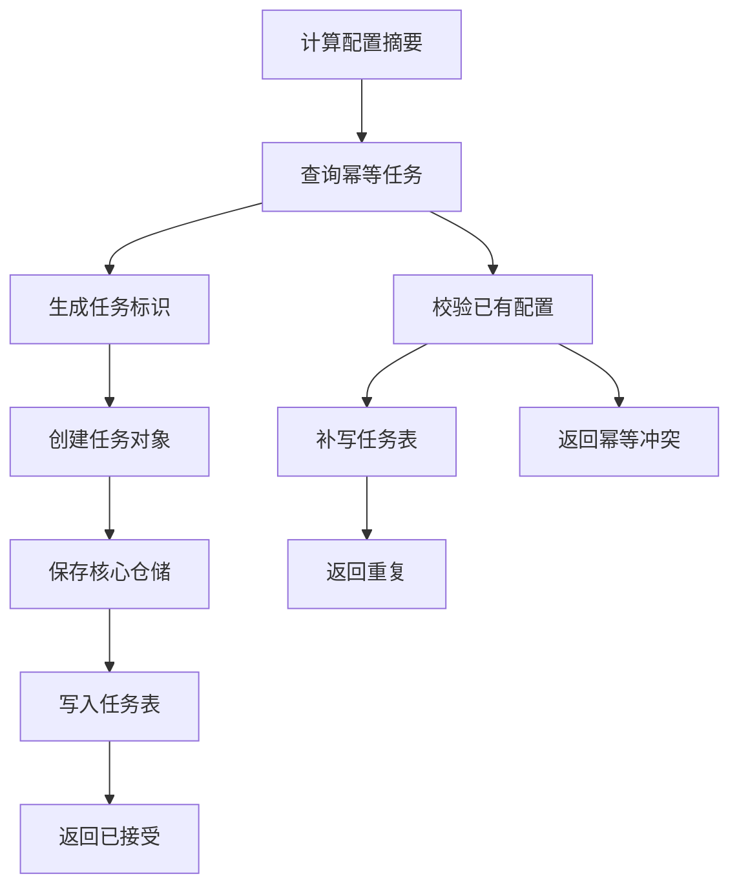
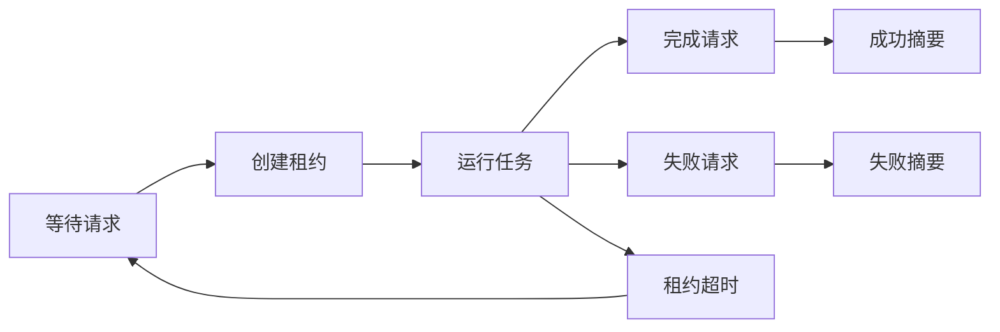
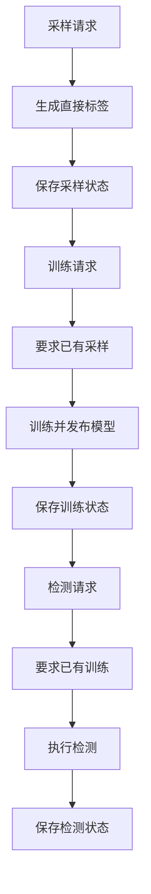
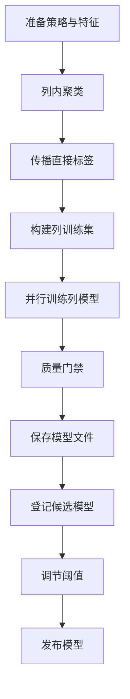
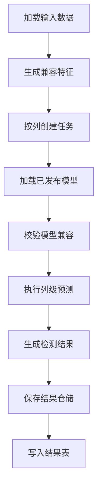

# Raha 三函数注册、调用与核心源码完整分析

## 1. 文档目标与分析范围

本文面向准备通读本工程源码的开发人员，完整回答以下问题：

1. `F_DW_RAHATRAIN`、`F_DW_RAHADETECT`、`F_DW_RAHASAMPLE` 三个函数分别是什么。
2. 三个函数如何进入 Spark SQL 或 Hive 函数目录。
3. 一条 SQL 从函数调用到参数校验、任务受理、异步执行和最终算法服务，代码经过哪些类。
4. 三个函数共用了哪些基础设施，又在哪个位置开始分流。
5. 采样、训练、检测三个核心服务内部实际执行什么。
6. 当前源码已经完整接通什么，仍缺少什么，阅读时不能误解什么。

本文基于 2026 年 7 月 17 日 11 时 47 分的工作区源码分析。当前工作区包含尚未提交的独立类名注册、文件提交器和文件工作器相关改动，因此本文以工作区实际代码为准，不以旧版 `README.md` 的部分描述为准。

---

## 2. 先给出最重要的结论

### 2.1 三个函数不是同步算法函数

三个函数都只有一个字符串参数，返回一个 JSON 字符串。函数执行期间只负责：

1. 解码和校验请求。
2. 固定任务类型。
3. 将请求交给某个 `RahaUdfJobSubmitter`。
4. 返回 `ACCEPTED`、`DUPLICATE` 或 `REJECTED`。

SQL 返回 `ACCEPTED` 只表示异步任务已经被受理或落盘，不表示采样、训练或检测已经执行完成。

### 2.2 三个入口类本身几乎没有业务代码

三个类都继承 `AbstractRahaTableUdf`，差异只有构造时传入的任务类型：

| 函数 | Java 类 | 固定任务类型 | 专属必填参数 |
| --- | --- | --- | --- |
| `F_DW_RAHATRAIN` | `F_DW_RAHATRAIN` | `TRAIN` | `annotationReference` |
| `F_DW_RAHADETECT` | `F_DW_RAHADETECT` | `DETECT` | `modelVersion` |
| `F_DW_RAHASAMPLE` | `F_DW_RAHASAMPLE` | `SAMPLE` | 正整数 `labelingBudget` |

参数解析、日志、异常转换和 JSON 返回都在 `AbstractRahaTableUdf` 中完成。

### 2.3 当前有两种注册方式

| 注册方式 | 注册入口 | UDF 内提交器来源 | 适用场景 |
| --- | --- | --- | --- |
| 宿主程序化注册 | `RahaUdfRegistrar.register` | 注册时直接注入 | FMDB 宿主应用正式装配 |
| 独立类名注册 | `ADD JAR` 与 `CREATE TEMPORARY FUNCTION` | 无参构造器创建运行时代理 | SQL 脚本独立安装 |

独立类名注册只有在 `raha.udf.queue-directory` 已配置时，才能通过 `FileRahaUdfJobSubmitter` 写入共享任务目录。未配置共享目录、进程运行时又未注入提交器时，调用会返回 `UDF_RUNTIME_UNAVAILABLE`。

### 2.4 当前有两种异步受理实现

| 实现 | 受理结果 | 是否保存完整请求 | 当前是否有配套消费者 |
| --- | --- | --- | --- |
| `RepositoryBackedRahaUdfJobSubmitter` | 保存 `RahaJob` 并写 FMDB 任务表 | 否，只保存任务元数据和配置摘要 | 没有通用消费者 |
| `FileRahaUdfJobSubmitter` | 保存完整表单请求文件和回执 | 是 | 有 `FileRahaUdfJobWorker` |

### 2.5 真正算法执行发生在分发器之后

`FileRahaUdfJobWorker` 读取请求后只调用 `RahaUdfTaskDispatcher.dispatch(request)`。分发器是平台接入核心服务的边界。

当前仓库没有通用生产分发器类。唯一完整示例位于 `RahaContainerValidationApplication.dispatchUdfTask`，它按 `SAMPLE`、`TRAIN`、`DETECT` 顺序调用容器验收应用内部的方法。

### 2.6 请求字段尚未完整贯通到核心服务

这是理解当前源码最关键的边界：

| UDF 字段 | 校验和持久化 | 容器验收分发实际使用情况 |
| --- | --- | --- |
| `inputReference`、`sourceType`、`rowIdColumn`、`snapshotId` | 已进入 `RahaUdfRequest`，可通过 `toDataLoadRequest` 转换 | 示例分发器使用启动时预加载的数据集，没有按请求重新加载 |
| `annotationReference` | 训练入口强制校验 | 示例训练使用此前主动采样产生的标签，没有读取该引用 |
| `modelVersion` | 检测入口强制校验 | `RahaDetectRequest` 没有该字段，检测服务按兼容条件加载唯一已发布模型 |
| `labelingBudget` | 采样入口强制校验为正整数 | 示例采样使用配置工厂中的预算，没有使用请求预算 |
| `resultTable` | 用于提交响应位置或任务配置摘要 | 示例最终写入应用常量指定的结果表 |

因此，当前代码证明了注册、请求契约、异步受理、文件消费和算法闭环可以分别工作，但尚未形成一个完全由 `RahaUdfRequest` 驱动的通用生产闭环。

### 2.7 旧版说明与当前工作区有差异

`README.md` 仍写着不能只用 `CREATE TEMPORARY FUNCTION` 调用，以及仓库没有文件消费者。当前工作区已经增加：

- Hive 风格的 `evaluate` 入口。
- `FileRahaUdfJobSubmitter`。
- `FileRahaUdfJobWorker`。
- 独立类名注册集成测试。
- `scripts/register_raha_udfs.sql` 注册脚本。

阅读时应以本次分析引用的源码为准，并在代码合并后同步更新 `README.md`。

---

## 3. 总体架构



从职责上可分为六层：

| 层次 | 核心类 | 职责 |
| --- | --- | --- |
| 函数注册层 | `RahaUdfRegistrar`、三个函数类 | 把类绑定到 SQL 函数名 |
| UDF 协议层 | `AbstractRahaTableUdf`、`RahaUdfRequestParser` | 解析、校验、提交、错误转换 |
| 任务受理层 | 两个 `RahaUdfJobSubmitter` 实现 | 幂等建单或写入文件队列 |
| 任务消费层 | `FileRahaUdfJobWorker`、`RahaUdfTaskDispatcher` | 认领、恢复、解析和分发任务 |
| 核心业务层 | 三个 `Raha...Service` | 执行采样、训练或检测 |
| FMDB 适配层 | `FmdbDatasetLoader`、`SparkSqlFmdbResultWriter` | 读取输入和写任务、检测结果 |

---

## 4. 三个函数类如何定义

### 4.1 类继承关系

```text
org.apache.hadoop.hive.ql.exec.UDF
  └─ AbstractRahaTableUdf
       ├─ F_DW_RAHATRAIN
       ├─ F_DW_RAHADETECT
       └─ F_DW_RAHASAMPLE

org.apache.spark.sql.api.java.UDF1<String, String>
  └─ AbstractRahaTableUdf
```

`AbstractRahaTableUdf` 同时：

- 继承 Hive 的 `UDF`，向类名注册方式提供 `evaluate(String)`。
- 实现 Spark 的 `UDF1<String, String>`，向程序化注册方式提供 `call(String)`。

`evaluate` 不重复实现逻辑，只转调 `call`，所以两种注册方式最终使用相同的解析、提交和异常协议。

### 4.2 三个子类为什么很薄

以训练类为例，构造器实质是：

```java
super(RahaTaskType.TRAIN, new RahaUdfRequestParser(), submitter);
```

检测类传 `DETECT`，采样类传 `SAMPLE`。任务类型不是请求方能传入的普通字段，而是由 SQL 函数类固定。这样可以防止调用训练函数却在正文中伪装成检测任务。

### 4.3 两个构造器的意义

每个函数都有两个构造器：

1. 无参构造器创建 `RuntimeRahaUdfJobSubmitter`，供 Hive 反射实例化。
2. 有参构造器接受明确的 `RahaUdfJobSubmitter`，供注册器注入和测试替换。

这也是程序化注册与独立注册能够共用三个入口类的原因。

---

## 5. 函数名称和配置如何加载

### 5.1 默认配置

`raha-defaults.properties` 中定义：

```properties
raha.udf.train-function=F_DW_RAHATRAIN
raha.udf.detect-function=F_DW_RAHADETECT
raha.udf.sample-function=F_DW_RAHASAMPLE
raha.udf.max-request-length=65536
raha.udf.queue-directory=
```

### 5.2 配置对象约束

`RahaConfigFactory.udfConfig()` 读取上述属性并创建 `UdfConfig`。`UdfConfig` 做四类检查：

1. 函数名必须符合 `[A-Za-z_][A-Za-z0-9_]*`。
2. 三个函数名必须互不相同。
3. 请求最大长度必须大于零。
4. 共享目录空白时转换为 `null`。

### 5.3 配置加载时机

`RahaDefaultConfigProvider` 使用静态内部类延迟初始化。第一次调用 `factory()` 或 `properties()` 时，才通过 `RahaConfigLoader` 合并：

1. 类路径默认配置。
2. 外部配置文件。
3. Java 系统属性。

合并结果随后被进程级静态对象缓存。因此，依赖默认配置工厂的属性覆盖应在第一次访问配置前完成。

### 5.4 静态函数常量的边界

`RahaUdfRegistrar.TRAIN_FUNCTION`、`DETECT_FUNCTION`、`SAMPLE_FUNCTION` 总是来自默认配置工厂。若使用 `new RahaUdfRegistrar(customConfig)` 注册自定义名称，实际注册名来自 `customConfig`，但这三个静态常量仍表示默认工厂中的名称。

调用自定义注册器时，不应继续假设静态常量一定等于实际注册名称。

---

## 6. 第一种注册方式：宿主程序化注册

### 6.1 注册代码

核心入口是：

```java
new RahaUdfRegistrar().register(sparkSession, submitter);
```

`register` 的执行顺序如下：



实际注册调用均使用：

```java
sparkSession.udf().register(functionName, udfObject, DataTypes.StringType);
```

第三个参数声明返回类型为字符串。输入类型由 `UDF1<String, String>` 的泛型和 Spark 调用共同确定。

### 6.2 为什么既配置静态运行时，又把提交器传给对象

注册器先调用 `RahaUdfRuntime.configure(submitter)`，然后创建 `new F_DW_RAHATRAIN(submitter)` 等对象。

真正可靠的 Spark 执行路径是后者：提交器作为 UDF 对象字段随闭包序列化到执行环境。集成测试在注册后主动调用 `RahaUdfRuntime.clear()`，SQL 仍能成功，证明注册对象携带的可序列化提交器不依赖驱动进程静态变量。

静态运行时主要服务于同一进程中通过无参构造器创建的函数对象。它不是跨 Driver 和 Executor 的共享状态。

### 6.3 提交器的序列化要求

`RahaUdfJobSubmitter` 接口本身没有继承 `Serializable`，但 Spark 注册对象需要被序列化时，实际注入实现及其字段必须可序列化，或调用必须保证只在 Driver 发生。

测试中的 `SerializableStaticSubmitter` 和文件提交器明确可序列化。`RepositoryBackedRahaUdfJobSubmitter` 没有实现 `Serializable`，且依赖仓储、结果写入器和 Spark 会话，因此不能直接假定它适合被分发到远端 Executor。

这意味着生产宿主必须明确 UDF 在何处执行，以及提交器是否能安全序列化和跨节点访问。

### 6.4 注册失败处理

任一 `sparkSession.udf().register` 抛出运行时异常时：

1. 清空 `RahaUdfRuntime`。
2. 记录完整异常堆栈。
3. 原样抛出异常。

已成功注册的前置函数不会被逐一注销，所以注册失败后 Spark 会话中可能保留部分函数，但运行时提交器已被清空。宿主应把本次注册视为整体失败并重建或清理会话。

---

## 7. 第二种注册方式：独立类名注册

### 7.1 注册脚本

项目提供 `scripts/register_raha_udfs.sql`：

```sql
ADD JAR /path/to/fmdb-udf-raha-1.0.0-SNAPSHOT-all.jar;

CREATE TEMPORARY FUNCTION F_DW_RAHATRAIN
AS 'com.fiberhome.ml.raha.udf.F_DW_RAHATRAIN';

CREATE TEMPORARY FUNCTION F_DW_RAHADETECT
AS 'com.fiberhome.ml.raha.udf.F_DW_RAHADETECT';

CREATE TEMPORARY FUNCTION F_DW_RAHASAMPLE
AS 'com.fiberhome.ml.raha.udf.F_DW_RAHASAMPLE';
```

三个函数互相独立，可以按需注册其中一个或多个。

### 7.2 Jar 为什么能用于独立注册

`pom.xml` 中：

- `spark-sql`、`spark-hive`、`spark-mllib` 和日志接口均为 `provided`，由 FMDB Spark 环境提供。
- `maven-shade-plugin` 在打包阶段生成 `*-all.jar`。
- Shade Jar 排除依赖签名文件，避免合并后签名失效。
- 编译和运行基线是 JDK 8、Spark 3.3.1、Scala 2.12。

Hive 通过类名反射调用无参构造器，然后调用 `evaluate(String)`。

### 7.3 无参构造器如何找到提交器

无参构造器创建 `RuntimeRahaUdfJobSubmitter`。该代理构造时尝试读取文件提交配置：

1. 优先读取 Java 系统属性 `raha.udf.queue-directory`。
2. 未设置时读取统一配置工厂中的同名属性。
3. 仍为空时，不创建文件提交器。

每次提交时的选择优先级为：

```text
RahaUdfRuntime 中已注入的提交器
  > 构造时创建的 FileRahaUdfJobSubmitter
  > 抛出 UDF_RUNTIME_UNAVAILABLE
```

文件提交器在 UDF 对象构造时确定。构造完成后再修改系统属性，不会更新该对象已经保存的 `standaloneSubmitter`。

### 7.4 独立注册的运行前提

1. Jar 必须对函数实例化和执行所在进程可见。
2. `raha.udf.queue-directory` 必须是绝对或可稳定解析的共享路径。
3. Driver、Executor 和文件工作器必须能访问同一目录。
4. 路径权限必须允许创建、读取、移动和删除文件。
5. 必须另行启动 `FileRahaUdfJobWorker` 的轮询或调度循环。

`FileRahaUdfJobWorker.runOnce()` 只扫描一次，不是常驻线程。

---

## 8. 一次 SQL 调用的公共代码路径

### 8.1 调用总流程



### 8.2 `AbstractRahaTableUdf.call` 的关键逻辑

1. 记录开始时间。
2. 调用 `parser.parse(taskType, encodedRequest)`。
3. 安全记录任务类型、数据集、调用方和请求长度。
4. 调用 `submitter.submit(request)`。
5. 记录任务标识、状态和耗时。
6. 调用 `RahaUdfSubmissionResult.toJson()` 返回字符串。

### 8.3 两类异常如何转换

| 异常 | 来源 | 返回结果 |
| --- | --- | --- |
| `RahaUdfException` | 参数、幂等冲突、运行时不可用 | 保留稳定业务错误码，状态为 `REJECTED` |
| 其他 `RuntimeException` | 仓储、FMDB、文件系统或未知提交异常 | 错误码统一为 `UDF_SUBMISSION_FAILED`，消息只返回异常类名 |

两类异常都记录堆栈。返回内容不直接暴露原始请求和下游异常消息。

### 8.4 返回 JSON 的固定字段

| 字段 | 含义 |
| --- | --- |
| `jobId` | 新建或重复任务标识，拒绝时为空 |
| `taskType` | `TRAIN`、`DETECT` 或 `SAMPLE` |
| `status` | `ACCEPTED`、`DUPLICATE` 或 `REJECTED` |
| `resultLocation` | 结果或请求位置 |
| `configVersion` | 规范配置的 SHA-256 摘要 |
| `errorCode` | 拒绝错误码 |
| `errorMessage` | 脱敏错误摘要 |
| `submittedAt` | Unix 毫秒时间戳 |

仓储提交器返回 `fmdb://<resultTable>/<jobId>`；文件提交器返回请求文件的 URI。调用方不能假定两种提交器的 `resultLocation` 具有相同协议。

---

## 9. 请求如何解码和校验

### 9.1 为什么入参不是 JSON

入参采用标准表单编码：

```text
key=value&key=value
```

`FormDataCodec` 使用 UTF-8 的 `URLEncoder` 和 `URLDecoder`，编码时按键排序，解码时拒绝：

- 空请求。
- 没有等号的字段。
- 空参数名。
- 重复参数名。
- 非法百分号转义。

按键排序使同一组配置能生成稳定文本和稳定摘要。

### 9.2 允许字段白名单

`RahaUdfRequestParser.ALLOWED_KEYS` 只允许以下字段：

| 字段 | 三类任务共同必填 | 说明 |
| --- | --- | --- |
| `datasetId` | 是 | 逻辑数据集标识 |
| `inputReference` | 是 | FMDB 表名或只读 SQL |
| `sourceType` | 是 | 仅允许 `TABLE` 或 `SQL` |
| `rowIdColumn` | 是 | 稳定且唯一的行标识字段 |
| `snapshotId` | 否 | 指定输入快照 |
| `idempotencyKey` | 是 | 调用方幂等键 |
| `caller` | 是 | 调用方审计标识 |
| `resultTable` | 是 | 结果表名 |
| `annotationReference` | 否 | 仅训练使用 |
| `modelVersion` | 否 | 仅检测使用 |
| `labelingBudget` | 否 | 仅采样使用 |

出现白名单以外的字段时返回 `UNKNOWN_UDF_ARGUMENT`。这样能及时暴露字段拼写错误，而不是静默忽略。

### 9.3 任务专属规则

| 任务 | 必须满足 | 明确禁止 |
| --- | --- | --- |
| 训练 | `annotationReference` 非空 | `modelVersion`、非零 `labelingBudget` |
| 检测 | `modelVersion` 非空 | `annotationReference`、非零 `labelingBudget` |
| 采样 | `labelingBudget` 大于零 | `annotationReference`、`modelVersion` |

缺失的 `labelingBudget` 先解析为零，再由采样请求规则拒绝。

### 9.4 表名与 SQL 校验边界

`resultTable` 总是使用 `SparkSqlFmdbTableGateway.validateTableName` 校验，只允许一至三级英文标识。

当 `sourceType=TABLE` 时，`inputReference` 也执行同样校验。当 `sourceType=SQL` 时，UDF 请求层不解析 SQL；后续 `FmdbDatasetLoader` 只检查去除首尾空白后的文本是否以 `select ` 或 `with ` 开头，再交给 `sparkSession.sql`。

这只是前缀级只读约束，不是完整 SQL 语法或权限分析。生产环境仍需依赖 FMDB 权限、只读会话策略和 SQL 审计。

### 9.5 `RahaUdfRequest` 的三个重要转换

1. `toDataLoadRequest()`：把 FMDB 表或 SQL 来源转换为核心加载请求。
2. `toCanonicalConfiguration()`：排除 `caller` 和 `idempotencyKey`，生成用于配置摘要的稳定文本。
3. `toEncodedRequest()`：保留执行所需全部字段，供文件消费者重新解析。

`caller` 不进入配置摘要，所以同一业务配置可由不同调用方用同一幂等键重试。`idempotencyKey` 本身也不参与摘要，因为它是查找已有任务的键。

---

## 10. 仓储任务提交器的完整流程

### 10.1 依赖

`RepositoryBackedRahaUdfJobSubmitter` 依赖：

- `JobRepository`：保存核心 `RahaJob`。
- `FmdbResultWriter`：写 FMDB 任务状态表。
- `jobTable`：任务表名。
- `RahaIdGenerator`：生成新任务标识。
- `Clock`：生成可测试时间。

### 10.2 新任务受理



配置摘要是 `sha256(toCanonicalConfiguration())`。

新任务先保存核心仓储，再写 FMDB 任务表。若 FMDB 写入失败，相同请求重试时会查到已有任务，然后再次执行 `writeJob`，用于补写外部任务状态。

### 10.3 幂等判断

查询键是 `datasetId` 与 `idempotencyKey`。查到已有任务后还要比较：

- `configVersion` 是否一致。
- `JobType` 是否一致。

一致返回 `DUPLICATE`，不一致抛出 `IDEMPOTENCY_CONFLICT`。

### 10.4 重要实现边界

1. `submit` 使用 `synchronized`，只能串行化同一个提交器实例，不能提供跨进程分布式锁。
2. `findByIdempotentKey` 与 `save` 是否跨进程原子，取决于实际 `JobRepository` 实现。
3. `SparkSqlFmdbTableGateway.appendIdempotent` 也是单实例同步和先查后写，不是数据库唯一约束或分布式事务。
4. `RahaJob` 没有保存完整 `RahaUdfRequest`，只保存任务类型、数据集、快照、摘要和状态等元数据。
5. 单靠该仓储记录，后台消费者无法恢复 `inputReference`、`annotationReference`、`modelVersion` 和 `labelingBudget`。

所以生产宿主若采用仓储提交器，必须额外保存完整请求或同时投递可靠消息，当前类只完成“建单和写任务状态”。

---

## 11. 文件任务提交器的完整流程

### 11.1 文件命名

请求路径为：

```text
<queueDirectory>/<idempotencyKey>-<taskType>.request
```

例如：

```text
add-jar-train-train.request
```

提交回执路径是在完整请求文件名后追加 `.receipt`：

```text
add-jar-train-train.request.receipt
```

### 11.2 新任务写入顺序

1. 计算配置摘要。
2. 创建共享目录。
3. 使用 `CREATE_NEW` 独占创建回执文件。
4. 使用 `CREATE_NEW` 独占创建请求文件。
5. 返回 `ACCEPTED`，结果位置为请求文件 URI。

回执包含 `jobId`、`taskType`、`datasetId`、`configVersion` 和 `submittedAt`。请求文件包含完整表单请求。

### 11.3 重复请求

若回执已经存在，提交器读取并比较：

- 幂等键。
- 任务类型。
- 数据集标识。
- 配置摘要。

全部一致返回 `DUPLICATE`，不一致返回 `IDEMPOTENCY_CONFLICT`。

即使请求已经被工作器归档，回执仍保留，所以后续重试仍会返回 `DUPLICATE`。

### 11.4 文件提交器的风险点

1. `idempotencyKey` 直接参与文件名，当前只校验非空，没有限制路径分隔符、点目录或文件系统非法字符。生产使用前必须增加安全文件名约束或只使用摘要作为文件名。
2. 回执先于请求写入。进程若在两次写入之间崩溃，可能留下孤立回执；后续重试会被判定为重复，但目录中没有可消费请求。
3. 文件创建保证单个共享文件系统上的排他创建，不等同于跨存储实现都具有相同原子语义。
4. 文件内容包含表名、SQL 和调用参数，目录访问控制、加密和保留清理必须由部署环境负责。

---

## 12. 文件工作器如何消费任务

### 12.1 `runOnce` 不是常驻消费

每次调用 `runOnce()` 执行：

1. 恢复超时运行任务。
2. 扫描合法 `.request` 文件。
3. 按文件名排序。
4. 逐个尝试认领。
5. 解析并分发。
6. 写成功或失败终态。
7. 返回本轮成功任务数。

宿主需要自行提供定时循环、线程生命周期、停止信号和监控。

### 12.2 文件状态机



对应文件后缀为：

| 状态 | 文件 |
| --- | --- |
| 等待 | `.request` |
| 排他租约 | `.lease` |
| 运行中 | `.running` |
| 成功归档 | `.completed.request` |
| 成功摘要 | `.succeeded` |
| 失败归档 | `.failed.request` |
| 失败摘要 | `.failed` |

### 12.3 并发认领

多个工作器可以同时扫描同一目录。认领分两步：

1. `Files.createFile(leasePath)` 独占创建租约。
2. 将 `.request` 移动为 `.running`。

只有先创建租约的工作器能继续。请求消失或运行文件已存在被视为正常竞争，当前工作器释放自己的租约并跳过。

该机制保证同一时刻只有一个工作器执行任务，但不能保证业务上的严格恰好一次。

### 12.4 超时恢复

工作器扫描 `.running` 文件：

- 租约缺失时立即恢复。
- 租约最后修改时间加超时不晚于当前时间时恢复。
- 有效租约对应的任务不处理。

恢复会把 `.running` 改回 `.request` 并删除租约。默认租约超时为五分钟。

如果工作器已经完成下游副作用，却在写终态前崩溃，恢复后会再次分发。因此下游训练、检测、采样和结果写入仍需按任务标识实现幂等。

### 12.5 分发与终态写入

工作器从文件名确定任务类型，再使用 `RahaUdfRequestParser` 重新校验正文。正文不能覆盖文件名中的类型。

随后调用：

```java
String summary = dispatcher.dispatch(request);
```

成功时先把 `.running` 移为 `.completed.request`，再写 `.succeeded`。失败时尽量移为 `.failed.request`，并只把异常类名写入 `.failed`，避免泄露下游原始错误消息。

### 12.6 文件工作器的风险点

1. 租约文件没有心跳更新，执行时间超过固定超时的正常长任务可能被另一个工作器回收。
2. 超时恢复使用 `REPLACE_EXISTING`，需要共享文件系统提供符合预期的移动和一致性语义。
3. 成功归档后若写成功摘要失败，原 `.running` 已不存在，异常分支可能形成完成请求与失败摘要并存的歧义状态。
4. 失败任务不会自动重试；它被归档为 `.failed.request`，需人工或宿主策略重新投递。
5. `completionText` 直接拼接分发器摘要，没有调用 `FormDataCodec.encode`；摘要含 `&` 或 `=` 时，下游按表单解析会产生歧义。

---

## 13. 当前真正接通的分发器

`RahaUdfTaskDispatcher` 只是一个函数式接口，没有默认实现：

```java
String dispatch(RahaUdfRequest request);
```

当前完整示例是容器验收应用传入的 Lambda：

```java
request -> dispatchUdfTask(request, dirtyDataset, truth,
        coreStorage, fmdbGateway, state)
```

`dispatchUdfTask` 的顺序依赖是：



该状态保存在 `ValidationWorkerState` 进程内对象中，所以容器验收流程要求采样、训练和检测严格顺序执行。它不是可横向扩展的生产任务状态实现。

---

## 14. 采样函数最终如何执行核心算法

### 14.1 设计上应有的链路

```text
F_DW_RAHASAMPLE
  -> AbstractRahaTableUdf.call
  -> RahaUdfRequestParser.parse
  -> 异步提交器
  -> FileRahaUdfJobWorker
  -> RahaUdfTaskDispatcher
  -> FmdbDatasetLoader
  -> RahaFeaturePreparationService
  -> RahaSampleService
  -> ActiveSamplingOrchestrator
```

当前容器验收应用预先加载并画像数据集，因此示例分发器从 `RahaFeaturePreparationService` 开始，而不是使用 `request.toDataLoadRequest()` 重新加载。

### 14.2 特征准备

`RahaFeaturePreparationService.prepare` 依次执行：

1. 必要时缓存输入数据帧并触发 `count()` 物化。
2. `StrategyPlanService.generateAndSave` 生成确定性策略计划。
3. `StrategyExecutionService.execute` 并行执行策略。
4. `FeatureService.assembleAndSave` 把策略命中组装为稀疏单元格特征。
5. 对策略标识和配置摘要排序后计算策略计划版本。
6. 释放由本服务创建的缓存。

默认策略注册表包含八个策略：三个 OD、四个 PVD 和一个 RVD。

### 14.3 聚类和覆盖采样

`RahaSampleService.sample`：

1. 若没有可复用聚类，调用 `ColumnClusteringService.clusterAndSaveParallel` 按列聚类。
2. 调用 `SamplingService.createTasks` 计算覆盖分数并创建标注任务。
3. 返回聚类结果、采样结果和统一任务摘要。

`ClusterCoverageScorer` 根据已有直接标签对簇的覆盖情况给候选行打分，`TupleSampler` 使用稳定随机种子执行加权无放回选择。

### 14.4 主动采样循环

`ActiveSamplingOrchestrator` 将总预算拆成每轮一个元组：

1. 计算扣除已标注行后的有效预算。
2. 每轮调用一次 `RahaSampleService.sample`。
3. 要求本轮只生成一个标注任务。
4. 通过 `SampledTupleLabelProvider` 获取该行的直接标签。
5. 拒绝空标签、传播标签和重复单元格标签。
6. 完成并持久化标注任务。
7. 复用上一轮聚类，继续下一轮。

容器验收的标签提供器来自脏表与真值表差异，这用于自动化验收；真实生产环境应替换成人工标注平台或其他受控标签来源。

---

## 15. 训练函数最终如何执行核心算法

### 15.1 完整业务链路



### 15.2 `RahaTrainService.train`

1. 如果没有复用采样阶段的特征，缓存输入并调用特征准备服务。
2. 如果准备结果没有聚类，再执行按列聚类。
3. 调用 `LabelPropagationService.propagateAndSave`，把直接标签传播到同簇单元格。
4. 为每个有特征字典的字段创建一个并行训练任务。
5. 使用 `BoundedParallelExecutor` 按最大并行列数和阶段超时执行。
6. 汇总成功、跳过和失败字段。
7. 没有候选模型时返回失败；部分字段或策略失败时返回部分成功；其余返回成功。
8. 最终释放由训练服务持有的输入缓存。

### 15.3 单字段训练

`trainColumn` 的关键步骤：

1. 通过特征行和传播标签构建 `ColumnTrainingDataset`。
2. 若传播训练集不可训练，或正例比例低于 5% 或高于 95%，尝试回退到直接标签训练集。
3. 由 `AdaptiveColumnModelTrainer` 选择 Spark 逻辑回归或加权规则回退训练器。
4. 通过 `ModelQualityGate` 检查模型质量。
5. 只有状态为 `TRAINED` 才保存模型参数。
6. 创建模型元数据并由 `ModelReleaseManager.markCandidate` 标记为候选。

### 15.4 候选不是已发布模型

`RahaTrainService` 只产出候选模型。容器验收应用在服务返回后额外执行：

1. 保存特征字典。
2. 对特定字段使用验证集比较阈值。
3. 调用 `ModelReleaseManager.publish` 发布候选模型。

生产分发器也必须明确实现候选评估和发布策略，否则检测服务无法加载已发布模型。

### 15.5 `annotationReference` 的当前断点

UDF 层要求训练请求携带 `annotationReference`，但 `RahaTrainRequest` 接收的是已经加载好的 `List<CellLabel>`，不接收表名。

生产分发器需要补充：读取 `request.getAnnotationReference()`、校验标签模式、转换为 `CellLabel`、再构造 `RahaTrainRequest`。当前仓库没有这段通用实现。

---

## 16. 检测函数最终如何执行核心算法

### 16.1 完整业务链路



当前容器验收直接复用训练阶段的特征和策略计划版本，没有从检测请求重新生成特征。

### 16.2 `RahaDetectService.detect`

1. 遍历所有特征字典，为每个字段创建并行检测任务。
2. `PublishedColumnModelLoader.load` 按数据集、字段、模式摘要、特征字典版本和策略计划版本加载兼容的已发布模型。
3. `ColumnModelPredictor.predict` 批量生成分数、阈值和错误判断。
4. 把预测和特征来源转换为 `DetectionResult`。
5. 汇总字段成功和失败。
6. 只要有结果，就调用 `DetectionResultRepository.saveAll`。
7. 全部字段失败返回失败，部分字段失败返回部分成功，全部成功返回成功。

单字段异常由并行执行器隔离，不会直接丢弃其他字段结果。

### 16.3 检测结果的脱敏设计

`DetectionResult` 保存单元格坐标、值摘要、可选掩码、分数、阈值、策略标识、模型和字典版本。`SparkSqlFmdbResultWriter` 写 FMDB 时把 `masked_value` 固定写为 `null`，不写原始单元格值。

幂等写入键是 `job_id`、`cell_id`、`model_version`。

### 16.4 `modelVersion` 的当前断点

UDF 请求强制提供 `modelVersion`，但 `RahaDetectRequest` 不包含该字段，`PublishedColumnModelLoader.load` 也不是按请求版本加载，而是按兼容条件查找唯一已发布模型。

因此当前 UDF 的 `modelVersion` 只参与请求规范配置和幂等摘要，没有控制实际检测模型。生产设计必须二选一并统一：

1. 让检测严格使用请求版本，并把版本贯通到 `RahaDetectRequest` 和模型加载器。
2. 删除 UDF 必填版本，明确采用“唯一兼容已发布模型”语义。

在完成统一前，不能向调用方承诺指定 `modelVersion` 已被实际使用。

---

## 17. 三条调用链对照

| 阶段 | 采样 | 训练 | 检测 |
| --- | --- | --- | --- |
| SQL 入口 | `F_DW_RAHASAMPLE` | `F_DW_RAHATRAIN` | `F_DW_RAHADETECT` |
| 固定类型 | `SAMPLE` | `TRAIN` | `DETECT` |
| 专属参数 | `labelingBudget` | `annotationReference` | `modelVersion` |
| 共同解析 | `RahaUdfRequestParser` | `RahaUdfRequestParser` | `RahaUdfRequestParser` |
| 异步受理 | `RahaUdfJobSubmitter` | `RahaUdfJobSubmitter` | `RahaUdfJobSubmitter` |
| 文件消费 | `FileRahaUdfJobWorker` | `FileRahaUdfJobWorker` | `FileRahaUdfJobWorker` |
| 分发边界 | `RahaUdfTaskDispatcher` | `RahaUdfTaskDispatcher` | `RahaUdfTaskDispatcher` |
| 核心服务 | `RahaSampleService` | `RahaTrainService` | `RahaDetectService` |
| 主要产物 | 标注任务和直接标签 | 候选列模型 | 单元格检测结果 |
| 后置动作 | 人工标注 | 质量评估和发布 | 写 FMDB 结果表 |

三条链路在 UDF 层高度统一，真正差异从分发器和核心服务请求对象开始。

---

## 18. SQL 调用示例

### 18.1 训练

```sql
SELECT F_DW_RAHATRAIN(
  'datasetId=orders_202607&inputReference=ods.orders_dirty&sourceType=TABLE&rowIdColumn=id&idempotencyKey=train_orders_202607_v1&caller=data_quality&resultTable=dw.raha_task_result&annotationReference=dw.raha_labels'
) AS submission_result;
```

### 18.2 检测

```sql
SELECT F_DW_RAHADETECT(
  'datasetId=orders_202607&inputReference=ods.orders_dirty&sourceType=TABLE&rowIdColumn=id&snapshotId=orders_snapshot_001&idempotencyKey=detect_orders_202607_v1&caller=data_quality&resultTable=dw.raha_detection_result&modelVersion=orders_model_v1'
) AS submission_result;
```

### 18.3 采样

```sql
SELECT F_DW_RAHASAMPLE(
  'datasetId=orders_202607&inputReference=ods.orders_dirty&sourceType=TABLE&rowIdColumn=id&idempotencyKey=sample_orders_202607_v1&caller=data_quality&resultTable=dw.raha_annotation_task&labelingBudget=20'
) AS submission_result;
```

参数值包含空格、等号、连接符、中文或 SQL 特殊字符时，必须使用标准表单编码库，不能手工拼接。

---

## 19. 错误码和可观测性

### 19.1 UDF 层错误码

| 错误码 | 触发条件 |
| --- | --- |
| `INVALID_UDF_ARGUMENT` | 缺失字段、非法来源、任务专属参数冲突、请求超长 |
| `UNKNOWN_UDF_ARGUMENT` | 出现白名单外字段 |
| `IDEMPOTENCY_CONFLICT` | 同一幂等键对应不同配置 |
| `UDF_RUNTIME_UNAVAILABLE` | 无运行时提交器且无文件提交器 |
| `UDF_SUBMISSION_FAILED` | 未预期提交异常 |

### 19.2 核心服务状态

核心服务不使用 UDF 的三种受理状态，而使用 `RahaTaskStatus` 表达最终执行结果，例如成功、部分成功和失败。必须区分：

- UDF `ACCEPTED`：已受理。
- 文件 `.succeeded`：分发器执行成功并完成状态落盘。
- 核心 `SUCCEEDED`：算法服务业务成功。

这三个层次不是同一个状态机。

### 19.3 日志保护

UDF 日志记录任务类型、数据集、调用方、请求长度、任务标识、状态和耗时，不记录完整请求。异常响应只返回稳定错误摘要或异常类名。

但文件队列正文仍保存完整请求，且部分底层日志会记录表名和路径。部署时需要通过目录权限、日志权限和保留策略保护这些元数据。

---

## 20. 测试验证结果

### 20.1 本次执行命令

在项目要求的 JDK 8 环境执行：

```powershell
$env:JAVA_HOME='D:\Program Files\java\jdk8u492-b09'
mvn '-Dtest=RahaTableUdfIntegrationTest,FileRahaUdfJobWorkerTest,RahaUdfConfigurationTest' test
```

结果：9 个测试全部通过，无失败、无错误、无跳过。

### 20.2 已验证语义

| 测试 | 覆盖内容 |
| --- | --- |
| `RahaTableUdfIntegrationTest` | 三类任务受理、重复提交、幂等冲突、非法参数、异常转换 |
| 同一集成测试 | `RahaUdfRegistrar` 的 Spark SQL 注册和调用 |
| 同一集成测试 | 三个类通过 `CREATE TEMPORARY FUNCTION` 独立注册并写文件请求 |
| `FileRahaUdfJobWorkerTest` | 两工作器并发时只执行一次、过期租约恢复 |
| `RahaUdfConfigurationTest` | 名称默认值、唯一性、请求长度上限和共享目录默认值 |

### 20.3 JDK 17 的环境性失败

首次使用当前默认 JDK 17 并跳过版本门禁执行时，Spark 3.3.1 因 Java 模块未开放 `sun.nio.ch` 抛出 `IllegalAccessError`。切换到工程规定的 JDK 8 后全部通过。

这不是本次 UDF 逻辑失败，而是项目构建基线与运行 JDK 不匹配。正式构建和测试必须使用 JDK 8。

### 20.4 测试没有证明的内容

现有测试尚未证明：

1. 真正多节点共享文件系统上的原子语义。
2. `RepositoryBackedRahaUdfJobSubmitter` 的跨进程幂等。
3. 完整 UDF 请求字段到三个核心服务请求的贯通。
4. 独立注册后由常驻消费者完成真实算法任务。
5. 长时间任务的租约心跳与重复执行保护。
6. 恶意 `idempotencyKey` 的路径安全。

---

## 21. 当前源码的关键缺口和风险优先级

### 21.1 高优先级

1. 缺少通用生产 `RahaUdfTaskDispatcher` 实现。
2. 仓储提交器没有保存完整请求，无法仅凭任务记录驱动后台执行。
3. `annotationReference`、`modelVersion`、`labelingBudget` 和 `resultTable` 没有完整贯通实际核心服务。
4. 文件提交器直接把 `idempotencyKey` 拼入路径，存在路径逃逸和非法文件名风险。
5. 文件租约没有心跳，长任务可能被错误回收并重复执行。

### 21.2 中优先级

1. 文件队列是至少一次恢复语义，下游必须全面幂等。
2. 回执先写、请求后写，崩溃窗口可能形成无法消费的孤立回执。
3. 程序化注册失败不会撤销已注册的部分函数。
4. `RepositoryBackedRahaUdfJobSubmitter` 不可直接假定能被 Spark 序列化。
5. SQL 只读校验只是前缀检查，不是完整安全分析。

### 21.3 文档一致性

`README.md` 的独立注册和消费者限制已落后于当前工作区。合并当前改动时应同步更新函数部署说明、共享目录配置和已知限制。

---

## 22. 推荐的源码通读顺序

### 第一阶段：先理解入口协议

1. `F_DW_RAHATRAIN.java`
2. `F_DW_RAHADETECT.java`
3. `F_DW_RAHASAMPLE.java`
4. `AbstractRahaTableUdf.java`
5. `RahaUdfRequestParser.java`
6. `RahaUdfRequest.java`
7. `RahaUdfSubmissionResult.java`

读完这一组，应能回答“SQL 入参如何变成强类型请求，错误如何变成 JSON”。

### 第二阶段：理解注册与运行时

1. `RahaUdfRegistrar.java`
2. `RahaUdfRuntime.java`
3. `RuntimeRahaUdfJobSubmitter.java`
4. `UdfConfig.java`
5. `RahaDefaultConfigProvider.java`
6. `RahaConfigLoader.java`
7. `scripts/register_raha_udfs.sql`

读完这一组，应能回答“对象由谁创建、提交器从哪里来、函数名由谁决定”。

### 第三阶段：理解异步边界

1. `RahaUdfJobSubmitter.java`
2. `RepositoryBackedRahaUdfJobSubmitter.java`
3. `FileRahaUdfJobSubmitter.java`
4. `FileRahaUdfJobWorker.java`
5. `RahaUdfTaskDispatcher.java`

读完这一组，应能回答“受理成功保存了什么、消费者如何认领、失败如何恢复”。

### 第四阶段：理解三个算法服务

1. `RahaFeaturePreparationService.java`
2. `RahaSampleService.java`
3. `ActiveSamplingOrchestrator.java`
4. `RahaTrainService.java`
5. `RahaDetectService.java`

随后向下追踪策略、特征、聚类、采样、标签传播、模型和检测包。

### 第五阶段：看真实装配示例

最后阅读 `RahaContainerValidationApplication.java`，重点看：

- `runWorkerLifecycle`
- `runSubmitter`
- `dispatchUdfTask`
- `sampleLabels`
- `train`
- `detect`
- `writeDetectionResults`

该类能展示完整算法闭环，但必须始终记住它是容器验收应用，不是通用生产分发器。

---

## 23. 关键源码索引

| 文件 | 重点位置 | 阅读目的 |
| --- | --- | --- |
| `src/main/java/com/fiberhome/ml/raha/udf/RahaUdfRegistrar.java` | `register` | 程序化注册顺序和失败清理 |
| `src/main/java/com/fiberhome/ml/raha/udf/AbstractRahaTableUdf.java` | `call`、`evaluate` | 两种调用方式的公共实现 |
| `src/main/java/com/fiberhome/ml/raha/udf/RahaUdfRequestParser.java` | `parse` | 长度、白名单和基础类型校验 |
| `src/main/java/com/fiberhome/ml/raha/udf/RahaUdfRequest.java` | 构造器、三个转换方法 | 任务专属规则与请求序列化 |
| `src/main/java/com/fiberhome/ml/raha/udf/RepositoryBackedRahaUdfJobSubmitter.java` | `submitRequest` | 仓储建单和幂等冲突 |
| `src/main/java/com/fiberhome/ml/raha/udf/FileRahaUdfJobSubmitter.java` | `submit` | 文件请求、回执和幂等 |
| `src/main/java/com/fiberhome/ml/raha/udf/FileRahaUdfJobWorker.java` | `runOnce`、`claim`、`execute` | 消费状态机和恢复语义 |
| `src/main/java/com/fiberhome/ml/raha/service/RahaFeaturePreparationService.java` | `prepare` | 策略到稀疏特征 |
| `src/main/java/com/fiberhome/ml/raha/service/RahaSampleService.java` | `sample` | 聚类覆盖采样 |
| `src/main/java/com/fiberhome/ml/raha/service/RahaTrainService.java` | `train`、`trainColumn` | 标签传播和列级训练 |
| `src/main/java/com/fiberhome/ml/raha/service/RahaDetectService.java` | `detect`、`detectColumn` | 已发布模型批量检测 |
| `src/main/java/com/fiberhome/ml/raha/app/RahaContainerValidationApplication.java` | 分发与三个业务方法 | 当前唯一完整装配示例 |
| `src/test/java/com/fiberhome/ml/raha/udf/RahaTableUdfIntegrationTest.java` | 全部测试 | 注册和调用契约证据 |
| `src/test/java/com/fiberhome/ml/raha/udf/FileRahaUdfJobWorkerTest.java` | 全部测试 | 并发认领和恢复证据 |

---

## 24. 最终理解模型

可以用一句话概括本工程三个函数：

> 三个 SQL 函数是固定任务类型的异步命令入口，共用严格请求协议和提交结果协议；任务提交后必须经过外部消费者和分发器，才会进入采样、训练或检测核心服务。

阅读源码时始终区分四个动作：

1. **注册函数**：让 SQL 引擎知道函数名和 Java 类。
2. **调用函数**：解析请求并返回受理结果。
3. **消费任务**：从仓储、消息或文件队列取出完整请求。
4. **执行算法**：加载数据并调用三个核心服务。

当前仓库已经较完整地实现了第 1、2 步和文件模式下的第 3 步，也通过容器验收示例实现了第 4 步；尚未完成的是把所有 UDF 请求字段、可靠任务存储、生产分发器和三个核心服务组合成统一、可扩展、可恢复的生产闭环。
