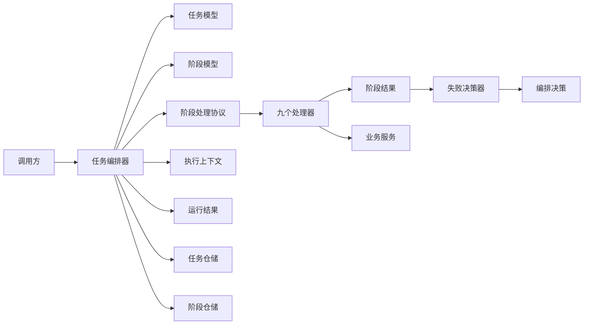
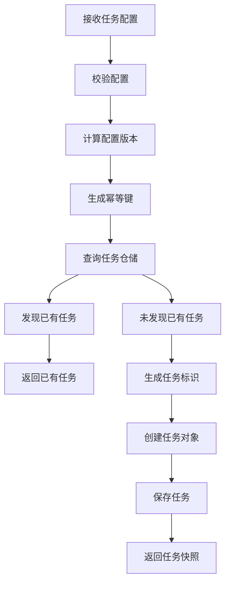
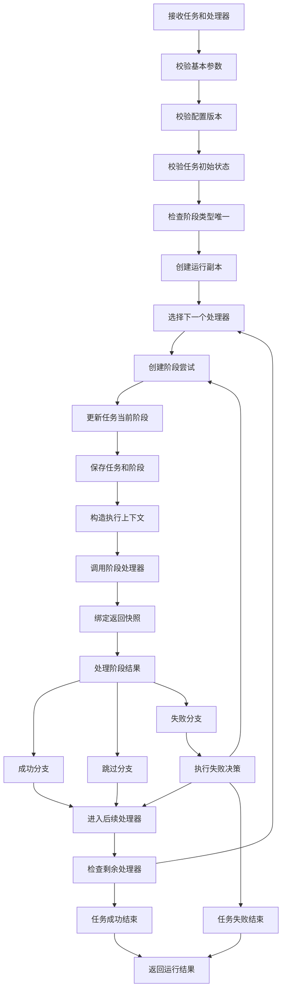
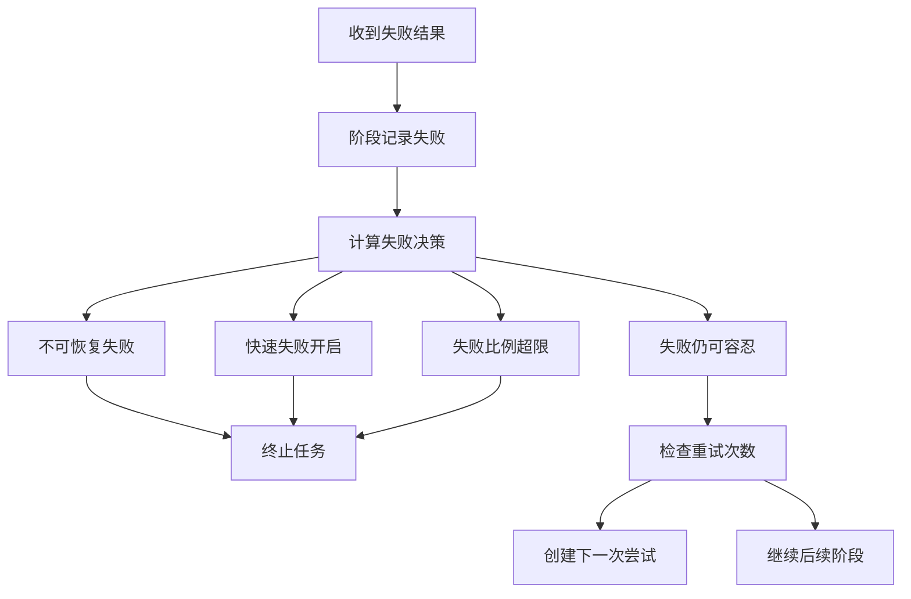
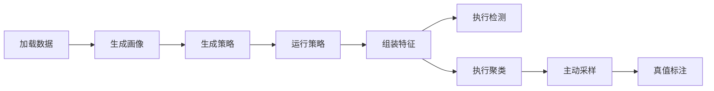
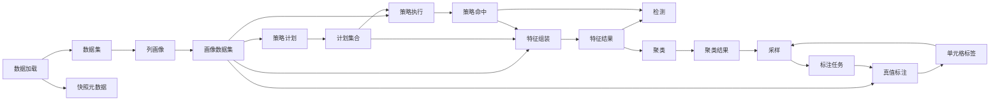
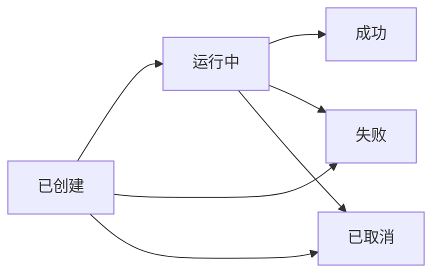
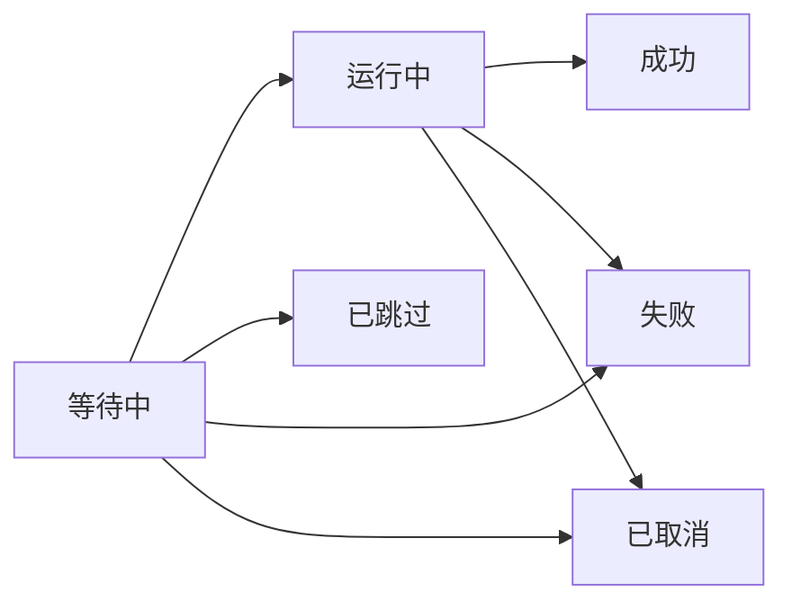
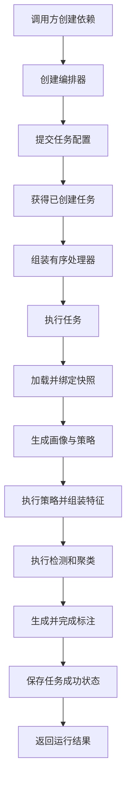

# Raha 任务编排 `job` 包类关系与流程完整分析

## 1. 分析范围与结论摘要

本文分析以下目录中的全部 23 个 Java 类型：

- `src/main/java/com/fiberhome/ml/raha/job`
- `src/main/java/com/fiberhome/ml/raha/job/stage`

分析依据为当前源码、状态枚举、配置对象、仓储接口以及任务编排相关单元测试和集成测试。本文描述的是当前代码实际关系，不把尚未接入的阶段类型推断为已经实现。

核心结论如下：

1. `RahaJobOrchestrator` 是唯一的任务编排核心，负责幂等提交、阶段顺序执行、阶段重试、失败容忍、任务终止和运行结果汇总。
2. 编排器不内置固定业务流水线，阶段顺序完全由调用方传入的 `List<StageHandler>` 决定。
3. 九个具体阶段处理器之间不直接调用，统一通过 `StageExecutionContext.attributes` 传递中间数据。
4. `RahaJob` 和 `RahaStage` 分别维护任务状态机和阶段状态机；编排器负责驱动两者并持久化快照。
5. `StageResult` 描述阶段结果，`StageFailureDecider` 将失败结果和容忍配置转换为重试、继续或终止决策。
6. 当前完整集成测试展示了九阶段流程，但生产源码中未发现 `job` 包外对编排器和具体处理器的正式装配入口。
7. 当前跳过分支存在状态机冲突：编排器先将阶段置为运行中，再调用 `RahaStage.skip`，但 `StageStatus` 不允许从运行中转换为已跳过，因此任何实际跳过结果都会抛出状态转换异常。

## 2. 包内类型清单

### 2.1 编排与领域模型

| 类型 | 类型性质 | 直接职责 |
|---|---|---|
| `RahaJobOrchestrator` | 最终类 | 提交任务、校验任务、驱动阶段、处理重试和失败、保存任务与阶段 |
| `RahaJob` | 最终类 | 保存任务标识、幂等信息、输入快照、时间和任务状态 |
| `RahaStage` | 最终类 | 保存单次阶段尝试的标识、类型、次数、时间和状态 |
| `JobRunResult` | 最终类 | 汇总最终任务快照、全部阶段尝试和共享属性 |
| `StageExecutionContext` | 最终类 | 向处理器提供任务快照、配置、阶段快照和共享属性 |
| `StageAttributeKeys` | 工具类 | 定义阶段间共享属性的标准键 |

### 2.2 结果与失败决策

| 类型 | 类型性质 | 直接职责 |
|---|---|---|
| `StageResult` | 最终类 | 表示成功、跳过或失败，并携带错误、失败比例和快照标识 |
| `StageOutcome` | 枚举 | 定义成功、跳过、失败三种处理器结果 |
| `StageFailureDecider` | 最终类 | 根据可恢复性、快速失败、失败比例和重试次数给出决策 |
| `FailureDecision` | 枚举 | 定义重试、继续和终止三种编排决策 |

### 2.3 标识与幂等

| 类型 | 类型性质 | 直接职责 |
|---|---|---|
| `RahaIdGenerator` | 接口 | 抽象任务标识和阶段标识生成 |
| `DefaultRahaIdGenerator` | 最终类 | 生成随机任务标识和确定性阶段标识 |
| `IdempotencyKeyGenerator` | 最终类 | 根据任务配置和配置版本生成任务幂等键 |

### 2.4 阶段处理器

| 类型 | 阶段类型 | 直接职责 |
|---|---|---|
| `StageHandler` | 无固定类型 | 定义阶段类型获取和阶段执行协议 |
| `DataLoadStageHandler` | `LOAD_DATA` | 加载数据集并建立输入快照 |
| `ColumnProfileStageHandler` | `PROFILE` | 生成列画像并替换共享数据集版本 |
| `StrategyPlanStageHandler` | `GENERATE_STRATEGY` | 根据画像生成并保存策略计划 |
| `StrategyRunStageHandler` | `RUN_STRATEGY` | 执行策略计划并输出命中和批次结果 |
| `FeatureStageHandler` | `GENERATE_FEATURE` | 将策略计划和命中组装为稀疏特征 |
| `DetectionStageHandler` | `PREDICT` | 根据特征与策略命中生成检测结果 |
| `ClusterStageHandler` | `CLUSTER` | 对特征执行列内聚类 |
| `SamplingStageHandler` | `SAMPLE` | 根据聚类和已有标签生成标注任务 |
| `GroundTruthLabelStageHandler` | `LABEL` | 使用真值数据集自动完成标注任务 |

## 3. 总体类关系

图中节点与类的对应关系：

| 节点 | 对应类型 |
|---|---|
| 任务编排器 | `RahaJobOrchestrator` |
| 任务模型 | `RahaJob` |
| 阶段模型 | `RahaStage` |
| 阶段处理协议 | `StageHandler` |
| 九个处理器 | `job.stage` 下九个实现类 |
| 执行上下文 | `StageExecutionContext` |
| 阶段结果 | `StageResult`、`StageOutcome` |
| 失败决策器 | `StageFailureDecider` |
| 编排决策 | `FailureDecision` |
| 运行结果 | `JobRunResult` |
| 任务仓储 | `JobRepository` |
| 阶段仓储 | `StageRepository` |

## 4. 直接依赖关系详解

### 4.1 `RahaJobOrchestrator` 的直接关系

| 被依赖对象 | 关系 | 用途 |
|---|---|---|
| `RahaConfigValidator` | 构造注入 | 提交和执行前校验任务配置 |
| `ConfigVersioner` | 构造注入 | 计算配置版本，并校验提交与执行配置一致 |
| `IdempotencyKeyGenerator` | 构造注入 | 生成幂等键 |
| `RahaIdGenerator` | 构造注入 | 生成任务标识和每次阶段尝试标识 |
| `StageFailureDecider` | 构造注入 | 将失败结果转换为编排决策 |
| `JobRepository` | 构造注入 | 查询幂等任务并保存任务状态 |
| `StageRepository` | 构造注入 | 保存每次阶段尝试状态 |
| `Clock` | 构造注入 | 提供可测试的统一时间 |
| `RahaJob` | 创建和修改 | 创建任务副本并驱动任务状态 |
| `RahaStage` | 创建和修改 | 为每次尝试创建独立阶段并驱动状态 |
| `StageHandler` | 调用 | 按调用方给定顺序执行阶段 |
| `StageExecutionContext` | 创建 | 封装单次处理器调用需要的上下文 |
| `StageResult` | 消费 | 判断成功、跳过或失败 |
| `JobRunResult` | 创建 | 返回任务最终结果 |
| `RahaLogContext` | 创建 | 组织任务、阶段、尝试和快照日志上下文 |
| `ArtifactVersion` | 创建 | 保存阶段时提供配置、快照、阶段和尝试版本 |

`RahaJobOrchestrator` 不直接依赖任何具体阶段处理器，因此可以运行任意实现 `StageHandler` 的阶段集合。它只检查处理器非空、阶段类型非空、阶段类型不重复，不检查业务顺序是否正确。

### 4.2 领域对象之间的直接关系

| 主体 | 直接关联 | 关系说明 |
|---|---|---|
| `RahaJob` | `JobStatus`、`JobType` | 保存任务类型并通过状态枚举校验状态转换 |
| `RahaStage` | `StageStatus`、`StageType` | 保存阶段类型并通过状态枚举校验状态转换 |
| `StageExecutionContext` | `RahaJob`、`RahaJobConfig`、`RahaStage`、`Map<String,Object>` | 聚合处理器执行所需信息 |
| `JobRunResult` | `RahaJob`、`List<RahaStage>`、`Map<String,Object>` | 聚合最终运行结果 |
| `StageResult` | `StageOutcome` | 以枚举标识结果类型 |
| `StageFailureDecider` | `StageResult`、`FailureToleranceConfig`、`FailureDecision` | 消费结果与配置并返回编排决策 |
| `DefaultRahaIdGenerator` | `RahaIdGenerator`、`StageType` | 实现标识生成接口 |
| `IdempotencyKeyGenerator` | `RahaJobConfig` | 从配置字段和配置版本构造哈希源 |

### 4.3 阶段处理器的共同关系

九个实现类都只直接实现 `StageHandler`，共同遵循以下协议：

1. `getStageType` 返回唯一阶段类型。
2. `execute` 接收 `StageExecutionContext`。
3. 从共享属性读取上游结果。
4. 调用各自业务服务。
5. 把业务结果写入共享属性。
6. 返回 `StageResult`，由编排器统一更新阶段和任务状态。

处理器不会直接调用下一个处理器，也不会自己创建 `RahaStage`、修改 `RahaJob` 或决定重试。

## 5. 任务提交流程

`submit` 方法使用实例级同步控制，单个编排器实例内可避免同时创建重复任务。完整幂等仍依赖仓储层对幂等键的唯一性和并发保存语义；当前类注释也明确说明跨进程并发保护需要仓储版本配合。

幂等键的输入包括：

- 任务类型；
- 数据集标识；
- 输入引用；
- 输入快照，未确定时使用固定占位值；
- 完整配置版本。

任务标识由随机通用唯一标识生成。阶段标识由任务标识、阶段类型和尝试序号计算哈希，因此同一组输入会得到稳定阶段标识。

## 6. 通用任务执行流程

上图表示设计意图。当前代码中的跳过分支存在状态转换异常，详见第 12 节。

执行前置条件：

| 条件 | 不满足时行为 |
|---|---|
| 已提交任务非空 | 抛出参数异常 |
| 处理器列表非空 | 抛出参数异常 |
| 配置通过校验 | 校验器抛出异常 |
| 执行配置版本等于任务配置版本 | 抛出参数异常 |
| 任务状态为 `CREATED` | 抛出状态异常 |
| 每个处理器及其阶段类型非空 | 抛出参数异常 |
| 同一流水线阶段类型不重复 | 抛出参数异常 |

编排器没有检查以下条件：

- 阶段业务顺序；
- 阶段是否适合当前任务类型；
- 下游所需共享属性是否一定由上游生成；
- 流水线是否包含数据加载或最终检测；
- 处理器对应的外部服务是否具有事务一致性。

## 7. 阶段失败、重试与继续流程

决策规则按代码顺序如下：

1. 非失败结果直接返回继续，但编排器只在失败分支调用该决策器。
2. 结果不可恢复时终止。
3. 开启快速失败时终止。
4. `failedRatio` 大于最大容忍比例时终止。
5. 当前尝试序号不大于最大重试次数时重试。
6. 已无重试机会且失败仍在容忍范围内时继续后续阶段。

失败比例规则：

- 总数大于零时，失败比例等于失败数除以总数。
- 失败结果总数为零时，失败比例固定为一。
- 判断使用“大于”而不是“大于等于”，所以失败比例恰好等于阈值时仍可重试或继续。
- 最大重试次数表示首次尝试之后允许新增的尝试次数。例如配置为一时，第一次失败后允许再执行一次。

重试会创建新的 `RahaStage`，尝试序号加一，阶段标识随之变化。旧的失败阶段会保留在结果列表和阶段仓储中。

## 8. 九阶段业务数据流程

当前完整集成测试使用以下顺序。该顺序是调用方传入的示例，不是编排器内部硬编码规则。

检测和聚类都消费特征结果，二者在数据依赖上属于并列下游。集成测试把检测放在聚类之前，但当前实现中聚类不依赖检测结果，因此两者的先后由调用方决定。

### 8.1 各阶段输入、输出和外部调用

| 处理器 | 读取的共享属性 | 写入的共享属性 | 外部服务或仓储 | 返回结果 |
|---|---|---|---|---|
| `DataLoadStageHandler` | 无 | `RAHA_DATASET`、`DATASET_SNAPSHOT` | `RahaDatasetLoader.load` | 成功并返回实际快照 |
| `ColumnProfileStageHandler` | `RAHA_DATASET` | 覆盖 `RAHA_DATASET` | `ColumnProfileService.profileAndSave` | 成功；缺数据集时失败 |
| `StrategyPlanStageHandler` | `RAHA_DATASET` | `STRATEGY_PLANS` | `StrategyPlanService.generateAndSave` | 有计划时成功，无计划时跳过 |
| `StrategyRunStageHandler` | `RAHA_DATASET`、`STRATEGY_PLANS` | `STRATEGY_BATCH_RESULT`、`STRATEGY_HITS` | `StrategyExecutionService.execute` | 全部成功时成功，空计划时跳过，部分失败时返回可恢复失败 |
| `FeatureStageHandler` | `RAHA_DATASET`、`STRATEGY_PLANS`、`STRATEGY_HITS` | `FEATURE_ASSEMBLY_RESULT` | `FeatureService.assembleAndSave` | 有特征时成功，无特征时跳过 |
| `DetectionStageHandler` | `FEATURE_ASSEMBLY_RESULT`、`STRATEGY_HITS` | `DETECTION_BATCH_RESULT` | `BasicDetectionService.detectAndSave` | 成功；缺输入时失败 |
| `ClusterStageHandler` | `FEATURE_ASSEMBLY_RESULT` | `CLUSTERING_BATCH_RESULT` | `ColumnClusteringService.clusterAndSave` | 有聚类成员时成功，无成员时跳过 |
| `SamplingStageHandler` | `CLUSTERING_BATCH_RESULT`、可选 `CELL_LABELS` | `SAMPLING_BATCH_RESULT`、`ANNOTATION_TASKS` | `SamplingService.createTasks` | 有任务时成功，无任务时跳过 |
| `GroundTruthLabelStageHandler` | `RAHA_DATASET`、`ANNOTATION_TASKS` | 覆盖 `ANNOTATION_TASKS`、写入 `CELL_LABELS` | `GroundTruthLabelAdapter.label`、`AnnotationTaskRepository.saveAll` | 有完成任务时成功，无任务时跳过 |

### 8.2 共享属性生产者与消费者

属性关系的关键特点：

1. `RAHA_DATASET` 会被列画像阶段覆盖，后续读取到的是带画像的新数据集版本。
2. `STRATEGY_BATCH_RESULT` 主要作为完整运行结果输出，后续处理器实际消费的是拆出的 `STRATEGY_HITS`。
3. `DETECTION_BATCH_RESULT` 当前没有包内下游消费者，是面向调用方的最终输出之一。
4. `SAMPLING_BATCH_RESULT` 当前没有包内下游消费者；标注阶段消费的是拆出的 `ANNOTATION_TASKS`。
5. `CELL_LABELS` 对采样阶段是可选输入，对真值标注阶段是输出。这为多轮采样预留了闭环，但单次九阶段示例中采样发生在真值标注之前，所以第一轮使用空标签集合。
6. `DATASET_SNAPSHOT` 被保存到结果属性，但包内后续阶段不直接读取；任务本身通过 `StageResult.snapshotId` 绑定快照标识。

## 9. 任务和阶段状态机

### 9.1 任务状态机

任务终态为成功、失败和已取消。任何终态都不能再次转换。编排器正常执行时，第一个阶段启动会将任务从已创建改为运行中；所有阶段结束后改为成功；不可继续的阶段失败会将任务改为失败。

### 9.2 阶段状态机

阶段终态不能再次修改。重试不是复用旧阶段，而是创建尝试序号更大的新阶段。

需要注意：状态机只允许等待中阶段进入已跳过，但编排器总是在调用处理器之前启动阶段。因此处理器返回跳过时，阶段已经处于运行中，无法合法转换到已跳过。

## 10. 快照、版本和持久化关系

### 10.1 输入快照绑定

1. 任务提交时可以已经携带快照，也可以为空。
2. 数据加载处理器通过 `StageResult.successWithSnapshot` 返回实际快照标识。
3. 编排器在处理阶段结果前调用 `RahaJob.bindSnapshot`。
4. 未绑定任务可以绑定实际快照。
5. 已绑定相同快照允许重复绑定。
6. 已绑定不同快照时转换为错误码 `SNAPSHOT_CONFLICT` 的不可恢复失败。

### 10.2 制品版本

编排器保存阶段，以及大部分处理器保存业务制品时，都会构造 `ArtifactVersion`。主要组成如下：

- 配置版本；
- 快照标识；
- 阶段标识；
- 尝试序号。

在输入快照尚未建立时，编排器保存阶段使用 `PENDING_SNAPSHOT` 占位。处理器侧通常从数据集或任务快照读取真实快照。

### 10.3 快照隔离程度

`RahaJob.snapshot` 和 `RahaStage.snapshot` 会创建独立对象副本。`JobRunResult` 也会复制任务和阶段，并把列表与属性映射包装为不可修改集合。

但属性映射只做浅复制：映射结构不能增删，映射中的业务对象若本身可变，调用方仍可能修改对象内部状态。因此 `JobRunResult` 不是完整深度不可变对象。

## 11. 阶段类型覆盖情况

`StageType` 共定义 14 种类型，当前 `job.stage` 只实现其中 9 种。

| 阶段类型 | 当前处理器 |
|---|---|
| `LOAD_DATA` | `DataLoadStageHandler` |
| `PROFILE` | `ColumnProfileStageHandler` |
| `GENERATE_STRATEGY` | `StrategyPlanStageHandler` |
| `RUN_STRATEGY` | `StrategyRunStageHandler` |
| `GENERATE_FEATURE` | `FeatureStageHandler` |
| `PREDICT` | `DetectionStageHandler` |
| `CLUSTER` | `ClusterStageHandler` |
| `SAMPLE` | `SamplingStageHandler` |
| `LABEL` | `GroundTruthLabelStageHandler` |
| `INITIALIZE` | 未实现具体处理器 |
| `PROPAGATE` | 未实现具体处理器 |
| `TRAIN` | 未实现具体处理器 |
| `EVALUATE` | 未实现具体处理器 |
| `PERSIST_RESULT` | 未实现具体处理器 |

这意味着当前包已经覆盖数据加载、画像、策略、特征、基础检测、聚类、采样和真值标注，但尚未在统一编排协议下提供标签传播、模型训练、质量评估和最终结果持久化处理器。

## 12. 当前实现的关键问题与边界风险

### 12.1 高优先级：跳过分支必然触发状态异常

相关代码关系：

1. 编排器创建 `RahaStage` 后立即调用 `stage.start`，状态变为 `RUNNING`。
2. 处理器可能返回 `StageOutcome.SKIPPED`。
3. 编排器随后调用 `stage.skip`。
4. `StageStatus.canTransitionTo` 不允许 `RUNNING` 转换为 `SKIPPED`。
5. `RahaStage.skip` 因此抛出 `IllegalStateException`。

实际影响：

- 无策略计划；
- 空策略列表；
- 无可区分特征；
- 无聚类成员；
- 无采样任务；
- 无待标注任务；

以上本应正常跳过的业务场景都会中断 `execute`。该异常发生在处理器调用保护范围之外，不会被转换为 `StageResult.failure`，任务对象可能停留在运行中状态。

### 12.2 高优先级：编排器不校验业务拓扑

编排器只校验阶段类型唯一，不校验生产者和消费者关系。错误顺序会在下游以“缺少输入”的不可恢复失败结束。例如直接执行特征阶段时，会因为缺少数据集、计划和命中而失败。

这属于当前扩展性设计的直接代价：调用方拥有流水线自由度，也必须负责拓扑正确性。

### 12.3 中优先级：重试共享同一属性映射且没有回滚

所有尝试共享同一个 `attributes`。若一次处理器调用先写入部分结果再返回失败或抛出异常，下一次尝试会看到这些遗留值。当前策略执行处理器确实会在返回部分失败前写入批次结果和命中。

允许继续时，下游会消费部分失败尝试产生的命中，这是当前失败容忍语义的一部分；进行重试时则需要依赖下一次尝试覆盖旧值。通用编排器没有提供属性事务或尝试级隔离。

### 12.4 中优先级：处理器之外的异常不会收敛为任务失败结果

只有 `handler.execute` 被 `executeHandler` 捕获。以下异常可能直接逃出 `execute`：

- 任务仓储保存异常；
- 阶段仓储保存异常；
- 任务或阶段状态转换异常；
- 标识生成异常；
- 日志上下文构造异常；
- 结果处理过程中的其他运行时异常。

这类异常可能导致调用方拿不到 `JobRunResult`，并使内存状态与已持久化状态不一致。

### 12.5 中优先级：生产入口尚未装配完整流水线

在当前 `src/main/java` 中，未检索到 `job` 包外创建 `RahaJobOrchestrator` 或九个具体处理器的代码。流水线主要由 `Iteration2PipelineIntegrationTest` 到 `Iteration5PipelineIntegrationTest` 逐步展示。

因此当前包更接近可复用编排内核和已验证阶段适配器集合，尚不能仅凭该包确认生产应用已经通过它执行完整任务。

### 12.6 其他边界

1. `execute` 只允许状态为 `CREATED` 的任务运行，不支持从仓储恢复运行中任务。
2. `submit` 的同步范围只覆盖单个编排器实例，不等同于跨进程锁。
3. `JobRunResult.attributes` 是浅复制，不能保证内部业务对象不可变。
4. `StageExecutionContext.attributes` 直接暴露可变映射，键名和对象类型依靠约定及运行时检查维护。
5. 处理器异常消息为空时会由 `safeMessage` 兜底，但异常统一映射为不可恢复的 `STAGE_EXECUTION_ERROR`。
6. 当失败结果的总项数为零时，失败比例为一，通常会直接超过容忍阈值。
7. 阶段成功后保存任务，但跳过分支只保存阶段；任务仍会在进入下一阶段或最终成功时再次保存。

## 13. 典型完整调用时序

调用方最终可从 `JobRunResult` 获取：

- 最终 `RahaJob` 快照；
- 包含所有重试记录的 `RahaStage` 列表；
- 数据集、快照、策略、特征、检测、聚类、采样和标签等共享结果。

## 14. 总结

该包采用“编排器加处理器协议加共享上下文”的结构。核心领域对象与业务服务适配器分离，阶段新增成本较低，任务和阶段状态也有明确边界。九个处理器已经形成一条可运行的数据质量检测与采样标注链路。

当前最需要优先处理的是跳过状态转换冲突，因为它会让多个正常空结果场景变成未捕获异常。其次，应在生产装配入口明确不同任务类型对应的合法处理器拓扑，并决定重试时共享属性是保留、覆盖还是按尝试隔离。完成这两点后，现有编排模型才具备更稳定的生产闭环。
