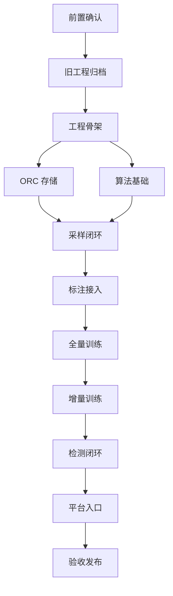

# Raha 轻量化新工程阶段开发计划

## 1. 文档说明

### 1.1 计划依据

本计划依据以下概要设计编制：

- `doc/20260717/Raha轻量化新工程概要设计与数据库结构-202607171549.md`
- `design/raha_paper.pdf`
- `doc/20260714/Raha数据检测概要设计-202607141718.md`

本文所称“阶段”只表示研发交付顺序，不在新工程中建设运行时阶段对象、状态机、编排、重试或恢复能力。

### 1.2 建设目标

1. 旧 `com.fiberhome.ml.raha` 代码完成版本标签归档后，从当前源码树删除。
2. 在原包路径重建轻量化 Raha 工程，只保留采样、标注接入、训练、增量训练和检测主链路。
3. 对外提供 `sample`、`train`、`detect` 三个同步 Java 用例和三个平台薄入口。
4. 采样、训练和检测均支持可选 `targetColumns`，未指定时按各阶段规则处理全部可用字段。
5. 首期分类器固定为 `LOGISTIC_REGRESSION`，通过训练和预测接口保留扩展点。
6. 使用 `dw` 数据库中的八张 ORC 表保存跨调用业务产物，存储根目录固定为 `/fmdb/raha/`。
7. 支持父训练样本与新增标注样本合并后的增量重新训练。
8. 核心路径、FMDB 读写和异常捕获具备完整日志。

### 1.3 技术基线

| 项目 | 基线 |
| --- | --- |
| Java | JDK 8 |
| Maven | 3.8 及以上 |
| Spark | 3.3.1 |
| Scala 二进制版本 | 2.12 |
| 测试框架 | JUnit 5 |
| 日志接口 | SLF4J 1.7.36 |
| 表存储格式 | ORC |
| 业务数据库 | `dw` |
| ORC 根目录 | `/fmdb/raha/` |
| 分类器 | `LOGISTIC_REGRESSION` |

## 2. 实施原则

1. 先固化旧算法基线，再删除旧源码，禁止新旧实现长期并存。
2. 先冻结接口和数据库契约，再迁移算法，避免算法组件反向依赖 FMDB。
3. 每个阶段形成可独立验证的产物，未满足退出条件不得进入依赖它的后续阶段。
4. 算法迁移只保留算法语义，删除旧任务、阶段、检查点、通用仓储和运行时分发参数。
5. 目标字段必须在请求解析期展开为确定列表，并参与请求指纹计算和持久化。
6. 所有业务产物使用不可变版本或确定性批次标识，不原地覆盖模型。
7. 明细先写、头记录后提交；读取方只加载存在头记录的完整产物。
8. 不在 Raha 工程内部实现后台工作器、队列、运行状态管理和失败恢复。
9. 代码、测试、SQL 和文档必须保持 UTF-8 无 BOM、LF 换行。

## 3. 阶段依赖关系



`ORC 存储`与`算法基础`可以并行开发，但采样闭环必须等待两者的稳定接口。检测依赖可加载的模型集合，因此安排在全量训练和增量训练之后。

## 4. 总体里程碑

工作量按熟悉 Java、Spark 和现有 Raha 算法的研发人员估算，不包含外部平台排期和等待时间。完成前置确认后应重新校准。

| 阶段 | 名称 | 主要结果 | 参考工作量 |
| --- | --- | --- | --- |
| P0 | 前置确认 | 平台、ORC 和规模边界明确 | 2 至 4 人日 |
| P1 | 旧工程归档 | 标签、基线、旧源码删除 | 2 至 3 人日 |
| P2 | 工程骨架与契约 | 新包结构、请求结果、配置和异常 | 4 至 7 人日 |
| P3 | ORC 数据层 | 八张表、网关、存取端口和提交协议 | 7 至 12 人日 |
| P4 | 算法基础迁移 | 画像、策略、特征和聚类 | 12 至 20 人日 |
| P5 | 采样闭环 | 可标注采样批次 | 6 至 10 人日 |
| P6 | 标注接入 | 标准标签读写和校验 | 3 至 5 人日 |
| P7 | 全量训练 | 可持久化逻辑回归模型集合 | 8 至 13 人日 |
| P8 | 增量训练 | 父样本合并和部分字段重训 | 7 至 12 人日 |
| P9 | 检测闭环 | 冻结契约预测和检测结果 | 6 至 10 人日 |
| P10 | 平台入口集成 | 三个薄入口和注册脚本 | 4 至 7 人日 |
| P11 | 系统验收与发布 | 性能、回归、交付包和发布标签 | 6 至 10 人日 |

在投入稳定且外部依赖及时的情况下，总工作量约为 67 至 113 人日。算法基线差异和 FMDB ORC 能力是主要波动来源。

## 5. P0 前置确认

### 5.1 目标

在删除旧源码前确认所有会改变基础实现路径的平台条件，避免新工程完成后无法通过 FMDB 正确执行。

### 5.2 开发任务

1. 确认 FMDB 提供 Spark 驱动进程单次执行入口，而不是可能按数据行重复调用的普通标量函数。
2. 确认入口可以取得当前 `SparkSession`，能够执行整表动作并接收查询取消。
3. 验证 `dw` 数据库建表、读写、追加和查询权限。
4. 验证 `/fmdb/raha/` 路径可创建八张 ORC 表目录。
5. 验证 FMDB 是否允许头表和列模型表不分区。
6. 验证分区表向历史 `partition_date` 追加数据的行为。
7. 确认 FMDB 是否支持跨表事务、原子分区提交或合并写入。
8. 确认模型系数直接保存在 `model_payload_json`，还是需要外部模型载荷文件。
9. 确认可扩展聚类实现、单列最大输入规模和验收数据规模。
10. 确认外部标注系统读取 `dw.raha_sample_tuple.row_data_json` 和写入 `dw.raha_cell_label` 的方式。

### 5.3 产物

- 平台能力确认记录。
- ORC 临时表读写验证记录。
- 约定数据规模、超时和资源上限。
- 未确认事项的负责人和完成时间。

### 5.4 测试与退出条件

- 在目标环境完成一次驱动进程调用并证明业务方法只执行一次。
- 创建一张临时 ORC 分区表，完成写入、分区过滤和删除验证。
- 所有会改变数据库模式或平台入口的事项均已明确；未明确项不得带入 P10 才处理。

## 6. P1 旧工程归档和删除

### 6.1 目标

把旧工程固化为可检出、可构建、可比较的只读基线，为原包路径重建创造干净边界。

### 6.2 开发任务

1. 盘点工作树修改，确认目标版本全部提交。
2. 创建可识别的旧工程最终版本标签，并记录标签、提交标识、构建环境和时间。
3. 使用 JDK 8 执行旧工程完整构建和测试。
4. 固化 `toy`、`flights`、`beers`、`hospital` 至少四组数据的算法结果。
5. 保存策略标识、命中坐标、特征维度、聚类摘要、采样顺序和检测结果。
6. 保存当前交付 Jar、注册脚本和关键配置快照。
7. 在独立临时目录检出版本标签并重新构建，证明标签可恢复。
8. 删除旧 `src/main/java/com/fiberhome/ml/raha` 生产源码。
9. 删除只服务旧结构的 `job`、`checkpoint`、`repository`、`parallel` 等测试。
10. 保留可迁移算法测试的输入和期望输出，但测试代码按新包结构重写。

### 6.3 日志和记录

- 记录旧标签、提交标识、构建命令、测试数量和结果。
- 记录每个固定数据集的随机种子、配置版本和输出摘要。
- 记录有意不迁移的旧能力清单。

### 6.4 退出条件

- 版本标签可在独立目录完成构建。
- 固定数据算法基线可被后续自动比较。
- 当前源码树不再包含旧生产实现。
- 禁止目录检查通过。

## 7. P2 工程骨架与核心契约

### 7.1 目标

建立不依赖具体算法实现和 FMDB 细节的编译基线，冻结包依赖、请求、结果、配置和异常契约。

### 7.2 包与实现任务

| 包 | 本阶段任务 |
| --- | --- |
| `api` | 建立 `RahaFacade`、三个请求和三个结果对象 |
| `config` | 建立全部不可变配置对象、默认值和校验 |
| `data` | 建立数据集、字段元数据、行身份和单元格坐标对象 |
| `support` | 建立规范化、哈希、JSON、异常和错误码工具 |
| `sample` | 定义 `SampleStore` 端口和采样领域对象 |
| `label` | 定义 `LabelStore` 端口和直接标签对象 |
| `model` | 定义模型存取、训练、预测和兼容校验接口 |
| `train` | 定义训练样本、训练模式和样本存取端口 |
| `detect` | 定义检测存取端口和检测结果对象 |

具体任务如下：

1. 请求对象实现必填字段、可选字段和类型校验。
2. 实现 `targetColumns` 解析器，保持输入模式顺序并去重。
3. 采样默认解析全部可检测字段。
4. 训练默认解析采样批次目标字段中有有效标签的全部可训练字段。
5. 检测默认解析模型集合覆盖的全部字段。
6. 显式字段不存在、不受支持或不满足模型契约时抛出 `INVALID_REQUEST`。
7. 实现表来源和 SQL 来源的 `datasetId`、`sourceType`、`snapshotId` 自动生成规则。
8. 实现 `KEY` 和 `CONTENT_GROUP` 行身份对象及校验。
9. 实现规范请求序列化和确定性请求指纹。
10. 建立 `RahaException` 和稳定错误码，不返回通用失败状态对象。
11. 建立统一日志上下文对象，至少包含用例、数据集、快照、批次或版本和目标字段。
12. 建立包依赖和禁止目录的持续集成检查。

### 7.3 测试

- 请求对象空值、非法值和边界值测试。
- `targetColumns` 默认全部、显式子集、重复字段、未知字段和稳定排序测试。
- 内容分组哈希确定性和哈希碰撞二次比较测试。
- 配置规范序列化和版本哈希测试。
- 相同已解析请求产生相同指纹的测试。
- 算法包不得依赖 `fmdb` 和 `udf` 的架构测试。

### 7.4 退出条件

- 新包骨架可在没有旧生产源码的情况下编译。
- 三个请求能够解析为不含隐式默认值的完整内部命令。
- 配置、异常、指纹和行身份测试全部通过。
- 禁止包和禁止纠正字段检查通过。

## 8. P3 ORC 数据层

### 8.1 目标

实现八张业务表、FMDB 网关和最小存取端口，使后续用例只面向领域端口读写。

### 8.2 数据库任务

1. 编写 `dw` 数据库八张表的建表 SQL。
2. 所有表显式使用 ORC 格式，位置位于 `/fmdb/raha/<table_name>/`。
3. `dw.raha_sample_tuple`、`dw.raha_cell_label`、`dw.raha_training_example`、`dw.raha_detection_result` 按 `partition_date` 分区。
4. 其余四张小表首期不分区；若 FMDB 不允许，则按 P0 确认结果调整为月分区。
5. 将 `partition_date` 固定按 `Asia/Shanghai` 时区从所属头记录创建时间生成。
6. 将 `target_columns_json`、`model_columns_json` 和 `trained_columns_json` 纳入模式校验。
7. 为八张表建立 Java 记录映射和字段类型校验。
8. 实现 `FmdbTableGateway` 的批量读取、批量追加、存在性检查和逻辑键反连接。
9. 实现采样、标签、模型、训练样本和检测存取适配器。
10. 实现明细先写、头记录后提交协议。
11. 实现相同业务标识和请求指纹的幂等返回，以及指纹冲突检查。
12. 对无头明细设置业务查询过滤规则，不在 Raha 内部建设清理任务。

### 8.3 日志

每次 FMDB 调用记录：

- 表名和分区日期。
- 批次或模型集合版本。
- 读取、候选写入、去重和实际写入数量。
- 开始时间、结束时间和耗时。
- 异常上下文和完整异常堆栈。

不在日志中输出完整 `row_data_json`、特征向量、模型系数或大段策略计划。

### 8.4 测试

- 八张表字段名、类型、分区和 ORC 位置测试。
- 四张明细表分区日期生成测试。
- `dw` 库和 `/fmdb/raha/` 路径映射测试。
- 逻辑主键防重复测试。
- 请求指纹幂等和冲突测试。
- 无头明细不可见测试。
- 零明细时头记录提交规则测试。
- ORC 文件可由 Spark 重新加载测试。

### 8.5 退出条件

- 八张表可在测试环境完整创建并通过模式检查。
- 所有存取端口具备 FMDB 实现和测试替身。
- 批量写入不逐行产生 ORC 写操作。
- 进程重启后已提交产物仍可读取。

## 9. P4 算法基础迁移

### 9.1 目标

从旧版本标签迁移纯算法能力，形成不依赖 FMDB 和用例状态的画像、策略、特征和聚类组件。

### 9.2 迁移顺序

1. `ValueNormalizer`、模式哈希和字段类型归一化。
2. `RahaDataset` 加载后的行身份和内容分组算法。
3. `ColumnProfiler` 和受限高基数统计。
4. `OD` 策略及其确定性策略标识。
5. `PVD` 策略及模式、字符和类型规则。
6. `RVD` 策略及受限列对关系规则。
7. `StrategyPlanner` 和冻结 `StrategyPlan`。
8. `FeatureDictionary`、稳定编号和稀疏特征装配。
9. `HierarchicalColumnClusterer` 及大列可扩展实现。
10. 资源上限、缓存释放和广播大小检查。

每迁移一个组件都执行“固定输入、旧标签输出、新实现输出、差异说明”的独立闭环，不直接复制旧任务或仓储调用。

### 9.3 `targetColumns` 规则

- 只为目标字段生成目标画像、策略、特征和聚类。
- 行身份字段始终可读取。
- `RVD` 关联字段可以不在目标字段中，但只作为上下文。
- 策略计划版本必须包含目标字段和依赖字段。
- 默认全部字段与显式传入相同完整字段列表必须得到相同计划版本。

### 9.4 测试

- 规范化、画像、策略、特征和聚类单元测试。
- 固定随机种子的确定性测试。
- `toy` 数据逐坐标测试。
- `flights`、`beers` 和 `hospital` 的旧基线差异测试。
- 全部字段与指定字段的策略数量、特征范围和聚类范围测试。
- 资源超过配置上限时快速失败测试。

### 9.5 退出条件

- `OD`、`PVD`、`RVD` 和特征空间可以脱离 FMDB 独立运行。
- 固定数据差异在约定阈值内，所有有意差异均有记录。
- 算法包不存在旧任务、状态和通用仓储依赖。
- 调用结束后 Spark 缓存和广播变量可以释放。

## 10. P5 采样闭环

### 10.1 目标

完成从采样请求到可供外部标注读取的已提交采样批次。

### 10.2 开发任务

1. 实现 `RahaSampleService` 同步流程。
2. 使用 `FmdbDatasetLoader` 读取表或 SQL 输入。
3. 自动解析数据集、来源、行身份、快照和目标字段。
4. 在无业务键时按全部输入列内容建立内容组。
5. 仅对目标字段执行画像、策略、特征和聚类。
6. 实现确定性 `TupleSampler` 和预算限制。
7. 保存采样行完整 `row_data_json` 和 `duplicate_count`。
8. 先批量写 `dw.raha_sample_tuple`，最后写 `dw.raha_sample_batch`。
9. 在批次头保存展开后的 `target_columns_json`。
10. 返回 `SampleResult`，包含批次、目标字段、元组数、结果位置和耗时。

### 10.3 必须日志

- 采样开始和结束。
- 输入行数、内容组数、目标字段数和重复行数。
- 各策略族数量、特征维度和聚类摘要。
- 请求预算、实际元组数和覆盖摘要。
- 两张采样表的写入数量和耗时。
- 采样失败时的请求指纹和完整异常堆栈。

### 10.4 测试

- 未指定目标字段时采样全部可检测字段。
- 指定一个或多个目标字段时只按目标字段评分。
- 关系依赖字段未被选中时仍能提供上下文。
- 预算为零、超上限和大于候选行数的边界。
- 完全相同行去重和 `duplicate_count` 权重。
- 相同输入、配置和种子得到相同采样顺序。
- `row_data_json` 与采样时快照一致。
- 采样明细写入失败时不提交批次头。

### 10.5 退出条件

- 使用 `toy` 和至少一个真实数据集生成可查询采样批次。
- 外部程序只读取采样表即可展示完整采样行。
- 默认全部和显式字段子集行为均通过端到端测试。
- 相同请求不会产生重复采样业务产物。

## 11. P6 标注接入

### 11.1 目标

提供外部标注系统与标准标签表之间的稳定契约，为训练提供可校验的直接标签。

### 11.2 开发任务

1. 定义按 `sample_batch_id` 查询采样行和目标字段的接口。
2. 定义直接标签写入适配器或标准写入 SQL。
3. 校验行和字段属于对应采样批次及目标字段。
4. 校验标签值只能为 `0` 或 `1`。
5. 从 `row_data_json` 计算并验证 `value_hash`。
6. 自动冗余 `dataset_id`、`snapshot_id` 和 `partition_date`。
7. 对重复且一致标签执行幂等处理，对冲突标签拒绝写入或在训练读取时失败。
8. 实现 `FmdbLabelStore` 按一个或多个采样批次批量读取。

### 11.3 日志

- 标注读取和写入的采样批次、字段数、记录数和耗时。
- 无效行、非目标字段、值漂移和标签冲突摘要。
- 异常捕获处记录批次、行、字段和完整堆栈。

### 11.4 退出条件

- 外部标注接口可以读取 `row_data_json` 并写入标准标签表。
- 训练侧可以按多个采样批次批量读取直接标签。
- 值漂移、未知字段和冲突标签测试通过。

## 12. P7 全量训练闭环

### 12.1 目标

根据一个或多个采样批次训练列级逻辑回归模型，并提交可独立加载的模型集合。

### 12.2 开发任务

1. 实现 `RahaTrainService` 的 `FULL` 模式。
2. 校验多个采样批次的数据集、快照、输入来源、模式和行身份一致。
3. 解析训练 `targetColumns`，默认取采样目标字段并集中有有效标签的全部可训练字段。
4. 合并直接标签，去重一致标签并拒绝冲突标签。
5. 实现列内同质性标签传播，传播标签不写长期标签表。
6. 实现 `TrainingDatasetBuilder` 和稀疏训练样本权重。
7. 实现 `ColumnModelTrainer` 扩展接口。
8. 实现 `LogisticRegressionColumnModelTrainer`，首期拒绝其他分类器类型。
9. 保存特征字典、逻辑回归系数、阈值和训练摘要。
10. 写入完整训练样本和列模型，最后提交模型集合头。
11. 在模型集合保存 `model_columns_json` 和 `trained_columns_json`。
12. 对不可训练字段记录跳过原因，全部字段跳过时训练失败。

### 12.3 日志

- 训练模式、目标字段、采样批次和直接标签数量。
- 各字段直接标签、传播标签、正负样本和权重摘要。
- 各字段训练开始、结束、耗时、阈值和指标摘要。
- 跳过字段及明确原因。
- 训练样本、列模型和模型集合写入数量及耗时。

### 12.4 测试

- 单采样批次和多采样批次全量训练。
- 默认全部可训练字段和显式字段子集。
- 无标签、单类别、样本不足和无区分度特征跳过。
- 传播冲突不传播和传播权重测试。
- 分类器类型固定为 `LOGISTIC_REGRESSION`。
- 模型载荷序列化和重新加载预测一致性。
- 进程重启后模型集合、字典和训练样本可读取。
- 任一必需明细写入失败时模型集合头不存在。

### 12.5 退出条件

- 固定数据可以完成采样、标注和全量训练闭环。
- 至少一个列模型可被新进程加载并完成相同预测。
- 模型集合完整记录目标字段、策略计划、字典和训练样本。
- 全量训练端到端测试通过。

## 13. P8 增量训练闭环

### 13.1 目标

实现基于不可变父模型集合的样本合并和部分字段重新训练，不原地更新父模型。

### 13.2 开发任务

1. 根据 `baseModelSetVersion` 自动解析 `INCREMENTAL` 模式。
2. 加载父模型集合、冻结策略计划、特征字典、列模型和完整训练样本。
3. 校验数据集、模式、规范化版本和分类器类型兼容。
4. 要求增量目标字段属于父模型覆盖字段；新增字段必须使用全量训练。
5. 使用父策略计划和父特征字典生成新增样本。
6. 按 `KEY` 或 `CONTENT_GROUP` 规则合并父样本和新增样本。
7. 新样本覆盖同一业务单元格父样本，内容变化的内容组作为新样本保留。
8. 重新计算合并样本的类别权重。
9. 只重新训练显式目标字段。
10. 未选中的父列模型和训练样本复制到新模型集合。
11. 保存新集合的父版本、完整 `model_columns_json` 和本次 `trained_columns_json`。
12. 每代物化完整训练样本，检测时不递归读取祖先版本。

### 13.3 日志

- 父模型集合、新采样批次和目标字段。
- 各字段父样本、新增样本、覆盖样本、去重样本和最终样本数。
- 复用列模型和重新训练列模型列表。
- 新模型集合版本、父版本和总耗时。
- 兼容校验失败的字段、版本和原因。

### 13.4 测试

- 单批次和多批次新增标签合并。
- 同一单元格一致标签去重和冲突标签失败。
- `KEY` 模式新快照覆盖父样本。
- `CONTENT_GROUP` 模式相同内容去重和变化内容保留。
- 默认全部字段重新训练。
- 显式部分字段重新训练且未选中列模型保持一致。
- 新增目标字段在增量模式下被拒绝。
- 父计划和字典保持不变。
- 新模型集合可独立加载，不依赖递归读取父样本。

### 13.5 退出条件

- 至少完成两代模型集合的增量训练。
- 新模型集合同时包含历史样本和新增样本。
- 部分字段重训和父字段保留行为可重复验证。
- 父模型集合内容未被修改。

## 14. P9 检测闭环

### 14.1 目标

使用模型集合冻结的策略计划和特征字典对新快照执行列级预测，并提交可追溯检测结果。

### 14.2 开发任务

1. 实现 `RahaDetectService` 同步流程。
2. 按 `modelSetVersion` 加载模型集合和列模型。
3. 解析检测 `targetColumns`，默认使用模型集合全部字段。
4. 校验显式目标字段是模型集合字段子集。
5. 校验目标字段和冻结策略依赖字段存在且类型兼容。
6. 只执行目标字段冻结策略及其必要依赖。
7. 严格按冻结特征字典生成稀疏向量。
8. 通过 `ColumnModelPredictor` 执行逻辑回归预测。
9. 生成分数、判断结果、策略标识和结构化原因。
10. 根据 `errorsOnly` 写疑似错误或目标字段全部预测。
11. 先写 `dw.raha_detection_result`，最后写 `dw.raha_detection_batch`。
12. 在检测批次保存展开后的 `target_columns_json`。

### 14.3 日志

- 模型集合、检测快照、目标字段和输入行数。
- 模式兼容检查结果和策略依赖字段。
- 各字段评估单元格数、错误数、分数摘要和耗时。
- 检测结果写入数量、分区和耗时。
- 零错误批次正常提交日志。

### 14.4 测试

- 默认检测模型集合全部字段。
- 显式检测单字段和多字段子集。
- 请求模型外字段时失败。
- 输入额外字段不产生检测结果。
- 关联字段未选为目标但仍可供冻结策略使用。
- 缺失字段、类型变化和策略版本不兼容时失败。
- `errorsOnly=true` 和 `false` 两种输出模式。
- 零错误结果仍提交检测批次头。
- 内容分组结果正确返回 `duplicate_count`。
- 检测结果可追溯模型集合和列模型版本。

### 14.5 退出条件

- 全量模型和增量模型均可完成检测。
- 进程重启后检测不依赖内存历史状态。
- 默认全部和指定字段检测结果范围准确。
- 检测结果不包含纠正值字段。

## 15. P10 平台入口集成

### 15.1 目标

把三个同步用例接入 FMDB 驱动进程单次执行入口，并完成部署脚本和调用样例。

### 15.2 开发任务

1. 实现 `DefaultRahaFacade`，只聚合三个用例服务。
2. 实现 `RahaRequestParser` 的类型化解析和长度限制。
3. 实现 `F_DW_RAHASAMPLE`，固定调用 `facade.sample`。
4. 实现 `F_DW_RAHATRAIN`，固定调用 `facade.train`。
5. 实现 `F_DW_RAHADETECT`，固定调用 `facade.detect`。
6. 入口不得创建队列、后台线程、静态 Spark 会话和跨调用缓存。
7. 将业务异常转换为平台可识别错误，同时保留根异常日志。
8. 更新 `scripts/register_raha_udfs.sql` 和部署说明。
9. 给出包含 `targetColumns` 和默认全部行为的调用样例。
10. 验证查询取消可以中断当前 Spark 作业并释放缓存。

### 15.3 测试

- 三个入口各自只调用一个门面方法。
- 请求解析、未知参数、重复参数和非法字段测试。
- 入口正常返回摘要和异常转换测试。
- 同一平台命令只执行一次业务方法的集成测试。
- 交付 Jar 不包含旧实现和禁止包。
- 注册脚本在测试环境可重复执行。

### 15.4 退出条件

- 三个入口在目标 FMDB 测试环境完成真实调用。
- 默认全部和指定字段调用样例均通过。
- 取消、超时和异常日志包含完整业务上下文。
- 入口层不存在算法逻辑和运行时分发逻辑。

## 16. P11 系统验收与发布

### 16.1 功能验收

1. 使用固定数据完成采样、外部标注、全量训练、增量训练和检测全链路。
2. 一次训练能够合并同一快照的多个采样批次。
3. 三个阶段均验证 `targetColumns` 缺省和显式子集行为。
4. 增量训练验证部分字段重训和未选中父模型保留。
5. 检测严格复用冻结策略计划和特征字典。
6. 分类器类型全部为 `LOGISTIC_REGRESSION`。
7. 所有结果可定位到数据集、快照、行、列和模型版本。

### 16.2 数据验收

1. 八张 `dw.raha_*` 表通过最终模式检查。
2. ORC 目录全部位于 `/fmdb/raha/`。
3. 四张明细表按 `partition_date` 正确裁剪。
4. 相同请求指纹不产生重复业务产物。
5. 无头明细不被业务读取。
6. 每个模型集合均可读取完整训练样本。
7. 进程退出后批次、标签、模型和检测结果仍可独立加载。

### 16.3 算法验收

- `toy` 完成逐坐标准确性检查。
- `flights`、`beers`、`hospital` 完成旧标签基线对比。
- 固定随机种子下策略计划、特征编号和采样顺序稳定。
- 论文主流程中的策略、特征、聚类、采样、传播、训练和预测语义均有对应测试。
- 与旧结果存在差异时有明确原因、影响和接受阈值。

### 16.4 性能与资源验收

- 驱动进程不收集全量输入、命中和特征。
- 策略数、关系列对数、聚类输入和广播大小有硬上限。
- 调用结束释放缓存和广播变量。
- 在约定规模和 FMDB 查询超时内完成三条用例。
- 检查 ORC 分区数、文件数和平均文件大小，确认没有逐行小文件。
- 验证指定字段相较默认全部字段能够减少实际计算范围。

### 16.5 日志验收

- 三个核心用例均记录开始、关键分支、结束、结果摘要和耗时。
- 所有 FMDB 读写记录表名、分区、批次、数量和耗时。
- 异常捕获处记录业务上下文和完整异常堆栈。
- 增量训练记录父版本、历史样本、新增样本、合并样本和新版本。
- 日志不输出完整行内容、完整特征向量和完整模型载荷。

### 16.6 发布任务

1. 使用 JDK 8 执行 `mvn clean verify`。
2. 检查普通 Jar 和带依赖交付 Jar 的内容。
3. 执行禁止目录和禁止字段扫描。
4. 固化最终测试报告、性能报告、DDL 和注册脚本。
5. 在测试环境完成一次全新部署和一次版本替换演练。
6. 创建新工程首个可发布版本标签。
7. 发布时只部署新实现，不在同一运行环境并存旧类。
8. 回退时使用旧版本标签对应的完整交付包和注册脚本，不在新源码中恢复旧代码。

### 16.7 最终退出条件

- 架构、功能、数据、算法、日志和性能验收全部通过。
- 所有阻断级缺陷关闭。
- 交付包、DDL、注册脚本、配置说明和调用样例齐全。
- 新标签能够在独立目录检出并完成构建。

## 17. 测试门禁

| 门禁 | 执行时机 | 内容 | 通过条件 |
| --- | --- | --- | --- |
| G1 | 每次提交 | 编译、格式、禁止目录和依赖检查 | 无失败 |
| G2 | 每个算法组件完成 | 单元测试和固定基线比较 | 无未解释差异 |
| G3 | 每个用例完成 | Spark 本地集成测试 | 主流程和异常流程通过 |
| G4 | ORC 或存取变更 | FMDB 表适配测试 | 模式、分区和提交协议通过 |
| G5 | 每个里程碑完成 | 用例端到端测试 | 阶段退出条件全部满足 |
| G6 | 发布前 | 全量构建、真实 FMDB、性能和回归 | 验收报告通过 |

建议构建命令：

```powershell
mvn -DskipTests compile
mvn test
mvn clean verify
```

禁止目录和纠正字段检查应作为 Maven 验证阶段或持续集成脚本固定执行，不能只依赖人工检查。

## 18. `targetColumns` 专项验收矩阵

| 用例 | 场景 | 期望结果 |
| --- | --- | --- |
| 采样 | 不传 `targetColumns` | 展开为全部可检测字段并持久化 |
| 采样 | 指定字段子集 | 只对目标字段画像、聚类和评分，仍保存完整采样行 |
| 采样 | 未知或不支持字段 | 请求失败，不写采样明细 |
| 训练 | 不传 `targetColumns` | 使用采样目标字段中有有效标签的全部可训练字段 |
| 训练 | 指定字段子集 | 只训练指定字段 |
| 训练 | 字段不属于采样目标并集 | 请求失败 |
| 增量训练 | 指定父模型字段子集 | 只重训指定字段，其余父列模型保留 |
| 增量训练 | 指定父模型外字段 | 请求失败并提示执行全量训练 |
| 检测 | 不传 `targetColumns` | 检测模型集合全部字段 |
| 检测 | 指定模型字段子集 | 只输出指定字段结果 |
| 检测 | 指定模型外字段 | 请求失败，不写检测明细 |
| 全流程 | 默认全部与显式完整列表 | 请求解析后的计算范围和结果一致 |

## 19. 交付物清单

### 19.1 代码

- `com.fiberhome.ml.raha` 新包结构及全部生产代码。
- 与新结构对应的单元测试、集成测试和端到端测试。
- 禁止目录、依赖方向和禁止字段检查。

### 19.2 数据库

- 八张 `dw.raha_*` ORC 表建表 SQL。
- `/fmdb/raha/` 目录和分区说明。
- 表字段、逻辑主键、提交顺序和保留周期说明。
- FMDB 表网关和存取适配测试报告。

### 19.3 平台

- 三个入口类和注册脚本。
- 默认全部字段和指定字段调用样例。
- 部署、替换和回退操作说明。

### 19.4 验收

- 旧工程版本标签和算法基线。
- 新旧算法对比报告。
- 全链路测试报告。
- 性能和 ORC 文件组织检查报告。
- 发布版本标签和构建产物校验信息。

## 20. 任务拆分与跟踪要求

1. 每个开发任务必须关联所属阶段和明确验收条件。
2. 数据库模式变更、接口变更和算法差异必须在合并前更新对应设计文档。
3. 每个阶段至少保留一个可以自动执行的端到端或集成测试入口。
4. 阻塞项按“平台入口、FMDB 能力、算法差异、数据规模”分类记录，不引入运行时任务状态对象。
5. 阶段完成以退出条件和测试证据为准，不以代码提交数量为准。
6. P4 完成后重新评估 P5 至 P11 工作量；P7 完成后重新评估增量训练和检测工作量。

## 21. 推荐启动顺序

项目启动后优先执行以下五项：

1. 完成 P0 的驱动单次执行和 ORC 表能力验证。
2. 清理当前工作树并创建旧工程最终版本标签。
3. 固化 `toy`、`flights`、`beers`、`hospital` 算法基线。
4. 删除旧生产源码并建立 P2 新包骨架。
5. 并行启动 P3 ORC 数据层和 P4 算法基础迁移。

在这五项完成前，不应直接实现平台入口或把旧用例服务改名后继续使用，否则旧工程中的任务、状态和通用仓储边界会重新进入新结构。
