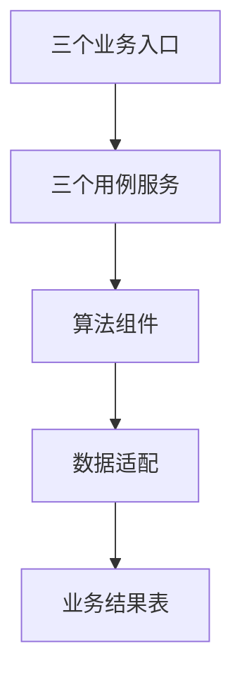
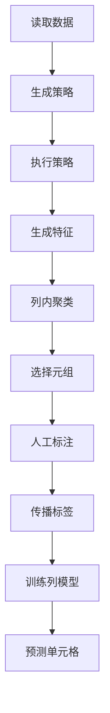
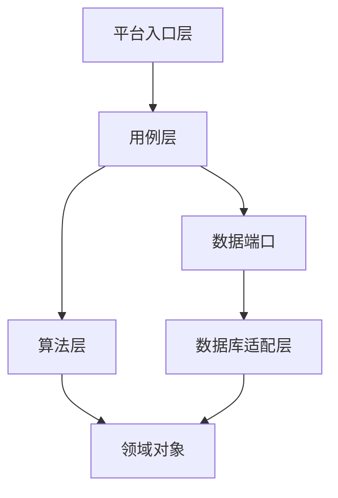
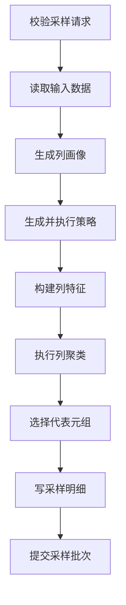
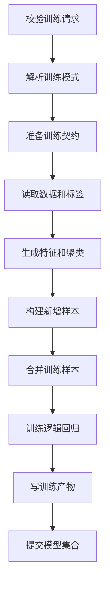
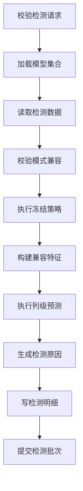
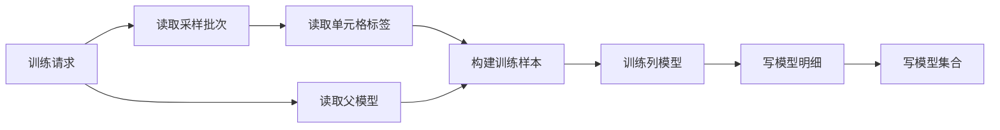

# Raha 轻量化新工程概要设计与数据库结构

## 1. 文档说明

### 1.1 文档目的

本文档用于指导在 `src/main/java/com/fiberhome/ml/raha` 下重新建设 Raha 数据错误检测工程。

当前旧工程先创建 Git 版本标签并完成基线记录，然后删除 `src/main/java/com/fiberhome/ml/raha` 下的旧实现。新工程继续使用相同包名和目录，但从空目录重新建立结构。旧版本标签只作为算法行为和测试基线，不作为新工程运行依赖。

本文重点明确：

- 新工程的范围、边界和核心取舍。
- 与 Raha 论文一致的检测算法主线。
- 无任务编排、无阶段状态、无主动重试、无检查点恢复的轻量架构。
- `com.fiberhome.ml.raha` 的推荐包结构、职责和依赖规则。
- 采样、训练、检测三个业务入口的完整处理流程。
- 跨调用必须持久化的数据库结构、逻辑主键和一致性规则。
- 全量训练和模型增量训练的输入、版本及数据合并规则。
- 旧工程版本归档、源码删除、原包重建和验收方法。

### 1.2 输入依据

| 资料 | 用途 |
| --- | --- |
| `design/raha_paper.pdf` | Raha 算法流程、策略特征、聚类采样、标签传播和列级分类依据 |
| `doc/20260714/Raha数据检测概要设计-202607141718.md` | 原始范围、算法模块和第 5.3 节包结构参考 |
| 旧工程版本标签 | 旧算法行为、测试样例和迁移来源参考 |
| `pom.xml` | 当前 Java、Spark、Scala 和构建基线 |

### 1.3 设计基线

| 项目 | 结论 |
| --- | --- |
| 代码根包 | `com.fiberhome.ml.raha` |
| 旧工程处理 | 创建版本标签后删除旧实现 |
| Java 版本 | Java 8 |
| 计算引擎 | Spark 3.3.1 |
| Scala 二进制版本 | 2.12 |
| 模型组件 | Spark MLlib 3.3.1，由运行平台提供 |
| 工程形式 | 在原 Maven 工程和原包路径中重新建设 |
| 核心能力 | 表级、单元格粒度的数据错误检测 |
| 明确不做 | 数据纠正、任务平台、流程编排、检查点恢复 |
| 首期分类器 | `LOGISTIC_REGRESSION` |

## 2. 最终设计结论

### 2.1 总体结论

新工程采用“薄入口、直接用例服务、独立算法组件、少量业务持久化”的结构。

采样、训练、检测分别由一个同步用例服务负责。每个服务在一次方法调用内按固定顺序调用数据加载、策略、特征、聚类、标签或模型组件。流程成功后返回业务摘要，流程失败时抛出明确异常，不创建任务状态，不转入异步队列，也不由工程自身重试或恢复。



### 2.2 必须保留的 Raha 语义

1. 自动生成数量受限的错误检测策略配置。
2. 每个策略命中只是一项特征，不直接等同于最终错误。
3. 每个单元格形成由策略信号组成的特征向量。
4. 特征、聚类、标签传播、模型训练和预测均以列为边界。
5. 采样单位是元组，人工对采样元组中的单元格标注正常或错误。
6. 标签只能在同列、同一聚类结果内传播，传播标签权重低于直接标签。
7. 每个可训练字段形成一个列级分类模型。
8. 检测必须复用训练时冻结的策略计划、值规范化规则和特征字典。
9. 输出是疑似错误单元格及其分数和原因，不包含修复值。
10. 增量训练必须产生新模型版本，不得原地修改已有模型。

### 2.3 明确删除的工程能力

新工程不设计以下能力和对应抽象：

- 通用任务对象和任务生命周期。
- 阶段定义、阶段处理器和阶段执行上下文。
- 当前阶段、阶段状态和阶段指标表。
- 检查点、断点续跑和失败恢复。
- 文件队列、数据库任务队列、租约和工作器。
- 工程主动重试、退避、失败比例容忍和自动降级编排。
- 通用仓储命名空间、仓储事务包装和内存仓储框架。
- 独立生产主程序和静态进程内跨调用状态。
- 为并发而建立的通用并行任务框架。

Spark 自身对计算任务的调度和容错属于计算平台能力，不在本工程重复实现。

### 2.4 必须保留的轻量可靠性措施

取消任务编排不等于取消数据一致性。新工程仍保留：

- 请求参数和模式兼容校验。
- 不可变的策略计划、特征字典和模型版本。
- 自动生成的请求指纹和确定性输出标识。
- 数据库写入的确定性业务键。
- 模型集合和批次头记录的最后提交规则。
- 外部读写日志、关键路径日志和异常堆栈。
- 输入数据缓存的显式释放。

这些措施只保证一次业务调用及其业务产物一致，不构成任务状态机、重试器或恢复器。

## 3. 范围与边界

### 3.1 范围内能力

| 能力 | 设计结论 |
| --- | --- |
| 数据读取 | 读取 FMDB 表或 SQL 查询 |
| 行标识 | 优先从元数据取得稳定唯一字段，无法取得时由调用方指定 |
| 列画像 | 调用内生成，供策略配置使用 |
| 策略族 | 首期支持 `OD`、`PVD`、`RVD` |
| 策略特征 | 将命中转换为列内稀疏特征 |
| 聚类采样 | 按列聚类，按元组覆盖度选择样本 |
| 人工标注 | 保存采样元组对应的直接单元格标签 |
| 标签传播 | 支持同质性传播，保留多数传播扩展点 |
| 模型训练 | 每个可训练字段一个逻辑回归模型 |
| 增量训练 | 合并父模型训练样本与新增标注样本后重新训练 |
| 模型检测 | 使用明确的模型集合版本批量预测 |
| 结果解释 | 保存策略标识、原因、分数和模型版本 |

### 3.2 范围外能力

- 生成正确值、候选修复值或清洗后表。
- 修改、覆盖或回写输入表。
- 依赖业务规则配置才能启动的检测方式。
- 在普通单元格标量函数中对每个单元格独立运行 Raha。
- 模型审批、灰度发布、流量切换和自动回滚平台。
- 流式在线更新和跨调用内存状态。
- 历史数据集相似度驱动的策略过滤。
- `KBVD` 外部知识库策略，待知识库版本和字段映射明确后再实现。
- 生产主链中的真值评测和阈值实验。

### 3.3 原包重建边界

旧工程和新工程使用相同包名，因此不允许在当前工作树中并存。重建必须满足：

1. 删除前为当前旧工程创建明确的 Git 版本标签。
2. 同时记录标签名、提交标识、构建结果、测试结果和固定算法输出。
3. 删除原包下的旧生产源码和对应旧测试，再创建新的空目录结构。
4. 不通过复制整个旧目录的方式开始新工程。
5. 算法按固定输入输出从版本标签迁移，迁移时删除任务、阶段和仓储耦合。
6. 新旧行为对比使用版本标签中的基线数据和结果，不在同一源码树编译两套同名类。

## 4. 理论流程与工程映射

### 4.1 论文主流程

Raha 论文给出的核心流程可归纳为九步：自动配置算法、执行策略、生成特征、列内聚类、选择元组、人工标注、传播标签、训练列模型、预测剩余单元格。



### 4.2 三个业务用例对论文流程的拆分

| 业务用例 | 包含的论文步骤 | 持久化输出 |
| --- | --- | --- |
| 采样 | 策略生成、策略执行、特征、聚类、元组选择 | 采样批次和采样元组 |
| 训练 | 策略生成、策略执行、特征、聚类、标签传播、列级训练 | 模型集合、策略计划、字典和列模型 |
| 检测 | 固定策略执行、兼容特征、列级预测 | 检测批次和检测明细 |

人工标注位于采样和训练之间，由数据质量人员或外部标注界面完成。

### 4.3 与论文交互采样的工程差异

论文可以在用户每次标注后继续调整聚类覆盖。首期工程将交互过程拆成独立调用：

1. 一次采样调用按预算生成一批代表性元组。
2. 用户完成该批次的单元格标注。
3. 一次训练调用读取直接标签，重新生成确定性的特征和聚类，再传播标签并训练。

该方式减少长时间交互会话和跨调用内存状态。若后续需要多轮主动采样，可以新增“以前一采样批次为输入的新采样调用”，仍不引入任务状态机。

### 4.4 策略族映射

| 策略族 | 论文用途 | 首期实现 |
| --- | --- | --- |
| `OD` | 值频率或数值分布离群 | 低频、数值距离、分位数距离 |
| `PVD` | 字符和格式模式违规 | 字符集合、长度、空占位、类型格式 |
| `RVD` | 列间规则或依赖违规 | 一对多冲突 |
| `KBVD` | 知识关系违规 | 仅保留接口，不启用 |

## 5. 总体架构

### 5.1 架构分层



| 层次 | 职责 | 禁止内容 |
| --- | --- | --- |
| 平台入口层 | 解析请求、调用一个用例、序列化摘要 | 算法、任务提交和状态管理 |
| 用例层 | 在一个同步调用内串联确定步骤 | 通用阶段框架和恢复逻辑 |
| 算法层 | 策略、特征、聚类、采样、传播、训练和预测 | FMDB 表名和入口协议 |
| 数据端口 | 定义加载和业务产物存取接口 | 通用仓储框架 |
| FMDB 适配层 | 使用 Spark 和 FMDB 完成外部读写 | 算法决策和流程分派 |
| 领域对象 | 表达数据集、单元格、标签、模型和结果 | 外部系统依赖 |

### 5.2 用例调用原则

每个入口只调用一个对应服务：

```text
F_DW_RAHASAMPLE -> RahaSampleService.sample
F_DW_RAHATRAIN  -> RahaTrainService.train
F_DW_RAHADETECT -> RahaDetectService.detect
```

不建立根据任务类型再次分派的统一执行器，也不建立通用阶段列表。三个服务共享的是算法组件和数据端口，不共享任务上下文。

### 5.3 运行前提

完整 Raha 算法必须在 Spark 驱动进程中每条命令只执行一次，并且能够取得当前 `SparkSession`。

因此平台入口必须满足：

- 单次调用语义明确。
- 运行位置是驱动进程。
- 可以执行整表 Spark 动作。
- 可以访问已注册的 FMDB 表。
- 查询取消能够传递给当前 Spark 作业。

若 FMDB 只能注册普通标量函数且不能保证这些条件，则不能在普通标量函数中运行本设计。平台应直接调用新工程 Java 接口或提供驱动过程。由于新工程明确不建设任务平台，不采用“普通函数写任务表再由内部工作器消费”的降级方案。

## 6. 推荐包结构

### 6.1 目录结构

```text
src/main/java/com/fiberhome/ml/raha/
  api/
    RahaFacade.java
    DefaultRahaFacade.java
    SampleRequest.java
    SampleResult.java
    TrainRequest.java
    TrainResult.java
    DetectRequest.java
    DetectResult.java
  config/
    RahaConfig.java
    StrategyConfig.java
    FeatureConfig.java
    ClusteringConfig.java
    SamplingConfig.java
    LabelConfig.java
    ModelConfig.java
  data/
    RahaDataset.java
    ColumnMetadata.java
    ColumnProfile.java
    CellCoordinate.java
    CellValue.java
    CellLabel.java
    DetectionResult.java
  profile/
    ColumnProfiler.java
    ColumnProfileService.java
  strategy/
    DetectionStrategy.java
    StrategyPlanner.java
    StrategyPlan.java
    StrategyDefinition.java
    StrategyHit.java
    StrategyRunner.java
    od/
    pvd/
    rvd/
    kbvd/
  feature/
    RahaFeaturePipeline.java
    FeatureAssembler.java
    FeatureDictionary.java
    FeatureDefinition.java
    SparseFeatureRow.java
    FeatureSpace.java
  cluster/
    ColumnClusterer.java
    ClusterAssignment.java
    ClusteringResult.java
    HierarchicalColumnClusterer.java
  sample/
    RahaSampleService.java
    TupleSampler.java
    SampleBatch.java
    SampleTuple.java
    SampleStore.java
  label/
    LabelStore.java
    LabelPropagator.java
    LabelPropagationResult.java
  model/
    ClassifierType.java
    RahaModelSet.java
    RahaColumnModel.java
    ColumnModelTrainer.java
    ColumnModelPredictor.java
    LogisticRegressionColumnModelTrainer.java
    LogisticRegressionColumnModelPredictor.java
    ModelStore.java
    ModelCompatibilityValidator.java
  train/
    RahaTrainService.java
    TrainingMode.java
    TrainingExample.java
    TrainingDatasetBuilder.java
    IncrementalTrainingDatasetBuilder.java
    TrainingExampleStore.java
  detect/
    RahaDetectService.java
    DetectionExplainer.java
    DetectionStore.java
  fmdb/
    FmdbDatasetLoader.java
    FmdbSchemaResolver.java
    FmdbSampleStore.java
    FmdbLabelStore.java
    FmdbModelStore.java
    FmdbTrainingExampleStore.java
    FmdbDetectionStore.java
    FmdbTableGateway.java
  udf/
    F_DW_RAHASAMPLE.java
    F_DW_RAHATRAIN.java
    F_DW_RAHADETECT.java
    RahaRequestParser.java
  support/
    ValueNormalizer.java
    HashUtils.java
    JsonUtils.java
    RahaException.java
    RahaErrorCode.java
```

### 6.2 包职责

| 包 | 职责 |
| --- | --- |
| `api` | 对外 Java 接口、请求和同步结果 |
| `config` | 不可变算法配置及其校验 |
| `data` | 不依赖基础设施的核心数据对象 |
| `profile` | 生成列画像，不持久化任务状态 |
| `strategy` | 生成并执行检测策略 |
| `feature` | 构建训练或检测特征空间 |
| `cluster` | 对单列特征进行聚类 |
| `sample` | 对聚类覆盖进行评分并选择元组 |
| `label` | 读取直接标签并在列内传播 |
| `model` | 逻辑回归模型训练、预测、兼容校验及分类器扩展接口 |
| `train` | 全量训练、增量训练和训练样本构建 |
| `detect` | 同步检测用例 |
| `fmdb` | FMDB 和 Spark 数据适配 |
| `udf` | 平台薄入口，是否使用由平台执行语义决定 |
| `support` | 无业务状态的通用小工具和异常定义 |

### 6.3 明确不创建的包

```text
job/
stage/
checkpoint/
repository/
parallel/
app/
worker/
queue/
recovery/
retry/
correction/
repair/
```

模型、标签、采样和检测各自定义最小存取端口，避免建立能保存任意对象的通用 `repository` 包。

### 6.4 包依赖规则

1. `data`、`config` 和算法包不得依赖 `fmdb` 或 `udf`。
2. `sample`、`train` 和 `detect` 可以依赖算法包及对应存取端口。
3. `fmdb` 实现算法层声明的数据端口，可以依赖 Spark 和 FMDB。
4. `udf` 只依赖 `api` 和请求解析器，不直接依赖算法实现。
5. `api` 不暴露 Spark 的 `Dataset<Row>`，避免平台协议与计算对象耦合。
6. `RahaFacade` 只聚合三个类型明确的方法，不接受任务类型枚举进行通用分派。
7. `ColumnModelTrainer` 和 `ColumnModelPredictor` 是分类器扩展接口，首期只有逻辑回归实现。

## 7. 核心对象设计

### 7.1 数据集对象

`RahaDataset` 是算法层的只读数据输入，包含：

| 属性 | 说明 |
| --- | --- |
| `datasetId` | 稳定逻辑数据集标识 |
| `snapshotId` | 本次输入快照或内容指纹 |
| `inputReference` | 来源表或 SQL 查询标识 |
| `rowIdentityMode` | 业务键或内容分组 |
| `rowKeyColumns` | 可选的一个或多个稳定业务键字段 |
| `schemaHash` | 字段名、顺序和类型的哈希 |
| `columns` | 可检测字段元数据 |
| `targetColumns` | 本次调用解析后的目标字段列表 |
| `dataFrame` | 只读 Spark 数据集 |

`rowKeyColumns` 不是“需要处理的字段”，只用于精确定位具体数据行。采样、训练和检测通过可选的 `targetColumns` 限定目标字段；不传时默认解析为当前阶段的全部可处理字段。采样单位仍是一整行，业务键和关系策略依赖字段即使不属于目标字段，也可以作为只读上下文参与行定位和关系特征计算，但不生成标签任务、列模型或检测结果。

行标识解析顺序如下：

1. 元数据存在单列或复合主键时，使用 `KEY` 模式并自动取得业务键字段。
2. 元数据没有主键但请求提供 `rowKeyColumns` 时，使用 `KEY` 模式并校验组合值非空且唯一。
3. 两者都不存在时，默认使用 `CONTENT_GROUP` 模式，以全部输入列的规范化内容哈希作为 `rowId`。
4. `CONTENT_GROUP` 模式将完全相同的行合并成一个内容组并记录 `duplicateCount`，策略、特征和采样只计算一次。
5. 内容组的人工标签作用于组内全部相同行，检测结果也表示该内容组及其重复数量。
6. 调用方需要定位到每一条物理记录时必须提供稳定业务键；没有业务键时系统无法区分完全相同的多条记录。

内容分组按字段顺序、字段类型、空值标记和规范化值比较全部列，内容哈希只作为组标识。发现哈希相同但规范化内容不同时必须分成不同组，不能只依赖哈希判断相同。

内容分组只减少重复计算，不改变原始数据分布。列画像、值频率、关系计数、策略统计和模型样本权重都必须使用 `duplicateCount` 还原原始行数；主动采样仍只选择一个内容组代表，避免把有限预算浪费在完全相同的行上。

采样元组除行标识和重复数量外，还保存采样时的完整行内容 `rowDataJson`。该字段只覆盖有限的已选元组，用于外部标注界面稳定展示采样快照，不要求重新读取原始输入。

增量训练在 `KEY` 模式下按业务键用新样本覆盖父样本；在 `CONTENT_GROUP` 模式下只按内容哈希去重，内容发生变化时视为新训练样本，不推断它与旧内容属于同一业务行。

不得使用 Spark 分区号、分区内行号或不稳定排序序号作为业务行标识。

### 7.2 单元格坐标

`CellCoordinate` 由以下字段确定：

```text
datasetId + snapshotId + rowId + columnName
```

`cellId` 是上述字段规范化后计算的稳定哈希。原始值不参与坐标计算，值变化通过 `valueHash` 单独识别。

### 7.3 策略定义和命中

`StrategyDefinition` 表示一个可重复执行的策略配置，至少包含：

- 策略标识。
- 策略族和实现名称。
- 目标字段及关联字段。
- 完整参数和参数哈希。
- 实现版本。
- 确定性执行顺序。

`StrategyHit` 只表示某个策略命中了某个单元格，包含坐标、策略标识、策略分数和结构化原因。它不包含最终错误标签。

### 7.4 特征空间

每个字段有独立的 `FeatureDictionary`。字典将稳定特征名称映射为整数编号，并记录类型、来源、默认值和值规范化版本。

`FeatureSpace` 包含：

- 按字段组织的特征字典。
- 按单元格组织的稀疏特征。
- 当前策略计划版本。
- 值规范化版本。
- 构建统计摘要。

训练可以创建新字典；检测只能使用模型集合中冻结的字典，不得重新编号。

### 7.5 直接标签和传播标签

持久化的 `CellLabel` 只保存外部标注系统提交的直接标签。传播标签只存在于单次训练内存或临时数据集中，不写入长期业务表。

| 字段 | 说明 |
| --- | --- |
| `sampleBatchId` | 标签来源采样批次 |
| `datasetId` | 标签所属逻辑数据集 |
| `snapshotId` | 标签对应的采样快照 |
| `rowId` | 采样行或内容组标识 |
| `columnName` | 被标注字段 |
| `valueHash` | 标注时原值摘要，用于发现值漂移 |
| `label` | `0` 表示正常，`1` 表示错误 |
| `labeledAt` | 标注时间 |

`cellId` 由数据集、快照、行和字段确定性计算，不重复持久化。Raha 不保存标签来源类型、置信度和标注人字段；外部标注系统如有这些信息，应在自身业务表中维护。

### 7.6 模型集合

一次训练可能产生多个列模型，因此检测入口只接受 `modelSetVersion`，不接受任意单个列模型版本。

`RahaModelSet` 是不可变训练契约，包含：

- 数据集、训练快照和模式哈希。
- 一个或多个标注采样批次。
- 模型集合覆盖的全部字段以及本次实际训练字段。
- 训练模式以及可选的父模型集合版本。
- 完整算法配置版本。
- 策略计划版本及全部策略定义。
- 值规范化版本。
- 每列特征字典版本。
- 每列模型版本、固定分类器类型和阈值。
- 参与训练的历史样本数和新增样本数。
- 直接标签和传播标签统计。
- 模型集合创建时间。

模型集合头记录一旦存在即表示全部必需产物已写入并可用于检测，不再维护候选、发布、停用等状态。

### 7.7 同步结果对象

三个用例分别返回类型明确的结果，不返回通用状态字段：

| 对象 | 主要字段 |
| --- | --- |
| `SampleResult` | 采样批次、目标字段、请求预算、实际元组数、结果位置、耗时 |
| `TrainResult` | 训练模式、目标字段、父模型集合、新模型集合、样本数、成功列、跳过列和耗时 |
| `DetectResult` | 检测批次、目标字段、检查单元格数、疑似错误数、结果位置、耗时 |

方法正常返回即表示当前调用成功。参数、数据、算法或外部存储失败均抛出 `RahaException`，不返回 `FAILED` 状态对象。

## 8. 对外接口设计

### 8.1 Java 门面

```java
public interface RahaFacade {

    SampleResult sample(SampleRequest request);

    TrainResult train(TrainRequest request);

    DetectResult detect(DetectRequest request);
}
```

`DefaultRahaFacade` 只持有三个用例服务并直接调用，不实现任务类型分派、状态管理和异常恢复。

### 8.2 采样请求

| 字段 | 必填 | 生成规则 |
| --- | --- | --- |
| `inputReference` | 是 | 调用方必须指定 FMDB 表或 SQL 查询 |
| `datasetId` | 条件必填 | 表来源默认使用规范化表名生成；SQL 来源必须指定稳定逻辑标识 |
| `sourceType` | 否 | 根据 `inputReference` 解析为表或 SQL |
| `rowKeyColumns` | 否 | 用于精确定位数据行；不传时默认按全部列内容分组并合并相同行 |
| `snapshotId` | 否 | 优先使用平台数据版本，否则计算输入内容指纹 |
| `targetColumns` | 否 | 指定需要采样和标注的字段；不传时使用全部可检测字段 |
| `labelingBudget` | 否 | 默认读取 `raha.sampling.labeling-budget`，建议值为 `20` |

`targetColumns` 只限定生成画像、策略、特征、聚类和标签任务的目标字段。采样仍返回完整行内容，行标识字段和关系策略依赖字段仍可作为上下文读取。字段列表必须去重、保持输入模式顺序，并在请求指纹中使用解析后的完整列表。

### 8.3 训练请求

| 字段 | 必填 | 生成规则 |
| --- | --- | --- |
| `sampleBatchIds` | 是 | 一个或多个已完成标注的采样批次 |
| `targetColumns` | 否 | 指定需要训练的字段；不传时使用采样批次目标字段中具备有效标签的全部可训练字段 |
| `baseModelSetVersion` | 否 | 为空时执行全量训练；非空时执行指定父模型的增量训练 |

首期训练固定从 `dw.raha_cell_label` 读取所选采样批次的直接标签，不允许请求任意结构的标注表。外部标注系统应通过适配器写入标准标签表。

`datasetId`、`inputReference`、`sourceType`、行身份规则和 `snapshotId` 全部从 `dw.raha_sample_batch` 读取，不再由训练请求重复传入。`trainingMode` 不作为请求字段：`baseModelSetVersion` 为空时自动生成 `FULL`，非空时自动生成 `INCREMENTAL`。

一次训练支持多个采样批次，但这些批次必须属于同一数据集、同一快照、同一输入来源、相同模式和相同行标识规则，允许各批次采样不同的目标字段。未指定 `targetColumns` 时取各采样批次已解析目标字段的并集，再过滤没有有效直接标签或算法不支持的字段；显式指定的字段必须属于该并集并具有有效直接标签。标签按单元格合并；重复且一致的标签去重，冲突标签使训练失败。

增量训练指定的父模型必须存在，并且其数据集、模式、策略计划、特征字典和值规范化版本必须与采样批次兼容。

### 8.4 检测请求

| 字段 | 必填 | 生成规则 |
| --- | --- | --- |
| `inputReference` | 是 | 调用方必须指定待检测 FMDB 表或 SQL 查询 |
| `modelSetVersion` | 是 | 调用方必须明确选择不可变模型集合版本 |
| `sourceType` | 否 | 根据 `inputReference` 解析为表或 SQL |
| `rowKeyColumns` | 否 | 默认使用模型集合记录的行身份规则；可提供业务键字段覆盖 |
| `snapshotId` | 否 | 优先使用平台数据版本，否则计算输入内容指纹 |
| `targetColumns` | 否 | 指定需要检测的字段；不传时检测模型集合覆盖的全部字段 |
| `errorsOnly` | 否 | 默认值为 `true` |

检测请求不再传入 `datasetId`，该值从 `modelSetVersion` 对应的模型集合继承。检测数据必须通过后续模式兼容校验。

显式指定的 `targetColumns` 必须是模型集合已有列模型的子集。检测仍可读取冻结策略所需的关联字段，但只为目标字段生成预测和结果记录。

检测结果表使用系统配置的标准表，不允许请求传入任意表名。需要写入业务专用表时，由外部平台从标准结果表读取并转换。

### 8.5 自动生成参数规则

| 参数 | 生成规则 | 不能自动生成的情况 |
| --- | --- | --- |
| `datasetId` | 表来源使用规范化表名 | SQL 来源无法判断稳定业务数据集 |
| `sourceType` | 解析输入引用结构 | 输入引用无法解析时请求失败 |
| `rowKeyColumns` | 读取单列或复合主键；无主键时可以显式提供 | 未提供时自动切换到内容分组模式 |
| `snapshotId` | 平台数据版本或分布式内容指纹 | 输入读取失败 |
| `targetColumns` | 采样取全部可检测字段；训练取有有效标签的采样目标字段；检测取模型集合全部字段 | 显式字段不存在、不受支持或不满足当前阶段契约时请求失败 |
| `trainingMode` | 是否存在父模型集合 | 无需调用方生成 |
| `labelingBudget` | 读取采样默认配置 | 调用方需要覆盖默认预算时显式传入 |

请求指纹、采样批次标识、模型集合版本、列模型版本、检测批次标识、记录创建时间和 ORC 分区日期都由服务内部生成，不属于请求参数。`targetColumns` 即使由默认规则产生，也必须先展开为按输入模式排序的明确列表再参与请求指纹计算。相同的已解析请求和输入内容生成相同指纹及输出标识。

参数解析顺序固定如下：

1. 采样先解析来源类型和数据集标识，再确定业务键或内容分组模式，加载数据后生成快照和请求指纹。
2. 训练先加载全部采样批次并校验一致性，再加载可选父模型和标签，最后生成训练模式和请求指纹。
3. 检测先加载模型集合，再解析输入来源和行标识，加载数据后生成快照和请求指纹。

请求字段可选只表示调用方可以不传。进入策略、特征、训练和检测组件前，所有自动参数必须已经解析为确定值；无法可靠生成时立即返回参数错误，不使用随机值替代。

### 8.6 平台薄入口

三个入口类分别固定调用一个门面方法：

```text
F_DW_RAHASAMPLE -> parser.parseSample -> facade.sample
F_DW_RAHATRAIN  -> parser.parseTrain  -> facade.train
F_DW_RAHADETECT -> parser.parseDetect -> facade.detect
```

入口只负责：

- 限制请求长度并解析固定字段。
- 解析并校验类型化请求。
- 记录调用开始和结束日志。
- 调用对应同步方法。
- 将类型化结果序列化为摘要。
- 将异常转换为平台可识别的错误。

入口不得创建队列文件、任务表记录、后台线程、静态 Spark 会话或跨调用缓存。

## 9. 采样用例设计

### 9.1 处理流程



### 9.2 关键规则

1. 输入表为空、行标识为空或重复时立即失败。
2. `targetColumns` 必须存在、去重且属于算法支持的字段类型；未指定时按输入模式顺序选择全部可检测字段。
3. 只为目标字段生成画像、策略、特征和聚类；关系策略依赖字段允许作为只读上下文加载。
4. 策略计划由目标字段、输入画像、算法配置和实现版本确定。
5. 同一请求、同一快照、同一随机种子必须生成相同采样顺序。
6. 聚类在每个目标字段内独立执行，不跨列比较单元格。
7. 元组得分由其覆盖的目标字段低覆盖聚类数量、列权重和随机稳定打散值组成。
8. 同一个行标识在一个采样批次中最多出现一次。
9. 采样批次只负责选择元组，不预填人工标签，也不要求修复值。
10. 采样明细写完后再写采样批次头记录。

### 9.3 调用内临时数据

以下数据不进入长期表：

- 完整列画像。
- 采样期策略命中。
- 单元格稀疏特征。
- 聚类成员映射。
- 元组评分中间项。

服务结束时释放缓存。需要问题定位时使用受控调试开关写临时路径，临时产物不进入生产数据库模型。

## 10. 训练用例设计

### 10.1 处理流程



### 10.2 直接标签校验

训练前必须校验：

- 所有标签的数据集、快照和采样批次与训练请求一致。
- 标签字段属于解析后的训练目标字段；非目标字段标签保留但不参与本次训练。
- 行标识和字段在当前训练输入中存在。
- `valueHash` 与当前单元格值一致，防止使用过期标签。
- 标签只能为 `0` 或 `1`。
- 多个采样批次中的同一单元格标签必须一致。
- 至少存在一个直接错误标签和一个直接正常标签，或者明确跳过无法训练的字段。

### 10.3 标签传播

首期默认使用同质性传播：

- 同列同簇中直接标签全部为正常时，可向未标注单元格传播正常标签。
- 同列同簇中直接标签全部为错误时，可向未标注单元格传播错误标签。
- 同簇出现冲突标签时不传播。
- 无直接标签的簇不传播。
- 传播标签不得覆盖直接标签。
- 传播标签使用低于直接标签的训练权重。

多数传播保留为配置扩展，启用时必须设置最小多数比例并记录冲突统计。

### 10.4 全量训练

`trainingMode=FULL` 时：

1. 根据当前训练快照和解析后的目标字段生成新策略计划。
2. 执行策略并生成新的列级特征字典。
3. 对当前直接标签执行列内传播。
4. 使用当前直接标签和传播标签构建训练样本。
5. 分别训练各目标字段的逻辑回归模型。
6. 保存本次模型实际使用的完整训练样本。
7. 创建不包含父版本的新模型集合。

### 10.5 增量训练

`trainingMode=INCREMENTAL` 时必须提供 `baseModelSetVersion`。首期增量训练定义为“父模型训练样本与新增样本合并后的离线重新训练”，不是流式参数更新，也不原地修改父模型。

增量流程如下：

1. 加载父模型集合、策略计划、特征字典、列模型和训练样本。
2. 校验父模型分类器类型为 `LOGISTIC_REGRESSION`。
3. 校验数据集、字段模式和值规范化版本兼容，并要求目标字段属于父模型集合覆盖字段。
4. 对本次训练快照执行父模型冻结的策略计划。
5. 严格使用父模型特征字典生成本次新增样本特征。
6. 对本次直接标签执行列内传播并生成新增训练样本。
7. 按数据集、行标识和字段合并父样本与新增样本，同一业务单元格以新样本为准。
8. 只对目标字段的完整合并样本集重新训练逻辑回归。
9. 保存目标字段合并后的训练样本快照和新列模型，未选中的父列模型及其训练样本复制到新模型集合。
10. 创建引用父模型集合的新模型集合版本，完整保留父模型覆盖字段。

增量训练保持父模型的策略计划、特征字典和值规范化版本不变。显式 `targetColumns` 只控制本次重新训练字段，未选中的父字段模型保持不变并进入新模型集合。新数据中出现但父字典不存在的特征不会进入模型；需要新增目标字段、策略或扩展特征空间时必须执行全量训练。

父模型训练样本不得只保存统计数量。新工程必须持久化实际参与训练的稀疏特征、标签和样本权重，否则无法稳定合并历史样本并控制模型遗忘。

### 10.6 训练样本合并规则

- 训练样本业务键为 `datasetId + rowId + columnName`，快照较新的新增样本覆盖父样本。
- 直接标签优先于传播标签。
- 同一快照和同一业务键出现冲突直接标签时训练失败。
- 父模型覆盖但新快照不存在的历史样本继续保留。
- 新增样本合并后必须重新计算正负样本权重。
- 合并结果必须同时含正常和错误类别。
- 每个新模型集合物化一份完整训练样本快照，不在预测时递归读取祖先版本。

### 10.7 列模型训练

首期分类器类型固定为 `LOGISTIC_REGRESSION`。`ModelConfig` 只配置逻辑回归的迭代次数、正则化、类别平衡和判断阈值，不提供分类器类型选择项。

每列训练前检查：

- 字典非空且至少有一个有区分度特征。
- 训练样本同时包含正常和错误类别。
- 正负样本数量满足最小值。
- 传播标签比例未超过配置上限。
- 模型分数存在有效变化。

不满足条件属于可预期的“跳过字段”，记录在 `TrainResult` 和模型集合摘要中，不创建伪模型。意外计算错误、存储错误或契约不一致将使整个训练调用失败。

分类器扩展通过 `ColumnModelTrainer`、`ColumnModelPredictor` 和 `ClassifierType` 完成。首期 `ClassifierType` 只定义 `LOGISTIC_REGRESSION`，仅实现 `LogisticRegressionColumnModelTrainer` 和 `LogisticRegressionColumnModelPredictor`。后续增加其他分类器时新增实现，不修改采样、特征、标签和用例接口。

### 10.8 模型提交规则

训练成功写入顺序：

1. 写本次模型使用的完整训练样本。
2. 写列模型、列特征字典和模型载荷。
3. 校验训练样本、列模型、训练模式和父版本一致。
4. 最后写 `dw.raha_model_set`，同时保存采样批次列表、完整模型字段、本次训练字段和冻结策略计划。

检测只加载存在模型集合头记录的版本。写入中途失败时不会出现可被检测加载的半成品模型集合，本工程不自动恢复该次写入。

## 11. 检测用例设计

### 11.1 处理流程



### 11.2 模式兼容规则

1. 请求解析后的目标字段必须存在、类型兼容且已被模型集合覆盖。
2. `RVD` 策略依赖的关联字段必须存在且类型兼容。
3. 未指定 `targetColumns` 时检测模型集合覆盖的全部字段；输入中额外字段默认不检测。
4. 行标识字段可以与训练表名称不同，但必须满足稳定唯一约束。
5. 值规范化版本、策略实现版本和特征字典版本必须可用。
6. 缺失必需字段或版本不匹配时拒绝整个检测调用。

### 11.3 固定训练契约

检测不得根据新数据重新生成策略计划。训练时由数据计算出的均值、方差、频率阈值、字符集合、模式和依赖参数必须作为策略配置的一部分冻结并持久化。

检测构建特征时：

- 只执行目标字段关联的冻结策略及其必要依赖。
- 只产生字典中存在的特征编号。
- 字典中存在但本次未命中的特征使用默认值。
- 新出现但字典中不存在的特征直接忽略并记录调试计数。

### 11.4 检测输出

默认只为目标字段写入 `score >= threshold` 的疑似错误单元格。评测场景可通过配置写目标字段的全部预测结果。

每条结果至少包含：

- 数据集、快照、行、列和单元格标识。
- 原始值哈希。
- 错误分数、判断阈值和判断结果。
- 命中策略标识和结构化原因。
- 模型集合、列模型和特征字典版本。
- 检测时间。

## 12. 算法组件设计

### 12.1 列画像

列画像只计算策略生成所需摘要：空值比例、不同值数量、频率摘要、数值统计、长度分布、字符集合和类型解析比例。

高基数字段不得把完整值频率收集到驱动进程。画像组件应使用 Spark 聚合、数量上限和近似统计。

### 12.2 策略计划

`StrategyPlanner` 根据画像和配置生成确定性计划：

- 策略按稳定规则排序。
- 策略标识由族、实现、目标字段、关联字段、参数和实现版本计算。
- `RVD` 只按算法适用类型生成列对，并受最大列对数量限制。
- 超过策略数量上限时按确定性优先级截断并记录告警。
- 策略配置只包含算法参数、实现版本和数量上限，不包含字段选择配置。

### 12.3 特征构建

首期特征包括：

| 类型 | 示例 |
| --- | --- |
| 策略二值特征 | 某策略是否命中 |
| 策略族汇总 | 各策略族命中数量 |
| 值上下文 | 长度、空值、字符类型、解析结果 |
| 列内上下文 | 频率桶、长度距离、数值距离 |
| 邻近上下文 | 列间冲突数量 |

训练时删除所有样本取值相同的无区分度特征。特征名称、编号和默认值一旦写入模型集合便不可修改。

### 12.4 聚类

论文采用列内层次聚类并逐步增加簇数。首期保留 `ColumnClusterer` 接口：

- 小数据和论文对齐测试使用层次聚类。
- 大数据实现必须保持列内聚类和确定性，但可以采用可扩展近似算法。
- 聚类数量受采样预算、有效特征模式数量和样本数量共同限制。
- 空特征列或单一特征模式列返回可解释的单簇结果，不进入异常恢复流程。

### 12.5 分类器

首期固定使用 `LOGISTIC_REGRESSION`，原因是模型简单、概率输出明确且便于保存系数。配置中不允许切换到其他分类器。

`ColumnModelTrainer` 和 `ColumnModelPredictor` 作为扩展接口保留。后续增加新分类器时，必须新增对应实现和模型序列化逻辑，不得在逻辑回归训练失败时自动切换分类器。

## 13. 数据库总体设计

### 13.1 设计原则

数据库只保存跨调用必须存在的业务事实，不保存算法调用过程状态。

长期保存：

- 采样批次和采样元组。
- 人工直接标签。
- 完整模型集合契约。
- 每个模型集合实际使用的训练样本快照。
- 检测批次和检测明细。

不长期保存：

- 通用任务、阶段和检查点。
- 运行中、失败、重试次数和当前阶段。
- 采样或训练期全量画像。
- 非训练样本的策略命中、单元格特征和聚类分配。
- 传播标签和阶段指标。

### 13.2 表清单

| 表名 | 用途 | 逻辑主键 |
| --- | --- | --- |
| `dw.raha_sample_batch` | 已提交采样批次头 | `sample_batch_id` |
| `dw.raha_sample_tuple` | 采样批次选择的元组 | `sample_batch_id, row_id` |
| `dw.raha_cell_label` | 人工直接单元格标签 | `sample_batch_id, row_id, column_name` |
| `dw.raha_model_set` | 已完整提交的模型集合头 | `model_set_version` |
| `dw.raha_column_model` | 模型集合内列模型 | `model_set_version, column_name` |
| `dw.raha_training_example` | 模型实际使用的训练样本 | `model_set_version, column_name, snapshot_id, row_id` |
| `dw.raha_detection_batch` | 已提交检测批次头 | `detection_batch_id` |
| `dw.raha_detection_result` | 单元格检测结果 | `detection_batch_id, row_id, column_name` |

### 13.3 表关系

#### 13.3.1 采样和标注关系


调用和表关系如下：

1. 采样服务读取输入并在调用内完成策略、特征、聚类和元组选择。
2. 没有业务键时先按全部列内容分组，相同行只生成一条带重复数量的采样元组。
3. 先写 `dw.raha_sample_tuple`，再写 `dw.raha_sample_batch` 头记录。
4. 一个采样批次对应多条采样元组，关系为一对多。
5. 标注程序按 `sample_batch_id, row_id` 读取采样元组及其 `row_data_json`，无需重新读取可能已经变化的原始输入，并写入多个字段标签。
6. 一个采样元组可以对应多条 `dw.raha_cell_label`，内容组标签作用于全部相同行。

#### 13.3.2 训练关系



调用和表关系如下：

1. 训练请求携带一个或多个 `sampleBatchIds`。
2. 训练服务读取全部 `dw.raha_sample_batch` 并校验数据集、快照、模式和行标识规则一致。
3. 通过 `sample_batch_id` 读取并合并 `dw.raha_cell_label`。
4. 增量训练额外读取父 `dw.raha_model_set`、`dw.raha_column_model` 和 `dw.raha_training_example`。
5. 训练完成后写入新模型集合对应的训练样本和列模型；训练样本保留可确定的来源采样批次，列模型记录同时包含该列特征字典。
6. 最后写 `dw.raha_model_set`，其中包含全部采样批次标识和冻结策略计划，使新模型集合可被检测读取。

#### 13.3.3 检测关系


调用和表关系如下：

1. 检测请求通过 `modelSetVersion` 读取一个 `dw.raha_model_set`。
2. 从模型集合读取冻结策略计划，再按模型集合读取多条列模型及其特征字典。
3. 检测服务读取输入数据，执行冻结策略、兼容特征和列模型预测。
4. 先写 `dw.raha_detection_result`，再写 `dw.raha_detection_batch` 头记录。
5. 一个检测批次对应多条检测结果，关系为一对多。

#### 13.3.4 逻辑关联键

| 主表 | 从表 | 关联字段 | 关系 |
| --- | --- | --- | --- |
| `dw.raha_sample_batch` | `dw.raha_sample_tuple` | `sample_batch_id` | 一对多 |
| `dw.raha_sample_batch` | `dw.raha_cell_label` | `sample_batch_id` | 一对多 |
| `dw.raha_sample_batch` | `dw.raha_model_set` | `sample_batch_ids_json` | 多对多引用 |
| `dw.raha_model_set` | `dw.raha_column_model` | `model_set_version` | 一对多 |
| `dw.raha_model_set` | `dw.raha_training_example` | `model_set_version` | 一对多 |
| `dw.raha_model_set` | `dw.raha_model_set` | `parent_model_set_version` | 父子版本 |
| `dw.raha_model_set` | `dw.raha_detection_batch` | `model_set_version` | 一对多 |
| `dw.raha_detection_batch` | `dw.raha_detection_result` | `detection_batch_id` | 一对多 |

FMDB 或 Spark 表未必强制主键和外键，以上约束由写入适配器通过确定性键、反连接检查和提交前校验保证。

## 14. 数据表详细设计

本节八张业务表统一创建在 `dw` 数据库，完整表名固定为 `dw.raha_*`，不允许由请求指定其他数据库或表名。

本节在最小可运行结构上增加少量关键冗余字段。逻辑主键、表关联键、跨调用重新加载所需契约、模型预测参数和必要结果摘要必须单独落列；能够显著减少头表关联、支持 ORC 分区裁剪或保证离线追溯的 `dataset_id`、`snapshot_id`、模型集合版本和创建时间允许在明细表冗余。大段配置、策略计划、特征字典和模型载荷不得复制到明细表。

请求字段可以由系统自动生成，但生成后的行身份模式和快照写入数据库时仍然必填。`CONTENT_GROUP` 模式不需要业务键字段列表。

`partition_date` 是 ORC 物理分区字段，统一使用 `yyyy-MM-dd` 格式，由对应批次头或模型集合头的 `created_at` 按 `Asia/Shanghai` 时区自动生成，不由调用方传入。同一业务批次的头表和明细表必须使用相同日期口径。

以下样例统一使用订单数据集：采样输入为 `ods.orders_dirty`，没有业务主键，采用内容分组模式；两个采样批次共同训练 `modelset_orders_20260717_001`；随后使用该模型检测 `ods.orders_dirty_next`。样例值只用于说明字段格式和表间关联，不是固定默认值。

### 14.1 `dw.raha_sample_batch`

只在采样明细完整写入后创建，存在即表示该采样批次可供标注。

| 字段 | 类型 | 必填 | 说明 | 样例 |
| --- | --- | --- | --- | --- |
| `sample_batch_id` | `STRING` | 是 | 采样批次标识 | `sample_orders_20260717_001` |
| `request_fingerprint` | `STRING` | 是 | 已解析请求和输入内容摘要 | `sha256:5ad4c8f1...` |
| `dataset_id` | `STRING` | 是 | 逻辑数据集 | `orders` |
| `snapshot_id` | `STRING` | 是 | 输入快照或指纹 | `snap_orders_20260717_001` |
| `input_reference` | `STRING` | 是 | 输入来源 | `ods.orders_dirty` |
| `source_type` | `STRING` | 是 | 表或查询 | `TABLE` |
| `row_identity_mode` | `STRING` | 是 | `KEY` 或 `CONTENT_GROUP` | `CONTENT_GROUP` |
| `row_key_columns_json` | `STRING` | 否 | `KEY` 模式使用的业务键字段列表 | `null` |
| `target_columns_json` | `STRING` | 是 | 解析并按输入模式排序的采样目标字段 | `["customer_phone","amount"]` |
| `schema_hash` | `STRING` | 是 | 输入模式哈希 | `sha256:9c26be71...` |
| `algorithm_version` | `STRING` | 是 | 新工程算法版本 | `raha-1.0.0` |
| `config_json` | `STRING` | 是 | 完整算法配置 | `{"strategyFamilies":["OD","PVD","RVD"],"labelingBudget":20}` |
| `labeling_budget` | `INT` | 是 | 请求预算 | `20` |
| `selected_tuple_count` | `BIGINT` | 是 | 实际采样元组数 | `20` |
| `created_at` | `BIGINT` | 是 | 批次提交时间 | `1784253600000` |

`target_columns_json` 始终保存展开后的明确列表，调用方未传 `targetColumns` 时也不保存为空。`sample_batch_id` 由包含该列表的 `request_fingerprint` 确定性生成。相同请求和相同输入内容返回同一批次。

### 14.2 `dw.raha_sample_tuple`

| 字段 | 类型 | 必填 | 说明 | 样例 |
| --- | --- | --- | --- | --- |
| `sample_batch_id` | `STRING` | 是 | 采样批次 | `sample_orders_20260717_001` |
| `dataset_id` | `STRING` | 是 | 冗余的逻辑数据集，用于直接查询和追溯 | `orders` |
| `snapshot_id` | `STRING` | 是 | 冗余的输入快照 | `snap_orders_20260717_001` |
| `row_id` | `STRING` | 是 | 采样行标识 | `rowhash:8f3a12d9...` |
| `duplicate_count` | `BIGINT` | 是 | 内容组包含的原始行数，业务键模式固定为一 | `3` |
| `row_data_json` | `STRING` | 是 | 标注所需的采样行完整字段和值 | `{"order_no":"A20260717001","customer_phone":"1380013800X","amount":"128.50"}` |
| `selection_order` | `INT` | 是 | 确定性采样顺序 | `1` |
| `selection_score` | `DOUBLE` | 是 | 元组覆盖得分 | `8.75` |
| `reason_json` | `STRING` | 是 | 结构化选择原因 | `{"coveredColumns":["customer_phone"],"coveredClusters":["phone_c03"]}` |
| `created_at` | `BIGINT` | 是 | 写入时间 | `1784253600000` |
| `partition_date` | `STRING` | 是 | ORC 分区日期，取采样批次创建日期 | `2026-07-17` |

`dataset_id` 和 `snapshot_id` 虽可通过批次头取得，但为直接查询、分区过滤和离线追溯而保留。输入来源仍通过 `sample_batch_id` 从批次头取得。`row_data_json` 保存采样时的行内容，是标注输入契约；覆盖字段和聚类摘要统一放入 `reason_json`，不再拆成重复字段。

### 14.3 `dw.raha_cell_label`

| 字段 | 类型 | 必填 | 说明 | 样例 |
| --- | --- | --- | --- | --- |
| `sample_batch_id` | `STRING` | 是 | 来源采样批次 | `sample_orders_20260717_001` |
| `dataset_id` | `STRING` | 是 | 冗余的逻辑数据集 | `orders` |
| `snapshot_id` | `STRING` | 是 | 冗余的标注来源快照 | `snap_orders_20260717_001` |
| `row_id` | `STRING` | 是 | 行标识 | `rowhash:8f3a12d9...` |
| `column_name` | `STRING` | 是 | 字段名 | `customer_phone` |
| `value_hash` | `STRING` | 是 | 标注时原值哈希 | `sha256:7bd91e20...` |
| `label` | `INT` | 是 | `0` 正常，`1` 错误 | `1` |
| `labeled_at` | `BIGINT` | 是 | 标注时间 | `1784257200000` |
| `partition_date` | `STRING` | 是 | ORC 分区日期，取采样批次创建日期 | `2026-07-17` |

该表只保存人工直接标签，因此删除固定含义的 `label_source` 和 `confidence`。`dataset_id` 和 `snapshot_id` 为查询与追溯冗余，`cell_id` 仍通过批次头及行列坐标计算。`partition_date` 使用采样批次创建日期而不是标注日期，保证同一采样批次的标签进入同一分区。未标注单元格不写记录，传播标签也不写入此表。

### 14.4 `dw.raha_model_set`

该表是模型可用性的提交头。只有采样关系、计划、字典、训练样本和列模型全部校验完成后才写入。

| 字段 | 类型 | 必填 | 说明 | 样例 |
| --- | --- | --- | --- | --- |
| `model_set_version` | `STRING` | 是 | 不可变模型集合版本 | `modelset_orders_20260717_001` |
| `request_fingerprint` | `STRING` | 是 | 采样批次、标签、父模型和配置摘要 | `sha256:6d84ee30...` |
| `dataset_id` | `STRING` | 是 | 训练逻辑数据集 | `orders` |
| `training_snapshot_id` | `STRING` | 是 | 训练快照 | `snap_orders_20260717_001` |
| `sample_batch_ids_json` | `STRING` | 是 | 参与训练的全部采样批次标识 | `["sample_orders_20260717_001","sample_orders_20260717_002"]` |
| `training_mode` | `STRING` | 是 | `FULL` 或 `INCREMENTAL` | `FULL` |
| `parent_model_set_version` | `STRING` | 否 | 增量训练的父模型集合 | `null` |
| `model_columns_json` | `STRING` | 是 | 当前模型集合覆盖的全部字段 | `["customer_phone","amount"]` |
| `trained_columns_json` | `STRING` | 是 | 本次实际训练或重新训练的字段 | `["customer_phone","amount"]` |
| `row_identity_mode` | `STRING` | 是 | `KEY` 或 `CONTENT_GROUP` | `CONTENT_GROUP` |
| `row_key_columns_json` | `STRING` | 否 | `KEY` 模式使用的业务键字段列表 | `null` |
| `schema_hash` | `STRING` | 是 | 训练模式哈希 | `sha256:9c26be71...` |
| `algorithm_version` | `STRING` | 是 | 算法版本 | `raha-1.0.0` |
| `config_json` | `STRING` | 是 | 训练完整配置 | `{"classifierType":"LOGISTIC_REGRESSION","threshold":0.62}` |
| `strategy_plan_version` | `STRING` | 是 | 冻结策略计划版本 | `plan:47ac9b10...` |
| `strategy_plan_json` | `STRING` | 是 | 检测需要执行的完整冻结策略计划 | `[{"id":"pvd_phone_01","family":"PVD","target":"customer_phone"}]` |
| `normalization_version` | `STRING` | 是 | 值规范化版本 | `norm-v1` |
| `model_count` | `INT` | 是 | 可用列模型数量 | `6` |
| `training_example_count` | `BIGINT` | 是 | 合并后的训练样本数 | `128` |
| `created_at` | `BIGINT` | 是 | 提交时间 | `1784260800000` |

不设置发布状态。调用方通过明确的 `modelSetVersion` 使用版本；需要回退时直接指定旧版本。

`FULL` 模式的父版本必须为空，`model_columns_json` 与 `trained_columns_json` 一致；`INCREMENTAL` 模式的父版本必须存在，`trained_columns_json` 可以只是 `model_columns_json` 的子集，未训练字段复用父列模型。采样批次通常数量较少，直接保存在 `sample_batch_ids_json` 中，不再建立关联表。若策略计划超过 FMDB 单行大小限制，可以把压缩后的计划作为模型载荷保存并在该字段记录载荷地址，不重新拆回策略计划表。

### 14.5 `dw.raha_column_model`

| 字段 | 类型 | 必填 | 说明 | 样例 |
| --- | --- | --- | --- | --- |
| `model_set_version` | `STRING` | 是 | 所属模型集合 | `modelset_orders_20260717_001` |
| `dataset_id` | `STRING` | 是 | 冗余的训练逻辑数据集 | `orders` |
| `model_version` | `STRING` | 是 | 列模型不可变版本 | `model_orders_customer_phone_001` |
| `parent_model_version` | `STRING` | 否 | 增量训练对应的父列模型 | `null` |
| `column_name` | `STRING` | 是 | 目标字段 | `customer_phone` |
| `classifier_type` | `STRING` | 是 | 首期固定为 `LOGISTIC_REGRESSION` | `LOGISTIC_REGRESSION` |
| `dictionary_version` | `STRING` | 是 | 特征字典版本 | `dict_customer_phone_001` |
| `feature_dictionary_json` | `STRING` | 是 | 当前列完整特征字典 | `[{"index":0,"name":"strategy.pvd.phone.hit","default":0.0},{"index":1,"name":"context.value.length","default":0.0}]` |
| `feature_dimension` | `INT` | 是 | 特征维度 | `42` |
| `threshold` | `DOUBLE` | 是 | 错误判断阈值 | `0.62` |
| `model_payload_json` | `STRING` | 是 | 逻辑回归截距和系数 | `{"intercept":-1.24,"coefficients":{"0":2.31,"7":0.85}}` |
| `training_summary_json` | `STRING` | 是 | 样本数量和训练指标摘要 | `{"direct":38,"propagated":90,"positive":31,"negative":97,"f1":0.88}` |
| `created_at` | `BIGINT` | 是 | 冗余的模型集合提交时间 | `1784260800000` |

`dataset_id` 和 `created_at` 用于直接列出数据集模型及离线追溯；模式、策略计划和训练模式仍从模型集合头读取。特征字典与列模型一同加载，不再建立独立字典表。分类器扩展接口后续可以定义新的模型载荷结构，首期只解析逻辑回归载荷。

### 14.6 `dw.raha_training_example`

该表保存每个模型集合实际使用的完整训练样本快照，用于增量训练时与新增样本合并。它只保存参与训练的单元格，不保存全量检测特征。

| 字段 | 类型 | 必填 | 说明 | 样例 |
| --- | --- | --- | --- | --- |
| `model_set_version` | `STRING` | 是 | 使用该样本的模型集合 | `modelset_orders_20260717_001` |
| `dataset_id` | `STRING` | 是 | 冗余的训练逻辑数据集 | `orders` |
| `source_sample_batch_id` | `STRING` | 否 | 能够确定时记录样本来源采样批次 | `sample_orders_20260717_001` |
| `column_name` | `STRING` | 是 | 训练字段 | `customer_phone` |
| `snapshot_id` | `STRING` | 是 | 样本来源快照 | `snap_orders_20260717_001` |
| `row_id` | `STRING` | 是 | 业务行标识 | `rowhash:8f3a12d9...` |
| `duplicate_count` | `BIGINT` | 是 | 内容组代表的原始行数，业务键模式固定为一 | `3` |
| `value_hash` | `STRING` | 是 | 训练时值摘要 | `sha256:7bd91e20...` |
| `feature_vector_json` | `STRING` | 是 | 稀疏特征编号和值 | `{"0":1.0,"7":0.42}` |
| `label` | `INT` | 是 | `0` 正常，`1` 错误 | `1` |
| `label_source` | `STRING` | 是 | 直接标签或传播标签 | `DIRECT` |
| `sample_weight` | `DOUBLE` | 是 | 训练样本权重 | `3.0` |
| `created_at` | `BIGINT` | 是 | 冗余的模型集合提交时间 | `1784260800000` |
| `partition_date` | `STRING` | 是 | ORC 分区日期，取模型集合创建日期 | `2026-07-17` |

`dataset_id` 为直接查询和追溯冗余，字典版本通过模型集合与列模型取得。直接标签训练样本必须记录 `source_sample_batch_id`；传播样本无法确定唯一来源批次时允许为空。`sample_weight` 综合直接标签或传播标签权重与重复数量。增量训练在 `KEY` 模式下按 `row_id, column_name` 覆盖父样本；在 `CONTENT_GROUP` 模式下按内容哈希去重，内容变化后作为新样本保留。新模型集合写入时重新物化合并后的完整样本，避免检测或后续训练递归读取多级父版本。

### 14.7 `dw.raha_detection_batch`

只在检测明细完成写入后创建。即使疑似错误数量为零，也必须创建批次头以表达一次成功的零结果检测。

| 字段 | 类型 | 必填 | 说明 | 样例 |
| --- | --- | --- | --- | --- |
| `detection_batch_id` | `STRING` | 是 | 检测批次 | `detect_orders_20260717_001` |
| `request_fingerprint` | `STRING` | 是 | 输入、模型和输出模式摘要 | `sha256:3f177a82...` |
| `dataset_id` | `STRING` | 是 | 检测数据集 | `orders` |
| `snapshot_id` | `STRING` | 是 | 检测快照 | `snap_orders_20260718_001` |
| `input_reference` | `STRING` | 是 | 输入来源 | `ods.orders_dirty_next` |
| `source_type` | `STRING` | 是 | 表或查询 | `TABLE` |
| `row_identity_mode` | `STRING` | 是 | `KEY` 或 `CONTENT_GROUP` | `CONTENT_GROUP` |
| `row_key_columns_json` | `STRING` | 否 | `KEY` 模式使用的业务键字段列表 | `null` |
| `target_columns_json` | `STRING` | 是 | 本批次实际检测的模型字段 | `["customer_phone"]` |
| `schema_hash` | `STRING` | 是 | 检测模式哈希 | `sha256:9c26be71...` |
| `model_set_version` | `STRING` | 是 | 使用的模型集合 | `modelset_orders_20260717_001` |
| `errors_only` | `BOOLEAN` | 是 | 是否只保存疑似错误 | `true` |
| `input_row_count` | `BIGINT` | 是 | 输入行数 | `10000` |
| `evaluated_cell_count` | `BIGINT` | 是 | 已评估单元格数 | `60000` |
| `detected_cell_count` | `BIGINT` | 是 | 疑似错误单元格数 | `126` |
| `created_at` | `BIGINT` | 是 | 批次提交时间 | `1784340000000` |

`target_columns_json` 始终保存解析后的明确列表，且必须是模型集合 `model_columns_json` 的子集。`detection_batch_id` 由包含该列表的 `request_fingerprint` 确定性生成。不保存运行中、失败或重试次数。

### 14.8 `dw.raha_detection_result`

| 字段 | 类型 | 必填 | 说明 | 样例 |
| --- | --- | --- | --- | --- |
| `detection_batch_id` | `STRING` | 是 | 检测批次 | `detect_orders_20260717_001` |
| `dataset_id` | `STRING` | 是 | 冗余的检测逻辑数据集 | `orders` |
| `snapshot_id` | `STRING` | 是 | 冗余的检测输入快照 | `snap_orders_20260718_001` |
| `model_set_version` | `STRING` | 是 | 冗余的模型集合版本 | `modelset_orders_20260717_001` |
| `row_id` | `STRING` | 是 | 行标识 | `rowhash:91ac67e2...` |
| `column_name` | `STRING` | 是 | 字段名 | `customer_phone` |
| `duplicate_count` | `BIGINT` | 是 | 结果代表的相同原始行数量 | `2` |
| `value_hash` | `STRING` | 是 | 原始值哈希 | `sha256:43d0bb19...` |
| `is_error` | `BOOLEAN` | 是 | 是否疑似错误 | `true` |
| `score` | `DOUBLE` | 是 | 错误概率或归一化分数 | `0.91` |
| `strategy_ids_json` | `STRING` | 是 | 命中策略标识列表 | `["pvd_phone_01","od_frequency_03"]` |
| `reason_json` | `STRING` | 是 | 结构化检测原因 | `{"code":"FORMAT_OUTLIER","message":"未匹配主要电话格式"}` |
| `model_version` | `STRING` | 是 | 列模型版本 | `model_orders_customer_phone_001` |
| `created_at` | `BIGINT` | 是 | 冗余的检测批次提交时间 | `1784340000000` |
| `partition_date` | `STRING` | 是 | ORC 分区日期，取检测批次创建日期 | `2026-07-18` |

`dataset_id`、`snapshot_id`、`model_set_version` 和 `created_at` 虽可从检测批次头读取，但为结果直接查询、分区过滤和离线追溯而冗余。阈值和字典版本仍从列模型读取；`cell_id` 由批次、行和列计算。禁止增加 `correct_value`、`repair_value`、`clean_value` 等纠正语义字段。

### 14.9 精简与冗余结果

| 设计项 | 处理方式 | 样例 |
| --- | --- | --- |
| `idempotency_key`、`request_hash` | 合并为内部生成的 `request_fingerprint` | `sha256:5ad4c8f1...` |
| 明细表中的 `dataset_id`、`snapshot_id` | 在采样、标签、训练和检测高频明细中保留关键冗余 | `orders, snap_orders_20260717_001` |
| `row_data_json` | 在采样元组中保存标注所需行内容，避免重新读取原始快照 | `{"order_no":"A20260717001"}` |
| 明细表中的模型集合版本 | 在检测结果中冗余，支持结果直接追溯模型契约 | `modelset_orders_20260717_001` |
| 明细表中的创建时间 | 仅在模型、训练和检测追溯需要的明细中冗余 | `1784260800000` |
| `partition_date` | 仅在大明细表中作为系统生成的 ORC 物理分区字段 | `2026-07-17` |
| `cell_id` | 通过批次、行和列确定性计算 | `detect_orders_20260717_001 + rowhash:91ac67e2... + customer_phone` |
| `config_version` | 由规范化 `config_json` 计算 | `sha256:42d8e104...` |
| `raha_strategy_plan` | 合并为 `dw.raha_model_set.strategy_plan_json` | `{"targetColumns":["customer_phone"]}` |
| `raha_feature_dictionary` | 合并为 `dw.raha_column_model.feature_dictionary_json` | `dict_customer_phone_001` |
| `raha_model_sample_batch` | 合并为 `dw.raha_model_set.sample_batch_ids_json` | `["sample_orders_20260717_001","sample_orders_20260717_002"]` |
| 多个模型参数字段 | 合并为 `model_payload_json` | `{"intercept":-1.24,"coefficients":{"0":2.31}}` |
| 多个训练数量和指标字段 | 合并为 `training_summary_json` | `{"direct":38,"f1":0.88}` |
| 重复的开始和结束时间 | 头记录只保留 `created_at`，详细耗时进入日志 | `1784260800000` |
| 状态、阶段、重试和错误字段 | 不属于业务产物表，不建立 | 不适用 |

## 15. 数据库物理设计建议

### 15.1 ORC 存储和目录

八张业务表统一创建在 `dw` 数据库，使用 ORC 格式并分别建表。ORC 存储根目录固定为 `/fmdb/raha/`，各表以不带数据库名的英文表名作为一级目录。它们的字段结构、访问频率和保留周期不同，不合并为一张通用宽表，也不使用大段通用 JSON 载荷模拟不同记录类型。

表和存储目录映射固定如下：

| 业务表 | ORC 根目录 |
| --- | --- |
| `dw.raha_sample_batch` | `/fmdb/raha/raha_sample_batch/` |
| `dw.raha_sample_tuple` | `/fmdb/raha/raha_sample_tuple/` |
| `dw.raha_cell_label` | `/fmdb/raha/raha_cell_label/` |
| `dw.raha_model_set` | `/fmdb/raha/raha_model_set/` |
| `dw.raha_column_model` | `/fmdb/raha/raha_column_model/` |
| `dw.raha_training_example` | `/fmdb/raha/raha_training_example/` |
| `dw.raha_detection_batch` | `/fmdb/raha/raha_detection_batch/` |
| `dw.raha_detection_result` | `/fmdb/raha/raha_detection_result/` |

表英文名适合作为存储根目录下的一级目录，不作为每张独立表的分区字段。独立表中的表名是恒定值，把它再次写成分区列不能产生分区裁剪收益。分区表在对应表目录下继续使用 `/partition_date=yyyy-MM-dd/`，例如 `/fmdb/raha/raha_detection_result/partition_date=2026-07-18/`。

只有 FMDB 明确要求多种记录共用一张物理表时，才把表英文名定义为 `record_type` 一级分区；这种模式需要统一稀疏结构并降低 ORC 列裁剪效果，不作为本设计首选方案。

### 15.2 分区和数据组织

`partition_date` 只用于预计持续增长的明细表。它是查询可见的 ORC 分区列，值从所属头记录的 `created_at` 自动计算，固定使用 `Asia/Shanghai` 时区和 `yyyy-MM-dd` 格式。调用方不传入该字段，适配层必须保证同一批次或模型集合的分区值一致。

| 表 | 分区建议 | 分区日期来源 | 分区内组织键 |
| --- | --- | --- | --- |
| `dw.raha_sample_batch` | 首期不分区 | 不适用 | `sample_batch_id` |
| `dw.raha_sample_tuple` | `partition_date` | 采样批次创建时间 | `sample_batch_id, row_id` |
| `dw.raha_cell_label` | `partition_date` | 采样批次创建时间 | `sample_batch_id, column_name, row_id` |
| `dw.raha_model_set` | 首期不分区 | 不适用 | `model_set_version` |
| `dw.raha_column_model` | 首期不分区 | 不适用 | `model_set_version, column_name` |
| `dw.raha_training_example` | `partition_date` | 模型集合创建时间 | `model_set_version, column_name, row_id` |
| `dw.raha_detection_batch` | 首期不分区 | 不适用 | `detection_batch_id` |
| `dw.raha_detection_result` | `partition_date` | 检测批次创建时间 | `detection_batch_id, column_name, row_id` |

头表和列模型数据量较小时不分区，避免每次调用产生只有少量记录的日期分区。数据增长到无分区扫描不可接受时，再统一增加 `partition_month` 月分区，不直接套用明细表的日分区。

`dataset_id` 默认只作为普通冗余列和 ORC 谓词过滤列，不作为二级分区。只有同时满足数据集数量少且稳定、查询稳定携带数据集条件、拆分后的单分区仍能形成足够大的 ORC 文件时，才允许采用 `partition_date, dataset_id` 两级分区。不得使用 `sample_batch_id`、`model_set_version`、`detection_batch_id`、`column_name` 或 `row_id` 分区，避免形成高基数小分区。

每次采样、训练或检测应在当前调用内批量写出同一目标分区，避免逐行生成 ORC 文件。小文件合并和历史分区清理由 FMDB 平台维护能力承担，不在 Raha 工程中增加编排、状态或重试模块。

### 15.3 确定性写入

批次和模型版本由规范化请求指纹生成。适配器执行以下规则：

1. 计算完整请求指纹和对应输出标识。
2. 输出标识已存在且请求指纹一致时返回原摘要，不重复写明细。
3. 输出标识已存在但请求指纹不一致时抛出标识冲突。
4. 未存在时执行当前调用，不在内部重试。
5. 明细使用逻辑主键反连接后追加，或使用 FMDB 支持的合并语义。
6. 头记录最后写入，作为产物完整提交标志。

确定性标识只用于避免同一业务产物重复写入，不构成失败重试机制。

### 15.4 事务边界

优先使用 FMDB 支持的事务或原子分区提交。若目标表不支持跨表事务，则采用“明细先写、头记录后写”的提交协议：

- 读取方只读取存在头记录的批次或模型集合。
- 中途失败产生的无头明细不可见于业务读取。
- 无头明细由数据库保留策略或运维清理，不由本工程恢复。
- 相同请求指纹再次调用是否允许复用无头明细，应在 FMDB 详细设计中确认。

### 15.5 保留周期

| 数据 | 建议策略 |
| --- | --- |
| 采样批次和元组 | 至少保留至相关模型集合不再使用 |
| 直接标签 | 按模型训练周期保留 |
| 模型集合及契约 | 只要仍可能被检测或增量训练引用就必须保留 |
| 训练样本 | 与对应模型集合保持相同保留周期 |
| 检测批次 | 按业务查询周期保留 |
| 检测明细 | 按业务数据保留策略分区清理 |
| 无头明细 | 设置较短清理周期 |

## 16. 配置设计

### 16.1 配置前缀

新工程统一使用 `raha.*` 配置前缀。旧工程删除后由新配置重新定义同一前缀，不继承旧配置项。

| 配置组 | 主要内容 |
| --- | --- |
| `raha.strategy.*` | 策略族、算法参数和数量上限 |
| `raha.feature.*` | 值规范化、上下文特征和特征数量上限 |
| `raha.cluster.*` | 聚类算法、距离、数量和随机种子 |
| `raha.sampling.*` | 默认预算和元组评分权重 |
| `raha.label.*` | 传播方法、传播权重和冲突阈值 |
| `raha.model.*` | 逻辑回归参数、增量样本规则和判断阈值 |
| `raha.storage.*` | 八张标准 ORC 表名、存储根路径、分区时区和写出参数 |

### 16.2 建议默认值

| 配置 | 建议值 |
| --- | --- |
| 策略族 | `OD,PVD,RVD` |
| 最大策略数 | `1000` |
| 最大关系列对数 | `500` |
| 默认标注预算 | `20` |
| 传播方法 | 同质性传播 |
| 传播标签权重 | `0.5` |
| 分类器类型 | `LOGISTIC_REGRESSION`，固定值 |
| 默认阈值 | `0.5` |
| 随机种子 | 固定配置值 |
| 增量样本合并 | 新样本覆盖同业务单元格的父样本 |
| 表存储格式 | `ORC`，固定值 |
| 业务数据库 | `dw`，固定值 |
| ORC 存储根目录 | `/fmdb/raha/` |
| 分区时区 | `Asia/Shanghai` |

论文所称“免配置”是指用户不需要提供完整检测规则和统计阈值，不代表工程没有算法参数和确定性配置。

### 16.3 配置版本

配置对象全部不可变。完整配置按字段排序序列化后计算 `configVersion`。任何影响策略、特征、聚类、传播或模型的配置变化都产生新版本。

## 17. 异常处理设计

### 17.1 异常分类

| 错误码类别 | 示例 | 处理 |
| --- | --- | --- |
| `INVALID_REQUEST` | 缺少字段、非法预算 | 立即抛出 |
| `INVALID_DATA` | 空表、业务键重复、标签过期 | 立即抛出 |
| `INCOMPATIBLE_MODEL` | 字段缺失、模式不兼容 | 立即抛出 |
| `ALGORITHM_ERROR` | 特征或模型计算异常 | 记录堆栈并抛出 |
| `STORAGE_ERROR` | FMDB 读取或写入失败 | 记录上下文并抛出 |
| `PLATFORM_ERROR` | Spark 会话或运行位置不满足 | 立即抛出 |
| `IDENTIFIER_CONFLICT` | 输出标识对应不同请求指纹 | 立即抛出 |

### 17.2 不使用状态恢复

异常发生后：

- 当前方法不返回成功摘要。
- 不写失败状态表。
- 不修改当前阶段。
- 不提交后台重试。
- 不从检查点恢复。
- 不创建部分可用模型集合或检测批次。

调用方决定是否修正输入后重新调用。Spark 平台自身的分区任务重试不属于本工程异常流程。

### 17.3 可预期跳过

字段无有效特征、标签只有单一类别或样本不足属于训练业务边界，可以跳过该字段并在模型集合中记录原因。至少有一个列模型成功时训练可以成功；若全部字段均被跳过，则训练失败且不提交模型集合。

## 18. 日志与可观测性

### 18.1 日志上下文

每次同步调用在内存中生成 `callId`，只用于日志关联，不作为数据库任务对象。日志按业务类型携带：

- `callId`
- `operation`
- `datasetId`
- `snapshotId`
- `sampleBatchIds`
- `modelSetVersion`
- `baseModelSetVersion`
- `trainingMode`
- `detectionBatchId`
- `elapsedMillis`

### 18.2 必须记录的节点

| 节点 | 级别 | 摘要 |
| --- | --- | --- |
| 用例开始和成功结束 | `info` | 输入标识、结果数量和耗时 |
| FMDB 表读取和写入 | `info` | 表名、批次、行数和耗时 |
| 策略计划生成 | `info` | 各族数量、截断数量和版本 |
| 策略执行 | `debug` | 策略标识、命中数和耗时 |
| 特征构建 | `info` | 字段数、特征数和删除数 |
| 聚类和采样 | `info` | 聚类数、预算和采样数 |
| 标签传播 | `info` | 直接、传播和冲突数量 |
| 全量模型训练 | `info` | 成功列、跳过列、正负样本和模型版本 |
| 增量模型训练 | `info` | 父版本、历史样本、新增样本、合并样本和新版本 |
| 检测预测 | `info` | 评估单元格和疑似错误数 |
| 可预期业务边界 | `warn` | 字段跳过和策略截断原因 |
| 异常捕获 | `error` | 完整上下文和异常堆栈 |

### 18.3 日志内容控制

- 日志记录数据集、快照、行数、字段数、版本、数量和耗时。
- 单元格值只记录摘要，避免日志量随输入数据规模增长。
- 查询文本记录规范化摘要，不在每个策略或每个字段重复打印。
- 每列训练日志记录训练模式、父模型、样本变化和新模型版本。
- 异常日志记录完整调用上下文和异常堆栈。

### 18.4 指标方式

首期不建立任务指标表和阶段指标表。输入行数、策略数、特征数、采样数、标签数、模型数、检测数和耗时通过结构化日志或平台指标上报。

## 19. Spark 执行与资源边界

### 19.1 驱动和执行器职责

| 位置 | 职责 |
| --- | --- |
| 驱动进程 | 请求校验、策略小对象、字典、列模型元数据和结果摘要 |
| 执行器 | 画像聚合、策略计算、特征生成和批量预测 |
| FMDB | 标注、模型契约和检测结果持久化 |

不得将全表、全量策略命中或全量特征收集到驱动进程。

### 19.2 缓存

输入数据在同一次采样或训练中会被多个策略读取时可以缓存。缓存由当前用例服务在 `try/finally` 中显式释放，不跨调用保留。

### 19.3 并行

优先使用 Spark 数据集分区并行。列级循环只允许简单的受限并发或顺序执行，不建立通用并行任务对象、失败聚合器和恢复框架。

### 19.4 资源保护

- 限制策略总数和 `RVD` 列对数。
- 限制高基数统计项数量。
- 限制单列聚类输入规模，必要时使用可扩展实现。
- 限制模型同时训练的列数。
- 对广播字典设置大小上限。
- 调用结束释放缓存和广播变量。

资源超限时当前调用失败，不由本工程自动降低并发后重试。

## 20. 测试设计

### 20.1 架构约束测试

- 重建后的 `raha` 包不存在 `job`、`stage`、`checkpoint`、`worker` 和 `queue` 包。
- 算法包不依赖 `fmdb` 和 `udf`。
- 三个入口分别只调用一个门面方法。
- 源码检查禁止新增纠正语义字段。

持续集成中至少执行：

```powershell
$forbidden = 'job','stage','checkpoint','repository','parallel','app','worker','queue','recovery','retry'
$forbidden | ForEach-Object {
    if (Test-Path "src/main/java/com/fiberhome/ml/raha/$_") {
        throw "发现禁止目录：$_"
    }
}
rg -n "correct_value|repair_value|clean_value" src/main/java/com/fiberhome/ml/raha
```

目录检查不得抛出异常，源码检索应无输出。

### 20.2 算法单元测试

- 值规范化和模式哈希确定性。
- 低频、数值距离和分位数策略。
- 字符集合、长度、空占位和类型格式策略。
- 一对多关系冲突策略。
- 策略标识和计划版本确定性。
- 特征字典稳定编号和无区分度特征删除。
- 列内聚类的空集、单样本和重复向量边界。
- 元组采样预算、去重和固定随机种子。
- 同质性传播、冲突拒绝和权重规则。
- 单类别字段跳过和逻辑回归预测。
- 分类器配置只能使用 `LOGISTIC_REGRESSION`。
- 分类器训练和预测通过扩展接口调用。
- 表来源自动生成数据集标识，SQL 来源缺少数据集标识时拒绝请求。
- 来源类型解析、主键元数据解析和行标识显式覆盖。
- 相同输入内容生成相同快照标识，不同内容生成不同快照标识。
- 相同已解析参数生成相同请求指纹，配置或依赖版本变化后生成不同指纹。
- 训练请求从采样批次继承输入信息，并根据父模型是否存在生成训练模式。
- 检测请求从模型集合继承数据集标识和默认行标识。
- 没有业务键时自动使用全部列内容哈希建立内容组。
- 完全相同的多行只执行一次采样和特征计算，并正确记录重复数量。
- 内容分组后的画像、频率、关系统计和训练权重与未去重数据一致。
- 内容组标签能够应用到全部相同行。
- 增量训练在内容分组模式下按内容哈希去重，内容变化后保留为新样本。
- 检测结果在内容分组模式下返回正确的重复数量。
- 多个采样批次标签一致时去重，标签冲突时训练失败。
- 父训练样本与新增样本的覆盖、去重和权重重算。
- 增量训练复用父策略计划和特征字典。
- 模型兼容校验和冻结特征映射。

### 20.3 数据库适配测试

- 八张表的字段名和类型严格匹配。
- 每张明细表的逻辑主键可防止重复记录。
- 相同请求指纹返回既有结果。
- 输出标识相同但请求指纹不同时报冲突。
- 没有头记录的明细不会被业务加载。
- 模型集合头写入前验证计划、字典、模型和产物哈希。
- 增量模型集合写入前验证父版本和完整训练样本快照。
- 零检测结果仍创建检测批次头。
- 标签值哈希不一致时训练被拒绝。

### 20.4 端到端测试

1. 使用固定小表完成采样并得到不超过预算的元组。
2. 写入人工标签后完成训练并得到模型集合。
3. 新增一批标注后，以原模型集合为父版本完成增量训练。
4. 验证增量模型包含历史训练样本和新增训练样本。
5. 进程退出并重新创建组件后，按增量模型集合完成检测。
6. 检测不依赖任何静态对象或进程内历史状态。
7. 同一输入、配置和随机种子重复运行得到一致计划和采样顺序。
8. 输入模式不兼容时检测立即失败。
9. 检测结果可以追溯到策略、字典、父模型和当前列模型版本。

### 20.5 论文流程验收

- 自动生成多类有限策略。
- 策略命中形成单元格特征向量。
- 每列独立聚类和训练。
- 采样元组能够覆盖多个低覆盖聚类。
- 人工直接标签与传播标签语义分离。
- 列模型预测单元格错误。
- 使用不超过二十个采样元组完成固定演示数据闭环。

论文指标不作为未经同数据、同策略和同随机过程复现的生产承诺。

## 21. 旧工程归档与原包重建方案

### 21.1 归档与删除原则

采用“先创建版本标签并固化基线，再删除旧源码，最后在原包路径重建”的方式。新旧工程使用相同类全名，不允许在当前源码树中并存。

删除旧源码前必须完成：

1. 当前工作树中的目标版本已提交，不把未提交修改遗漏在版本标签之外。
2. 创建可识别的 Git 版本标签并记录对应提交标识。
3. 保存 Maven 构建结果、测试结果、固定数据集输出和当前注册脚本。
4. 确认版本标签可以在独立目录检出并完成基线构建。
5. 删除旧生产源码和只服务旧结构的测试源码。
6. 确认 `src/main/java/com/fiberhome/ml/raha` 已为空或不存在后再创建新目录。

### 21.2 从版本标签迁移的内容

| 标签中的旧能力 | 新归属 | 处理方式 |
| --- | --- | --- |
| 数据对象和值工具 | `data`、`support` | 去除任务和仓储字段后迁移 |
| 列画像 | `profile` | 保留统计语义，移除阶段接口 |
| `OD`、`PVD`、`RVD` | `strategy` | 保留算法，改为纯策略输入输出 |
| 特征组装 | `feature` | 保留字典和稀疏特征语义 |
| 列聚类 | `cluster` | 保留算法接口，移除保存动作 |
| 元组采样 | `sample` | 保留评分算法，移除任务状态 |
| 标签传播 | `label` | 改为纯计算，传播标签不持久化 |
| 列模型 | `model` | 保留训练预测，使用新模型契约 |
| FMDB 数据加载 | `fmdb` | 按新端口重写 |

### 21.3 明确不迁移的内容

- `app` 验收主程序的生产代码。
- `job`、`job.stage` 和 `checkpoint`。
- 通用 `repository` 体系和内存仓储。
- 文件任务提交器、工作器和运行时分发器。
- 通用并行执行器和失败决策器。
- 旧任务状态、阶段状态和检查点表模式。
- 只服务旧编排的配置、错误码和指标对象。

### 21.4 行为迁移方法

每迁移一个算法组件：

1. 从版本标签读取固定输入、期望输出和算法参数。
2. 在重建后的 `raha` 包编写新的等价测试。
3. 只迁移算法逻辑，删除任务、阶段和仓储参数。
4. 比较策略标识、命中坐标、特征、采样或模型输出。
5. 对有意差异记录原因和验收阈值。
6. 新测试通过后才迁移下一个组件。

如需执行旧代码，只能在独立临时目录检出版本标签，不得把旧源码复制回当前源码树参与编译。

## 22. 实施顺序

### 第一阶段：旧工程归档和删除

- 提交旧工程目标版本并创建 Git 版本标签。
- 固化构建、测试、算法结果和注册脚本基线。
- 在独立目录验证版本标签能够检出和构建。
- 删除 `com.fiberhome.ml.raha` 旧生产源码及对应旧测试。

### 第二阶段：边界和数据库

- 在原路径创建 `com.fiberhome.ml.raha` 包骨架。
- 建立请求、结果、异常和配置对象。
- 建立八张标准表及 FMDB 表网关测试。
- 增加禁止目录和禁止纠正字段的持续集成检查。

### 第三阶段：策略和特征

- 迁移数据对象、列画像和值规范化。
- 迁移 `OD`、`PVD`、`RVD` 策略。
- 实现确定性策略计划和特征字典。
- 完成与旧算法的固定数据对比。

### 第四阶段：采样闭环

- 迁移列内聚类和元组采样。
- 实现 `RahaSampleService`。
- 实现采样批次和采样明细写入。
- 接通外部标注写入标准标签表。

### 第五阶段：训练闭环

- 实现标签加载和标签传播。
- 迁移逻辑回归训练、预测和模型兼容对象。
- 实现分类器训练与预测扩展接口，首期只注册逻辑回归实现。
- 实现训练样本、列模型和模型集合提交，策略计划与字典作为结构化字段保存。
- 实现父训练样本与新增样本合并的增量训练。
- 验证进程重启后模型仍可加载。

### 第六阶段：检测闭环

- 实现冻结策略计划加载。
- 实现兼容特征构建和列级预测。
- 实现检测批次和检测结果写入。
- 完成真实 FMDB 表端到端测试。

### 第七阶段：入口发布

- 确认 FMDB 驱动进程单次执行入口。
- 注册指向 `com.fiberhome.ml.raha.udf` 的三个新类。
- 使用版本标签固化的基线结果完成发布前对比。
- 替换部署包和注册脚本中的旧实现。
- 确认交付包中只包含重建后的 `raha` 类。

## 23. 验收标准

### 23.1 架构验收

- 所有重建后的生产代码位于 `com.fiberhome.ml.raha`。
- 旧工程已创建可检出的版本标签，当前源码树不再包含旧实现。
- 不存在任务、阶段、检查点、工作器、队列、重试和恢复实现。
- 三个业务入口各自直接调用一个同步用例。
- 算法组件不依赖 FMDB 具体实现。

### 23.2 功能验收

- 采样、人工标注、训练和检测形成完整闭环。
- 支持全量训练和指定父模型集合的增量训练。
- 一次训练可以合并同一数据快照的多个采样批次。
- 首期所有列模型的分类器类型均为 `LOGISTIC_REGRESSION`。
- 增量训练复用父计划和字典，并生成新的不可变模型集合。
- 策略命中不直接等同错误结论。
- 特征、聚类、传播、训练和预测保持列级边界。
- 检测严格使用模型集合冻结的计划和字典。
- 结果能定位到数据集、快照、行和列。
- 结果包含分数、原因和版本，不包含修复值。

### 23.3 数据验收

- 八张表均通过模式校验和逻辑主键测试。
- 模型集合和批次头均按最后提交规则写入。
- 直接标签可检测过期值和冲突。
- 相同请求指纹不会产生重复业务产物。
- 进程退出后标注、模型和检测结果仍可独立读取。
- 每个模型集合都能读取其实际使用的完整训练样本。

### 23.4 可观测性验收

- 三个核心用例均有开始、结束和耗时日志。
- 所有 FMDB 读写均有表名、批次、数量和耗时日志。
- 异常日志包含业务上下文和完整堆栈。
- 增量训练日志包含父版本、历史样本数、新增样本数、合并样本数和新版本。

### 23.5 性能验收

- 驱动进程不收集全量输入、命中和特征。
- 策略数、关系列对、广播和聚类输入均有硬上限。
- 调用结束释放缓存。
- 在目标 FMDB 查询超时范围内完成约定规模测试。

## 24. 关键风险和控制措施

| 风险 | 影响 | 控制措施 |
| --- | --- | --- |
| 普通标量函数执行多次 | 重复启动全表算法 | 只接入驱动进程单次调用入口 |
| 旧工程归档不完整 | 删除后无法复核算法行为 | 删除前验证版本标签和基线结果 |
| 旧结构重新流入新工程 | 复杂度再次扩散 | 禁止旧目录并按组件迁移算法 |
| 检测重新生成策略 | 模型特征不兼容 | 持久化并强制加载冻结计划 |
| 无跨表事务 | 出现半成品明细 | 头记录最后提交，读取只认头记录 |
| 业务键不稳定 | 结果和标签错位 | 未提供稳定业务键时使用内容分组模式 |
| 整行内容完全重复 | 无法定位每条物理记录 | 合并为内容组并返回重复数量 |
| 多采样批次标签冲突 | 训练标签不确定 | 合并前按单元格校验并拒绝冲突 |
| 模式变化 | 模型错误应用 | 模式哈希和必需字段兼容检查 |
| 聚类内存过高 | 驱动或执行器溢出 | 小表层次聚类，大表使用受验收的可扩展实现 |
| 传播标签污染 | 模型误差放大 | 默认同质性传播并降低权重 |
| 训练单类别 | 产生无意义模型 | 跳过字段，全表均不可训练时失败 |
| 增量训练只使用新样本 | 模型遗忘历史模式 | 合并父训练样本后重新训练 |
| 增量训练改变特征空间 | 父模型契约失效 | 增量模式固定复用父计划和字典 |
| 模型版本链过长 | 查询和保留关系复杂 | 每代物化完整训练样本并记录父版本 |
| 请求指纹生成不稳定 | 重复生成业务产物 | 规范化参数、输入内容和依赖版本 |
| ORC 分区过细 | 产生大量小文件并增加元数据压力 | 大明细按日分区，小表不分区，数据集分区按规模验收后启用 |

## 25. 待实施前确认事项

1. FMDB 是否提供保证在 Spark 驱动进程单次执行的过程或命令接口。
2. 八张标准 ORC 表的具体建表语法以及 FMDB 是否允许头表不分区。
3. FMDB 是否支持跨表事务、合并写入或原子分区提交。
4. FMDB 元数据能否稳定返回单列和复合主键；不能返回时默认使用内容分组模式。
5. 模型产物是直接保存系数，还是写入受控文件系统并在表中保存地址。
6. 外部标注界面如何按采样批次读取 `row_data_json` 并写入标准标签表。
7. 检测结果默认只保存疑似错误还是保存全部预测。
8. 生产允许的最长同步运行时间和取消语义。
9. 大列聚类使用哪一种可扩展实现及其论文对齐验收阈值。
10. 增量训练样本的最大保留数量和模型版本保留代数。

上述事项影响基础设施适配和详细参数，不改变本文确定的轻量架构、包边界和数据库业务模型。

## 26. 最终结论

新工程的生产主线固定为：

```text
三个薄入口
  -> 三个同步用例服务
  -> Raha 算法组件
  -> FMDB 业务产物表
```

重建后的 `com.fiberhome.ml.raha` 工程复用版本标签中已经验证的算法思想和算法行为，但不复用旧类型、任务编排、阶段状态、仓储框架、重试恢复和运行时设施。

数据库只承担人工标注、训练契约、训练样本、模型版本和检测结果的跨调用持久化。非训练样本的策略命中、特征、聚类和传播标签均保持为调用内算法数据。全量训练创建新策略和字典；增量训练复用父模型契约，合并历史样本与新增样本后重新训练逻辑回归，并生成新的不可变模型集合。通过确定性业务键和头记录最后提交，在不建设任务平台的前提下保证采样、训练和检测链路可用且可解释。
