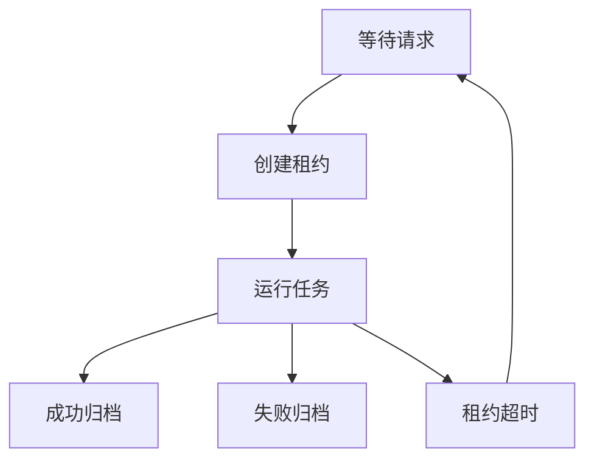

# 文件任务工作器注释与示例

## 一、类的职责

`FileRahaUdfJobWorker` 是一个以共享目录为队列的单轮任务消费者。
它读取训练、检测和采样请求，通过租约文件避免多个消费者重复执行同一个任务，
再将任务交给 `RahaUdfTaskDispatcher` 执行，并把最终状态写回共享目录。

调用一次 `runOnce()` 只扫描和处理当前可见的请求。
需要持续消费时，调用方应自行轮询；项目中的容器验收入口就是按此方式调用。

## 二、文件状态流转



同一个训练任务可能产生以下文件：

| 文件 | 含义 | 是否会再次扫描 |
| --- | --- | --- |
| `job-1-train.request` | 等待认领的请求正文 | 是 |
| `job-1-train.lease` | 消费者持有的独占租约 | 否 |
| `job-1-train.running` | 已认领且正在执行的请求正文 | 否 |
| `job-1-train.completed.request` | 成功任务的请求归档 | 否 |
| `job-1-train.succeeded` | 成功状态和执行摘要 | 否 |
| `job-1-train.failed.request` | 失败任务的请求归档 | 否 |
| `job-1-train.failed` | 失败状态和脱敏异常类型 | 否 |

## 三、成功任务示例

在共享目录写入 `job-1-train.request`，正文示例如下：

```text
datasetId=orders_202607&inputReference=ods.orders_dirty&sourceType=TABLE&rowIdColumn=id&snapshotId=snapshot_001&idempotencyKey=job-1&caller=data_quality&resultTable=dw.raha_model&annotationReference=dw.raha_labels
```

调用：

```java
FileRahaUdfJobWorker worker = new FileRahaUdfJobWorker(
        queueDirectory,
        request -> "candidateModelCount=3",
        Clock.systemUTC());

int completed = worker.runOnce();
```

执行过程如下：

1. 工作器创建 `job-1-train.lease`，创建操作具有独占性。
2. 工作器把 `job-1-train.request` 移动为 `job-1-train.running`。
3. 解析器根据文件名确定任务类型为 `TRAIN`，再解析请求正文。
4. 分发器执行训练任务并返回摘要 `candidateModelCount=3`。
5. 请求正文被归档为 `job-1-train.completed.request`。
6. 成功摘要写入 `job-1-train.succeeded`。
7. 租约文件在清理阶段删除。
8. `runOnce()` 返回 `1`，表示本轮成功处理一个任务。

成功状态文件的正文类似：

```text
jobId=job-1&taskType=TRAIN&status=SUCCEEDED&completedAt=1784257200000&summary=candidateModelCount=3
```

`completedAt` 由构造时传入的时钟生成，测试可以使用固定时钟得到稳定结果。
分发器返回空值时，`summary` 会写成空字符串。

## 四、并发认领示例

假设两个工作器同时扫描到 `job-1-train.request`：

1. 第一个工作器成功创建 `job-1-train.lease`。
2. 第二个工作器创建同名租约时收到文件已存在异常，并将本次认领判定为失败。
3. 第一个工作器继续把请求移动为运行态并执行。
4. 第二个工作器跳过该请求，不调用分发器，也不增加成功计数。

租约文件是第一层互斥保护，请求文件移动是第二层状态确认。
这套处理兼顾共享目录并发访问以及视窗系统下目标文件移动语义的差异。

文件名排序只保证单个工作器本次扫描结果的处理顺序稳定。
多个工作器并发运行时，不保证所有任务严格按照文件名形成全局顺序。

## 五、失败任务示例

如果请求正文把来源类型写成不支持的值：

```text
datasetId=orders_202607&inputReference=ods.orders_dirty&sourceType=CSV&rowIdColumn=id&idempotencyKey=job-2&caller=data_quality&resultTable=dw.raha_model&annotationReference=dw.raha_labels
```

解析器会抛出参数异常，工作器执行以下操作：

1. 把 `job-2-train.running` 移动为 `job-2-train.failed.request`。
2. 写出 `job-2-train.failed`，只保留状态和异常类型。
3. 在日志中记录运行文件、任务类型、上下文和完整异常堆栈。
4. 返回失败，不增加 `runOnce()` 的成功计数。

失败状态正文类似：

```text
status=FAILED&errorType=RahaUdfException
```

状态文件不保存异常消息，目的是避免下游异常把表名、参数或原始数据带入共享文件。
详细错误应通过工作器日志排查。

## 六、超时恢复示例

假设目录中遗留以下文件：

```text
job-3-detect.running
job-3-detect.lease
```

当前时间为 `10000` 毫秒，租约最后修改时间为 `1000` 毫秒，
配置的 `leaseTimeoutMillis` 为 `1000` 毫秒。
由于租约过期时间为 `2000` 毫秒，工作器会判定该任务已经超时。

恢复过程如下：

1. 把 `job-3-detect.running` 改回 `job-3-detect.request`。
2. 删除过期的 `job-3-detect.lease`。
3. 在同一轮请求扫描中重新发现并认领该任务。

租约文件缺失时也采用相同恢复流程，因为运行文件已经没有可确认的持有者。

## 七、边界条件与注意事项

### 1. 租约不会自动续期

当前实现只在认领时创建租约，任务执行过程中不会刷新租约的最后修改时间。
因此 `leaseTimeoutMillis` 必须大于单个任务可能持续的最长时间，并留出文件系统和调度抖动余量。
如果任务执行时间超过租约配置，另一个工作器调用 `runOnce()` 时可能回收仍在执行的任务。

### 2. 成功计数只统计完整成功终态

只有分发器执行成功、请求完成归档且成功摘要写入完成时，成功计数才增加。
参数解析失败、分发器异常或文件写入失败都不会增加计数。

### 3. 成功摘要应保持简短且不含原始数据

成功状态正文使用键值对直接拼接，摘要不会在此处再次进行表单编码。
分发器应返回简短、可审计且不含原始数据的文本，并避免在摘要中使用会破坏键值边界的字符。

### 4. 状态文件写入不是事务

请求归档和状态摘要写入是两个文件操作。
如果请求已成功归档，但摘要写入失败，异常处理会尝试写失败状态，目录中可能保留成功请求归档和失败状态。
运维检查时应同时核对请求归档与对应状态文件，不能只凭单个文件判断完整终态。

### 5. 文件名属于任务协议

文件名必须以 `-train.request`、`-detect.request` 或 `-sample.request` 结尾。
文件名决定任务类型，请求正文不能覆盖该类型。
已完成和已失败的请求归档虽然也包含 `.request`，但会被业务后缀过滤，不会重复执行。
