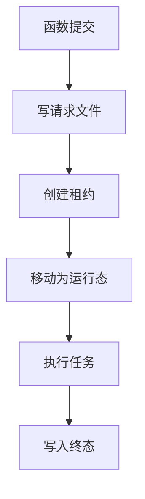
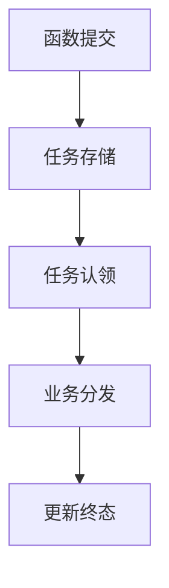

# 文件队列与 ORC 任务表优缺点分析

## 一、结论

可以创建一张 ORC 表保存任务状态，而且从查询、运维和代码可读性看，
它比当前以多个文件后缀表达状态的方案更直观。

但需要区分两个目标：

1. 如果 ORC 表只负责保存和查询状态，它可以直接替代 `.succeeded`、`.failed`
   等状态文件，但不能自动替代任务认领和并发锁。
2. 如果 ORC 表还要替代整个文件队列，它就不能只是一张“状态表”，而必须是一张
   同时保存完整请求、当前状态、消费者、租约和重试次数的“任务表”。

普通的非事务 ORC 表不适合直接承担多消费者原子认领。
只有在 FMDB 明确支持事务更新、条件更新或等价的比较后更新能力时，
才能安全地用一张 ORC 任务表完全替代文件队列。

结合当前项目，建议如下：

- 如果可以明确保证永远只有一个消费者，可以使用单张 ORC 任务表简化实现。
- 如果需要多实例、高可用或并发扩容，应先确认 FMDB 的事务认领能力。
- 如果 FMDB 不支持原子条件更新，ORC 表只作为状态与审计表，任务认领继续使用文件租约、
  消息队列或支持事务的关系型数据库。

## 二、当前文件工作器为什么显得复杂

当前 `FileRahaUdfJobWorker` 使用文件名和文件后缀表达任务状态：

| 文件 | 状态或用途 |
| --- | --- |
| `.request` | 等待执行 |
| `.lease` | 消费者独占租约 |
| `.running` | 正在执行 |
| `.completed.request` | 成功请求归档 |
| `.succeeded` | 成功摘要 |
| `.failed.request` | 失败请求归档 |
| `.failed` | 失败摘要 |

因此一个工作器必须同时处理以下职责：

1. 扫描目录并过滤请求文件。
2. 从文件名识别任务类型。
3. 创建租约文件进行互斥。
4. 移动文件完成状态转换。
5. 判断租约是否超时。
6. 回收异常退出留下的运行中任务。
7. 归档原始请求。
8. 写成功或失败摘要。
9. 处理每一步文件操作的异常。

这些复杂度主要来自“使用文件系统实现一个轻量任务队列”，并不是算法执行本身复杂。



## 三、当前项目已经具备的表状态能力

项目并不是完全没有任务表能力，已经存在以下实现：

- `RepositoryBackedRahaUdfJobSubmitter`：创建 `RahaJob`，并通过
  `FmdbResultWriter` 写入 FMDB 任务状态表。
- `SparkSqlFmdbResultWriter`：把任务对象转换为固定表结构。
- `SparkSqlFmdbTableGateway`：通过 `appendIdempotent` 进行追加写入。
- `RahaJob` 和 `JobStatus`：已经定义创建、运行、成功、失败和取消状态机。

但是这些能力目前还不能直接替代文件工作器，原因如下。

### 3.1 状态表没有保存完整请求

`RepositoryBackedRahaUdfJobSubmitter` 保存的 `RahaJob` 主要包含任务编号、任务类型、
数据集、配置版本和生命周期状态，没有保存 `RahaUdfRequest` 的完整执行参数。

消费者重启后仅凭现有任务状态记录，无法还原输入引用、行标识字段、结果表、模型版本、
标注引用或采样预算，因此无法真正执行任务。

### 3.2 当前写入方式是追加状态快照

`SparkSqlFmdbResultWriter.writeJob` 使用以下字段作为幂等键：

```text
job_id, status, current_stage_id
```

这意味着同一任务从 `CREATED` 进入 `RUNNING` 时会追加另一行，
而不是更新原有任务记录。该方式适合保存状态历史，但读取“当前状态”时需要按时间或版本取最新行。

### 3.3 当前幂等追加不能保证跨进程互斥

`SparkSqlFmdbTableGateway.appendIdempotent` 的处理步骤是：

1. 读取目标表已有主键。
2. 在计算层过滤重复行。
3. 将剩余数据追加到目标表。

方法上的同步控制只保护同一个 Java 对象实例。
两个消费者进程仍可能同时读取到“任务未认领”，然后都追加一条运行状态。

因此当前的 `appendIdempotent` 是尽力去重，不是跨进程原子认领。

### 3.4 当前任务仓储没有待处理查询和认领接口

`JobRepository` 目前只有保存任务和按幂等键查询两个核心方法，缺少：

- 查询待执行任务。
- 原子认领任务。
- 续期租约。
- 释放任务。
- 回收过期任务。
- 按任务编号读取完整请求。

所以当前仓储接口还只是任务状态仓储，不是任务队列仓储。

## 四、改用一张 ORC 任务表的优点

### 4.1 状态表达更直观

文件后缀可以变成一个 `status` 字段，路径转换逻辑可以消失。
查询任务时不需要同时检查多个文件是否存在。

### 4.2 运维和查询更方便

可以直接通过 SQL 查询：

- 当前等待任务数量。
- 运行时间过长的任务。
- 最近失败任务及错误编码。
- 每种任务类型的成功率。
- 某个幂等键对应的任务状态。

### 4.3 请求和状态可以集中保存

把完整请求正文和状态放在同一条任务记录中，消费者重启后仍能恢复任务，
不需要分别管理请求文件、归档文件和摘要文件。

### 4.4 代码职责更容易拆分

可以将表操作封装在 `UdfJobStore` 中，使消费者只表达业务流程，
不直接处理文件名、路径和文件系统异常。

### 4.5 更容易接入平台监控

状态表天然适合作为报表、监控和告警的数据源，
不需要额外编写目录扫描程序把文件状态转换成监控指标。

### 4.6 ORC 适合批量查询和压缩存储

ORC 对列裁剪、压缩和批量分析比较友好，保存大量历史任务时，
查询任务类型、状态和时间字段通常比逐个读取小文件更高效。

## 五、改用一张 ORC 任务表的缺点和风险

### 5.1 ORC 是文件格式，不等于事务数据库

是否支持原子更新、行锁、条件更新和事务，由 FMDB 的表管理和执行引擎决定，
不能仅凭“表使用 ORC 格式”推断具备这些能力。

如果只能读取后追加，就仍然存在两个消费者同时认领一个任务的问题。

### 5.2 小批量高频写入成本可能较高

每提交、认领、续期或完成一个任务都启动一次 Spark 表操作，
其调度成本可能明显高于创建或移动一个文件。

大量单行追加还可能产生小文件，需要压缩、合并或定期整理。

### 5.3 状态更新可能产生大量历史行

如果表不支持原地更新，只能追加事件，那么一个任务会产生多条状态记录。
读取当前状态必须使用窗口排序或聚合取最新版本，查询和清理逻辑仍有一定复杂度。

### 5.4 表服务故障会影响提交和消费

文件模式只依赖共享文件系统。
表模式会依赖 FMDB 元数据、计算会话、表权限和存储服务，故障边界更大。

### 5.5 完整请求需要安全治理

任务表若保存 `request_payload`，必须确认其中没有敏感数据，
并对表权限、错误信息脱敏、保存期限和审计访问进行约束。

### 5.6 代码复杂度不会完全消失

文件租约会变成表字段和条件更新，仍然需要处理：

- 幂等提交。
- 状态转换。
- 消费者认领。
- 执行超时。
- 异常恢复。
- 重试次数。
- 终态不可覆盖。

复杂度可以被集中和封装，但不能仅通过换成一张表彻底消除。

## 六、两种方案对比

| 维度 | 当前文件队列 | 普通 ORC 状态表 | 事务任务表 |
| --- | --- | --- | --- |
| 状态可读性 | 较差，需要理解文件后缀 | 较好 | 较好 |
| SQL 查询 | 不支持 | 支持 | 支持 |
| 保存完整请求 | 已支持 | 需要增加字段 | 需要增加字段 |
| 单消费者执行 | 支持 | 支持 | 支持 |
| 多消费者认领 | 通过独占文件创建实现 | 不安全 | 条件更新正确时安全 |
| 故障恢复 | 通过租约文件恢复 | 需要时间字段恢复 | 通过租约和条件更新恢复 |
| 高频单任务写入 | 成本较低 | Spark 调度成本较高 | 取决于平台实现 |
| 历史统计 | 需要额外采集 | 方便 | 方便 |
| 小文件问题 | 每个任务多个小文件 | 表底层仍可能产生小文件 | 取决于平台整理能力 |
| 代码复杂度位置 | 集中在工作器 | 分散在查询和追加逻辑 | 集中在任务仓储 |

## 七、建议的单表结构

如果决定用表替代文件队列，建议创建的是“任务表”，而不仅是“状态表”。
下面是概念结构，具体建表语法需要根据 FMDB 的 ORC 和事务能力调整。

```sql
CREATE TABLE IF NOT EXISTS dw.raha_udf_job (
    job_id STRING,
    idempotency_key STRING,
    task_type STRING,
    dataset_id STRING,
    request_payload STRING,
    config_version STRING,
    status STRING,
    owner_id STRING,
    lease_until BIGINT,
    attempt_count INT,
    created_at BIGINT,
    started_at BIGINT,
    updated_at BIGINT,
    finished_at BIGINT,
    error_code STRING,
    error_message STRING,
    result_summary STRING,
    record_version BIGINT
)
STORED AS ORC;
```

关键字段说明：

| 字段 | 用途 |
| --- | --- |
| `request_payload` | 保存可重新解析的完整请求 |
| `status` | 表达创建、运行、成功、失败或取消状态 |
| `owner_id` | 标识当前认领任务的消费者实例 |
| `lease_until` | 判断消费者是否已经超时 |
| `attempt_count` | 控制重试次数并辅助排查 |
| `record_version` | 支持乐观锁或比较后更新 |
| `config_version` | 检查相同幂等键是否对应相同配置 |

如果表不能事务更新，建议把 `record_version` 作为递增事件版本，
每次状态变化追加一条记录，再按任务编号和最大版本查询当前状态。
但这种追加事件模式仍不能解决多消费者原子认领，只适用于单消费者或外部已有队列锁的情况。

## 八、推荐的代码结构

建议不要让新的工作器直接拼接 SQL，而是先抽象任务存储接口：

```java
public interface UdfJobStore {
    RahaUdfSubmissionResult submit(RahaUdfRequest request);

    Optional<ClaimedUdfJob> claimNext(
            String ownerId, long now, long leaseUntil);

    void markSucceeded(
            String jobId, String ownerId, String summary, long finishedAt);

    void markFailed(
            String jobId, String ownerId, String errorCode, long finishedAt);

    int recoverExpired(long now);
}
```

新的消费者只保留以下主流程：

```java
public int runOnce() {
    jobStore.recoverExpired(clock.millis());
    Optional<ClaimedUdfJob> claimed = jobStore.claimNext(
            ownerId, clock.millis(), leaseDeadline());
    if (!claimed.isPresent()) {
        return 0;
    }
    return execute(claimed.get());
}
```

这样文件操作或表操作的复杂度都被限制在 `UdfJobStore` 实现内部，
工作器本身只负责认领、执行和记录结果，可读性会明显改善。



## 九、按部署场景选择方案

### 9.1 明确只有一个消费者

这是最容易简化的场景，可以采用单张 ORC 任务表：

1. 提交器写入完整请求和 `CREATED` 状态。
2. 唯一消费者查询最早的待执行任务。
3. 消费者追加或更新 `RUNNING` 状态。
4. 执行完成后写入成功或失败终态。
5. 启动时把超过时限的运行任务重新置为待执行。

此时不需要解决两个消费者同时认领的问题，代码可以比文件方案简单很多。
但任务执行仍然是至少一次语义，消费者在业务执行完成后、终态写入前崩溃，
恢复后可能再次执行，因此分发器仍需具备业务幂等性。

### 9.2 需要多个消费者或高可用

必须要求任务存储提供类似以下语义：

```sql
UPDATE dw.raha_udf_job
SET status = 'RUNNING',
    owner_id = :ownerId,
    lease_until = :leaseUntil,
    record_version = record_version + 1
WHERE job_id = :jobId
  AND status = 'CREATED'
  AND record_version = :expectedVersion;
```

只有实际更新一行的消费者才算认领成功。
如果 FMDB 无法保证该条件更新的原子性及可靠返回影响行数，
就不应使用普通 ORC 表作为多消费者队列。

这种情况下更合适的选择是：

- 支持事务条件更新的关系型数据库任务表。
- 已有的企业消息队列。
- 平台原生任务调度服务。
- 保留文件租约负责认领，同时把 ORC 表作为统一状态视图。

## 十、推荐的实施路线

### 第一阶段：确认平台能力

先验证 FMDB 是否支持以下能力：

1. ORC 表的事务属性。
2. 带状态和版本条件的原子更新。
3. 更新影响行数的可靠返回。
4. 多进程并发更新同一任务时只有一个成功。
5. 失败事务回滚。
6. 小文件合并或表压缩机制。

这一步没有确认前，不建议删除文件租约实现。

### 第二阶段：统一任务存储接口

新增 `UdfJobStore`，把提交、认领、状态更新和过期恢复从工作器中抽离。
先用现有文件模式实现该接口，验证接口是否覆盖全部行为。

### 第三阶段：实现表存储

新增表存储实现，保存完整请求，并补齐待处理查询、原子认领、终态更新和租约恢复。
不要直接复用当前 `appendIdempotent` 作为认领操作，因为它不具备跨进程互斥保证。

### 第四阶段：并发和故障验收

至少验证以下场景：

1. 两个消费者同时认领同一任务，只有一个成功。
2. 消费者认领后立即退出，租约超时后任务可以恢复。
3. 相同幂等键和相同配置重复提交，不产生新任务。
4. 相同幂等键和不同配置重复提交，被判定为冲突。
5. 成功任务不能被后续失败写入覆盖。
6. 业务执行完成但状态写入失败时，重试不会产生重复业务结果。
7. 大量任务下不会产生不可控的小文件和扫描延迟。

### 第五阶段：按结果切换

- 如果 FMDB 通过并发事务验收，使用表任务存储替代文件状态机。
- 如果只能保证单消费者，明确写入部署约束，并保留至少一次执行和幂等保护。
- 如果事务验收失败，ORC 表只用于状态查询，认领继续使用文件或其他可靠队列。

## 十一、最终建议

从可读性和运维角度，改成表驱动方向是合理的。
不过真正应该替换的不是“多个状态文件”，而是整个任务存储边界。

当前项目最合适的目标结构是：

```text
UDF 提交器
    -> UdfJobStore
    -> 简化后的任务工作器
    -> RahaUdfTaskDispatcher
    -> UdfJobStore 更新终态
```

如果生产部署能够严格保证单消费者，单张 ORC 任务表是可接受且明显更简单的方案。
如果未来可能出现两个消费者，则必须先取得事务条件更新能力；否则看似减少了文件和代码，
实际上会把显式的文件租约问题变成更隐蔽、更难排查的重复执行问题。

因此建议短期先抽象 `UdfJobStore` 并确认 FMDB 的事务能力，
不要直接把当前文件状态机机械翻译成普通 ORC 追加表。
