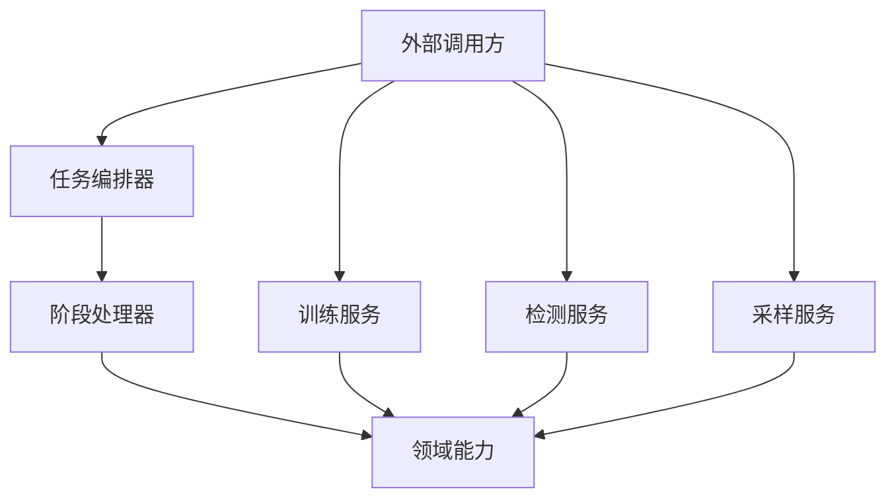
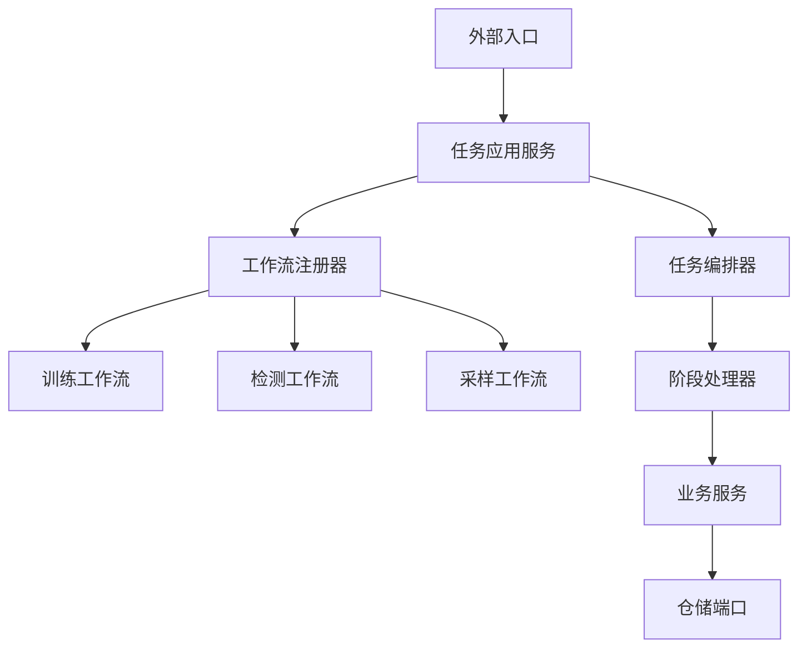

# Raha 任务编排与训练预测统一入口分析

> 落地状态：本文前半部分记录的是改造前基线。统一任务应用入口、训练预测采样工作流和阶段处理器已经按照本文建议完成代码落地，当前实现结果请参阅 [Raha统一任务编排入口代码落地报告-202607181450.md](Raha统一任务编排入口代码落地报告-202607181450.md)。阅读本文历史分析时，应以该落地报告和当前源码为准。

## 一、结论

当前工程中，`job` 和 `service` 在概念上应该是“任务执行框架”和“业务用例服务”的上下层关系，但在实际代码中还没有真正连接起来。

当前状态可以概括为：

1. `job` 已经具备幂等建单、任务状态、阶段状态、阶段顺序、重试和失败决策能力。
2. `service` 已经具备训练、已发布模型检测、采样和特征准备等业务编排能力。
3. `job` 主源码没有导入任何 `service` 类。
4. `service` 主源码也没有导入任何 `job` 类。
5. `RahaJobOrchestrator` 是通用任务执行器，但不是按任务类型自动编排训练、检测和采样的统一入口。
6. 工程当前不存在生产 `Application`、统一任务应用服务、工作流注册器或默认流水线工厂。

因此，工程目前有通用编排基础，但还没有完整统一编排入口。

## 二、两个包各自负责什么

### 2.1 `job` 包

`job` 负责的是任务执行机制，不应直接承载具体算法流程。

| 子包 | 当前职责 |
| --- | --- |
| `job.domain` | `RahaJob`、`RahaStage` 和 `JobRunResult` 等任务领域对象 |
| `job.execution` | 幂等提交、阶段执行、失败决策和任务终态处理 |
| `job.id` | 任务标识、阶段标识和幂等键生成 |
| `job.stage` | 阶段接口、上下文、结果、共享属性和现有阶段处理器 |

`RahaJobOrchestrator` 当前提供两个核心方法：

| 方法 | 位置 | 功能 |
| --- | --- | --- |
| `submit` | `RahaJobOrchestrator.java:87` | 校验配置、生成配置版本和幂等键、创建或返回已有任务 |
| `execute` | `RahaJobOrchestrator.java:113` | 执行调用方传入的阶段列表，处理状态、重试、继续和失败终止 |

需要特别注意：`execute` 接收的是调用方传入的 `List<StageHandler>`。它本身不知道训练任务应该有哪些阶段，也不知道检测任务应该有哪些阶段。

### 2.2 `service` 包

`service` 负责的是具体业务用例和业务输出。

| 子包 | 当前职责 |
| --- | --- |
| `service.prepare` | 生成策略计划、执行策略和组装特征 |
| `service.sample` | 聚类采样和逐轮主动采样 |
| `service.train` | 标签传播、列模型训练、质量门禁和候选模型保存 |
| `service.detect` | 加载已发布模型、逐列预测并保存检测结果 |
| `service.common` | 服务层任务类型、状态、摘要和统一结果包装 |

三个主要业务方法分别是：

| 方法 | 位置 | 当前粒度 |
| --- | --- | --- |
| `RahaTrainService.train` | `RahaTrainService.java:142` | 较完整的训练业务编排 |
| `RahaDetectService.detect` | `RahaDetectService.java:82` | 只负责已准备特征后的模型预测 |
| `RahaSampleService.sample` | `RahaSampleService.java:51` | 只负责特征和聚类之后的采样 |

三个服务的输入粒度并不一致。训练服务会自行完成策略、特征、聚类、传播和训练，而检测服务要求调用方已经提供特征和策略计划版本，采样服务也要求调用方已经提供特征。

## 三、当前实际关系

当前代码关系不是 `job -> service`，也不是 `service -> job`，而是两套平行调用方式。



主源码全局检查结果为：

```text
job-to-service=0
service-to-job=0
```

这说明包结构虽然已经分层，但任务编排和业务服务尚未形成统一调用链。

## 四、当前任务编排器能做什么

`RahaJobOrchestrator` 当前能够处理：

- 相同配置的幂等任务提交。
- 任务从创建、运行到成功或失败的状态转换。
- 阶段标识和尝试次数。
- 阶段执行顺序。
- 可恢复失败重试。
- 可容忍失败后继续执行。
- 不可恢复失败终止任务。
- 阶段共享属性传递。
- 任务和阶段仓储保存。

这些能力是统一编排的基础，但它缺少以下业务级能力：

- 根据 `JobType` 自动选择流水线。
- 创建训练、检测、采样所需的阶段处理器。
- 将外部请求转换为各阶段输入。
- 组装 Spark、仓储、模型存储和领域服务依赖。
- 将 `JobRunResult` 和业务输出统一为一个返回契约。
- 管理模型候选、评估、发布和生产预测的完整生命周期。

因此，它更准确的定位是“通用阶段执行引擎”，不是“Raha 统一业务入口”。

## 五、现有阶段覆盖情况

当前已经实现以下阶段处理器：

| 阶段 | 处理器 |
| --- | --- |
| `LOAD_DATA` | `DataLoadStageHandler` |
| `PROFILE` | `ColumnProfileStageHandler` |
| `GENERATE_STRATEGY` | `StrategyPlanStageHandler` |
| `RUN_STRATEGY` | `StrategyRunStageHandler` |
| `GENERATE_FEATURE` | `FeatureStageHandler` |
| `CLUSTER` | `ClusterStageHandler` |
| `SAMPLE` | `SamplingStageHandler` |
| `LABEL` | `GroundTruthLabelStageHandler` |
| `PREDICT` | `DetectionStageHandler` |

`StageType` 中已经定义，但目前没有对应生产处理器的阶段包括：

- `INITIALIZE`
- `PROPAGATE`
- `TRAIN`
- `EVALUATE`
- `PERSIST_RESULT`

这意味着当前 `job` 流水线可以完成数据准备、策略、特征、规则检测、聚类和采样，但不能通过现有阶段处理器完成完整模型训练、评估、发布和已发布模型预测。

## 六、训练流程现状

`RahaTrainService.train` 当前内部执行以下流程：

```text
训练请求
  -> 策略计划
  -> 策略执行
  -> 特征组装
  -> 列内聚类
  -> 标签传播
  -> 列训练数据构建
  -> 列模型训练
  -> 模型质量门禁
  -> 模型参数保存
  -> 候选模型登记
```

它已经是一个高层业务编排器，而不只是单一训练算法服务。

训练服务当前不会自动完成模型发布。`RahaTrainService` 最终调用 `ModelReleaseManager.markCandidate` 生成候选模型。集成测试随后在服务外部执行阈值比较，再调用 `releaseManager.publish` 发布模型。

当前完整模型生命周期实际上是：

```text
训练服务
  -> 候选模型
  -> 外部评估
  -> 外部阈值选择
  -> 外部发布
  -> 检测服务加载已发布模型
```

这个流程是合理的，因为训练完成后不应绕过评估直接发布。但是评估和发布目前没有纳入统一任务编排。

## 七、预测流程现状

工程中存在两种不同含义的检测流程。

### 7.1 `job` 中的 `PREDICT`

`DetectionStageHandler` 使用的是 `BasicDetectionService`，调用 `detectAndSave` 生成规则加权检测结果。

它没有加载已发布模型，也没有调用 `ColumnModelPredictor`。

### 7.2 `service` 中的已发布模型检测

`RahaDetectService` 使用：

- `PublishedColumnModelLoader`
- `ColumnModelPredictor`
- `DetectionResultRepository`

其核心流程是：

```text
已准备特征
  -> 加载兼容已发布模型
  -> 逐字段模型预测
  -> 生成检测结果
  -> 保存检测结果
```

因此，当前 `StageType.PREDICT` 对应的处理器并不是生产模型预测处理器。这个命名容易让调用方误以为任务编排器已经接入训练后模型。

建议后续把当前 `DetectionStageHandler` 明确命名为 `RuleDetectionStageHandler`，并新增真正调用 `RahaDetectService` 或模型预测服务的 `PublishedModelDetectionStageHandler`。

## 八、测试代码反映出的实际使用方式

当前测试也证明工程存在两套调用方式。

`Iteration5PipelineIntegrationTest.java:138` 手工创建 `RahaJobOrchestrator`，在 `162` 至 `172` 行手工创建任务并排列阶段处理器。

`Iteration7RahaLearningPipelineIntegrationTest.java:150`、`158` 和 `206` 分别手工创建：

- `RahaSampleService`
- `RahaTrainService`
- `RahaDetectService`

该测试没有通过 `RahaJobOrchestrator` 执行训练和检测。虽然测试文件位于 `job.execution` 包，但实际流程仍由测试方法自己编排。

这说明测试中的端到端能力已经存在，但还没有沉淀成可复用的生产入口。

## 九、当前存在的双重任务模型

工程目前同时存在两组任务契约。

| `job` 模型 | `service` 模型 | 问题 |
| --- | --- | --- |
| `JobType` | `RahaTaskType` | 类型名称和值不一致，前者有五种，后者只有三种 |
| `JobStatus` | `RahaTaskStatus` | 前者管理生命周期，后者只表达业务终态和部分成功 |
| `JobRunResult` | `RahaTaskResult` | 前者返回阶段轨迹，后者返回业务载荷和摘要 |
| `RahaJob.jobId` | 请求中的字符串 `jobId` | 服务无法保证字符串对应已登记任务 |

这不是单纯的命名重复，而是两套任务状态体系没有汇合。

另外，训练、检测和采样服务会捕获 `RuntimeException`，并转换为 `RahaTaskStatus.FAILED`。这样做适合独立服务调用，但接入 `RahaJobOrchestrator` 后会产生问题：

- 编排器无法直接判断异常是否可重试。
- 阶段失败原因需要再次从 `RahaTaskResult` 转换为 `StageResult`。
- 任务状态和服务状态可能出现不一致。
- 服务返回失败后，如果处理器没有正确转换，任务可能被错误标记为成功。

## 十、是否已经有统一编排入口

答案是：没有完整统一入口。

当前最接近统一入口的是 `RahaJobOrchestrator`，但它只统一了任务生命周期和阶段执行机制，没有统一以下内容：

- 任务类型路由。
- 默认阶段列表。
- 训练、检测、采样服务调用。
- 模型评估和发布。
- 请求和结果契约。
- 依赖组装。

当前调用方仍然必须自己决定：

1. 调用 `RahaJobOrchestrator` 并手工传入阶段列表。
2. 或者直接调用 `RahaTrainService`、`RahaDetectService`、`RahaSampleService`。

这正是需要新增统一应用编排层的原因。

## 十一、推荐的目标关系

建议增加高于 `job` 和具体业务服务的统一任务应用层。



推荐新增以下结构：

```text
service
  task
    RahaTaskApplicationService
    RahaTaskExecutionRequest
    RahaTaskExecutionResult
    RahaWorkflow
    RahaWorkflowRegistry
    TrainingWorkflow
    DetectionWorkflow
    SamplingWorkflow
```

其中：

| 类 | 职责 |
| --- | --- |
| `RahaTaskApplicationService` | 唯一对外任务执行入口 |
| `RahaWorkflowRegistry` | 根据 `JobType` 查找工作流 |
| `RahaWorkflow` | 定义一个任务类型如何创建阶段列表 |
| `TrainingWorkflow` | 创建训练任务阶段 |
| `DetectionWorkflow` | 创建生产检测任务阶段 |
| `SamplingWorkflow` | 创建主动采样任务阶段 |
| `RahaTaskExecutionResult` | 统一任务状态、阶段轨迹和业务输出 |

不建议把任务类型判断直接写进 `RahaJobOrchestrator`。任务编排器应该保持通用，任务类型路由和业务阶段组装应放在应用层。

## 十二、推荐的训练工作流

```text
LOAD_DATA
  -> PROFILE
  -> GENERATE_STRATEGY
  -> RUN_STRATEGY
  -> GENERATE_FEATURE
  -> CLUSTER
  -> LABEL
  -> PROPAGATE
  -> TRAIN
  -> EVALUATE
  -> PERSIST_RESULT
```

其中 `TRAIN` 阶段只负责使用已经准备好的特征、聚类和标签训练模型，不应再次执行策略计划和特征组装。

训练结束后建议保留候选模型状态。模型发布可以有两种设计：

1. 训练工作流完成评估后，按明确发布策略自动发布。
2. 单独增加模型发布命令，由人工或平台审批后执行。

对于生产工程，更推荐第二种，避免训练成功后未经审批直接替换线上模型。

## 十三、推荐的生产检测工作流

```text
LOAD_DATA
  -> PROFILE
  -> GENERATE_STRATEGY
  -> RUN_STRATEGY
  -> GENERATE_FEATURE
  -> PREDICT
  -> PERSIST_RESULT
```

这里的 `PREDICT` 应明确表示：

- 加载与数据集、模式、特征版本和策略版本兼容的已发布模型。
- 执行列级模型预测。
- 保存模型版本、阈值、分数和解释信息。

当前规则加权检测可以保留为模型不可用时的显式降级策略，但不应继续和已发布模型预测共用一个含义模糊的处理器名称。

## 十四、推荐的采样工作流

```text
LOAD_DATA
  -> PROFILE
  -> GENERATE_STRATEGY
  -> RUN_STRATEGY
  -> GENERATE_FEATURE
  -> CLUSTER
  -> SAMPLE
  -> PERSIST_RESULT
```

多轮主动采样可由 `SamplingWorkflow` 内部使用 `ActiveSamplingOrchestrator`，但每一轮的结果应归属于同一个 `RahaJob`，并通过阶段摘要记录轮次和标签数量。

## 十五、需要补充或调整的代码

### 15.1 建议新增

- `service.task.RahaTaskApplicationService`
- `service.task.RahaTaskExecutionRequest`
- `service.task.RahaTaskExecutionResult`
- `service.task.RahaWorkflow`
- `service.task.RahaWorkflowRegistry`
- `service.task.TrainingWorkflow`
- `service.task.DetectionWorkflow`
- `service.task.SamplingWorkflow`
- `job.stage.LabelPropagationStageHandler`
- `job.stage.ModelTrainingStageHandler`
- `job.stage.PublishedModelDetectionStageHandler`
- `job.stage.EvaluationStageHandler`
- `job.stage.ResultPersistenceStageHandler`

### 15.2 建议修改

- `StageAttributeKeys` 增加传播结果、训练结果、候选模型、模型预测和评估结果属性。
- `RahaTrainService` 收敛为使用已准备输入的训练能力，避免和阶段流水线重复执行策略及特征准备。
- `RahaDetectService` 作为真正的模型预测能力接入 `PREDICT` 阶段。
- `RahaSampleService` 接入统一采样工作流。
- 服务异常由阶段处理器转换为 `StageResult`，保留可重试信息和处理数量。
- 端到端测试改为只调用 `RahaTaskApplicationService.execute`。

### 15.3 建议删除或合并

- `RahaTaskType` 建议与 `JobType` 合并，避免维护两套任务类型。
- `RahaTaskStatus` 应与 `JobStatus` 明确统一策略，部分成功可通过任务状态或运行摘要统一表达。
- `RahaTaskResult` 和 `JobRunResult` 建议合并为应用层统一结果，或明确前者只作为阶段内部结果。
- 当前 `DetectionStageHandler` 建议重命名，避免把规则检测误认为模型预测。

## 十六、统一入口示例

目标调用方最终只需要执行一次应用服务方法：

```java
RahaTaskExecutionResult result = taskApplicationService.execute(request);
```

内部执行顺序为：

```text
校验请求
  -> 创建幂等任务
  -> 根据任务类型选择工作流
  -> 创建阶段处理器
  -> 执行任务阶段
  -> 汇总任务和业务结果
  -> 返回统一结果
```

调用方不再手工创建 `List<StageHandler>`，也不再分别决定是否直接调用训练、检测或采样服务。

## 十七、最终判断

`job` 和 `service` 的合理关系应该是：

```text
统一应用入口
  -> job 负责怎么执行
  -> service 负责执行什么业务
```

当前工程已经具备这两个方向的大部分基础类，但两者尚未连接。`RahaJobOrchestrator` 只能算统一执行内核，不能算完整统一业务入口。

下一步最优先的改造不是再增加一个 `Application` 类，而是先实现 `RahaTaskApplicationService`、工作流注册器和缺失阶段处理器。完成后，命令行、批处理平台或 HTTP 入口都可以作为很薄的适配层调用同一任务应用服务。
