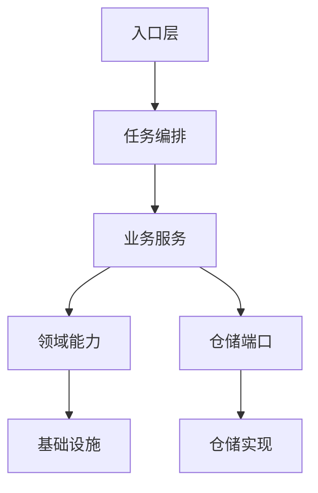

# Raha 包结构分层重构分析

> 落地状态：本文建议已于 2026-07-18 完成代码迁移。实际变更和验证结果见 `Raha包结构分层重构落地报告-202607181320.md`。

## 一、背景

当前工程已经删除 `app` 入口，并准备移除文件队列和 UDF 相关思路，后续主线保留任务模型思路。此时 `src/main/java/com/fiberhome/ml/raha` 下仍有较多一层包，部分包中接口、实现类、请求对象、返回对象、状态枚举和工具类混放，后续继续扩展任务编排、生产入口和持久化实现时会增加理解成本。

本文给出结构分析和迁移依据，目标结构已经同步落地到主源码和测试源码。

## 二、当前包分布

按当前源码统计，主要包分布如下。

| 包 | 类数量 | 当前特点 |
| --- | ---: | --- |
| `job` | 23 | 已有 `job.stage` 二层结构，但任务模型、执行器、阶段上下文、策略决策仍混在主包 |
| `service` | 19 | 采样、训练、检测、特征准备、统一任务结果对象混放 |
| `repository` | 31 | 仓储接口、默认实现、内存实现、通用仓储记录对象混放 |
| `model` | 25 | 模型领域对象、训练器、预测器、存储接口、发布管理混放 |
| `strategy` | 28 | 已有 `od`、`pvd`、`rvd` 策略实现子包，但计划、执行、结果、注册和支撑工具仍在一层 |
| `data` | 31 | 已有 `loader`、`profile` 子包，但核心数据对象和大量枚举仍混放 |
| `config` | 18 | 配置对象、加载器、校验器、版本器和异常混放 |
| `cluster` | 11 | 聚类接口、实现、服务、结果对象混放 |
| `label` | 10 | 标签领域对象、真值适配、传播服务和传播结果混放 |
| `sampling` | 9 | 采样领域对象、采样服务、版本器和算法类混放 |
| `feature` | 8 | 特征领域对象、组装器、服务和结果对象混放 |
| `fmdb` | 9 | FMDB 网关接口、Spark 实现、内存实现、模型存储、结果写入混放 |
| `detection` | 9 | 基础检测、评分规则、解释对象和结果对象混放 |
| `evaluation` | 11 | 评估指标、阈值选择、真值比对和数据切分混放 |
| `checkpoint` | 6 | 检查点任务、运行器、结果和状态混放 |
| `parallel` | 5 | 并行执行器、资源管理和并行结果对象混放 |
| `error`、`observability`、`util` | 较少 | 目前规模小，可暂时保持 |

## 三、主要问题

### 3.1 接口和实现类距离太近

典型例子是 `repository` 包：

- `JobRepository`、`StageRepository`、`FeatureRepository` 是接口。
- `DefaultJobRepository`、`DefaultStageRepository`、`DefaultFeatureRepository` 是默认实现。
- `InMemoryRahaRepository` 是内存实现。
- `RepositoryKey`、`RepositoryRecord`、`ArtifactVersion` 又是通用仓储模型。

这些对象都在一层包下，阅读时很难立即判断哪个是对外契约，哪个是内部实现。

### 3.2 请求返回对象和服务类混放

典型例子是 `service` 包：

- `RahaTrainService`、`RahaDetectService`、`RahaSampleService` 是业务服务。
- `RahaTrainRequest`、`RahaTrainOutput`、`RahaDetectRequest`、`RahaDetectOutput` 是请求返回对象。
- `RahaTaskResult`、`RahaTaskSummary`、`RahaTaskStatus`、`RahaTaskType` 是公共结果模型。
- `ActiveSamplingOrchestrator` 和 `RahaFeaturePreparationService` 又是更细粒度的应用编排能力。

这些类全部放在 `service` 一层，后续新增任务入口后会越来越像一个杂物包。

### 3.3 任务模型主线还不够突出

当前准备保留任务模型思路，`job` 应成为上层编排核心。但目前 `job` 主包里同时包含：

- 任务领域模型：`RahaJob`、`RahaStage`。
- 执行编排器：`RahaJobOrchestrator`。
- 阶段执行上下文：`StageExecutionContext`、`StageAttributeKeys`。
- 阶段结果：`StageResult`、`StageOutcome`。
- 失败策略：`StageFailureDecider`、`FailureDecision`。
- 标识生成：`RahaIdGenerator`、`DefaultRahaIdGenerator`、`IdempotencyKeyGenerator`。

这些职责都重要，但需要通过二、三层目录表达层次。

### 3.4 基础设施包和领域包边界不够清楚

`fmdb` 包里既有接口，也有 Spark SQL 实现、内存实现和模型存储。它更像基础设施适配层，不应该和核心领域对象保持同一层含义。

`repository` 包也类似，接口可以作为核心端口保留，但 `Default*Repository` 和 `InMemoryRahaRepository` 更像实现细节。

## 四、推荐分层原则

建议按以下规则整理包结构。

| 分类 | 建议子包名 | 放置内容 |
| --- | --- | --- |
| 对外契约 | `api`、`port` | 接口、外部调用契约 |
| 领域对象 | `domain`、`model` | 实体、值对象、状态枚举、领域结果 |
| 请求返回对象 | `dto` | Request、Output、Result、Summary |
| 业务服务 | `application`、`service` | 用例级服务和编排服务 |
| 算法实现 | `algorithm`、`impl` | 具体算法、默认实现、策略实现 |
| 基础设施 | `infra`、`adapter`、`store` | FMDB、Spark、文件、内存实现 |
| 内部工具 | `internal`、`support` | 只服务本包内部的辅助类 |

为了避免过度拆分，建议采用“够数量再拆”的硬规则：

- 单个子包预计少于 3 个类时，默认不新建子包。
- 1 到 2 个类可以先留在父包，或并入职责最接近的已有子包。
- 单个子包达到 3 到 12 个类时，通常是比较合适的拆分粒度。
- 超过 12 个类且出现接口、实现、请求、结果混放时，再继续拆第三层。
- 不为了“看起来完整”提前创建空包或只有一个类的预留包。

## 五、目标依赖方向

建议依赖方向如下。



说明：

- 入口层可以是未来的批处理入口、命令入口或平台接口。
- 任务编排层以 `job` 为核心，负责幂等、任务状态、阶段状态和重试。
- 业务服务层以 `service` 为核心，负责训练、检测、采样等用例。
- 领域能力层包括 `strategy`、`feature`、`cluster`、`sampling`、`label`、`model`、`evaluation`。
- 仓储端口应尽量被核心层依赖，仓储实现应尽量只被装配层依赖。
- 基础设施层包括 FMDB、Spark、文件、内存实现。

## 六、推荐目标包结构

下面是按当前类数量收敛后的建议结构。包名可以按团队习惯微调，但核心原则是区分接口、模型、服务、实现，同时避免 1 到 2 个类就单独成包。

```text
com.fiberhome.ml.raha
  job
    domain
    execution
    id
    stage
  service
    common
    prepare
    sample
    train
    detect
  repository
    core
    port
    adapter
  data
    domain
    type
    loader
    profile
  strategy
    api
    plan
    execution
    domain
    impl
      od
      pvd
  feature
    domain
    assembly
  cluster
    domain
    algorithm
  sampling
    domain
    service
  label
    propagation
  model
    domain
    training
    prediction
    release
  detection
    scoring
    explanation
    service
  evaluation
    metrics
    threshold
  fmdb
    gateway
  config
    core
    dto
    validation
  checkpoint
  parallel
  error
  observability
  util
```

## 七、重点包迁移建议

### 7.1 `job` 包

`job` 应成为任务模型思路的主入口。按当前规模，建议只拆到二层，不再把 `stage` 继续拆成 `api`、`context`、`result` 等小包。

| 当前类 | 建议位置 | 原因 |
| --- | --- | --- |
| `RahaJob` | `job.domain` | 任务实体 |
| `RahaStage` | `job.domain` | 阶段实体 |
| `JobRunResult` | `job.domain` | 一次任务执行的汇总结果，和任务实体一起表达任务运行状态 |
| `RahaJobOrchestrator` | `job.execution` | 任务提交流程和阶段执行编排 |
| `RahaIdGenerator` | `job.id` | 标识生成接口 |
| `DefaultRahaIdGenerator` | `job.id` | 默认标识生成实现 |
| `IdempotencyKeyGenerator` | `job.id` | 幂等键生成器 |
| `StageFailureDecider` | `job.execution` | 阶段失败后的策略判断，当前不单独建 `policy` 包 |
| `FailureDecision` | `job.execution` | 失败决策枚举，和失败决策器放在一起 |
| `StageExecutionContext` | `job.stage` | 阶段上下文 |
| `StageAttributeKeys` | `job.stage` | 阶段上下文属性键 |
| `StageResult` | `job.stage` | 阶段执行结果 |
| `StageOutcome` | `job.stage` | 阶段结果类型 |
| `StageHandler` | `job.stage` | 阶段处理器接口 |
| `DataLoadStageHandler` 等 | `job.stage` | 具体阶段处理器 |

拆分后，`job.execution` 只依赖 `job.domain`、`job.stage` 和仓储端口，不直接关心具体业务服务实现。等 `job.stage` 超过 12 到 15 个类或上下文、结果、处理器继续膨胀时，再考虑第三层。

### 7.2 `service` 包

`service` 是用例层，建议按任务类型拆分。

| 当前类 | 建议位置 | 原因 |
| --- | --- | --- |
| `RahaTaskResult` | `service.common` | 各任务共享返回包装 |
| `RahaTaskSummary` | `service.common` | 各任务共享摘要 |
| `RahaTaskStatus` | `service.common` | 各任务共享状态 |
| `RahaTaskType` | `service.common` | 各任务共享类型 |
| `RahaFeaturePreparationService` | `service.prepare` | 采样和训练复用的准备流程 |
| `RahaFeaturePreparationRequest` | `service.prepare` | 特征准备请求 |
| `RahaFeaturePreparationResult` | `service.prepare` | 特征准备结果 |
| `RahaSampleService` | `service.sample` | 采样用例服务 |
| `RahaSampleRequest` | `service.sample` | 采样请求 |
| `RahaSampleOutput` | `service.sample` | 采样输出 |
| `ActiveSamplingOrchestrator` | `service.sample` | 主动采样编排 |
| `ActiveSamplingResult` | `service.sample` | 主动采样结果 |
| `SampledTupleLabelProvider` | `service.sample` | 采样标签回调接口 |
| `RahaTrainService` | `service.train` | 训练用例服务 |
| `RahaTrainRequest` | `service.train` | 训练请求 |
| `RahaTrainOutput` | `service.train` | 训练输出 |
| `RahaDetectService` | `service.detect` | 检测用例服务 |
| `RahaDetectRequest` | `service.detect` | 检测请求 |
| `RahaDetectOutput` | `service.detect` | 检测输出 |

如果后续要实现“任务模型统一入口”，不要只为一个类提前新建 `service.job`。建议按类数量决定：

```text
service
  RahaTaskApplicationService
```

当后续出现 `RahaTaskExecutionRequest`、`RahaTaskExecutionResult`、装配器或查询对象，达到 3 个以上稳定类时，再拆为 `service.job`。该层负责把平台请求转换为 `RahaJobOrchestrator` 和具体 `service` 调用，不建议再回到 UDF 或文件队列模型。

### 7.3 `repository` 包

`repository` 是当前最需要拆分的包之一。

| 当前类 | 建议位置 | 原因 |
| --- | --- | --- |
| `RahaRepository` | `repository.core` | 通用仓储接口 |
| `RepositoryKey` | `repository.core` | 通用仓储键 |
| `RepositoryRecord` | `repository.core` | 通用仓储记录 |
| `RepositoryNamespace` | `repository.core` | 通用命名空间 |
| `RepositoryTransaction` | `repository.core` | 通用事务接口 |
| `ArtifactVersion` | `repository.core` | 通用版本对象 |
| `SaveOutcome` | `repository.core` | 通用保存结果 |
| `JobRepository` | `repository.port` | 任务仓储端口 |
| `StageRepository` | `repository.port` | 阶段仓储端口 |
| `FeatureRepository` 等 | `repository.port` | 各领域仓储端口 |
| `DefaultJobRepository` 等 | `repository.adapter` | 基于通用仓储的类型化适配 |
| `InMemoryRahaRepository` | `repository.adapter` | 内存仓储实现 |
| `StoredCellLabel` | `repository.adapter` | 仓储持久化结构 |

这样可以明确区分“仓储端口”和“仓储实现”，但不急着拆 `repository.adapter.generic` 和 `repository.adapter.memory`。后续如果新增 FMDB、JDBC 或对象存储实现，并且某类实现达到 3 个以上稳定类，再放入 `repository.adapter.fmdb` 或 `repository.adapter.jdbc`。

### 7.4 `data` 包

`data` 应表达核心数据结构和数据读取能力。

| 当前类 | 建议位置 |
| --- | --- |
| `RahaDataset`、`DatasetSnapshot` | `data.domain` |
| `CellCoordinate`、`CellValue` | `data.domain` |
| `ColumnMetadata`、`ColumnProfile` | `data.domain` |
| `DetectionResult` | `data.domain` |
| `JobType`、`JobStatus` | `data.type` |
| `StageType`、`StageStatus` | `data.type` |
| `StrategyFamily`、`StrategyStatus` | `data.type` |
| `FeatureType`、`ClassifierType`、`ModelStatus`、`LabelSource` | `data.type` |
| `RahaDatasetLoader` | `data.loader` |
| `DataLoadRequest`、`LoadedDataset` | `data.loader` |
| `FileRahaDatasetLoader` | `data.loader` |
| `RowIdValidator`、`SchemaHasher`、`SnapshotMetadataFactory` | `data.loader` |
| `ColumnProfiler`、`ColumnProfileService` | 保持 `data.profile`，暂不继续拆 |

如果项目偏向领域分层，也可以把 `JobType`、`JobStatus`、`StageType`、`StageStatus` 移回 `job.domain`，避免 `data.type` 变成全局枚举集合。

### 7.5 `model` 包

`model` 当前既表示机器学习模型，也包含模型训练、预测、发布和存储。建议拆分。

| 当前类 | 建议位置 |
| --- | --- |
| `RahaColumnModel`、`ColumnModelArtifact` | `model.domain` |
| `ColumnTrainingExample`、`ColumnTrainingDataset`、`ColumnModelTrainingRequest` | `model.training` |
| `ColumnModelTrainingResult`、`ColumnModelTrainingStatus`、`ColumnTrainingStatus` | `model.training` |
| `ColumnModelTrainer` | `model.training` |
| `AdaptiveColumnModelTrainer` | `model.training` |
| `SparkMllibLogisticRegressionTrainer` | `model.training` |
| `WeightedRuleFallbackTrainer` | `model.training` |
| `ColumnTrainingDataBuilder` | `model.training` |
| `ModelQualityGate` | `model.training` |
| `LogisticRegressionTrainingConfig` | `model.training` 或 `config.dto` |
| `ColumnModelPredictor`、`PartitionedColumnModelPredictor`、`ColumnPrediction` | `model.prediction` |
| `ColumnModelStore`、`FileColumnModelStore` | 暂留 `model` 根包，只有 2 个类时不单独建 `store` |
| `PublishedColumnModelLoader`、`ModelReleaseManager` | `model.release` |
| `ColumnModelMetadataFactory`、`ColumnModelCompatibilityValidator`、`ColumnModelVersioner` | `model.release` |

`FmdbModelStore` 不建议继续放在 `model`，它属于 FMDB 基础设施适配。由于目前 FMDB 模型存储只有 1 个类，建议先放在 `fmdb` 根包，等相关模型存储实现达到 3 个以上再拆 `fmdb.model`。

### 7.6 `strategy` 包

`strategy` 已经有策略实现子包，但核心对象仍可继续分层。

| 当前类 | 建议位置 |
| --- | --- |
| `DetectionStrategy` | `strategy.api` |
| `StrategyTypes`、`StrategyConfigurationKeys` | `strategy.api` 或 `strategy.domain` |
| `StrategyPlan`、`StrategyCandidate`、`StrategyIdentityGenerator` | `strategy.plan` |
| `StrategyPlanGenerator`、`StrategyPlanService` | `strategy.plan` |
| `StrategyExecutor`、`StrategyExecutionService`、`StrategyExecutionContext` | `strategy.execution` |
| `StrategyExecutionResult`、`StrategyBatchResult`、`StrategyRunSummary` | `strategy.execution` 或 `strategy.domain` |
| `StrategyHit` | `strategy.domain` |
| `StrategyRegistry` | `strategy.api` |
| `StrategyAlignmentArtifactWriter` | `strategy.execution` |
| `SparkStrategySupport`、`RvdBatchStrategyExecutor` | `strategy.execution` |
| `od`、`pvd` 策略实现 | `strategy.impl.od`、`strategy.impl.pvd` |
| `OneToManyConflictStrategy` | `strategy.impl`，只有 1 个 RVD 实现时不单独建 `rvd` 子包 |

### 7.7 `fmdb` 包

`fmdb` 应作为基础设施适配包，建议按照外部能力拆分。

| 当前类 | 建议位置 |
| --- | --- |
| `FmdbTableGateway` | `fmdb.gateway` |
| `SparkSqlFmdbTableGateway` | `fmdb.gateway` |
| `InMemoryFmdbTableGateway` | `fmdb.gateway` |
| `FmdbSchemaResolver` | 暂留 `fmdb` 根包，只有 2 个类时不单独建 `schema` |
| `DefaultFmdbSchemaResolver` | 暂留 `fmdb` 根包，只有 2 个类时不单独建 `schema` |
| `FmdbDatasetLoader` | 暂留 `fmdb` 根包 |
| `FmdbResultWriter` | 暂留 `fmdb` 根包，只有 2 个类时不单独建 `writer` |
| `SparkSqlFmdbResultWriter` | 暂留 `fmdb` 根包，只有 2 个类时不单独建 `writer` |
| `FmdbModelStore` | 暂留 `fmdb` 根包 |

这样能让工程很清楚地表达：FMDB 不是核心领域，而是外部系统适配层。

## 八、其他包建议

### 8.1 `feature`

建议只拆传播能力：

```text
feature.domain
feature.assembly
```

其中：

- `FeatureDefinition`、`FeatureDictionary`、`SparseFeatureRow` 放 `feature.domain`。
- `FeatureAssembler`、`FeatureAssemblyResult`、`FeatureAssemblyMetrics` 放 `feature.assembly`。
- `FeatureService`、`FeatureDictionaryVersioner` 先留在 `feature` 根包，只有 2 个类时不单独建 `feature.service`。

### 8.2 `cluster`

建议拆为：

```text
cluster.domain
cluster.algorithm
```

其中：

- `ClusterAssignment`、`ClusteringBatchResult`、`ColumnClusteringResult`、`ClusteringMetrics`、状态和距离枚举放 `cluster.domain`。
- `ColumnClusterer`、`HierarchicalColumnClusterer`、`ScalableColumnClusterer` 放 `cluster.algorithm`。
- `ColumnClusteringService`、`ClusterVersioner` 先留在 `cluster` 根包，只有 2 个类时不单独建 `cluster.service`。

### 8.3 `sampling`

建议拆为：

```text
sampling.domain
sampling.service
```

其中：

- `AnnotationTask`、`AnnotationTaskStatus`、`TupleSamplingScore` 放 `sampling.domain`。
- `SamplingService`、`SamplingVersioner`、`SamplingBatchResult`、`SamplingMetrics` 放 `sampling.service`。
- `ClusterCoverageScorer`、`TupleSampler` 先留在 `sampling` 根包，只有 2 个算法类时不单独建 `sampling.algorithm`。

### 8.4 `label`

建议拆为：

```text
label.propagation
```

其中：

- `LabelPropagationService`、传播配置、传播结果、传播指标和传播状态放 `label.propagation`。
- `CellLabel` 先留在 `label` 根包，只有 1 个领域标签对象时不单独建 `label.domain`。
- `GroundTruthLabelAdapter`、`GroundTruthLabelingResult` 先留在 `label` 根包，只有 2 个类时不单独建 `label.groundtruth`。

### 8.5 `detection`

建议拆为：

```text
detection.scoring
detection.explanation
detection.service
```

其中：

- `DetectionScoringRule`、`WeightedRuleScoringRule`、`DetectionScore` 放 `detection.scoring`。
- `DetectionExplanation`、`StrategyExplanation`、`DetectionExplanationService` 放 `detection.explanation`。
- `BasicDetectionService`、`DetectionBatchResult`、`DetectionMetrics` 放 `detection.service` 或 `detection.result`。

### 8.6 `evaluation`

建议拆为：

```text
evaluation.metrics
evaluation.threshold
```

其中：

- `DetectionEvaluationService`、`DetectionEvaluationMetrics`、`CellScore` 放 `evaluation.metrics`。
- `ThresholdComparisonService`、`ThresholdComparisonResult`、`ThresholdEvaluation`、`ThresholdSelectionPolicy` 放 `evaluation.threshold`。
- `EvaluationSplitService`、`EvaluationSplit` 先留在 `evaluation` 根包，只有 2 个类时不单独建 `evaluation.split`。
- `GroundTruthDifferenceService`、`GroundTruthDifferenceResult` 先留在 `evaluation` 根包，只有 2 个类时不单独建 `evaluation.truth`。

### 8.7 `config`

建议拆为：

```text
config.core
config.dto
config.validation
```

其中：

- `RahaProperties`、`RahaConfigLoader`、`RahaDefaultConfigProvider` 放 `config.core`。
- `RahaJobConfig`、`StrategyConfig`、`FeatureConfig`、`ModelConfig`、`ClusteringConfig`、`SamplingConfig`、`ResourceConfig`、`FailureToleranceConfig` 放 `config.dto`。
- `RahaConfigFactory`、`RahaConfigValidator`、`ConfigVersioner`、配置异常和错误码放 `config.validation` 或保留在 `config.core`。

如果想减少迁移量，也可以先只把配置对象迁到 `config.dto`，其他类暂不移动。

## 九、推荐迁移顺序

### 第一阶段：删除空包和历史入口

目标：

- 删除空的 `udf` 目录。
- 确认 `app` 包已删除。
- 确认 `raha.udf.*` 配置、注册脚本和 UDF 测试不再作为活代码存在。

验收：

- `rg "RahaUdf|F_DW_RAHA|raha.udf" src/main src/test scripts` 无结果。
- 主源码和测试源码可编译。

### 第二阶段：先拆 `repository`

原因：

- `repository` 是接口和实现混放最明显的包。
- 拆完后能为后续 `job` 和 `service` 的依赖方向打基础。

建议顺序：

1. 先创建 `repository.core`，移动通用仓储模型。
2. 再创建 `repository.port`，移动领域仓储接口。
3. 最后创建 `repository.adapter`，移动默认实现、内存实现和仓储持久化结构。

### 第三阶段：拆 `job`

原因：

- 当前工程准备保留任务模型思路，`job` 应成为主线。
- `job` 拆清后，后续新增统一任务入口会更自然。

建议顺序：

1. 移动 `RahaJob`、`RahaStage` 到 `job.domain`。
2. 移动标识生成类到 `job.id`。
3. 移动失败策略到 `job.execution`。
4. 移动阶段接口、上下文、结果和处理器到 `job.stage`。
5. 移动 `RahaJobOrchestrator` 到 `job.execution`。

### 第四阶段：拆 `service`

原因：

- `service` 当前直接承载训练、检测、采样和公共结果对象。
- 未来的统一任务入口需要清晰调用 `sample`、`train`、`detect` 三个用例。

建议顺序：

1. 先移动公共结果对象到 `service.common`。
2. 再按 `prepare`、`sample`、`train`、`detect` 移动请求、输出和服务。
3. 如果只有一个统一任务入口类，先放在 `service` 根包；达到 3 个以上稳定类后，再拆 `service.job`。

### 第五阶段：拆领域能力包

按依赖影响从小到大迁移：

1. `feature`。
2. `cluster`。
3. `sampling`。
4. `label`。
5. `detection`。
6. `evaluation`。
7. `strategy`。
8. `model`。

`strategy` 和 `model` 被其他包引用较多，建议靠后处理。

### 第六阶段：拆基础设施包

最后处理 `fmdb`，因为它会影响 Spark、FMDB、模型存储和结果写入相关测试。

## 十、迁移风险

| 风险 | 影响 | 建议 |
| --- | --- | --- |
| 包名迁移导致 import 大量变化 | 编译失败范围较大 | 每次只迁一个包，迁完立即编译 |
| 测试包路径未同步 | 测试编译失败 | 测试包跟随主包同步移动 |
| 反射或配置引用类名 | 运行期失败 | 全局搜索类全限定名 |
| 文档仍描述旧 UDF 入口 | 使用者误解 | README 和最新设计文档同步更新 |
| 过度拆分导致路径过深 | 阅读成本增加 | 子包少于 3 个类时先不拆 |

## 十一、命名建议

建议固定以下命名习惯：

- 接口优先放 `api` 或 `port`。
- 默认实现放 `impl` 或 `adapter`。
- 内存实现先放 `adapter`，达到 3 个以上实现类后再拆 `memory`。
- Spark 实现先放所在能力包，达到 3 个以上实现类后再拆 `spark`。
- 请求、输出和通用结果放 `dto` 或任务子包内。
- 领域实体和值对象放 `domain`。
- 算法类放 `algorithm`。
- 用例服务放 `service` 或任务名子包。

不建议把所有对象都塞进 `bean` 包。`bean` 只能说明“它是对象”，不能说明它的业务边界。相比之下，`domain`、`dto`、`result`、`context` 更能表达用途。

## 十二、建议最终主线

保留任务模型思路后，推荐主线如下。

```text
外部入口
  -> service.RahaTaskApplicationService
  -> job.execution.RahaJobOrchestrator
  -> job.stage.*
  -> service.sample / service.train / service.detect
  -> repository.port.*
  -> repository.adapter.* / fmdb.*
```

其中：

- 外部入口只负责接收参数和组装依赖。
- `RahaTaskApplicationService` 负责把外部请求变成任务执行请求。
- `RahaJobOrchestrator` 负责幂等、任务状态、阶段状态、失败重试和终态。
- `service.sample`、`service.train`、`service.detect` 负责具体业务计算。
- `repository.port` 表示核心层需要的持久化能力。
- `repository.adapter` 和 `fmdb` 表示具体外部实现；只有实现类数量足够时再继续拆第三层。

## 十三、结论

当前工程已经具备任务模型基础，下一步最值得做的是把 `job` 提升为清晰主线，同时拆清 `repository` 和 `service`。不建议继续保留 UDF 和文件队列相关结构，也不建议直接新增另一个巨型入口类。

推荐最小落地路径是：

1. 清理空 `udf` 包和历史文档引用。
2. 先拆 `repository`，明确端口和实现。
3. 再拆 `job`，突出任务模型主线。
4. 接着拆 `service`，形成采样、训练、检测三个清晰用例包。
5. 最后逐步整理领域能力和基础设施包。

完成后，工程结构会从“横向功能堆叠”变为“任务编排主线清晰、领域能力边界明确、基础设施可替换”的结构，同时避免子包数量过多、单类包过多的问题。
