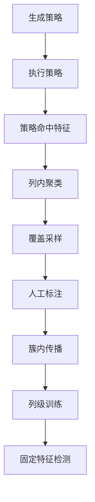
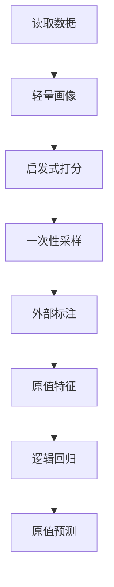

# Raha 原版检测模块功能对比与缺口分析

## 1. 文档目的

本文完整拆解 `F:/ai-code/raha/raha-master/raha/detection.py` 的功能模块和算法区块，并与当前工程 `src/main/java/com/fiberhome/ml/raha` 的实际实现进行逐项比较。

分析目标包括：

1. 说明原版 `detection.py` 每个代码区块承担的职责。
2. 判断当前工程是否完整实现、部分实现、采用替代实现或尚未实现。
3. 区分核心算法缺口、工程增强能力和已明确排除的能力。
4. 分析现有 toy 数据验收能够证明什么，以及不能证明什么。
5. 给出后续补齐顺序、建议模块和验收标准。

本文只进行源码和设计对比，不修改当前业务代码。

## 2. 总体结论

当前工程已经具备完整的工程业务闭环：可以读取数据、生成采样批次、接收标注、执行全量训练、执行增量训练、保存模型、加载模型、检测数据并把结果写入 ORC 表。

但是，从原版 `detection.py` 和当前概要设计要求的 Raha 核心算法语义看，当前工程仍缺少最关键的一条算法链路：

当前实际执行链路更接近：

因此，当前状态应准确表述为：

- 工程架构、数据库、接口、日志和部署闭环已经完成。
- 逻辑回归训练、模型版本和增量训练已经完成。
- 原版 Raha 的策略集成、策略特征、聚类主动采样和簇内标签传播尚未完整实现。
- 当前实现可以作为轻量化工程基础，但暂时不能认定为已经完成论文算法对齐。

## 3. 原版 `detection.py` 功能模块拆解

原版文件共约 776 行，核心功能集中在 `Detection` 类中。该类同时承担算法配置、策略运行、特征构建、聚类、主动采样、标注、标签传播、分类预测和结果保存职责。

| 源码位置 | 功能区块 | 核心职责 |
| --- | --- | --- |
| 第 51 至 84 行 | 依赖加载 | 加载数值计算、聚类、分类器、文本特征和外部检测工具 |
| 第 109 行 | 初始化配置 | 设置标注预算、采样模式、传播模式、分类器和策略族 |
| 第 136 行 | 单策略执行 | 执行 `OD`、`PVD`、`RVD`、`KBVD` 并输出候选单元格 |
| 第 218 行 | 数据集初始化 | 创建数据对象、结果目录和标注状态容器 |
| 第 260 行 | 策略生成与运行 | 枚举策略配置、并行执行、缓存结果或执行历史策略筛选 |
| 第 340 行 | 特征生成 | 把每个策略命中转换为列内二值特征，可追加文本特征 |
| 第 392 行 | 聚类构建 | 基于策略特征执行列内层次聚类，并生成多个聚类粒度 |
| 第 434 行 | 主动采样 | 按各列所属簇的标注覆盖缺口，为未标注元组计算抽样权重 |
| 第 477 行 | 真值标注 | 使用干净数据模拟用户对整条采样元组进行单元格标注 |
| 第 521 行 | 标签传播 | 按同质性或多数规则把直接标签传播到同簇单元格 |
| 第 603 行 | 分类预测 | 每列训练一个分类器并预测整列单元格 |
| 第 652 行 | 结果保存 | 保存完整检测数据对象，供后续分析和复用 |
| 第 670 行 | 总流程 | 串联全部步骤并返回疑似错误单元格 |

## 4. 初始化配置对比

### 4.1 原版配置

原版 `Detection.__init__` 提供以下配置：

| 配置 | 默认值 | 作用 |
| --- | --- | --- |
| `LABELING_BUDGET` | 20 | 最大标注元组数 |
| `USER_LABELING_ACCURACY` | 1.0 | 模拟人工标注准确率 |
| `VERBOSE` | 真 | 输出算法过程 |
| `SAVE_RESULTS` | 真 | 保存策略画像和检测对象 |
| `CLUSTERING_BASED_SAMPLING` | 真 | 使用聚类覆盖进行主动采样 |
| `STRATEGY_FILTERING` | 假 | 使用历史数据筛选策略 |
| `CLASSIFICATION_MODEL` | `GBC` | 选择最终分类器 |
| `LABEL_PROPAGATION_METHOD` | `homogeneity` | 选择标签传播规则 |
| `ERROR_DETECTION_ALGORITHMS` | `OD`、`PVD`、`RVD` | 选择基础检测策略族 |
| `HISTORICAL_DATASETS` | 空 | 配置历史参考数据集 |

### 4.2 当前工程配置

当前 `RahaConfig` 和 `raha-defaults.properties` 已实现：

- 默认标注预算和最大预算。
- 最大离散值字典数量。
- 随机种子配置。
- 逻辑回归迭代次数、正则参数和默认阈值。
- ORC 根路径、分区时区和算法版本。

当前未提供传播方式、策略数量上限、策略族开关、聚类参数和采样历史输入等算法配置。

分类器固定为 `LOGISTIC_REGRESSION` 是用户已经确认的设计，不应视为缺陷。原版的多分类器选择不需要首期迁移，只需要继续保留训练器和预测器接口。

`randomSeed` 当前只参与请求指纹和配置记录，实际采样算法没有使用随机数，因此该配置目前没有算法效果。

## 5. 单策略执行区块对比

### 5.1 原版 `OD`

原版调用 `dBoost`，为直方图检测生成 25 组参数，为高斯检测生成 9 组参数，共 34 组统计离群配置。每组配置独立输出候选错误单元格，并记录策略名称、命中结果和运行耗时。

### 5.2 原版 `PVD`

原版为每个字段中出现过的每个字符生成一项配置。某个值包含目标字符时，对应单元格被该策略命中。

这种实现本身不直接判断字符是对还是错，而是形成大量细粒度二值信号，后续由聚类和分类器学习哪些字符模式与错误相关。

### 5.3 原版 `RVD`

原版枚举所有不同字段的有向组合。若左字段的同一值映射到多个右字段值，则把冲突行的左右两个单元格都作为候选错误。

字段数为 `m` 时，原版最多生成 `m` 乘以 `m-1` 个有向关系配置。

### 5.4 原版 `KBVD`

原版可以调用 `KATARA` 知识库检测器。该能力默认未启用，当前概要设计也已将其列为范围外能力。

### 5.5 当前工程状态

当前 `StrategyPlanner` 每个目标字段只生成四项定义：

- `PVD/MISSING`
- `PVD/TYPE_FORMAT`
- `PVD/LENGTH`
- `OD/LOW_FREQUENCY`

这些定义只被写入 `StrategyPlan`，当前工程中不存在读取 `StrategyDefinition` 并产生策略命中结果的执行器。

源码搜索结果表明：

- 没有 `StrategyExecutor`。
- 没有 `StrategyHit` 或同等对象。
- 没有 `MISSING`、`TYPE_FORMAT`、`LENGTH`、`LOW_FREQUENCY` 的策略执行实现。
- 没有 `RVD` 策略定义和执行实现。
- 没有策略运行耗时、命中数量或失败摘要。

结论：策略计划目前只是元数据，尚未形成实际算法信号。这是当前最重要的核心缺口。

## 6. 策略生成、并行和缓存对比

### 6.1 原版实现

原版 `run_strategies` 负责：

1. 根据启用的策略族枚举全部配置。
2. 随机打乱配置顺序。
3. 使用多进程池并行运行策略。
4. 缓存每个策略的命中结果和耗时。
5. 再次运行同一数据集时直接加载缓存。
6. 可选地根据历史数据集画像和历史策略效果筛选策略。

### 6.2 当前工程实现

当前工程使用 `Spark`，不需要复制原版的本地多进程模型。策略执行应当转换为执行器端计算或受控的列聚合，这是合理的工程替代。

当前工程也不需要保存原版二进制缓存文件。模型集合已经可以保存策略计划，调用内中间结果可以使用数据集缓存或临时视图。

但是，使用 `Spark` 替代多进程不等于可以省略策略执行。目前既没有本地策略执行，也没有分布式策略执行。

历史数据集相似度驱动的策略过滤已经被概要设计明确列为范围外能力，不属于当前必须补齐项。

## 7. 特征生成区块对比

### 7.1 原版特征

原版对每个字段单独构建特征矩阵：

- 每一行对应当前字段的一个单元格。
- 每一列对应一个基础检测策略。
- 策略命中时取值为 1，否则取值为 0。
- 可选追加 `TFIDF` 文本特征。
- 删除全为相同值的无区分度特征。

这意味着原版分类器学习的是“哪些检测策略组合通常对应错误”，而不是直接记忆原始值。

### 7.2 当前特征

当前 `FeatureVectorizer` 构建以下特征：

- 是否为空。
- 是否为数字。
- 文本长度除以 100。
- 是否包含数字。
- 是否包含空白。
- 训练样本离散值独热特征。

当前特征完全来自原始值，没有包含任何策略命中信息。`StrategyPlan` 与 `FeatureVectorizer` 之间没有调用关系。

### 7.3 主要差异

| 能力 | 原版 | 当前工程 | 结论 |
| --- | --- | --- | --- |
| 单策略二值特征 | 有 | 无 | 缺失 |
| 策略族汇总特征 | 可由策略列形成 | 无 | 缺失 |
| 原始值形态特征 | 非核心 | 有 | 工程增强 |
| 原始值独热特征 | 无 | 有 | 当前主要特征 |
| 无区分度特征删除 | 有 | 无 | 缺失 |
| 文本词频特征 | 可选 | 无 | 范围外或后续增强 |
| 冻结特征字典 | 通过运行对象保留 | 模型表持久化 | 当前工程更适合生产 |

原始值独热特征容易在训练数据覆盖全部输入时形成记忆效果。遇到新值时，只剩五个形态特征，泛化能力取决于非常有限的格式信息。

## 8. 聚类区块对比

### 8.1 原版实现

原版对每个字段的策略特征矩阵执行层次聚类：

- 使用平均连接方法。
- 使用余弦距离。
- 为不同标注轮次预先生成多个聚类粒度。
- 聚类数量从 2 增加到标注预算加 1。
- 同时保存簇到单元格、单元格到簇的双向索引。

聚类不是展示用途，而是主动采样和标签传播的共同基础。

### 8.2 当前实现

当前存在 `ColumnClusterer` 接口和 `SimpleColumnClusterer` 实现。该实现按缺失、数字、长度桶和字符形状把规范值映射到稳定簇。

但是：

- `DefaultRahaFacade` 没有创建或注入 `SimpleColumnClusterer`。
- 采样服务、训练服务和检测服务均未调用 `ColumnClusterer`。
- 当前聚类输入是去重值集合，不是单元格策略特征向量。
- 当前结果只有值到簇的映射，没有列、行、聚类粒度和双向成员索引。
- 没有根据标注预算调整簇数量。

结论：聚类接口和简单实现已经存在，但目前是未接线代码，不能算作采样或标签传播功能已经实现。

## 9. 主动采样区块对比

### 9.1 原版实现

原版每轮只选择一条新元组。对每个未标注元组，遍历其所有字段所在的簇，并根据簇内已有标注数量计算覆盖缺口。位于多个低覆盖簇中的元组具有更高抽样概率。

用户每完成一条元组标注，下一轮都会重新计算簇覆盖和采样概率。这是原版主动学习的重要组成部分。

### 9.2 当前实现

当前 `TupleSampler` 一次性为全部候选行计算分数并取前 `budget` 条。分数由以下内容组成：

- 空值加分。
- 混合数字文本加分。
- 低频值加分。
- 多个目标字段的分数累加。

这种实现是确定性异常优先采样，不是基于聚类覆盖的主动采样。

### 9.3 当前缺口

1. 聚类结果未参与采样。
2. 既有标注数量未参与采样。
3. 既有采样批次未作为新采样请求的输入。
4. 相同请求会命中同一确定性批次，无法产生下一轮不同样本。
5. `randomSeed` 不参与实际抽样。
6. 没有显式排除以前已经标注的行。
7. 没有覆盖度、探索度或采样原因的细粒度证据。

当前概要设计允许把交互过程拆成多个独立调用，因此不需要恢复原版长时间内存会话。但是应增加以前一批次或多个既有批次为上下文的新采样方式，才能形成轻量化多轮主动采样。

## 10. 标注区块对比

### 10.1 原版实现

原版有干净数据时，会比较脏数据和干净数据，为当前采样元组的每个单元格生成零或一标签。`USER_LABELING_ACCURACY` 可以随机翻转部分标签，用于论文实验中的人工误标模拟。

无干净数据时，原版依赖交互界面由用户完成标注。

### 10.2 当前实现

当前工程把标注拆成外部业务步骤，标签写入 `dw.raha_cell_label`。训练时校验数据集、快照、行标识、字段和原值摘要。

这种设计比原版内存字典更适合生产，是正确的工程替代。

自动真值标注只存在于 `RahaToyUdfValidationMain` 中，用于回归测试，不进入生产接口。人工准确率模拟属于实验能力，不需要进入生产主链。

## 11. 标签传播区块对比

### 11.1 原版实现

原版先保留直接标签，再按当前聚类粒度处理每个字段的簇：

- `homogeneity`：簇内已标注样本全部一致时才传播。
- `majority`：按簇内多数标签传播。
- 传播范围是该字段同一簇中的全部单元格。
- 聚类来自策略特征，因此传播依据是检测信号相似性。

### 11.2 当前实现

当前 `TrainingDatasetBuilder` 实现了“规范值完全相同且直接标签无冲突时传播”：

- 直接标签权重使用重复行数量。
- 传播标签权重为直接标签权重的一半。
- 相同字段、相同规范值存在冲突时不传播。

该规则具备保守性，但与原版簇内传播不同。

### 11.3 实际效果限制

当前构建器只遍历已经采样的 `SampleTuple`。在正常标注流程中，采样元组的所有目标字段通常都会获得直接标签，因此同一批次内很少存在可被传播的未标注单元格。

当前训练过程没有把全量输入数据的单元格加入传播候选，也没有使用聚类结果。因此传播功能在标准全字段标注场景中基本不会扩大训练集。

结论：传播标签权重和冲突校验已经实现，但原版的列内簇传播语义尚未实现。

## 12. 分类预测区块对比

### 12.1 原版实现

原版按字段训练一个分类器，训练数据由直接标签和传播标签组成。默认使用梯度提升分类器，也支持多个实验分类器。

原版对特殊样本做如下处理：

- 全部训练标签为错误时，整列预测为错误。
- 没有错误样本或没有有效特征时，整列预测为正常。
- 其他情况训练配置的分类器并预测整列。

### 12.2 当前实现

当前工程按用户确认固定使用逻辑回归：

- 使用 `Spark ML` 训练列模型。
- 要求训练样本同时包含正常和错误两类。
- 单类别字段在全量训练时跳过。
- 增量训练遇到单类别时保留父列模型。
- 在训练样本上选择 F1 最优阈值。
- 模型系数、截距、阈值和特征字典写入模型表。
- 检测时转换为 `Spark` 列表达式执行，不收集全量输入到驱动进程。

这些工程实现比原版更适合分布式生产，也符合当前分类器设计要求。

### 12.3 核心问题

当前模型学习的是原始值形态和训练值独热特征，不是原版的策略命中特征。

模型集合虽然保存 `strategyPlanVersion` 和 `strategyPlanJson`，但检测过程没有解析和执行冻结策略计划。检测只根据原始字段值直接计算逻辑回归分数。

因此“检测复用训练时冻结策略计划”的设计要求目前只完成了元数据保存，没有完成算法重放。

## 13. 结果保存区块对比

### 13.1 原版实现

原版把完整 `Dataset` 对象序列化为二进制文件，其中包含策略画像、特征矩阵、聚类、标签和检测结果。

这种方式便于论文调试，但不适合跨语言查询、版本治理和分布式持久化。

### 13.2 当前实现

当前工程使用八张 `dw.raha_*` ORC 表保存采样批次、样本、标签、模型集合、列模型、训练样本、检测批次和检测结果。

模型和结果可以按批次与版本查询，持久化方式明显优于原版二进制对象。

当前没有长期保存策略逐项命中明细和聚类分配。按照轻量化设计，中间结果可以不单独建表，但必须在调用内实际生成，并把冻结特征定义和必要解释写入模型及检测结果。

## 14. 总流程对比

### 14.1 原版单次流程

原版 `run` 在一个进程内完成：

1. 初始化数据集。
2. 运行策略。
3. 生成策略特征。
4. 构建层次聚类。
5. 循环采样和标注。
6. 传播标签。
7. 训练并预测。
8. 保存结果。

### 14.2 当前三段式流程

当前工程拆分为：

1. `F_DW_RAHASAMPLE` 生成采样批次。
2. 外部系统写入单元格标签。
3. `F_DW_RAHATRAIN` 训练或增量训练模型。
4. `F_DW_RAHADETECT` 使用指定模型集合检测数据。

这种拆分符合轻量化工程要求，不需要恢复原版内存编排。但是每个业务用例内部仍应完成其负责的算法步骤。目前采样、训练和检测都没有执行策略特征链路。

## 15. 当前工程已经超越原版的能力

以下能力是当前工程的有效增强，不应为了源码对齐而删除：

1. 支持表、查询和 CSV 三种输入引用。
2. 支持稳定业务键、组合键和无主键内容分组。
3. 对完全相同记录进行内容分组并保留重复数量。
4. 使用数据快照、模式摘要和请求指纹保证契约一致性。
5. 使用确定性批次标识和模型版本。
6. 使用 ORC 表保存跨调用业务事实。
7. 支持多个采样批次训练。
8. 支持父模型集合和增量训练。
9. 冻结逻辑回归系数、阈值和特征字典。
10. 使用执行器端表达式完成批量预测。
11. 提供外部读写日志、核心流程日志和异常堆栈。
12. 支持指定目标字段和默认全部字段。

这些能力解决的是生产工程问题，与原版算法能力可以并存。

## 16. 与当前概要设计的符合性检查

当前概要设计第 2.2 节明确要求保留十项 Raha 语义。实际符合情况如下：

| 设计要求 | 当前状态 | 说明 |
| --- | --- | --- |
| 自动生成受限策略配置 | 部分符合 | 已生成四类定义，但没有 `RVD` 和数量控制 |
| 策略命中只作为特征 | 不符合 | 没有策略执行和策略命中特征 |
| 单元格形成策略特征向量 | 不符合 | 当前是原值形态和原值独热特征 |
| 特征、聚类、传播和模型按列处理 | 部分符合 | 模型按列，聚类未接入，传播不是簇传播 |
| 按元组采样并标注单元格 | 符合 | 已实现采样批次和单元格标签 |
| 只在同列同簇传播 | 不符合 | 当前按同列同值传播且范围仅限样本 |
| 每个可训练字段形成列模型 | 符合 | 已实现逻辑回归列模型 |
| 检测复用冻结计划和字典 | 部分符合 | 复用原值字典，不执行冻结策略计划 |
| 输出单元格、分数和原因 | 部分符合 | 有分数，原因只有分类器和阈值 |
| 增量训练生成新模型版本 | 符合 | 已实现不可变父子模型集合 |

概要设计第 3.1 节把 `OD`、`PVD`、`RVD`、策略特征、聚类采样和同质性传播列为范围内能力。当前这些部分尚未达到文档要求。

因此，之前 P0 至 P11 的“完成”更适合理解为工程阶段骨架和端到端通路完成，不能替代算法语义验收。

## 17. 现有 toy 实测的证明边界

现有 Docker 实测结果为精确率、召回率和 F1 均为 1.0，但测试条件存在以下限制：

1. toy 数据只有 7 行，标注预算为 20，因此第一次采样选中了全部 7 行。
2. 自动标注程序为所有采样行的全部目标字段生成了直接标签。
3. 训练数据和检测数据使用同一个 `dirty.csv`。
4. 特征字典包含训练样本中出现的原始值，模型能够学习这些值的独热特征。
5. 阈值在同一训练样本上按 F1 选择，没有独立验证集。
6. 增量采样仍然是同一份 7 行数据，只缩小到 `Kingdom` 字段。
7. 增量训练验证了父模型版本和重训路径，但没有验证真正新增行或新分布。
8. 当前测试没有把标注预算设置为小于数据行数。
9. 当前测试没有验证未标注单元格的标签传播效果。
10. 当前测试没有验证策略命中、聚类覆盖或主动采样收益。
11. 当前测试没有使用未见过的新输入数据验证模型泛化。

因此，这个结果能够证明：接口、数据库、标注、训练、模型保存、检测和评估链路可运行。

这个结果不能证明：Raha 策略集成算法已经实现，也不能证明模型对未标注数据或新数据具有同等效果。

## 18. 必须补齐的核心能力

### 18.1 第一优先级：策略执行和策略特征

建议在现有 `strategy` 包补充：

- `StrategyExecutor`：执行单个冻结策略定义。
- `StrategyExecutionService`：按稳定顺序执行策略计划。
- `StrategyHit`：保存行标识、字段、策略标识和可选分数。
- `StrategyExecutionResult`：保存命中摘要和耗时。

首期至少完成：

- `OD` 低频策略。
- `OD` 数值距离策略。
- `OD` 分位数距离策略。
- `PVD` 缺失和空占位策略。
- `PVD` 类型格式策略。
- `PVD` 长度异常策略。
- `PVD` 字符集合策略。
- `RVD` 一对多冲突策略。

不要求复制 `dBoost` 的所有参数组合，但替代算法必须输出稳定的逐单元格命中信号。

### 18.2 第一优先级：冻结特征构建

建议在现有 `feature` 包补充：

- `StrategyFeatureAssembler`：把策略命中转换为列内稀疏向量。
- `FeatureSchema`：冻结特征名称、编号、默认值和实现版本。
- `FeatureSelection`：删除无区分度特征并记录删除原因。

特征至少应包含：

- 单策略二值命中。
- 各策略族命中数量。
- 当前已有的值形态特征。
- 列内频率、长度距离和数值距离。
- `RVD` 冲突数量。

训练和检测必须使用同一套冻结策略计划和特征模式。

### 18.3 第一优先级：检测阶段策略重放

`RahaDetectService` 应从模型集合加载并解析 `strategyPlanJson`，对待检测快照重新执行相同策略，再按冻结特征模式生成向量。

当前基于原值独热的 `ModelScoreExpression` 只能作为特征表达式的一部分，不能继续作为完整 Raha 检测逻辑。

### 18.4 第一优先级：聚类实际接入

`ColumnClusterer` 应接收列内单元格特征，而不是简单值集合，并返回：

- 行标识到簇标识映射。
- 簇标识到成员集合映射。
- 聚类版本和算法参数。
- 空特征和单一模式的明确结果。

小数据和算法对齐测试应实现层次聚类。大数据可以增加确定性的近似实现，但两种实现必须共享接口和输出契约。

### 18.5 第一优先级：簇内标签传播

训练时应加载全量输入的特征和聚类结果，并执行同质性传播：

1. 直接标签权重保持最高。
2. 只有同列同簇直接标签完全一致时才传播。
3. 传播标签权重低于直接标签。
4. 直接标签永远覆盖传播标签。
5. 存在冲突的簇不传播。
6. 传播范围包含未采样的全量输入单元格。

多数传播可以只保留扩展接口，不必首期启用。

### 18.6 第一优先级：聚类覆盖采样

采样服务应使用聚类覆盖度选择元组，而不是只按异常程度排序。

为保持轻量调用，可以在 `SampleRequest` 中增加可选的既有采样批次列表。新调用读取既有直接标签和簇覆盖，排除已采样行后生成下一批次，不需要引入任务状态机。

## 19. 第二优先级增强

完成核心链路后，建议补充：

1. 丰富列画像，包括频率摘要、长度分布、数值分位数、字符集合和类型解析比例。
2. 为策略数量和 `RVD` 字段对数量设置上限。
3. 让 `randomSeed` 真正参与同分候选抽样或移除该配置。
4. 检测原因写入主要命中策略、策略族汇总、阈值和模型版本。
5. 训练摘要记录直接样本数、传播样本数、冲突簇数和有效特征数。
6. 校正列画像中平均长度未按重复数量加权的问题。
7. 让 `TrainResult` 明确区分请求字段和实际成功训练字段。
8. 对策略执行、特征构建、聚类、采样和检测增加独立耗时日志。

## 20. 当前不需要补齐的原版能力

以下能力在原版存在，但已被当前需求明确排除或可由现有工程方式替代：

| 原版能力 | 处理建议 | 原因 |
| --- | --- | --- |
| 多种分类器切换 | 不迁移 | 当前固定逻辑回归并保留扩展接口 |
| 历史数据策略过滤 | 不迁移 | 当前概要设计明确列为范围外 |
| `KBVD` 和 `KATARA` | 不迁移 | 知识库版本和字段映射未确定 |
| 人工准确率随机模拟 | 仅测试可选 | 属于论文实验能力 |
| 二进制对象保存 | 不迁移 | 已由 ORC 业务表和模型版本替代 |
| 本地多进程池 | 不迁移 | 当前使用 `Spark` 分布式执行 |
| 长时间交互式内存会话 | 不迁移 | 当前拆为采样、标注、训练调用 |
| 生产流程自动真值标注 | 不迁移 | 真值只应用于测试和评估 |
| `TFIDF` 文本特征 | 后续评估 | 原版默认策略也未启用该项 |

## 21. 建议测试矩阵

### 21.1 策略单元测试

- 每种 `OD` 策略验证命中和不命中边界。
- 每种 `PVD` 策略验证空值、字符、类型和长度边界。
- `RVD` 验证一对一、一对多、空值和重复行。
- 策略计划顺序和策略标识必须确定。

### 21.2 特征测试

- 单策略命中正确映射到特征编号。
- 无命中特征默认值正确。
- 无区分度特征被删除。
- 训练和检测的特征编号完全一致。
- 未见值不会改变字典维度。

### 21.3 聚类和采样测试

- 相同策略模式进入同簇。
- 不同模式在预算允许时分离。
- 已覆盖簇的采样概率下降。
- 已采样行不会再次出现。
- 相同种子和输入产生相同批次。
- 标注预算小于总行数时只选择预算数量。

### 21.4 标签传播测试

- 同质簇传播正常标签。
- 同质簇传播错误标签。
- 冲突簇不传播。
- 直接标签覆盖传播标签。
- 未采样的全量单元格能够得到传播标签。
- 传播样本权重低于直接样本。

### 21.5 端到端对齐测试

- 使用与原版相同的小数据和固定种子。
- 标注预算必须小于总行数。
- 训练输入和检测输入至少包含一组未见数据。
- 分别记录策略数量、有效特征数、簇数量、直接标签数和传播标签数。
- 比较原版和当前工程在相同直接标签下的检测集合。
- 增量批次必须包含新行或新标签，不能重复使用同一批数据证明增量效果。
- 评估指标必须包含训练内指标和独立检测指标。

当前测试目录没有策略执行、聚类、采样服务、训练服务和检测服务的专项测试。补齐核心算法时必须同步增加这些测试，不能只依赖 toy 全链路结果。

## 22. 建议实施顺序

| 顺序 | 工作项 | 完成标准 |
| --- | --- | --- |
| 1 | 策略执行器和 `OD`、`PVD`、`RVD` | 能输出稳定逐单元格命中 |
| 2 | 策略特征组装和冻结模式 | 训练与检测特征完全一致 |
| 3 | 层次聚类和轻量近似接口 | 能输出列内双向簇索引 |
| 4 | 聚类覆盖采样 | 小预算时优先覆盖未标注模式 |
| 5 | 同质性标签传播 | 未采样单元格能够形成低权重训练样本 |
| 6 | 训练服务接入完整特征 | 模型不再主要依赖原值记忆 |
| 7 | 检测服务重放冻结策略 | 新快照可以复现训练特征语义 |
| 8 | 原因解释和算法指标 | 检测结果可追溯主要策略证据 |
| 9 | 原版对齐和独立数据测试 | 小预算、未见数据下指标可验证 |

## 23. 最终判断

从工程建设角度看，当前项目已经形成清晰的采样、训练、检测边界，并完成 ORC 持久化、逻辑回归、模型版本、增量训练和容器部署，这些工作可以保留。

从 `detection.py` 功能完整性看，当前项目尚缺策略执行、策略命中特征、层次聚类接入、聚类覆盖采样、全量簇内标签传播和检测阶段策略重放。这些不是可选优化，而是 Raha 区别于普通字段异常分类器的核心模块。

建议把当前版本定义为“Raha 轻量化工程闭环基线”，不要定义为“Raha 算法完整实现版”。完成第 18 节的第一优先级能力，并通过第 21 节的小预算和未见数据测试后，才能认定当前工程在保留轻量化边界的同时基本完成原版检测算法对齐。
