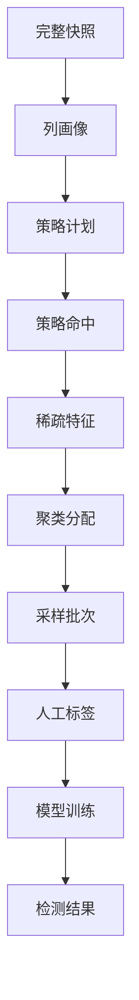
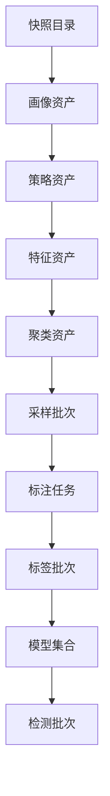
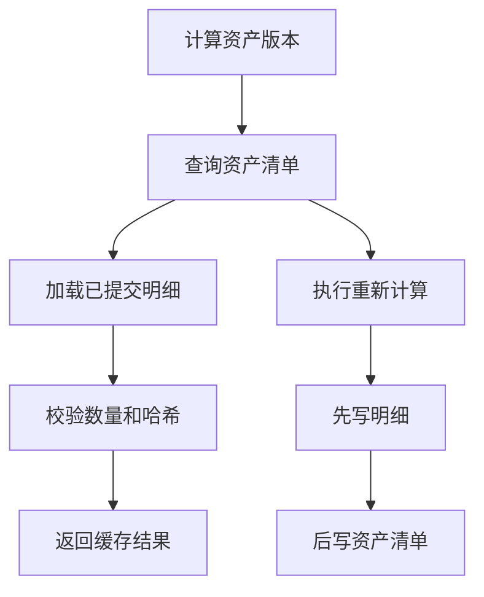

# Raha 完整快照与特征持久化数据库设计

## 一、设计结论

根据当前工程实现、完整快照要求和训练性能要求，推荐采用以下方案：

1. 采样或直接训练开始时，必须保存完整输入快照，而不是只保存采样选中的元组。
2. 完整快照必须保留原始字段类型，并以原生列式格式保存；不能只把全量数据写成 `row_data_json`。
3. `ColumnProfiler` 生成的列画像必须持久化，并按快照和画像算法版本复用。
4. 为明显提升采样后训练性能，除列画像外，还应保存策略计划、可选的策略命中、特征字典、单元格稀疏特征和聚类分配。
5. 训练阶段优先读取采样阶段已经生成的特征和聚类结果，不重新扫描完整快照；只有版本不匹配或缓存不存在时才重新计算。
6. 人工直接标签必须长期保存；传播标签不应混入人工标签表，模型最终使用的传播结果应固化到训练样本表。
7. 模型、模型实际使用的训练样本和检测结果属于长期业务事实，必须保存。
8. 作业、阶段和检查点属于运行控制数据，生产环境建议保存，但应使用短保留周期，并与长期业务表分开管理。
9. 当前 `repository` 包中的默认适配器主要建立在 `InMemoryRahaRepository` 上，进程结束后数据会丢失，不能直接视为数据库持久化实现。
10. 不建议为 `RepositoryNamespace` 建一张通用大宽表或通用载荷表。生产数据库应按业务对象建立明确表结构。

推荐的数据分层如下：

| 数据层 | 主要内容 | 保存目的 | 推荐保留策略 |
| --- | --- | --- | --- |
| 完整快照层 | 快照目录、字段模式、原生列式快照数据 | 重现采样和训练输入 | 被采样、标签或模型引用期间保留 |
| 算法资产层 | 列画像、策略、特征、聚类 | 跨采样和训练调用复用 | 按版本和依赖引用保留 |
| 业务事实层 | 采样、标注、模型、训练样本、检测结果 | 业务查询、审计、增量训练 | 按业务生命周期保留 |
| 运行控制层 | 作业、阶段、尝试和检查点 | 幂等、重试、排障 | 短期保留 |

## 二、完整快照为什么必须单独设计

### 2.1 两千行原始数据和一百条标签的实际含义

假设输入原始数据有两千行，采样阶段选出一百行进行人工标注：

```text
完整原始快照：2000 行
采样元组：100 行
人工标签：100 行中的若干单元格
```

如果只保存 `raha_sample_tuple.row_data_json`，数据库只能恢复这一百条采样行，无法恢复另外一千九百条未采样行。

保存完整快照以后，训练阶段可以同时获得：

- 原始两千行数据。
- 采样阶段的一百条人工标签。
- 两千行对应的列画像。
- 两千行对应的单元格稀疏特征。
- 两千行对应的聚类分配。

因此训练阶段可以把一百条人工标签通过聚类关系传播到其他相似单元格，并使用完整特征上下文训练模型。

### 2.2 完整快照不能只保存为 JSON 行表

如果把两千行完整数据全部保存成下面的固定结构：

```text
snapshot_id
row_id
row_data_json
```

虽然可以恢复数据内容，但训练时存在以下问题：

- 每次都需要解析 JSON。
- 原始字段类型需要从模式重新转换。
- Spark 无法有效执行原生列裁剪。
- 数值聚合、分位数和关系策略执行性能较差。
- 不同数据集字段差异会全部压入一个大字符串字段。

因此推荐把完整快照数据保存为带原始字段类型的 ORC 列式文件，并由固定的快照目录表记录存储路径和模式信息。

### 2.3 快照数据的推荐物理结构

每个快照的数据文件保留全部原始字段，并增加以下技术字段：

| 技术字段 | 类型 | 用途 |
| --- | --- | --- |
| `raha_row_id` | `STRING` | 快照内稳定且唯一的行标识 |
| `raha_row_sequence` | `BIGINT` | 快照固化时的行序号 |
| `raha_content_hash` | `STRING` | 规范化整行内容哈希，用于识别相同行 |

推荐存储路径示例：

```text
/fmdb/raha/snapshot_data/dataset_id=orders/snapshot_id=snap_orders_20260718_001/
```

该目录中的 ORC 文件包含技术字段和全部原始业务字段。`dw.raha_dataset_snapshot` 只保存快照目录和元数据，不复制全量业务字段。

### 2.4 没有业务主键时的行标识规则

推荐只把以下两种模式定义为真正的行身份模式：

| 模式 | 生成方式 | 适用情况 |
| --- | --- | --- |
| `SOURCE_KEY` | 对用户提供的一个或多个业务键规范化后生成 | 输入存在稳定业务键 |
| `SNAPSHOT_SEQUENCE` | 快照写入时生成唯一序号并永久固化 | 输入没有稳定业务键 |

相同内容分组不再作为行身份模式，而作为采样和聚类中的分组规则。原因是两条内容完全相同的物理行仍然需要两个不同的 `raha_row_id`，否则无法满足 `RowIdValidator` 的唯一性要求。

没有主键时，可以生成如下行标识：

```text
snap_orders_20260718_001:0000000001
snap_orders_20260718_001:0000000002
snap_orders_20260718_001:0000000003
```

这里的序号只能在快照第一次写入时生成并保存。后续采样、标注和训练必须读取已经保存的 `raha_row_id`，不能重新让 Spark 临时编号。

## 三、`ColumnProfiler` 结果及保存价值

### 3.1 当前代码生成的列画像

`ColumnProfiler` 对每个字段生成一个 `ColumnProfile`，主要包含以下内容：

| 画像类别 | 字段 |
| --- | --- |
| 基础数量 | `totalCount`、`nullCount`、`blankCount`、`distinctCount` |
| 长度统计 | `minLength`、`maxLength`、`averageLength` |
| 数值识别 | `numericCount`、`numericRatio` |
| 数值区间 | `numericMin`、`numericMax`、`numericMean`、`numericStandardDeviation` |
| 数值分位数 | `numericQ1`、`numericMedian`、`numericQ3` |
| 类型计数 | `NULL`、`BLANK`、`INTEGER`、`DECIMAL`、`LETTER`、`ALPHANUMERIC`、`MIXED` 等 |
| 高频值摘要 | 非空值的 SHA-256 哈希和出现次数 |

这些画像不是模型最终的单元格特征向量，但它们是策略生成和特征构造的重要上游输入。

### 3.2 当前代码中的实际使用位置

列画像当前被以下模块使用：

- `StrategyPlanGenerator` 根据数值比例、均值、标准差和四分位数生成异常检测策略。
- `FeatureAssembler` 使用字段总数计算稀有值阈值和频率比例特征。
- `StrategyExecutor` 和 `RvdBatchStrategyExecutor` 使用列画像辅助策略执行。
- `RahaDataset.withProfiles` 把画像绑定到当前快照，供后续阶段统一使用。

### 3.3 保存列画像的性能收益

`ColumnProfiler` 会执行 Spark 聚合、去重计数、标准差、近似分位数和高频值分组。对大数据集重复执行的成本明显，因此列画像应保存并复用。

画像缓存命中必须同时满足：

```text
snapshot_id 相同
schema_hash 相同
profiler_version 相同
profile_config_version 相同
```

如果只是训练配置变化，而快照、画像算法和画像配置没有变化，列画像仍然可以复用。

### 3.4 只保存列画像还不够

保存列画像只能避免重新执行列级聚合。当前训练工作流还会执行策略、特征组装和聚类。

为了让采样后的训练真正获得明显性能提升，建议同时保存：

- 策略计划。
- 单元格策略命中，按需要保留。
- 特征字典。
- 单元格稀疏特征。
- 列级聚类结果。
- 单元格聚类分配。

其中，稀疏特征和聚类分配对训练性能最关键。

## 四、当前 `repository` 包持久化必要性分析

### 4.1 总体判断

当前 `repository` 包定义了统一仓储接口和多个领域仓储适配器，但默认底层实现是 `InMemoryRahaRepository`。它适合单元测试和单进程执行，不具备以下能力：

- 进程重启后恢复。
- 采样调用和训练调用之间共享数据。
- 多实例并发读取和写入。
- 长期保存标签、模型和检测结果。
- 通过数据库分区处理大规模单元格特征。

生产环境需要新增 FMDB 持久化适配器，但不应把所有对象序列化到一张通用表中。

当前工程中的 `FmdbModelStore` 已经能够保存列模型载荷和特征字典，`SparkSqlFmdbResultWriter` 能够写入部分任务和检测结果，但它们没有覆盖 `RepositoryNamespace` 中的完整对象集合，也没有实现完整快照、画像、稀疏特征和聚类分配的跨调用复用。

### 4.2 各仓储接口判断

| 仓储接口 | 当前保存内容 | 是否需要落库 | 推荐处理 |
| --- | --- | --- | --- |
| `JobRepository` | 作业状态和幂等键 | 需要，短期 | 保存到 `raha_job_run`，用于幂等、状态查询和排障 |
| `StageRepository` | 阶段状态和尝试 | 需要，短期 | 保存到 `raha_job_stage_attempt` |
| `StageCheckpointRepository` | 输入指纹、输出位置和检查点 | 条件需要 | 与阶段尝试表合并，不单独建表 |
| `ColumnProfileRepository` | 列画像 | 必须 | 保存到 `raha_column_profile`，按画像版本复用 |
| `StrategyRepository` | 策略计划、命中和摘要 | 部分必须 | 计划长期保存；命中按训练缓存周期保存；摘要放入资产清单 |
| `FeatureRepository` | 特征字典和稀疏特征 | 必须 | 分别保存到字典表和稀疏特征表 |
| `ClusterRepository` | 列聚类结果和成员分配 | 必须 | 标签传播和采样跨调用时必须保存 |
| `AnnotationTaskRepository` | 待标注任务和状态 | 必须 | 人工标注是异步流程，必须保存 |
| `CellLabelRepository` | 直接标签、传播标签和传播摘要 | 拆分处理 | 直接标签长期保存；传播结果不进入直接标签表 |
| `ModelMetadataRepository` | 列模型元数据和发布状态 | 必须 | 保存模型集合和列模型 |
| `DetectionResultRepository` | 单元格检测结果 | 业务需要时必须 | 保存检测批次和检测结果 |

### 4.3 `RepositoryNamespace` 到物理表的推荐映射

| 命名空间 | 推荐物理表 | 保存级别 | 说明 |
| --- | --- | --- | --- |
| `JOB` | `dw.raha_job_run` | 短期必须 | 支撑幂等和作业状态查询 |
| `STAGE` | `dw.raha_job_stage_attempt` | 短期必须 | 保存阶段状态和尝试 |
| `STAGE_CHECKPOINT` | `dw.raha_job_stage_attempt` | 条件必须 | 与阶段尝试合并 |
| `COLUMN_PROFILE` | `dw.raha_column_profile` | 长期必须 | 按快照和画像版本复用 |
| `STRATEGY_PLAN` | `dw.raha_strategy_plan` | 长期必须 | 被模型引用的冻结策略 |
| `STRATEGY_HIT` | `dw.raha_strategy_hit` | 条件保存 | 特征生成和解释缓存 |
| `STRATEGY_RUN_SUMMARY` | `dw.raha_artifact_manifest` | 必须保存摘要 | 写入 `summary_json` |
| `FEATURE_DICTIONARY` | `dw.raha_feature_dictionary` | 长期必须 | 模型加载必需 |
| `SPARSE_FEATURE` | `dw.raha_sparse_feature` | 训练期必须 | 训练性能优化核心数据 |
| `CLUSTER_ASSIGNMENT` | `dw.raha_cluster_assignment` | 训练期必须 | 采样和标签传播依赖 |
| `CLUSTER_RUN_SUMMARY` | `dw.raha_cluster_result` | 必须 | 保存列聚类版本和状态 |
| `ANNOTATION_TASK` | `dw.raha_annotation_task` | 业务必须 | 人工标注异步状态 |
| `CELL_LABEL` | `dw.raha_cell_label` | 长期必须 | 只长期保存直接标签 |
| `LABEL_PROPAGATION_SUMMARY` | `dw.raha_artifact_manifest` | 短期摘要 | 不建立永久传播标签表 |
| `COLUMN_MODEL` | `dw.raha_model_set`、`dw.raha_column_model` | 长期必须 | 保存集合契约和列模型 |
| `DETECTION_RESULT` | `dw.raha_detection_batch`、`dw.raha_detection_result` | 按业务保存 | 保存检测提交头和明细 |

`RahaRepository`、`RepositoryKey`、`RepositoryRecord` 和 `ArtifactVersion` 是代码层统一抽象，不对应一张名为 `raha_repository_record` 的物理表。

### 4.4 不建议逐接口机械建表

以下代码接口可以共享物理表：

- `StageRepository` 和 `StageCheckpointRepository` 共同使用 `dw.raha_job_stage_attempt`。
- 策略、特征和聚类的运行摘要共同使用 `dw.raha_artifact_manifest.summary_json`。
- `CellLabelRepository` 中的传播摘要可以进入资产清单摘要，不需要单独建永久表。

以下对象必须拆成不同物理表：

- 特征字典和单元格稀疏特征的数据规模完全不同，必须分表。
- 聚类摘要和单元格聚类分配的数据规模完全不同，必须分表。
- 人工直接标签和传播标签的可信来源不同，不能混在同一长期事实表中。
- 任务运行状态和模型、标签等业务事实的保留周期不同，不能混表。

### 4.5 当前仓储键不适合跨作业复用

当前多个适配器使用 `jobId` 作为分区键，例如：

- `DefaultFeatureRepository` 按 `jobId + columnName` 保存稀疏特征。
- `DefaultClusterRepository` 按 `jobId + columnName + clusterVersion` 保存聚类分配。
- `DefaultStrategyRepository` 按 `jobId` 保存策略命中。

采样作业和训练作业通常具有不同的 `jobId`。即使它们使用同一个快照和完全相同的配置，训练作业也无法按当前键直接读取采样作业生成的特征。

生产数据库应使用语义版本作为复用键：

```text
profile_version
strategy_plan_version
strategy_run_version
feature_set_version
cluster_set_version
```

`job_id` 只作为产物来源审计字段，不作为算法资产的唯一复用键。

## 五、推荐的版本依赖关系

### 5.1 版本链路



### 5.2 推荐版本生成规则

| 版本 | 推荐输入 |
| --- | --- |
| `profile_version` | `snapshot_id + profiler_version + profile_config_version` |
| `strategy_plan_version` | `snapshot_id + profile_version + strategy_config_version + target_columns` |
| `strategy_run_version` | `snapshot_id + strategy_plan_version + strategy_executor_version` |
| `feature_set_version` | `snapshot_id + strategy_run_version + feature_config_version + assembler_version` |
| `cluster_set_version` | `feature_set_version + clustering_config_version + cluster_algorithm_version` |
| `sampling_version` | `cluster_set_version + sampling_config_version + exclusion_fingerprint` |
| `model_set_version` | `training_snapshot_id + label_batch_versions + feature_set_version + training_config_version` |

所有版本都应对规范化后的输入使用 SHA-256 计算。列表字段必须排序，数字和布尔值必须使用固定格式，避免相同配置生成不同版本。

### 5.3 缓存命中规则

训练阶段不能只按 `snapshot_id` 判断缓存可用，还必须校验所有上游版本。

| 资产 | 可以复用的条件 | 失效示例 |
| --- | --- | --- |
| 列画像 | 快照、画像算法和画像配置相同 | 分位数精度配置变化 |
| 策略计划 | 画像版本、策略配置和目标字段相同 | 新增策略类型 |
| 策略命中 | 快照和策略计划版本相同 | 策略阈值变化 |
| 稀疏特征 | 快照、策略命中和特征配置相同 | 归一化规则变化 |
| 聚类分配 | 特征集合和聚类配置相同 | 聚类数或随机种子变化 |

## 六、推荐表清单

### 6.1 完整快照层

| 表或存储对象 | 用途 | 逻辑主键 |
| --- | --- | --- |
| `dw.raha_dataset_snapshot` | 完整快照目录和提交头 | `snapshot_id` |
| `dw.raha_dataset_snapshot_column` | 快照字段模式和检测属性 | `snapshot_id, column_name` |
| 原生快照数据目录 | 保存完整原始数据和技术行标识 | `snapshot_id, raha_row_id` |

### 6.2 算法资产层

| 表名 | 用途 | 逻辑主键 |
| --- | --- | --- |
| `dw.raha_artifact_manifest` | 算法资产提交头、版本和血缘 | `artifact_version` |
| `dw.raha_column_profile` | `ColumnProfiler` 列画像 | `profile_version, column_name` |
| `dw.raha_strategy_plan` | 冻结策略计划 | `strategy_plan_version, strategy_id` |
| `dw.raha_strategy_hit` | 单元格策略命中缓存 | `strategy_run_version, strategy_id, cell_id, reason_code` |
| `dw.raha_feature_dictionary` | 特征字典定义 | `dictionary_version, feature_index` |
| `dw.raha_sparse_feature` | 单元格稀疏特征缓存 | `feature_set_version, cell_id` |
| `dw.raha_cluster_result` | 列级聚类摘要 | `cluster_set_version, column_name` |
| `dw.raha_cluster_assignment` | 单元格聚类分配 | `cluster_set_version, cell_id` |

### 6.3 业务事实层

| 表名 | 用途 | 逻辑主键 |
| --- | --- | --- |
| `dw.raha_sample_batch` | 采样批次提交头 | `sample_batch_id` |
| `dw.raha_sample_tuple` | 采样选中的待标注元组 | `sample_batch_id, representative_row_id` |
| `dw.raha_annotation_task` | 人工标注任务状态 | `annotation_task_id` |
| `dw.raha_label_batch` | 一批人工或导入标签的提交头 | `label_batch_id` |
| `dw.raha_cell_label` | 人工直接单元格标签事件 | `label_id` |
| `dw.raha_model_set` | 完整模型集合和发布状态 | `model_set_version` |
| `dw.raha_model_label_batch` | 模型集合使用的标签批次 | `model_set_version, label_batch_id` |
| `dw.raha_column_model` | 模型集合中的列模型 | `model_set_version, column_name` |
| `dw.raha_training_example` | 模型实际使用的训练样本 | `model_set_version, column_name, cell_id` |
| `dw.raha_detection_batch` | 检测批次提交头 | `detection_batch_id` |
| `dw.raha_detection_result` | 单元格检测结果 | `detection_batch_id, cell_id` |

### 6.4 运行控制层

| 表名 | 用途 | 逻辑主键 |
| --- | --- | --- |
| `dw.raha_job_run` | 作业状态和幂等控制 | `job_id` |
| `dw.raha_job_stage_attempt` | 阶段、尝试和检查点 | `job_id, stage_type, attempt_id` |

## 七、完整表结构

### 7.1 `dw.raha_dataset_snapshot`

该表是完整快照的提交头。原生快照数据和字段模式完整写入后，最后写入该表。读取方只读取已经存在提交头的快照。

| 字段 | 类型 | 必填 | 说明 |
| --- | --- | --- | --- |
| `snapshot_id` | `STRING` | 是 | 不可变快照标识 |
| `dataset_id` | `STRING` | 是 | 逻辑数据集标识 |
| `snapshot_purpose` | `STRING` | 是 | `SAMPLING`、`TRAINING` 或 `DETECTION` |
| `request_fingerprint` | `STRING` | 是 | 规范化加载请求指纹 |
| `input_reference` | `STRING` | 是 | 原始文件、表或查询引用 |
| `source_type` | `STRING` | 是 | `FILE`、`TABLE` 或 `SQL` |
| `source_version` | `STRING` | 否 | 上游版本、分区或时间戳 |
| `row_identity_mode` | `STRING` | 是 | `SOURCE_KEY` 或 `SNAPSHOT_SEQUENCE` |
| `row_key_columns_json` | `STRING` | 否 | 业务键字段列表 |
| `row_id_column` | `STRING` | 是 | 原生快照中的行标识字段，固定为 `raha_row_id` |
| `schema_hash` | `STRING` | 是 | 原始字段模式哈希 |
| `content_fingerprint` | `STRING` | 是 | 完整输入内容或上游稳定版本摘要 |
| `row_count` | `BIGINT` | 是 | 快照物理行数 |
| `column_count` | `INT` | 是 | 原始业务字段数 |
| `storage_format` | `STRING` | 是 | 首期固定为 `ORC` |
| `storage_path` | `STRING` | 是 | 原生快照数据目录 |
| `snapshot_table_name` | `STRING` | 否 | 已注册外部表时记录表名 |
| `created_by_job_id` | `STRING` | 是 | 创建快照的作业 |
| `created_at` | `BIGINT` | 是 | 快照提交时间 |
| `expires_at` | `BIGINT` | 否 | 可清理时间，存在依赖时不得清理 |

### 7.2 `dw.raha_dataset_snapshot_column`

| 字段 | 类型 | 必填 | 说明 |
| --- | --- | --- | --- |
| `snapshot_id` | `STRING` | 是 | 所属完整快照 |
| `dataset_id` | `STRING` | 是 | 冗余数据集标识 |
| `column_name` | `STRING` | 是 | 字段名称 |
| `ordinal` | `INT` | 是 | 字段顺序，从零开始 |
| `data_type` | `STRING` | 是 | Spark 字段类型 |
| `nullable` | `BOOLEAN` | 是 | 是否允许空值 |
| `detectable` | `BOOLEAN` | 是 | 是否参与策略和模型检测 |
| `sensitive` | `BOOLEAN` | 是 | 是否属于敏感字段 |
| `column_role` | `STRING` | 是 | `BUSINESS` 或 `TECHNICAL` |
| `created_at` | `BIGINT` | 是 | 快照提交时间 |

### 7.3 原生快照数据目录

原生快照不是一张固定字段的共享表，因为不同数据集的业务字段完全不同。每个快照目录保留原始模式。

必须包含：

| 字段 | 类型 | 说明 |
| --- | --- | --- |
| `raha_row_id` | `STRING` | 快照内唯一行标识 |
| `raha_row_sequence` | `BIGINT` | 固化行序号 |
| `raha_content_hash` | `STRING` | 规范化整行内容哈希 |
| 原始业务字段 | 原始类型 | 保留输入字段名称和类型 |

不得把 `raha_row_sequence` 作为跨快照业务主键。它只在同一个 `snapshot_id` 内稳定。

### 7.4 `dw.raha_artifact_manifest`

该表是画像、策略、特征和聚类等算法资产的统一提交头。明细写完后最后写入清单记录。

| 字段 | 类型 | 必填 | 说明 |
| --- | --- | --- | --- |
| `artifact_version` | `STRING` | 是 | 不可变算法资产版本 |
| `artifact_type` | `STRING` | 是 | `PROFILE`、`STRATEGY_PLAN`、`STRATEGY_RUN`、`FEATURE_SET` 或 `CLUSTER_SET` |
| `dataset_id` | `STRING` | 是 | 数据集标识 |
| `snapshot_id` | `STRING` | 是 | 依赖的完整快照 |
| `schema_hash` | `STRING` | 是 | 输入模式哈希 |
| `config_version` | `STRING` | 是 | 当前资产配置版本 |
| `algorithm_version` | `STRING` | 是 | 当前算法实现版本 |
| `parent_versions_json` | `STRING` | 是 | 上游资产版本列表 |
| `record_count` | `BIGINT` | 是 | 明细记录数 |
| `storage_table` | `STRING` | 是 | 主要明细表名称 |
| `summary_json` | `STRING` | 是 | 运行指标和异常摘要 |
| `created_by_job_id` | `STRING` | 是 | 首次生成资产的作业 |
| `created_at` | `BIGINT` | 是 | 资产提交时间 |
| `expires_at` | `BIGINT` | 否 | 可清理时间 |

同一个 `artifact_version` 已存在时，内容必须完全一致，禁止覆盖成其他结果。

### 7.5 `dw.raha_column_profile`

| 字段 | 类型 | 必填 | 说明 |
| --- | --- | --- | --- |
| `profile_version` | `STRING` | 是 | 对应 `PROFILE` 资产版本 |
| `dataset_id` | `STRING` | 是 | 数据集标识 |
| `snapshot_id` | `STRING` | 是 | 输入快照 |
| `column_name` | `STRING` | 是 | 字段名称 |
| `total_count` | `BIGINT` | 是 | 总单元格数 |
| `null_count` | `BIGINT` | 是 | 空值数量 |
| `blank_count` | `BIGINT` | 是 | 空白文本数量 |
| `distinct_count` | `BIGINT` | 是 | 不同值数量 |
| `min_length` | `INT` | 是 | 最小长度，无值时为负一 |
| `max_length` | `INT` | 是 | 最大长度，无值时为负一 |
| `average_length` | `DOUBLE` | 是 | 平均长度 |
| `numeric_count` | `BIGINT` | 是 | 可解析数值数量 |
| `numeric_ratio` | `DOUBLE` | 是 | 数值占非空值比例 |
| `numeric_min` | `DOUBLE` | 否 | 数值最小值 |
| `numeric_max` | `DOUBLE` | 否 | 数值最大值 |
| `numeric_mean` | `DOUBLE` | 否 | 数值平均值 |
| `numeric_stddev` | `DOUBLE` | 否 | 数值总体标准差 |
| `numeric_q1` | `DOUBLE` | 否 | 第一四分位数 |
| `numeric_median` | `DOUBLE` | 否 | 中位数 |
| `numeric_q3` | `DOUBLE` | 否 | 第三四分位数 |
| `type_counts_json` | `STRING` | 是 | 类型计数映射 |
| `value_hash_frequencies_json` | `STRING` | 是 | 高频值哈希和出现次数 |
| `created_at` | `BIGINT` | 是 | 画像生成时间 |

`value_hash_frequencies_json` 只能保存值哈希，禁止保存敏感字段原始高频值。

### 7.6 `dw.raha_strategy_plan`

| 字段 | 类型 | 必填 | 说明 |
| --- | --- | --- | --- |
| `strategy_plan_version` | `STRING` | 是 | 策略计划资产版本 |
| `dataset_id` | `STRING` | 是 | 数据集标识 |
| `snapshot_id` | `STRING` | 是 | 输入快照 |
| `profile_version` | `STRING` | 是 | 依赖的画像版本 |
| `strategy_id` | `STRING` | 是 | 策略稳定标识 |
| `strategy_family` | `STRING` | 是 | `OD`、`PVD` 或 `RVD` |
| `target_columns_json` | `STRING` | 是 | 目标字段列表 |
| `configuration_json` | `STRING` | 是 | 完整策略参数 |
| `configuration_hash` | `STRING` | 是 | 策略参数哈希 |
| `priority` | `INT` | 是 | 执行优先级 |
| `status` | `STRING` | 是 | 计划状态 |
| `created_at` | `BIGINT` | 是 | 计划生成时间 |

模型集合应引用该表中的冻结计划版本，检测时不得重新生成不同策略计划。

### 7.7 `dw.raha_strategy_hit`

| 字段 | 类型 | 必填 | 说明 |
| --- | --- | --- | --- |
| `strategy_run_version` | `STRING` | 是 | 策略执行资产版本 |
| `strategy_plan_version` | `STRING` | 是 | 依赖的策略计划版本 |
| `dataset_id` | `STRING` | 是 | 数据集标识 |
| `snapshot_id` | `STRING` | 是 | 输入快照 |
| `strategy_id` | `STRING` | 是 | 命中策略 |
| `strategy_family` | `STRING` | 是 | 策略家族 |
| `cell_id` | `STRING` | 是 | 稳定单元格标识 |
| `row_id` | `STRING` | 是 | 快照行标识 |
| `column_name` | `STRING` | 是 | 字段名称 |
| `value_hash` | `STRING` | 是 | 输入值哈希 |
| `reason_code` | `STRING` | 是 | 命中原因编码 |
| `reason_details_json` | `STRING` | 是 | 结构化原因详情 |
| `strategy_score` | `DOUBLE` | 否 | 策略得分 |
| `created_at` | `BIGINT` | 是 | 生成时间 |
| `partition_date` | `STRING` | 是 | 资产创建日期分区 |

如果稀疏特征已经成功提交，并且业务不需要查看逐策略命中解释，可以缩短该表保留周期。

### 7.8 `dw.raha_feature_dictionary`

| 字段 | 类型 | 必填 | 说明 |
| --- | --- | --- | --- |
| `feature_set_version` | `STRING` | 是 | 所属特征集合版本 |
| `dictionary_version` | `STRING` | 是 | 列特征字典版本 |
| `dataset_id` | `STRING` | 是 | 数据集标识 |
| `snapshot_id` | `STRING` | 是 | 输入快照 |
| `column_name` | `STRING` | 是 | 目标字段 |
| `feature_index` | `INT` | 是 | 特征编号 |
| `feature_name` | `STRING` | 是 | 特征名称 |
| `feature_type` | `STRING` | 是 | 特征类型 |
| `feature_source` | `STRING` | 是 | 策略或上下文来源 |
| `default_value` | `DOUBLE` | 是 | 缺失时默认值 |
| `created_at` | `BIGINT` | 是 | 字典创建时间 |

模型必须引用不可变的 `dictionary_version`。同一字典版本不得出现不同定义。

### 7.9 `dw.raha_sparse_feature`

| 字段 | 类型 | 必填 | 说明 |
| --- | --- | --- | --- |
| `feature_set_version` | `STRING` | 是 | 特征集合版本 |
| `dataset_id` | `STRING` | 是 | 数据集标识 |
| `snapshot_id` | `STRING` | 是 | 输入快照 |
| `cell_id` | `STRING` | 是 | 稳定单元格标识 |
| `row_id` | `STRING` | 是 | 快照行标识 |
| `column_name` | `STRING` | 是 | 字段名称 |
| `value_hash` | `STRING` | 是 | 特征生成时的值哈希 |
| `masked_value` | `STRING` | 否 | 已脱敏展示值 |
| `dictionary_version` | `STRING` | 是 | 使用的特征字典版本 |
| `feature_values_json` | `STRING` | 是 | 稀疏特征编号和值 |
| `summary_json` | `STRING` | 是 | 频率、类型和命中摘要 |
| `created_at` | `BIGINT` | 是 | 特征生成时间 |
| `partition_date` | `STRING` | 是 | 特征集合创建日期分区 |

该表是训练性能优化的核心表。训练读取标签后，可以直接按 `cell_id` 连接特征，不再重新扫描完整快照执行特征组装。

### 7.10 `dw.raha_cluster_result`

| 字段 | 类型 | 必填 | 说明 |
| --- | --- | --- | --- |
| `cluster_set_version` | `STRING` | 是 | 聚类集合版本 |
| `feature_set_version` | `STRING` | 是 | 依赖的特征集合版本 |
| `dataset_id` | `STRING` | 是 | 数据集标识 |
| `snapshot_id` | `STRING` | 是 | 输入快照 |
| `column_name` | `STRING` | 是 | 聚类字段 |
| `column_cluster_version` | `STRING` | 是 | 当前列聚类版本 |
| `algorithm` | `STRING` | 是 | 聚类算法 |
| `distance_metric` | `STRING` | 是 | 距离度量 |
| `requested_cluster_count` | `INT` | 是 | 请求聚类数 |
| `effective_cluster_count` | `INT` | 是 | 实际聚类数 |
| `random_seed` | `BIGINT` | 是 | 随机种子 |
| `status` | `STRING` | 是 | 聚类状态 |
| `message` | `STRING` | 否 | 状态说明 |
| `assignment_count` | `BIGINT` | 是 | 成员分配数量 |
| `created_at` | `BIGINT` | 是 | 聚类完成时间 |

### 7.11 `dw.raha_cluster_assignment`

| 字段 | 类型 | 必填 | 说明 |
| --- | --- | --- | --- |
| `cluster_set_version` | `STRING` | 是 | 聚类集合版本 |
| `column_cluster_version` | `STRING` | 是 | 列聚类版本 |
| `dataset_id` | `STRING` | 是 | 数据集标识 |
| `snapshot_id` | `STRING` | 是 | 输入快照 |
| `cell_id` | `STRING` | 是 | 稳定单元格标识 |
| `row_id` | `STRING` | 是 | 快照行标识 |
| `column_name` | `STRING` | 是 | 字段名称 |
| `cluster_id` | `STRING` | 是 | 聚类标识 |
| `distance` | `DOUBLE` | 否 | 到中心或代表点的距离 |
| `created_at` | `BIGINT` | 是 | 分配生成时间 |
| `partition_date` | `STRING` | 是 | 聚类集合创建日期分区 |

该表用于采样覆盖和训练阶段标签传播。若训练需要把一百条人工标签传播到两千行数据，该表必须存在或能够重新计算。

### 7.12 `dw.raha_sample_batch`

| 字段 | 类型 | 必填 | 说明 |
| --- | --- | --- | --- |
| `sample_batch_id` | `STRING` | 是 | 采样批次标识 |
| `request_fingerprint` | `STRING` | 是 | 采样请求指纹 |
| `dataset_id` | `STRING` | 是 | 数据集标识 |
| `snapshot_id` | `STRING` | 是 | 完整输入快照 |
| `profile_version` | `STRING` | 是 | 使用的画像版本 |
| `strategy_plan_version` | `STRING` | 是 | 使用的策略计划版本 |
| `strategy_run_version` | `STRING` | 是 | 使用的策略执行版本 |
| `feature_set_version` | `STRING` | 是 | 使用的特征集合版本 |
| `cluster_set_version` | `STRING` | 是 | 使用的聚类集合版本 |
| `sampling_version` | `STRING` | 是 | 采样算法版本 |
| `target_columns_json` | `STRING` | 是 | 采样目标字段 |
| `labeling_budget` | `INT` | 是 | 请求标注预算 |
| `selected_tuple_count` | `BIGINT` | 是 | 实际选择元组数 |
| `config_json` | `STRING` | 是 | 完整采样配置 |
| `created_by_job_id` | `STRING` | 是 | 采样作业 |
| `created_at` | `BIGINT` | 是 | 批次提交时间 |

### 7.13 `dw.raha_sample_tuple`

| 字段 | 类型 | 必填 | 说明 |
| --- | --- | --- | --- |
| `sample_batch_id` | `STRING` | 是 | 所属采样批次 |
| `dataset_id` | `STRING` | 是 | 冗余数据集标识 |
| `snapshot_id` | `STRING` | 是 | 冗余快照标识 |
| `representative_row_id` | `STRING` | 是 | 被选择的代表行标识 |
| `content_hash` | `STRING` | 是 | 整行内容哈希 |
| `duplicate_count` | `BIGINT` | 是 | 相同内容物理行数 |
| `row_data_json` | `STRING` | 是 | 标注界面展示的完整采样行 |
| `selection_order` | `INT` | 是 | 确定性采样顺序 |
| `selection_score` | `DOUBLE` | 是 | 采样覆盖得分 |
| `reason_json` | `STRING` | 是 | 覆盖字段和聚类原因 |
| `created_at` | `BIGINT` | 是 | 写入时间 |
| `partition_date` | `STRING` | 是 | 采样批次日期分区 |

该表只保存采样选中行，完整两千行数据仍从 `dw.raha_dataset_snapshot.storage_path` 指向的原生快照读取。

### 7.14 `dw.raha_annotation_task`

| 字段 | 类型 | 必填 | 说明 |
| --- | --- | --- | --- |
| `annotation_task_id` | `STRING` | 是 | 标注任务标识 |
| `sample_batch_id` | `STRING` | 是 | 来源采样批次 |
| `representative_row_id` | `STRING` | 是 | 待标注代表行 |
| `sampling_round` | `INT` | 是 | 采样轮次 |
| `sampling_score` | `DOUBLE` | 是 | 采样得分 |
| `covered_clusters_json` | `STRING` | 是 | 覆盖聚类信息 |
| `sampling_version` | `STRING` | 是 | 采样版本 |
| `assignee` | `STRING` | 否 | 标注人员或标注组 |
| `status` | `STRING` | 是 | `PENDING`、`COMPLETED`、`EXPIRED` 或 `CANCELLED` |
| `created_at` | `BIGINT` | 是 | 创建时间 |
| `expires_at` | `BIGINT` | 是 | 过期时间 |
| `finished_at` | `BIGINT` | 否 | 完成、过期或取消时间 |

### 7.15 `dw.raha_label_batch`

引入标签批次可以同时支持采样后标注和跳过采样直接训练，不需要伪造采样批次。

| 字段 | 类型 | 必填 | 说明 |
| --- | --- | --- | --- |
| `label_batch_id` | `STRING` | 是 | 标签批次标识 |
| `request_fingerprint` | `STRING` | 是 | 标签提交指纹 |
| `dataset_id` | `STRING` | 是 | 数据集标识 |
| `snapshot_id` | `STRING` | 是 | 标签对应完整快照 |
| `source_type` | `STRING` | 是 | `SAMPLE_ANNOTATION`、`DIRECT_IMPORT` 或 `GROUND_TRUTH` |
| `source_sample_batch_id` | `STRING` | 否 | 采样标注时关联采样批次 |
| `label_count` | `BIGINT` | 是 | 有效直接标签数量 |
| `annotator` | `STRING` | 否 | 提交人员或系统 |
| `created_by_job_id` | `STRING` | 否 | 导入标签的作业 |
| `created_at` | `BIGINT` | 是 | 标签批次提交时间 |

直接训练时先保存完整快照，再创建 `DIRECT_IMPORT` 标签批次，即可跳过采样阶段。

### 7.16 `dw.raha_cell_label`

该表只保存人工直接标签或明确导入的真值标签，不保存算法传播标签。

| 字段 | 类型 | 必填 | 说明 |
| --- | --- | --- | --- |
| `label_id` | `STRING` | 是 | 不可变标签事件标识 |
| `label_batch_id` | `STRING` | 是 | 所属标签批次 |
| `dataset_id` | `STRING` | 是 | 数据集标识 |
| `snapshot_id` | `STRING` | 是 | 标签来源快照 |
| `row_id` | `STRING` | 是 | 快照行标识 |
| `column_name` | `STRING` | 是 | 标注字段 |
| `cell_id` | `STRING` | 是 | 稳定单元格标识 |
| `value_hash` | `STRING` | 是 | 标注时值哈希 |
| `label` | `INT` | 是 | `0` 正常，`1` 错误 |
| `label_source` | `STRING` | 是 | `HUMAN`、`GROUND_TRUTH`、`RULE_CONFIRMED` 或 `HISTORICAL` |
| `confidence` | `DOUBLE` | 是 | 直接标签通常为一 |
| `annotator` | `STRING` | 否 | 标注人员 |
| `supersedes_label_id` | `STRING` | 否 | 修订标签时指向旧标签 |
| `labeled_at` | `BIGINT` | 是 | 标注时间 |
| `partition_date` | `STRING` | 是 | 标签批次日期分区 |

标签读取时必须校验快照中的当前 `value_hash` 与标签记录一致，防止标签错位。

### 7.17 `dw.raha_model_set`

该表是完整模型集合的提交头和发布单元。推荐模型集合整体发布，避免同一次检测混用不一致的列模型版本。

| 字段 | 类型 | 必填 | 说明 |
| --- | --- | --- | --- |
| `model_set_version` | `STRING` | 是 | 不可变模型集合版本 |
| `request_fingerprint` | `STRING` | 是 | 训练请求和输入摘要 |
| `dataset_id` | `STRING` | 是 | 训练数据集 |
| `training_snapshot_id` | `STRING` | 是 | 训练完整快照 |
| `parent_model_set_version` | `STRING` | 否 | 增量训练父版本 |
| `training_mode` | `STRING` | 是 | `FULL` 或 `INCREMENTAL` |
| `schema_hash` | `STRING` | 是 | 训练模式哈希 |
| `strategy_plan_version` | `STRING` | 是 | 冻结策略计划版本 |
| `feature_set_version` | `STRING` | 是 | 训练使用的特征集合 |
| `cluster_set_version` | `STRING` | 否 | 训练使用的聚类集合 |
| `model_columns_json` | `STRING` | 是 | 模型覆盖字段 |
| `trained_columns_json` | `STRING` | 是 | 本次实际训练字段 |
| `algorithm_version` | `STRING` | 是 | 算法版本 |
| `config_json` | `STRING` | 是 | 完整训练配置 |
| `model_count` | `INT` | 是 | 可用列模型数量 |
| `training_example_count` | `BIGINT` | 是 | 完整训练样本数量 |
| `status` | `STRING` | 是 | `DRAFT`、`CANDIDATE`、`PUBLISHED`、`DISABLED` 或 `FAILED` |
| `created_by_job_id` | `STRING` | 是 | 训练作业 |
| `created_at` | `BIGINT` | 是 | 模型集合创建时间 |
| `published_at` | `BIGINT` | 否 | 发布时间 |

### 7.18 `dw.raha_model_label_batch`

| 字段 | 类型 | 必填 | 说明 |
| --- | --- | --- | --- |
| `model_set_version` | `STRING` | 是 | 模型集合版本 |
| `label_batch_id` | `STRING` | 是 | 使用的标签批次 |
| `source_order` | `INT` | 是 | 合并顺序 |
| `created_at` | `BIGINT` | 是 | 模型集合创建时间 |

该表替代 `sample_batch_ids_json` 形式的多对多引用，使标签来源可以直接查询和校验。

### 7.19 `dw.raha_column_model`

| 字段 | 类型 | 必填 | 说明 |
| --- | --- | --- | --- |
| `model_set_version` | `STRING` | 是 | 所属模型集合 |
| `dataset_id` | `STRING` | 是 | 数据集标识 |
| `model_version` | `STRING` | 是 | 列模型不可变版本 |
| `parent_model_version` | `STRING` | 否 | 父列模型版本 |
| `column_name` | `STRING` | 是 | 目标字段 |
| `schema_hash` | `STRING` | 是 | 训练模式哈希 |
| `classifier_type` | `STRING` | 是 | 分类器类型 |
| `dictionary_version` | `STRING` | 是 | 特征字典版本 |
| `strategy_plan_version` | `STRING` | 是 | 策略计划版本 |
| `feature_dimension` | `INT` | 是 | 特征维度 |
| `threshold` | `DOUBLE` | 是 | 错误判断阈值 |
| `model_storage_type` | `STRING` | 是 | `FMDB_TABLE`、`FILE` 或 `INLINE` |
| `model_path` | `STRING` | 否 | 模型载荷位置 |
| `model_payload_json` | `STRING` | 否 | 小型模型内联参数 |
| `training_summary_json` | `STRING` | 是 | 样本数和质量指标 |
| `status` | `STRING` | 是 | 与当前代码模型状态兼容 |
| `created_at` | `BIGINT` | 是 | 创建时间 |
| `published_at` | `BIGINT` | 否 | 首次发布时间 |

`model_path` 和 `model_payload_json` 至少一个必填。逻辑回归参数较小时可以内联，较大模型只保存路径。

推荐由 `raha_model_set.status` 作为模型发布的权威状态。`raha_column_model.status` 仅用于兼容当前列级模型状态机和记录单列训练失败，不应允许不同列独立发布后拼成一个未经过整体校验的模型集合。

### 7.20 `dw.raha_training_example`

该表保存模型实际使用的完整训练样本，而不是只保存人工直接标签。

| 字段 | 类型 | 必填 | 说明 |
| --- | --- | --- | --- |
| `model_set_version` | `STRING` | 是 | 使用样本的模型集合 |
| `dataset_id` | `STRING` | 是 | 数据集标识 |
| `snapshot_id` | `STRING` | 是 | 样本来源快照 |
| `feature_set_version` | `STRING` | 是 | 特征来源版本 |
| `label_batch_id` | `STRING` | 否 | 直接标签来源批次 |
| `source_label_id` | `STRING` | 否 | 直接或传播来源标签 |
| `cell_id` | `STRING` | 是 | 稳定单元格标识 |
| `row_id` | `STRING` | 是 | 快照行标识 |
| `column_name` | `STRING` | 是 | 训练字段 |
| `value_hash` | `STRING` | 是 | 训练时值哈希 |
| `dictionary_version` | `STRING` | 是 | 特征字典版本 |
| `feature_vector_json` | `STRING` | 是 | 实际训练稀疏向量 |
| `label` | `INT` | 是 | 训练标签 |
| `label_source` | `STRING` | 是 | `DIRECT` 或 `PROPAGATED` |
| `sample_weight` | `DOUBLE` | 是 | 标签置信权重，范围大于零且不超过一 |
| `duplicate_count` | `BIGINT` | 是 | 相同内容代表数量 |
| `cluster_id` | `STRING` | 否 | 传播标签所在聚类 |
| `cluster_version` | `STRING` | 否 | 传播标签使用的聚类版本 |
| `created_at` | `BIGINT` | 是 | 模型集合创建时间 |
| `partition_date` | `STRING` | 是 | 模型集合日期分区 |

`sample_weight` 与 `duplicate_count` 必须分开保存。当前 `CellLabel.sampleWeight` 的约束是大于零且不超过一，不能把重复数量直接写成 `3.0`。训练时可以计算：

```text
effective_weight = sample_weight * duplicate_count
```

### 7.21 `dw.raha_detection_batch`

| 字段 | 类型 | 必填 | 说明 |
| --- | --- | --- | --- |
| `detection_batch_id` | `STRING` | 是 | 检测批次标识 |
| `request_fingerprint` | `STRING` | 是 | 检测请求指纹 |
| `dataset_id` | `STRING` | 是 | 检测数据集 |
| `snapshot_id` | `STRING` | 是 | 检测输入快照 |
| `model_set_version` | `STRING` | 是 | 使用的模型集合 |
| `target_columns_json` | `STRING` | 是 | 实际检测字段 |
| `schema_hash` | `STRING` | 是 | 检测模式哈希 |
| `errors_only` | `BOOLEAN` | 是 | 是否只保存疑似错误 |
| `input_row_count` | `BIGINT` | 是 | 输入行数 |
| `evaluated_cell_count` | `BIGINT` | 是 | 评估单元格数 |
| `detected_cell_count` | `BIGINT` | 是 | 疑似错误单元格数 |
| `created_by_job_id` | `STRING` | 是 | 检测作业 |
| `created_at` | `BIGINT` | 是 | 批次提交时间 |

### 7.22 `dw.raha_detection_result`

| 字段 | 类型 | 必填 | 说明 |
| --- | --- | --- | --- |
| `detection_batch_id` | `STRING` | 是 | 所属检测批次 |
| `dataset_id` | `STRING` | 是 | 数据集标识 |
| `snapshot_id` | `STRING` | 是 | 检测快照 |
| `model_set_version` | `STRING` | 是 | 模型集合版本 |
| `model_version` | `STRING` | 是 | 列模型版本 |
| `dictionary_version` | `STRING` | 是 | 特征字典版本 |
| `cell_id` | `STRING` | 是 | 稳定单元格标识 |
| `row_id` | `STRING` | 是 | 快照行标识 |
| `column_name` | `STRING` | 是 | 字段名称 |
| `value_hash` | `STRING` | 是 | 检测值哈希 |
| `masked_value` | `STRING` | 否 | 已脱敏展示值 |
| `is_error` | `BOOLEAN` | 是 | 是否疑似错误 |
| `score` | `DOUBLE` | 是 | 错误得分 |
| `threshold` | `DOUBLE` | 是 | 使用的阈值 |
| `strategy_ids_json` | `STRING` | 是 | 命中策略列表 |
| `reason_json` | `STRING` | 是 | 结构化原因 |
| `detected_at` | `BIGINT` | 是 | 检测时间 |
| `partition_date` | `STRING` | 是 | 检测批次日期分区 |

### 7.23 `dw.raha_job_run`

| 字段 | 类型 | 必填 | 说明 |
| --- | --- | --- | --- |
| `job_id` | `STRING` | 是 | 作业标识 |
| `idempotent_key` | `STRING` | 是 | 幂等键 |
| `job_type` | `STRING` | 是 | 采样、训练或检测 |
| `dataset_id` | `STRING` | 是 | 数据集标识 |
| `snapshot_id` | `STRING` | 否 | 作业绑定快照 |
| `config_version` | `STRING` | 是 | 作业配置版本 |
| `status` | `STRING` | 是 | 作业状态 |
| `current_stage_id` | `STRING` | 否 | 当前或最后阶段 |
| `created_at` | `BIGINT` | 是 | 创建时间 |
| `started_at` | `BIGINT` | 否 | 开始时间 |
| `finished_at` | `BIGINT` | 否 | 结束时间 |
| `error_code` | `STRING` | 否 | 失败编码 |
| `error_message` | `STRING` | 否 | 脱敏失败说明 |
| `updated_at` | `BIGINT` | 是 | 最后更新时间 |

逻辑唯一约束为 `dataset_id, idempotent_key`，用于匹配当前 `JobRepository.findByIdempotentKey`。

### 7.24 `dw.raha_job_stage_attempt`

该表同时承载 `StageRepository` 和 `StageCheckpointRepository` 的数据。

| 字段 | 类型 | 必填 | 说明 |
| --- | --- | --- | --- |
| `job_id` | `STRING` | 是 | 所属作业 |
| `stage_id` | `STRING` | 是 | 阶段标识 |
| `stage_type` | `STRING` | 是 | 阶段类型 |
| `attempt_id` | `INT` | 是 | 尝试序号 |
| `status` | `STRING` | 是 | 阶段或检查点状态 |
| `input_config_version` | `STRING` | 是 | 输入配置版本 |
| `input_snapshot_id` | `STRING` | 是 | 输入快照版本 |
| `input_stage_id` | `STRING` | 是 | 上游阶段标识 |
| `input_attempt_id` | `INT` | 是 | 上游尝试序号 |
| `input_fingerprint` | `STRING` | 是 | 上游内容指纹 |
| `output_artifact_type` | `STRING` | 否 | 输出资产类型 |
| `output_artifact_version` | `STRING` | 否 | 输出资产版本 |
| `output_location` | `STRING` | 否 | 输出位置 |
| `summary_json` | `STRING` | 是 | 阶段摘要 |
| `error_code` | `STRING` | 否 | 失败编码 |
| `error_message` | `STRING` | 否 | 脱敏失败说明 |
| `started_at` | `BIGINT` | 是 | 开始时间 |
| `completed_at` | `BIGINT` | 否 | 完成时间 |
| `updated_at` | `BIGINT` | 是 | 最后更新时间 |

检查点复用时必须同时匹配 `stage_type`、输入版本和 `input_fingerprint`。仅有相同 `job_id` 不足以复用。

## 八、表关系

### 8.1 主链路关系



### 8.2 逻辑关联键

| 主对象 | 从对象 | 关联字段 | 关系 |
| --- | --- | --- | --- |
| `raha_dataset_snapshot` | `raha_dataset_snapshot_column` | `snapshot_id` | 一对多 |
| `raha_dataset_snapshot` | 原生快照数据目录 | `snapshot_id` | 一对一目录 |
| `raha_dataset_snapshot` | `raha_artifact_manifest` | `snapshot_id` | 一对多 |
| `raha_artifact_manifest` | `raha_column_profile` | `profile_version` | 一对多 |
| `raha_artifact_manifest` | `raha_strategy_plan` | `strategy_plan_version` | 一对多 |
| `raha_artifact_manifest` | `raha_strategy_hit` | `strategy_run_version` | 一对多 |
| `raha_artifact_manifest` | `raha_sparse_feature` | `feature_set_version` | 一对多 |
| `raha_artifact_manifest` | `raha_cluster_result` | `cluster_set_version` | 一对多 |
| `raha_feature_dictionary` | `raha_sparse_feature` | `dictionary_version` | 一对多 |
| `raha_cluster_result` | `raha_cluster_assignment` | `cluster_set_version, column_name` | 一对多 |
| `raha_dataset_snapshot` | `raha_sample_batch` | `snapshot_id` | 一对多 |
| `raha_sample_batch` | `raha_sample_tuple` | `sample_batch_id` | 一对多 |
| `raha_sample_batch` | `raha_annotation_task` | `sample_batch_id` | 一对多 |
| `raha_sample_batch` | `raha_label_batch` | `source_sample_batch_id` | 一对多 |
| `raha_label_batch` | `raha_cell_label` | `label_batch_id` | 一对多 |
| `raha_model_set` | `raha_model_label_batch` | `model_set_version` | 一对多 |
| `raha_label_batch` | `raha_model_label_batch` | `label_batch_id` | 一对多 |
| `raha_model_set` | `raha_column_model` | `model_set_version` | 一对多 |
| `raha_model_set` | `raha_training_example` | `model_set_version` | 一对多 |
| `raha_model_set` | `raha_detection_batch` | `model_set_version` | 一对多 |
| `raha_detection_batch` | `raha_detection_result` | `detection_batch_id` | 一对多 |
| `raha_job_run` | `raha_job_stage_attempt` | `job_id` | 一对多 |

FMDB 或 Spark 表通常不强制主键和外键。以上约束需要由写入适配器使用确定性标识、反连接、内容哈希校验和头记录最后提交规则保证。

## 九、两千行快照和一百条标签的完整示例

### 9.1 采样阶段

输入：

```text
数据集：orders
原始行数：2000
原始数据没有业务主键
标注预算：100
```

处理过程：

1. 创建 `snapshot_id=snap_orders_001`。
2. 为两千行生成并固化 `raha_row_id`。
3. 把两千行原始字段以 ORC 原生类型写入快照目录。
4. 写入一条 `raha_dataset_snapshot` 和字段模式明细。
5. 计算全部字段列画像，写入 `raha_column_profile`。
6. 生成策略计划和策略命中。
7. 为两千行的可检测单元格生成稀疏特征并写入 `raha_sparse_feature`。
8. 对稀疏特征聚类并写入 `raha_cluster_assignment`。
9. 从聚类覆盖结果中选择一百条代表元组。
10. 只把这一百条代表元组的展示内容写入 `raha_sample_tuple.row_data_json`。
11. 创建一百个或按业务拆分后的标注任务。

### 9.2 标注阶段

标注系统读取：

```text
raha_sample_batch
raha_sample_tuple
raha_annotation_task
```

标注完成后创建：

```text
label_batch_id=label_orders_001
source_type=SAMPLE_ANNOTATION
source_sample_batch_id=sample_orders_001
```

一百条人工结果写入 `raha_cell_label`。每条标签保存 `snapshot_id`、`row_id`、`column_name` 和 `value_hash`。

### 9.3 训练阶段

训练请求提供：

```text
snapshot_id=snap_orders_001
label_batch_id=label_orders_001
```

训练阶段优先执行：

1. 读取 `raha_dataset_snapshot`，确认完整两千行快照存在。
2. 读取 `profile_version`，命中时不重新执行 `ColumnProfiler`。
3. 读取 `feature_set_version`，命中时不重新生成两千行单元格特征。
4. 读取 `cluster_set_version`，命中时不重新聚类。
5. 使用一百条直接标签和两千行聚类分配执行标签传播。
6. 按 `cell_id` 连接 `raha_sparse_feature` 和训练标签。
7. 训练完成后，把最终实际使用的直接和传播样本写入 `raha_training_example`。
8. 写入列模型，最后写入模型集合提交头。

这样保存完整快照的价值是保留全部训练上下文，保存稀疏特征和聚类结果的价值是避免训练时重复执行最耗时的准备阶段。

### 9.4 跳过采样直接训练

用户同时提供原始数据和已标注数据时：

1. 仍然先创建完整快照。
2. 导入标签并创建 `source_type=DIRECT_IMPORT` 的标签批次。
3. 不创建采样批次和采样元组。
4. 生成或复用画像、策略、特征和聚类资产。
5. 直接进入标签传播和模型训练。

因此标签表不应强制依赖 `sample_batch_id`，而应依赖统一的 `label_batch_id`。

## 十、让持久化真正产生性能收益的代码要求

### 10.1 保存并不等于复用

当前 `ColumnProfileService.profileAndSave` 的行为是先计算再保存，没有在计算前调用 `findBySnapshot`。

当前 `FeatureService` 也是计算后保存，没有根据特征集合版本先读取完整 `FeatureAssemblyResult`。

当前训练工作流会重新执行数据加载、画像、策略、特征和聚类准备阶段。

因此只增加数据库表并不会自动提高训练性能，还必须把工作流改为“先查版本，命中则加载，未命中才计算”。

### 10.2 推荐加载顺序



图中的重新计算分支只在资产清单不存在或依赖版本不匹配时执行。

### 10.3 推荐代码改造点

| 当前模块 | 推荐改造 |
| --- | --- |
| `DataLoadStageHandler` | 增加完整快照物化和按 `snapshot_id` 重载能力 |
| `DatasetSnapshot` | 增加存储路径、行身份模式和内容指纹 |
| `ColumnProfileService` | 计算前按 `profile_version` 查询，命中后直接 `withProfiles` |
| `StrategyRepository` | 查询条件增加明确计划版本和执行版本，不再只按快照或作业查询 |
| `FeatureRepository` | 从 `jobId` 键改为 `feature_set_version`，增加加载完整结果接口 |
| `ClusterRepository` | 从 `jobId` 键改为 `cluster_set_version`，增加批量加载接口 |
| `CellLabelRepository` | 拆分直接标签持久化和传播缓存，禁止传播标签写入直接标签表 |
| `ModelMetadataRepository` | 增加模型集合概念和标签批次关联 |
| `StageCheckpointRunner` | 接入正式工作流，输出位置改为算法资产版本 |
| `RahaRepository` | 新增 FMDB 实现，保留内存实现用于测试 |

### 10.4 建议新增仓储接口

当前工程缺少完整快照仓储，建议新增：

```text
DatasetSnapshotRepository
ArtifactManifestRepository
LabelBatchRepository
ModelSetRepository
TrainingExampleRepository
```

这些接口分别负责快照、算法资产提交、标签批次、模型集合和训练样本，不应全部塞入现有通用仓储接口。

## 十一、物理存储和分区建议

### 11.1 存储目录

| 对象 | 推荐目录 |
| --- | --- |
| 完整快照数据 | `/fmdb/raha/snapshot_data/` |
| 固定数据库表 | `/fmdb/raha/tables/<table_name>/` |
| 大型模型文件 | `/fmdb/raha/model_artifacts/` |

### 11.2 分区建议

| 表或对象 | 分区建议 | 说明 |
| --- | --- | --- |
| 原生快照数据 | `dataset_id, snapshot_id` 目录隔离 | 每个快照保留原生模式 |
| `raha_strategy_hit` | `partition_date` | 大规模明细 |
| `raha_sparse_feature` | `partition_date` | 最大算法缓存表 |
| `raha_cluster_assignment` | `partition_date` | 大规模明细 |
| `raha_sample_tuple` | `partition_date` | 按采样批次日期 |
| `raha_cell_label` | `partition_date` | 按标签批次日期 |
| `raha_training_example` | `partition_date` | 按模型集合日期 |
| `raha_detection_result` | `partition_date` | 按检测批次日期 |
| 其他头表和小表 | 首期不分区 | 避免小文件和小分区 |

不要使用 `row_id`、`cell_id`、`model_set_version` 或 `sample_batch_id` 作为 ORC 分区字段，避免高基数小分区。

### 11.3 写入顺序

所有批次型产物统一使用“明细先写，提交头后写”：

| 产物 | 明细 | 最后提交头 |
| --- | --- | --- |
| 完整快照 | 原生快照文件、字段模式 | `raha_dataset_snapshot` |
| 画像和算法资产 | 对应明细表 | `raha_artifact_manifest` |
| 采样 | `raha_sample_tuple` | `raha_sample_batch`，提交后再创建标注任务 |
| 标签 | `raha_cell_label` | `raha_label_batch` |
| 模型 | 训练样本、列模型、标签关联 | `raha_model_set` |
| 检测 | `raha_detection_result` | `raha_detection_batch` |

如果 FMDB 不支持跨表事务，读取方必须只读取已经存在提交头的产物。失败产生的无头明细由定期清理任务处理。

## 十二、保留周期建议

| 数据 | 推荐保留策略 |
| --- | --- |
| 完整快照 | 只要仍被采样、标签、模型或检测批次引用就必须保留 |
| 列画像 | 与完整快照保持一致，体积小可长期保留 |
| 策略计划 | 被模型集合引用期间必须保留 |
| 策略命中 | 特征集合提交后可缩短保留周期，解释业务需要时延长 |
| 特征字典 | 被模型或特征集合引用期间必须保留 |
| 稀疏特征 | 采样到训练期间必须保留；需要后续增量训练时继续保留 |
| 聚类分配 | 采样、标签传播和训练期间必须保留 |
| 采样和标注 | 至少保留至相关模型全部下线 |
| 模型和训练样本 | 与模型集合生命周期一致 |
| 检测结果 | 按业务查询和审计周期保留 |
| 作业和阶段记录 | 建议保留三十到九十天 |
| 无头明细 | 设置较短清理周期 |

清理前必须执行依赖检查，禁止删除仍被模型集合引用的快照、策略计划或特征字典。

## 十三、相对现有数据库设计的主要调整

现有八表设计需要进行以下升级：

| 调整项 | 原设计 | 推荐设计 |
| --- | --- | --- |
| 完整原始数据 | 只保存采样元组 JSON | 增加完整原生列式快照 |
| 行标识 | `KEY` 或内容分组 | `SOURCE_KEY` 或固化快照序号，内容哈希单独分组 |
| 列画像 | 不长期保存 | 按版本保存并复用 |
| 策略计划 | 内嵌模型集合 JSON | 独立版本表，模型集合引用 |
| 特征字典 | 内嵌列模型 JSON | 独立字典表，模型和特征共同引用 |
| 稀疏特征 | 只在运行中存在 | 保存训练快照的全量单元格特征 |
| 聚类分配 | 只在运行中存在 | 保存用于跨调用标签传播 |
| 标签入口 | 强制依赖采样批次 | 增加标签批次，支持采样标注和直接导入 |
| 多标签来源 | 模型头保存批次 JSON | 增加模型和标签批次关联表 |
| 阶段和检查点 | 不保存 | 生产环境短期保存并合并为阶段尝试表 |

## 十四、最终推荐

本工程推荐以以下原则作为最终数据库设计基线：

1. `snapshot_id` 是所有训练资产的根版本，必须对应一份可重新读取的完整原生快照。
2. 没有主键时，在快照写入阶段生成并固化唯一序号行标识，后续禁止重新编号。
3. 内容哈希用于重复行分组，不代替唯一行标识。
4. `ColumnProfiler` 画像必须保存，但它只解决列级聚合复用问题。
5. 为真正提高训练性能，必须保存 `raha_sparse_feature` 和 `raha_cluster_assignment`。
6. 算法资产使用语义版本作为复用键，不能继续仅按 `jobId` 隔离。
7. 人工直接标签长期保存，传播标签只进入当前训练过程和最终训练样本快照。
8. 训练完成后必须保存 `raha_training_example`，保证模型可追溯和增量训练可复现。
9. 模型集合引用冻结策略计划和特征字典，预测阶段不得重新生成不一致版本。
10. 当前 `InMemoryRahaRepository` 继续用于测试，生产环境新增按上述表结构实现的 FMDB 仓储适配器。

在“两千行完整数据加一百条人工标签”的场景中，推荐的训练输入不是“一百条采样行加标签”，而是“同一份两千行完整快照、已保存的全量特征和聚类分配、以及一百条直接标签”。这正是完整快照和特征持久化能够同时保证训练正确性、可复现性和性能的原因。
