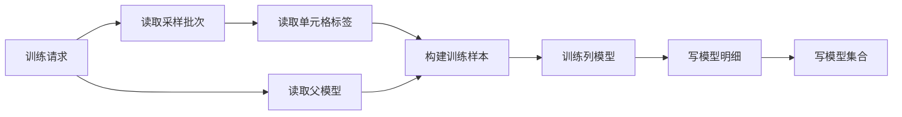

# Raha数据库结构

## 13. 数据库总体设计

### 13.1 设计原则

数据库只保存跨调用必须存在的业务事实，不保存算法调用过程状态。

长期保存：

- 采样批次和采样元组。
- 人工直接标签。
- 完整模型集合契约。
- 每个模型集合实际使用的训练样本快照。
- 检测批次和检测明细。

不长期保存：

- 通用任务、阶段和检查点。
- 运行中、失败、重试次数和当前阶段。
- 采样或训练期全量画像。
- 非训练样本的策略命中、单元格特征和聚类分配。
- 传播标签和阶段指标。

### 13.2 表清单

| 表名 | 用途 | 逻辑主键 |
| --- | --- | --- |
| `dw.raha_sample_batch` | 已提交采样批次头 | `sample_batch_id` |
| `dw.raha_sample_tuple` | 采样批次选择的元组 | `sample_batch_id, row_id` |
| `dw.raha_cell_label` | 人工直接单元格标签 | `sample_batch_id, row_id, column_name` |
| `dw.raha_model_set` | 已完整提交的模型集合头 | `model_set_version` |
| `dw.raha_column_model` | 模型集合内列模型 | `model_set_version, column_name` |
| `dw.raha_training_example` | 模型实际使用的训练样本 | `model_set_version, column_name, snapshot_id, row_id` |
| `dw.raha_detection_batch` | 已提交检测批次头 | `detection_batch_id` |
| `dw.raha_detection_result` | 单元格检测结果 | `detection_batch_id, row_id, column_name` |

### 13.3 表关系

#### 13.3.1 采样和标注关系

调用和表关系如下：

1. 采样服务读取输入并在调用内完成策略、特征、聚类和元组选择。
2. 没有业务键时先按全部列内容分组，相同行只生成一条带重复数量的采样元组。
3. 先写 `dw.raha_sample_tuple`，再写 `dw.raha_sample_batch` 头记录。
4. 一个采样批次对应多条采样元组，关系为一对多。
5. 标注程序按 `sample_batch_id, row_id` 读取采样元组及其 `row_data_json`，无需重新读取可能已经变化的原始输入，并写入多个字段标签。
6. 一个采样元组可以对应多条 `dw.raha_cell_label`，内容组标签作用于全部相同行。

#### 13.3.2 训练关系

调用和表关系如下：

1. 训练请求携带一个或多个 `sampleBatchIds`。
2. 训练服务读取全部 `dw.raha_sample_batch` 并校验数据集、快照、模式和行标识规则一致。
3. 通过 `sample_batch_id` 读取并合并 `dw.raha_cell_label`。
4. 增量训练额外读取父 `dw.raha_model_set`、`dw.raha_column_model` 和 `dw.raha_training_example`。
5. 训练完成后写入新模型集合对应的训练样本和列模型；训练样本保留可确定的来源采样批次，列模型记录同时包含该列特征字典。
6. 最后写 `dw.raha_model_set`，其中包含全部采样批次标识和冻结策略计划，使新模型集合可被检测读取。

#### 13.3.3 检测关系

调用和表关系如下：

1. 检测请求通过 `modelSetVersion` 读取一个 `dw.raha_model_set`。
2. 从模型集合读取冻结策略计划，再按模型集合读取多条列模型及其特征字典。
3. 检测服务读取输入数据，执行冻结策略、兼容特征和列模型预测。
4. 先写 `dw.raha_detection_result`，再写 `dw.raha_detection_batch` 头记录。
5. 一个检测批次对应多条检测结果，关系为一对多。

#### 13.3.4 逻辑关联键

| 主表 | 从表 | 关联字段 | 关系 |
| --- | --- | --- | --- |
| `dw.raha_sample_batch` | `dw.raha_sample_tuple` | `sample_batch_id` | 一对多 |
| `dw.raha_sample_batch` | `dw.raha_cell_label` | `sample_batch_id` | 一对多 |
| `dw.raha_sample_batch` | `dw.raha_model_set` | `sample_batch_ids_json` | 多对多引用 |
| `dw.raha_model_set` | `dw.raha_column_model` | `model_set_version` | 一对多 |
| `dw.raha_model_set` | `dw.raha_training_example` | `model_set_version` | 一对多 |
| `dw.raha_model_set` | `dw.raha_model_set` | `parent_model_set_version` | 父子版本 |
| `dw.raha_model_set` | `dw.raha_detection_batch` | `model_set_version` | 一对多 |
| `dw.raha_detection_batch` | `dw.raha_detection_result` | `detection_batch_id` | 一对多 |

FMDB 或 Spark 表未必强制主键和外键，以上约束由写入适配器通过确定性键、反连接检查和提交前校验保证。

## 14. 数据表详细设计

本节八张业务表统一创建在 `dw` 数据库，完整表名固定为 `dw.raha_*`，不允许由请求指定其他数据库或表名。

本节在最小可运行结构上增加少量关键冗余字段。逻辑主键、表关联键、跨调用重新加载所需契约、模型预测参数和必要结果摘要必须单独落列；能够显著减少头表关联、支持 ORC 分区裁剪或保证离线追溯的 `dataset_id`、`snapshot_id`、模型集合版本和创建时间允许在明细表冗余。大段配置、策略计划、特征字典和模型载荷不得复制到明细表。

请求字段可以由系统自动生成，但生成后的行身份模式和快照写入数据库时仍然必填。`CONTENT_GROUP` 模式不需要业务键字段列表。

`partition_date` 是 ORC 物理分区字段，统一使用 `yyyy-MM-dd` 格式，由对应批次头或模型集合头的 `created_at` 按 `Asia/Shanghai` 时区自动生成，不由调用方传入。同一业务批次的头表和明细表必须使用相同日期口径。

以下样例统一使用订单数据集：采样输入为 `ods.orders_dirty`，没有业务主键，采用内容分组模式；两个采样批次共同训练 `modelset_orders_20260717_001`；随后使用该模型检测 `ods.orders_dirty_next`。样例值只用于说明字段格式和表间关联，不是固定默认值。

### 14.1 `dw.raha_sample_batch`

只在采样明细完整写入后创建，存在即表示该采样批次可供标注。

| 字段 | 类型 | 必填 | 说明 | 样例 |
| --- | --- | --- | --- | --- |
| `sample_batch_id` | `STRING` | 是 | 采样批次标识 | `sample_orders_20260717_001` |
| `request_fingerprint` | `STRING` | 是 | 已解析请求和输入内容摘要 | `sha256:5ad4c8f1...` |
| `dataset_id` | `STRING` | 是 | 逻辑数据集 | `orders` |
| `snapshot_id` | `STRING` | 是 | 输入快照或指纹 | `snap_orders_20260717_001` |
| `input_reference` | `STRING` | 是 | 输入来源 | `ods.orders_dirty` |
| `source_type` | `STRING` | 是 | 表或查询 | `TABLE` |
| `row_identity_mode` | `STRING` | 是 | `KEY` 或 `CONTENT_GROUP` | `CONTENT_GROUP` |
| `row_key_columns_json` | `STRING` | 否 | `KEY` 模式使用的业务键字段列表 | `null` |
| `target_columns_json` | `STRING` | 是 | 解析并按输入模式排序的采样目标字段 | `["customer_phone","amount"]` |
| `schema_hash` | `STRING` | 是 | 输入模式哈希 | `sha256:9c26be71...` |
| `algorithm_version` | `STRING` | 是 | 新工程算法版本 | `raha-1.0.0` |
| `config_json` | `STRING` | 是 | 完整算法配置 | `{"strategyFamilies":["OD","PVD","RVD"],"labelingBudget":20}` |
| `labeling_budget` | `INT` | 是 | 请求预算 | `20` |
| `selected_tuple_count` | `BIGINT` | 是 | 实际采样元组数 | `20` |
| `created_at` | `BIGINT` | 是 | 批次提交时间 | `1784253600000` |

`target_columns_json` 始终保存展开后的明确列表，调用方未传 `targetColumns` 时也不保存为空。`sample_batch_id` 由包含该列表的 `request_fingerprint` 确定性生成。相同请求和相同输入内容返回同一批次。

### 14.2 `dw.raha_sample_tuple`

| 字段 | 类型 | 必填 | 说明 | 样例 |
| --- | --- | --- | --- | --- |
| `sample_batch_id` | `STRING` | 是 | 采样批次 | `sample_orders_20260717_001` |
| `dataset_id` | `STRING` | 是 | 冗余的逻辑数据集，用于直接查询和追溯 | `orders` |
| `snapshot_id` | `STRING` | 是 | 冗余的输入快照 | `snap_orders_20260717_001` |
| `row_id` | `STRING` | 是 | 采样行标识 | `rowhash:8f3a12d9...` |
| `duplicate_count` | `BIGINT` | 是 | 内容组包含的原始行数，业务键模式固定为一 | `3` |
| `row_data_json` | `STRING` | 是 | 标注所需的采样行完整字段和值 | `{"order_no":"A20260717001","customer_phone":"1380013800X","amount":"128.50"}` |
| `selection_order` | `INT` | 是 | 确定性采样顺序 | `1` |
| `selection_score` | `DOUBLE` | 是 | 元组覆盖得分 | `8.75` |
| `reason_json` | `STRING` | 是 | 结构化选择原因 | `{"coveredColumns":["customer_phone"],"coveredClusters":["phone_c03"]}` |
| `created_at` | `BIGINT` | 是 | 写入时间 | `1784253600000` |
| `partition_date` | `STRING` | 是 | ORC 分区日期，取采样批次创建日期 | `2026-07-17` |

`dataset_id` 和 `snapshot_id` 虽可通过批次头取得，但为直接查询、分区过滤和离线追溯而保留。输入来源仍通过 `sample_batch_id` 从批次头取得。`row_data_json` 保存采样时的行内容，是标注输入契约；覆盖字段和聚类摘要统一放入 `reason_json`，不再拆成重复字段。

### 14.3 `dw.raha_cell_label`

| 字段 | 类型 | 必填 | 说明 | 样例 |
| --- | --- | --- | --- | --- |
| `sample_batch_id` | `STRING` | 是 | 来源采样批次 | `sample_orders_20260717_001` |
| `dataset_id` | `STRING` | 是 | 冗余的逻辑数据集 | `orders` |
| `snapshot_id` | `STRING` | 是 | 冗余的标注来源快照 | `snap_orders_20260717_001` |
| `row_id` | `STRING` | 是 | 行标识 | `rowhash:8f3a12d9...` |
| `column_name` | `STRING` | 是 | 字段名 | `customer_phone` |
| `value_hash` | `STRING` | 是 | 标注时原值哈希 | `sha256:7bd91e20...` |
| `label` | `INT` | 是 | `0` 正常，`1` 错误 | `1` |
| `labeled_at` | `BIGINT` | 是 | 标注时间 | `1784257200000` |
| `partition_date` | `STRING` | 是 | ORC 分区日期，取采样批次创建日期 | `2026-07-17` |

该表只保存人工直接标签，因此删除固定含义的 `label_source` 和 `confidence`。`dataset_id` 和 `snapshot_id` 为查询与追溯冗余，`cell_id` 仍通过批次头及行列坐标计算。`partition_date` 使用采样批次创建日期而不是标注日期，保证同一采样批次的标签进入同一分区。未标注单元格不写记录，传播标签也不写入此表。

### 14.4 `dw.raha_model_set`

该表是模型可用性的提交头。只有采样关系、计划、字典、训练样本和列模型全部校验完成后才写入。

| 字段 | 类型 | 必填 | 说明 | 样例 |
| --- | --- | --- | --- | --- |
| `model_set_version` | `STRING` | 是 | 不可变模型集合版本 | `modelset_orders_20260717_001` |
| `request_fingerprint` | `STRING` | 是 | 采样批次、标签、父模型和配置摘要 | `sha256:6d84ee30...` |
| `dataset_id` | `STRING` | 是 | 训练逻辑数据集 | `orders` |
| `training_snapshot_id` | `STRING` | 是 | 训练快照 | `snap_orders_20260717_001` |
| `sample_batch_ids_json` | `STRING` | 是 | 参与训练的全部采样批次标识 | `["sample_orders_20260717_001","sample_orders_20260717_002"]` |
| `training_mode` | `STRING` | 是 | `FULL` 或 `INCREMENTAL` | `FULL` |
| `parent_model_set_version` | `STRING` | 否 | 增量训练的父模型集合 | `null` |
| `model_columns_json` | `STRING` | 是 | 当前模型集合覆盖的全部字段 | `["customer_phone","amount"]` |
| `trained_columns_json` | `STRING` | 是 | 本次实际训练或重新训练的字段 | `["customer_phone","amount"]` |
| `row_identity_mode` | `STRING` | 是 | `KEY` 或 `CONTENT_GROUP` | `CONTENT_GROUP` |
| `row_key_columns_json` | `STRING` | 否 | `KEY` 模式使用的业务键字段列表 | `null` |
| `schema_hash` | `STRING` | 是 | 训练模式哈希 | `sha256:9c26be71...` |
| `algorithm_version` | `STRING` | 是 | 算法版本 | `raha-1.0.0` |
| `config_json` | `STRING` | 是 | 训练完整配置 | `{"classifierType":"LOGISTIC_REGRESSION","threshold":0.62}` |
| `strategy_plan_version` | `STRING` | 是 | 冻结策略计划版本 | `plan:47ac9b10...` |
| `strategy_plan_json` | `STRING` | 是 | 检测需要执行的完整冻结策略计划 | `[{"id":"pvd_phone_01","family":"PVD","target":"customer_phone"}]` |
| `normalization_version` | `STRING` | 是 | 值规范化版本 | `norm-v1` |
| `model_count` | `INT` | 是 | 可用列模型数量 | `6` |
| `training_example_count` | `BIGINT` | 是 | 合并后的训练样本数 | `128` |
| `created_at` | `BIGINT` | 是 | 提交时间 | `1784260800000` |

不设置发布状态。调用方通过明确的 `modelSetVersion` 使用版本；需要回退时直接指定旧版本。

`FULL` 模式的父版本必须为空，`model_columns_json` 与 `trained_columns_json` 一致；`INCREMENTAL` 模式的父版本必须存在，`trained_columns_json` 可以只是 `model_columns_json` 的子集，未训练字段复用父列模型。采样批次通常数量较少，直接保存在 `sample_batch_ids_json` 中，不再建立关联表。若策略计划超过 FMDB 单行大小限制，可以把压缩后的计划作为模型载荷保存并在该字段记录载荷地址，不重新拆回策略计划表。

### 14.5 `dw.raha_column_model`

| 字段 | 类型 | 必填 | 说明 | 样例 |
| --- | --- | --- | --- | --- |
| `model_set_version` | `STRING` | 是 | 所属模型集合 | `modelset_orders_20260717_001` |
| `dataset_id` | `STRING` | 是 | 冗余的训练逻辑数据集 | `orders` |
| `model_version` | `STRING` | 是 | 列模型不可变版本 | `model_orders_customer_phone_001` |
| `parent_model_version` | `STRING` | 否 | 增量训练对应的父列模型 | `null` |
| `column_name` | `STRING` | 是 | 目标字段 | `customer_phone` |
| `classifier_type` | `STRING` | 是 | 首期固定为 `LOGISTIC_REGRESSION` | `LOGISTIC_REGRESSION` |
| `dictionary_version` | `STRING` | 是 | 特征字典版本 | `dict_customer_phone_001` |
| `feature_dictionary_json` | `STRING` | 是 | 当前列完整特征字典 | `[{"index":0,"name":"strategy.pvd.phone.hit","default":0.0},{"index":1,"name":"context.value.length","default":0.0}]` |
| `feature_dimension` | `INT` | 是 | 特征维度 | `42` |
| `threshold` | `DOUBLE` | 是 | 错误判断阈值 | `0.62` |
| `model_payload_json` | `STRING` | 是 | 逻辑回归截距和系数 | `{"intercept":-1.24,"coefficients":{"0":2.31,"7":0.85}}` |
| `training_summary_json` | `STRING` | 是 | 样本数量和训练指标摘要 | `{"direct":38,"propagated":90,"positive":31,"negative":97,"f1":0.88}` |
| `created_at` | `BIGINT` | 是 | 冗余的模型集合提交时间 | `1784260800000` |

`dataset_id` 和 `created_at` 用于直接列出数据集模型及离线追溯；模式、策略计划和训练模式仍从模型集合头读取。特征字典与列模型一同加载，不再建立独立字典表。分类器扩展接口后续可以定义新的模型载荷结构，首期只解析逻辑回归载荷。

### 14.6 `dw.raha_training_example`

该表保存每个模型集合实际使用的完整训练样本快照，用于增量训练时与新增样本合并。它只保存参与训练的单元格，不保存全量检测特征。

| 字段 | 类型 | 必填 | 说明 | 样例 |
| --- | --- | --- | --- | --- |
| `model_set_version` | `STRING` | 是 | 使用该样本的模型集合 | `modelset_orders_20260717_001` |
| `dataset_id` | `STRING` | 是 | 冗余的训练逻辑数据集 | `orders` |
| `source_sample_batch_id` | `STRING` | 否 | 能够确定时记录样本来源采样批次 | `sample_orders_20260717_001` |
| `column_name` | `STRING` | 是 | 训练字段 | `customer_phone` |
| `snapshot_id` | `STRING` | 是 | 样本来源快照 | `snap_orders_20260717_001` |
| `row_id` | `STRING` | 是 | 业务行标识 | `rowhash:8f3a12d9...` |
| `duplicate_count` | `BIGINT` | 是 | 内容组代表的原始行数，业务键模式固定为一 | `3` |
| `value_hash` | `STRING` | 是 | 训练时值摘要 | `sha256:7bd91e20...` |
| `feature_vector_json` | `STRING` | 是 | 稀疏特征编号和值 | `{"0":1.0,"7":0.42}` |
| `label` | `INT` | 是 | `0` 正常，`1` 错误 | `1` |
| `label_source` | `STRING` | 是 | 直接标签或传播标签 | `DIRECT` |
| `sample_weight` | `DOUBLE` | 是 | 训练样本权重 | `3.0` |
| `created_at` | `BIGINT` | 是 | 冗余的模型集合提交时间 | `1784260800000` |
| `partition_date` | `STRING` | 是 | ORC 分区日期，取模型集合创建日期 | `2026-07-17` |

`dataset_id` 为直接查询和追溯冗余，字典版本通过模型集合与列模型取得。直接标签训练样本必须记录 `source_sample_batch_id`；传播样本无法确定唯一来源批次时允许为空。`sample_weight` 综合直接标签或传播标签权重与重复数量。增量训练在 `KEY` 模式下按 `row_id, column_name` 覆盖父样本；在 `CONTENT_GROUP` 模式下按内容哈希去重，内容变化后作为新样本保留。新模型集合写入时重新物化合并后的完整样本，避免检测或后续训练递归读取多级父版本。

### 14.7 `dw.raha_detection_batch`

只在检测明细完成写入后创建。即使疑似错误数量为零，也必须创建批次头以表达一次成功的零结果检测。

| 字段 | 类型 | 必填 | 说明 | 样例 |
| --- | --- | --- | --- | --- |
| `detection_batch_id` | `STRING` | 是 | 检测批次 | `detect_orders_20260717_001` |
| `request_fingerprint` | `STRING` | 是 | 输入、模型和输出模式摘要 | `sha256:3f177a82...` |
| `dataset_id` | `STRING` | 是 | 检测数据集 | `orders` |
| `snapshot_id` | `STRING` | 是 | 检测快照 | `snap_orders_20260718_001` |
| `input_reference` | `STRING` | 是 | 输入来源 | `ods.orders_dirty_next` |
| `source_type` | `STRING` | 是 | 表或查询 | `TABLE` |
| `row_identity_mode` | `STRING` | 是 | `KEY` 或 `CONTENT_GROUP` | `CONTENT_GROUP` |
| `row_key_columns_json` | `STRING` | 否 | `KEY` 模式使用的业务键字段列表 | `null` |
| `target_columns_json` | `STRING` | 是 | 本批次实际检测的模型字段 | `["customer_phone"]` |
| `schema_hash` | `STRING` | 是 | 检测模式哈希 | `sha256:9c26be71...` |
| `model_set_version` | `STRING` | 是 | 使用的模型集合 | `modelset_orders_20260717_001` |
| `errors_only` | `BOOLEAN` | 是 | 是否只保存疑似错误 | `true` |
| `input_row_count` | `BIGINT` | 是 | 输入行数 | `10000` |
| `evaluated_cell_count` | `BIGINT` | 是 | 已评估单元格数 | `60000` |
| `detected_cell_count` | `BIGINT` | 是 | 疑似错误单元格数 | `126` |
| `created_at` | `BIGINT` | 是 | 批次提交时间 | `1784340000000` |

`target_columns_json` 始终保存解析后的明确列表，且必须是模型集合 `model_columns_json` 的子集。`detection_batch_id` 由包含该列表的 `request_fingerprint` 确定性生成。不保存运行中、失败或重试次数。

### 14.8 `dw.raha_detection_result`

| 字段 | 类型 | 必填 | 说明 | 样例 |
| --- | --- | --- | --- | --- |
| `detection_batch_id` | `STRING` | 是 | 检测批次 | `detect_orders_20260717_001` |
| `dataset_id` | `STRING` | 是 | 冗余的检测逻辑数据集 | `orders` |
| `snapshot_id` | `STRING` | 是 | 冗余的检测输入快照 | `snap_orders_20260718_001` |
| `model_set_version` | `STRING` | 是 | 冗余的模型集合版本 | `modelset_orders_20260717_001` |
| `row_id` | `STRING` | 是 | 行标识 | `rowhash:91ac67e2...` |
| `column_name` | `STRING` | 是 | 字段名 | `customer_phone` |
| `duplicate_count` | `BIGINT` | 是 | 结果代表的相同原始行数量 | `2` |
| `value_hash` | `STRING` | 是 | 原始值哈希 | `sha256:43d0bb19...` |
| `is_error` | `BOOLEAN` | 是 | 是否疑似错误 | `true` |
| `score` | `DOUBLE` | 是 | 错误概率或归一化分数 | `0.91` |
| `strategy_ids_json` | `STRING` | 是 | 命中策略标识列表 | `["pvd_phone_01","od_frequency_03"]` |
| `reason_json` | `STRING` | 是 | 结构化检测原因 | `{"code":"FORMAT_OUTLIER","message":"未匹配主要电话格式"}` |
| `model_version` | `STRING` | 是 | 列模型版本 | `model_orders_customer_phone_001` |
| `created_at` | `BIGINT` | 是 | 冗余的检测批次提交时间 | `1784340000000` |
| `partition_date` | `STRING` | 是 | ORC 分区日期，取检测批次创建日期 | `2026-07-18` |

`dataset_id`、`snapshot_id`、`model_set_version` 和 `created_at` 虽可从检测批次头读取，但为结果直接查询、分区过滤和离线追溯而冗余。阈值和字典版本仍从列模型读取；`cell_id` 由批次、行和列计算。禁止增加 `correct_value`、`repair_value`、`clean_value` 等纠正语义字段。

### 14.9 精简与冗余结果

| 设计项 | 处理方式 | 样例 |
| --- | --- | --- |
| `idempotency_key`、`request_hash` | 合并为内部生成的 `request_fingerprint` | `sha256:5ad4c8f1...` |
| 明细表中的 `dataset_id`、`snapshot_id` | 在采样、标签、训练和检测高频明细中保留关键冗余 | `orders, snap_orders_20260717_001` |
| `row_data_json` | 在采样元组中保存标注所需行内容，避免重新读取原始快照 | `{"order_no":"A20260717001"}` |
| 明细表中的模型集合版本 | 在检测结果中冗余，支持结果直接追溯模型契约 | `modelset_orders_20260717_001` |
| 明细表中的创建时间 | 仅在模型、训练和检测追溯需要的明细中冗余 | `1784260800000` |
| `partition_date` | 仅在大明细表中作为系统生成的 ORC 物理分区字段 | `2026-07-17` |
| `cell_id` | 通过批次、行和列确定性计算 | `detect_orders_20260717_001 + rowhash:91ac67e2... + customer_phone` |
| `config_version` | 由规范化 `config_json` 计算 | `sha256:42d8e104...` |
| `raha_strategy_plan` | 合并为 `dw.raha_model_set.strategy_plan_json` | `{"targetColumns":["customer_phone"]}` |
| `raha_feature_dictionary` | 合并为 `dw.raha_column_model.feature_dictionary_json` | `dict_customer_phone_001` |
| `raha_model_sample_batch` | 合并为 `dw.raha_model_set.sample_batch_ids_json` | `["sample_orders_20260717_001","sample_orders_20260717_002"]` |
| 多个模型参数字段 | 合并为 `model_payload_json` | `{"intercept":-1.24,"coefficients":{"0":2.31}}` |
| 多个训练数量和指标字段 | 合并为 `training_summary_json` | `{"direct":38,"f1":0.88}` |
| 重复的开始和结束时间 | 头记录只保留 `created_at`，详细耗时进入日志 | `1784260800000` |
| 状态、阶段、重试和错误字段 | 不属于业务产物表，不建立 | 不适用 |

## 15. 数据库物理设计建议

### 15.1 ORC 存储和目录

八张业务表统一创建在 `dw` 数据库，使用 ORC 格式并分别建表。ORC 存储根目录固定为 `/fmdb/raha/`，各表以不带数据库名的英文表名作为一级目录。它们的字段结构、访问频率和保留周期不同，不合并为一张通用宽表，也不使用大段通用 JSON 载荷模拟不同记录类型。

表和存储目录映射固定如下：

| 业务表 | ORC 根目录 |
| --- | --- |
| `dw.raha_sample_batch` | `/fmdb/raha/raha_sample_batch/` |
| `dw.raha_sample_tuple` | `/fmdb/raha/raha_sample_tuple/` |
| `dw.raha_cell_label` | `/fmdb/raha/raha_cell_label/` |
| `dw.raha_model_set` | `/fmdb/raha/raha_model_set/` |
| `dw.raha_column_model` | `/fmdb/raha/raha_column_model/` |
| `dw.raha_training_example` | `/fmdb/raha/raha_training_example/` |
| `dw.raha_detection_batch` | `/fmdb/raha/raha_detection_batch/` |
| `dw.raha_detection_result` | `/fmdb/raha/raha_detection_result/` |

表英文名适合作为存储根目录下的一级目录，不作为每张独立表的分区字段。独立表中的表名是恒定值，把它再次写成分区列不能产生分区裁剪收益。分区表在对应表目录下继续使用 `/partition_date=yyyy-MM-dd/`，例如 `/fmdb/raha/raha_detection_result/partition_date=2026-07-18/`。

只有 FMDB 明确要求多种记录共用一张物理表时，才把表英文名定义为 `record_type` 一级分区；这种模式需要统一稀疏结构并降低 ORC 列裁剪效果，不作为本设计首选方案。

### 15.2 分区和数据组织

`partition_date` 只用于预计持续增长的明细表。它是查询可见的 ORC 分区列，值从所属头记录的 `created_at` 自动计算，固定使用 `Asia/Shanghai` 时区和 `yyyy-MM-dd` 格式。调用方不传入该字段，适配层必须保证同一批次或模型集合的分区值一致。

| 表 | 分区建议 | 分区日期来源 | 分区内组织键 |
| --- | --- | --- | --- |
| `dw.raha_sample_batch` | 首期不分区 | 不适用 | `sample_batch_id` |
| `dw.raha_sample_tuple` | `partition_date` | 采样批次创建时间 | `sample_batch_id, row_id` |
| `dw.raha_cell_label` | `partition_date` | 采样批次创建时间 | `sample_batch_id, column_name, row_id` |
| `dw.raha_model_set` | 首期不分区 | 不适用 | `model_set_version` |
| `dw.raha_column_model` | 首期不分区 | 不适用 | `model_set_version, column_name` |
| `dw.raha_training_example` | `partition_date` | 模型集合创建时间 | `model_set_version, column_name, row_id` |
| `dw.raha_detection_batch` | 首期不分区 | 不适用 | `detection_batch_id` |
| `dw.raha_detection_result` | `partition_date` | 检测批次创建时间 | `detection_batch_id, column_name, row_id` |

头表和列模型数据量较小时不分区，避免每次调用产生只有少量记录的日期分区。数据增长到无分区扫描不可接受时，再统一增加 `partition_month` 月分区，不直接套用明细表的日分区。

`dataset_id` 默认只作为普通冗余列和 ORC 谓词过滤列，不作为二级分区。只有同时满足数据集数量少且稳定、查询稳定携带数据集条件、拆分后的单分区仍能形成足够大的 ORC 文件时，才允许采用 `partition_date, dataset_id` 两级分区。不得使用 `sample_batch_id`、`model_set_version`、`detection_batch_id`、`column_name` 或 `row_id` 分区，避免形成高基数小分区。

每次采样、训练或检测应在当前调用内批量写出同一目标分区，避免逐行生成 ORC 文件。小文件合并和历史分区清理由 FMDB 平台维护能力承担，不在 Raha 工程中增加编排、状态或重试模块。

### 15.3 确定性写入

批次和模型版本由规范化请求指纹生成。适配器执行以下规则：

1. 计算完整请求指纹和对应输出标识。
2. 输出标识已存在且请求指纹一致时返回原摘要，不重复写明细。
3. 输出标识已存在但请求指纹不一致时抛出标识冲突。
4. 未存在时执行当前调用，不在内部重试。
5. 明细使用逻辑主键反连接后追加，或使用 FMDB 支持的合并语义。
6. 头记录最后写入，作为产物完整提交标志。

确定性标识只用于避免同一业务产物重复写入，不构成失败重试机制。

### 15.4 事务边界

优先使用 FMDB 支持的事务或原子分区提交。若目标表不支持跨表事务，则采用“明细先写、头记录后写”的提交协议：

- 读取方只读取存在头记录的批次或模型集合。
- 中途失败产生的无头明细不可见于业务读取。
- 无头明细由数据库保留策略或运维清理，不由本工程恢复。
- 相同请求指纹再次调用是否允许复用无头明细，应在 FMDB 详细设计中确认。

### 15.5 保留周期

| 数据 | 建议策略 |
| --- | --- |
| 采样批次和元组 | 至少保留至相关模型集合不再使用 |
| 直接标签 | 按模型训练周期保留 |
| 模型集合及契约 | 只要仍可能被检测或增量训练引用就必须保留 |
| 训练样本 | 与对应模型集合保持相同保留周期 |
| 检测批次 | 按业务查询周期保留 |
| 检测明细 | 按业务数据保留策略分区清理 |
| 无头明细 | 设置较短清理周期 |

