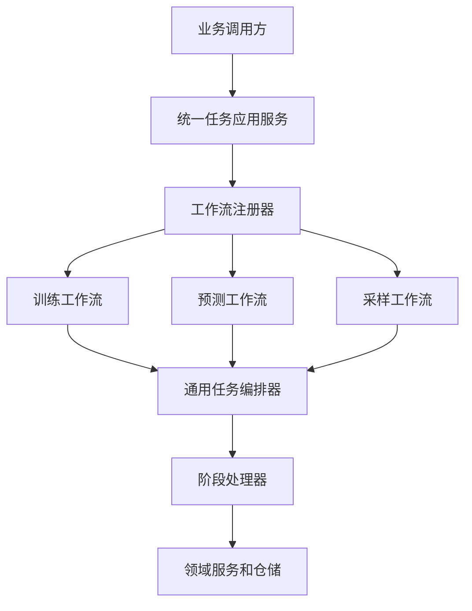

# Raha 统一任务编排入口代码落地报告

## 一、落地目标

本轮改造按照《Raha 任务编排与训练预测统一入口分析》完成任务模型主线落地，目标是把训练、预测和采样统一到一个同进程、同步执行的业务入口。

本轮不引入以下内容：

- UDF 提交器。
- 文件任务生成程序。
- 独立文件消费者。
- 定时轮询器。
- 常驻 Worker。
- 默认 Application 启动类。

业务调用方只需要构造类型化请求并调用一次 `RahaTaskApplicationService.execute`，入口内部完成幂等建单、工作流选择、阶段创建、阶段执行和结果汇总。

## 二、统一调用链



实际职责划分如下：

| 层次 | 代表类 | 职责 |
| --- | --- | --- |
| 统一应用层 | `RahaTaskApplicationService` | 校验请求、幂等提交、路由工作流、直接执行并返回统一结果 |
| 工作流层 | `TrainingWorkflow`、`DetectionWorkflow`、`SamplingWorkflow` | 定义各任务类型的阶段顺序和阶段处理器 |
| 任务执行层 | `RahaJobOrchestrator` | 处理状态机、重试、可容忍失败、阶段持久化和任务终态 |
| 阶段适配层 | `job.stage` | 把任务上下文转换为领域服务请求，并把服务结果转换为阶段结果 |
| 业务服务层 | `service.train`、`service.detect`、`service.sample` | 执行训练、已发布模型预测和主动采样业务 |

## 三、主要代码变更

### 3.1 统一任务契约

删除了服务包中重复维护的以下类型：

- `service.common.RahaTaskType`
- `service.common.RahaTaskStatus`
- `service.common.RahaTaskResult`
- `service.common.RahaTaskSummary`

新增 `RahaServiceResult` 和 `RahaServiceSummary`，它们只表达一次业务服务调用的结果，不再维护第二套任务生命周期。

任务类型和任务生命周期统一使用：

- `data.type.JobType`
- `data.type.JobStatus`
- `data.type.StageStatus`
- `job.domain.JobRunResult`

### 3.2 统一应用入口

新增 `service.task` 包：

| 文件 | 用途 |
| --- | --- |
| `RahaTaskApplicationService.java` | 训练、预测、采样的唯一统一执行入口 |
| `RahaTaskExecutionRequest.java` | 类型化任务请求和参数校验 |
| `RahaTaskExecutionResult.java` | 统一返回任务、阶段、业务载荷和结果位置 |
| `RahaWorkflow.java` | 工作流创建阶段处理器的契约 |
| `RahaWorkflowRegistry.java` | 按 `JobType` 注册和查找工作流 |
| `AbstractRahaWorkflow.java` | 公共数据准备阶段的基础工作流 |
| `TrainingWorkflow.java` | 训练工作流 |
| `DetectionWorkflow.java` | 已发布模型预测工作流 |
| `SamplingWorkflow.java` | 主动采样工作流 |

统一入口的关键行为：

1. 请求为空或任务类型不支持时立即失败。
2. 使用现有 `RahaJobOrchestrator.submit` 保证幂等建单。
3. 对已存在的非创建态任务直接返回历史任务和阶段轨迹，不重复执行。
4. 对新任务根据 `JobType` 选择工作流并在当前线程内直接执行。
5. 将阶段属性中的训练输出、预测输出或采样输出映射到统一结果。

### 3.3 训练工作流

训练阶段顺序为：

```text
LOAD_DATA -> PROFILE -> GENERATE_STRATEGY -> RUN_STRATEGY
-> GENERATE_FEATURE -> CLUSTER -> LABEL -> PROPAGATE
-> TRAIN -> EVALUATE -> PERSIST_RESULT
```

其中评估阶段由调用方传入 `StageEvaluator` 时启用。训练服务仍然负责保存候选模型，模型发布不是训练阶段的隐式副作用。

`RahaTrainRequest` 增加了已准备标签传播结果的可选输入，训练阶段会复用 `PROPAGATE` 阶段的结果，避免统一工作流再次执行标签传播。

特征准备服务和策略阶段统一使用 `StrategyPlanVersioner` 计算确定性策略版本，后续预测可以依据策略版本检查模型和特征兼容性。

### 3.4 预测工作流

预测阶段顺序为：

```text
LOAD_DATA -> PROFILE -> GENERATE_STRATEGY -> RUN_STRATEGY
-> GENERATE_FEATURE -> PREDICT -> EVALUATE -> PERSIST_RESULT
```

`PREDICT` 使用新增的 `PublishedModelDetectionStageHandler`，调用 `RahaDetectService` 加载已发布模型并保存预测结果。

原来的 `DetectionStageHandler` 已删除并改名为 `RuleDetectionStageHandler`，用于表达 `BasicDetectionService` 的规则加权检测能力，避免把规则检测误认为生产模型预测。

### 3.5 采样工作流

采样阶段顺序为：

```text
LOAD_DATA -> PROFILE -> GENERATE_STRATEGY -> RUN_STRATEGY
-> GENERATE_FEATURE -> CLUSTER -> SAMPLE -> PERSIST_RESULT
```

`SampleTaskStageHandler` 调用高层 `RahaSampleService`，支持初始标签输入，并把采样任务和样本输出登记到统一任务阶段轨迹中。

### 3.6 部分成功状态

为了表达可继续执行但结果不完整的场景，新增：

- `JobStatus.PARTIAL_SUCCESS`
- `StageStatus.PARTIAL_SUCCESS`
- `StageOutcome.PARTIAL_SUCCESS`

当阶段策略为 `CONTINUE` 且阶段失败时，编排器继续执行后续阶段，但最终任务状态为 `PARTIAL_SUCCESS`。这样可以区分“完整成功”和“带有缺失项的可用结果”。

## 四、典型使用示例

### 4.1 训练

```java
RahaTaskExecutionRequest request = RahaTaskExecutionRequest.training(
        trainingConfig,
        dataLoadRequest,
        trainConfig,
        labelPropagationConfig,
        labels);
RahaTaskExecutionResult result = taskApplicationService.execute(request);
```

返回结果可以读取：

```java
JobStatus status = result.getJob().getStatus();
RahaTrainOutput output = result.getPayload(RahaTrainOutput.class);
String location = result.getResultLocation();
```

训练成功后得到的是候选模型。调用方或发布审批流程随后调用 `ModelReleaseManager.publish`，将通过质量门禁的候选模型发布为生产模型。

### 4.2 已发布模型预测

```java
RahaTaskExecutionRequest request = RahaTaskExecutionRequest.detection(
        detectionConfig,
        dataLoadRequest,
        trainConfig.getModelNamePrefix());
RahaTaskExecutionResult result = taskApplicationService.execute(request);
```

该请求会执行 `PublishedModelDetectionStageHandler`，读取已发布模型，生成检测结果并返回结果位置。它不会启动第二个消费者进程。

### 4.3 主动采样

```java
RahaTaskExecutionRequest request = RahaTaskExecutionRequest.sampling(
        samplingConfig,
        dataLoadRequest,
        sampleRound);
RahaTaskExecutionResult result = taskApplicationService.execute(request);
```

采样工作流负责生成采样任务。标注系统可以在自己的边界内读取采样任务并回传标签，但这不属于 Raha 内部的文件消费机制。

## 五、测试验证

新增 `RahaTaskApplicationServiceIntegrationTest`，使用真实 Spark 本地会话和内存仓储，通过统一入口验证：

- 训练工作流可以完成候选模型训练和结果登记。
- 相同幂等请求不会重复执行已有任务。
- 采样工作流可以生成采样任务和输出。
- 发布候选模型后，预测工作流可以读取已发布模型并保存八条检测结果。
- 训练、预测、采样都通过同一个应用服务入口执行。

新增 `StateMachineTest` 覆盖任务和阶段的部分成功终态，以及终态不可再次覆盖。

验证命令：

```powershell
$env:JAVA_TOOL_OPTIONS='--add-opens=java.base/sun.nio.ch=ALL-UNNAMED --add-opens=java.base/java.nio=ALL-UNNAMED --add-opens=java.base/java.lang=ALL-UNNAMED --add-opens=java.base/java.util=ALL-UNNAMED --add-opens=java.base/java.lang.invoke=ALL-UNNAMED --add-opens=java.base/java.net=ALL-UNNAMED'
mvn --% -q -Denforcer.skip=true test
```

本次完整测试集 Maven 退出码为 0，所有测试通过。测试日志中的异常堆栈来自专门验证失败隔离、事务回滚和失败重试的测试，不代表测试失败。

## 六、当前边界和后续扩展

当前统一入口支持 `TRAINING`、`DETECTION` 和 `SAMPLING` 三种任务类型。`EVALUATION`、`STRATEGY_ANALYSIS` 等类型尚未注册工作流，调用时会被明确拒绝。

当前仓储主要持久化任务和阶段状态。幂等复用返回历史任务和阶段轨迹，但不恢复内存中的业务 payload；调用方应通过 `resultLocation` 读取已持久化结果。

模型发布仍是训练完成后的独立审批动作。若未来需要自动发布，应新增明确的发布策略和质量门禁配置，不应把发布逻辑隐藏到普通训练阶段中。

若未来需要异步执行，应由外部调度平台调用 `RahaTaskApplicationService` 或在其上增加独立适配层。当前代码没有定时器、文件队列或常驻 Worker，因而不会出现第二个消费进程和第一阶段文件生成的两阶段任务模型。

## 七、落地文件概览

本轮新增的核心源码位于：

- `src/main/java/com/fiberhome/ml/raha/service/task`
- `src/main/java/com/fiberhome/ml/raha/job/stage`
- `src/main/java/com/fiberhome/ml/raha/service/common`
- `src/main/java/com/fiberhome/ml/raha/strategy/plan/StrategyPlanVersioner.java`

本轮删除的重复或语义不清文件包括：

- `service/common/RahaTaskType.java`
- `service/common/RahaTaskStatus.java`
- `service/common/RahaTaskResult.java`
- `service/common/RahaTaskSummary.java`
- `job/stage/DetectionStageHandler.java`
