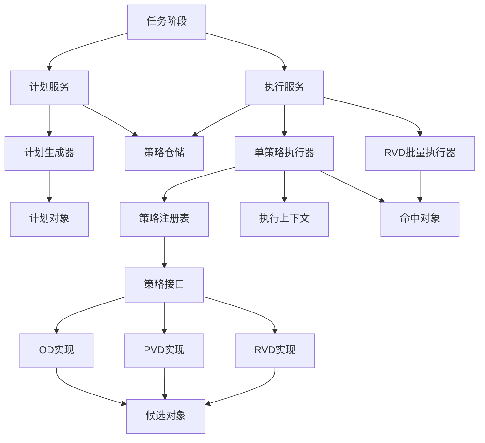
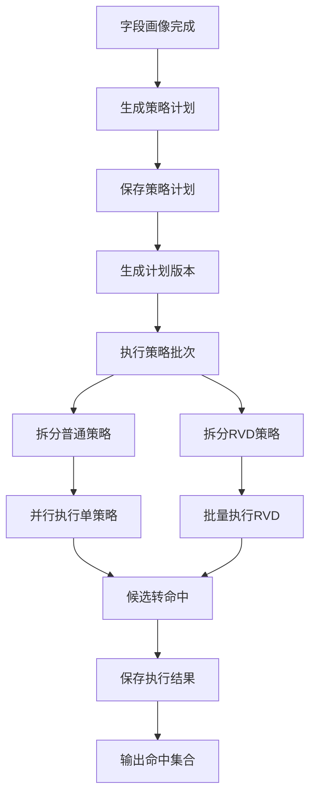
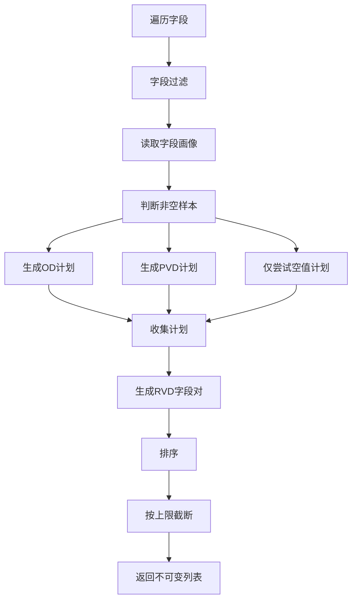
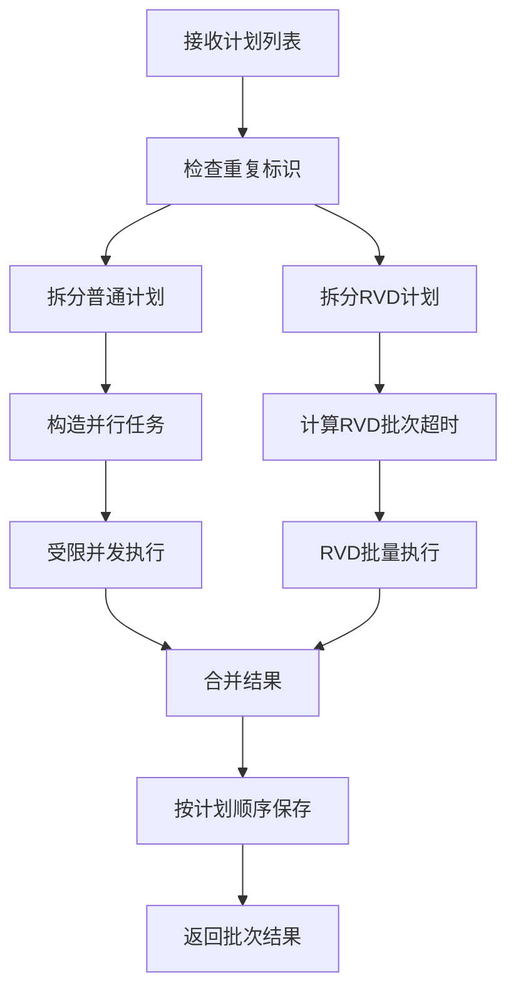

# strategy 包依赖关系与流程设计

## 一、文档范围

本文分析 `src/main/java/com/fiberhome/ml/raha/strategy` 包下的类依赖关系、职责划分和策略生成执行流程。

该包负责 Raha 检测流程中的策略层，主要完成三件事：

1. 根据字段画像生成策略计划。
2. 按策略计划执行 OD、PVD、RVD 检测。
3. 将策略候选命中和运行摘要转换为可持久化结果。

## 二、包结构总览

```text
strategy
├── api
│   ├── DetectionStrategy
│   ├── StrategyConfigurationKeys
│   ├── StrategyRegistry
│   └── StrategyTypes
├── domain
│   └── StrategyHit
├── execution
│   ├── RvdBatchStrategyExecutor
│   ├── SparkStrategySupport
│   ├── StrategyAlignmentArtifactWriter
│   ├── StrategyBatchResult
│   ├── StrategyExecutionContext
│   ├── StrategyExecutionResult
│   ├── StrategyExecutionService
│   ├── StrategyExecutor
│   └── StrategyRunSummary
├── impl
│   ├── od
│   │   ├── LowFrequencyStrategy
│   │   ├── NumericDistanceStrategy
│   │   └── QuantileOutlierStrategy
│   ├── pvd
│   │   ├── CharacterSetStrategy
│   │   ├── LengthAnomalyStrategy
│   │   ├── NullPlaceholderStrategy
│   │   └── TypeFormatStrategy
│   └── rvd
│       └── OneToManyConflictStrategy
└── plan
    ├── StrategyCandidate
    ├── StrategyGenerationConfig
    ├── StrategyIdentityGenerator
    ├── StrategyPlan
    ├── StrategyPlanGenerator
    ├── StrategyPlanService
    └── StrategyPlanVersioner
```

## 三、模块职责

| 模块 | 职责 | 关键类 |
| --- | --- | --- |
| `api` | 定义策略统一接口、策略类型常量、配置键常量和策略注册表 | `DetectionStrategy`、`StrategyRegistry` |
| `plan` | 将数据画像转换为可执行策略计划，并生成稳定标识和计划版本 | `StrategyPlanGenerator`、`StrategyPlan` |
| `impl` | 实现具体检测算法，只输出候选命中，不做最终错误裁决 | `LowFrequencyStrategy`、`TypeFormatStrategy` 等 |
| `execution` | 负责策略调度、超时隔离、批量 RVD 优化、结果转换与保存 | `StrategyExecutionService`、`StrategyExecutor` |
| `domain` | 定义策略执行后的持久化命中对象 | `StrategyHit` |

## 四、核心依赖关系



说明：

1. 计划阶段通过 `StrategyPlanService` 生成并保存计划。
2. 执行阶段通过 `StrategyExecutionService` 调度策略计划。
3. 普通 OD、PVD 策略通过 `StrategyExecutor` 单独执行。
4. `RVD_ONE_TO_MANY` 策略由 `RvdBatchStrategyExecutor` 批量执行，避免宽表字段对逐个 Spark 作业执行。
5. 具体策略统一实现 `DetectionStrategy`，并由 `StrategyRegistry` 根据 `strategyType` 分发。

## 五、外部流程入口

`strategy` 包被任务阶段调用，主要入口在 `job.stage` 包中。

| 阶段类 | 阶段类型 | 调用策略包能力 | 输出到上下文 |
| --- | --- | --- | --- |
| `StrategyPlanStageHandler` | `GENERATE_STRATEGY` | 调用 `StrategyPlanService.generateAndSave` | `STRATEGY_PLANS`、`STRATEGY_PLAN_VERSION` |
| `StrategyRunStageHandler` | `RUN_STRATEGY` | 调用 `StrategyExecutionService.execute` | `STRATEGY_BATCH_RESULT`、`STRATEGY_HITS` |

计划阶段要求上下文中已有 `RAHA_DATASET`，且该数据集已经完成字段画像。执行阶段要求上下文中同时存在 `RAHA_DATASET` 和 `STRATEGY_PLANS`。

## 六、总体流程设计



该设计将“生成计划”和“执行计划”拆开，带来几个好处：

1. 计划可持久化，方便重放和审计。
2. 策略标识稳定，便于去重、恢复和对齐历史结果。
3. 单个策略失败不会污染其它策略结果。
4. 普通策略和 RVD 策略可以采用不同执行模型。

## 七、策略计划生成流程

计划生成核心类是 `StrategyPlanGenerator`。

输入对象：

1. `RahaDataset`：包含数据集标识、快照标识、字段元数据、Spark DataFrame、字段画像。
2. `StrategyConfig`：包含启用策略族、字段过滤、策略类型过滤、最大策略数量、RVD 字段对上限、超时时间、优先级覆盖等。
3. `StrategyGenerationConfig`：包含算法阈值、占位符、默认优先级等。

生成过程：



字段过滤规则：

1. `ColumnMetadata.detectable` 必须为 `true`。
2. `includedColumns` 为空时不限制字段范围。
3. `includedColumns` 非空时，字段必须在白名单中。
4. 字段不能出现在 `excludedColumns` 中。

策略类型过滤规则：

1. `includedStrategyTypes` 为空时不限制策略类型。
2. `includedStrategyTypes` 非空时，策略类型必须在白名单中。
3. `excludedStrategyTypes` 始终拥有最终否决权。

排序和截断规则：

1. 优先级数值越小越先执行。
2. 优先级相同按 `strategyId` 排序，保证结果稳定。
3. 超过 `maxStrategyCount` 时保留排序后的前若干条。

## 八、策略计划对象关系

| 类 | 作用 | 关键字段 |
| --- | --- | --- |
| `StrategyPlan` | 可执行策略计划 | `strategyId`、`strategyFamily`、`targetColumns`、`configuration`、`priority`、`status` |
| `StrategyCandidate` | 策略实现输出的候选命中 | `rowId`、`columnName`、`valueHash`、`reasonCode`、`reasonDetails`、`score` |
| `StrategyHit` | 执行器转换后的正式命中 | `jobId`、`stageId`、`strategyId`、`coordinate`、`valueHash`、`status` |
| `StrategyRunSummary` | 单策略执行摘要 | `status`、`inputCount`、`hitCount`、`runtimeMillis`、`errorCode` |
| `StrategyExecutionResult` | 单策略结果 | `summary`、`hits` |
| `StrategyBatchResult` | 批次结果 | `executions`、失败数、命中数 |

`StrategyCandidate` 到 `StrategyHit` 的转换在 `StrategyExecutor.toHits` 中完成。转换时会补齐任务标识、阶段标识、数据集标识、快照标识，并校验候选字段必须属于计划目标字段。

## 九、策略类型与实现映射

| 策略族 | 策略类型 | 实现类 | 检测目标 |
| --- | --- | --- | --- |
| OD | `OD_LOW_FREQUENCY` | `LowFrequencyStrategy` | 低频值异常 |
| OD | `OD_NUMERIC_DISTANCE` | `NumericDistanceStrategy` | 基于均值和标准差的数值离群 |
| OD | `OD_QUANTILE` | `QuantileOutlierStrategy` | 基于四分位距边界的数值离群 |
| PVD | `PVD_CHARACTER_SET` | `CharacterSetStrategy` | 少数字符集模式 |
| PVD | `PVD_LENGTH` | `LengthAnomalyStrategy` | 长度异常 |
| PVD | `PVD_NULL_PLACEHOLDER` | `NullPlaceholderStrategy` | 空值、空白值、占位符 |
| PVD | `PVD_TYPE_FORMAT` | `TypeFormatStrategy` | 少数类型和格式不匹配 |
| RVD | `RVD_ONE_TO_MANY` | `OneToManyConflictStrategy` | 一对多关系冲突 |

`StrategyRegistry.defaults()` 注册了以上所有内置策略。执行器不直接依赖具体策略类，只通过 `strategyType` 从注册表拿到实现。

## 十、OD 策略设计

### 1. 低频值策略

生成条件较宽松：字段有画像且有非空样本，并且 OD 策略族和该策略类型没有被过滤。

计划参数：

```text
strategyType = OD_LOW_FREQUENCY
maxFrequency = max(1, floor(nonNullCount * lowFrequencyRatio))
```

执行逻辑：

1. 读取目标字段的 `raw_value`、`text_value`、`value_hash`。
2. 过滤空值。
3. 按 `value_hash` 分组计数。
4. 命中频次小于等于 `maxFrequency` 的值。
5. 原因码为 `OD_LOW_FREQUENCY`。

示例：

```text
字段 city 的非空值有 1000 条。
lowFrequencyRatio = 0.01。
maxFrequency = 10。

如果某个城市值只出现 3 次，则该值所在单元格会成为候选命中。
```

### 2. 数值距离策略

生成条件：

```text
numericCount >= minimumNumericCount
numericMean != null
numericStandardDeviation != null
numericStandardDeviation > 0
```

执行逻辑：

1. 只处理符合数值正则的文本。
2. 将文本转换为 `double`。
3. 计算标准距离：`abs(value - mean) / standardDeviation`。
4. 标准距离大于 `zThreshold` 时命中。
5. 原因码为 `OD_NUMERIC_DISTANCE`。

示例：

```text
字段 salary 的均值为 10000，标准差为 2000，阈值为 3。
salary = 18000 时，标准距离为 4。
因为 4 大于 3，所以该单元格命中。
```

### 3. 四分位离群策略

生成条件：

```text
numericCount >= minimumQuantileCount
numericQ1 != null
numericQ3 != null
numericQ3 > numericQ1
```

执行逻辑：

1. 计算 `IQR = Q3 - Q1`。
2. 计算下界：`Q1 - multiplier * IQR`。
3. 计算上界：`Q3 + multiplier * IQR`。
4. 数值小于下界或大于上界时命中。
5. 原因码为 `OD_QUANTILE_OUTLIER`。

示例：

```text
Q1 = 20，Q3 = 100，multiplier = 1.5。
IQR = 80。
下界 = -100。
上界 = 220。

price = 500 时超过上界，因此命中。
```

## 十一、PVD 策略设计

### 1. 字符集策略

执行逻辑：

1. 过滤空值和空白文本。
2. 为每个值生成字符签名。
3. 字符签名由数字、拉丁字母、中文、空格、符号五类标记组成。
4. 统计每种签名的数量。
5. 找出主流签名。
6. 少数签名比例小于等于 `minorityRatio` 时命中。
7. 原因码为 `PVD_MINOR_CHARACTER_SET`。

示例：

```text
手机号字段大多是纯数字或数字加短横线。
如果少量值中混入中文说明或其它符号，就可能形成少数字符签名并被命中。
```

### 2. 长度异常策略

执行逻辑：

1. 过滤空值和空白文本。
2. 计算每个值的文本长度。
3. 用长度的四分位距计算上下界。
4. 同时统计少数长度分布。
5. 超出上下界或属于少数长度时命中。
6. 原因码为 `PVD_LENGTH_OUTLIER`。

示例：

```text
身份证字段大部分长度是 18。
少量值长度是 15、10 或 30。
这些值可能因为少数长度或超出长度边界被命中。
```

### 3. 空值占位符策略

执行逻辑：

1. 使用计划配置中的 `placeholders`，按逗号拆分。
2. 命中真实空值。
3. 命中去空格后为空字符串的空白值。
4. 命中大写后出现在占位符集合中的值。
5. 原因码分别为 `PVD_NULL_VALUE`、`PVD_BLANK_VALUE`、`PVD_PLACEHOLDER_VALUE`。

示例：

```text
placeholders = NULL,N/A,UNKNOWN,-。

字段 email 中的 null、空字符串、N/A、unknown 都可能被命中。
```

### 4. 类型格式策略

执行逻辑分为两部分。

第一部分识别少数类型：

1. 将值归类为 `INTEGER`、`DECIMAL`、`LATIN`、`CHINESE`、`ALPHANUMERIC`、`MIXED`。
2. 统计主流类型。
3. 少数类型比例小于等于 `minorityRatio` 时命中。
4. 原因码为 `PVD_TYPE_MISMATCH`。

第二部分识别格式不匹配：

1. `formatType=AUTO` 时根据字段名推断格式。
2. 支持 `DATE`、`TIME`、`PHONE`、`EMAIL`、`IDENTIFIER`。
3. 自动推断格式时，匹配比例必须达到 `formatMinRatio` 才启用格式检测。
4. 不匹配格式的值命中。
5. 原因码为 `PVD_FORMAT_MISMATCH`。

示例：

```text
字段 email 大多数值为 a@example.com。
少量值为 abc 或 12345。
字段名包含 email，因此自动推断 EMAIL 格式。
不符合邮箱正则的值会被命中。
```

## 十二、RVD 策略设计

当前 RVD 只有一类策略：`RVD_ONE_TO_MANY`。

生成逻辑：

1. 策略族启用 RVD。
2. 策略类型没有被过滤。
3. 字段可检测。
4. 字段类型不包含 `array`、`map`、`struct`、`binary`。
5. 字段画像存在且非空样本大于 0。
6. 生成有方向字段对。

执行逻辑：

1. 读取左字段和右字段。
2. 过滤左右字段为空或空白的行。
3. 对左值和右值分别做 SHA-256 哈希。
4. 按左值哈希统计不同右值哈希数量。
5. 如果同一个左值对应多个右值，则判定为一对多冲突。
6. 冲突行会同时对左字段和右字段产生候选或命中。
7. 原因码为 `RVD_ONE_TO_MANY_CONFLICT`。

示例：

```text
依赖方向为 zipcode -> city。

zipcode = 430000 对应 city = 武汉。
zipcode = 430000 又对应 city = 黄石。

同一个左值出现多个右值，说明关系不稳定，因此关联行会被命中。
```

## 十三、执行调度设计

`StrategyExecutionService` 是策略批次执行入口。

执行流程：



普通策略执行特点：

1. 每个策略由 `StrategyExecutor` 放入单独守护线程执行。
2. 为 Spark 设置 `jobGroup`，便于超时后取消 Spark 作业。
3. 成功时生成 `SUCCEEDED` 摘要和命中列表。
4. 超时、中断、异常会生成 `FAILED` 摘要，命中列表为空。
5. 单策略失败不会阻止其它策略执行。

RVD 批量执行特点：

1. `StrategyExecutionService` 将 `RVD_ONE_TO_MANY` 从普通策略中拆出。
2. `RvdBatchStrategyExecutor` 按最多 16 个计划一组分批执行。
3. 批量执行通过一次长表展开和字段对表连接处理多个 RVD 计划。
4. 子批次支持超时控制和 Spark 作业取消。
5. 失败时为子批次中的每个计划生成失败摘要。

## 十四、恢复执行设计

`StrategyExecutionService.resumeFailed` 用于复用已成功且配置未变化的策略结果，只重跑失败、缺失或配置变化的计划。

判断规则：

1. 前次结果中状态为 `SUCCEEDED` 的执行结果进入可复用集合。
2. 当前计划找不到成功结果时，需要重跑。
3. 当前计划的 `configurationHash` 与历史摘要不一致时，需要重跑。
4. 重跑结果和复用结果按当前计划顺序重新合并。

该机制依赖两个稳定标识：

1. `strategyId`：由策略族、目标字段和配置哈希生成。
2. `configurationHash`：由配置键值按字典序编码后生成。

## 十五、持久化设计

策略包通过 `StrategyRepository` 与持久化层解耦。

| 方法 | 作用 |
| --- | --- |
| `savePlans` | 保存某个数据集快照下的策略计划 |
| `findPlans` | 查询某个数据集快照下的策略计划 |
| `saveExecution` | 保存单策略执行结果，包括摘要和命中 |
| `findHits` | 查询任务命中 |
| `findSummaries` | 查询任务执行摘要 |

`StrategyPlanService` 负责保存计划，`StrategyExecutionService` 负责保存执行结果。这样计划生成和策略执行各自控制自己的持久化边界。

## 十六、数据安全与可观测性

数据安全设计：

1. 策略候选和命中使用 `valueHash`，不直接保存原始值。
2. `SparkStrategySupport.values` 将原始字段转换为 `value_hash`，空值统一使用 `<null>` 参与哈希。
3. 日志中记录任务、策略、数量、耗时和错误信息，不记录原始字段值。

可观测性设计：

1. 计划生成完成时记录 `datasetId`、`snapshotId`、计划数量。
2. 计划数量超过上限时记录告警。
3. 策略执行开始和结束记录策略标识、命中数、耗时。
4. 策略超时、中断和异常分别记录不同错误码。
5. RVD 批量执行记录批次数、子批次进度和候选行数量。

## 十七、设计优点

1. 分层清晰：计划、实现、执行、结果对象彼此边界明确。
2. 易扩展：新增策略只需实现 `DetectionStrategy`，注册到 `StrategyRegistry`，再在计划生成器中生成对应 `strategyType`。
3. 可重放：策略计划携带完整配置，配置哈希和策略标识稳定。
4. 失败隔离：单个策略失败转为失败摘要，不写入部分命中。
5. 并发受控：普通策略通过 `BoundedParallelExecutor` 控制并发。
6. 性能优化：RVD 字段对通过批量执行减少 Spark 作业数量。
7. 隐私友好：结果使用值哈希，不直接暴露原始数据值。

## 十八、扩展新策略的建议流程

新增一个策略通常需要以下步骤：

1. 在 `StrategyTypes` 中增加策略类型常量。
2. 在 `StrategyConfigurationKeys` 中增加需要的配置键。
3. 新建策略实现类，实现 `DetectionStrategy`。
4. 在 `StrategyRegistry.defaults()` 中注册策略实现。
5. 在 `StrategyPlanGenerator` 中根据画像和配置生成对应 `StrategyPlan`。
6. 如策略需要批量优化，可参考 `RvdBatchStrategyExecutor` 增加专用执行路径。
7. 补充单元测试，覆盖计划生成、执行命中、异常配置和恢复执行。

## 十九、关键风险点

1. RVD 字段对数量可能随字段数平方增长，因此必须关注 `maxRvdColumnPairs`。
2. 使用 `collectAsList` 会把命中候选拉回驱动端，命中过多时可能带来内存压力。
3. `TypeFormatStrategy` 的自动格式推断依赖字段名，字段命名不规范时可能不启用或误启用格式检测。
4. `NullPlaceholderStrategy` 对占位符做大写匹配，配置值应统一使用可被大写匹配的形式。
5. 计划生成依赖字段画像质量，画像缺失会导致部分策略不生成。
6. 当前构建环境需使用 JDK 8，否则 Maven Enforcer 会阻止编译。

## 二十、一句话总结

`strategy` 包是 Raha 检测链路中从“画像结果”到“候选命中”的核心策略层：先生成稳定策略计划，再通过注册表分发到具体策略实现，最后由执行服务做超时隔离、批量优化、结果转换和持久化。
