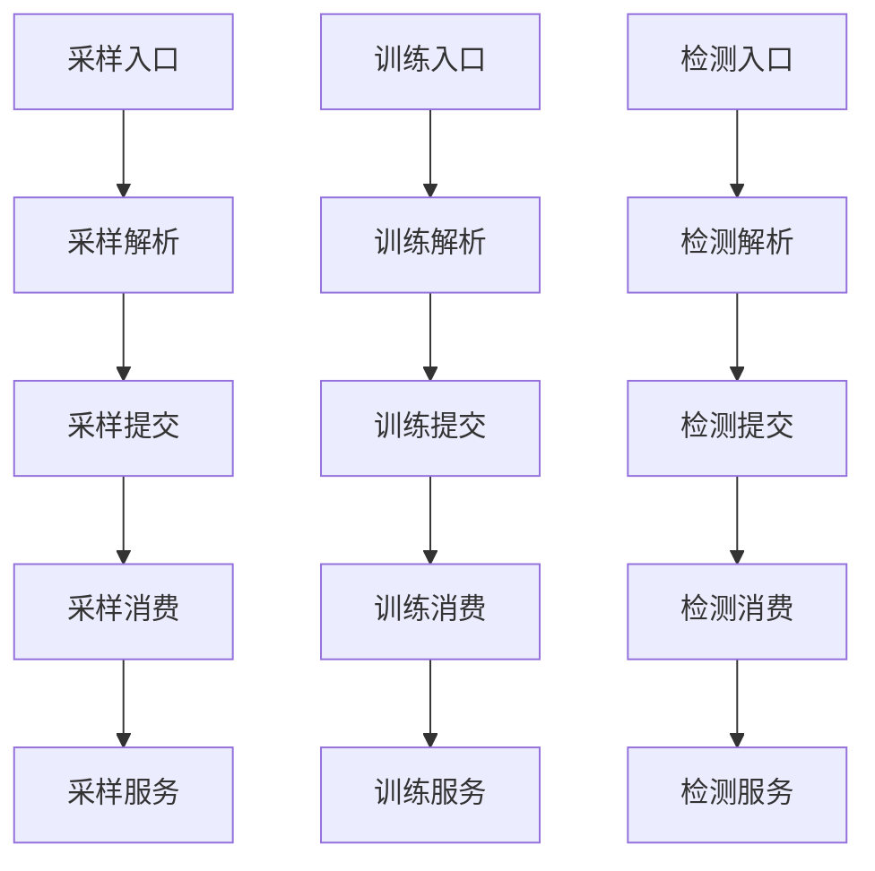

# UDF 入口三服务独立落地方案

> 本文档已被 [UDF 入口直接执行落地方案](./udf入口直接执行落地方案-202607181042.md) 替代，仅保留为设计演进记录。当前工程不再使用异步提交器和文件消费者。

## 一、目标

本方案用于把三个 FMDB 表级入口调整为三条明确链路：

- `F_DW_RAHASAMPLE` 最终只进入 `RahaSampleService.sample`
- `F_DW_RAHATRAIN` 最终只进入 `RahaTrainService.train`
- `F_DW_RAHADETECT` 最终只进入 `RahaDetectService.detect`

调整后不建立按任务类型再次分派的统一执行器，不建立通用阶段列表，也不让三个任务共享任务上下文。三个服务只共享算法组件和数据端口，例如特征准备、聚类、模型仓储、FMDB 读写、文件队列认领能力。

## 二、当前问题定位

当前代码虽然服务层已有 `sample`、`train`、`detect` 三个独立方法，但 UDF 和异步消费侧仍存在统一任务类型分派：

| 位置 | 当前行为 | 问题 |
| --- | --- | --- |
| `AbstractRahaTableUdf` | 通过 `RahaTaskType` 解析并提交统一请求 | 入口仍依赖任务类型字段 |
| `RahaUdfRequestParser` | `parse(RahaTaskType, encodedRequest)` | 解析器以任务类型决定字段规则 |
| `RahaUdfRequest` | 保存全部任务字段和 `taskType` | 统一请求对象成为隐性任务上下文 |
| `RahaUdfJobSubmitter` | `submit(RahaUdfRequest request)` | 提交端口仍是统一任务请求 |
| `RahaUdfTaskDispatcher` | `dispatch(RahaUdfRequest request)` | 明确是统一执行分派入口 |
| `FileRahaUdfJobWorker` | 解析文件名任务类型后调用 `dispatcher.dispatch` | 文件消费者再次按任务类型分发 |
| `RahaContainerValidationApplication` | `dispatchUdfTask` 内按 `request.getTaskType()` 分支 | 验收链路仍体现统一分派 |

这些点需要替换为三套强类型请求、三套强类型提交方法、三套文件消费者回调。

## 三、设计原则

1. 入口独立：每个 UDF 类只知道自己的解析方法和提交方法。
2. 请求独立：采样、训练、检测分别拥有自己的 UDF 请求对象。
3. 消费独立：文件队列或仓储队列可以共享认领、幂等、归档机制，但不能共享业务执行器。
4. 服务独立：`RahaSampleService`、`RahaTrainService`、`RahaDetectService` 不接收统一上下文。
5. 组件共享：共享 `StrategyPlanService`、`FeatureService`、`ColumnClusteringService`、仓储、FMDB 端口等算法和数据能力。
6. 阶段编排隔离：旧 `RahaJobOrchestrator`、`StageHandler` 可保留给旧流水线或历史测试，但 UDF 新链路不再调用它们。

## 四、目标链路



图中每条链路独立存在。文件队列、仓储、FMDB 读写属于链路之间可复用的数据端口，不参与业务类型分派。

## 五、请求对象调整

### 5.1 新增公共字段对象

建议新增 `RahaUdfCommonFields`，只承载三类 UDF 共有的输入字段：

- `datasetId`
- `inputReference`
- `sourceType`
- `rowIdColumn`
- `snapshotId`
- `idempotencyKey`
- `caller`
- `resultTable`

该对象不是任务上下文，不包含任务类型，不包含阶段状态，不包含运行期属性表。它只负责字段校验和公共转换，例如 `toDataLoadRequest`。

### 5.2 新增采样请求

新增 `RahaSampleUdfRequest`：

- 持有 `RahaUdfCommonFields`
- 持有 `labelingBudget`
- 固定返回任务类型 `RahaTaskType.SAMPLE`
- 固定返回作业类型 `JobType.SAMPLING`
- 生成采样专属规范配置文本
- 生成采样专属文件请求正文

采样请求禁止携带 `annotationReference` 和 `modelVersion`。

### 5.3 新增训练请求

新增 `RahaTrainUdfRequest`：

- 持有 `RahaUdfCommonFields`
- 持有 `annotationReference`
- 固定返回任务类型 `RahaTaskType.TRAIN`
- 固定返回作业类型 `JobType.TRAINING`
- 生成训练专属规范配置文本
- 生成训练专属文件请求正文

训练请求禁止携带 `labelingBudget` 和 `modelVersion`。

### 5.4 新增检测请求

新增 `RahaDetectUdfRequest`：

- 持有 `RahaUdfCommonFields`
- 持有 `modelVersion`
- 固定返回任务类型 `RahaTaskType.DETECT`
- 固定返回作业类型 `JobType.DETECTION`
- 生成检测专属规范配置文本
- 生成检测专属文件请求正文

检测请求禁止携带 `annotationReference` 和 `labelingBudget`。

### 5.5 旧统一请求处理

`RahaUdfRequest` 不建议继续作为 UDF 主链路请求类型。迁移完成后有两种处理方式：

1. 直接删除，并同步更新全部调用点。
2. 临时保留为废弃兼容类，但新链路不再引用。

建议本轮直接删除，避免后续误用。

## 六、解析器调整

保留 `RahaUdfRequestParser` 作为表单解析工具类，但它不再接收 `RahaTaskType`。

目标方法：

```java
public RahaSampleUdfRequest parseSample(String encodedRequest)
public RahaTrainUdfRequest parseTrain(String encodedRequest)
public RahaDetectUdfRequest parseDetect(String encodedRequest)
```

字段白名单改为三套：

| 方法 | 允许字段 |
| --- | --- |
| `parseSample` | 公共字段、`labelingBudget` |
| `parseTrain` | 公共字段、`annotationReference` |
| `parseDetect` | 公共字段、`modelVersion` |

未知字段仍返回 `UNKNOWN_UDF_ARGUMENT`。字段缺失、格式非法和跨任务字段仍返回 `INVALID_UDF_ARGUMENT`。

## 七、UDF 入口调整

### 7.1 保留公共异常和日志模板

可以改造 `AbstractRahaTableUdf`，让它只负责公共执行模板：

- 记录入口开始日志
- 捕获 `RahaUdfException`
- 捕获未预期提交异常
- 返回 `RahaUdfSubmissionResult.toJson`

但它不能持有 `RahaTaskType`，也不能调用统一 `parser.parse` 或统一 `submit`。

### 7.2 采样入口

`F_DW_RAHASAMPLE` 目标行为：

1. 调用 `parser.parseSample(encodedRequest)`
2. 调用 `submitter.submitSample(request)`
3. 拒绝结果使用 `RahaTaskType.SAMPLE`

### 7.3 训练入口

`F_DW_RAHATRAIN` 目标行为：

1. 调用 `parser.parseTrain(encodedRequest)`
2. 调用 `submitter.submitTrain(request)`
3. 拒绝结果使用 `RahaTaskType.TRAIN`

### 7.4 检测入口

`F_DW_RAHADETECT` 目标行为：

1. 调用 `parser.parseDetect(encodedRequest)`
2. 调用 `submitter.submitDetect(request)`
3. 拒绝结果使用 `RahaTaskType.DETECT`

## 八、提交端口调整

`RahaUdfJobSubmitter` 改为三方法接口：

```java
RahaUdfSubmissionResult submitSample(RahaSampleUdfRequest request);
RahaUdfSubmissionResult submitTrain(RahaTrainUdfRequest request);
RahaUdfSubmissionResult submitDetect(RahaDetectUdfRequest request);
```

这样每个入口编译期只能提交自己的请求类型，不需要在提交器里判断任务类型。

`RuntimeRahaUdfJobSubmitter` 同步改成三方法代理：

- 优先使用 `RahaUdfRuntime.currentSubmitter`
- 其次使用系统属性创建的文件提交器
- 最后使用 `RahaUdfRuntime.requireSubmitter`

代理内部不判断任务类型，只转发对应方法。

## 九、仓储提交器调整

`RepositoryBackedRahaUdfJobSubmitter` 改成三条公开方法：

- `submitSample(RahaSampleUdfRequest request)`
- `submitTrain(RahaTrainUdfRequest request)`
- `submitDetect(RahaDetectUdfRequest request)`

内部可以保留私有泛化方法，前提是私有方法不按任务类型分派，只接收调用方已确定的参数：

```java
private RahaUdfSubmissionResult submitRequest(
        RahaUdfCommonFields common,
        RahaTaskType taskType,
        JobType jobType,
        String canonicalConfiguration,
        String resultTable)
```

该私有方法属于仓储端口复用，不是业务统一执行器。它只处理幂等、配置版本、任务记录、FMDB 状态写入。

## 十、文件提交器调整

`FileRahaUdfJobSubmitter` 改成三条公开方法：

- `submitSample(RahaSampleUdfRequest request)`
- `submitTrain(RahaTrainUdfRequest request)`
- `submitDetect(RahaDetectUdfRequest request)`

内部可复用私有文件写入方法：

```java
private RahaUdfSubmissionResult writeRequest(
        RahaUdfCommonFields common,
        RahaTaskType taskType,
        String canonicalConfiguration,
        String encodedRequest)
```

文件名仍使用：

- `<idempotencyKey>-sample.request`
- `<idempotencyKey>-train.request`
- `<idempotencyKey>-detect.request`

回执继续写入：

- `jobId`
- `taskType`
- `datasetId`
- `configVersion`
- `submittedAt`

该文件写入方法只复用文件系统端口，不做任务类型分派。

## 十一、文件消费者调整

### 11.1 删除统一分发器

删除或废弃 `RahaUdfTaskDispatcher`。新链路不再出现：

```java
String dispatch(RahaUdfRequest request)
```

### 11.2 建立三类消费者回调

新增三个函数式接口：

```java
String execute(RahaSampleUdfRequest request)
String execute(RahaTrainUdfRequest request)
String execute(RahaDetectUdfRequest request)
```

建议命名：

- `RahaSampleUdfTaskConsumer`
- `RahaTrainUdfTaskConsumer`
- `RahaDetectUdfTaskConsumer`

### 11.3 建立文件队列基类或端口

可以把现有 `FileRahaUdfJobWorker` 拆为：

- `FileRahaUdfQueuePort`：负责扫描、租约、恢复、归档、成功失败状态写入。
- `FileRahaSampleJobWorker`：只扫描 `*-sample.request`，调用 `parseSample` 和采样消费者。
- `FileRahaTrainJobWorker`：只扫描 `*-train.request`，调用 `parseTrain` 和训练消费者。
- `FileRahaDetectJobWorker`：只扫描 `*-detect.request`，调用 `parseDetect` 和检测消费者。

如果希望少建类，也可以保留一个包内私有抽象基类，例如 `AbstractFileRahaUdfJobWorker<T>`，但三个公开 worker 必须是独立类型，且不能暴露任务类型分派接口。

### 11.4 运行方式

组合运行时可以显式创建三类 worker：

```java
FileRahaSampleJobWorker sampleWorker = ...
FileRahaTrainJobWorker trainWorker = ...
FileRahaDetectJobWorker detectWorker = ...
```

按业务依赖顺序调用：

1. 采样 worker
2. 训练 worker
3. 检测 worker

独立消费者模式下也应分别轮询三类 worker，而不是一个 worker 扫描全部类型再分派。

## 十二、服务适配器调整

建议为三条消费链路分别建立适配器：

| 适配器 | 输入 | 最终服务 |
| --- | --- | --- |
| `RahaSampleTaskConsumer` | `RahaSampleUdfRequest` | `RahaSampleService.sample` |
| `RahaTrainTaskConsumer` | `RahaTrainUdfRequest` | `RahaTrainService.train` |
| `RahaDetectTaskConsumer` | `RahaDetectUdfRequest` | `RahaDetectService.detect` |

适配器负责把 UDF 请求转换为服务请求：

- 加载 FMDB 数据集
- 读取或构造任务配置
- 读取标注数据
- 准备特征和聚类产物
- 加载模型或模型元数据
- 写出结果摘要

适配器之间可以通过仓储或明确状态对象传递产物引用，但不共享统一任务上下文。

## 十三、检测模型版本问题

检测 UDF 要求 `modelVersion`，落地实现已将它贯通到 `RahaDetectRequest` 和 `PublishedColumnModelLoader`。

这里有两个可选方案：

### 13.1 推荐方案

检测请求保留 `modelVersion`，并把它真正落到检测链路：

1. `RahaDetectUdfRequest` 保留 `modelVersion`
2. `RahaDetectRequest` 新增 `modelVersion`
3. `PublishedColumnModelLoader` 支持精确版本和 `PUBLISHED` 选择器
4. `RahaDetectService.detectColumn` 传入模型选择器

精确版本加载器逻辑：

```java
RahaColumnModel metadata = repository.find(datasetId, columnName, modelVersion)
        .orElseThrow(...);
```

之后仍执行模型状态和兼容性校验。若该版本不是已发布状态，应拒绝检测。

整表多字段检测应传入 `PUBLISHED`，加载器对每个字段调用 `findPublished`，返回结果仍记录各字段实际使用的模型版本。

### 13.2 备选方案

如果业务只允许检测当前已发布模型，则删除 UDF 的 `modelVersion` 必填要求，并同步调整文档和调用方。

建议采用推荐方案，因为当前接口已经向调用方暴露了 `modelVersion`。

## 十四、验收应用调整

`RahaContainerValidationApplication` 当前的 `dispatchUdfTask` 需要删除。

建议替换为三个方法：

- `executeSampleUdfTask(RahaSampleUdfRequest request, ...)`
- `executeTrainUdfTask(RahaTrainUdfRequest request, ...)`
- `executeDetectUdfTask(RahaDetectUdfRequest request, ...)`

组合模式中：

1. 提交采样 UDF
2. 调用 `sampleWorker.runOnce`
3. 提交训练 UDF
4. 调用 `trainWorker.runOnce`
5. 提交检测 UDF
6. 调用 `detectWorker.runOnce`

独立消费者模式中：

1. 等待采样完成时只轮询采样 worker
2. 等待训练完成时只轮询训练 worker
3. 等待检测完成时只轮询检测 worker

这样验收应用也不再出现 `request.getTaskType()` 的分支。

## 十五、测试调整

### 15.1 UDF 集成测试

`RahaTableUdfIntegrationTest` 需要更新：

- 测试三类 UDF 分别调用三类提交方法。
- `SerializableStaticSubmitter` 改为三方法实现。
- 失败提交器不能再用单参数 lambda，改为显式实现三方法。
- 参数冲突测试分别使用三类请求。
- 独立注册测试仍验证三个文件分别落盘。

### 15.2 文件 worker 测试

`FileRahaUdfJobWorkerTest` 拆成或改成三类 worker 测试：

- 采样 worker 只处理 `*-sample.request`
- 训练 worker 只处理 `*-train.request`
- 检测 worker 只处理 `*-detect.request`
- 并发认领仍验证同一请求只执行一次
- 租约恢复仍验证运行中文件可恢复
- 不同类型文件不会被错误 worker 处理

### 15.3 解析器测试

新增或扩展解析器测试：

- `parseSample` 缺少 `labelingBudget` 时拒绝
- `parseSample` 携带 `annotationReference` 时拒绝
- `parseTrain` 缺少 `annotationReference` 时拒绝
- `parseTrain` 携带 `modelVersion` 时拒绝
- `parseDetect` 缺少 `modelVersion` 时拒绝
- `parseDetect` 携带 `labelingBudget` 时拒绝
- 超长请求仍拒绝

### 15.4 检测模型版本测试

如果采用推荐方案，需要补充：

- 指定已发布版本可检测
- 指定不存在版本失败
- 指定候选未发布版本失败
- 指定版本存在但模式或特征版本不兼容失败

## 十六、建议实施顺序

1. 新增三个 UDF 请求类和公共字段对象。
2. 改造 `RahaUdfRequestParser` 为三方法解析。
3. 改造 `RahaUdfJobSubmitter` 为三方法接口。
4. 改造 `RuntimeRahaUdfJobSubmitter`、`RahaUdfRuntime`、`RahaUdfRegistrar`。
5. 改造三个 UDF 入口，使入口不再传入 `RahaTaskType`。
6. 改造 `RepositoryBackedRahaUdfJobSubmitter` 和 `FileRahaUdfJobSubmitter`。
7. 新增三类文件 worker 和三类消费者接口。
8. 删除 `RahaUdfTaskDispatcher` 的新链路引用。
9. 改造 `RahaContainerValidationApplication`。
10. 落地检测 `modelVersion` 到服务链路。
11. 更新测试。
12. 运行编译和重点测试。
13. 确认不再存在新链路统一分派调用。

## 十七、关键搜索验收

代码完成后建议执行以下检查：

```powershell
rg "dispatch\\(RahaUdfRequest|RahaUdfTaskDispatcher|request\\.getTaskType\\(\\)" src\\main\\java
rg "parse\\(RahaTaskType|submit\\(RahaUdfRequest" src\\main\\java
rg "new FileRahaUdfJobWorker" src\\main\\java
```

预期结果：

- UDF 新链路不再出现 `RahaUdfTaskDispatcher`
- 不再出现 `parse(RahaTaskType, ...)`
- 不再出现统一 `submit(RahaUdfRequest)`
- 验收应用不再使用 `request.getTaskType()` 分派
- 旧阶段编排测试可以继续存在，但 UDF 新链路不调用

## 十八、验证命令

建议优先运行：

```powershell
mvn -q -DskipTests compile
mvn -q -Dtest=RahaUdfConfigurationTest,RahaTableUdfIntegrationTest,FileRahaUdfJobWorkerTest test
```

如果改动包含检测模型版本链路，继续运行：

```powershell
mvn -q -Dtest=ModelLifecycleIntegrationTest,Iteration7RahaLearningPipelineIntegrationTest,Iteration8ParallelLearningIntegrationTest,Iteration9FmdbPipelineIntegrationTest test
```

最后运行全量测试：

```powershell
mvn -q test
```

## 十九、风险与处理

| 风险 | 影响 | 处理 |
| --- | --- | --- |
| 一次性删除统一请求影响面较大 | 编译错误集中出现 | 先新增强类型请求，再逐步替换调用点 |
| 文件 worker 拆分后轮询顺序不一致 | 验收应用等待逻辑失败 | 组合模式显式按采样、训练、检测顺序运行 |
| 检测 `modelVersion` 真实生效后旧测试失败 | 旧测试只发布当前模型 | 为旧构造补充版本字段，或提供默认已发布版本 |
| 私有公共文件写入方法被误解为统一执行器 | 架构边界不清晰 | 方法仅处理文件端口，不接收业务回调，不调用服务 |
| `RahaTaskType` 仍在结果对象中存在 | 可能误判为上下文共享 | 结果 JSON 和文件命名可保留任务类型，业务执行不依赖它分派 |

## 二十、最终验收标准

1. 三个 UDF 入口编译期分别绑定自己的请求类型和提交方法。
2. 三个文件消费者分别绑定自己的解析方法和服务消费方法。
3. UDF 新链路中不存在统一 `dispatch(RahaUdfRequest)`。
4. UDF 新链路中不存在按 `RahaTaskType` 再选择服务的分支。
5. `RahaSampleService.sample`、`RahaTrainService.train`、`RahaDetectService.detect` 保持强类型请求入口。
6. 三个服务之间不共享任务上下文或阶段属性表。
7. 共享能力仅限算法组件、仓储、FMDB 端口、文件队列端口等基础能力。
8. 检测 UDF 的 `modelVersion` 与实际模型加载行为一致。
9. 相关 UDF、文件 worker、检测模型版本测试通过。
