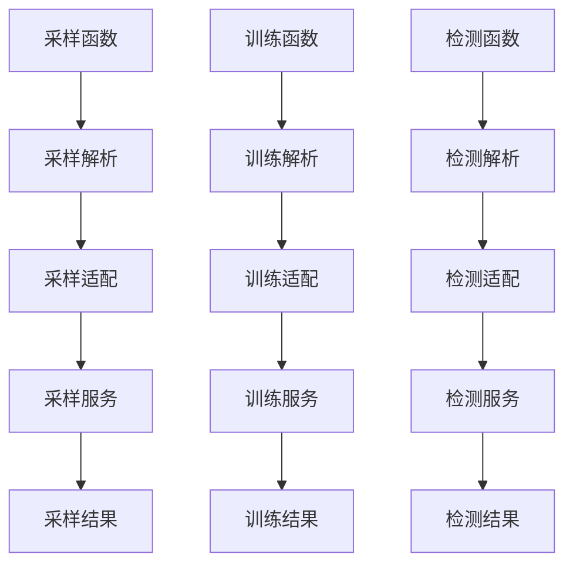

# UDF 入口直接执行落地方案

## 一、目标变更

本方案替代“UDF 先生成任务文件，再由消费程序异步消费”的两阶段方案。

新的目标是：

- `F_DW_RAHASAMPLE` 被调用时直接执行采样链路，并最终进入 `RahaSampleService.sample`
- `F_DW_RAHATRAIN` 被调用时直接执行训练链路，并最终进入 `RahaTrainService.train`
- `F_DW_RAHADETECT` 被调用时直接执行检测链路，并最终进入 `RahaDetectService.detect`

不再生成请求文件，不再启动文件消费者，不再创建只负责入队的提交器，不再返回 `ACCEPTED` 这类异步提交状态。

本工程按新项目处理，不为历史异步提交模式保留兼容层。该删除的删除，避免为了历史包袱继续保留统一提交器、统一分发器和文件队列逻辑。

### 1.1 实施状态

本方案已完成代码落地：

- 三个入口分别绑定 `RahaSampleUdfHandler`、`RahaTrainUdfHandler`、`RahaDetectUdfHandler`。
- 验收应用通过三个独立适配方法分别调用采样、训练、检测服务。
- 已删除异步提交器、运行时提交代理、文件队列、文件消费者和异步提交状态。
- 已删除通用阶段编排、阶段上下文、阶段处理器、阶段仓储和阶段检查点。
- UDF 返回值已替换为 `RahaUdfExecutionResult`，状态为 `SUCCEEDED`、`PARTIAL_SUCCESS`、`FAILED` 或 `REJECTED`。

## 二、核心设计边界

1. 三个 UDF 入口独立。
2. 三个 UDF 请求对象独立。
3. 三个直接执行适配器独立。
4. 不建立按任务类型分派的统一执行器。
5. 不建立通用阶段列表。
6. 不共享任务上下文或阶段属性表。
7. 只共享算法组件和数据端口。
8. 函数调用返回执行结果，而不是异步提交回执。

共享允许存在于以下层面：

- FMDB 数据读取端口
- FMDB 结果写出端口
- 仓储端口
- 配置构造端口
- 特征准备服务
- 聚类服务
- 采样服务
- 训练服务
- 检测服务
- 模型加载和模型仓储

不允许共享以下内容：

- `RahaUdfRequest` 这种跨任务统一请求
- `RahaUdfJobSubmitter` 这种跨任务统一提交器
- `RahaUdfTaskDispatcher` 这种按任务类型分派器
- `FileRahaUdfJobWorker` 这种扫描所有任务类型的消费者
- `StageExecutionContext` 这类通用阶段上下文进入新 UDF 链路

## 三、目标执行链路



图中的“适配”只负责把 UDF 表单参数转换成服务输入，并调用对应服务。它不是统一执行器，也不根据任务类型选择服务。

## 四、函数返回语义

旧语义：

- UDF 返回 `ACCEPTED`
- 任务未执行
- 文件消费者稍后执行
- 调用方需要查文件或任务表确认完成

新语义：

- UDF 调用期间完成业务执行
- 返回 `SUCCEEDED`、`PARTIAL_SUCCESS`、`FAILED` 或 `REJECTED`
- 返回结果中包含结果位置、统计摘要和错误码
- 不返回 `ACCEPTED`、`DUPLICATE` 这类异步提交状态

建议新增 `RahaUdfExecutionResult`，替代 `RahaUdfSubmissionResult`。

字段建议：

| 字段 | 说明 |
| --- | --- |
| `jobId` | 本次执行标识，优先使用 `idempotencyKey` 或由适配器生成 |
| `taskType` | 结果标识用任务类型，不用于分派 |
| `status` | 执行状态，取值对齐 `RahaTaskStatus` |
| `resultLocation` | FMDB 结果表或仓储位置 |
| `configVersion` | 请求和配置的稳定版本 |
| `summary` | 不包含原始数据的结果摘要 |
| `errorCode` | 失败或拒绝错误码 |
| `errorMessage` | 脱敏错误摘要 |
| `startedAt` | 执行开始时间 |
| `finishedAt` | 执行结束时间 |

解析失败返回 `REJECTED`。服务执行失败返回 `FAILED`。服务部分成功返回 `PARTIAL_SUCCESS`。

## 五、请求对象调整

### 5.1 新增公共字段对象

新增 `RahaUdfCommonFields`，只保存三类 UDF 的公共输入字段：

- `datasetId`
- `inputReference`
- `sourceType`
- `rowIdColumn`
- `snapshotId`
- `idempotencyKey`
- `caller`
- `resultTable`

该对象不是任务上下文，不保存任务类型，不保存阶段状态，不保存运行时属性表。

### 5.2 新增采样请求

新增 `RahaSampleUdfRequest`：

- `RahaUdfCommonFields common`
- `int labelingBudget`

职责：

- 校验采样专属参数
- 生成采样配置版本材料
- 转换公共数据加载参数

### 5.3 新增训练请求

新增 `RahaTrainUdfRequest`：

- `RahaUdfCommonFields common`
- `String annotationReference`

职责：

- 校验训练专属参数
- 生成训练配置版本材料
- 转换公共数据加载参数

### 5.4 新增检测请求

新增 `RahaDetectUdfRequest`：

- `RahaUdfCommonFields common`
- `String modelVersion`

职责：

- 校验检测专属参数
- 生成检测配置版本材料
- 转换公共数据加载参数

## 六、解析器调整

保留 `RahaUdfRequestParser` 名称也可以，但方法必须变成三条强类型解析：

```java
public RahaSampleUdfRequest parseSample(String encodedRequest)
public RahaTrainUdfRequest parseTrain(String encodedRequest)
public RahaDetectUdfRequest parseDetect(String encodedRequest)
```

不再存在：

```java
parse(RahaTaskType taskType, String encodedRequest)
```

字段白名单按入口拆分：

| 入口 | 允许字段 |
| --- | --- |
| 采样 | 公共字段、`labelingBudget` |
| 训练 | 公共字段、`annotationReference` |
| 检测 | 公共字段、`modelVersion` |

未知字段继续抛出 `UNKNOWN_UDF_ARGUMENT`。缺少必填字段、字段格式不合法、传入其他任务字段时继续抛出 `INVALID_UDF_ARGUMENT`。

## 七、UDF 入口调整

### 7.1 `F_DW_RAHASAMPLE`

目标行为：

1. 接收表单编码字符串。
2. 调用 `parseSample`。
3. 调用采样直接执行适配器。
4. 适配器调用 `RahaSampleService.sample`。
5. 返回采样执行结果 JSON。

入口不再构造 `RuntimeRahaUdfJobSubmitter`。

### 7.2 `F_DW_RAHATRAIN`

目标行为：

1. 接收表单编码字符串。
2. 调用 `parseTrain`。
3. 调用训练直接执行适配器。
4. 适配器调用 `RahaTrainService.train`。
5. 返回训练执行结果 JSON。

入口不再构造 `RuntimeRahaUdfJobSubmitter`。

### 7.3 `F_DW_RAHADETECT`

目标行为：

1. 接收表单编码字符串。
2. 调用 `parseDetect`。
3. 调用检测直接执行适配器。
4. 适配器调用 `RahaDetectService.detect`。
5. 返回检测执行结果 JSON。

入口不再构造 `RuntimeRahaUdfJobSubmitter`。

## 八、直接执行适配器

建议新增三个单任务接口，避免统一执行器：

```java
public interface RahaSampleUdfHandler {
    RahaUdfExecutionResult handle(RahaSampleUdfRequest request);
}
```

```java
public interface RahaTrainUdfHandler {
    RahaUdfExecutionResult handle(RahaTrainUdfRequest request);
}
```

```java
public interface RahaDetectUdfHandler {
    RahaUdfExecutionResult handle(RahaDetectUdfRequest request);
}
```

三个默认实现建议分别命名：

- `DefaultRahaSampleUdfHandler`
- `DefaultRahaTrainUdfHandler`
- `DefaultRahaDetectUdfHandler`

每个默认实现只持有自己需要的依赖，不通过 `RahaTaskType` 选择服务。

## 九、采样直接执行适配器职责

`DefaultRahaSampleUdfHandler` 建议职责：

1. 记录采样开始日志。
2. 通过公共数据端口加载 FMDB 数据集。
3. 生成或读取采样配置。
4. 执行策略和特征准备。
5. 调用 `RahaSampleService.sample`。
6. 写出标注任务或结果摘要到 `resultTable`。
7. 返回 `RahaUdfExecutionResult`。

采样链路可以复用：

- `RahaFeaturePreparationService`
- `ColumnClusteringService`
- `SamplingService`
- FMDB 数据加载器
- FMDB 结果写出器
- 仓储端口

## 十、训练直接执行适配器职责

`DefaultRahaTrainUdfHandler` 建议职责：

1. 记录训练开始日志。
2. 通过公共数据端口加载 FMDB 数据集。
3. 读取 `annotationReference` 对应标注数据。
4. 生成训练配置。
5. 执行策略和特征准备。
6. 调用 `RahaTrainService.train`。
7. 保存模型字典、候选模型和必要元数据。
8. 写出训练结果摘要到 `resultTable`。
9. 返回 `RahaUdfExecutionResult`。

训练链路可以复用：

- `StrategyPlanService`
- `StrategyExecutionService`
- `FeatureService`
- `ColumnClusteringService`
- `LabelPropagationService`
- `ColumnModelTrainer`
- `ColumnModelStore`
- `ModelReleaseManager`
- FMDB 数据和结果端口

## 十一、检测直接执行适配器职责

`DefaultRahaDetectUdfHandler` 建议职责：

1. 记录检测开始日志。
2. 通过公共数据端口加载 FMDB 数据集。
3. 生成检测配置。
4. 执行或读取检测所需特征。
5. 使用 `modelVersion` 加载指定已发布模型。
6. 调用 `RahaDetectService.detect`。
7. 写出检测结果到 `resultTable`。
8. 返回 `RahaUdfExecutionResult`。

检测链路可以复用：

- `RahaFeaturePreparationService`
- `PublishedColumnModelLoader`
- `ColumnModelPredictor`
- `DetectionResultRepository`
- FMDB 数据和结果端口

## 十二、检测模型版本必须真实生效

检测 UDF 的 `modelVersion` 已贯通到检测服务和模型加载器。该字段实际定义为模型选择器：

- 传入具体版本时，严格加载该版本，版本不存在、未发布或不兼容时失败。
- 传入固定值 `PUBLISHED` 时，整表检测按字段加载各自当前已发布模型。

使用 `PUBLISHED` 是因为列级训练会为不同字段产生不同模型版本，单个精确版本无法表示整表多字段模型集合。

需要调整：

| 文件 | 调整 |
| --- | --- |
| `RahaDetectRequest.java` | 新增 `modelVersion` 字段 |
| `RahaDetectService.java` | 调用加载器时传入 `modelVersion` |
| `PublishedColumnModelLoader.java` | 新增按版本加载方法 |
| `ModelMetadataRepository.java` | 已有 `find(datasetId, columnName, modelVersion)` 可复用 |
| `DefaultModelMetadataRepository.java` | 通常无需新增方法 |

加载规则：

1. 指定版本必须存在。
2. 指定版本必须是已发布状态。
3. 指定版本必须通过模式、特征字典和策略版本兼容校验。
4. 具体版本不允许静默回退到其他已发布版本。
5. `PUBLISHED` 选择器返回每个字段实际使用的发布版本。

## 十三、注册方式调整

`RahaUdfRegistrar` 不再接收 `RahaUdfJobSubmitter`。

建议改为：

```java
public void register(SparkSession sparkSession,
                     RahaSampleUdfHandler sampleHandler,
                     RahaTrainUdfHandler trainHandler,
                     RahaDetectUdfHandler detectHandler)
```

注册时分别创建：

- `new F_DW_RAHASAMPLE(sampleHandler)`
- `new F_DW_RAHATRAIN(trainHandler)`
- `new F_DW_RAHADETECT(detectHandler)`

如果工程不要求通过 `CREATE TEMPORARY FUNCTION ... AS 'className'` 的无参类名注册，则建议删除无参构造器和 `RahaUdfRuntime`，只保留显式注册方式。

如果必须保留无参类名注册，则需要一个运行时保存三个 handler 的机制。但这会增加静态运行时复杂度，不符合“新工程不背历史包袱”的方向，本方案建议不保留。

## 十四、必须删除的文件

以下文件属于两阶段提交、文件队列、统一提交或统一分发链路，建议删除：

| 文件 | 删除原因 |
| --- | --- |
| `src/main/java/com/fiberhome/ml/raha/udf/FileRahaUdfJobSubmitter.java` | 文件入队提交器，不再生成请求文件 |
| `src/main/java/com/fiberhome/ml/raha/udf/FileRahaUdfJobWorker.java` | 文件消费者，不再异步消费 |
| `src/main/java/com/fiberhome/ml/raha/udf/RahaUdfTaskDispatcher.java` | 统一任务分发器，与目标冲突 |
| `src/main/java/com/fiberhome/ml/raha/udf/RepositoryBackedRahaUdfJobSubmitter.java` | 只创建仓储任务，不直接执行业务 |
| `src/main/java/com/fiberhome/ml/raha/udf/RuntimeRahaUdfJobSubmitter.java` | 运行时提交代理，依赖旧提交器 |
| `src/main/java/com/fiberhome/ml/raha/udf/RahaUdfJobSubmitter.java` | 统一提交接口，改为三类 handler |
| `src/main/java/com/fiberhome/ml/raha/udf/RahaUdfSubmissionStatus.java` | 异步提交状态不再适用 |
| `src/main/java/com/fiberhome/ml/raha/udf/RahaUdfSubmissionResult.java` | 异步提交回执不再适用 |
| `src/test/java/com/fiberhome/ml/raha/udf/FileRahaUdfJobWorkerTest.java` | 文件消费者测试不再适用 |

`RahaUdfRuntime.java` 建议删除。如果最终确认必须支持无参类名注册，则可以重建为直接执行 handler 运行时，但不要保留旧提交器语义。

## 十五、必须修改的文件

| 文件 | 修改内容 |
| --- | --- |
| `F_DW_RAHASAMPLE.java` | 改为解析采样请求并直接调用采样 handler |
| `F_DW_RAHATRAIN.java` | 改为解析训练请求并直接调用训练 handler |
| `F_DW_RAHADETECT.java` | 改为解析检测请求并直接调用检测 handler |
| `AbstractRahaTableUdf.java` | 改为公共异常、日志和 JSON 模板，或删除后让三个入口独立实现 |
| `RahaUdfRequestParser.java` | 改为 `parseSample`、`parseTrain`、`parseDetect` |
| `RahaUdfRequest.java` | 删除或拆分为三个强类型请求 |
| `RahaUdfRegistrar.java` | 改为注入三个 handler 并注册三个直接执行函数 |
| `RahaContainerValidationApplication.java` | 删除文件队列、提交端、消费者和等待逻辑，改为直接调用 UDF |
| `RahaUdfConfigurationTest.java` | 更新为三解析方法和函数名测试 |
| `RahaTableUdfIntegrationTest.java` | 更新为直接执行、失败、拒绝和结果 JSON 测试 |
| `RahaDetectRequest.java` | 新增 `modelVersion` |
| `RahaDetectService.java` | 检测加载模型时使用指定版本 |
| `PublishedColumnModelLoader.java` | 新增指定版本加载并校验发布状态 |

## 十六、建议新增的文件

| 文件 | 用途 |
| --- | --- |
| `RahaUdfCommonFields.java` | 保存三类 UDF 公共字段 |
| `RahaSampleUdfRequest.java` | 采样 UDF 强类型请求 |
| `RahaTrainUdfRequest.java` | 训练 UDF 强类型请求 |
| `RahaDetectUdfRequest.java` | 检测 UDF 强类型请求 |
| `RahaUdfExecutionResult.java` | 直接执行结果 JSON |
| `RahaSampleUdfHandler.java` | 采样直接执行接口 |
| `RahaTrainUdfHandler.java` | 训练直接执行接口 |
| `RahaDetectUdfHandler.java` | 检测直接执行接口 |
| `DefaultRahaSampleUdfHandler.java` | 采样默认适配器 |
| `DefaultRahaTrainUdfHandler.java` | 训练默认适配器 |
| `DefaultRahaDetectUdfHandler.java` | 检测默认适配器 |

如果三个默认适配器依赖很多，可以将公共数据端口封装为小对象，例如：

- `RahaUdfDatasetPort`
- `RahaUdfResultPort`
- `RahaUdfConfigPort`

这些是数据端口，不是统一执行器。

## 十七、验收应用调整

`RahaContainerValidationApplication` 当前包含 `runSubmitter`、`runWorkerLifecycle`、`dispatchUdfTask`、`waitForCompletion` 和文件队列目录逻辑。

建议调整为：

1. 删除 `runSubmitter`。
2. 删除 `runWorkerLifecycle` 中的 `queueDirectory` 和 `FileRahaUdfJobWorker`。
3. 删除 `dispatchUdfTask`。
4. 删除 `waitForCompletion`。
5. 删除 `outputDirectory.resolve("udf-requests")` 目录创建。
6. 构造三个默认 handler。
7. 使用 `RahaUdfRegistrar.register` 注册三个函数。
8. 直接调用采样 UDF，调用返回后采样已经完成。
9. 直接调用训练 UDF，调用返回后训练已经完成。
10. 直接调用检测 UDF，调用返回后检测已经完成。

组合验收顺序仍然是采样、训练、检测，但不再通过文件状态衔接。

## 十八、幂等性处理

虽然不再异步提交，但仍建议保留 `idempotencyKey`。原因是 Spark 任务失败重试或调用方重试可能导致函数重复执行。

推荐简化处理：

1. 直接执行适配器开始时计算配置版本。
2. 按 `datasetId + idempotencyKey` 查找直接执行记录。
3. 如果已有相同配置且已成功，直接返回已完成摘要。
4. 如果已有相同幂等键但配置不同，返回 `IDEMPOTENCY_CONFLICT`。
5. 如果已有相同配置但上次失败，允许重新执行或按配置决定。

这不是两阶段任务，因为记录不代表“待消费任务”，只用于防重复和结果追溯。

如果当前阶段希望进一步简化，也可以先不做执行记录，但必须保证结果写出和模型保存具备幂等性。

## 十九、日志要求

每个直接执行入口必须记录：

- UDF 调用开始
- 请求解析成功
- 数据加载开始和结束
- 核心服务调用开始和结束
- 结果写出开始和结束
- 解析拒绝
- 业务失败异常
- 外部依赖失败异常

异常日志必须带上下文和堆栈，至少包含：

- `jobId`
- `datasetId`
- `caller`
- `resultTable`
- 当前入口名称

## 二十、实施顺序

1. 新增三个强类型请求和公共字段。
2. 新增 `RahaUdfExecutionResult`。
3. 改造解析器为三方法。
4. 新增三个 handler 接口。
5. 新增三个默认 handler。
6. 改造三个 UDF 入口。
7. 改造 `RahaUdfRegistrar`。
8. 改造检测模型版本链路。
9. 改造验收应用为直接调用。
10. 删除两阶段相关文件。
11. 更新 UDF 测试。
12. 删除文件消费者测试。
13. 编译并运行重点测试。
14. 执行搜索验收，确保旧链路不存在。

## 二十一、搜索验收

完成后执行：

```powershell
rg "FileRahaUdfJob|RahaUdfJobSubmitter|RahaUdfTaskDispatcher|RuntimeRahaUdfJobSubmitter" src
rg "queue-directory|udf-requests|waitForCompletion|dispatchUdfTask|runSubmitter" src
rg "ACCEPTED|DUPLICATE|RahaUdfSubmission" src
rg "parse\\(RahaTaskType|submit\\(RahaUdfRequest" src
```

预期：

- 不存在文件队列提交器和消费者。
- 不存在统一 UDF 提交器。
- 不存在统一 UDF 分发器。
- 不存在异步提交状态。
- 不存在 `parse(RahaTaskType, ...)`。
- 不存在 `submit(RahaUdfRequest)`。
- 验收应用不再创建 `udf-requests` 目录。

## 二十二、测试建议

优先运行：

```powershell
mvn -q -DskipTests compile
mvn -q -Dtest=RahaUdfConfigurationTest,RahaTableUdfIntegrationTest test
```

检测模型版本落地后运行：

```powershell
mvn -q -Dtest=ModelLifecycleIntegrationTest,Iteration7RahaLearningPipelineIntegrationTest,Iteration8ParallelLearningIntegrationTest,Iteration9FmdbPipelineIntegrationTest test
```

最终运行：

```powershell
mvn -q test
```

## 二十三、最终验收标准

1. UDF 调用返回时对应业务已经执行完成。
2. 代码中不存在文件请求生成和文件消费者。
3. 代码中不存在统一 UDF 提交器。
4. 代码中不存在按任务类型分派到三个服务的统一执行器。
5. 三个入口分别绑定自己的请求类型和 handler。
6. 三个 handler 分别调用自己的服务。
7. 函数返回执行结果，不返回异步提交回执。
8. 检测请求中的 `modelVersion` 真实参与模型加载。
9. 验收应用不再依赖 `udf-requests` 目录。
10. 删除的旧测试不再存在，新增直接执行测试通过。
