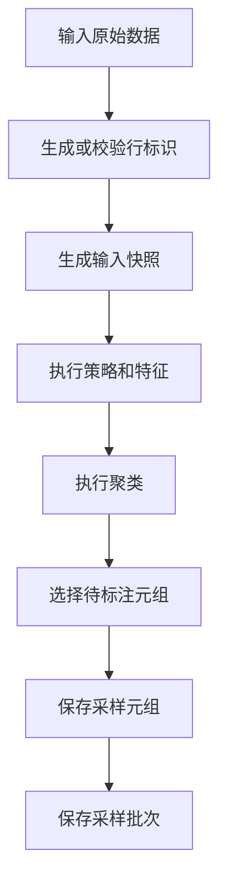
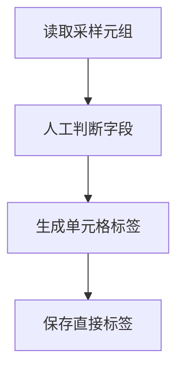
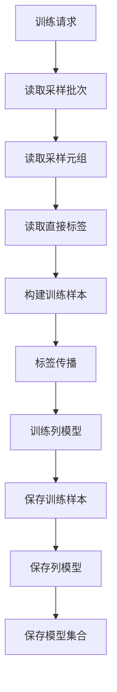
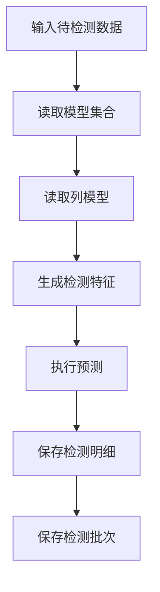
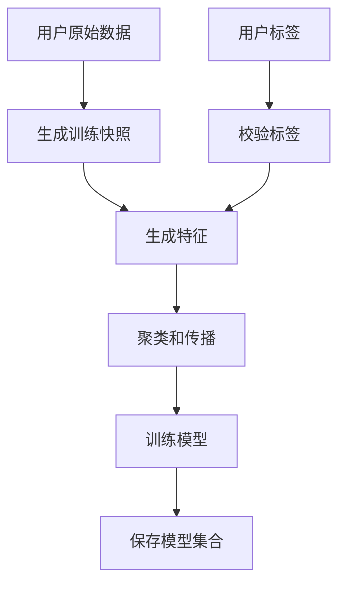

# 采样训练预测闭环数据库可行性分析

## 一、分析结论

基于 `doc/20260718/Raha数据库结构.md` 的表设计，你提出的业务理解是可行的，并且数据库设计已经基本按这个方向在组织：

1. 采样阶段输入原始数据，输出待标注数据。
2. 训练阶段输入采样阶段固化的数据和已标注数据，输出模型训练结果。
3. 预测阶段输入新的待检测数据和指定模型集合，输出预测结果。
4. 如果用户同时提供原始数据和已标注数据，可以跳过采样阶段，直接进入训练阶段。

但是要注意一个关键边界：当前数据库结构不是保存采样阶段的全量原始数据，而是保存采样选中的元组数据，也就是 `dw.raha_sample_tuple.row_data_json`。这能支撑“人工标注”和“基于采样样本训练”，但不能支撑后续训练阶段重新对全量原始数据做完整特征生成，除非训练阶段仍能通过 `input_reference` 和 `snapshot_id` 重新读取同一份输入快照。

因此，完整可行性判断如下：

| 能力 | 当前数据库设计是否支持 | 说明 |
| --- | --- | --- |
| 采样后人工标注 | 支持 | `raha_sample_tuple` 保存 `row_data_json`，标注程序不需要重新读原始表 |
| 训练读取采样产生的标签 | 支持 | `raha_cell_label` 通过 `sample_batch_id, row_id, column_name` 保存直接标签 |
| 训练追溯标签来自哪批采样 | 支持 | 标签表和训练样本表都保留 `sample_batch_id` 或 `source_sample_batch_id` |
| 训练基于采样原始行内容构建样本 | 支持，但限于采样元组 | 可用 `row_data_json` 还原采样行内容 |
| 训练重新处理采样时全量原始数据 | 需要补充快照读取能力 | 必须能按 `snapshot_id` 和 `input_reference` 读回相同数据 |
| 无主键时按序号或内容生成行标识 | 支持设计思路 | 文档已有 `KEY` 和 `CONTENT_GROUP` 两种模式 |
| 用户直接提供原始数据和标签后跳过采样 | 支持，但需要新增训练入口适配 | 需要创建训练批次、校验标签、生成训练样本 |
| 预测其他数据并保存结果 | 支持 | `raha_detection_batch` 和 `raha_detection_result` 已覆盖 |

## 二、推荐的业务闭环

整体流程建议明确为三条主链路。

### 2.1 采样链路



采样阶段的产物重点是：

| 产物 | 表 | 作用 |
| --- | --- | --- |
| 采样批次头 | `dw.raha_sample_batch` | 表示一次采样请求已经完整提交 |
| 待标注元组 | `dw.raha_sample_tuple` | 保存被选中行的内容、行标识、重复数量和采样原因 |

这里最重要的是 `dw.raha_sample_tuple.row_data_json`。它保存采样时给标注人员看的行内容，因此标注阶段不需要重新读取可能已经变化的原始输入。

### 2.2 标注链路



标注阶段写入：

| 产物 | 表 | 作用 |
| --- | --- | --- |
| 人工直接标签 | `dw.raha_cell_label` | 保存某个采样批次、某一行、某一列的人工标签 |

标签不是孤立保存的，它必须和采样批次绑定：

```text
sample_batch_id + row_id + column_name
```

这能避免同一个 `row_id` 在不同采样批次或不同快照中含义混淆。

### 2.3 训练链路



训练阶段写入：

| 产物 | 表 | 作用 |
| --- | --- | --- |
| 模型集合 | `dw.raha_model_set` | 一个完整可用模型版本的提交头 |
| 列模型 | `dw.raha_column_model` | 每个字段一个模型，保存字典和模型参数 |
| 训练样本 | `dw.raha_training_example` | 保存模型实际用过的样本快照，支持追溯和增量训练 |

训练阶段建议强制校验：

1. 所有 `sample_batch_id` 存在。
2. 所有采样批次的 `dataset_id` 一致。
3. 所有采样批次的 `schema_hash` 一致，或满足可兼容规则。
4. 所有采样批次的 `row_identity_mode` 一致。
5. 所有标签都能在采样元组中找到对应的 `row_id`。
6. 标签字段必须在采样批次的 `target_columns_json` 中。
7. `value_hash` 必须和采样元组中的原值计算结果一致。

### 2.4 预测链路



预测阶段写入：

| 产物 | 表 | 作用 |
| --- | --- | --- |
| 检测批次 | `dw.raha_detection_batch` | 表示一次检测已经完整提交 |
| 检测明细 | `dw.raha_detection_result` | 保存单元格预测结果、得分、原因和模型版本 |

## 三、关于原始数据是否必须保存

这个问题要拆成两个层次。

### 3.1 用于标注展示

如果只是为了让标注人员看到被采样的行，数据库设计已经支持。

`dw.raha_sample_tuple.row_data_json` 保存的是采样元组的完整字段和值，例如：

```json
{"order_no":"A20260717001","customer_phone":"1380013800X","amount":"128.50"}
```

标注系统可以直接读取：

```text
dw.raha_sample_batch
dw.raha_sample_tuple
```

然后展示给用户标注，不需要重新读取原始表。

### 3.2 用于训练全量特征重建

如果训练阶段需要重新从原始数据生成完整特征，那么只保存 `row_data_json` 还不够。

原因是 `row_data_json` 只保存被采样的元组，不保存没有被采样的全量原始数据。训练如果只使用人工直接标签对应的采样行，这没问题；但如果训练还要做标签传播，通常需要聚类成员和未标注单元格的特征。

因此有两种可行方案。

#### 方案一：训练只使用采样行和已保存训练样本

这种方案完全贴合当前数据库结构：

```text
raha_sample_tuple.row_data_json
raha_cell_label
raha_training_example
```

训练时根据采样行内容生成特征，结合人工标签构造训练样本。训练完成后，将实际使用的样本写入 `dw.raha_training_example`。后续增量训练直接读取父模型集合的训练样本，不再依赖全量原始数据。

优点：

1. 不需要保存全量原始数据。
2. 存储成本低。
3. 训练样本可追溯。
4. 标注和训练不会因为源表变化而错位。

缺点：

1. 标签传播范围受限，主要围绕采样样本和已物化样本。
2. 无法在训练时重新利用未被采样的全量数据分布。

#### 方案二：采样时保存完整输入快照

这种方案更完整：

```text
采样输入表
  -> 生成 raha_row_id
  -> 保存完整快照表
  -> 采样元组引用该 snapshot_id
```

可以增加一类物理快照，例如：

```text
/fmdb/raha/raha_dataset_snapshot/snapshot_id=snap_orders_20260717_001/
```

或者在 FMDB 中保证 `input_reference + sourceVersion + snapshot_id` 能重新读取相同数据。

优点：

1. 训练可以重新生成全量策略、特征、聚类。
2. 标签传播可以覆盖采样批次对应的完整数据分布。
3. 可以支持更严格的复现和审计。

缺点：

1. 存储成本更高。
2. 需要快照生命周期管理。
3. 需要处理敏感字段和权限。

综合来看，如果系统目标是生产级训练闭环，建议采用方案二；如果目标是轻量级主动学习样本训练，方案一也能成立。

## 四、没有主键时如何处理

数据库结构中已经有 `row_identity_mode`：

| 模式 | 含义 | 适用场景 |
| --- | --- | --- |
| `KEY` | 使用业务主键字段生成 `row_id` | 源表有稳定主键或组合键 |
| `CONTENT_GROUP` | 使用内容分组生成 `row_id` | 源表没有业务主键 |

你提出的“根据序号生成唯一 id”也是一种可能方案，但建议区分三种行标识策略。

### 4.1 业务键模式

当存在稳定字段时，优先使用业务键：

```text
row_id = order_no
```

或者组合键：

```text
row_id = sha256(order_no + "|" + tenant_id)
```

这是最推荐的方式。

### 4.2 内容分组模式

当没有业务键时，可以按整行规范化内容生成：

```text
row_id = rowhash:sha256(normalized_row_json)
```

如果多行内容完全一样，只保存一个采样元组，并用 `duplicate_count` 表示重复数量。

这正好对应数据库文档中的设计：

```text
row_identity_mode = CONTENT_GROUP
duplicate_count = 3
```

这种方式的好处是：即使源表读取顺序变了，相同内容仍然得到相同 `row_id`。

### 4.3 序号模式

如果确实想按行序号生成：

```text
row_id = seq:000000000001
```

它可以工作，但必须满足一个前提：序号是在采样快照写入时生成并固化的，后续训练读取的是同一份已固化快照。

不能使用每次 Spark 读取时临时生成的序号作为长期行标识。因为 Spark 分区、文件顺序、执行计划变化都可能导致序号变化。

如果需要序号模式，建议将它显式设计成第三种模式：

```text
row_identity_mode = SNAPSHOT_SEQUENCE
```

并增加约束：

1. 序号只在快照生成时计算一次。
2. 带序号的数据必须保存为不可变快照。
3. 标签、训练样本、检测结果都引用该快照中的序号。
4. 不允许训练阶段重新从原始表临时编号。

## 五、跳过采样直接训练是否可行

可行，但需要一个独立的训练入口。

用户直接提供：

```text
原始数据
已标注数据
```

系统可以跳过采样阶段，直接走：



但直接训练入口必须补齐采样阶段原本提供的几个契约。

| 契约 | 采样路径来源 | 直接训练路径如何补齐 |
| --- | --- | --- |
| `dataset_id` | 采样请求 | 训练请求指定 |
| `snapshot_id` | 采样批次 | 训练时生成或指定 |
| `row_identity_mode` | 采样批次 | 训练请求指定或系统推断 |
| `row_id` | 采样行 | 原始数据中已有或训练时生成 |
| `row_data_json` | 采样元组 | 可选，若需要追溯则保存训练样本来源行 |
| `cell_label` | 标注采样任务 | 用户上传标签 |
| `schema_hash` | 采样输入 | 训练输入计算 |
| `target_columns_json` | 采样请求 | 训练请求或标签字段推导 |

如果直接训练也要写入 `dw.raha_training_example`，必须能够把用户标签关联到训练特征：

```text
snapshot_id + row_id + column_name
```

因此用户提供的标签格式建议至少包含：

| 字段 | 是否必填 | 说明 |
| --- | --- | --- |
| `row_id` | 是 | 和训练数据中的行标识一致 |
| `column_name` | 是 | 被标注字段 |
| `label` | 是 | `0` 正常，`1` 错误 |
| `value_hash` | 建议必填 | 用于校验标签对应的原值没有错位 |
| `annotator` | 可选 | 标注人或来源 |
| `labeled_at` | 可选 | 标注时间 |

如果用户原始数据没有 `row_id`，系统可以生成，但标签也必须基于同一套生成规则。否则无法可靠对齐。

## 六、和当前代码实现的匹配度

当前代码已经具备不少基础能力，但和数据库文档中的生产闭环还有差距。

### 6.1 已具备能力

| 能力 | 代码位置 | 说明 |
| --- | --- | --- |
| 文件和 FMDB 加载抽象 | `RahaDatasetLoader` | 统一返回 `LoadedDataset` |
| 行标识校验 | `RowIdValidator` | 要求行标识存在、非空、唯一 |
| 模式哈希 | `SchemaHasher` | 根据字段顺序、名称、类型、可空性生成 |
| 快照元数据 | `SnapshotMetadataFactory` | 生成 `DatasetSnapshot` |
| 采样任务 | `SamplingService` | 根据聚类覆盖生成 `AnnotationTask` |
| 标签对象 | `CellLabel` | 保存单元格标签和来源 |
| 标签传播 | `LabelPropagationService` | 使用聚类和直接标签生成传播标签 |
| 训练样本构建 | `ColumnTrainingDataBuilder` | 通过 `cellId` 关联特征和标签 |
| 检测结果写入 | `SparkSqlFmdbResultWriter` | 当前能写任务状态和检测明细 |

### 6.2 主要差距

| 差距 | 影响 | 建议 |
| --- | --- | --- |
| 缺少采样批次业务表适配器 | 无法按 `sample_batch_id` 读取可标注批次 | 新增 `SampleBatchRepository` |
| `AnnotationTask` 不保存 `row_data_json` | 标注程序无法仅靠任务展示完整行内容 | 新增采样元组领域对象或扩展任务对象 |
| 当前仓储以 `jobId` 为主 | 数据库文档以业务批次和模型集合为主 | 引入 `sample_batch_id`、`model_set_version`、`detection_batch_id` |
| 直接标签仓储保存直接和传播标签 | 数据库文档要求 `raha_cell_label` 只保存人工直接标签 | 拆分直接标签持久化和传播过程内存结果 |
| 缺少训练样本表写入 | 增量训练和可追溯性不足 | 新增 `TrainingExampleRepository` |
| 模型集合与列模型没有完全按文档落表 | 检测难以只靠 `modelSetVersion` 加载完整契约 | 新增 `ModelSetRepository` 和 `ColumnModelRepository` |
| 目前没有全量快照表 | 训练阶段若需全量重建特征会受限 | 增加快照存储或明确只训练采样样本 |
| 无主键自动生成策略未落地 | 无主键现实数据无法直接进入流程 | 增加 `RowIdentityService` |

## 七、推荐补充的核心设计

### 7.1 增加行身份服务

建议新增 `RowIdentityService`，统一负责生成和校验行标识。

支持模式：

| 模式 | 说明 |
| --- | --- |
| `KEY` | 根据用户指定业务键生成 |
| `CONTENT_GROUP` | 根据规范化整行内容哈希生成 |
| `SNAPSHOT_SEQUENCE` | 根据固化快照内序号生成 |

其中 `SNAPSHOT_SEQUENCE` 只能在保存快照后使用，不能每次临时生成。

### 7.2 增加采样元组领域对象

当前 `AnnotationTask` 只保存：

```text
taskId
jobId
rowId
coveredClusters
samplingVersion
status
```

数据库文档中的 `dw.raha_sample_tuple` 还需要：

```text
sample_batch_id
dataset_id
snapshot_id
duplicate_count
row_data_json
selection_order
selection_score
reason_json
partition_date
```

建议新增对象：

```text
SampleTuple
```

让采样任务和采样元组分开：

1. `SampleTuple` 表示数据库中的待标注行内容。
2. `AnnotationTask` 表示标注流程中的任务状态。

如果希望简化，也可以将 `AnnotationTask` 演进为与 `raha_sample_tuple` 对齐的对象。

### 7.3 增加采样批次仓储

建议新增：

```text
SampleBatchRepository
SampleTupleRepository
```

或者合并为：

```text
SampleRepository
```

提供能力：

1. 创建采样批次。
2. 批量写采样元组。
3. 根据 `sample_batch_id` 读取采样批次。
4. 根据 `sample_batch_id` 读取采样元组。
5. 保证明细先写、头记录后写。
6. 支持请求指纹幂等。

### 7.4 增加训练入口

建议训练服务支持两个入口。

#### 入口一：基于采样批次训练

请求示例：

```json
{
  "datasetId": "orders",
  "sampleBatchIds": [
    "sample_orders_20260717_001",
    "sample_orders_20260717_002"
  ],
  "trainingMode": "FULL",
  "parentModelSetVersion": null
}
```

服务行为：

1. 读取采样批次。
2. 读取采样元组。
3. 读取人工直接标签。
4. 校验快照、模式和行身份一致。
5. 构建特征、聚类和训练样本。
6. 写训练样本、列模型和模型集合。

#### 入口二：基于用户原始数据和标签训练

请求示例：

```json
{
  "datasetId": "orders",
  "inputReference": "ods.orders_labeled",
  "labelReference": "ods.orders_labels",
  "rowIdentityMode": "KEY",
  "rowKeyColumns": [
    "order_no"
  ],
  "trainingMode": "FULL"
}
```

服务行为：

1. 读取用户原始数据。
2. 生成或校验 `row_id`。
3. 读取用户标签。
4. 校验标签能匹配原始数据。
5. 跳过采样任务生成。
6. 直接生成训练样本并训练模型。

### 7.5 增加模型集合仓储

数据库文档强调检测通过 `modelSetVersion` 读取完整模型契约。因此需要模型集合仓储：

```text
ModelSetRepository
ColumnModelRepository
TrainingExampleRepository
```

它们应支持：

1. 写入完整模型集合。
2. 按模型集合读取冻结策略计划。
3. 按模型集合读取全部列模型。
4. 按模型集合读取历史训练样本。
5. 支持增量训练合并父模型样本。

## 八、是否需要保存完整原始数据

建议根据目标能力选择。

### 8.1 如果只训练已采样样本

可以不保存全量原始数据。只保存：

```text
dw.raha_sample_tuple.row_data_json
dw.raha_cell_label
dw.raha_training_example
```

训练使用采样元组内容生成样本即可。

这种方式更轻，但标签传播能力会受限。因为传播需要知道同一聚类里的其他单元格，而这些聚类通常来自全量或较大范围特征。

### 8.2 如果要做完整标签传播和全量特征复现

建议保存完整快照。可以有两种落地方式：

1. 保存带 `row_id` 的完整输入快照表。
2. 保存能稳定读取同一版本输入的 `input_reference + sourceVersion + snapshot_id`。

更推荐第一种，因为它最稳：

```text
dw.raha_dataset_snapshot
```

建议字段：

| 字段 | 说明 |
| --- | --- |
| `snapshot_id` | 快照标识 |
| `dataset_id` | 逻辑数据集 |
| `row_id` | 固化后的行标识 |
| `row_data_json` | 完整行内容 |
| `value_hash_json` | 每列值哈希 |
| `source_reference` | 原始来源 |
| `source_version` | 来源版本 |
| `created_at` | 创建时间 |
| `partition_date` | 分区日期 |

如果不希望增加新表，也可以把完整快照保存为 ORC 路径，并在 `dw.raha_sample_batch` 增加：

```text
snapshot_storage_path
```

## 九、训练样本如何从采样数据构建

训练样本建议通过以下方式构建：

```text
采样元组 row_id + 标签 column_name
  -> 单元格坐标
  -> 计算 cell_id
  -> 生成同一列特征
  -> 写入训练样本
```

示例：

采样元组：

```text
sample_batch_id = sample_orders_001
snapshot_id = snap_orders_001
row_id = rowhash:abc
row_data_json = {"customer_phone":"1380013800X","amount":"128.50"}
```

人工标签：

```text
sample_batch_id = sample_orders_001
row_id = rowhash:abc
column_name = customer_phone
label = 1
```

训练样本：

```text
model_set_version = modelset_orders_001
source_sample_batch_id = sample_orders_001
column_name = customer_phone
snapshot_id = snap_orders_001
row_id = rowhash:abc
value_hash = sha256("1380013800X")
feature_vector_json = {"0":1.0,"7":0.42}
label = 1
label_source = DIRECT
```

这样训练样本已经独立可追溯。后续即使原始表变化，也能知道这个模型到底用了哪些样本、哪些标签和哪些特征。

## 十、对 `row_data_json` 的重要补充

`row_data_json` 是这个设计能支撑无主键采样闭环的关键字段。

它解决两个问题：

1. 标注展示不需要再次读取源表。
2. 内容分组模式下，相同行内容可以只标注一次。

但它也带来两个注意点：

1. 如果包含敏感字段，必须在写入前做权限和脱敏策略设计。
2. 如果训练需要所有未采样行参与聚类传播，`row_data_json` 只保存采样元组还不够。

因此建议明确：

```text
raha_sample_tuple.row_data_json 只保证采样和人工标注闭环。
完整训练复现依赖 dataset snapshot 或 training_example。
```

## 十一、和当前代码对象的映射

| 数据库设计 | 当前代码对象 | 匹配情况 |
| --- | --- | --- |
| `raha_sample_batch` | 暂无直接对象 | 需要新增 |
| `raha_sample_tuple` | `AnnotationTask` 部分覆盖 | 缺少行内容、重复数、批次头关联 |
| `raha_cell_label` | `CellLabel` | 基本匹配，但当前对象支持传播标签 |
| `raha_model_set` | 当前模型发布相关对象部分覆盖 | 需要强化模型集合概念 |
| `raha_column_model` | `RahaColumnModel`、`ColumnModelArtifact` | 部分匹配 |
| `raha_training_example` | `ColumnTrainingExample` | 当前是训练内对象，需持久化 |
| `raha_detection_batch` | 当前检测服务结果摘要部分覆盖 | 需要新增批次头 |
| `raha_detection_result` | `DetectionResult` | 基本匹配，字段名需适配 |

## 十二、可行性风险

### 12.1 行标识稳定性风险

无主键时如果采用临时序号，但没有保存带序号快照，训练会错位。

建议：

1. 优先使用 `KEY`。
2. 无业务键时使用 `CONTENT_GROUP`。
3. 确需序号时使用固化快照序号，不使用临时 Spark 行号。

### 12.2 快照语义风险

`snapshot_id` 必须能证明训练和标注来自同一批数据。不能只生成一个字符串，却没有能力恢复或验证数据内容。

建议：

1. `snapshot_id` 绑定 `schema_hash`、`row_count`、`sourceVersion`。
2. 如果源数据不可版本化，必须保存快照数据本体。

### 12.3 标签错位风险

用户直接上传标签时，最容易出现标签和原始数据不匹配。

建议：

1. 标签必须带 `row_id` 和 `column_name`。
2. 标签最好带 `value_hash`。
3. 训练前校验 `value_hash` 与当前快照对应单元格一致。

### 12.4 存储成本风险

保存完整输入快照会增加存储成本。

建议：

1. 大表只保存训练相关快照。
2. 采样元组长期保存。
3. 完整快照可按模型保留周期清理。
4. 检测输入一般不保存全量，只保存检测结果。

### 12.5 当前代码改造风险

当前代码里不少仓储以 `jobId` 和 `ArtifactVersion` 为核心，而数据库文档以业务批次为核心。

建议：

1. 不直接硬改现有仓储。
2. 新增面向 `sample_batch_id`、`model_set_version`、`detection_batch_id` 的数据库适配器。
3. 保留现有内存仓储用于测试和阶段内编排。

## 十三、推荐落地顺序

### 13.1 第一阶段：打通采样到标注

目标：

```text
原始数据 -> 采样批次 -> 采样元组 -> 人工标签
```

需要实现：

1. `SampleBatch` 领域对象。
2. `SampleTuple` 领域对象。
3. `SampleRepository`。
4. `row_data_json` 生成。
5. `sample_batch_id` 确定性生成。
6. `raha_sample_batch` 和 `raha_sample_tuple` 写入。
7. `raha_cell_label` 直接标签写入。

### 13.2 第二阶段：打通采样到训练

目标：

```text
sampleBatchIds -> labels -> trainingExamples -> modelSet
```

需要实现：

1. 基于 `sampleBatchIds` 的训练请求。
2. 采样批次一致性校验。
3. 标签和采样元组匹配校验。
4. `TrainingExample` 持久化。
5. `ModelSet` 和 `ColumnModel` 持久化。

### 13.3 第三阶段：支持直接训练

目标：

```text
用户原始数据 + 用户标签 -> modelSet
```

需要实现：

1. 用户标签加载器。
2. 行身份生成和校验。
3. 标签值哈希校验。
4. 可选虚拟采样批次或直接训练来源记录。

是否需要虚拟采样批次有两种选择：

| 选择 | 说明 |
| --- | --- |
| 创建虚拟采样批次 | 让所有训练都统一依赖 `sample_batch_id`，模型表结构更简单 |
| 不创建虚拟采样批次 | 训练入口更纯粹，但 `raha_training_example.source_sample_batch_id` 可能为空 |

我更推荐创建虚拟采样批次。这样无论标注来自主动采样还是用户上传，训练链路都统一。

### 13.4 第四阶段：打通模型预测

目标：

```text
modelSetVersion + 检测输入 -> detectionBatch + detectionResult
```

需要实现：

1. 通过 `modelSetVersion` 读取模型集合。
2. 加载冻结策略计划。
3. 加载列模型和特征字典。
4. 检测输入 schema 兼容校验。
5. 写检测明细和检测批次头。

## 十四、建议的最终请求形态

### 14.1 采样请求

```json
{
  "datasetId": "orders",
  "inputReference": "ods.orders_dirty",
  "sourceType": "TABLE",
  "rowIdentityMode": "CONTENT_GROUP",
  "rowKeyColumns": [],
  "targetColumns": [
    "customer_phone",
    "amount"
  ],
  "labelingBudget": 20
}
```

输出：

```json
{
  "sampleBatchId": "sample_orders_20260717_001",
  "snapshotId": "snap_orders_20260717_001",
  "selectedTupleCount": 20
}
```

### 14.2 标注提交请求

```json
{
  "sampleBatchId": "sample_orders_20260717_001",
  "labels": [
    {
      "rowId": "rowhash:8f3a12d9",
      "columnName": "customer_phone",
      "valueHash": "sha256:7bd91e20",
      "label": 1
    }
  ]
}
```

### 14.3 基于采样批次训练请求

```json
{
  "datasetId": "orders",
  "sampleBatchIds": [
    "sample_orders_20260717_001"
  ],
  "trainingMode": "FULL",
  "parentModelSetVersion": null
}
```

输出：

```json
{
  "modelSetVersion": "modelset_orders_20260717_001",
  "modelCount": 2,
  "trainingExampleCount": 128
}
```

### 14.4 用户直接训练请求

```json
{
  "datasetId": "orders",
  "inputReference": "ods.orders_labeled",
  "labelReference": "ods.orders_labels",
  "rowIdentityMode": "KEY",
  "rowKeyColumns": [
    "order_no"
  ],
  "targetColumns": [
    "customer_phone",
    "amount"
  ],
  "trainingMode": "FULL"
}
```

输出仍然是模型集合：

```json
{
  "modelSetVersion": "modelset_orders_20260717_002",
  "modelCount": 2,
  "trainingExampleCount": 96
}
```

### 14.5 检测请求

```json
{
  "datasetId": "orders",
  "inputReference": "ods.orders_dirty_next",
  "modelSetVersion": "modelset_orders_20260717_001",
  "targetColumns": [
    "customer_phone"
  ],
  "errorsOnly": true
}
```

输出：

```json
{
  "detectionBatchId": "detect_orders_20260718_001",
  "detectedCellCount": 126
}
```

## 十五、对现有数据库结构的微调建议

### 15.1 是否增加完整快照表

如果训练阶段必须从采样原始数据重新计算全量特征，建议增加：

```text
dw.raha_dataset_snapshot_row
```

字段建议：

| 字段 | 类型 | 说明 |
| --- | --- | --- |
| `snapshot_id` | `STRING` | 快照标识 |
| `dataset_id` | `STRING` | 逻辑数据集 |
| `row_id` | `STRING` | 固化行标识 |
| `row_data_json` | `STRING` | 完整行内容 |
| `row_hash` | `STRING` | 规范化整行哈希 |
| `created_at` | `BIGINT` | 创建时间 |
| `partition_date` | `STRING` | 分区日期 |

如果不增加该表，那么必须明确训练只依赖采样元组和训练样本，不做全量重建。

### 15.2 直接训练是否创建虚拟采样批次

建议创建虚拟采样批次。

示例：

```text
sample_batch_id = direct_train_orders_20260717_001
source_type = DIRECT_TRAINING
labeling_budget = 0
selected_tuple_count = 用户标签覆盖的行数
```

这样 `dw.raha_cell_label` 和 `dw.raha_training_example` 都仍然能沿用 `sample_batch_id`。

### 15.3 `sample_weight` 与 `duplicate_count`

数据库文档中 `raha_training_example.sample_weight` 示例为 `3.0`，但当前代码 `CellLabel.sampleWeight` 要求大于零且不超过一。这里需要统一语义。

建议：

1. `label_weight` 表示标签置信权重，范围为 `(0, 1]`。
2. `duplicate_count` 表示内容组代表行数。
3. 训练时内部计算 `effective_weight = label_weight * duplicate_count`。
4. 数据库存储可以保留 `sample_weight`，但应说明它允许大于一。

否则代码对象和数据库示例会发生约束冲突。

### 15.4 `value_hash` 的生成规则

建议在数据库设计中补充统一规则：

```text
value_hash = sha256(normalized_string_value)
```

空值、空字符串、数值格式、时间格式都必须有规范化规则。否则标注校验和训练追溯可能不一致。

### 15.5 `cell_id` 是否落列

数据库文档倾向于通过批次、行和列确定性计算 `cell_id`，不单独落列。这是可行的。

但现有代码大量使用 `CellLabel.cellId` 和 `SparseFeatureRow.cellId` 关联。落地时需要在适配层做转换：

```text
dataset_id + snapshot_id + row_id + column_name -> cell_id
```

不一定要把 `cell_id` 存入数据库，但 Java 领域对象中仍然可以保留。

## 十六、最终建议

该数据库结构可以支撑你提出的流程，但建议明确采用下面的产品语义：

1. 采样阶段必须固化“被标注行”的数据内容。
2. 训练阶段必须从采样批次读取标注来源数据，不允许拿变化后的原始表直接训练。
3. 用户提供原始数据和标签时，可以跳过采样，但系统内部最好创建一个虚拟采样批次或训练快照，统一后续模型训练链路。
4. 无主键数据优先使用 `CONTENT_GROUP`，必要时使用固化快照序号，不使用临时 Spark 行号。
5. 若标签传播和训练需要全量数据分布，必须增加完整数据快照保存机制；否则当前 `row_data_json` 只够支撑采样元组级训练。
6. 模型训练完成后，`dw.raha_training_example` 必须保存模型实际使用的训练样本，后续增量训练不应依赖历史临时计算状态。
7. 预测阶段只依赖 `modelSetVersion` 和新的输入数据，不能依赖采样任务运行状态。

一句话总结：这个数据库设计的方向是可行的，并且比当前代码的阶段上下文模型更适合生产闭环；真正落地时，重点要补齐采样批次仓储、采样元组行内容保存、训练样本持久化、模型集合仓储和无主键行身份生成策略。

