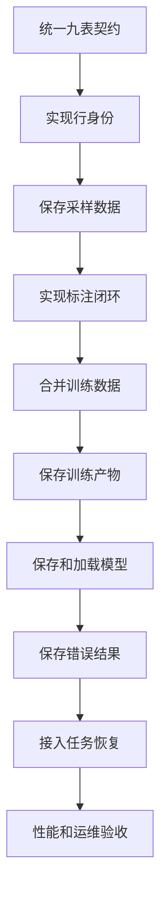

# Raha 采样优先训练未实现功能任务清单

> 审计基线：`doc/20260719/Raha采样数据优先训练数据库设计-202607190950.md`  
> 源码范围：`src/main/java`、`src/main/resources`、`src/test/java`  
> 审计时间：2026-07-19  
> 本文只记录相对设计文档尚未完成或仅部分完成的工作，不重复罗列已经稳定实现的算法能力。

## 一、审计结论

当前工程已经具备 Raha 算法主链路的大部分基础能力，包括数据加载、行标识唯一性校验、列画像、策略生成和执行、稀疏特征、列内聚类、主动采样、标签传播、模型训练、模型预测、任务状态机、内存仓储、FMDB 网关、九表建表脚本以及九表持久化配置。

但是，设计文档要求的“采样数据长期保存、Excel 人工标注、训练时读取 c1 和 o1、c1 优先去重、标签重新映射、训练派生产物按配置入库、模型跨任务加载、只保存错误检测结果”的完整闭环尚未形成。

当前最关键的结论如下：

1. 九张最终物理表的 DDL 已存在，其中五张业务表完全没有写入器，模型表和检测表只有不兼容最终模式的早期写入器。
2. 已有任务、检测和模型写入器仍使用早期字段模式，与九表 SQL 不一致，不能直接写入最终默认表。
3. `repository` 包的默认适配器全部建立在 `InMemoryRahaRepository` 上，进程重启后数据丢失。
4. 数据加载仍强制要求用户提供一个已经存在且唯一的 `rowIdColumn`，未实现联合键和全字段内容哈希行身份。
5. 采样结果目前只保存待标注任务坐标，没有保存 c1 的完整原始行、模式、内容指纹和采样批次。
6. 没有 Excel 标注模板导出、标注文件导入、标注校验、字段标签展开和标注批次追加入库能力。
7. 训练服务直接接收当前数据集和 `List<CellLabel>`，没有读取指定采样批次和标注批次，也没有执行 c1 与 o1 合并。
8. 标签没有从采样快照坐标转换为训练快照坐标，采样 `cell_id` 不能稳定关联训练特征。
9. 训练画像、列级产物、训练单元格和最终训练样本没有按照最终表结构写入 FMDB。
10. `ResultPersistenceStageHandler` 只校验服务返回的逻辑地址，没有验证物理表写入是否完成。
11. 检查点对象和运行器已经存在，但没有接入正式工作流和 FMDB 阶段表。
12. 检测服务仍生成并保存正常和错误两类单元格，且缺少最终表要求的原始值和完整错误行。

因此，当前工程可以运行内存态算法流程和测试流程，但还不能按目标数据库设计提供可重启、可标注、可追溯、可恢复的生产闭环。

## 二、状态定义

| 状态 | 定义 |
| --- | --- |
| 已实现 | 当前代码已经覆盖设计要求，且存在自动化测试 |
| 部分实现 | 已有领域对象或算法，但缺少最终协议、物理持久化、恢复能力或完整测试 |
| 未实现 | 当前代码中没有对应服务、领域对象或适配器 |
| 需重构 | 已有代码使用旧协议，继续叠加会造成双套模型，应直接替换为最终实现 |

优先级定义：

| 优先级 | 定义 |
| --- | --- |
| P0 | 阻塞采样、标注、训练和预测闭环，必须首先完成 |
| P1 | 阻塞跨任务复用、失败恢复、性能或生产可运维性 |
| P2 | 不阻塞首个闭环，但影响大规模运行成本、审计和长期治理 |

本次共拆分 `87` 个任务，其中 `P0` 为 `64` 项、`P1` 为 `20` 项、`P2` 为 `3` 项。`P0` 数量较多的原因是当前缺口覆盖九表契约、行身份、采样、标注、训练合并、模型和检测完整链路，不能通过单独补写某一张表形成正确闭环。

## 三、当前实现基线

| 能力 | 当前状态 | 已有实现 | 与目标设计的差距 |
| --- | --- | --- | --- |
| 文件和 FMDB 数据加载 | 已实现 | `FileRahaDatasetLoader`、`FmdbDatasetLoader` | 只支持已有单字段行标识，未生成统一逻辑行身份 |
| 行标识唯一性校验 | 已实现 | `RowIdValidator` | 校验发生在逻辑去重之前，不支持联合键和内容哈希模式 |
| 列画像 | 已实现 | `ColumnProfiler`、`ColumnProfileService` | 未区分采样画像和训练画像，未写最终列级产物表 |
| 策略、特征和聚类 | 已实现 | `strategy`、`feature`、`cluster` 包 | 结果主要保存到内存仓储，缺少最终 FMDB 物理映射 |
| 主动采样算法 | 部分实现 | `SamplingService`、`TupleSampler` | 只生成 `AnnotationTask`，没有物化 c1 原始行和采样批次 |
| 人工标签对象 | 部分实现 | `CellLabel`、`DirectLabelStageHandler` | 只能由调用方直接传入，缺少 Excel 和标注批次协议 |
| 标签传播 | 已实现 | `LabelPropagationService` | 没有采样坐标到训练坐标的标签转换 |
| 模型训练 | 已实现 | `RahaTrainService`、`ColumnModelTrainer` | 没有 c1 与 o1 合并，也没有冻结最终训练样本表 |
| 模型生命周期 | 部分实现 | `ModelReleaseManager`、`PublishedColumnModelLoader` | 元数据默认只在内存仓储，FMDB 模型表协议不匹配 |
| 模型检测 | 已实现 | `RahaDetectService` | 保存所有预测单元格，结果字段不符合最终错误表 |
| 任务和阶段状态机 | 已实现 | `RahaJobOrchestrator` | 默认仓储是内存实现，最终任务表写入器模式不匹配 |
| 阶段检查点 | 部分实现 | `StageCheckpointRunner` | 仅单元测试使用，没有接入工作流和 FMDB |
| 九表 DDL | 已实现 | `db/fmdb/raha-fmdb-schema.sql` | 只有语法解析测试，没有九表写读契约测试 |
| 九表持久化开关 | 部分实现 | `FmdbPersistenceConfig` | 开关模型已完成，但多数物理写入器尚不存在 |
| 自动建表 | 已实现 | `FmdbSchemaInitializer` | 尚未在真实 FMDB 环境验证表属性和分区行为 |
| Excel 标注闭环 | 未实现 | 无 | 缺少导出、保护、导入、校验、错误回写和修订 |
| c1 与 o1 合并 | 未实现 | 无 | 缺少读取、哈希、逻辑去重、冲突选择、标签映射和日志 |

## 四、必须先处理的契约冲突

### 4.1 任务表模式冲突

`SparkSqlFmdbResultWriter.JOB_SCHEMA` 仍写入早期任务字段，缺少最终 `raha_job_run` 要求的 `state_version`、`result_summary_json`、`updated_at` 和 `partition_month`，同时包含最终表没有的 `written_at`。如果直接指定 `dw.raha_job_run`，网关会因 Spark 模式不一致拒绝写入。

### 4.2 检测表模式冲突

`SparkSqlFmdbResultWriter.DETECTION_SCHEMA` 仍包含 `job_id`、`config_version`、`value_hash`、`masked_value`、`is_error` 等早期字段，最终 `raha_detection_result` 要求 `detection_batch_id`、`input_reference`、`original_value`、`row_data_json`、`error_reason_json` 和 `partition_date`。现有实现不能直接写最终表。

### 4.3 模型和特征字典模式冲突

`FmdbModelStore` 当前使用独立的模型参数表和特征字典明细表。最终设计要求模型写入 `raha_model_artifact`，特征字典写入 `raha_training_column_artifact.feature_dictionary_json`。继续保留旧双表协议会形成第二套数据库结构，应直接重构，不新增兼容分支。

### 4.4 训练样本对象字段不足

`ColumnTrainingExample` 目前只有 `cell_id`、标签、标签来源、特征向量和权重，不能直接生成最终 `raha_training_example` 所需的 `model_set_version`、`training_batch_id`、`dataset_id`、`row_id`、`column_name`、`cell_value`、字典版本、来源标注批次和聚类标识。

### 4.5 检测对象缺少最终展示数据

`DetectionResult` 和 `SparseFeatureRow` 主要保存值哈希或脱敏值。最终错误表必须保存 `original_value` 和 `row_data_json`，需要从受信任的检测输入按行列坐标补充，不能尝试从哈希反推。

## 五、推荐实施顺序

不能先做 Excel 标注再补采样表，也不能先实现训练样本表再补 c1 与 o1 合并。前者缺少稳定关联键，后者会把错误坐标和错误快照固化到训练样本中。

## 六、完整任务清单

### 6.1 里程碑 M0：统一最终九表契约

目标：消除 DDL、领域对象和写入器之间的双套字段模式，建立后续功能唯一可依赖的物理协议。

| 任务编号 | 优先级 | 任务 | 主要交付物 | 依赖 | 验收标准 |
| --- | --- | --- | --- | --- | --- |
| DB-001 | P0 | 为九张最终物理表建立明确的行记录对象和 Spark `StructType` | `fmdb.record` 或同等边界下的九类记录对象、统一字段常量 | 无 | 每个字段名称、类型、可空性和 SQL 完全一致；禁止写入器自行重复定义字段 |
| DB-002 | P0 | 建立稳定 JSON 编解码协议 | `row_data_json`、`column_schema_json`、`annotation_json`、画像、策略、字典、特征、指标和错误原因编解码器 | DB-001 | 使用结构化 JSON 库；键稳定排序；支持空值、数字和字符串；往返测试不丢字段 |
| DB-003 | P0 | 建立批次时间和分区字段生成器 | `partition_month`、`partition_date`、批次创建时间统一工具 | DB-001 | 时区明确；月份和日期格式与 DDL 一致；边界时间有测试 |
| DB-004 | P0 | 扩展 FMDB 网关的列裁剪和条件读取能力 | 支持指定字段和过滤条件的查询接口 | DB-001 | 生产读取不依赖 `SELECT *`；表名和列名仍执行白名单校验；查询记录日志 |
| DB-005 | P0 | 将任务结果写入器改为最终 `raha_job_run` 模式 | 新任务状态记录转换器和写入器 | DB-001、DB-003 | 能向默认任务表追加状态快照；不存在旧 `written_at` 协议；模式契约测试通过 |
| DB-006 | P0 | 将检测结果写入器改为最终 `raha_detection_result` 模式 | 新检测记录转换器和写入器 | DB-001、DB-002、DB-003 | 能写最终错误表全部字段；只写错误记录；空错误批次仍由任务表记录成功 |
| DB-007 | P0 | 重构 `FmdbModelStore` 到最终模型和列级字典协议 | `raha_model_artifact` 写读、从列级产物加载特征字典 | DB-001、DB-002 | 删除旧独立字典明细表假设；同一模型版本不可变；重启后可加载 |
| DB-008 | P0 | 建立九表模式契约测试 | SQL 与 Java 模式逐字段比对测试 | DB-001 至 DB-007 | 九张表全部验证字段顺序、类型和分区列；模式变更只改一处时测试失败 |

M0 完成门槛：现有任务、检测、模型写入器不再使用旧表模式；九表 SQL 成为唯一数据库契约。

### 6.2 里程碑 M1：行身份、规范化和逻辑去重

目标：支持用户提供唯一键和没有唯一键两种输入，并在调用 `RowIdValidator` 前生成唯一逻辑行。

| 任务编号 | 优先级 | 任务 | 主要交付物 | 依赖 | 验收标准 |
| --- | --- | --- | --- | --- | --- |
| RID-001 | P0 | 增加行身份配置模型 | `SOURCE_KEY`、`CONTENT_HASH` 枚举，联合键字段列表，哈希算法和规范版本配置 | DB-002 | 单字段、联合键和无键模式可明确表达；非法组合启动时失败 |
| RID-002 | P0 | 定义业务字段集合和固定字段顺序 | 排除技术列、稳定排序、字段类型描述器 | RID-001 | Spark 分区号、展示行号和加载时间不参与哈希；字段新增或类型变化改变模式哈希 |
| RID-003 | P0 | 实现规范行序列化 | 区分空值和空字符串，规范数值、日期、时间、布尔值和文本 | RID-002 | 文档中的歧义拼接样例不会碰撞；相同逻辑值跨分区得到相同规范文本 |
| RID-004 | P0 | 实现可配置整行指纹 | Spark 表达式或 UDF 生成 `row_content_hash` | RID-003 | 默认 SHA-256；算法名不写入哈希值；同一规范版本结果可复现 |
| RID-005 | P0 | 实现单键和联合键 `row_id` | 唯一键规范化、联合键长度编码和哈希 | RID-003 | 联合键字段顺序固定；键中包含分隔符时不会产生歧义 |
| RID-006 | P0 | 实现内容哈希模式 `row_id` | 无主键时使用 `row_content_hash` 作为逻辑行标识 | RID-004 | 完全重复物理行折叠为一个逻辑行；保存准确 `duplicate_count` |
| RID-007 | P0 | 实现确定性逻辑去重和冲突选择 | `SOURCE_KEY` 和 `CONTENT_HASH` 两套分组规则 | RID-005、RID-006 | 相同联合键不同内容按规范内容哈希确定性选择；多次运行结果一致 |
| RID-008 | P0 | 补充去重指标和安全日志 | 批次级汇总、冲突汇总、限制数量的调试样例 | RID-007 | INFO、WARN、DEBUG 级别符合设计；日志不包含完整原始行和敏感值 |
| RID-009 | P0 | 调整加载和校验顺序 | 先生成行身份和去重，再调用 `RowIdValidator` | RID-007 | 无主键数据能够加载；去重后 `row_id` 非空且唯一；原有显式主键场景不回归 |
| RID-010 | P0 | 增加行身份自动化测试 | 规范化单元测试和 Spark 去重集成测试 | RID-001 至 RID-009 | 覆盖空值、空串、中文、时区、Decimal、联合键冲突、全字段重复和分区变化 |

M1 完成门槛：输入数据不再强制依赖用户提供现成唯一列，且任何下游阶段看到的 `row_id` 都已经唯一。

### 6.3 里程碑 M2：采样批次和 c1 持久化

目标：把主动采样选中的元组从内存任务坐标升级为可长期标注和训练的不可变 c1 数据。

| 任务编号 | 优先级 | 任务 | 主要交付物 | 依赖 | 验收标准 |
| --- | --- | --- | --- | --- | --- |
| SAM-001 | P0 | 建立采样批次和采样行领域对象 | `sample_batch_id`、行身份元数据、模式、采样上下文和原始行 | DB-001、RID-001 | 对象字段可完整映射 `raha_sample_record`，不使用展示行号作为主键 |
| SAM-002 | P0 | 从采样任务回取完整原始行 | 按选中 `row_id` 从受信任数据集提取业务字段 | RID-009 | 每个 `AnnotationTask` 都能找到且只找到一条逻辑行；缺失时任务失败 |
| SAM-003 | P0 | 生成稳定行和列模式 JSON | `row_data_json`、`column_schema_json`、`schema_hash` | DB-002、SAM-002 | JSON 字段顺序稳定；不混入运行时技术列；敏感字段按存储策略处理 |
| SAM-004 | P0 | 实现 `raha_sample_record` 写入器 | 批量追加、业务键幂等、分区字段、表开关 | SAM-001 至 SAM-003 | 采样成功后 c1 全部入库；重复提交不重复写；关闭开关时明确跳过并记录日志 |
| SAM-005 | P0 | 实现 c1 查询仓储 | 按数据集、月份和采样批次列裁剪读取 | DB-004、SAM-004 | 标注页面只读取必要列；训练可读取完整 c1；查询必须带数据集和批次条件 |
| SAM-006 | P0 | 将采样工作流接入物理写入 | 在采样任务成功返回前完成 c1 入库 | SAM-004 | `resultLocation` 指向真实 FMDB 批次；物理写入失败时采样任务不能报告成功 |
| SAM-007 | P1 | 支持用户直接导入已标注原始行 | 固定直接导入采样版本，复用行身份、去重和采样表协议 | SAM-004、ANN-006 | 用户可跳过主动采样，但仍生成标准采样批次和标注批次，不维护第二套训练入口 |
| SAM-008 | P0 | 增加采样持久化测试 | 采样、原始行回取、幂等和重启读取集成测试 | SAM-004 至 SAM-006 | 采样一千行的数量、哈希、原值、模式和任务标识全部一致 |

M2 完成门槛：采样结果不再只存在于 `AnnotationTaskRepository`，任意新进程都能通过 `sample_batch_id` 读取完整 c1。

### 6.4 里程碑 M3：Excel 标注导出、导入和追加存储

目标：提供用户可操作的标注模板，并把标注结果安全转换为标准直接标签。

| 任务编号 | 优先级 | 任务 | 主要交付物 | 依赖 | 验收标准 |
| --- | --- | --- | --- | --- | --- |
| ANN-001 | P0 | 建立标注批次、行标注和导入结果对象 | 批次状态、统计、修订关系、整行标签和字段标签 | SAM-001 | 能完整映射 `raha_annotation_record` 和 `annotation_json` |
| ANN-002 | P0 | 引入并封装 Excel 工作簿组件 | Excel 生成和读取适配器 | SAM-005 | 第三方库版本固定；文件流关闭；大文件采用可控内存方式 |
| ANN-003 | P0 | 实现标注模板导出 | `标注数据`、`标注说明`、`导入校验`、`系统信息` 工作表 | ANN-002 | 冻结表头、筛选、字段顺序、隐藏系统列和展示行号符合设计 |
| ANN-004 | P0 | 实现模板保护和数据有效性 | 锁定业务列，标签下拉，隐藏任务标识和哈希 | ANN-003 | 用户只能编辑标注列；排序后仍按 `_row_id` 导入；列号不参与关联 |
| ANN-005 | P0 | 实现标注文件解析和基础校验 | 模板版本、模式哈希、任务、行标识、内容哈希和重复导入校验 | ANN-001 至 ANN-004 | 文档 20.5 节九项导入校验全部有错误码和测试 |
| ANN-006 | P0 | 实现整行标签向单元格标签展开 | `rowLabel`、`reviewedColumns`、`errorColumns` 到 `CellLabel` 的确定性转换 | ANN-005 | 正常行、异常行、未检查字段的标签语义完全符合文档；不信任用户编辑的隐藏 JSON |
| ANN-007 | P0 | 实现 `raha_annotation_record` 追加写入和查询 | 标注记录写入器、批次查询、最新修订选择 | ANN-001、ANN-006 | 不更新采样表和旧标注；同批元数据完整；逻辑主键幂等 |
| ANN-008 | P1 | 实现部分失败和错误工作簿 | 有效记录入库、无效记录回写错误原因 | ANN-005、ANN-007 | `IMPORTED`、`PARTIAL`、零有效记录三种结果可区分；零有效记录只写运行控制表 |
| ANN-009 | P1 | 实现标注修订 | 新批次引用 `supersedes_batch_id`，训练显式选择版本 | ANN-007 | 旧批次不可变；修订链可查询；循环引用和跨数据集引用被拒绝 |
| ANN-010 | P0 | 增加 Excel 往返和安全测试 | 导出、排序、编辑、导入、篡改、重复和修订测试 | ANN-002 至 ANN-009 | 正常模板往返无标签丢失；修改业务值或隐藏哈希时导入失败 |

M3 完成门槛：用户可以从 c1 导出模板、离线标注、重新导入，并在 FMDB 中形成不可变标注批次。

### 6.5 里程碑 M4：c1 与 o1 合并和标签坐标转换

目标：训练阶段真正使用“保存的采样原始行和标签，加当前原始表”的合并输入。

| 任务编号 | 优先级 | 任务 | 主要交付物 | 依赖 | 验收标准 |
| --- | --- | --- | --- | --- | --- |
| TRN-001 | P0 | 扩展训练请求协议 | `sample_batch_id`、`annotation_batch_id`、o1 引用、行身份配置 | M2、M3 | 训练不再要求调用方直接构造完整 `List<CellLabel>`；批次选择可审计 |
| TRN-002 | P0 | 实现训练批次上下文对象 | `training_batch_id`、`training_snapshot_id`、来源版本、合并版本和计数 | TRN-001 | `training_context_json` 使用明确键名，记录采样数、原始数、去重数和冲突数 |
| TRN-003 | P0 | 读取 c1 和选定标注批次 | c1 数据集、标注行和直接标签加载器 | SAM-005、ANN-007 | 数据集、采样批次和标注批次不一致时训练前失败 |
| TRN-004 | P0 | 校验 c1 与 o1 模式兼容性 | 字段名、类型、顺序和可检测字段校验 | RID-002、TRN-003 | 兼容转换规则明确；缺字段、类型冲突和模式哈希异常有稳定错误码 |
| TRN-005 | P0 | 为 o1 生成与 c1 相同的行身份 | o1 行指纹、逻辑去重和指标 | RID-001 至 RID-009 | c1 和 o1 使用相同算法、字段列表和规范版本；禁止临时切换规则 |
| TRN-006 | P0 | 实现 c1 优先合并 | 小 c1 广播、o1 去重、c1 优先代表行和 C1_ONLY 保留 | TRN-004、TRN-005 | 重复内容只保留 c1；c1 不在 o1 时仍参与训练；没有两个大表互相 Shuffle |
| TRN-007 | P0 | 实现联合键内容冲突处理 | `KEY_CONTENT_CHANGED`、`KEY_CONTENT_CONFLICT` 和确定性代表行 | TRN-006 | 相同键不同内容不阻断训练；选择规则稳定；WARN 只记录汇总和有限样例 |
| TRN-008 | P0 | 生成合并训练快照 | 绑定新 `training_snapshot_id` 和技术 `row_id` 列的 `RahaDataset` | TRN-002、TRN-006 | 合并后 `row_id` 唯一；下游画像、特征和聚类只看到合并代表行 |
| TRN-009 | P0 | 实现标签坐标转换 | 采样行列标签转换为训练快照 `cell_id` | TRN-003、TRN-008 | 使用 `dataset_id + training_snapshot_id + row_id + column_name` 重算；采样 `cell_id` 不直接复用 |
| TRN-010 | P0 | 在训练工作流增加合并阶段 | 新阶段位于加载 o1 后、训练画像前 | TRN-006 至 TRN-009 | `ColumnProfiler`、策略、特征、聚类和传播全部处理合并数据，不处理原始 o1 |
| TRN-011 | P1 | 管理合并数据缓存和释放 | 合理缓存、失败释放、任务完成清理 | TRN-010 | 一个训练任务不重复计算合并；无论成功失败都释放自有缓存 |
| TRN-012 | P0 | 增加合并闭环测试 | SOURCE_KEY、CONTENT_HASH、C1_ONLY、冲突、重复和标签映射测试 | TRN-001 至 TRN-011 | 文档第 13 章示例得到完全一致的合并结果和训练标签 |

M4 完成门槛：训练数据对象必须是 c1 与 o1 合并后的新快照，直接标签能和该快照的特征稳定关联。

### 6.6 里程碑 M5：训练列级产物、单元格和训练样本持久化

目标：按配置保存可复用派生资产，并冻结模型实际使用的样本。

| 任务编号 | 优先级 | 任务 | 主要交付物 | 依赖 | 验收标准 |
| --- | --- | --- | --- | --- | --- |
| ART-001 | P0 | 区分采样画像和训练画像 | 画像用途枚举、画像版本和训练批次关联 | TRN-008 | 采样画像不能自动复用于新训练快照；训练画像携带来源版本和合并版本 |
| ART-002 | P1 | 实现训练画像复用校验 | 校验源版本、模式、合并、画像配置和训练输入指纹 | ART-001 | 任一依赖变化都拒绝缓存；拒绝原因可观测 |
| ART-003 | P0 | 实现 `raha_training_column_artifact` 写入器 | 画像、策略计划、特征字典、聚类和传播摘要 JSON | DB-002、ART-001 | 一批一列一条；五类子开关分别生效；关闭的 JSON 字段为空 |
| ART-004 | P1 | 实现列级产物读取和版本验证 | 按训练批次和字段列裁剪加载 | DB-004、ART-003 | 模型预测能够读取字典；重复训练能够按严格版本复用画像和计划 |
| ART-005 | P0 | 调整训练特征版本 | 纳入训练批次、特征配置版本和策略版本 | TRN-008 | 不同训练合并集合不能误用相同特征版本；字典版本可稳定复现 |
| ART-006 | P0 | 建立训练单元格物化记录 | 合并特征、聚类、直接标签、传播标签和来源信息 | ART-005、TRN-009 | 每个记录能完整映射 `raha_training_cell`；热字段不塞入解释 JSON |
| ART-007 | P0 | 从可信训练输入补充 `cell_value` | 按训练快照、行和列回取原值 | ART-006 | 不使用 `valueHash` 替代原值；找不到原值时拒绝写入；敏感值受权限控制 |
| ART-008 | P1 | 实现训练单元格写读和开关 | 分区批量写、幂等、按列读取和关闭时纯内存运行 | ART-006、ART-007 | 默认关闭时不触发 FMDB 写入；开启后可从失败阶段恢复传播和训练 |
| ART-009 | P0 | 扩展最终训练样本记录 | 增加行列坐标、原值、字典、标注批次、聚类和模型集合字段 | ART-006 | 不依赖当前字段不足的 `ColumnTrainingExample` 直接拼表；来源可追溯 |
| ART-010 | P0 | 生成模型集合预版本并实现 `raha_training_example` 写读 | 训练前按输入和模型配置生成 `model_set_version`，冻结最终标签、特征和权重 | ART-009 | 只保存实际入模样本；写入前模型集合版本已经确定；不依赖后续更新补字段 |
| ART-011 | P0 | 将冻结训练样本接入模型训练 | 按模型集合和列读取已经冻结的训练样本并执行训练 | ART-010 | 物理写入失败时不开始模型发布；模型指标中的正负样本数与表中一致 |
| ART-012 | P1 | 实现派生产物检查点恢复 | 从列级产物、训练单元格或训练样本恢复对应阶段 | ART-004、ART-008、ART-010 | 输入版本一致时跳过计算；不一致时重新计算且不覆盖旧批次 |

M5 完成门槛：画像、字典和最终训练样本默认落库；大规模训练单元格按开关选择落库，并能实际用于失败恢复。

### 6.7 里程碑 M6：最终模型和错误检测结果闭环

目标：模型和检测结果完全使用最终物理表协议，并支持进程重启后的预测。

| 任务编号 | 优先级 | 任务 | 主要交付物 | 依赖 | 验收标准 |
| --- | --- | --- | --- | --- | --- |
| MOD-001 | P0 | 建立模型集合领域对象 | 同一训练批次的列模型共享 ART-010 生成的 `model_set_version` | ART-010、ART-011 | 模型产物和训练样本引用相同模型集合；同一输入和配置的版本可复现 |
| MOD-002 | P0 | 实现最终模型产物写入 | 模型状态、路径或载荷、指标和发布时间追加记录 | DB-007、MOD-001 | 一列模型一条最终记录；禁止覆盖不可变参数；模型开关生效 |
| MOD-003 | P0 | 实现最终模型和字典加载 | 从模型表加载参数，从列级产物表加载同版本字典 | ART-004、MOD-002 | 新存储实例可加载并预测；缺失字典或模式不兼容时明确失败 |
| MOD-004 | P0 | 实现 FMDB 模型元数据仓储 | 替换默认内存 `ModelMetadataRepository` | MOD-002 | 候选、发布、停用和回滚状态跨进程可见；同列只能有一个有效发布模型 |
| MOD-005 | P1 | 设计追加式模型状态快照 | FMDB 不更新条件下的状态版本和最新状态查询 | MOD-004 | 不执行行更新；状态迁移历史保留；最新状态查询有确定排序 |
| DET-001 | P0 | 检测阶段只物化错误单元格 | 正常预测用于指标但不写错误表 | DB-006 | `isError=false` 不进入 `raha_detection_result`；零错误任务仍成功 |
| DET-002 | P0 | 补充原始单元格值和完整错误行 | 从检测输入按坐标生成 `original_value` 和 `row_data_json` | TRN-008、DET-001 | 用户无需回查原表即可看到错误值和行上下文；哈希不替代原值 |
| DET-003 | P0 | 生成稳定错误原因 JSON | 模型、策略、分数和解释字段结构 | DB-002、DET-001 | JSON 键有文档和测试；不输出敏感原文到日志或指标 |
| DET-004 | P0 | 实现错误结果查询和导出 | 按数据集、日期、检测批次读取 | DB-004、DET-002、DET-003 | 查询使用分区裁剪；支持按分数排序；只返回错误结果 |
| DET-005 | P0 | 增加模型重启和检测闭环测试 | 训练、发布、重启、加载、检测、查询完整集成测试 | MOD-001 至 DET-004 | 新进程不依赖内存仓储完成预测；最终表字段全部可验证 |

M6 完成门槛：发布模型和特征字典能跨进程加载，检测表只包含可直接展示的错误单元格。

### 6.8 里程碑 M7：任务、阶段、检查点和结果真实性

目标：把现有内存任务状态机升级为可幂等提交、可恢复和可审计的 FMDB 运行控制能力。

| 任务编号 | 优先级 | 任务 | 主要交付物 | 依赖 | 验收标准 |
| --- | --- | --- | --- | --- | --- |
| RUN-001 | P0 | 实现 FMDB `JobRepository` | `raha_job_run` 追加状态快照和幂等键查询 | DB-005 | 服务重启后相同幂等任务返回已有任务；失败和零结果状态可查询 |
| RUN-002 | P0 | 实现状态版本和最新任务查询 | 单调 `state_version`、最新状态选择规则 | RUN-001 | 不使用 FMDB 更新；并发追加后能确定唯一最新状态 |
| RUN-003 | P1 | 实现 FMDB 阶段和检查点仓储 | `StageRepository` 与 `StageCheckpointRepository` 合并写入 `raha_job_stage_attempt` | DB-001 | 阶段状态、尝试、输入指纹、输出位置和错误全部可恢复 |
| RUN-004 | P1 | 将 `StageCheckpointRunner` 接入工作流 | 画像、特征、聚类、传播和训练阶段可复用成功检查点 | RUN-003、ART-012 | 当前不再只有单元测试调用；恢复任务能真正跳过已完成阶段 |
| RUN-005 | P0 | 重构 `ResultPersistenceStageHandler` | 校验真实批次标识、写入数量和物理位置 | M2 至 M6 | 不能仅凭 `repository://` 字符串报告持久化成功；表写失败时任务失败 |
| RUN-006 | P1 | 实现跨进程任务恢复入口 | 根据任务和阶段最新状态继续或重跑 | RUN-002 至 RUN-004 | 进程中断后可从允许恢复的阶段继续；不可恢复阶段明确整任务重跑 |
| RUN-007 | P1 | 完善幂等和并发提交策略 | 同一数据集和幂等键的并发控制 | RUN-001 | 解决网关先查后写的竞态；至少在 FMDB 环境形成单写入者约束 |
| RUN-008 | P1 | 增加任务恢复集成测试 | 成功、失败、重试、部分成功、零结果和中断恢复 | RUN-001 至 RUN-007 | 运行控制两表中的状态与服务最终返回完全一致 |

M7 完成门槛：任务成功必须代表目标业务表已经写入完成，服务重启后仍能查询状态和恢复允许复用的阶段。

### 6.9 里程碑 M8：性能、安全和运维验收

目标：在 FMDB 大数据环境证明设计中的分区、列裁剪、广播、追加和安全要求真实生效。

| 任务编号 | 优先级 | 任务 | 主要交付物 | 依赖 | 验收标准 |
| --- | --- | --- | --- | --- | --- |
| OPS-001 | P1 | 落实所有查询的分区裁剪和列裁剪 | 查询清单、执行计划断言和慢查询日志 | M2 至 M7 | 热路径没有 `SELECT *`；查询条件包含文档要求的分区字段 |
| OPS-002 | P1 | 落实 c1 广播决策和指标 | c1 行数、估算字节、广播允许状态和训练批次日志 | TRN-006 | 小 c1 使用广播；超过阈值自动回退；不触发 Driver 大对象风险 |
| OPS-003 | P2 | 实现批量写分区数和小文件治理 | `repartition`、`coalesce`、目标文件大小和周期合并方案 | 各表写入器 | 大批次不会生成海量小 ORC 文件；参数不在业务代码写死 |
| OPS-004 | P2 | 实现批次级保留和清理策略 | 采样、标注、训练、模型、检测和运行控制数据保留规则 | M2 至 M7 | 以完整批次或日期分区清理；不依赖大规模行级删除 |
| OPS-005 | P1 | 实现原始值访问控制和导出审计 | 数据集授权、敏感字段脱敏、导出人和导出批次记录 | M2、M3、DET-004 | 未授权用户不能读取 `row_data_json`、`cell_value` 和 `original_value` |
| OPS-006 | P1 | 增加持久化可观测性 | 各表开关状态、输入数、写入数、去重数、跳过数、耗时和失败日志 | 所有写入器 | 每个物理写入路径都有开始、结果摘要和异常堆栈；日志不泄露原值 |
| OPS-007 | P1 | 在真实 FMDB 环境执行九表验收 | 初始化、追加、幂等、分区查询、重启加载和失败恢复报告 | M0 至 M7 | 不仅使用内存网关；九张表至少各完成一次真实写读和重启验证 |
| OPS-008 | P1 | 建立规模和性能基线 | 十万采样源、一千 c1、两百万 o1 的压测脚本和报告 | OPS-001 至 OPS-003 | 输出各阶段耗时、Shuffle、缓存、广播、写入文件数和资源峰值 |
| OPS-009 | P2 | 增加数据质量和一致性巡检 | 批次数、孤立引用、字典缺失、模型缺失和状态不一致检查 | M2 至 M7 | 可定期发现半成品批次和跨表引用错误，并提供安全修复建议 |

M8 完成门槛：真实 FMDB 上的查询计划、写入文件、重启恢复、安全控制和两百万行规模指标均达到可接受基线。

## 七、九张物理表对应任务汇总

| 物理表 | 当前完成度 | 仍需完成的核心任务 |
| --- | --- | --- |
| `dw.raha_sample_record` | 仅有 DDL 和开关 | SAM-001 至 SAM-008 |
| `dw.raha_annotation_record` | 仅有 DDL 和开关 | ANN-001 至 ANN-010 |
| `dw.raha_training_column_artifact` | 仅有 DDL、开关和内存领域结果 | ART-001 至 ART-005，DB-007 |
| `dw.raha_training_cell` | 仅有 DDL 和开关 | ART-006 至 ART-008 |
| `dw.raha_training_example` | 仅有 DDL 和开关 | ART-009 至 ART-011 |
| `dw.raha_model_artifact` | 有旧模型存储，但模式不兼容 | DB-007，MOD-001 至 MOD-005 |
| `dw.raha_detection_result` | 有旧检测写入器，但模式不兼容 | DB-006，DET-001 至 DET-005 |
| `dw.raha_job_run` | 有旧任务写入器，但未接仓储且模式不兼容 | DB-005，RUN-001、RUN-002 |
| `dw.raha_job_stage_attempt` | 仅有 DDL、开关和内存检查点对象 | RUN-003、RUN-004、RUN-006、RUN-008 |

## 八、仓储接口最终映射任务

现有 `Default*Repository` 可以继续作为领域到统一仓储的逻辑适配层，但生产环境不能继续全部注入 `InMemoryRahaRepository`。不能按每个 `RepositoryNamespace` 新建物理表，应按最终九表做专用映射。

| 现有仓储接口 | 当前实现 | 最终映射 | 处理方式 |
| --- | --- | --- | --- |
| `JobRepository` | 内存统一仓储 | `raha_job_run` | 新建 FMDB 生产适配器 |
| `StageRepository` | 内存统一仓储 | `raha_job_stage_attempt` | 与检查点共用物理表 |
| `StageCheckpointRepository` | 内存统一仓储 | `raha_job_stage_attempt` | 与阶段尝试共用物理表 |
| `AnnotationTaskRepository` | 内存统一仓储 | `raha_sample_record.sampling_context_json` 和运行控制表 | 采样依据入采样宽表，状态事件追加 |
| `CellLabelRepository` | 内存统一仓储 | 直接标签入 `raha_annotation_record`，传播标签入 `raha_training_cell` | 按标签来源拆分物理映射 |
| `ColumnProfileRepository` | 内存统一仓储 | `raha_training_column_artifact.profile_json` | 增加画像用途和版本校验 |
| `StrategyRepository` | 内存统一仓储 | 计划和摘要入 `raha_training_column_artifact` | 策略命中只在特征生成前临时存在 |
| `FeatureRepository` | 内存统一仓储 | 字典入列级产物，向量入 `raha_training_cell` | 根据配置决定是否保存全量向量 |
| `ClusterRepository` | 内存统一仓储 | 摘要入列级产物，分配入 `raha_training_cell` | 根据训练单元格开关决定明细 |
| `ModelMetadataRepository` | 内存统一仓储 | `raha_model_artifact` | 与模型参数和发布状态统一 |
| `DetectionResultRepository` | 内存统一仓储 | `raha_detection_result` | 只保存错误结果并补充原始值 |

## 九、测试任务矩阵

| 测试层级 | 必须覆盖的内容 | 对应任务 |
| --- | --- | --- |
| 单元测试 | 规范行序列化、联合键、内容哈希、JSON 协议、标签展开、版本生成 | RID-010、ANN-010、DB-002 |
| Spark 集成测试 | 逻辑去重、c1 广播合并、C1_ONLY、键内容冲突、标签坐标转换 | TRN-012 |
| 表契约测试 | 九表 Java 模式与 SQL 一致，分区列和可空性一致 | DB-008 |
| 持久化集成测试 | 九表开关、幂等追加、列裁剪读取、批次查询、零结果 | 各表写入任务、RUN-008 |
| Excel 往返测试 | 导出、排序、保护、导入、错误回写、篡改和修订 | ANN-010 |
| 重启恢复测试 | 模型、字典、任务、阶段和检查点跨实例加载 | DET-005、RUN-008 |
| 端到端测试 | 采样、导出、标注、导入、训练、发布、检测、查询 | DET-005 |
| 真实 FMDB 测试 | 自动建表、ORC 分区、追加、读取、并发和清理 | OPS-007 |
| 性能测试 | 十万采样源、一千 c1、两百万 o1 | OPS-008 |

## 十、首个可用版本范围

如果目标是尽快形成第一个可用闭环，最低范围不能只做一两张表。建议首个版本至少完成：

1. M0 全部任务，先消除最终表协议冲突。
2. M1 全部任务，保证行身份和逻辑去重正确。
3. M2 全部 P0 任务，保证 c1 可长期读取。
4. M3 全部 P0 任务，保证 Excel 标注能够安全往返。
5. M4 全部 P0 任务，保证训练数据和标签坐标正确。
6. M5 中 `ART-001`、`ART-003`、`ART-005` 至 `ART-011`。
7. M6 全部 P0 任务，保证模型和错误结果可跨进程使用。
8. M7 中 `RUN-001`、`RUN-002`、`RUN-005`。
9. M8 中 `OPS-001`、`OPS-002`、`OPS-005` 至 `OPS-007`。

阶段检查点恢复、历史清理和两百万行性能调优可以在首个闭环后继续，但任务状态、用户标注、最终训练样本、模型和错误结果不能留在内存实现中。

## 十一、不应重复开发的现有能力

以下能力已经具备，应在新流程中复用并补充边界，不建议推倒重写：

- `RowIdValidator` 的非空和唯一性校验，调整到逻辑去重之后执行。
- `ColumnProfiler` 的 Spark 画像计算，在其外部增加用途、版本和持久化协议。
- 策略计划、OD、PVD、RVD 和策略执行服务。
- `FeatureAssembler` 和 `FeatureService` 的稀疏特征计算。
- `ColumnClusteringService` 和可扩展聚类实现。
- `SamplingService` 的聚类覆盖采样算法。
- `LabelPropagationService` 的传播规则和权重。
- `ColumnTrainingDataBuilder`、模型训练器和质量门禁。
- `ModelReleaseManager` 的模型状态机，替换其生产仓储即可。
- `RahaDetectService` 的列级并行预测，调整结果筛选和持久化即可。
- `FmdbSchemaInitializer`、九表 DDL 和新的表级持久化开关。
- `SparkResourceManager` 和受限并行执行器。

## 十二、最终验收标准

全部任务完成后，系统必须能够完成以下无人工补数据的闭环：

1. 从十万行原始表执行采样并生成一千行 c1。
2. 在 FMDB 中查询 c1 的完整原始行、模式、行身份和采样上下文。
3. 导出受保护 Excel 模板，用户排序并标注后重新导入。
4. 校验并追加保存标注批次，旧批次保持不可变。
5. 训练时读取两百万行 o1，按统一行身份执行 c1 优先去重。
6. 生成新的训练快照，把采样标签映射到训练单元格坐标。
7. 在合并数据上重新计算画像、策略、特征、聚类和标签传播。
8. 按配置保存列级产物和训练单元格，默认保存最终训练样本。
9. 保存并发布列模型，停止进程后由新进程加载模型和特征字典。
10. 对新输入执行预测，只把错误单元格、原始值、完整错误行和原因写入检测结果表。
11. 零错误任务仍在任务表中记录成功和零结果摘要。
12. 相同幂等请求不会重复生成采样批次、训练批次、模型集合或检测批次。
13. 允许恢复的失败任务能够从严格版本一致的检查点继续。
14. 九张物理表均通过真实 FMDB 写读、分区、列裁剪和重启验证。
15. 全流程日志包含批次、数量、去重、冲突、耗时和写入摘要，但不泄露敏感原值。

只有同时满足以上标准，才能认为设计文档中的采样优先训练数据库方案已经在当前工程完整实现。
