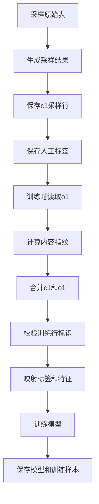
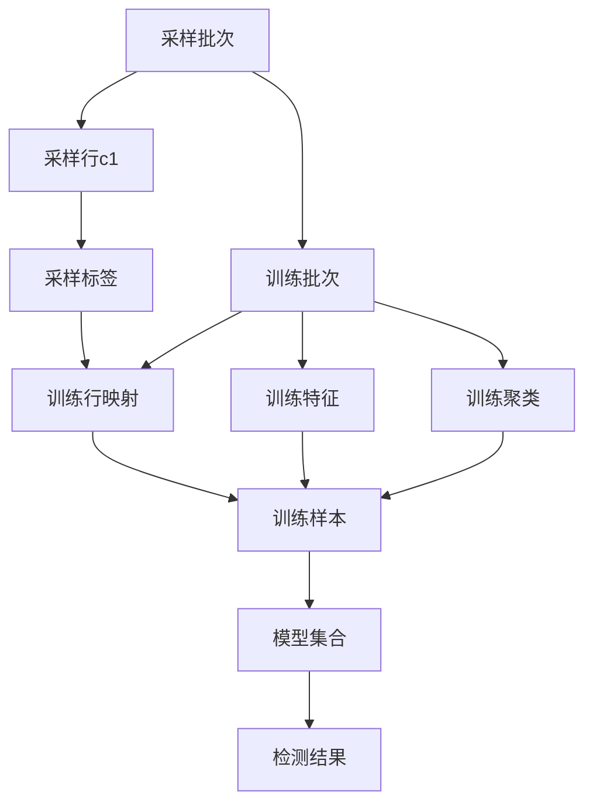
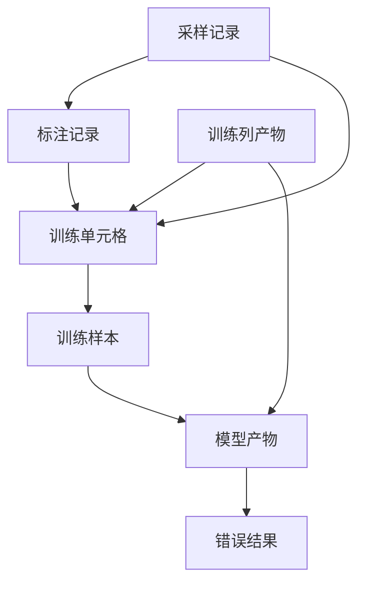
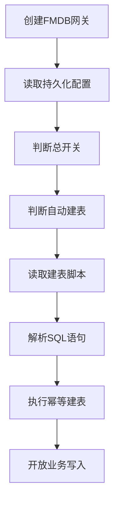

# Raha 采样数据优先训练数据库设计

> 本文是对之前“保存完整原始快照”设计的修订版。当前方案采用：采样结果和标签长期保存，训练原始数据在训练时从原表读取，不长期保存全量原始数据。

## 一、最终结论

该方案可行，适合以下业务目标：

- 采样结果需要长期保存。
- 人工标签需要长期保存。
- 训练时可以访问当前原始表。
- 不要求未来在没有原表的情况下完整还原当时的全量训练输入。
- 模型训练完成后保存模型和实际使用的训练样本。

推荐的行身份规则：

```text
用户提供稳定唯一标识：使用 SOURCE_KEY
用户没有稳定唯一标识：默认使用 CONTENT_HASH
```

其中 `CONTENT_HASH` 按照所有业务字段的规范化内容生成。按照当前设想可以默认使用 MD5，但必须保存指纹算法和规范化版本；结合当前工程已有哈希规则，生产环境更推荐 SHA-256。

必须区分以下三个概念：

| 概念 | 用途 | 稳定范围 |
| --- | --- | --- |
| `row_id` | 定位采样、标注和训练集合中的逻辑行 | 行身份规则不变时 |
| `row_content_hash` | 判断两条数据内容是否相同 | 指纹规则和数据内容不变时 |
| `training_snapshot_id` | 隔离不同训练批次的单元格坐标空间 | 一个训练输入快照 |

整行 MD5 是内容标识，不一定是物理唯一行号。相同内容的多条数据会生成相同 MD5，任意业务字段变化也会导致 MD5 变化。

## 二、修订后的整体流程



### 2.1 采样阶段

假设原始表有十万行，采样一千行：

```text
原始表：100000 行
采样结果：1000 行
采样结果重新排序后：c1
```

采样阶段长期保存：

- 采样批次信息。
- `c1` 的稳定 `row_id`。
- `c1` 的全部业务字段内容。
- `c1` 的整行内容指纹。
- 字段模式、字段名和字段顺序。
- 人工单元格标签。
- 采样算法版本和指纹算法版本。

采样阶段不再保存十万行完整原始表。

### 2.2 训练阶段

假设训练时从原表读取两百万行，记为 `o1`：

```text
c1：数据库中保存的一千条采样数据
o1：训练时从原表读取的两百万条数据
```

训练阶段执行：

1. 校验 `c1` 和 `o1` 的字段模式是否兼容。
2. 对 `c1` 和 `o1` 使用相同规则计算整行指纹。
3. 识别 `c1` 与 `o1` 的重复内容。
4. 重复内容以 `c1` 为优先。
5. 保留合并后的稳定 `row_id`，并生成新的 `training_batch_id` 和 `training_snapshot_id`。
6. 把采样标签映射到训练行和字段。
7. 在合并数据上重新生成训练画像、策略、特征和聚类。
8. 完成模型训练。
9. 保存模型和实际使用的训练样本。

训练完成后可以删除本次训练中的 `o1` 临时数据。

### 2.3 用户直接提供原始数据和已标注数据

用户已经提供成对的原始行和标签时，可以跳过采样算法，但不能跳过持久化标准化：

1. 为这批已标注数据生成一个导入批次标识。
2. 按统一行身份规则生成 `row_id` 和 `row_content_hash`。
3. 去重后的原始行写入 `raha_sample_record`，`sampling_version` 使用固定直接导入版本。
4. 标签写入 `raha_annotation_record`，`annotation_task_id` 和 `sampling_context_json` 允许为空。
5. 训练阶段直接选择该采样批次和标注批次，再读取 o1 完成 c1 优先合并。

这样业务上跳过的是“模型采样和人工等待”阶段，不是跳过 c1 与标签的标准存储结构，后续训练不需要维护第二套输入协议。

## 三、行身份设计

### 3.1 用户提供唯一标识

如果用户提供稳定唯一字段，例如 `order_id`、`user_id` 或联合业务键，使用：

```text
row_identity_mode = SOURCE_KEY
row_id = 规范化后的唯一标识
```

联合键可以生成：

```text
row_id = HASH(key_column_1, key_column_2, ...)
```

必须保存联合键字段列表和规范化版本，避免后续使用不同字段生成不兼容的行身份。

联合键相同即视为同一条逻辑记录。合并 c1 和 o1 时相同联合键只保留一条，优先保留 c1。即使相同联合键的非键字段内容不同，也按照普通重复行处理，不阻断训练；系统只记录告警日志和内容指纹摘要。

### 3.2 用户没有唯一标识

使用：

```text
row_identity_mode = CONTENT_HASH
row_content_hash = MD5(所有业务字段的规范化内容)
```

以下技术字段不能参与哈希：

```text
sample_row_no
train_row_no
Spark 分区编号
数据加载时间
```

这里的“所有字段”是所有业务字段，不包含运行时增加的技术字段。

### 3.3 内容哈希和逻辑行去重

没有联合唯一键时，所有业务字段完全相同的记录会生成相同 `row_content_hash`。当前方案把它们视为同一个逻辑行，只保留一条代表记录：

```text
row_content_hash = h1
duplicate_count = 2
```

联合键模式下使用规范化唯一键或联合键哈希作为逻辑行身份；内容哈希模式下使用全字段内容哈希作为逻辑行身份。采样表可以保存 `duplicate_count`，用于说明该代表行在采样输入中折叠了多少物理重复行。

当前 `RowIdValidator` 要求行标识唯一，因此去重完成后使用以下字段作为训练输入的技术行标识：

```text
SOURCE_KEY：key_hash
CONTENT_HASH：row_content_hash
```

当前方案明确采用逻辑行语义：重复物理行被折叠后只按一条逻辑行参与画像、频率、聚类和训练，`duplicate_count` 只用于审计，不用于模型加权。

## 四、整行 MD5 规范

### 4.1 禁止直接字符串拼接

不能使用：

```text
MD5(value1 + value2 + value3)
```

因为以下两组字段可能产生相同拼接结果：

```text
["ab", "c"]
["a", "bc"]
```

### 4.2 规范化规则

整行指纹必须满足：

1. 字段顺序固定。
2. 字段名称固定。
3. 字段类型固定。
4. `NULL` 和空字符串区分。
5. 数值采用固定精度和格式。
6. 时间统一时区和格式。
7. 字符串统一使用 UTF-8。
8. 技术字段不参与指纹。

推荐保存：

```text
row_fingerprint_algorithm = MD5
row_fingerprint_version = canonical-row-v1
row_fingerprint_columns = 所有业务字段列表
schema_hash = 字段模式哈希
```

规范化数据示例：

```json
{
  "amount": {"type": "DECIMAL(18,2)", "value": "100.00"},
  "customer_phone": {"type": "STRING", "value": "13800000000"},
  "order_no": {"type": "STRING", "value": "A001"}
}
```

然后计算：

```text
row_content_hash = MD5(canonical_row_json)
```

### 4.3 算法建议

MD5 可以满足内容匹配需求，但建议把算法做成可配置项。生产环境推荐 SHA-256，原因是：

- 当前工程已经使用 SHA-256 生成值哈希和单元格标识。
- SHA-256 与现有代码保持一致。
- MD5 存在已知碰撞风险。
- 两百万行哈希计算通常不是 Spark 训练的主要性能瓶颈。

## 五、c1 和 o1 合并规则

### 5.1 合并目标

```text
merged = c1 + o1(删除与 c1 重叠的部分)
```

重复内容以 `c1` 为准，使人工标注数据不会因为当前原表变化而丢失。

### 5.2 逻辑行去重是本方案的明确规则

本方案允许按照联合键或全字段内容指纹执行去重。如果 `c1` 中某个逻辑行出现一次，而 `o1` 中出现一百次，最终只保留一条代表行，并记录：

```text
duplicate_count = 100
```

这会改变物理行数量和原始物理分布，但属于当前方案主动接受的逻辑行语义。去重后以下统计都按照逻辑行重新计算：

- 总行数。
- 高频值计数。
- 字段值频率。
- 频率比例。
- 稀有值阈值。
- 策略命中分布。
- 聚类分布。

当前 `FeatureAssembler` 按去重后的字段和值哈希统计 `value_frequency`，正好符合逻辑行语义，不需要使用 `duplicate_count` 做数量补偿。如果未来业务要求保留交易次数或事件频次影响，必须切换为显式权重方案，不能继续称为普通逻辑去重。

### 5.3 推荐的 c1 优先去重规则

按逻辑身份计算：

```text
SOURCE_KEY：按 row_id 分组
CONTENT_HASH：按 row_content_hash 分组
```

最终保留：

```text
c1 存在该逻辑行：保留 c1 一条
c1 不存在该逻辑行：保留 o1 一条
dedup_count = c1_count + o1_count - 1
```

示例：

| 逻辑身份 | `c1_count` | `o1_count` | 最终保留 | 日志 `dedup_count` |
| --- | ---: | ---: | --- | ---: |
| `h1` | 1 | 100 | 1 条 c1 | 100 |
| `h2` | 2 | 1 | 1 条 c1 | 2 |
| `h3` | 1 | 0 | 1 条 c1 | 0 |
| `h4` | 0 | 50 | 1 条 o1 | 49 |

`dedup_count` 只进入日志和 `training_context_json` 汇总，不写入每个训练单元格。c1 是历史采样副本时，c1 与 o1 的数量不能解释为同一时刻的业务频次，因此禁止把两者相加后作为训练权重。

### 5.4 内容组模式

逻辑行去重后只保留一条代表行：

```text
merged_row = c1 代表行
dedup_count = 日志中的删除数量
```

如果 c1 和 o1 的逻辑身份相同但非键字段不同，仍然保留 c1，并记录：

```text
dedup_status = KEY_CONTENT_CHANGED
selected_source = C1
```

如果 c1 不存在而 o1 中同一联合键有多条内容不同的记录，则按配置的确定性规则保留一条，并记录 `KEY_CONTENT_CONFLICT` 告警。没有明确选择规则时，可以按规范化内容哈希字典序选择，保证多次训练结果稳定。

下游画像、策略、特征、聚类和模型训练只处理去重后的代表行。`sample_weight` 继续表示标签置信度或传播权重，不与重复数量相乘。

### 5.5 静默去重和日志要求

重复行不作为训练失败条件，采用静默去重，但必须记录可审计日志。

正常去重使用一条批次级 `INFO` 汇总日志，至少记录：

```text
training_batch_id
row_identity_mode
c1_count
o1_count
dedup_group_count
dedup_row_count
merged_logical_row_count
```

普通重复组明细只在 `DEBUG` 级别按配置保留前若干项，记录 `row_id` 或 `row_content_hash`、两侧数量和选择来源，禁止为每个重复组写一条 `INFO`，避免大数据任务产生海量日志。

联合键相同但非键字段不同时使用 `WARN` 汇总日志，至少记录：

```text
training_batch_id
row_identity_mode
key_content_conflict_count
conflict_detail_sample_count
```

冲突明细同样只保留前若干项，每项包含逻辑身份纯哈希、内容哈希数量、c1 数量、o1 数量、选择来源和 `KEY_CONTENT_CHANGED` 状态。同一全字段指纹出现多次属于普通重复，只进入 `INFO` 汇总，不记录 `WARN`。日志不得输出完整原始行、敏感字段原文或未脱敏单元格值。

训练批次完成日志还必须记录：

```text
input_count
merged_logical_row_count
dedup_group_count
key_content_conflict_count
elapsed_millis
```

如果后续需要长期审计，可以把这些汇总值同步保存到 `raha_training_batch`，但不需要把每条 o1 重复行写入数据库。

## 六、训练行列坐标

### 6.1 train_row_no 只在本次训练有效

合并完成后可以生成连续的 `train_row_no`，但它只用于当前训练和页面展示。下一次重新读取 `o1` 后，源数据顺序、Spark 分区和重复数量可能变化，同一行号可能对应其他内容。

### 6.2 训练阶段继续使用 row_id

训练读取 o1 后，必须按照与 c1 相同的行身份规则生成 `row_id`。完成 c1 优先去重后，`row_id` 在一个训练批次内唯一，因此不再生成第二套 `train_row_id`：

```text
training_batch_id + row_id
```

单元格坐标使用：

```text
training_snapshot_id + row_id + column_name
```

`training_batch_id` 负责隔离不同训练任务，`training_snapshot_id` 负责隔离单元格坐标空间，`train_row_no` 只在页面或导出时临时生成。

### 6.3 列名是稳定关联键

正确关联：

```text
row_id + column_name
```

不推荐只使用：

```text
train_row_no + column_no
```

因为字段新增、删除、排序、白名单和黑名单都会改变列号。列号只能保存为 `column_ordinal`，用于还原展示顺序。

## 七、标签映射

### 7.1 采样标签键

采样标签使用：

```text
sample_batch_id + row_id + column_name
```

同时保存：

```text
row_content_hash
label
label_source
```

### 7.2 训练标签转换

训练时转换为：

```text
training_batch_id + row_id + column_name
```

并重新生成训练阶段 `cell_id`：

```text
cell_id = HASH(dataset_id, training_snapshot_id, row_id, column_name)
```

当前 `CellCoordinate` 已经把数据集、快照、行标识和列名放入 `cellId`，所以采样 `cellId` 不能直接连接训练特征，必须执行映射。

### 7.3 c1 不在当前 o1 中

如果 c1 指纹在 o1 中找不到：

```text
mapping_status = C1_ONLY
```

仍然保留 c1 并参与训练。

如果指纹在 o1 中存在：

```text
mapping_status = MATCHED
```

以 c1 内容和标签为准，再按照重复数量规则保留其余 o1 行。

如果使用 `SOURCE_KEY`，即使整行内容发生变化，也应先按业务键匹配，而不是只按全字段哈希判断是不是同一条记录。

## 八、模型训练如何使用行列号

模型不是直接“按行列号更新”，而是通过行列坐标关联标签和特征。

当前工程的关系是：

```text
SparseFeatureRow.cellId
        连接
CellLabel.cellId
        生成
ColumnTrainingExample
        训练
ColumnModel
```

因此训练阶段必须保证以下字段一致：

```text
training_snapshot_id
row_id
column_name
cell_id
```

如果训练快照或 `row_id` 变化后没有重新生成 `cell_id`，`ColumnTrainingDataBuilder` 将找不到对应标签，或者把标签关联到错误特征。

## 九、画像、特征和聚类策略

### 9.1 采样画像不能直接用于新的 o1

采样阶段原始表有十万行，训练阶段可能读取两百万行。总行数、空值数、不同值数、均值、分位数和高频值统计都会变化。

因此采样阶段的 `ColumnProfile` 可以保存用于采样审计，但不能直接作为 c1 加 o1 的训练画像。

### 9.2 采样特征不能直接作为训练特征

当前特征包含：

```text
context.column.frequency
context.column.frequency_ratio
context.column.frequency_bucket.rare
```

这些特征依赖当前训练集合分布。因此：

```text
采样特征 = 基于采样阶段数据分布
训练特征 = 基于 c1 + o1 合并后的数据分布
```

两者不能默认复用。

### 9.3 聚类必须覆盖训练集合

采样阶段聚类用于选择 c1。训练阶段如果要把标签传播到 o1，聚类必须覆盖 c1 加 o1 的合并数据。

不保存全量原始数据意味着训练时仍可能需要重新扫描 o1 执行画像、策略、特征和聚类。这是节省存储所换取的计算成本。

### 9.4 训练派生缓存

如果需要训练失败重试或同一输入重复训练，可以保存：

- 训练画像。
- 特征字典。
- 训练稀疏特征。
- 训练聚类分配。

这些是派生资产，不是原始数据。缓存复用必须同时校验 `source_version`、模式哈希、合并算法版本和特征配置版本。

如果只关注模型结果，可以只保存模型实际使用的训练样本，不保存两百万行全量特征。

## 十、逻辑表清单

本章按业务职责拆分逻辑对象，用于说明数据关系和持久化必要性，不代表 FMDB 最终需要建立同名物理表。最终七张业务物理表和两张运行控制表以第十七章至第二十二章为准。

| 表名 | 作用 | 必要性 |
| --- | --- | --- |
| `dw.raha_sample_batch` | 采样批次头 | 必须 |
| `dw.raha_sample_row` | 保存 c1 采样行 | 必须 |
| `dw.raha_sample_cell_label` | 保存人工直接标签 | 必须 |
| `dw.raha_training_batch` | 记录 c1 和 o1 的训练合并 | 必须 |
| `dw.raha_training_sample_mapping` | 保存 c1 到训练行映射 | 必须 |
| `dw.raha_column_profile` | 保存采样或训练画像 | 建议 |
| `dw.raha_training_feature` | 保存训练稀疏特征缓存 | 条件保存 |
| `dw.raha_training_cluster_assignment` | 保存训练聚类分配 | 标签传播时保存 |
| `dw.raha_training_example` | 保存模型实际训练样本 | 必须 |
| `dw.raha_model_set` | 保存模型集合 | 必须 |
| `dw.raha_column_model` | 保存列模型 | 必须 |
| `dw.raha_detection_batch` | 保存检测批次 | 按业务需要 |
| `dw.raha_detection_result` | 保存检测结果 | 按业务需要 |

## 十一、逻辑表结构

### 11.1 `dw.raha_sample_batch`

| 字段 | 类型 | 必填 | 说明 |
| --- | --- | --- | --- |
| `sample_batch_id` | `STRING` | 是 | 采样批次标识 |
| `dataset_id` | `STRING` | 是 | 逻辑数据集标识 |
| `input_reference` | `STRING` | 是 | 采样原表或查询 |
| `source_version` | `STRING` | 否 | 采样时源版本 |
| `row_identity_mode` | `STRING` | 是 | `SOURCE_KEY` 或 `CONTENT_HASH` |
| `row_key_columns_json` | `STRING` | 否 | 唯一键字段列表 |
| `row_fingerprint_algorithm` | `STRING` | 是 | 默认 `MD5`，推荐 `SHA256` |
| `row_fingerprint_version` | `STRING` | 是 | 指纹规范化版本 |
| `schema_hash` | `STRING` | 是 | 字段模式哈希 |
| `column_schema_json` | `STRING` | 是 | 字段名、类型、顺序和检测属性 |
| `sample_count` | `BIGINT` | 是 | c1 行数量 |
| `sampling_version` | `STRING` | 是 | 采样算法版本 |
| `created_by_job_id` | `STRING` | 是 | 采样作业 |
| `created_at` | `BIGINT` | 是 | 创建时间 |

### 11.2 `dw.raha_sample_row`

| 字段 | 类型 | 必填 | 说明 |
| --- | --- | --- | --- |
| `sample_batch_id` | `STRING` | 是 | 采样批次 |
| `row_id` | `STRING` | 是 | c1 逻辑行标识 |
| `row_content_hash` | `STRING` | 是 | 全部业务字段内容指纹 |
| `row_data_json` | `STRING` | 是 | 采样行完整内容 |
| `duplicate_count` | `BIGINT` | 是 | 代表的重复数量 |
| `created_at` | `BIGINT` | 是 | 写入时间 |
| `partition_date` | `STRING` | 是 | 采样日期分区 |

逻辑主键为：

```text
sample_batch_id + row_id
```

### 11.3 `dw.raha_sample_cell_label`

| 字段 | 类型 | 必填 | 说明 |
| --- | --- | --- | --- |
| `label_id` | `STRING` | 是 | 标签事件标识 |
| `sample_batch_id` | `STRING` | 是 | 采样批次 |
| `row_id` | `STRING` | 是 | c1 逻辑行标识 |
| `row_content_hash` | `STRING` | 是 | 标注时行指纹 |
| `column_name` | `STRING` | 是 | 字段名称 |
| `label` | `INT` | 是 | `0` 正常，`1` 错误 |
| `label_source` | `STRING` | 是 | 人工、真值或规则确认 |
| `confidence` | `DOUBLE` | 是 | 标签置信度 |
| `annotator` | `STRING` | 否 | 标注人员 |
| `labeled_at` | `BIGINT` | 是 | 标注时间 |
| `partition_date` | `STRING` | 是 | 标签日期分区 |

### 11.4 `dw.raha_training_batch`

该表不保存 o1 全量内容，只保存来源和合并摘要。

| 字段 | 类型 | 必填 | 说明 |
| --- | --- | --- | --- |
| `training_batch_id` | `STRING` | 是 | 训练批次标识 |
| `training_snapshot_id` | `STRING` | 是 | 本次训练坐标空间 |
| `sample_batch_id` | `STRING` | 是 | 使用的 c1 批次 |
| `input_reference` | `STRING` | 是 | o1 原表或查询 |
| `source_version` | `STRING` | 否 | o1 源版本或分区 |
| `source_read_at` | `BIGINT` | 是 | o1 读取时间 |
| `row_identity_mode` | `STRING` | 是 | 行身份模式 |
| `row_fingerprint_algorithm` | `STRING` | 是 | MD5 或 SHA-256 |
| `row_fingerprint_version` | `STRING` | 是 | 指纹版本 |
| `schema_hash` | `STRING` | 是 | 合并模式哈希 |
| `c1_count` | `BIGINT` | 是 | c1 行数 |
| `o1_count` | `BIGINT` | 是 | o1 行数 |
| `matched_identity_count` | `BIGINT` | 是 | 重叠逻辑身份数量 |
| `dedup_group_count` | `BIGINT` | 是 | 被去重的逻辑组数量 |
| `key_content_conflict_count` | `BIGINT` | 是 | 同键但非键字段不同的组数量 |
| `merged_count` | `BIGINT` | 是 | 合并后物理行数 |
| `merge_algorithm_version` | `STRING` | 是 | 合并规则版本 |
| `training_config_version` | `STRING` | 是 | 训练配置版本 |
| `created_by_job_id` | `STRING` | 是 | 训练作业 |
| `created_at` | `BIGINT` | 是 | 创建时间 |

### 11.5 `dw.raha_training_sample_mapping`

只保存 c1 到训练行的映射，不保存两百万条 o1 映射。

| 字段 | 类型 | 必填 | 说明 |
| --- | --- | --- | --- |
| `training_batch_id` | `STRING` | 是 | 训练批次 |
| `sample_batch_id` | `STRING` | 是 | 采样批次 |
| `row_id` | `STRING` | 是 | c1 和训练逻辑行标识 |
| `row_content_hash` | `STRING` | 是 | 匹配指纹 |
| `mapping_status` | `STRING` | 是 | `C1_ONLY`、`MATCHED` 或 `KEY_CONTENT_CHANGED` |
| `matched_o1_count` | `BIGINT` | 是 | o1 中相同指纹数量 |
| `created_at` | `BIGINT` | 是 | 创建时间 |

### 11.6 `dw.raha_column_profile`

在现有 `ColumnProfile` 字段基础上增加作用域：

| 新增字段 | 类型 | 说明 |
| --- | --- | --- |
| `profile_scope` | `STRING` | `SAMPLING` 或 `TRAINING` |
| `source_batch_id` | `STRING` | 采样批次或训练批次 |
| `source_version` | `STRING` | 原表版本 |
| `profile_version` | `STRING` | 画像版本 |
| `schema_hash` | `STRING` | 输入模式哈希 |
| `merge_algorithm_version` | `STRING` | 训练画像使用的合并版本 |

其余字段继续保存空值、不同值、长度、数值统计、类型计数和高频值哈希。

训练画像只能在输入来源版本、合并规则和画像配置完全一致时复用。

### 11.7 `dw.raha_training_feature`

该表是可选派生缓存。

| 字段 | 类型 | 必填 | 说明 |
| --- | --- | --- | --- |
| `training_batch_id` | `STRING` | 是 | 训练批次 |
| `row_id` | `STRING` | 是 | 训练逻辑行标识 |
| `column_name` | `STRING` | 是 | 字段名称 |
| `cell_id` | `STRING` | 是 | 当前训练单元格标识 |
| `value_hash` | `STRING` | 是 | 单元格值哈希 |
| `feature_dictionary_version` | `STRING` | 是 | 特征字典版本 |
| `feature_vector_json` | `STRING` | 是 | 稀疏特征向量 |
| `summary_json` | `STRING` | 是 | 频率和策略摘要 |
| `created_at` | `BIGINT` | 是 | 创建时间 |
| `partition_date` | `STRING` | 是 | 训练日期分区 |

### 11.8 `dw.raha_training_cluster_assignment`

如果训练执行全量标签传播，则保存：

| 字段 | 类型 | 必填 | 说明 |
| --- | --- | --- | --- |
| `training_batch_id` | `STRING` | 是 | 训练批次 |
| `row_id` | `STRING` | 是 | 训练逻辑行标识 |
| `column_name` | `STRING` | 是 | 字段名称 |
| `cell_id` | `STRING` | 是 | 单元格标识 |
| `cluster_version` | `STRING` | 是 | 聚类版本 |
| `cluster_id` | `STRING` | 是 | 聚类标识 |
| `distance` | `DOUBLE` | 否 | 距离 |
| `created_at` | `BIGINT` | 是 | 创建时间 |

### 11.9 `dw.raha_training_example`

保存模型实际使用的训练样本。

| 字段 | 类型 | 必填 | 说明 |
| --- | --- | --- | --- |
| `model_set_version` | `STRING` | 是 | 模型集合 |
| `training_batch_id` | `STRING` | 是 | 训练批次 |
| `row_id` | `STRING` | 是 | 训练逻辑行标识 |
| `column_name` | `STRING` | 是 | 字段名称 |
| `cell_id` | `STRING` | 是 | 训练单元格标识 |
| `value_hash` | `STRING` | 是 | 训练时值哈希 |
| `feature_dictionary_version` | `STRING` | 是 | 特征字典版本 |
| `feature_vector_json` | `STRING` | 是 | 实际训练向量 |
| `label` | `INT` | 是 | 正常或错误 |
| `label_source` | `STRING` | 是 | `DIRECT` 或 `PROPAGATED` |
| `source_label_id` | `STRING` | 否 | 来源人工标签 |
| `sample_weight` | `DOUBLE` | 是 | 标签权重 |
| `cluster_id` | `STRING` | 否 | 传播所在聚类 |
| `created_at` | `BIGINT` | 是 | 创建时间 |
| `partition_date` | `STRING` | 是 | 模型日期分区 |

### 11.10 模型和检测表

以下表继续保留：

| 表名 | 说明 |
| --- | --- |
| `dw.raha_model_set` | 保存模型集合、训练批次、合并版本和训练配置 |
| `dw.raha_column_model` | 保存列模型、特征字典版本和模型载荷 |
| `dw.raha_detection_batch` | 保存检测批次头 |
| `dw.raha_detection_result` | 保存最终错误单元格和模型版本 |

`raha_model_set` 至少引用：

```text
training_batch_id
sample_batch_id
training_config_version
merge_algorithm_version
```

## 十二、表关系



| 主表 | 从表 | 关联字段 | 关系 |
| --- | --- | --- | --- |
| `raha_sample_batch` | `raha_sample_row` | `sample_batch_id` | 一对多 |
| `raha_sample_batch` | `raha_sample_cell_label` | `sample_batch_id` | 一对多 |
| `raha_sample_batch` | `raha_training_batch` | `sample_batch_id` | 一对多 |
| `raha_training_batch` | `raha_training_sample_mapping` | `training_batch_id` | 一对多 |
| `raha_training_batch` | `raha_training_feature` | `training_batch_id` | 一对多 |
| `raha_training_batch` | `raha_training_cluster_assignment` | `training_batch_id` | 一对多 |
| `raha_training_batch` | `raha_training_example` | `training_batch_id` | 一对多 |
| `raha_model_set` | `raha_training_example` | `model_set_version` | 一对多 |
| `raha_model_set` | `raha_column_model` | `model_set_version` | 一对多 |
| `raha_model_set` | `raha_detection_batch` | `model_set_version` | 一对多 |
| `raha_detection_batch` | `raha_detection_result` | `detection_batch_id` | 一对多 |

## 十三、完整示例

### 13.1 c1

联合唯一键由 `order_no + order_date` 组成。

| `row_id` | `row_content_hash` | `customer_phone` | `amount` | 标签 |
| --- | --- | --- | ---: | --- |
| `k1` | `h1` | `13800000000X` | 100.00 | `customer_phone=1` |
| `k2` | `h2` | `13900000000` | 200.00 | 无 |

### 13.2 o1

| 临时顺序 | `row_id` | `row_content_hash` | `customer_phone` | `amount` |
| ---: | --- | --- | --- | ---: |
| 1 | `k1` | `h1` | `13800000000X` | 100.00 |
| 2 | `k1` | `h1_changed` | `13800000000X` | 120.00 |
| 3 | `k2` | `h2` | `13900000000` | 200.00 |
| 4 | `k3` | `h3` | `13700000000` | 300.00 |

### 13.3 合并结果

按照联合键静默去重后，`k1` 和 `k2` 都保留 c1，`k3` 保留 o1：

| 来源 | `row_id` | 内容哈希 | 日志观测输入数 | 标签 |
| --- | --- | --- | ---: | --- |
| c1 | `k1` | `h1` | 3 | `customer_phone=1` |
| c1 | `k2` | `h2` | 2 | 无 |
| o1 | `k3` | `h3` | 1 | 无直接标签 |

`k1` 存在相同联合键但不同内容哈希，系统仍然保留 c1，不中断训练，并记录 `KEY_CONTENT_CHANGED` 告警日志。

相同内容是否自动继承人工标签必须显式配置：

```text
label_scope = ROW_INSTANCE
```

或者：

```text
label_scope = CONTENT_GROUP
```

由于相同联合键最终只有一条逻辑行，c1 人工标签直接保留在该代表行上；`label_scope` 仍用于说明标签是否允许传播到其他内容组或聚类。

## 十四、当前代码改造要求

### 14.1 数据加载

训练数据加载器需要读取 c1 和 o1，按照统一规则生成逻辑行标识，完成 c1 优先去重后再调用 `RowIdValidator` 校验唯一性。

```text
Spark 数据集：使用 RahaJobConfig.rowIdColumn 指定的技术列
FMDB 物理表：统一写入 row_id
```

### 14.2 画像

`ColumnProfileService` 需要区分：

```text
SAMPLING_PROFILE
TRAINING_PROFILE
```

训练画像复用必须校验训练批次、o1 源版本、模式哈希、合并版本和画像配置版本。

### 14.3 特征

训练特征使用新的版本键：

```text
training_batch_id + feature_config_version + strategy_version
```

采样特征不能默认复用到新的 o1。

### 14.4 标签

新增标签映射过程：

```text
sample_batch_id + row_id + column_name
    转换为
training_batch_id + row_id + column_name
```

再生成训练阶段 `cellId`。

### 14.5 训练样本

训练完成后必须保存实际训练样本，使未来即使 o1 发生变化，也可以检查模型实际使用过的特征和标签。

### 14.6 `repository` 仓储持久化映射

`repository` 包中的接口是逻辑持久化边界，不应该按照每个接口或每个 `RepositoryNamespace` 建一张物理表。推荐映射如下：

| 仓储接口 | 持久化结论 | 最终承载位置 | 说明 |
| --- | --- | --- | --- |
| `JobRepository` | 必须保存 | `raha_job_run` | 支撑幂等提交、任务状态、失败原因和零结果任务 |
| `StageRepository` | 必须保存 | `raha_job_stage_attempt` | 支撑阶段状态和重试审计 |
| `StageCheckpointRepository` | 必须保存 | `raha_job_stage_attempt` 的检查点 JSON | 保存输入版本、输入指纹、输出位置和重试结果 |
| `AnnotationTaskRepository` | 必须保存任务依据 | `raha_sample_record.sampling_context_json`、标注记录和运行控制记录 | 采样依据不可变，完成和过期可推导，取消事件追加记录 |
| `CellLabelRepository` | 必须保存 | `raha_annotation_record`、`raha_training_cell`、`propagation_summary_json` | 人工标签长期保存，传播标签和传播摘要随训练批次保存 |
| `ColumnProfileRepository` | 建议保存 | `raha_training_column_artifact.profile_json` | 画像计算成本高，保存后可加速同批重试和策略生成 |
| `StrategyRepository` | 计划和摘要必须保存 | `strategy_plan_json` | 策略命中在特征物化后可删除，错误解释写入检测结果 |
| `FeatureRepository` | 当前方案保存 | `feature_dictionary_json`、`raha_training_cell`、`raha_training_example` | 字典用于解释向量，单元格特征用于传播和重试，训练样本用于快速入模 |
| `ClusterRepository` | 使用标签传播时保存 | `cluster_summary_json`、`raha_training_cell` | 列级摘要进入 JSON，成员分配保留为单元格列 |
| `ModelMetadataRepository` | 必须保存 | `raha_model_artifact` | 支撑模型发布、加载、回滚和版本追踪 |
| `DetectionResultRepository` | 只保存错误 | `raha_detection_result` | 正常结果只进入指标计数，不写错误明细表 |

不推荐为 `RahaRepository` 建一张通用的“命名空间、分区键、记录键、载荷 JSON”超级表。它虽然容易对应当前内存仓储接口，但会失去类型化列、列裁剪和按业务条件分区的优势。

`ArtifactVersion` 中的 `configVersion`、`snapshotId`、`stageId` 和 `attemptId` 由运行控制表保存；业务宽表只保留其查询和复用真正需要的批次、快照和配置版本。大规模单元格表不重复保存完整 `ArtifactVersion` JSON。

FMDB 追加写场景下，`SaveOutcome.UPDATED` 应解释为“追加一个更高版本的记录并让最新有效版本可见”，不能直接翻译为行级更新。`RepositoryTransaction` 也不能假设 FMDB 提供跨表事务，应通过作业提交状态、版本号和先写明细后发布的顺序实现一致性。

## 十五、能力边界

### 15.1 可以支持

- 保存采样结果。
- 保存人工标注。
- 训练时重新读取当前原始表。
- 将 c1 标签映射到当前训练数据。
- 使用 c1 和 o1 合并数据训练模型。
- 保存模型实际使用的训练样本。
- 同时支持业务唯一键和全字段内容哈希。

### 15.2 不再保证

- 未来没有原表时恢复当时完整 o1。
- 在没有原表时重新生成相同训练画像。
- 在没有原表时重新生成相同策略命中和聚类。
- 仅通过 `train_row_no` 跨训练批次定位同一物理行。
- 原表变化后完全复现过去的训练过程。

如果这些能力不是业务必须项，就没有必要保存完整原始快照。

## 十六、最终推荐

1. 用户有稳定唯一标识时使用 `SOURCE_KEY`。
2. 用户没有稳定唯一标识时使用所有业务字段生成 `CONTENT_HASH`。
3. 默认可使用 MD5，但必须保存规范化版本；生产建议使用 SHA-256。
4. 采样结果保存 `row_id`、完整采样内容、内容指纹和人工标签。
5. 训练阶段重新读取 o1，不保存 o1 全量原始数据。
6. 合并时 c1 优先，但不能直接全局 `distinct`。
7. 训练阶段生成新的 `training_batch_id` 和 `training_snapshot_id`，继续使用统一的 `row_id`。
8. 标签关联使用 `row_id + column_name`，列号只用于展示。
9. 采样画像和采样特征不能默认复用到新的 o1 训练集合。
10. 训练完成后保存模型、实际训练样本和必要的训练派生缓存。

该方案在存储成本、训练能力和实现复杂度之间比较平衡，适合作为当前工程“不保存全量原始数据”的数据库设计基线。


## 十七、FMDB 场景下的物理表合并方案

### 17.1 为什么不能完全按逻辑表查询

FMDB 基于 Spark，适合大规模列式扫描、列裁剪和批量计算，但以下操作可能产生较高成本：

- 大明细表之间的 `JOIN`。
- 多次按批次头表回查明细表。
- 先读采样行，再读标签，再读训练特征，再读聚类分配。
- 训练时重复把同一批次的多个表 Join 到一起。
- 高频查询反复触发相同的 Shuffle。

因此，逻辑上拆分的表不一定要在物理存储上完全一一对应。推荐采用：

```text
逻辑模型：保持职责清晰
物理模型：为高频查询预先物化宽表
```

### 17.2 最终推荐的物理表数量

对于当前采样、标注、训练和检测流程，推荐把高频查询收敛为以下七类业务物理表：

| 物理表 | 主要粒度 | 合并内容 | 主要查询 |
| --- | --- | --- | --- |
| `dw.raha_sample_record` | 一行采样逻辑记录 | 采样批次、不可变采样行和标注任务上下文 | 标注页面和采样结果查询 |
| `dw.raha_annotation_record` | 一行一次标注结果 | 标注批次元数据和行级标注 | 标注导入和训练标签查询 |
| `dw.raha_training_column_artifact` | 一列一个训练阶段产物 | 训练批次、列画像、策略、特征字典和聚类摘要 | 训练列级产物加载 |
| `dw.raha_training_cell` | 一个训练单元格 | 特征、聚类和标签 | 标签传播和训练准备 |
| `dw.raha_training_example` | 一个实际训练样本 | 训练特征和最终训练标签 | 模型训练 |
| `dw.raha_model_artifact` | 一个列模型 | 模型集合和列模型元数据 | 模型加载和预测 |
| `dw.raha_detection_result` | 一个检测单元格结果 | 检测批次和检测结果 | 错误结果查询 |

作业状态仍然使用独立的小表，例如 `dw.raha_job_run` 和 `dw.raha_job_stage_attempt`。它们数据量小、查询频率低，不需要为了减少 Join 与业务大表合并。

### 17.3 采样宽表：`dw.raha_sample_record`

该表将以下逻辑对象合并：

```text
raha_sample_batch
raha_sample_row
```

推荐一行对应一个采样逻辑行：

| 字段 | 说明 |
| --- | --- |
| `sample_batch_id` | 采样批次 |
| `dataset_id` | 数据集标识 |
| `input_reference` | 采样原表 |
| `source_version` | 源版本 |
| `row_identity_mode` | `SOURCE_KEY` 或 `CONTENT_HASH` |
| `row_key_columns_json` | 联合唯一键字段列表 |
| `row_fingerprint_algorithm` | MD5 或 SHA-256 |
| `row_fingerprint_version` | 指纹规则版本 |
| `schema_hash` | 字段模式哈希 |
| `column_schema_json` | 字段模式和顺序 |
| `row_id` | 逻辑行标识 |
| `row_content_hash` | 全字段内容哈希 |
| `row_data_json` | 采样行内容 |
| `duplicate_count` | 重复数量 |
| `sampling_context_json` | 采样依据和待标注任务上下文 |
| `created_at` | 创建时间 |
| `partition_month` | 采样月份分区 |

标注页面查询只需要：

```sql
SELECT row_id,
       row_data_json,
       duplicate_count
FROM dw.raha_sample_record
WHERE dataset_id = ?
  AND partition_month = ?
  AND sample_batch_id = ?
ORDER BY row_id;
```

这样不需要先查批次头，再 Join 采样行。标注结果不更新该表，而是从独立的标注结果表读取。

采样数据表保持不可变，避免 FMDB 更新不友好导致整批数据重写。用户重新标注时向 `dw.raha_annotation_record` 追加新的标注批次记录。

### 17.4 训练列级产物表：`dw.raha_training_column_artifact`

将 `raha_training_batch` 的必要元数据冗余到每个字段记录中，并把相同粒度的列画像、策略计划、特征字典和聚类摘要合并保存：

```text
training_batch_id
source_version
schema_hash
merge_algorithm_version
training_context_json
profile_version
column_name
profile_json
strategy_plan_version
strategy_plan_json
feature_dictionary_version
feature_dictionary_json
cluster_version
cluster_summary_json
propagation_summary_json
```

训练加载列级产物时直接查询：

```sql
SELECT column_name,
       profile_json,
       strategy_plan_json,
       feature_dictionary_json,
       cluster_summary_json
FROM dw.raha_training_column_artifact
WHERE dataset_id = ?
  AND training_batch_id = ?;
```

不需要再把训练批次、字段画像、策略计划、特征字典和聚类摘要逐表 Join。它们都属于“一个训练批次中的一个字段”这一粒度，适合物理合并；单元格特征仍单独存储，避免把列级 JSON 重复数百万次。

### 17.5 训练单元格宽表：`dw.raha_training_cell`

该表是训练准备阶段的核心物化表，合并：

```text
raha_training_feature
raha_training_cluster_assignment
训练阶段直接标签
训练阶段传播标签
```

推荐一行对应一个训练单元格：

| 字段 | 说明 |
| --- | --- |
| `training_batch_id` | 训练批次 |
| `dataset_id` | 数据集 |
| `row_id` | 训练逻辑行标识 |
| `column_name` | 字段名称 |
| `cell_id` | 训练单元格标识 |
| `cell_value` | 单元格具体原值 |
| `feature_dictionary_version` | 特征字典版本 |
| `feature_vector_json` | 稀疏特征向量 |
| `feature_summary_json` | 特征摘要 |
| `cluster_version` | 聚类版本 |
| `cluster_id` | 聚类标识 |
| `cluster_distance` | 聚类距离 |
| `direct_label` | 直接标签，没有时为空 |
| `propagated_label` | 传播标签，没有时为空 |
| `label_source` | 标签来源 |
| `source_annotation_batch_id` | 来源标注批次 |
| `sample_weight` | 标签权重 |
| `created_at` | 生成时间 |

标签传播查询可以直接完成：

```sql
SELECT cell_id,
       column_name,
       cluster_id,
       direct_label,
       feature_vector_json
FROM dw.raha_training_cell
WHERE dataset_id = ?
  AND training_batch_id = ?
  AND column_name = ?;
```

训练特征、聚类和标签不再需要三张大表互相 Join。

### 17.6 训练样本表：`dw.raha_training_example`

`raha_training_cell` 保存训练准备阶段的逻辑单元格，可能包含大量没有标签的行。`raha_training_example` 只保存模型实际使用的样本，作为更小的训练热表：

```sql
SELECT column_name,
       feature_vector_json,
       label,
       sample_weight
FROM dw.raha_training_example
WHERE dataset_id = ?
  AND partition_month = ?
  AND model_set_version = ?
  AND column_name = ?;
```

模型训练直接读取该表，不需要再次 Join：

```text
训练特征 + 最终标签 + 来源 + 权重
```

推荐保留 `raha_training_cell` 用于传播、解释和重试，推荐使用 `raha_training_example` 作为模型训练主输入。

### 17.7 模型宽表：`dw.raha_model_artifact`

将以下逻辑对象合并为模型加载宽表：

```text
raha_model_set
raha_column_model
特征字典版本
模型载荷位置
```

一行对应一个列模型，重复保存模型集合元数据：

| 字段 | 说明 |
| --- | --- |
| `model_set_version` | 模型集合版本 |
| `dataset_id` | 数据集 |
| `training_batch_id` | 训练批次 |
| `model_set_status` | 模型集合状态 |
| `strategy_plan_version` | 冻结策略版本 |
| `merge_algorithm_version` | 合并规则版本 |
| `column_name` | 模型字段 |
| `model_version` | 列模型版本 |
| `classifier_type` | 分类器类型 |
| `feature_dictionary_version` | 字典版本 |
| `feature_dimension` | 特征维度 |
| `threshold` | 判断阈值 |
| `model_path` | 模型载荷位置 |
| `model_payload_json` | 小型模型载荷 |
| `metrics_json` | 评估指标 |
| `created_at` | 创建时间 |
| `published_at` | 发布时间 |

预测加载模型时直接按模型集合和字段查询：

```sql
SELECT column_name,
       model_version,
       classifier_type,
       feature_dictionary_version,
       threshold,
       model_path,
       model_payload_json
FROM dw.raha_model_artifact
WHERE dataset_id = ?
  AND model_set_version = ?;
```

`raha_model_set` 仍可以保留为小型提交头，用于发布、回滚和零列模型集合，但预测热路径直接读取 `raha_model_artifact`。

### 17.8 检测结果宽表：`dw.raha_detection_result`

检测结果表直接冗余检测批次元数据，只写错误单元格，并保存原始值和错误行完整数据：

```text
detection_batch_id
dataset_id
input_snapshot_id
model_set_version
target_columns_json
row_id
column_name
cell_id
original_value
row_data_json
score
threshold
error_reason_json
detected_at
```

`is_error` 和 `errors_only` 不进入该表，因为它们在只写错误结果的固定规则下没有区分度。检测表直接保存 `original_value` 和完整错误行，零错误批次通过作业状态和结果计数表达。

### 17.9 哪些表不能合并

以下对象不建议合并：

| 对象 | 原因 |
| --- | --- |
| 采样宽表和训练单元格宽表 | 数据粒度不同，一个是行，一个是单元格 |
| 训练列级产物表和训练单元格宽表 | 一个是一批一列一条，另一个是一批一列可能数百万条，合并会大量重复 JSON |
| 训练单元格宽表和模型宽表 | 数据量相差巨大，生命周期不同 |
| 模型宽表和检测结果 | 一个是小型不可变配置，一个是大规模结果明细 |
| 作业状态和训练数据 | 状态数据频繁更新，训练数据适合追加和批量读取 |
| 所有对象合并为通用大宽表 | 造成大量空列、数据类型复杂和列裁剪失效 |

## 十八、FMDB 查询性能建议

### 18.1 高频查询不依赖大表 Join

推荐查询路径：

| 场景 | 直接查询表 | 查询条件 |
| --- | --- | --- |
| 标注页面 | `raha_sample_record` | `dataset_id, partition_month, sample_batch_id` |
| 标注结果 | `raha_annotation_record` | `dataset_id, partition_month, annotation_batch_id` |
| 训练列级产物 | `raha_training_column_artifact` | `dataset_id, training_batch_id` |
| 标签传播 | `raha_training_cell` | `dataset_id, training_batch_id, column_name` |
| 模型训练 | `raha_training_example` | `dataset_id, partition_month, model_set_version, column_name` |
| 模型加载 | `raha_model_artifact` | `dataset_id, model_set_version` |
| 检测结果 | `raha_detection_result` | `dataset_id, partition_date, detection_batch_id` |

### 18.2 c1 和 o1 的唯一一次大合并

训练时 c1 通常只有几百到几千行，o1 可能有数百万行。该 Join 是必要的，但应采用小表广播：

```text
broadcast(c1)
join o1 on row_id 或 row_content_hash
```

不要把两个大表互相 Shuffle。当前工程可以使用 `SparkResourceManager.broadcastIfAllowed`，根据 c1 大小判断是否广播。

广播前应记录：

```text
c1_row_count
c1_size_bytes
broadcast_allowed
training_batch_id
```

### 18.3 分区建议

| 表 | 推荐分区 | 说明 |
| --- | --- | --- |
| `raha_sample_record` | `dataset_id, partition_month` | 按数据集和月份裁剪 |
| `raha_annotation_record` | `dataset_id, partition_month` | 标注结果规模中等 |
| `raha_training_column_artifact` | 不分区或 `dataset_id` | 每批每列一条，数据量小 |
| `raha_training_cell` | `dataset_id, training_batch_id` | 单批数据量大时直接裁剪 |
| `raha_training_example` | `dataset_id, partition_month` | 查询时同时过滤模型集合 |
| `raha_model_artifact` | 不分区或 `dataset_id` | 表数据量小 |
| `raha_detection_result` | `dataset_id, partition_date` | 错误结果按日期增长和清理 |

只有在绝大多数查询包含 `dataset_id`、每个数据集数据量足够大且数据集数量不会造成大量小目录时，才直接按 `dataset_id` 分区。单个训练批次数据量足够大时，`raha_training_cell` 再增加 `training_batch_id` 分区；大量小训练批次不应生成大量小分区。详细规则见 22.8 节。

### 18.4 查询必须做列裁剪

禁止在生产训练和查询中使用：

```sql
SELECT *
```

训练阶段只读取：

```text
column_name
feature_vector_json
label
sample_weight
```

标注页面只读取：

```text
row_id
row_data_json
duplicate_count
```

这样才能发挥 ORC 列式存储的列裁剪能力。

### 18.5 宽表冗余是有意设计

在 `raha_sample_record`、`raha_annotation_record`、`raha_training_column_artifact`、`raha_training_cell`、`raha_training_example`、`raha_model_artifact` 和 `raha_detection_result` 中重复保存必要的批次、数据集、版本和配置字段，会增加少量存储，但可以减少大查询 Join 和元数据回查。

对于 FMDB 和 Spark 场景，热路径上少一次大表 Join 通常比少量字段冗余更有价值。

## 十九、最终物理设计结论

逻辑设计可以保留原有对象边界，但物理存储推荐调整为：

```text
raha_sample_record
raha_annotation_record
raha_training_column_artifact
raha_training_cell
raha_training_example
raha_model_artifact
raha_detection_result
```

其中：

1. `raha_sample_record` 合并采样批次和不可变采样行。
2. `raha_annotation_record` 合并标注批次元数据和行级标注，以追加方式保存。
3. `raha_training_column_artifact` 保存列画像、策略计划、特征字典和聚类摘要。
4. `raha_training_cell` 合并训练特征、聚类分配和标签传播信息。
5. `raha_training_example` 保存模型真正使用的训练样本，作为训练热表。
6. `raha_model_artifact` 合并模型集合和列模型元数据，作为预测热表。
7. `raha_detection_result` 只保存错误结果，并冗余原始值、原始行和检测元数据。
8. 作业和阶段表继续独立保留，因为它们属于小型运行控制数据。

该方案不是把数据库设计成一张超级宽表，而是按采样行、标注行、训练列、训练单元格、训练样本、列模型和错误单元格分别物化，能够在保留列式存储优势的同时减少 Spark 大表 Join。
## 二十、标注结果入库设计

### 20.1 标注结果不能更新采样表

由于 FMDB 对更新和事务修改支持不友好，采样数据和标注结果必须分表保存，但标注批次元数据和标注明细可以合并到同一张追加表：

```text
raha_sample_record：不可变采样数据
raha_annotation_record：标注批次元数据和行级标注结果
```

用户每次提交标注都生成新的 `annotation_batch_id`，并在每条标注记录中重复保存本次导入的批次字段，不更新原有采样行，也不覆盖旧标注。

这样可以支持：

- 标注失败后重新导入。
- 用户修改标签后重新提交。
- 保留历史标注版本。
- 对不同标注人员结果进行比较。
- 训练时选择指定的标注批次。
- 直接按 `annotation_batch_id` 判断一批标注是否完整可用。

### 20.2 标注批次字段的合并方式

不再建立独立的 `dw.raha_annotation_batch` 物理表。以下批次字段写入 `dw.raha_annotation_record` 的每条记录：

| 字段 | 类型 | 必填 | 说明 | 示例 |
| --- | --- | --- | --- | --- |
| `annotation_batch_id` | `STRING` | 是 | 标注批次标识 | `ann_orders_001` |
| `sample_batch_id` | `STRING` | 是 | 来源采样批次 | `sample_orders_001` |
| `dataset_id` | `STRING` | 是 | 数据集标识 | `orders` |
| `template_version` | `STRING` | 是 | Excel 模板版本 | `excel-v2` |
| `schema_hash` | `STRING` | 是 | 模板字段模式哈希 | `2c26b46b68ffc68ff99b453c1d30413413422d706483bfa0f98a5e886266e7ae` |
| `file_name` | `STRING` | 是 | 用户上传文件名 | `orders_label.xlsx` |
| `annotator` | `STRING` | 否 | 标注人员或标注组 | `user_a` |
| `batch_record_count` | `BIGINT` | 是 | 文件标注行总数 | `1000` |
| `valid_record_count` | `BIGINT` | 是 | 校验通过行数 | `998` |
| `invalid_record_count` | `BIGINT` | 是 | 校验失败行数 | `2` |
| `batch_status` | `STRING` | 是 | `IMPORTED` 或 `PARTIAL` | `IMPORTED` |
| `supersedes_batch_id` | `STRING` | 否 | 被本批次修订的旧批次 | `ann_orders_000` |
| `annotated_at` | `BIGINT` | 是 | 标注文件导入时间 | `1784352000000` |
| `partition_month` | `STRING` | 是 | 月分区 | `2026-07` |

批次元数据在同一批标注记录中存在重复，但 ORC 对重复值压缩效果较好，且标注查询不再需要回查批次头表。完全失败且零有效记录的导入不写业务表，只写入 `raha_job_run`、阶段状态和错误日志。

### 20.3 标注记录和标注内容

表名：

```text
dw.raha_annotation_record
```

该表一行对应用户标注的一条采样逻辑行，适合 Excel 按行标注。它不是更新表，而是追加表；完整最终字段见 22.2 节。

| 字段 | 类型 | 必填 | 说明 | 示例 |
| --- | --- | --- | --- | --- |
| `annotation_batch_id` | `STRING` | 是 | 标注批次 | `ann_orders_001` |
| `sample_batch_id` | `STRING` | 是 | 采样批次 | `sample_orders_001` |
| `annotation_task_id` | `STRING` | 否 | 来源标注任务 | `task_orders_001` |
| `row_id` | `STRING` | 是 | 采样逻辑行标识 | `order001` |
| `row_content_hash` | `STRING` | 是 | 导出时行内容哈希 | `8c6976e5b5410415bde908bd4dee15dfb167a9c873fc4bb8a81f6f2ab448a918` |
| `row_data_json` | `STRING` | 是 | 采样表校验后回填的原始行快照 | `{"order_no":"A001"}` |
| `annotation_json` | `STRING` | 是 | 整行标签、已检查字段、异常字段、字段标签和说明 | 见 22.2 节 |
| `annotator` | `STRING` | 否 | 标注人员 | `user_a` |
| `annotated_at` | `BIGINT` | 是 | 标注时间 | `1784352100000` |

`row_id` 是导入关联的唯一依据。Excel 中的展示行号、用户看到的第几行都不能作为入库关联键。`row_data_json` 必须由系统根据 `sample_batch_id + row_id` 从采样表回填，不能信任上传文件中的业务字段值。

### 20.4 Excel 标注模板

推荐生成一个 Excel 工作簿，包含：

| 工作表 | 用途 |
| --- | --- |
| `标注数据` | 用户按行查看和标注 |
| `标注说明` | 字段含义、标签值和填写规则 |
| `导入校验` | 系统回写错误行和错误原因 |
| `系统信息` | 隐藏保存采样批次、模板版本、模式哈希和导出时间 |

`标注数据` 每行对应一条采样逻辑行，推荐列为：

| 列名 | 是否显示 | 是否允许修改 | 说明 |
| --- | --- | --- | --- |
| `_annotation_task_id` | 可以隐藏 | 禁止修改 | 标注任务关联键 |
| `_row_id` | 可以隐藏 | 禁止修改 | 系统关联键 |
| `_row_content_hash` | 可以隐藏 | 禁止修改 | 防止数据内容被替换 |
| `_display_row_no` | 显示 | 禁止修改 | 仅供用户阅读 |
| 业务字段 | 显示 | 禁止修改 | 采样原始值 |
| `_row_label` | 显示 | 允许填写 | `0` 正常，`1` 异常 |
| `_error_columns` | 显示 | 允许填写 | 逗号分隔字段名 |
| `_comment` | 显示 | 允许填写 | 标注说明 |

示例：

| `_row_id` | `_display_row_no` | `order_no` | `customer_phone` | `amount` | `_row_label` | `_error_columns` | `_comment` |
| --- | ---: | --- | --- | ---: | ---: | --- | --- |
| `order001` | 1 | `A001` | `13800000000X` | 100.00 | 1 | `customer_phone` | 手机号末位异常 |
| `order002` | 2 | `A002` | `13900000000` | 200.00 | 0 |  | 正常 |

用户可以对 Excel 排序，但系统导入时只使用受保护的 `_row_id`，忽略 `_display_row_no`。

模板友好性要求：

- 冻结表头并开启筛选。
- 隐藏并保护 `_annotation_task_id`、`_row_id` 和 `_row_content_hash`。
- 锁定全部业务字段，只允许编辑标注列。
- `_row_label` 使用数据有效性列表限制为 `0` 和 `1`。
- 异常行使用条件格式突出显示，正常行不增加额外颜色。
- `_error_columns` 使用字段名而不是列号，多个字段使用逗号分隔。
- `reviewedColumns` 由系统根据模板中展示且可检测的业务字段生成，用户不直接编辑 JSON。

### 20.5 标注导入校验

导入时校验：

1. `_row_id` 是否存在。
2. `_annotation_task_id` 是否属于指定采样行；直接导入已标注数据时允许为空。
3. `_row_id` 是否属于指定 `sample_batch_id`。
4. `_row_content_hash` 是否与采样表一致。
5. 业务字段是否被用户修改。
6. `_row_label` 是否为 `0` 或 `1`。
7. `_error_columns` 是否都是可检测字段。
8. 同一个 `row_id` 是否重复。
9. 标注文件是否重复导入。

标签展开规则：

1. 正常行的 `rowLabel` 为 `0`，`errorColumns` 必须为空，所有 `reviewedColumns` 生成字段级标签 `0`。
2. 异常行的 `rowLabel` 为 `1`，`errorColumns` 至少包含一个字段，列出的字段生成标签 `1`。
3. 异常行中已检查但未列入 `errorColumns` 的字段生成标签 `0`。
4. 未列入 `reviewedColumns` 的字段不生成直接标签，禁止默认当作正常。
5. `cellLabels` 是上述规则展开后的确定性结果，导入服务生成并校验，不能直接信任用户编辑的隐藏 JSON。

失败行写入 `导入校验` 工作表和日志，不写入有效标注结果。

### 20.6 标注修订

用户修改标签时重新生成：

```text
new_annotation_batch_id
supersedes_batch_id = old_annotation_batch_id
```

旧标注不更新、不删除，训练批次明确保存实际使用的 `annotation_batch_id`。

## 二十一、行标识和冗余字段最终取舍

| 字段 | 最终结论 |
| --- | --- |
| `row_id` | 必须保留，所有行级关联使用它；不额外保存 `row_key_hash` |
| `column_name` | 必须保留，列级模型使用它 |
| `cell_id` | 训练和检测热表必须保留，兼容当前特征与标签按单元格坐标关联的代码 |
| `row_content_hash` | 采样和标注表必须保留，用于 c1 与 o1 去重、同键冲突检测和标注文件校验；训练单元格表不再重复 |
| `schema_hash` | 采样、标注和训练列级产物必须保留，用于阻止字段结构不兼容的数据复用 |
| `cell_value` | 训练单元格和最终训练样本保留具体原值，用于回看特征和标签对应的数据；敏感字段必须受权限和脱敏策略控制 |
| `duplicate_count` | 只在采样表保留用于审计；训练单元格和训练样本表删除，不参与模型加权 |
| `sample_row_no` | 物理表删除，Excel 中临时生成 `_display_row_no` |
| `train_row_no` | 物理表删除，页面中临时生成 |
| `row_key_hash` | `row_id` 已是联合键哈希时删除 |
| `label_id` | 物理热表删除，可由批次、row_id 和 column_name 派生 |

`row_id` 是真正的业务关联键，`_display_row_no` 只是用户阅读用的展示序号，不能混用。所有哈希字段只保存纯哈希值，不增加算法名称前缀；算法名称和规范版本放在独立字段中。
## 二十二、最终物理表结构、样例、JSON 键和分区说明

以下七张表是当前方案最终落地的业务物理表。标注批次和标注记录已经合并；训练列级阶段产物使用 JSON 合并；训练单元格继续独立保存。

| 序号 | 物理表 | 数据粒度 | 主要用途 |
| ---: | --- | --- | --- |
| 1 | `dw.raha_sample_record` | 一条采样逻辑行 | 标注展示和 Excel 导出 |
| 2 | `dw.raha_annotation_record` | 一条采样行的一次标注结果 | 追加保存用户标注 |
| 3 | `dw.raha_training_column_artifact` | 一个训练批次中的一个字段 | 保存列画像和阶段产物 |
| 4 | `dw.raha_training_cell` | 一个训练单元格 | 标签传播和训练准备 |
| 5 | `dw.raha_training_example` | 一个实际训练样本 | 模型训练 |
| 6 | `dw.raha_model_artifact` | 一个列模型 | 模型加载和预测 |
| 7 | `dw.raha_detection_result` | 一个错误单元格 | 错误结果查询 |

`row_data_json` 只出现在采样记录、标注记录和错误结果中，这三张表包含原始业务值，必须统一执行按数据集授权、导出审计、敏感字段脱敏和保留周期控制。日志、画像 JSON 和模型指标不得写入原始敏感值。

### 22.1 `dw.raha_sample_record`

用途：保存不可变的 c1 采样逻辑行。用户标注不会更新该表。

逻辑主键：

```text
sample_batch_id + row_id
```

| 字段 | 类型 | 必填 | 说明 | 示例 |
| --- | --- | --- | --- | --- |
| `sample_batch_id` | `STRING` | 是 | 采样批次 | `sample_orders_001` |
| `dataset_id` | `STRING` | 是 | 数据集标识 | `orders` |
| `input_reference` | `STRING` | 是 | 采样原表 | `ods.orders_dirty` |
| `source_version` | `STRING` | 否 | 采样源版本 | `20260719` |
| `row_identity_mode` | `STRING` | 是 | `SOURCE_KEY` 或 `CONTENT_HASH` | `SOURCE_KEY` |
| `row_key_columns_json` | `STRING` | 条件必填 | 联合唯一键字段列表，唯一键模式必须填写 | `["order_no","tenant_id"]` |
| `row_fingerprint_algorithm` | `STRING` | 是 | 内容指纹及需要哈希时的行标识算法 | `SHA256` |
| `row_fingerprint_version` | `STRING` | 是 | 字段规范化和序列化规则版本 | `fingerprint_v1` |
| `row_id` | `STRING` | 是 | 逻辑行标识 | `order001` |
| `row_content_hash` | `STRING` | 是 | 全部业务字段内容哈希 | `8c6976e5b5410415bde908bd4dee15dfb167a9c873fc4bb8a81f6f2ab448a918` |
| `schema_hash` | `STRING` | 是 | 字段模式哈希 | `2c26b46b68ffc68ff99b453c1d30413413422d706483bfa0f98a5e886266e7ae` |
| `column_schema_json` | `STRING` | 是 | 字段名称、类型和固定顺序 | 见下方说明 |
| `row_data_json` | `STRING` | 是 | 采样行完整内容 | `{"order_no":"A001","amount":"100.00"}` |
| `duplicate_count` | `BIGINT` | 是 | 逻辑行代表的重复数量 | `3` |
| `sampling_version` | `STRING` | 是 | 采样算法版本 | `sampling_v1` |
| `sampling_context_json` | `STRING` | 条件必填 | 待标注任务的采样依据和有效期，直接导入已标注数据时为空 | 见下方说明 |
| `created_at` | `BIGINT` | 是 | 创建时间 | `1784352000000` |
| `partition_month` | `STRING` | 是 | 月分区 | `2026-07` |

说明：

- 不保存 `sample_row_no`。
- 不保存 `selection_order`，避免以另一种名称重复保存行号。
- Excel 导出时按 `row_id` 稳定排序，并临时生成 `_display_row_no`。
- `row_id` 是导出、标注导入和训练映射的稳定关联键。
- `row_content_hash` 用于 c1 和 o1 内容去重、同键内容冲突判断以及标注文件防篡改校验，因此两种行身份模式都必须保存。
- 哈希值只保存纯值，算法和规则版本分别放入独立字段，不在值中增加算法前缀。

`sampling_context_json` 示例：

```json
{
  "taskId": "task_orders_001",
  "jobId": "job_sample_001",
  "samplingRound": 1,
  "samplingScore": 0.87,
  "coveredClusters": {
    "customer_phone": {
      "clusterVersion": "cluster001",
      "clusterId": "phone_c03"
    }
  },
  "initialStatus": "PENDING",
  "createdAt": 1784352000000,
  "expiresAt": 1784956800000
}
```

| 键 | 说明 |
| --- | --- |
| `taskId` | 标注任务稳定标识 |
| `jobId` | 生成该采样行的任务标识 |
| `samplingRound` | 采样轮次 |
| `samplingScore` | 元组采样权重或优先级分数 |
| `coveredClusters` | 字段名称到聚类版本和聚类标识对象的映射 |
| `initialStatus` | 初始状态，固定为 `PENDING` |
| `createdAt` | 标注任务创建时间 |
| `expiresAt` | 标注任务过期时间 |

`coveredClusters` 值对象键说明：

| 键 | 说明 |
| --- | --- |
| `clusterVersion` | 该字段采样时使用的聚类版本 |
| `clusterId` | 该行在当前字段中覆盖的聚类标识 |

当前 `ClusterCoverageScorer` 内部使用字段、聚类版本和聚类标识拼接字符串。持久化适配器应拆分为上述结构化对象，禁止把内部拼接格式直接固化为数据库协议。

`sampling_context_json` 保存不可变初始上下文。完成状态由 `raha_annotation_record` 是否存在推导，过期状态根据 `expiresAt` 推导；取消等人工状态变更写入追加式运行控制记录，不更新采样表。

`column_schema_json` 示例：

```json
[
  {
    "name": "order_no",
    "type": "STRING",
    "ordinal": 0,
    "nullable": false,
    "detectable": true
  }
]
```

| 键 | 说明 |
| --- | --- |
| `name` | 业务字段名称 |
| `type` | Spark 数据类型或规范化业务类型 |
| `ordinal` | 原始字段顺序，只用于模式校验和展示 |
| `nullable` | 字段是否允许为空 |
| `detectable` | 字段是否参与错误检测 |

`row_key_columns_json` 是组成唯一键的字段名数组；`row_data_json` 的键是 `column_schema_json` 中定义的动态业务字段名，两者都不能包含运行时技术字段。

查询示例：

```sql
SELECT row_id,
       row_data_json,
       duplicate_count
FROM dw.raha_sample_record
WHERE dataset_id = 'orders'
  AND partition_month = '2026-07'
  AND sample_batch_id = 'sample_orders_001'
ORDER BY row_id;
```

### 22.2 `dw.raha_annotation_record`

用途：合并原来的标注批次表和标注结果表。每一行都重复保存标注批次元数据，避免查询时 Join。

逻辑主键：

```text
annotation_batch_id + row_id
```

| 字段 | 类型 | 必填 | 说明 | 示例 |
| --- | --- | --- | --- | --- |
| `annotation_batch_id` | `STRING` | 是 | 标注批次 | `ann_orders_001` |
| `sample_batch_id` | `STRING` | 是 | 来源采样批次 | `sample_orders_001` |
| `dataset_id` | `STRING` | 是 | 数据集标识 | `orders` |
| `annotation_task_id` | `STRING` | 否 | 来源标注任务，直接导入已标注数据时为空 | `task_orders_001` |
| `row_id` | `STRING` | 是 | 采样逻辑行标识 | `order001` |
| `row_content_hash` | `STRING` | 是 | Excel 导出时行哈希 | `8c6976e5b5410415bde908bd4dee15dfb167a9c873fc4bb8a81f6f2ab448a918` |
| `row_data_json` | `STRING` | 是 | 标注时对应的原始行快照 | `{"order_no":"A001","amount":"100.00"}` |
| `template_version` | `STRING` | 是 | Excel 模板版本 | `excel_v2` |
| `file_name` | `STRING` | 是 | 用户上传文件名 | `orders_label.xlsx` |
| `schema_hash` | `STRING` | 是 | 模板模式哈希 | `2c26b46b68ffc68ff99b453c1d30413413422d706483bfa0f98a5e886266e7ae` |
| `annotation_json` | `STRING` | 是 | 行级和字段级标注内容 | 见下方示例 |
| `annotator` | `STRING` | 否 | 标注人员 | `user_a` |
| `batch_status` | `STRING` | 是 | `IMPORTED` 或 `PARTIAL` | `IMPORTED` |
| `batch_record_count` | `BIGINT` | 是 | 文件标注行总数 | `1000` |
| `valid_record_count` | `BIGINT` | 是 | 有效行数 | `998` |
| `invalid_record_count` | `BIGINT` | 是 | 无效行数 | `2` |
| `supersedes_batch_id` | `STRING` | 否 | 被修订的旧标注批次 | `ann_orders_000` |
| `annotated_at` | `BIGINT` | 是 | 标注时间 | `1784352200000` |
| `partition_month` | `STRING` | 是 | 月分区 | `2026-07` |

`annotation_json` 示例：

```json
{
  "rowLabel": 1,
  "reviewedColumns": ["order_no", "customer_phone", "amount"],
  "errorColumns": ["customer_phone"],
  "cellLabels": {
    "order_no": 0,
    "customer_phone": 1,
    "amount": 0
  },
  "comment": "手机号格式错误"
}
```

`annotation_json` 键说明：

| 键 | 类型 | 必填 | 说明 |
| --- | --- | --- | --- |
| `rowLabel` | 整数 | 是 | 整行标签，`0` 正常，`1` 异常 |
| `reviewedColumns` | 字符串数组 | 是 | 用户本次确认检查过的字段名 |
| `errorColumns` | 字符串数组 | 是 | 被用户判定异常的字段名 |
| `cellLabels` | 对象 | 是 | 字段名到标签值的映射 |
| `comment` | 字符串 | 否 | 用户标注说明 |

合并后的处理规则：

- 不再建立独立的 `raha_annotation_batch` 物理表。
- 批次字段重复写入每条标注记录，ORC 对重复字符串压缩效果较好。
- `row_data_json` 必须从可信的 `raha_sample_record` 回填，不能直接采用用户上传文件中可能被修改的业务字段。
- 标注回看和训练读取标注样本时可直接获得原始行与标签，不需要再 Join 采样表。
- 标注文件完全失败且没有有效行时不写业务表，只写作业状态和错误日志。
- 用户修订标签时创建新的 `annotation_batch_id`，不更新旧记录。

查询示例：

```sql
SELECT row_id,
       row_content_hash,
       row_data_json,
       annotation_json
FROM dw.raha_annotation_record
WHERE dataset_id = 'orders'
  AND partition_month = '2026-07'
  AND annotation_batch_id = 'ann_orders_001';
```

### 22.3 `dw.raha_training_column_artifact`

用途：保存一个训练字段在各任务阶段产生的列级结果。该表替代原来的 `raha_training_profile`，并把适合列级保存的阶段产物合并到 JSON。

逻辑主键：

```text
training_batch_id + column_name
```

| 字段 | 类型 | 必填 | 说明 | 示例 |
| --- | --- | --- | --- | --- |
| `training_batch_id` | `STRING` | 是 | 训练批次 | `train_orders_001` |
| `dataset_id` | `STRING` | 是 | 数据集标识 | `orders` |
| `source_version` | `STRING` | 否 | o1 源版本 | `20260719` |
| `schema_hash` | `STRING` | 是 | 训练模式哈希 | `2c26b46b68ffc68ff99b453c1d30413413422d706483bfa0f98a5e886266e7ae` |
| `merge_algorithm_version` | `STRING` | 是 | 合并和去重规则版本 | `merge_v2` |
| `training_context_json` | `STRING` | 是 | 训练来源、标注批次和合并摘要 | 见下方说明 |
| `column_name` | `STRING` | 是 | 字段名称 | `customer_phone` |
| `profile_version` | `STRING` | 是 | 列画像版本 | `profile001` |
| `profile_json` | `STRING` | 是 | `ColumnProfiler` 列画像 | 见下方说明 |
| `strategy_plan_version` | `STRING` | 是 | 策略计划版本 | `strategy001` |
| `strategy_plan_json` | `STRING` | 是 | 当前字段策略计划 | 见下方说明 |
| `feature_dictionary_version` | `STRING` | 是 | 特征字典版本 | `dict_phone_001` |
| `feature_dictionary_json` | `STRING` | 是 | 当前字段特征字典 | 见下方说明 |
| `cluster_version` | `STRING` | 否 | 聚类版本 | `cluster001` |
| `cluster_summary_json` | `STRING` | 否 | 当前字段聚类摘要 | 见下方说明 |
| `propagation_summary_json` | `STRING` | 否 | 当前字段各聚类的标签传播摘要 | 见下方说明 |
| `created_at` | `BIGINT` | 是 | 创建时间 | `1784352300000` |

JSON 合并边界：

- `training_batch_id`、`dataset_id`、`column_name` 和所有版本字段需要过滤、关联或校验，必须保存为独立物理列。
- 画像明细、策略参数、特征字典明细和聚类摘要按批次整块读取，适合放入 JSON。
- 单元格特征向量、聚类分配和标签属于大规模单元格数据，不能放入列级 JSON。
- JSON 必须由固定对象模型序列化，禁止使用字符串拼接生成。

`training_context_json` 示例：

```json
{
  "sampleBatchId": "sample_orders_001",
  "annotationBatchIds": ["ann_orders_001"],
  "inputReference": "ods.orders_dirty",
  "sourceReadAt": 1784352250000,
  "rowIdentityMode": "SOURCE_KEY",
  "rowFingerprintAlgorithm": "SHA256",
  "rowFingerprintVersion": "fingerprint_v1",
  "sampleDataCount": 1000,
  "originalDataCount": 2000000,
  "matchedIdentityCount": 850,
  "dedupGroupCount": 1200,
  "dedupRowCount": 2050,
  "keyContentConflictCount": 3,
  "mergedCount": 1998950,
  "trainingConfigVersion": "training_v3"
}
```

`training_context_json` 键说明：

| 键 | 说明 |
| --- | --- |
| `sampleBatchId` | 本次训练使用的 c1 采样批次 |
| `annotationBatchIds` | 本次训练使用的一个或多个标注批次 |
| `inputReference` | o1 原表或查询标识 |
| `sourceReadAt` | o1 实际读取时间 |
| `rowIdentityMode` | 行身份模式 |
| `rowFingerprintAlgorithm` | 行标识和内容指纹算法 |
| `rowFingerprintVersion` | 字段规范化和序列化规则版本 |
| `sampleDataCount` | 合并前的 c1 样本逻辑行数量 |
| `originalDataCount` | 训练时从原始表读取的 o1 物理行数量 |
| `matchedIdentityCount` | c1 和 o1 身份重叠数量 |
| `dedupGroupCount` | 被静默折叠的重复组数量 |
| `dedupRowCount` | 合并过程中删除的重复物理行数量 |
| `keyContentConflictCount` | 唯一键相同但非键内容不同的冲突组数量 |
| `mergedCount` | c1 优先去重后的训练逻辑行数量 |
| `trainingConfigVersion` | 训练参数配置版本 |

`profile_json` 示例：

```json
{
  "totalCount": 2000000,
  "nullCount": 20,
  "blankCount": 5,
  "distinctCount": 1990000,
  "minLength": 5,
  "maxLength": 18,
  "averageLength": 11.2,
  "numericCount": 0,
  "numericRatio": 0.0,
  "numericMin": null,
  "numericMax": null,
  "numericMean": null,
  "numericStandardDeviation": null,
  "numericQ1": null,
  "numericMedian": null,
  "numericQ3": null,
  "typeCounts": {
    "NULL": 20,
    "BLANK": 5,
    "INTEGER": 0,
    "DECIMAL": 0,
    "LETTER": 0,
    "ALPHANUMERIC": 0,
    "MIXED": 1999975,
    "HAS_DIGIT": 1999975,
    "HAS_LETTER": 0,
    "HAS_SPACE": 0,
    "HAS_SYMBOL": 0
  },
  "valueHashFrequencies": {
    "e3b0c44298fc1c149afbf4c8996fb92427ae41e4649b934ca495991b7852b855": 100
  }
}
```

`profile_json` 键说明：

| 键 | 说明 |
| --- | --- |
| `totalCount` | 去重后参与训练的逻辑行总数量 |
| `nullCount` | 空值数量 |
| `blankCount` | 空白字符串数量 |
| `distinctCount` | 不同值数量 |
| `minLength` | 最小文本长度 |
| `maxLength` | 最大文本长度 |
| `averageLength` | 平均文本长度 |
| `numericCount` | 可解析数值数量 |
| `numericRatio` | 数值占比 |
| `numericMin` | 数值最小值 |
| `numericMax` | 数值最大值 |
| `numericMean` | 数值均值 |
| `numericStandardDeviation` | 数值总体标准差 |
| `numericQ1` | 第一四分位数 |
| `numericMedian` | 中位数 |
| `numericQ3` | 第三四分位数 |
| `typeCounts` | 类型名称到数量的映射，保存 `NULL`、`BLANK`、`INTEGER`、`DECIMAL`、`LETTER`、`ALPHANUMERIC`、`MIXED`、`HAS_DIGIT`、`HAS_LETTER`、`HAS_SPACE` 和 `HAS_SYMBOL` |
| `valueHashFrequencies` | 最多保存配置上限数量的高频非空值 SHA-256 哈希及出现次数，不保存原始值 |

`columnName` 已作为物理列 `column_name` 保存，不在 `profile_json` 中重复。`nonNullCount`、`nonNullRatio`、`duplicateCount` 和 `duplicateRatio` 都能由上述基础统计稳定计算，不持久化，避免基础统计与派生统计不一致。

`strategy_plan_json` 示例：

```json
[
  {
    "strategyId": "pvd_phone_01",
    "family": "PVD",
    "targetColumns": ["customer_phone"],
    "configuration": {
      "strategyType": "TYPE_FORMAT",
      "minorityRatio": "0.01"
    },
    "priority": 10,
    "status": "ENABLED",
    "executionSummary": {
      "configurationHash": "2c26b46b68ffc68ff99b453c1d30413413422d706483bfa0f98a5e886266e7ae",
      "runStatus": "SUCCEEDED",
      "inputCount": 2000000,
      "hitCount": 3250,
      "runtimeMillis": 16800,
      "errorCode": null,
      "errorMessage": null,
      "completedAt": 1784352350000
    }
  }
]
```

`strategy_plan_json` 键说明：

| 键 | 说明 |
| --- | --- |
| `strategyId` | 策略稳定标识 |
| `family` | 策略家族 |
| `targetColumns` | 策略目标字段 |
| `configuration` | 策略参数对象 |
| `priority` | 执行优先级 |
| `status` | 策略计划状态 |
| `executionSummary` | 当前策略在本训练批次的运行摘要 |

`configuration` 示例键说明：

| 键 | 说明 |
| --- | --- |
| `strategyType` | 当前策略的具体类型 |
| `minorityRatio` | 当前示例策略使用的少数值比例阈值；其他策略可以使用各自固定配置键 |

`executionSummary` 键说明：

| 键 | 说明 |
| --- | --- |
| `configurationHash` | 策略配置纯哈希值 |
| `runStatus` | 本次运行状态 |
| `inputCount` | 输入单元格数量 |
| `hitCount` | 候选命中数量 |
| `runtimeMillis` | 运行耗时，单位毫秒 |
| `errorCode` | 失败错误码，成功时为空 |
| `errorMessage` | 脱敏失败摘要，成功时为空 |
| `completedAt` | 策略运行完成时间 |

`feature_dictionary_json` 示例：

```json
[
  {
    "index": 0,
    "name": "context.value.length",
    "type": "NUMERIC",
    "source": "value_context",
    "defaultValue": 0.0
  },
  {
    "index": 1,
    "name": "strategy.pvd.type.hit",
    "type": "BINARY",
    "source": "pvd_phone_01",
    "defaultValue": 0.0
  }
]
```

`feature_dictionary_json` 键说明：

| 键 | 说明 |
| --- | --- |
| `index` | 稀疏特征编号 |
| `name` | 特征名称 |
| `type` | 特征类型 |
| `source` | 特征来源 |
| `defaultValue` | 缺失时默认值 |

`cluster_summary_json` 示例：

```json
{
  "algorithm": "KMEANS",
  "distanceMetric": "EUCLIDEAN",
  "requestedClusterCount": 20,
  "effectiveClusterCount": 18,
  "randomSeed": 42,
  "assignmentCount": 2000000,
  "status": "SUCCEEDED",
  "message": null
}
```

`cluster_summary_json` 键说明：

| 键 | 说明 |
| --- | --- |
| `algorithm` | 聚类算法 |
| `distanceMetric` | 距离度量 |
| `requestedClusterCount` | 请求聚类数量 |
| `effectiveClusterCount` | 实际聚类数量 |
| `randomSeed` | 随机种子 |
| `assignmentCount` | 单元格分配数量 |
| `status` | 聚类状态 |
| `message` | 不包含原始值的状态说明，正常完成时允许为空 |

`propagation_summary_json` 示例：

```json
[
  {
    "clusterId": "phone_c03",
    "method": "MAJORITY",
    "status": "PROPAGATED",
    "directLabelCount": 12,
    "errorLabelCount": 10,
    "normalLabelCount": 2,
    "conflictCount": 2,
    "majorityRatio": 0.8333,
    "propagatedLabelCount": 180
  }
]
```

| 键 | 说明 |
| --- | --- |
| `clusterId` | 当前字段中的聚类标识 |
| `method` | 标签传播方式 |
| `status` | 聚类传播状态 |
| `directLabelCount` | 聚类内人工直接标签数量 |
| `errorLabelCount` | 直接错误标签数量 |
| `normalLabelCount` | 直接正常标签数量 |
| `conflictCount` | 少数或冲突标签数量 |
| `majorityRatio` | 多数标签占比，没有直接标签时为空 |
| `propagatedLabelCount` | 本次新增传播标签数量 |

为什么不和 `raha_training_cell` 合并：

- 列级阶段产物一列只需要一条记录。
- `raha_training_cell` 一列可能有数百万条单元格记录。
- 合并后会把相同的画像和字典 JSON 重复数百万次。
- 两表按 `training_batch_id + column_name` 分别读取，不需要执行大表对大表 Join。
- 模型训练读取特征字典时只查询列级产物表，读取样本时只查询训练样本表。

查询示例：

```sql
SELECT column_name,
       training_context_json,
       profile_json,
       strategy_plan_json,
       feature_dictionary_json,
       cluster_summary_json,
       propagation_summary_json
FROM dw.raha_training_column_artifact
WHERE dataset_id = 'orders'
  AND training_batch_id = 'train_orders_001';
```

### 22.4 `dw.raha_training_cell`

用途：保存训练单元格的特征、聚类分配和标签结果。列级阶段产物不重复写入该表。

逻辑主键：

```text
training_batch_id + row_id + column_name
```

| 字段 | 类型 | 必填 | 说明 | 示例 |
| --- | --- | --- | --- | --- |
| `training_batch_id` | `STRING` | 是 | 训练批次 | `train_orders_001` |
| `dataset_id` | `STRING` | 是 | 数据集标识 | `orders` |
| `training_snapshot_id` | `STRING` | 是 | 训练坐标空间 | `ts_orders_001` |
| `row_id` | `STRING` | 是 | 训练逻辑行标识 | `order001` |
| `column_name` | `STRING` | 是 | 字段名称 | `customer_phone` |
| `cell_id` | `STRING` | 是 | 单元格标识 | `8c6976e5b5410415bde908bd4dee15dfb167a9c873fc4bb8a81f6f2ab448a918` |
| `cell_value` | `STRING` | 否 | 训练单元格具体原值，原值为空时允许为空 | `13800000000X` |
| `feature_dictionary_version` | `STRING` | 是 | 特征字典版本 | `dict_phone_001` |
| `feature_vector_json` | `STRING` | 是 | 稀疏特征编号和值 | `{"0":1.0,"7":0.42}` |
| `feature_summary_json` | `STRING` | 是 | 频率和策略摘要 | 见下方说明 |
| `cluster_id` | `STRING` | 否 | 聚类标识 | `phone_c03` |
| `cluster_distance` | `DOUBLE` | 否 | 聚类距离 | `0.18` |
| `direct_label` | `INT` | 否 | 人工直接标签 | `1` |
| `propagated_label` | `INT` | 否 | 传播标签 | `1` |
| `label_source` | `STRING` | 否 | `DIRECT` 或 `PROPAGATED` | `DIRECT` |
| `source_annotation_batch_id` | `STRING` | 否 | 标签来源批次 | `ann_orders_001` |
| `sample_weight` | `DOUBLE` | 否 | 标签权重 | `1.0` |
| `created_at` | `BIGINT` | 是 | 创建时间 | `1784352400000` |

字段取舍：

- `cell_id` 是当前 `SparseFeatureRow` 与标签数据的关联键，必须保留。
- `cell_value` 保存特征生成时使用的具体原值，便于回看标签、聚类和特征的对应关系。
- `row_content_hash` 已在 c1 和 o1 合并阶段完成使命，不在每个训练单元格中重复保存。
- 当前 `SparseFeatureRow` 只提供内部 `valueHash` 和可选脱敏值，持久化适配器需要按 `training_snapshot_id + row_id + column_name` 从可信训练输入补充 `cell_value`。
- `valueHash` 可以继续用于程序内部策略和特征一致性校验，但不写入最终物理表。

`feature_summary_json` 示例：

```json
{
  "frequency": 3,
  "frequencyRatio": 0.0000015,
  "rare": true,
  "strategyHitCount": 2,
  "strategyMaxScore": 0.91
}
```

`feature_summary_json` 键说明：

| 键 | 说明 |
| --- | --- |
| `frequency` | 去重后逻辑行集合中的值频率 |
| `frequencyRatio` | 当前值频率占字段总量比例 |
| `rare` | 是否属于稀有值 |
| `strategyHitCount` | 命中策略数量 |
| `strategyMaxScore` | 最大策略得分 |

`feature_vector_json` 是“特征编号字符串到数值”的稀疏映射。编号必须存在于同版本 `feature_dictionary_json` 的 `index` 中，未出现的特征使用字典中的 `defaultValue`。

训练热字段保持为独立列，只有解释性摘要进入 JSON，避免训练过滤条件依赖 JSON 解析。

### 22.5 `dw.raha_training_example`

用途：保存模型真正使用的训练样本。模型训练只读取该表和列级产物表。

逻辑主键：

```text
model_set_version + row_id + column_name
```

| 字段 | 类型 | 必填 | 说明 | 示例 |
| --- | --- | --- | --- | --- |
| `model_set_version` | `STRING` | 是 | 模型集合 | `modelset_orders_001` |
| `training_batch_id` | `STRING` | 是 | 训练批次 | `train_orders_001` |
| `dataset_id` | `STRING` | 是 | 数据集标识 | `orders` |
| `row_id` | `STRING` | 是 | 训练逻辑行标识 | `order001` |
| `column_name` | `STRING` | 是 | 字段名称 | `customer_phone` |
| `cell_id` | `STRING` | 是 | 单元格标识 | `8c6976e5b5410415bde908bd4dee15dfb167a9c873fc4bb8a81f6f2ab448a918` |
| `cell_value` | `STRING` | 否 | 模型实际训练使用的单元格原值，原值为空时允许为空 | `13800000000X` |
| `feature_dictionary_version` | `STRING` | 是 | 特征字典版本 | `dict_phone_001` |
| `feature_vector_json` | `STRING` | 是 | 实际训练向量 | `{"0":1.0,"7":0.42}` |
| `label` | `INT` | 是 | 训练标签 | `1` |
| `label_source` | `STRING` | 是 | `DIRECT` 或 `PROPAGATED` | `DIRECT` |
| `source_annotation_batch_id` | `STRING` | 否 | 标签来源批次 | `ann_orders_001` |
| `sample_weight` | `DOUBLE` | 是 | 标签权重 | `1.0` |
| `cluster_id` | `STRING` | 否 | 聚类标识 | `phone_c03` |
| `created_at` | `BIGINT` | 是 | 创建时间 | `1784352500000` |
| `partition_month` | `STRING` | 是 | 月分区 | `2026-07` |

`cell_value` 进入最终训练样本热表，使模型审计可以直接查看实际训练值，不依赖原始表仍然存在。

`raha_training_example.cell_value` 必须从对应的 `raha_training_cell` 物化，禁止在生成最终训练样本时再次读取可能已经变化的原始表。

不与 `raha_training_cell` 合并的原因：

- `raha_training_cell` 保存全量待传播单元格，可能有数百万行，其中大量记录没有最终训练标签。
- `raha_training_example` 只保存最终入模的小规模样本，模型训练可避免扫描全量单元格后再过滤。
- 训练样本需要冻结最终标签、权重和特征向量，后续重新传播标签不能改变已经发布模型的训练依据。
- 如果业务明确不保存全量训练单元格、也不需要传播重试，可以省略 `raha_training_example`，直接使用有最终标签的训练单元格；当前以最快模型训练查询为目标，推荐保留两表。

### 22.6 `dw.raha_model_artifact`

用途：合并模型集合和列模型元数据，供预测直接加载。

逻辑主键：

```text
model_set_version + column_name
```

| 字段 | 类型 | 必填 | 说明 | 示例 |
| --- | --- | --- | --- | --- |
| `model_set_version` | `STRING` | 是 | 模型集合版本 | `modelset_orders_001` |
| `dataset_id` | `STRING` | 是 | 数据集标识 | `orders` |
| `training_batch_id` | `STRING` | 是 | 训练批次 | `train_orders_001` |
| `model_set_status` | `STRING` | 是 | 模型集合状态 | `PUBLISHED` |
| `strategy_plan_version` | `STRING` | 是 | 冻结策略版本 | `strategy001` |
| `merge_algorithm_version` | `STRING` | 是 | 合并规则版本 | `merge_v2` |
| `column_name` | `STRING` | 是 | 模型字段 | `customer_phone` |
| `model_version` | `STRING` | 是 | 列模型版本 | `model_phone_001` |
| `classifier_type` | `STRING` | 是 | 分类器类型 | `LOGISTIC_REGRESSION` |
| `feature_dictionary_version` | `STRING` | 是 | 特征字典版本 | `dict_phone_001` |
| `feature_dimension` | `INT` | 是 | 特征维度 | `42` |
| `threshold` | `DOUBLE` | 是 | 判断阈值 | `0.62` |
| `model_path` | `STRING` | 否 | 模型文件或 FMDB 路径 | `/fmdb/raha/model/001` |
| `model_payload_json` | `STRING` | 否 | 小型模型载荷 | 见下方说明 |
| `metrics_json` | `STRING` | 是 | 模型评估指标 | 见下方说明 |
| `created_at` | `BIGINT` | 是 | 创建时间 | `1784352600000` |
| `published_at` | `BIGINT` | 否 | 发布时间 | `1784352700000` |

`model_payload_json` 示例：

```json
{
  "intercept": -1.2,
  "coefficients": {
    "0": 2.31,
    "7": 0.85
  },
  "trainingMode": "FULL"
}
```

| 键 | 说明 |
| --- | --- |
| `intercept` | 逻辑回归截距 |
| `coefficients` | 特征编号到系数的映射 |
| `trainingMode` | 完整训练或增量训练 |

`metrics_json` 示例：

```json
{
  "precision": 0.90,
  "recall": 0.86,
  "f1": 0.88,
  "auc": 0.93,
  "positiveCount": 310,
  "negativeCount": 970,
  "qualityGatePassed": true
}
```

| 键 | 说明 |
| --- | --- |
| `precision` | 精确率 |
| `recall` | 召回率 |
| `f1` | F1 指标 |
| `auc` | AUC 指标 |
| `positiveCount` | 正样本数量 |
| `negativeCount` | 负样本数量 |
| `qualityGatePassed` | 是否通过质量门禁 |

### 22.7 `dw.raha_detection_result`

用途：只保存错误单元格结果，同时保存原始单元格值和原始行数据，便于用户直接查看错误原因。

逻辑主键：

```text
detection_batch_id + row_id + column_name
```

| 字段 | 类型 | 必填 | 说明 | 示例 |
| --- | --- | --- | --- | --- |
| `detection_batch_id` | `STRING` | 是 | 检测批次 | `detect_orders_001` |
| `dataset_id` | `STRING` | 是 | 数据集标识 | `orders` |
| `input_reference` | `STRING` | 是 | 检测输入表 | `ods.orders_next` |
| `model_set_version` | `STRING` | 是 | 模型集合 | `modelset_orders_001` |
| `model_version` | `STRING` | 是 | 列模型版本 | `model_phone_001` |
| `row_id` | `STRING` | 是 | 检测逻辑行标识 | `order001` |
| `column_name` | `STRING` | 是 | 错误字段 | `customer_phone` |
| `cell_id` | `STRING` | 是 | 检测单元格标识 | `e3b0c44298fc1c149afbf4c8996fb92427ae41e4649b934ca495991b7852b855` |
| `original_value` | `STRING` | 否 | 错误单元格原始值，原值为空时允许为空 | `13800000000X` |
| `row_data_json` | `STRING` | 是 | 错误行完整原始数据 | `{"order_no":"A001","customer_phone":"13800000000X"}` |
| `score` | `DOUBLE` | 是 | 错误得分 | `0.91` |
| `threshold` | `DOUBLE` | 是 | 判断阈值 | `0.62` |
| `error_reason_json` | `STRING` | 是 | 错误原因和策略解释 | 见下方说明 |
| `detected_at` | `BIGINT` | 是 | 检测时间 | `1784352800000` |
| `partition_date` | `STRING` | 是 | 日分区 | `2026-07-19` |

删除以下字段：

```text
is_error
errors_only
```

删除原因：

- 该表只写入错误结果，`is_error` 永远为 `true`，没有保存价值。
- `errors_only` 原本表示是否只保存错误结果，现在业务规则固定只输出错误，因此不需要配置字段。
- 用户需要查看原始数据，使用 `original_value` 和 `row_data_json` 比哈希更直接。
- `original_value` 虽然可以从 `row_data_json` 解析，但错误列表会高频直接展示该字段，保留独立列可以避免每次查询解析 JSON，属于有意冗余。
- 如果检测结果为零，通过 `raha_job_run` 的成功状态和结果计数日志表达，不需要写空结果行。

当前代码改造要求：

1. `BasicDetectionService.detectAndSave` 当前会构造并保存全部正常和错误结果。改造后仍可对全部单元格计算检测指标，但传给 `DetectionResultRepository` 和返回给业务接口的结果集合只包含错误项。
2. 当前 `DetectionResult` 只有 `valueHash` 和 `maskedValue`，没有完整原始值与原始行。需要增加检测持久化对象，至少携带 `original_value` 和 `row_data_json`。
3. 原始值必须从本次检测输入的可信数据帧按 `row_id` 获取，不能从哈希反推，也不能只使用 `SparseFeatureRow` 中的脱敏值代替。
4. 仓储适配器不再持久化 `valueHash` 和 `error`，但检测计算内部可以继续使用值哈希做特征一致性校验。
5. `DetectionMetrics` 继续记录全部检测单元格数量和错误数量；业务结果表与接口只输出错误明细。

`error_reason_json` 示例：

```json
{
  "reasonCode": "FORMAT_OUTLIER",
  "message": "手机号格式不符合主要模式",
  "strategyIds": ["pvd_phone_01"],
  "strategyDetails": [
    {
      "strategyId": "pvd_phone_01",
      "score": 0.91
    }
  ],
  "featureSummary": {
    "valueLength": 12,
    "rare": true
  }
}
```

`error_reason_json` 键说明：

| 键 | 说明 |
| --- | --- |
| `reasonCode` | 错误原因编码 |
| `message` | 面向用户的错误说明 |
| `strategyIds` | 触发错误判断的策略列表 |
| `strategyDetails` | 每个策略的得分和说明 |
| `featureSummary` | 与错误判断相关的特征摘要 |

`strategyDetails` 元素键说明：

| 键 | 说明 |
| --- | --- |
| `strategyId` | 触发当前错误判断的策略标识 |
| `score` | 当前策略对该单元格产生的错误得分 |

`featureSummary` 示例键说明：

| 键 | 说明 |
| --- | --- |
| `valueLength` | 原始单元格文本长度 |
| `rare` | 当前值是否属于稀有值 |

`row_data_json` 使用检测输入的动态业务字段名作为键，字段集合必须与本次检测输入模式一致；技术字段和内部哈希字段不进入该 JSON。

`row_data_json` 和 `original_value` 可能包含敏感数据，必须增加访问权限、脱敏导出和保留周期控制。

错误结果查询示例：

```sql
SELECT row_id,
       column_name,
       original_value,
       row_data_json,
       score,
       threshold,
       error_reason_json
FROM dw.raha_detection_result
WHERE dataset_id = 'orders'
  AND partition_date = '2026-07-19'
  AND detection_batch_id = 'detect_orders_001'
ORDER BY score DESC;
```

### 22.8 dataset_id 分区和数据增长策略

根据 `dataset_id` 查询通常会提升性能，但只有查询条件真正包含 `dataset_id` 时，分区裁剪才会生效。

推荐使用 `dataset_id` 分区的条件：

1. 绝大多数查询都包含 `dataset_id`。
2. 数据集数量相对稳定。
3. 每个数据集的数据量足够大。
4. 不会产生大量只有少量记录的小分区。

如果数据集数量较少或中等，推荐：

```text
dataset_id + partition_month
```

如果单个训练批次有数百万个单元格，可以对 `raha_training_cell` 使用：

```text
dataset_id + training_batch_id
```

如果数据集数量非常多，推荐使用固定桶：

```text
partition_month + dataset_bucket
dataset_bucket = hash(dataset_id) mod 32
```

此时 `dataset_id` 继续作为普通列和查询过滤条件，并额外增加派生物理列 `dataset_bucket`。查询必须先用相同算法计算桶号，并同时过滤 `partition_month`、`dataset_bucket` 和 `dataset_id`，否则不能完成桶级分区裁剪。直接按 `dataset_id` 分区和固定桶分区是两套备选方案，不能在同一张表上同时套用。

各表推荐分区：

| 表名 | 推荐分区 | 说明 |
| --- | --- | --- |
| `raha_sample_record` | `dataset_id, partition_month` | 按数据集和采样月份查询 |
| `raha_annotation_record` | `dataset_id, partition_month` | 标注结果规模中等 |
| `raha_training_column_artifact` | 不分区或 `dataset_id` | 每批每列一条，数据量小 |
| `raha_training_cell` | `dataset_id, training_batch_id` | 单批数据量大时直接裁剪 |
| `raha_training_example` | `dataset_id, partition_month` | 按模型和数据集读取 |
| `raha_model_artifact` | 不分区或 `dataset_id` | 模型数据量小 |
| `raha_detection_result` | `dataset_id, partition_date` | 错误结果按日期增长 |

目录示例：

```text
/fmdb/raha/raha_training_cell/dataset_id=orders/training_batch_id=train_orders_001/
/fmdb/raha/raha_detection_result/dataset_id=orders/partition_date=2026-07-19/
```

查询必须包含分区条件：

```sql
SELECT column_name,
       feature_vector_json,
       direct_label,
       propagated_label,
       sample_weight
FROM dw.raha_training_cell
WHERE dataset_id = 'orders'
  AND training_batch_id = 'train_orders_001';
```

不允许使用以下高基数字段分区：

```text
row_id
cell_id
column_name
model_version
```

这些字段会产生大量小目录和小文件。

数据保留建议：

| 表名 | 推荐保留周期 | 清理条件 |
| --- | --- | --- |
| `raha_sample_record` | 长期 | 对应标注、训练样本和模型均超过审计周期后清理 |
| `raha_annotation_record` | 长期 | 修订批次也应保留到审计周期结束 |
| `raha_training_column_artifact` | 跟随模型版本 | 模型及其重训练、解释和回滚窗口结束后清理 |
| `raha_training_cell` | 可配置短期或保留最近若干训练批次 | 模型发布稳定且不再需要传播重试后按训练批次分区清理 |
| `raha_training_example` | 跟随模型版本 | 模型审计和回滚周期结束后清理 |
| `raha_model_artifact` | 长期 | 模型下线且审计周期结束后清理 |
| `raha_detection_result` | 按业务合规周期 | 按 `partition_date` 批量清理过期错误结果 |
| 两张运行控制表 | 长期保留终态摘要 | 中间状态版本可在审计周期后压缩，只保留终态和失败尝试 |

写入和小文件治理：

- 采样、标注、训练和检测结果必须按批次批量入库，禁止每行触发一次 FMDB 写入。
- 写入前根据数据量执行合理的 `repartition` 或 `coalesce`，避免一个任务生成大量极小 ORC 文件。
- 对持续追加的月份和日期分区定期执行文件合并，目标文件大小使用 FMDB 集群统一配置，不在业务代码写死。
- 清理优先删除完整训练批次、月份或日期分区，禁止依赖行级删除。
- 分区字段和目录规则一旦发布必须版本化管理，不能在同一物理表中混用不同目录布局。

### 22.9 最终表和查询路径

最终七张业务物理表：

```text
dw.raha_sample_record
dw.raha_annotation_record
dw.raha_training_column_artifact
dw.raha_training_cell
dw.raha_training_example
dw.raha_model_artifact
dw.raha_detection_result
```

查询路径：

```text
标注展示：raha_sample_record
标注入库：raha_annotation_record
训练列级产物：raha_training_column_artifact
标签传播和训练准备：raha_training_cell
模型训练：raha_training_example
模型加载：raha_model_artifact
错误结果查询：raha_detection_result
```

最终关系：



| 上游表 | 下游表 | 关联字段 | 热路径处理方式 |
| --- | --- | --- | --- |
| `raha_sample_record` | `raha_annotation_record` | `sample_batch_id, row_id` | 仅在标注导入校验时读取采样记录；入库后标注表已带原始行快照 |
| `raha_sample_record` | `raha_training_cell` | `sample_batch_id, row_id` | c1 作为小表广播到 o1 合并流程，不在查询阶段反复 Join |
| `raha_annotation_record` | `raha_training_cell` | `annotation_batch_id, row_id, column_name` | 导入训练批次时解析标签并物化为 `direct_label` |
| `raha_training_column_artifact` | `raha_training_cell` | `training_batch_id, column_name` | 分别读取列级配置和单元格数据，禁止把列级 JSON 扩散到每个单元格 |
| `raha_training_cell` | `raha_training_example` | `training_batch_id, row_id, column_name` | 训练准备结束后只物化实际入模样本 |
| `raha_training_column_artifact`、`raha_training_example` | `raha_model_artifact` | `training_batch_id, column_name` | 训练阶段读取，模型发布后不再依赖在线 Join |
| `raha_model_artifact` | `raha_detection_result` | `model_set_version, model_version, column_name` | 检测写入时冗余模型版本，结果查询直接读错误表 |

FMDB 物理表不依赖数据库外键约束。写入任务必须校验批次、`row_id`、`column_name` 和版本引用，并把校验失败数量记录到作业日志。

`raha_job_run` 和 `raha_job_stage_attempt` 作为独立的小型运行控制表保留，不与七张业务物理表合并。

### 22.10 两张运行控制物理表

最终物理表总数为九张：七张业务物理表加两张运行控制表。运行控制表数据量较小，但承担幂等、状态、重试、零结果和失败审计，不能省略。

#### 22.10.1 `dw.raha_job_run`

用途：追加保存任务状态快照。任务状态变化时写入更大的 `state_version`，不更新旧记录。

物理唯一键：

```text
job_id + state_version
```

| 字段 | 类型 | 必填 | 说明 | 示例 |
| --- | --- | --- | --- | --- |
| `job_id` | `STRING` | 是 | 任务标识 | `job_train_001` |
| `state_version` | `INT` | 是 | 状态快照版本，从一开始递增 | `3` |
| `dataset_id` | `STRING` | 是 | 数据集标识 | `orders` |
| `idempotent_key` | `STRING` | 是 | 相同请求的幂等键 | `train_orders_request_001` |
| `job_type` | `STRING` | 是 | 采样、训练或检测任务类型 | `TRAIN` |
| `snapshot_id` | `STRING` | 否 | 输入快照标识 | `ts_orders_001` |
| `config_version` | `STRING` | 是 | 完整任务配置版本 | `config001` |
| `status` | `STRING` | 是 | 当前状态 | `SUCCEEDED` |
| `current_stage_id` | `STRING` | 否 | 当前或最后阶段标识 | `stage_model_train` |
| `result_summary_json` | `STRING` | 否 | 任务结果数量和耗时摘要 | 见下方说明 |
| `error_code` | `STRING` | 否 | 失败错误码 | 为空 |
| `error_message` | `STRING` | 否 | 脱敏失败说明 | 为空 |
| `created_at` | `BIGINT` | 是 | 任务创建时间 | `1784352000000` |
| `started_at` | `BIGINT` | 否 | 任务开始时间 | `1784352010000` |
| `finished_at` | `BIGINT` | 否 | 任务结束时间 | `1784352800000` |
| `updated_at` | `BIGINT` | 是 | 当前状态快照写入时间 | `1784352800000` |
| `partition_month` | `STRING` | 是 | 月分区 | `2026-07` |

`result_summary_json` 示例：

```json
{
  "inputCount": 2000000,
  "outputCount": 1280,
  "errorCount": 0,
  "warningCount": 3,
  "elapsedMillis": 790000
}
```

| 键 | 说明 |
| --- | --- |
| `inputCount` | 任务输入记录数量 |
| `outputCount` | 任务主要输出记录数量 |
| `errorCount` | 导致失败或被拒绝的记录数量 |
| `warningCount` | 可继续执行的告警数量 |
| `elapsedMillis` | 任务总耗时，单位毫秒 |

最新状态查询必须同时包含数据集和月份分区：

```sql
WITH ranked AS (
  SELECT job_id,
         job_type,
         status,
         current_stage_id,
         result_summary_json,
         error_code,
         error_message,
         updated_at,
         ROW_NUMBER() OVER (PARTITION BY job_id ORDER BY state_version DESC) AS rn
  FROM dw.raha_job_run
  WHERE dataset_id = 'orders'
    AND partition_month = '2026-07'
    AND job_id = 'job_train_001'
)
SELECT job_id,
       job_type,
       status,
       current_stage_id,
       result_summary_json,
       error_code,
       error_message,
       updated_at
FROM ranked
WHERE rn = 1;
```

#### 22.10.2 `dw.raha_job_stage_attempt`

用途：合并 `StageRepository` 和 `StageCheckpointRepository` 的阶段状态、尝试记录和检查点信息。一个阶段重试使用新的 `attempt_id`；同一次尝试的状态变化使用新的 `state_version`。

物理唯一键：

```text
job_id + stage_id + attempt_id + state_version
```

| 字段 | 类型 | 必填 | 说明 | 示例 |
| --- | --- | --- | --- | --- |
| `job_id` | `STRING` | 是 | 任务标识 | `job_train_001` |
| `dataset_id` | `STRING` | 是 | 数据集标识 | `orders` |
| `stage_id` | `STRING` | 是 | 阶段标识 | `stage_feature` |
| `stage_type` | `STRING` | 是 | 阶段业务类型 | `FEATURE_ASSEMBLY` |
| `attempt_id` | `INT` | 是 | 阶段尝试序号 | `1` |
| `state_version` | `INT` | 是 | 当前尝试的状态版本 | `2` |
| `checkpoint_id` | `STRING` | 是 | 检查点稳定标识 | `8c6976e5b5410415bde908bd4dee15dfb167a9c873fc4bb8a81f6f2ab448a918` |
| `status` | `STRING` | 是 | 当前尝试状态 | `SUCCEEDED` |
| `input_version_json` | `STRING` | 是 | 检查点输入版本 | 见下方说明 |
| `input_fingerprint` | `STRING` | 是 | 输入内容和依赖的纯哈希值 | `e3b0c44298fc1c149afbf4c8996fb92427ae41e4649b934ca495991b7852b855` |
| `output_location` | `STRING` | 否 | 成功产物逻辑位置 | `dw.raha_training_cell` |
| `summary_json` | `STRING` | 否 | 阶段计数、耗时和扩展摘要 | 见下方说明 |
| `error_code` | `STRING` | 否 | 失败错误码 | 为空 |
| `error_message` | `STRING` | 否 | 脱敏失败说明 | 为空 |
| `started_at` | `BIGINT` | 是 | 当前尝试开始时间 | `1784352200000` |
| `completed_at` | `BIGINT` | 否 | 当前尝试结束时间 | `1784352300000` |
| `updated_at` | `BIGINT` | 是 | 状态快照写入时间 | `1784352300000` |
| `partition_month` | `STRING` | 是 | 月分区 | `2026-07` |

`input_version_json` 示例：

```json
{
  "configVersion": "config001",
  "snapshotId": "ts_orders_001",
  "stageId": "stage_feature",
  "attemptId": 1
}
```

| 键 | 说明 |
| --- | --- |
| `configVersion` | 完整任务配置版本 |
| `snapshotId` | 输入数据快照标识 |
| `stageId` | 生成输入版本的阶段标识 |
| `attemptId` | 生成输入版本的阶段尝试序号 |

`summary_json` 示例：

```json
{
  "inputCount": 2000000,
  "outputCount": 1998950,
  "warningCount": 3,
  "elapsedMillis": 16800,
  "details": {
    "featureDimension": "42"
  }
}
```

| 键 | 说明 |
| --- | --- |
| `inputCount` | 阶段输入记录数量 |
| `outputCount` | 阶段输出记录数量 |
| `warningCount` | 阶段告警数量 |
| `elapsedMillis` | 阶段耗时，单位毫秒 |
| `details` | 阶段特有的非敏感键值对象，例如特征维度 |

两张运行控制表推荐按 `dataset_id, partition_month` 分区。`job_id`、`stage_id` 和 `checkpoint_id` 基数过高，只作为过滤列，不能作为物理分区列。

## 二十三、持久化配置和自动建表

### 23.1 配置项

默认配置位于 `src/main/resources/raha-defaults.properties`：

| 配置键 | 默认值 | 作用 |
| --- | --- | --- |
| `raha.persistence.enabled` | `true` | FMDB 物理表持久化总开关 |
| `raha.persistence.schema.auto-create` | `true` | 初始化 FMDB 网关时自动创建不存在的默认表 |
| `raha.persistence.schema.resource` | `db/fmdb/raha-fmdb-schema.sql` | 默认建表 SQL 类路径资源 |
| `raha.job.save-intermediate` | `true` | 是否保存可重新计算的大规模训练单元格中间明细 |

配置判断顺序：

1. `raha.persistence.enabled=false` 时不初始化默认表，也不向 FMDB 写入程序执行结果。
2. 总开关开启后，采样记录、标注记录、训练列级产物、最终训练样本、模型、错误结果和两张运行控制表正常保存。
3. `raha.job.save-intermediate=false` 时跳过 `raha_training_cell`，标签传播和训练特征只在当前任务中使用。
4. `raha_training_column_artifact` 不受中间明细开关影响，因为列画像、策略计划和特征字典是模型加载、解释和版本校验的必要依赖。
5. 持久化关闭时，装配层不能使用 `FmdbModelStore` 作为唯一模型存储，必须选择文件存储或当前任务可用的非 FMDB 实现。

配置示例：

```properties
raha.persistence.enabled=true
raha.persistence.schema.auto-create=true
raha.persistence.schema.resource=db/fmdb/raha-fmdb-schema.sql
raha.job.save-intermediate=true
```

`FmdbPersistenceConfig.shouldPersist` 用于统一执行总开关和中间产物开关判断。业务写入器禁止各自读取系统属性，避免同一任务中的表采用不同持久化决策。

### 23.2 默认建表脚本

默认建表脚本：

```text
src/main/resources/db/fmdb/raha-fmdb-schema.sql
```

脚本包含：

- 一条 `CREATE DATABASE IF NOT EXISTS dw`。
- 七张业务物理表的 `CREATE TABLE IF NOT EXISTS`。
- 两张运行控制物理表的 `CREATE TABLE IF NOT EXISTS`。
- ORC 存储格式和推荐分区定义。
- 表模式版本属性 `raha.schema.version`。

该脚本既可以由平台运维单独执行，也会作为类路径资源被程序初始化器读取，不需要维护两份内容不同的 DDL。

### 23.3 自动初始化流程



`SparkSqlFmdbTableGateway` 创建时调用 `FmdbSchemaInitializer`。初始化器使用 Spark SQL 逐条执行脚本，所有语句都必须包含 `IF NOT EXISTS`，因此服务重启和多个实例重复初始化不会删除已有数据。

初始化要求：

1. 持久化关闭时直接跳过，不读取 SQL 资源。
2. 自动建表关闭时由运维提前执行同一脚本。
3. SQL 资源不存在、语句解析失败或 Spark SQL 执行失败时终止初始化。
4. 异常日志必须记录脚本资源和语句序号，但不能输出敏感业务数据。
5. 自动建表只解决“表不存在”，不会自动修改已有表结构。

### 23.4 表结构升级

`CREATE TABLE IF NOT EXISTS` 不会给已有表增加 `cell_value`。如果环境中已经存在包含 `cell_value_hash` 的旧表，必须执行独立迁移：

1. 创建新版本临时表。
2. 从仍可访问的可信训练数据补充 `cell_value`。
3. 校验行数、批次、`cell_id`、标签和特征版本。
4. 切换业务表或视图到新表。
5. 审计周期结束后清理旧表。

哈希值不能反推出具体原值，因此只有旧 `cell_value_hash` 而原始训练数据已经不存在时，无法补齐历史 `cell_value`。这种历史记录只能保留旧表或标记为不可回看，不能伪造具体值。
