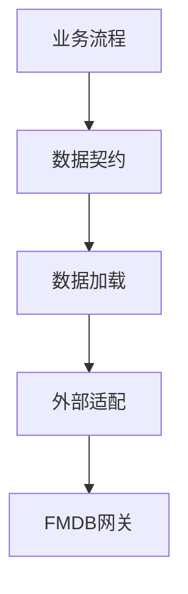

# data 与 fmdb 包结构稳定化建议

## 一、结论

`src/main/java/com/fiberhome/ml/raha/data` 和 `src/main/java/com/fiberhome/ml/raha/fmdb` 建议重新组织，但不建议一次性全量移动。

当前更需要处理的是 `fmdb`：根包已经有 26 个类，只拆出 `gateway` 一个子包，仓储、表结构、写入、编解码、配置和运行校验混在一起，继续扩展会明显增加阅读和迁移成本。

`data` 包整体方向基本正确，已有 `domain`、`loader`、`profile`、`type` 四个子包。主要问题集中在 `data.loader`，目前有 20 个类，已经同时承载加载契约、文件加载实现、行身份生成、校验、快照和字段元数据生成，建议拆成更稳定的二级能力包。

本次文档只给出稳定化方案，不要求立即改包名。后续如果执行代码迁移，建议每次只迁移一个子包，并在同一提交中同步测试包和 import。

## 二、当前统计

统计时间：2026-07-19。

| 当前包 | 类数量 | 判断 |
| --- | ---: | --- |
| `data.domain` | 7 | 可以保留，核心数据对象边界清楚 |
| `data.loader` | 20 | 建议拆分，类数量偏多且职责混合 |
| `data.profile` | 2 | 可以保留，暂不继续拆分 |
| `data.type` | 10 | 暂时保留，后续按领域迁移枚举 |
| `fmdb` | 26 | 建议拆分，根包过重 |
| `fmdb.gateway` | 3 | 可以保留，职责清楚 |

## 三、稳定化原则

1. 不为了目录完整性创建空包。
2. 单个子包少于 3 个稳定类时，优先保留在父包或并入职责最接近的子包。
3. 单个子包超过 12 个类，并且出现契约、实现、记录对象、工具类混放时，开始拆下一层。
4. 根包只保留外部最常用的装配入口或短期无法稳定归类的类。
5. `data` 不依赖 `fmdb`，`fmdb` 可以依赖 `data` 的领域对象和加载契约。
6. 迁移时不保留旧包兼容类，避免长期出现双路径。

建议依赖方向如下。



说明：

- `data.domain` 和 `data.loader` 表达核心数据契约。
- `fmdb` 表达外部系统适配，不反向进入 `data`。
- 上层服务应该优先依赖接口和领域对象，少直接依赖 FMDB 内部实现类。

## 四、data 包建议

### 4.1 保留结构

以下结构可以继续保留。

```text
com.fiberhome.ml.raha.data
  domain
  profile
  type
```

| 当前类 | 建议位置 | 原因 |
| --- | --- | --- |
| `RahaDataset` | `data.domain` | 数据集领域对象 |
| `DatasetSnapshot` | `data.domain` | 快照领域对象 |
| `DetectionResult` | `data.domain` | 检测结果领域对象 |
| `CellCoordinate` | `data.domain` | 单元格坐标值对象 |
| `CellValue` | `data.domain` | 单元格值对象 |
| `ColumnMetadata` | `data.domain` | 字段元数据 |
| `ColumnProfile` | `data.domain` | 字段画像结果，虽然服务在 `profile`，但它仍是领域结果对象 |
| `ColumnProfiler` | `data.profile` | 字段画像计算器 |
| `ColumnProfileService` | `data.profile` | 字段画像服务 |

### 4.2 loader 拆分目标

建议把 `data.loader` 稳定为加载契约根包，并新增三个能力子包。

```text
com.fiberhome.ml.raha.data.loader
  identity
  metadata
  validation
```

| 当前类 | 建议位置 | 原因 |
| --- | --- | --- |
| `RahaDatasetLoader` | `data.loader` | 对外加载接口，保留在契约根包 |
| `DataLoadRequest` | `data.loader` | 加载请求契约，外部引用较多 |
| `DataFormat` | `data.loader` | 加载格式契约，外部引用较多 |
| `LoadedDataset` | `data.loader` | 加载返回契约，外部引用较多 |
| `FileRahaDatasetLoader` | `data.loader` | 短期保留；只有一个文件加载实现时不单独建 `file` 包 |
| `RowIdentityConfig` | `data.loader.identity` | 行身份配置 |
| `RowIdentityMode` | `data.loader.identity` | 行身份模式 |
| `RowFingerprintAlgorithm` | `data.loader.identity` | 行指纹算法枚举 |
| `RowIdentityColumns` | `data.loader.identity` | 行身份技术字段常量 |
| `RowIdentityMetrics` | `data.loader.identity` | 行身份处理指标 |
| `RowIdentityResult` | `data.loader.identity` | 行身份处理结果 |
| `RowIdentityService` | `data.loader.identity` | 行身份生成和逻辑去重服务 |
| `RowIdValidator` | `data.loader.identity` | 行标识校验器 |
| `RowIdValidationResult` | `data.loader.identity` | 行标识校验结果 |
| `CanonicalRowSerializer` | `data.loader.identity` | 内容哈希归一化序列化器 |
| `ColumnMetadataFactory` | `data.loader.metadata` | 字段元数据生成器 |
| `SnapshotMetadataFactory` | `data.loader.metadata` | 快照元数据生成器 |
| `SchemaHasher` | `data.loader.metadata` | 模式哈希生成器 |
| `DataValidationErrorCode` | `data.loader.validation` | 数据加载校验错误码 |
| `DataValidationException` | `data.loader.validation` | 数据加载校验异常 |

### 4.3 data.type 处理建议

`data.type` 当前包含任务、阶段、策略、模型、特征、标签等枚举。它像一个全局枚举集合，但这些枚举已经被多个模块引用，直接迁移会带来较大 import 变更。

短期建议保留 `data.type`，不在本轮稳定化中移动。

中期可以按归属逐步迁移：

| 当前枚举 | 中期建议位置 |
| --- | --- |
| `JobType`、`JobStatus` | `job.domain` |
| `StageType`、`StageStatus` | `job.stage.core` 或 `job.domain` |
| `StrategyFamily`、`StrategyStatus` | `strategy.domain` |
| `FeatureType` | `feature.domain` |
| `ClassifierType`、`ModelStatus` | `model.domain` |
| `LabelSource` | `label` 或 `annotation` 相关包 |

## 五、fmdb 包建议

### 5.1 目标结构

建议把 FMDB 作为基础设施适配包处理，目标结构如下。

```text
com.fiberhome.ml.raha.fmdb
  gateway
  schema
  repository
  result
  support
```

`fmdb` 根包短期只保留少量高频装配类。等迁移完成并确认外部引用稳定后，再决定是否把根包清空到只剩入口类。

### 5.2 类迁移建议

| 当前类 | 建议位置 | 原因 |
| --- | --- | --- |
| `FmdbTableGateway` | `fmdb.gateway` | 表访问网关契约 |
| `SparkSqlFmdbTableGateway` | `fmdb.gateway` | Spark SQL 网关实现 |
| `InMemoryFmdbTableGateway` | `fmdb.gateway` | 测试和本地内存网关实现 |
| `FmdbPhysicalTable` | `fmdb.schema` | 物理表枚举 |
| `FmdbTableSchemas` | `fmdb.schema` | 物理表 Spark 模式定义 |
| `FmdbTableRecord` | `fmdb.schema` | 通用表记录封装 |
| `FmdbSchemaInitializer` | `fmdb.schema` | 表结构初始化 |
| `FmdbSchemaResolver` | `fmdb.schema` | 数据加载字段解析契约 |
| `DefaultFmdbSchemaResolver` | `fmdb.schema` | 默认字段解析实现 |
| `FmdbPartitionUtils` | `fmdb.schema` | 分区字段工具，与物理表结构强相关 |
| `FmdbJobRepository` | `fmdb.repository` | 任务运行记录仓储 |
| `FmdbAnnotationRecordRepository` | `fmdb.repository` | 标注记录仓储 |
| `FmdbSampleRecordRepository` | `fmdb.repository` | 采样记录仓储 |
| `FmdbModelMetadataRepository` | `fmdb.repository` | 模型元数据仓储 |
| `FmdbTrainingArtifactRepository` | `fmdb.repository` | 训练样本和训练产物仓储 |
| `FmdbTrainingCellRecord` | `fmdb.repository` | 训练单元格持久化记录 |
| `FmdbTrainingColumnArtifactRecord` | `fmdb.repository` | 训练字段产物持久化记录 |
| `FmdbTrainingExampleRecord` | `fmdb.repository` | 训练样本持久化记录 |
| `FmdbResultWriter` | `fmdb.result` | 检测结果写入契约 |
| `SparkSqlFmdbResultWriter` | `fmdb.result` | Spark SQL 检测结果写入实现 |
| `FmdbResultPersistenceVerifier` | `fmdb.result` | 结果持久化校验器 |
| `FmdbDetectionWriteContext` | `fmdb.result` | 检测写入上下文 |
| `FmdbPersistenceConfig` | `fmdb.support` | FMDB 持久化配置 |
| `FmdbRawValueAccessPolicy` | `fmdb.support` | 原始值访问策略 |
| `FmdbJsonCodec` | `fmdb.support` | 通用 JSON 编解码工具 |
| `FmdbFeatureDictionaryCodec` | `fmdb.support` | 特征字典编解码工具 |
| `FmdbColumnArtifact` | `fmdb.support` | 字段产物配置枚举 |
| `FmdbDatasetLoader` | `fmdb` | 短期保留在根包，作为外部装配常用加载适配器 |
| `FmdbModelStore` | `fmdb` | 短期保留在根包，作为外部装配常用模型存储入口 |

### 5.3 根包保留策略

建议第一轮只让 `FmdbDatasetLoader` 和 `FmdbModelStore` 暂留根包，原因是它们分别对应外部最常见的数据加载和模型存储入口，短期保留在根包更利于装配。

如果后续新增更多 FMDB 数据读取类或模型存储类，例如 SQL 加载、视图加载、权限包装加载，可以再创建：

```text
com.fiberhome.ml.raha.fmdb.loader
```

在达到 3 个稳定类之前，不建议提前创建 `fmdb.loader`。

## 六、迁移顺序

建议按以下顺序迁移，降低 import 震荡和测试失败定位成本。

1. 迁移 `data.loader.validation`，影响面最小。
2. 迁移 `data.loader.metadata`，主要影响文件加载器和 FMDB schema resolver。
3. 迁移 `data.loader.identity`，影响行标识相关测试和加载器。
4. 迁移 `fmdb.schema`，先稳定表结构、分区、schema 解析。
5. 迁移 `fmdb.support`，处理配置、策略和编解码工具。
6. 迁移 `fmdb.result`，处理结果写入和持久化校验。
7. 迁移 `fmdb.repository`，最后移动引用最多的仓储实现。
8. 同步测试包路径和 import。
9. 执行从零编译和相关集成测试。

## 七、验收清单

代码迁移完成后建议检查：

1. `rg "com\\.fiberhome\\.ml\\.raha\\.fmdb\\.(FmdbJobRepository|FmdbTableSchemas|FmdbJsonCodec)" src/main src/test` 不再命中旧根包导入。
2. `rg "com\\.fiberhome\\.ml\\.raha\\.data\\.loader\\.(RowIdentityService|SchemaHasher|DataValidationException)" src/main src/test` 不再命中旧根包导入。
3. `mvn --% -q -DskipTests -Denforcer.skip=true clean test-compile` 通过。
4. `mvn --% -q -Denforcer.skip=true test` 通过，或者至少通过 `data`、`fmdb`、采样、训练、任务编排相关测试。
5. 新增和修改的 Java 注释全部为中文。
6. Java 和 Markdown 文件保持 UTF-8 无 BOM 与 LF 换行。

## 八、暂不建议做的事

1. 不建议把 `data.type` 立即拆散，当前影响面较大，收益不如先拆 `loader` 明确。
2. 不建议创建 `fmdb.loader`、`fmdb.config`、`fmdb.codec` 等单类或双类小包，除非后续类数量继续增长。
3. 不建议保留旧包兼容类，会让调用方长期无法判断真实边界。
4. 不建议把 FMDB 仓储实现移入 `repository.adapter`，否则基础设施适配会分散在两个顶层包中。
5. 不建议把 `FmdbDatasetLoader` 移入 `data.loader`，因为它依赖 FMDB 外部系统语义，属于基础设施适配。

## 九、最终建议

先拆 `data.loader`，再拆 `fmdb` 根包。

`data` 的稳定化目标是让加载契约、行身份、元数据和校验各自清楚。

`fmdb` 的稳定化目标是让外部网关、物理表结构、仓储实现、结果写入和支撑工具各自清楚。

执行迁移时，优先保证依赖方向稳定：核心领域和业务流程依赖 `data` 契约，FMDB 作为外部适配实现依赖这些契约，不反向污染核心数据包。
