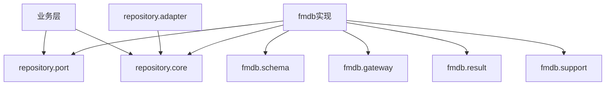

# fmdb 与 repository 包结构稳定化建议

## 一、结论
不建议把 `fmdb` 和 `repository` 直接合并成一个扁平大包。

更稳妥的做法是统一“存储域”的上层命名空间，但保留清晰分层：
- `repository` 负责抽象、协议和通用存储对象
- `fmdb` 负责 FMDB 具体实现、表结构、写入、读取和适配

如果一定要“合并”，推荐合并的是命名空间归属，而不是把所有类堆到同一层。

## 二、当前现状
当前两个包的职责已经有明显区分。

| 包 | 文件数 | 主要职责 |
| --- | ---: | --- |
| `repository` | 33 | 抽象接口、通用值对象、默认适配器 |
| `fmdb` | 29 | FMDB 具体落地、表结构、网关、结果写入、持久化辅助 |

`repository` 内部结构：
- `core`：7 个类，放通用存储值对象和结果对象
- `port`：13 个类，放对外仓储接口
- `adapter`：13 个类，放默认实现和内存实现

`fmdb` 内部结构：
- 根包：2 个入口类
- `gateway`：3 个类
- `repository`：8 个类
- `result`：4 个类
- `schema`：7 个类
- `support`：5 个类

## 三、为什么不建议直接合并
1. `repository` 是抽象层，`fmdb` 是实现层，边界本来就不同。
2. `fmdb` 依赖 `repository.core` 和 `repository.port`，反向依赖很少，说明当前方向是单向的。
3. 直接平铺合并会把接口、实现、表结构、网关、结果写入混在一起，后续维护成本更高。
4. 现有调用方已经能通过包名判断职责，贸然合并会带来较大 import 震荡。

## 四、推荐结构
推荐把“存储域”收拢到 `repository` 作为上层入口，`fmdb` 作为其下的实现适配分支。

```text
com.fiberhome.ml.raha.repository
  core
  port
  adapter
  adapter.fmdb
```

建议映射关系：

| 当前位置 | 建议位置 | 说明 |
| --- | --- | --- |
| `repository.core` | 保留 | 通用存储值对象和结果对象 |
| `repository.port` | 保留 | 对外仓储接口 |
| `repository.adapter` | 保留 | 默认实现、内存实现 |
| `fmdb.gateway` | `repository.adapter.fmdb.gateway` | FMDB 表访问网关 |
| `fmdb.schema` | `repository.adapter.fmdb.schema` | FMDB 表结构与解析 |
| `fmdb.result` | `repository.adapter.fmdb.result` | FMDB 结果写入 |
| `fmdb.support` | `repository.adapter.fmdb.support` | FMDB 配置、编解码、策略 |
| `fmdb.repository` | `repository.adapter.fmdb.repository` | FMDB 仓储实现 |
| `fmdb` 根包入口类 | `repository.adapter.fmdb` 或暂留 | 视对外调用稳定性决定 |

## 五、推荐依赖方向


核心原则：
- 业务层只依赖接口和通用对象
- `fmdb` 只实现仓储能力，不反向污染核心抽象

## 六、落地顺序
建议按下面顺序做：
1. 先保留 `repository.core` 和 `repository.port` 不动。
2. 再把 `fmdb.gateway`、`fmdb.schema`、`fmdb.result`、`fmdb.support` 迁入 `repository.adapter.fmdb`。
3. 然后迁移 `fmdb.repository` 下的具体实现。
4. 最后再决定 `FmdbDatasetLoader`、`FmdbModelStore` 是否继续留在 `fmdb` 根包。

## 七、最终建议
如果目标是“结构稳定”，我建议采用“统一父包、保留分层”的方案，而不是“一个包里全塞满”。

一句话结论：
`repository` 继续做抽象与通用适配层，`fmdb` 收敛为 `repository.adapter.fmdb` 下面的实现域，最稳。
