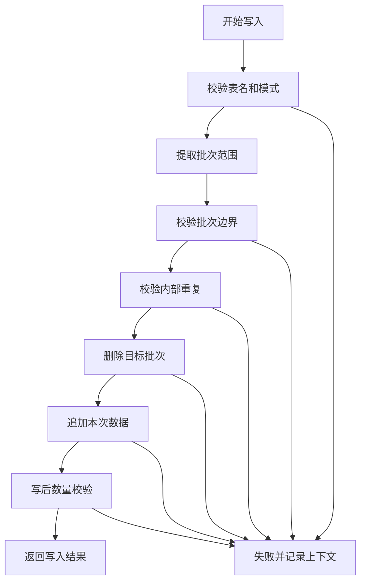

# FMDB 分区替换或批次删除后插入方案

> 重要修订：本方案原先包含按条件删除的描述。根据新的约束，生产优化方向应改为“直接删除分区或覆盖分区”，禁止把 `DELETE FROM ... WHERE ...` 作为主要实现方式。完整分区级方案见：
>
> `doc/20260720/FMDB直接删除分区替换方案-202607201545.md`
>
> 当前文档保留为前序分析记录，后续实现以新版文档为准。

## 1. 方案结论

“插入前先删除目标批次，再直接插入”是一个可行的折中方案，但不建议对九张表一刀切使用。

它适合批次型大数据结果表，例如采样记录、标注记录、训练派生产物、最终训练样本和检测结果。它不适合任务状态、阶段状态和模型发布状态这类追加式状态快照表。

推荐策略：

- 大批量结果表：使用“精确批次删除后直插”。
- 状态快照表：继续使用当前幂等追加。
- 模型产物表：默认继续幂等追加，只能对未发布、未进入状态流转的临时模型集合谨慎替换。
- 开发测试：可允许更激进的分区清理后直插。
- 生产环境：必须有批次级串行化、写后校验和失败恢复策略。

## 2. 这个方案解决什么问题

当前行级幂等追加的核心成本是：

1. 读取目标表历史数据。
2. 从历史数据中提取业务主键。
3. 对历史主键做去重。
4. 用 `left_anti` 反连接过滤待写入数据。
5. 写入前执行 `count`。

批次删除后插入的思路是：

1. 根据本次待写入数据的批次边界生成删除条件。
2. 先删除目标表中同一批次的旧数据。
3. 直接追加本次完整批次。
4. 写后按批次条件校验记录数。

这样可以把“历史全量主键比对”变成“目标批次范围清理”。对于历史分区很多、每次只写一个批次的场景，通常会明显更快。

## 3. 基本语义

该方案不是普通追加，而是“本批次结果以本次计算为准”。

语义可以描述为：

```text
同一个批次标识下，旧结果全部作废；
删除旧结果后，插入本次完整结果；
插入完成后，目标批次记录数必须等于本次期望记录数。
```

它要求业务上满足一个前提：

同一个批次再次执行时，应该产生相同语义的一批结果，或者允许用新结果完全覆盖旧结果。

## 4. 和当前行级幂等的区别

| 对比项 | 行级幂等追加 | 批次删除后插入 |
| --- | --- | --- |
| 正确性语义 | 已存在行跳过，新行追加 | 旧批次删除，新批次重写 |
| 主要成本 | 历史主键扫描、去重、反连接 | 删除目标批次、直接写入、写后校验 |
| 适合数据 | 真正增量补行 | 完整批次重算 |
| 失败风险 | 写入失败通常保留旧数据 | 删除成功后插入失败可能造成批次缺失 |
| 并发要求 | 同批次并发仍有风险 | 同批次必须串行 |
| 结果稳定性 | 重试后保留首次成功行 | 重试后以最后一次成功写入为准 |

## 5. 当前代码基础

当前网关已经有一个删除方法：

`src/main/java/com/fiberhome/ml/raha/repository/adapter/fmdb/gateway/SparkSqlFmdbTableGateway.java`

已有方法：

```java
deleteOlderThan(String tableName, String timestampColumn, long cutoffExclusive)
```

它内部使用：

```sql
DELETE FROM 目标表 WHERE 时间字段 < 截止时间
```

这说明当前设计已经假设生产 FMDB 表支持标准删除语句。批次删除后插入可以沿用同一类能力，但需要把按时间删除扩展成按安全白名单字段删除。

当前九张表分区情况来自：

`src/main/java/com/fiberhome/ml/raha/repository/adapter/fmdb/schema/FmdbPhysicalTable.java`

和：

`src/main/resources/db/fmdb/raha-fmdb-schema.sql`

## 6. 推荐新增网关能力

建议不要直接改造 `appendIdempotent`，而是在网关层新增一个显式方法。

建议接口：

```java
long replaceBatchThenAppend(
        String tableName,
        Dataset<Row> rows,
        FmdbBatchReplaceSpec spec)
```

建议规格对象字段：

```java
public final class FmdbBatchReplaceSpec {
    private final FmdbPhysicalTable physicalTable;
    private final List<String> deleteScopeColumns;
    private final List<String> integrityKeyColumns;
    private final boolean requireSingleBatch;
    private final boolean verifyAfterWrite;
}
```

字段含义：

| 字段 | 作用 |
| --- | --- |
| `physicalTable` | 限定只能对标准物理表使用，避免误删自定义表 |
| `deleteScopeColumns` | 从 incoming 中提取这些字段的值，组成删除条件 |
| `integrityKeyColumns` | 用于校验 incoming 内部是否存在重复业务键 |
| `requireSingleBatch` | 要求本次写入只属于一个业务批次 |
| `verifyAfterWrite` | 写入后按删除范围回查数量 |

## 7. 推荐执行流程



说明：

图中每一步都必须记录表名、批次字段、批次值、输入行数和异常堆栈。尤其是删除成功但插入失败的情况，日志必须能定位待修复批次。

## 8. 删除条件生成规则

删除条件不能让调用方随意传 SQL 字符串，必须由代码安全生成。

推荐规则：

1. 删除字段必须来自白名单。
2. 删除字段必须存在于目标表和 incoming。
3. 删除字段值从 incoming 中 `distinct` 提取。
4. 删除字段值不能为空。
5. 删除字段值不能为 `null`。
6. 字段名使用现有 `validateColumnName` 校验。
7. 字符串值必须做 SQL 字面量转义。
8. 默认要求批次字段只有一个值。
9. 对日期分区可允许多个值，例如检测结果跨天。

示例：

```sql
DELETE FROM dw.raha_sample_record
WHERE dataset_id = 'orders'
  AND partition_month = '202607'
  AND sample_batch_id = 'sample-abc'
```

检测结果可能跨多个日期：

```sql
DELETE FROM dw.raha_detection_result
WHERE dataset_id = 'orders'
  AND detection_batch_id = 'job-001'
  AND partition_date IN ('20260720', '20260721')
```

## 9. 各表适配建议

| 物理表 | 是否推荐 | 删除范围字段 | 写后校验字段 | 说明 |
| --- | --- | --- | --- | --- |
| `dw.raha_sample_record` | 推荐 | `dataset_id, partition_month, sample_batch_id` | `row_id` | 采样批次是完整批次，适合删除后重写 |
| `dw.raha_annotation_record` | 谨慎推荐 | `dataset_id, partition_month, annotation_batch_id` | `row_id` | 人工数据敏感，必须保证同批次串行和写后校验 |
| `dw.raha_training_column_artifact` | 推荐 | `dataset_id, training_batch_id` | `column_name` | 未分区，删除会扫表，但行数通常较少 |
| `dw.raha_training_cell` | 推荐 | `dataset_id, training_batch_id` | `cell_id` | 分区刚好等于批次边界，非常适合 |
| `dw.raha_training_example` | 推荐 | `dataset_id, partition_month, model_set_version` | `cell_id` | 最终训练样本必须防重复，批次替换比行级去重更合适 |
| `dw.raha_model_artifact` | 默认不推荐 | 无默认方案 | `model_version` | 模型发布状态是快照流，删除可能破坏状态历史 |
| `dw.raha_detection_result` | 推荐 | `dataset_id, detection_batch_id, partition_date` | `cell_id` | 检测批次可重算，适合按批次覆盖 |
| `dw.raha_job_run` | 不推荐 | 不适用 | 不适用 | 任务状态快照不能先删后插 |
| `dw.raha_job_stage_attempt` | 不推荐 | 不适用 | 不适用 | 阶段尝试审计不能先删后插 |

## 10. 为什么状态表不适合删除后插入

`raha_job_run` 和 `raha_job_stage_attempt` 保存的是状态演进历史，不是可重算结果集。

例如一个任务状态可能经历：

```text
CREATED -> RUNNING -> SUCCEEDED
```

阶段状态可能经历：

```text
RUNNING -> FAILED -> RETRY -> RUNNING -> SUCCEEDED
```

这些状态记录本身有审计价值。删除旧记录再插入最新记录，会丢失状态历史，也会让失败定位、重试分析和恢复逻辑变弱。

因此状态表应该继续保留当前逻辑：

- 相同状态跳过。
- 状态变化追加新版本。
- 通过 `state_version` 恢复最新状态。

## 11. 为什么模型表默认不建议替换

`dw.raha_model_artifact` 同时保存模型载荷和模型状态快照。模型可能从候选变成发布，也可能被禁用或回滚。

如果对模型表使用删除后插入，可能误删：

- 已发布模型状态。
- 历史候选模型。
- 回滚需要的旧状态。
- 同一模型集合下其他字段模型。

因此模型表只能在非常受控的范围内考虑替换：

- 仅限未发布模型集合。
- 删除范围必须精确到 `model_set_version`。
- 删除前确认没有 `PUBLISHED` 或 `DISABLED` 状态。
- 写后确认模型数量和字段集合完全一致。

默认建议继续用幂等追加。

## 12. 推荐先落地的表

建议按风险从低到高分阶段落地。

第一阶段：

- `dw.raha_training_cell`
- `dw.raha_training_example`
- `dw.raha_detection_result`

理由：

- 都是可重算派生结果。
- 数据量较大，性能收益明显。
- 删除范围可以比较明确。

第二阶段：

- `dw.raha_sample_record`
- `dw.raha_training_column_artifact`

理由：

- 采样批次可重建，但会影响人工标注入口，需要谨慎。
- 列级产物行数不大，收益没有训练样本和检测结果高。

第三阶段：

- `dw.raha_annotation_record`

理由：

- 标注属于人工数据，虽然同一 `annotation_batch_id` 可由同一文件指纹确定，但删除后插入失败会影响用户导入结果。
- 必须先有更强的失败恢复和并发保护。

不建议阶段：

- `dw.raha_job_run`
- `dw.raha_job_stage_attempt`
- `dw.raha_model_artifact`

## 13. 失败场景和处理策略

### 13.1 删除成功，插入失败

这是该方案最大的风险。

结果：

- 目标批次旧数据被删除。
- 新数据没有完整写入。
- 读路径可能发现批次缺失。

处理策略：

1. 方法必须抛出异常，不能返回成功。
2. 日志必须记录目标表、删除范围、输入行数。
3. 上层重试时可以重新执行同一批次，因为旧数据已经被删除。
4. 如果输入数据无法重新构造，必须禁止使用该方案。

对当前训练、检测、采样流程来说，大多数输入可以从任务上下文重新计算或重新读取，因此可接受。对人工标注要谨慎，因为输入文件和导入上下文必须仍然可用。

### 13.2 删除成功，插入部分成功

Spark 作业提交通常有作业级提交语义，但不能把它当成强事务主键能力。

处理策略：

1. 插入后必须按批次条件回查数量。
2. 回查数量不等于期望数量时抛出异常。
3. 下一次重试先删除同一批次残留，再重新插入。

### 13.3 两个进程并发写同一批次

这是必须特别注意的场景。

可能的交错：

```text
进程 A 删除批次
进程 B 删除批次
进程 A 插入批次
进程 B 插入批次
```

最终可能产生重复数据。

处理策略：

1. 同一表同一批次必须串行化。
2. 单 JVM 的 `synchronized` 不够，因为多进程无法互斥。
3. 生产需要外部分布式锁、任务调度唯一性或 FMDB 原子事务能力。
4. 如果暂时没有分布式锁，只能把该方案限定在单实例或测试环境。

### 13.4 删除范围过大

如果删除条件只写到 `dataset_id + partition_month`，会误删同月其他批次。

处理策略：

1. 删除范围必须包含业务批次字段。
2. 禁止只按物理分区删除，除非该分区就是一个批次。
3. 对 `training_cell` 可以按 `dataset_id + training_batch_id` 删除，因为物理分区就是批次边界。
4. 对 `sample_record`、`annotation_record`、`training_example` 不能只按月份删除。

## 14. 写后校验设计

写后校验不能只校验插入动作是否成功，还要校验物理数据是否完整。

推荐校验：

| 校验项 | 说明 |
| --- | --- |
| 批次数量 | 目标批次 `count` 等于本次输入行数 |
| 内部主键唯一 | incoming 中业务主键不能重复 |
| 批次值一致 | incoming 中批次字段只能落在允许范围内 |
| 字段模式一致 | 目标表和 incoming schema 兼容 |
| 分区范围一致 | 写后只在本次声明分区内查到数据 |

为了避免额外成本过高，内部主键唯一校验可以分级：

- 生产安全模式：执行主键唯一校验。
- 性能模式：信任上游构造，只执行批次数量校验。
- 测试直插模式：可以只执行批次数量校验，甚至允许关闭校验。

## 15. 推荐配置项

建议新增写入策略配置，而不是硬编码。

```properties
raha.fmdb.write-mode=IDEMPOTENT_BY_KEY
raha.fmdb.replace-batch.enabled=false
raha.fmdb.replace-batch.verify-after-write=true
raha.fmdb.replace-batch.require-lock=true
raha.fmdb.replace-batch.allowed-tables=training-cell,training-example,detection-result
raha.fmdb.direct-append-unsafe.enabled=false
```

表级覆盖示例：

```properties
raha.persistence.table.training-example.write-mode=REPLACE_BATCH
raha.persistence.table.detection-result.write-mode=REPLACE_BATCH
raha.persistence.table.job-run.write-mode=IDEMPOTENT_BY_KEY
```

推荐枚举：

```java
public enum FmdbWriteMode {
    IDEMPOTENT_BY_KEY,
    REPLACE_BATCH,
    DIRECT_APPEND_UNSAFE
}
```

## 16. 推荐代码改造点

### 16.1 新增批次替换规格

新增文件建议：

```text
src/main/java/com/fiberhome/ml/raha/repository/adapter/fmdb/gateway/FmdbBatchReplaceSpec.java
```

职责：

- 定义删除范围字段。
- 定义完整性主键。
- 定义是否允许多分区。
- 定义写后校验策略。

### 16.2 扩展网关接口

修改：

```text
src/main/java/com/fiberhome/ml/raha/repository/adapter/fmdb/gateway/FmdbTableGateway.java
```

新增：

```java
long replaceBatchThenAppend(String tableName,
                            Dataset<Row> rows,
                            FmdbBatchReplaceSpec spec);
```

### 16.3 Spark 网关实现

修改：

```text
src/main/java/com/fiberhome/ml/raha/repository/adapter/fmdb/gateway/SparkSqlFmdbTableGateway.java
```

实现要点：

1. 复用表名、字段名、模式兼容校验。
2. 从 incoming 提取删除范围。
3. 构造安全 SQL 删除条件。
4. 执行 `DELETE FROM ... WHERE ...`。
5. 对齐字段顺序后 `insertInto`。
6. 写后按删除范围回查数量。
7. 捕获异常并记录上下文。

### 16.4 内存网关实现

修改：

```text
src/main/java/com/fiberhome/ml/raha/repository/adapter/fmdb/gateway/InMemoryFmdbTableGateway.java
```

实现方式：

1. 从内存表中过滤掉删除范围。
2. 和 incoming `unionByName`。
3. `localCheckpoint` 截断血缘。
4. 写后执行数量校验。

### 16.5 仓储层选择写入模式

优先改造：

```text
FmdbTrainingArtifactRepository
SparkSqlFmdbResultWriter
FmdbSampleRecordRepository
```

不建议第一阶段改造：

```text
FmdbJobRepository
FmdbStageRepository
FmdbModelMetadataRepository
FmdbModelStore
```

## 17. 表级删除条件示例

### 17.1 采样记录

```sql
DELETE FROM dw.raha_sample_record
WHERE dataset_id = ?
  AND partition_month = ?
  AND sample_batch_id = ?
```

插入后校验：

```sql
SELECT count(1)
FROM dw.raha_sample_record
WHERE dataset_id = ?
  AND partition_month = ?
  AND sample_batch_id = ?
```

### 17.2 训练单元格

```sql
DELETE FROM dw.raha_training_cell
WHERE dataset_id = ?
  AND training_batch_id = ?
```

这是最适合该方案的表，因为物理分区就是 `dataset_id + training_batch_id`。

### 17.3 最终训练样本

```sql
DELETE FROM dw.raha_training_example
WHERE dataset_id = ?
  AND partition_month = ?
  AND model_set_version = ?
```

不要只按 `partition_month` 删除，因为同月可能有多个模型集合。

### 17.4 检测结果

```sql
DELETE FROM dw.raha_detection_result
WHERE dataset_id = ?
  AND detection_batch_id = ?
  AND partition_date IN (?, ?)
```

如果一个检测批次只在一天内完成，`partition_date` 通常只有一个值。如果跨天，需要允许多个日期值。

### 17.5 训练列级产物

```sql
DELETE FROM dw.raha_training_column_artifact
WHERE dataset_id = ?
  AND training_batch_id = ?
```

该表未分区，删除会扫描表。由于记录数通常按列数计，性能风险可接受。

## 18. 是否还需要幂等键

需要。

批次删除后插入只解决物理表重复写入问题，不能替代任务幂等键。

任务幂等键仍然用于：

- 判断相同配置是否重复提交。
- 复用已有任务。
- 关联任务状态和结果。
- 防止上层创建多个逻辑任务。

因此该方案不是移除幂等体系，而是把部分表的写入幂等从“行级去重”换成“批次级覆盖”。

## 19. 与分区裁剪优化的关系

分区裁剪优化仍然有价值。

建议保留两套路径：

- `IDEMPOTENT_BY_KEY`：继续使用 incoming 分区裁剪 existing。
- `REPLACE_BATCH`：使用 incoming 分区值生成删除范围。

这样可以根据表和运行模式选择不同策略。

## 20. 推荐落地顺序

建议按以下顺序推进：

1. 新增配置和接口，不改变默认行为。
2. 为内存网关和 Spark 网关实现 `REPLACE_BATCH`。
3. 先在 `dw.raha_training_example` 或 `dw.raha_detection_result` 上试点。
4. 增加单测覆盖重复重跑、半批次残留、空批次、多分区检测结果。
5. 增加 toy 端配置，显式启用批次替换。
6. 跑性能对比，确认删除后插入相对行级幂等的收益。
7. 再逐步扩展到采样和训练列级产物。

## 21. 测试用例建议

至少覆盖以下用例：

| 用例 | 预期 |
| --- | --- |
| 空表首次写入 | 写入数量等于输入数量 |
| 同批次重复写入相同数据 | 最终数量等于输入数量，不翻倍 |
| 同批次重复写入不同数据 | 最终保留第二次数据 |
| 目标批次存在半批次残留 | 删除残留后写入完整批次 |
| incoming 内部存在重复主键 | 安全模式下失败 |
| 删除条件缺少批次字段 | 直接拒绝 |
| 检测结果跨多个日期 | 只删除本批次涉及日期 |
| 状态表尝试使用替换模式 | 直接拒绝 |
| 删除后插入失败 | 抛出异常并记录可重试上下文 |
| 多实例并发同批次写入 | 没有分布式锁时标记不支持 |

## 22. 风险边界

该方案最大风险不是性能，而是删除语义。

必须坚持三个边界：

1. 删除范围必须精确到业务批次，不能只按月份或数据集删除。
2. 同一批次写入必须串行，不能允许多进程交错删除和插入。
3. 写后校验失败必须让任务失败，不能吞掉异常。

只要这三个边界守住，它比全局行级幂等更快，也比无检查直接插入更安全。

## 23. 对当前项目的建议

当前最合理的工程方案是：

1. 保留 `appendIdempotent` 作为默认写入方法。
2. 新增 `replaceBatchThenAppend` 作为批次替换写入方法。
3. 先让训练样本和检测结果支持批次替换。
4. toy 验证配置启用批次替换。
5. 生产默认仍使用行级幂等，等锁、校验和压测完成后再按表开启。

如果只是为了这次 toy 验证提速，可以更保守：

1. 运行前清理目标批次或目标临时库。
2. 对训练样本、检测结果走批次删除后插入。
3. 任务状态、阶段状态、模型表继续保留原逻辑。

这样既能降低扫描历史分区的成本，也不至于把任务状态和模型发布链路写乱。
