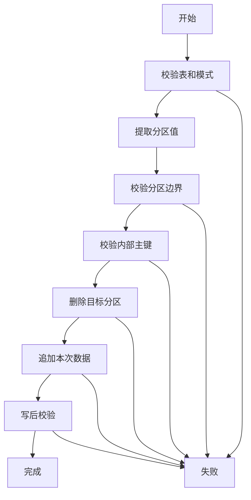

# FMDB 直接删除分区替换方案

## 1. 结论

如果目标是降低 Spark 写入前幂等校验成本，推荐采用“直接删除分区后插入”或“分区覆盖”方案，而不是使用行级条件删除。

但这个方案有一个硬前提：

目标批次必须完整落在可独立删除的物理分区内。

如果当前物理分区只到 `dataset_id + partition_month`，而同一个月内存在多个批次，那么直接删除这个月分区会误删其他批次。此时不能直接删现有分区，必须先调整分区设计，把批次标识纳入分区列。

因此当前建议是：

1. 对已经以批次为分区边界的表，直接启用分区删除后插入。
2. 对月分区、日分区但批次字段不在分区列里的表，先改造 DDL。
3. 对任务状态、阶段状态、模型发布状态表，不使用分区删除替换。

## 2. 为什么不用条件删除

条件删除虽然比行级幂等简单，但仍然会让 Spark 或底层存储按条件扫描目标数据。对于 ORC 分区表，真正快的方式应该是分区元数据级操作：

- 直接删除指定分区。
- 或者直接覆盖指定分区。

这类操作的性能关键在于分区定位，而不是逐行过滤。

所以本方案禁止把下面这种语义作为主路径：

```sql
DELETE FROM table WHERE ...
```

推荐使用：

```sql
ALTER TABLE table DROP IF EXISTS PARTITION (...)
```

或者使用 Spark 分区覆盖写入。

## 3. 分区删除的安全边界

直接删除分区只有在以下条件同时满足时才安全：

1. 分区列能精确表达本次写入批次。
2. 本次写入数据只覆盖这些分区。
3. 被删除分区中不存在其他业务批次的数据。
4. 本批次数据可以重新计算或重新读取。
5. 同一批次写入不存在多进程并发。
6. 写入后必须执行数量和主键完整性校验。

最重要的是第三点：如果一个物理分区里混着多个批次，就不能为了重跑一个批次而直接删整个分区。

## 4. 当前九张表的直接删分区可行性

| 物理表 | 当前分区 | 直接删分区是否安全 | 原因 |
| --- | --- | --- | --- |
| `dw.raha_sample_record` | `dataset_id, partition_month` | 当前不安全 | 同一数据集同一月可能有多个 `sample_batch_id` |
| `dw.raha_annotation_record` | `dataset_id, partition_month` | 当前不安全 | 同一月可能有多个 `annotation_batch_id` |
| `dw.raha_training_column_artifact` | 未分区 | 当前不适用 | 没有可删分区 |
| `dw.raha_training_cell` | `dataset_id, training_batch_id` | 安全 | 分区边界就是训练批次 |
| `dw.raha_training_example` | `dataset_id, partition_month` | 当前不安全 | 同一月可能有多个 `model_set_version` |
| `dw.raha_model_artifact` | 未分区 | 不推荐 | 模型状态有历史流转语义 |
| `dw.raha_detection_result` | `dataset_id, partition_date` | 当前不安全 | 同一天可能有多个 `detection_batch_id` |
| `dw.raha_job_run` | `dataset_id, partition_month` | 不推荐 | 任务状态快照不能按分区替换 |
| `dw.raha_job_stage_attempt` | `dataset_id, partition_month` | 不推荐 | 阶段尝试审计不能按分区替换 |

当前可以直接试点的表只有：

```text
dw.raha_training_cell
```

如果要让采样、标注、训练样本、检测结果也直接删分区，需要调整分区设计。

## 5. 推荐分区设计

### 5.1 采样记录表

当前分区：

```text
dataset_id, partition_month
```

建议改为：

```text
dataset_id, partition_month, sample_batch_id
```

这样可以删除单个采样批次分区：

```sql
ALTER TABLE dw.raha_sample_record
DROP IF EXISTS PARTITION (
  dataset_id='orders',
  partition_month='202607',
  sample_batch_id='sample-xxx'
)
```

注意：`sample_batch_id` 需要从普通字段移动到分区字段。Spark 读取分区表时会把分区字段放到末尾，写入前仍需要按目标表字段顺序对齐。

### 5.2 标注记录表

当前分区：

```text
dataset_id, partition_month
```

建议改为：

```text
dataset_id, partition_month, annotation_batch_id
```

删除单个标注批次分区：

```sql
ALTER TABLE dw.raha_annotation_record
DROP IF EXISTS PARTITION (
  dataset_id='orders',
  partition_month='202607',
  annotation_batch_id='ann-xxx'
)
```

标注数据属于人工数据，不建议第一阶段就启用分区替换。应先用于可重算派生表。

### 5.3 训练列级产物表

当前未分区。

建议如果要支持分区替换，改为：

```text
dataset_id, training_batch_id
```

删除训练批次产物：

```sql
ALTER TABLE dw.raha_training_column_artifact
DROP IF EXISTS PARTITION (
  dataset_id='orders',
  training_batch_id='train-xxx'
)
```

该表行数通常按字段数量增长，性能压力不是最大，可以第二阶段再改。

### 5.4 训练单元格表

当前分区：

```text
dataset_id, training_batch_id
```

这是最适合直接删除分区的表。

删除训练批次分区：

```sql
ALTER TABLE dw.raha_training_cell
DROP IF EXISTS PARTITION (
  dataset_id='orders',
  training_batch_id='train-xxx'
)
```

该表默认不开启持久化。如果开启，它往往是最大数据量表，应优先使用分区删除替换，而不是行级幂等反连接。

### 5.5 最终训练样本表

当前分区：

```text
dataset_id, partition_month
```

建议改为：

```text
dataset_id, partition_month, model_set_version
```

删除单个模型集合训练样本分区：

```sql
ALTER TABLE dw.raha_training_example
DROP IF EXISTS PARTITION (
  dataset_id='orders',
  partition_month='202607',
  model_set_version='model-set-xxx'
)
```

最终训练样本直接影响模型复现。只有把 `model_set_version` 纳入分区列，才能安全删除单个模型集合的数据。

### 5.6 检测结果表

当前分区：

```text
dataset_id, partition_date
```

建议改为：

```text
dataset_id, partition_date, detection_batch_id
```

删除单个检测批次在某一天的分区：

```sql
ALTER TABLE dw.raha_detection_result
DROP IF EXISTS PARTITION (
  dataset_id='orders',
  partition_date='20260720',
  detection_batch_id='job-xxx'
)
```

如果一个检测批次跨多个日期，需要删除多个分区：

```text
orders / 20260720 / job-xxx
orders / 20260721 / job-xxx
```

不要只删除 `dataset_id + partition_date`，否则会误删同一天其他检测批次。

### 5.7 模型产物表

模型产物表不建议采用分区删除替换。

原因：

- 它包含模型载荷。
- 它包含模型状态版本。
- 发布、禁用、回滚都依赖状态历史。

如果未来一定要优化，可以单独设计模型集合临时表或模型版本提交表，而不是对现有模型表做分区删除。

### 5.8 任务状态和阶段状态表

这两张表不建议采用分区删除替换：

```text
dw.raha_job_run
dw.raha_job_stage_attempt
```

它们保存状态流转和审计记录。删除分区会丢失历史状态，影响重复提交判断、失败定位和阶段恢复。

## 6. 推荐落地范围

### 6.1 第一阶段

先支持：

```text
dw.raha_training_cell
```

原因：

- 当前分区已经满足批次边界。
- 数据量大。
- 默认不开启，试点风险低。

如果可以调整 DDL，再支持：

```text
dw.raha_training_example
dw.raha_detection_result
```

原因：

- 都是可重算结果。
- 数据量可能较大。
- 对行级幂等性能收益明显。

### 6.2 第二阶段

支持：

```text
dw.raha_sample_record
dw.raha_training_column_artifact
```

采样记录需要注意：如果采样结果已经被标注使用，删除并重写必须保证同一个 `sample_batch_id` 的内容完全一致。

### 6.3 第三阶段

谨慎支持：

```text
dw.raha_annotation_record
```

人工标注不可轻易丢失。只有在确认同一 `annotation_batch_id` 可以从原始标注文件完整恢复时，才允许分区删除替换。

## 7. 网关方法设计

建议新增方法，不要复用 `appendIdempotent`。

接口建议：

```java
long replacePartitionsThenAppend(
        String tableName,
        Dataset<Row> rows,
        FmdbPartitionReplaceSpec spec)
```

规格对象建议：

```java
public final class FmdbPartitionReplaceSpec {
    private final FmdbPhysicalTable physicalTable;
    private final List<String> partitionColumns;
    private final List<String> requiredSingleValueColumns;
    private final List<String> integrityKeyColumns;
    private final boolean verifyAfterWrite;
}
```

字段说明：

| 字段 | 说明 |
| --- | --- |
| `physicalTable` | 限定标准九表，避免误操作自定义表 |
| `partitionColumns` | 真实物理分区列，必须和 DDL 一致 |
| `requiredSingleValueColumns` | 必须只有一个值的分区列 |
| `integrityKeyColumns` | incoming 内部唯一性校验字段 |
| `verifyAfterWrite` | 写后是否按分区回查数量 |

## 8. 分区替换执行流程



说明：

每一步都必须记录表名、分区列、分区值、输入行数。删除分区和写入失败必须记录异常堆栈。

## 9. 分区值提取规则

从 `incoming` 中提取分区值，而不是由外部拼 SQL。

规则：

1. 分区列必须存在于 incoming。
2. 分区列必须存在于目标表。
3. 分区列名必须通过字段名白名单校验。
4. 分区值不能为 `null`。
5. 默认一个写入请求只能覆盖一个业务批次。
6. 检测结果可以允许多个 `partition_date`。
7. 拼接分区规格时必须转义字符串字面量。

示例分区规格：

```text
PARTITION (dataset_id='orders', training_batch_id='train-001')
```

## 10. 删除分区语句生成

建议每个分区单独执行一条语句，便于日志定位。

示例：

```sql
ALTER TABLE dw.raha_training_cell
DROP IF EXISTS PARTITION (
  dataset_id='orders',
  training_batch_id='train-001'
)
```

检测结果跨日期时：

```sql
ALTER TABLE dw.raha_detection_result
DROP IF EXISTS PARTITION (
  dataset_id='orders',
  partition_date='20260720',
  detection_batch_id='job-001'
)
```

```sql
ALTER TABLE dw.raha_detection_result
DROP IF EXISTS PARTITION (
  dataset_id='orders',
  partition_date='20260721',
  detection_batch_id='job-001'
)
```

注意：这不是条件删除，而是分区元数据操作。

## 11. 插入方式

删除分区后，可以继续使用：

```java
rows.write().mode(SaveMode.Append).insertInto(tableName)
```

这样语义清晰：

1. 旧分区先删除。
2. 新数据再按分区字段落入新分区。

另一种选择是分区覆盖写入，但需要确认 FMDB 和 Spark Catalog 对动态分区覆盖的支持程度。若没有充分验证，不建议第一阶段使用覆盖写入作为默认实现。

## 12. 写后校验

分区删除后插入必须写后校验。

推荐校验项：

| 校验项 | 说明 |
| --- | --- |
| 分区数量 | 本次涉及分区必须全部可读 |
| 记录数量 | 目标分区记录数等于 incoming 行数 |
| 主键唯一 | 目标分区按业务主键去重后数量等于记录数 |
| 批次一致 | 目标分区只包含本次批次 |

如果为了性能只做一项，至少保留记录数量校验。

## 13. 并发控制

直接删除分区比行级幂等更依赖并发控制。

同一表同一分区不能并发执行：

```text
进程 A 删除分区
进程 B 删除分区
进程 A 插入数据
进程 B 插入数据
```

这种交错可能导致重复或覆盖不可预测。

因此需要至少一种保护：

1. 调度层保证同一批次只有一个任务运行。
2. 使用外部分布式锁。
3. 使用 FMDB 平台提供的表级或分区级锁。
4. 在单实例 toy 环境中明确声明不支持并发。

当前 Java 方法上的 `synchronized` 只能保护单进程，不能保护多进程。

## 14. 失败恢复

### 14.1 删除成功后插入失败

结果：

目标分区已被删除，新数据没有写完整。

处理：

1. 方法抛异常。
2. 日志记录分区规格。
3. 上层重试时再次删除同一分区并重新插入。
4. 如果数据不可重算，则禁止使用该模式。

### 14.2 插入部分成功

处理：

1. 写后校验失败。
2. 任务失败。
3. 下次重试先删分区，再重写。

### 14.3 删除了错误分区

这是严重事故。

预防：

1. 分区字段必须由标准表元数据提供。
2. 不允许调用方传任意 SQL。
3. 不允许缺少批次分区字段。
4. 不允许对状态表启用该模式。

## 15. 对当前 DDL 的调整建议

如果确定要走直接删分区，建议 DDL 调整如下。

| 表 | 建议分区 |
| --- | --- |
| `dw.raha_sample_record` | `dataset_id, partition_month, sample_batch_id` |
| `dw.raha_annotation_record` | `dataset_id, partition_month, annotation_batch_id` |
| `dw.raha_training_column_artifact` | `dataset_id, training_batch_id` |
| `dw.raha_training_cell` | 保持 `dataset_id, training_batch_id` |
| `dw.raha_training_example` | `dataset_id, partition_month, model_set_version` |
| `dw.raha_detection_result` | `dataset_id, partition_date, detection_batch_id` |
| `dw.raha_model_artifact` | 暂不调整 |
| `dw.raha_job_run` | 暂不调整 |
| `dw.raha_job_stage_attempt` | 暂不调整 |

注意：新增批次分区会增加分区数量。需要评估 FMDB Catalog 元数据压力和小文件数量。

## 16. 迁移策略

当前已有表如果已经建成月分区或日分区，不能直接改字段顺序后继续写。

推荐迁移方式：

1. 新建版本化物理表，例如 `dw.raha_training_example_v2`。
2. 使用新分区设计。
3. 新写入走新表。
4. 读路径短期兼容旧表和新表。
5. 历史数据按需迁移。
6. 验证完成后再切换正式表名。

如果只是 toy 环境，可以直接清表重建。

## 17. 代码改造建议

### 17.1 新增写入模式

```java
public enum FmdbWriteMode {
    IDEMPOTENT_BY_KEY,
    REPLACE_PARTITION,
    DIRECT_APPEND_UNSAFE
}
```

### 17.2 新增分区替换规格

新增：

```text
src/main/java/com/fiberhome/ml/raha/repository/adapter/fmdb/gateway/FmdbPartitionReplaceSpec.java
```

### 17.3 扩展网关接口

新增：

```java
long replacePartitionsThenAppend(String tableName,
                                 Dataset<Row> rows,
                                 FmdbPartitionReplaceSpec spec);
```

### 17.4 Spark 网关实现

核心逻辑：

1. 校验目标表。
2. 校验目标表是允许分区替换的标准表。
3. 提取 incoming 分区值。
4. 构造分区规格。
5. 执行 `ALTER TABLE ... DROP IF EXISTS PARTITION (...)`。
6. 按目标 schema 对齐列。
7. `insertInto` 追加。
8. 写后读取对应分区校验数量。

### 17.5 内存网关实现

内存网关没有真实分区元数据，可以用过滤模拟：

1. 按分区列过滤掉旧数据。
2. `unionByName` 合并新数据。
3. `localCheckpoint` 截断血缘。
4. 写后校验数量。

## 18. 推荐配置

```properties
raha.fmdb.write-mode=IDEMPOTENT_BY_KEY
raha.fmdb.partition-replace.enabled=false
raha.fmdb.partition-replace.verify-after-write=true
raha.fmdb.partition-replace.require-single-writer=true
```

表级配置：

```properties
raha.persistence.table.training-cell.write-mode=REPLACE_PARTITION
raha.persistence.table.training-example.write-mode=REPLACE_PARTITION
raha.persistence.table.detection-result.write-mode=REPLACE_PARTITION
raha.persistence.table.job-run.write-mode=IDEMPOTENT_BY_KEY
raha.persistence.table.job-stage-attempt.write-mode=IDEMPOTENT_BY_KEY
```

默认仍应使用 `IDEMPOTENT_BY_KEY`，等 DDL 和并发控制完成后再逐表开启。

## 19. 测试建议

| 用例 | 预期 |
| --- | --- |
| 训练单元格空表写入 | 自动创建分区并写入成功 |
| 训练单元格同批次重跑 | 旧分区删除，最终数量不翻倍 |
| 训练单元格不同批次写入 | 不影响其他批次分区 |
| 训练样本未包含 `model_set_version` 分区 | 拒绝启用分区替换 |
| 检测结果跨两个日期 | 删除两个具体批次分区 |
| 状态表启用分区替换 | 直接失败 |
| 分区值为空 | 直接失败 |
| incoming 内部业务主键重复 | 安全模式下失败 |
| 插入后数量不一致 | 写入失败并提示分区规格 |
| 并发同分区写入 | 无锁模式下标记不支持 |

## 20. 对当前问题的直接回答

是的，如果选择这个折中方案，删除应该优先直接删除分区，而不是用条件删除。

但按当前表结构，不能简单把所有表都改成直接删现有分区。因为很多表当前只按月份或日期分区，删除现有分区会误删同月或同日其他批次。

真正安全的做法是：

1. 先让批次标识成为分区列。
2. 再按完整分区规格执行 `ALTER TABLE DROP PARTITION`。
3. 删除后直接 `insertInto`。
4. 写后校验。
5. 状态表和模型状态表继续保留幂等追加。

如果当前只为 toy 验证提速，可以先在隔离环境中清理整张表或整个月分区，但这属于测试捷径，不应作为生产方案。

