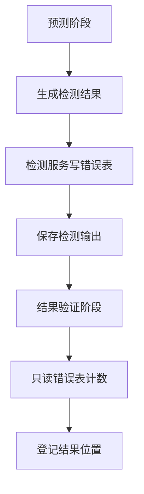

# FMDB 预测结果双写改造与风险分析

## 1. 结论

当前预测链路中，检测结果确实存在两个写入入口：

1. `RahaDetectService.detect(...)` 在检测完成后调用检测结果仓储保存结果。
2. `FmdbResultPersistenceVerifier.persistAndVerifyDetection(...)` 在结果持久化验证阶段再次调用结果写入器写入检测结果。

在当前幂等追加模式下，第二次写入会被 `appendIdempotent` 按 `detection_batch_id, cell_id, model_version` 拦住，因此通常不会出现物理重复。

如果后续改为直接写入，这里必须调整，否则同一个检测批次的错误结果会天然写两次。

推荐修改方向：

```text
检测服务负责唯一写入；
结果持久化验证阶段只读表校验，不再写表。
```

这比“检测服务不写、验证阶段写”更合理，因为检测服务当前已经具备检测上下文、模型集合版本校验和可信原始行回填能力。

## 2. 当前双写链路

### 2.1 第一次写入：检测服务

位置：

`src/main/java/com/fiberhome/ml/raha/service/detect/RahaDetectService.java`

关键逻辑：

```java
if (!results.isEmpty() && status != JobStatus.FAILED) {
    repository.saveAll(new DetectionResultSaveContext(
                    request.getJobId(), request.getDataset(),
                    request.getModelSetVersion(),
                    modelVersions.values()), results,
            request.getArtifactVersion(), clock.millis());
}
```

含义：

- 只要检测结果不为空，且任务不是失败，就调用检测结果仓储。
- 传入 `jobId`、检测数据集、模型集合版本、模型版本集合。
- 仓储内部会写入 `dw.raha_detection_result`。

### 2.2 第二次写入：结果验证阶段

位置：

`src/main/java/com/fiberhome/ml/raha/repository/adapter/fmdb/result/FmdbResultPersistenceVerifier.java`

关键逻辑：

```java
resultWriter.writeDetectionResults(
        FmdbPhysicalTable.DETECTION_RESULT.getTableName(), writeContext,
        output.getResults());
```

含义：

- 验证阶段拿检测输出再次构造 `FmdbDetectionWriteContext`。
- 再次调用写入器写 `dw.raha_detection_result`。
- 写完后再查表计数校验。

### 2.3 当前没有爆炸的原因

位置：

`src/main/java/com/fiberhome/ml/raha/repository/adapter/fmdb/result/SparkSqlFmdbResultWriter.java`

关键逻辑：

```java
tableGateway.appendIdempotent(tableName, frame,
        Arrays.asList("detection_batch_id", "cell_id", "model_version"));
```

当前第二次写入会查已有主键，并跳过已经写过的错误单元格。

如果改成直接写入：

```text
第一次写 N 条错误结果；
第二次再写同样 N 条错误结果；
最终物理表变成 2N 条。
```

后续 `find(jobId, cellId)` 还可能抛出“同一检测批次和单元格存在多个错误结果”。

## 3. 推荐目标结构

推荐改成单写入、单校验：



核心变化：

- `RahaDetectService` 保留写入。
- `FmdbResultPersistenceVerifier` 删除检测分支里的写入动作。
- 验证阶段只根据 `jobId`、`datasetId`、`partitionDate` 统计已经写好的错误结果。

## 4. 推荐代码修改点

### 4.1 修改 `FmdbResultPersistenceVerifier`

文件：

`src/main/java/com/fiberhome/ml/raha/repository/adapter/fmdb/result/FmdbResultPersistenceVerifier.java`

将方法：

```java
persistAndVerifyDetection(...)
```

改名或改语义为：

```java
verifyDetection(...)
```

删除以下逻辑：

```java
String modelSetVersion = modelSetVersion(dataset.getDatasetId(),
        output.getModelVersions().values());
FmdbDetectionWriteContext writeContext = new FmdbDetectionWriteContext(
        result.getJobId(), dataset.getTableName(), modelSetVersion,
        trustedRows(dataset));
resultWriter.writeDetectionResults(
        FmdbPhysicalTable.DETECTION_RESULT.getTableName(), writeContext,
        output.getResults());
```

保留：

1. 从 `output.getResults()` 中筛选错误结果。
2. 计算涉及的 `partition_date`。
3. 按 `dataset_id + detection_batch_id + partition_date` 查询错误表。
4. 校验物理记录数量等于错误结果数量。
5. 返回 `fmdb://dw.raha_detection_result/<jobId>`。

### 4.2 删除无用依赖

如果验证阶段不再写检测结果，`FmdbResultPersistenceVerifier` 中的以下依赖可以考虑删除：

```java
private final FmdbResultWriter resultWriter;
```

构造函数参数也可以去掉。

不过为了减少第一阶段改动范围，可以先保留字段但不在检测分支使用。等采样、训练验证也确认不需要写入器后再删除。

### 4.3 修改类注释

当前注释是：

```java
完成检测错误表写入，并对采样、训练和检测物理表执行数量及批次回读校验。
```

建议改为：

```java
对采样、训练和检测物理结果执行数量及批次回读校验。
```

避免误导后续维护者认为验证器也负责写入。

### 4.4 增加日志

验证阶段建议增加日志：

```text
开始校验 FMDB 检测错误结果，jobId={}，expectedErrorCount={}，partitionDates={}
FMDB 检测错误结果校验完成，jobId={}，actualErrorCount={}
```

异常时必须带：

- `jobId`
- `datasetId`
- `expectedErrorCount`
- `actualErrorCount`
- `partitionDates`

## 5. 是否可以反过来：检测服务不写，验证阶段写

也可以，但不推荐作为第一选择。

原因：

1. `RahaDetectService` 当前语义就是“执行列级预测并写入检测结果”。
2. 检测服务已经持有 `DetectionResultSaveContext`。
3. 检测结果仓储会做模型集合版本校验。
4. 验证器职责更像“确认结果已经落库”，不应该承担业务写入。

如果改成验证阶段写，需要：

- 让检测服务只返回结果，不保存。
- 把 `DetectionResultSaveContext` 或等价上下文传到验证阶段。
- 重新处理模型集合版本校验。
- 重新处理可信原始行回填。

改动范围更大，也更容易把职责搞散。

## 6. 直接写入模式下的必要配套

如果检测结果写入器从 `appendIdempotent` 改成直接追加，还需要同步做以下事情。

### 6.1 检测结果只允许一个写入口

必须保证只有：

```text
FmdbDetectionResultRepository.saveAll(...)
```

会调用：

```text
SparkSqlFmdbResultWriter.writeDetectionResults(...)
```

验证阶段不能再调用写入器。

### 6.2 写入器不要再写前查 existing

`SparkSqlFmdbResultWriter.writeDetectionResults(...)` 可以改为：

```text
构造错误结果行
直接 createDataFrame
直接 insertInto
返回错误记录数
```

但不建议第一步就删除 `appendIdempotent` 方法。建议新增直接写入模式，让检测结果表单独切换。

### 6.3 写后校验仍然保留

直接写入并不代表不要校验。

推荐保留：

```text
expected = output 中 isError 为 true 的数量
actual = 错误结果表中当前 jobId 的数量
expected == actual
```

这能及时发现双写、部分写入或漏写。

## 7. 当前预测链路的其他风险

### 7.1 检测结果只保存错误单元格

`SparkSqlFmdbResultWriter.writeDetectionResults(...)` 中明确跳过非错误结果：

```java
if (!result.isError()) {
    continue;
}
```

所以 `RahaDetectOutput.results` 是全量预测结果，而 `dw.raha_detection_result` 只保存错误单元格。

验证时不能用 `results.size()`，必须用：

```text
results 中 isError=true 的数量
```

当前 `FmdbResultPersistenceVerifier` 已经按 `isError` 筛选，这是正确的。

### 7.2 检测结果写入和验证当前重复计算原始行

检测仓储写入时：

```java
trustedRows(context.getDataset())
```

验证阶段当前也有：

```java
trustedRows(dataset)
```

如果改成验证阶段只读不写，验证阶段就不再需要构造完整原始行映射。

收益：

- 少一次 `dataset.getDataFrame().collectAsList()`。
- 降低 Driver 内存压力。
- 大表检测时更安全。

### 7.3 结果验证阶段再次查模型集合版本

当前验证阶段会调用：

```java
modelSetVersion(dataset.getDatasetId(), output.getModelVersions().values())
```

这个方法会读 `dw.raha_model_artifact`。

如果验证阶段不再写入检测结果，就不必再次解析模型集合版本。检测服务和检测仓储已经做过模型集合版本校验。

建议删除这次模型表查询，减少一次 Spark 读。

### 7.4 预测阶段前置准备不会写最终训练产物

预测工作流包含：

```text
数据加载 -> 列画像 -> 策略计划 -> 策略执行 -> 特征生成 -> 模型预测 -> 结果验证
```

FMDB 运行时，画像、策略、特征仓储在检测任务中主要是进程内暂存，或者从历史训练列级产物表恢复参考信息。它们不会像训练物化阶段那样统一写入 `dw.raha_training_column_artifact` 或 `dw.raha_training_cell`。

因此直接写入模式对预测链路最大的落点是：

- `dw.raha_detection_result`
- `dw.raha_job_run`
- `dw.raha_job_stage_attempt`

不是训练样本表。

### 7.5 任务状态表仍有写入和读取

预测任务执行过程中，编排器仍会保存任务状态和阶段状态：

- `dw.raha_job_run`
- `dw.raha_job_stage_attempt`

即使检测结果改为直接写入，这两张表仍然可能调用幂等追加或状态变化判断。

如果你的目标是“预测完全无幂等追加”，还需要单独处理任务状态表和阶段状态表。但这两张表不建议直接盲写，因为它们承担任务恢复和审计职责。

### 7.6 直接写入模式下不要自动重试预测阶段

如果检测结果直接写入，且预测阶段失败发生在“结果已写、状态未成功”之后，自动重试会再次写同一个 `jobId` 的结果。

建议：

```properties
raha.failure.max-retry-count=0
raha.failure.fail-fast=true
```

同时建议让重复提交创建新的 `jobId`，或者入口拒绝重复提交。

### 7.7 检测批次标识使用 `jobId`

检测结果写入时：

```text
detection_batch_id = jobId
```

如果每次提交都生成新的 `jobId`，直接写入模式下物理重复风险会降低。

如果同一个 `jobId` 被重跑或阶段重试，仍然会重复。

因此直接写入的安全前提是：

```text
同一个 jobId 的检测结果只写一次。
```

### 7.8 `find(jobId, cellId)` 对重复非常敏感

`FmdbDetectionResultRepository.find(...)` 当前逻辑是：

```text
如果同一 jobId + cellId 查出多条，直接抛异常。
```

这对直接写入是好事，可以暴露重复问题；但如果双写没有修掉，查询会很快爆出异常。

## 8. 推荐落地步骤

### 8.1 第一步：消除双写

修改 `FmdbResultPersistenceVerifier.persistAndVerifyDetection(...)`：

- 删除写入器调用。
- 删除可信原始行回填。
- 删除模型集合版本再次解析。
- 保留数量校验。

这是最优先的改动。

### 8.2 第二步：增加检测结果写入回执

建议让 `RahaDetectOutput` 或 `RahaServiceResult.summary.details` 中记录：

```text
detectedCellCount
errorCellCount
writtenErrorCount
detectionBatchId
modelSetVersion
```

验证阶段可使用这些字段，避免重复扫描输出列表。

### 8.3 第三步：检测结果表支持直接写入模式

在 `SparkSqlFmdbResultWriter.writeDetectionResults(...)` 中按配置选择：

```text
IDEMPOTENT_BY_KEY -> appendIdempotent
DIRECT_APPEND -> appendDirect
```

直接写入模式必须默认关闭，先由 toy 或专项测试开启。

### 8.4 第四步：关闭预测自动重试

配置：

```properties
raha.failure.max-retry-count=0
raha.failure.fail-fast=true
```

避免同一个 `jobId` 的预测阶段自动重跑导致直接写入重复。

### 8.5 第五步：增加回归测试

至少增加以下用例：

| 用例 | 预期 |
| --- | --- |
| 检测服务写入后验证阶段执行 | 错误表记录数不翻倍 |
| 直接写入模式下执行检测工作流 | 错误表记录数等于错误结果数 |
| 无错误结果 | 错误表不写，验证通过 |
| 部分字段预测失败但策略允许部分成功 | 只保存成功字段错误结果 |
| 重复调用验证阶段 | 不新增记录 |
| `find(jobId, cellId)` 查询 | 不出现重复异常 |

## 9. 推荐代码形态示例

### 9.1 验证阶段检测分支

建议逻辑：

```java
private String verifyDetection(StageExecutionContext context,
                               RahaServiceResult<?> result) {
    if (!(result.getPayload() instanceof RahaDetectOutput)) {
        throw new IllegalStateException("检测结果输出缺失");
    }
    Object datasetValue = context.getAttributes().get(StageAttributeKeys.RAHA_DATASET);
    if (!(datasetValue instanceof RahaDataset)) {
        throw new IllegalStateException("检测结果缺少可信输入数据集");
    }
    RahaDetectOutput output = (RahaDetectOutput) result.getPayload();
    RahaDataset dataset = (RahaDataset) datasetValue;
    List<DetectionResult> errors = errors(output.getResults());
    long actual = countDetectionErrors(dataset.getDatasetId(), result.getJobId(), errors);
    requireCount("检测错误结果", errors.size(), actual);
    return "fmdb://" + FmdbPhysicalTable.DETECTION_RESULT.getTableName()
            + "/" + result.getJobId();
}
```

注意：

- 不再构造 `FmdbDetectionWriteContext`。
- 不再调用 `resultWriter.writeDetectionResults(...)`。
- 不再调用 `trustedRows(dataset)`。

### 9.2 写入器直接写模式

建议新增网关方法：

```java
long appendDirect(String tableName, Dataset<Row> rows);
```

或者在写入器中临时实现：

```java
frame.write().mode(SaveMode.Append).insertInto(tableName);
return records.size();
```

但长期仍建议收口到网关，方便日志、表开关和 schema 校验统一管理。

## 10. 最终建议

预测链路取消幂等追加时，最先要改的是检测结果双写。

推荐最终语义：

```text
RahaDetectService：负责预测并保存错误结果。
FmdbDetectionResultRepository：负责模型集合校验、原始行回填、调用结果写入器。
SparkSqlFmdbResultWriter：按配置执行幂等写入或直接写入。
FmdbResultPersistenceVerifier：只做物理结果回读校验，不再写入。
```

这样改完以后：

- 检测结果不会因为验证阶段重复写入而翻倍。
- 直接写入模式可以安全试点。
- 验证阶段职责更干净。
- 大表检测少一次原始数据 `collectAsList`。
- 少一次模型表查询。

如果后续继续推进“预测无幂等追加”，还需要单独处理任务状态表和阶段状态表；但检测结果表本身的双写问题应优先修掉。

