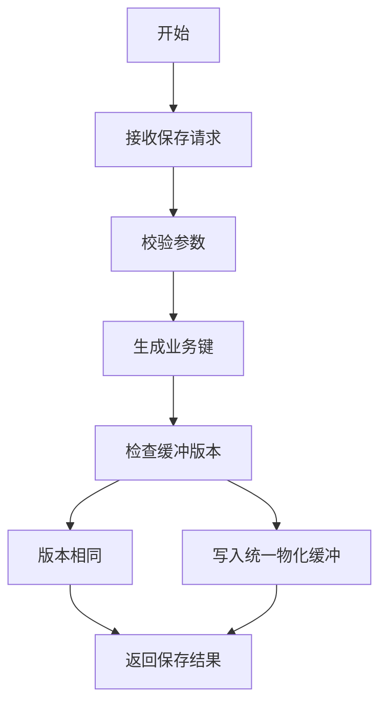
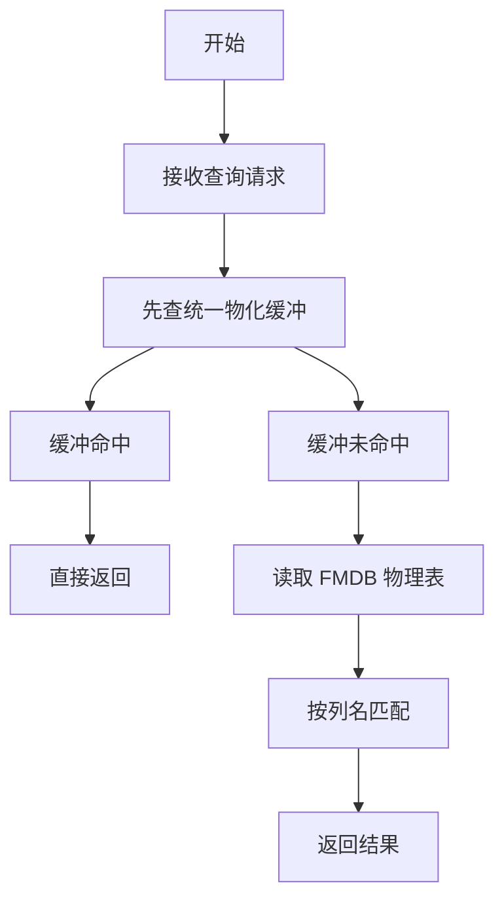
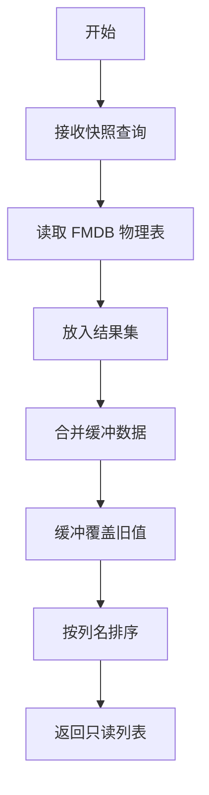

# FmdbColumnProfileRepository 流程图

下面这张图对应 `FmdbColumnProfileRepository` 里的核心逻辑：先进入统一物化缓冲，再按需回读物理表，最后在 `findBySnapshot` 里合并两边结果。

## 保存流程

## 单条查询流程

## 目录查询流程

## 物化缓冲含义

`pendingProfiles` 就是这个类里的物化缓冲。  
它保存的是“已经算出来，但还没统一写入 FMDB 物理表”的列画像。  
这样做的好处是：

1. 先接住训练过程中的中间结果。
2. 查询时优先拿到最新版本。
3. 最终由统一物化流程落库，避免频繁写物理表。

## 例子

假设 `datasetId=A`，`snapshotId=S1`，`columnName=age`。

1. 第一次算出 `age` 的画像，调用 `save(...)`。
2. 这条记录先进 `pendingProfiles`，还没有写进 FMDB。
3. 立刻调用 `find(A, S1, age)`，会直接返回缓冲里的最新结果。
4. 后续统一物化完成后，结果才会真正进入物理表。
5. 如果中途又算出 `v2`，缓冲会覆盖旧值，查询时优先返回 `v2`。

