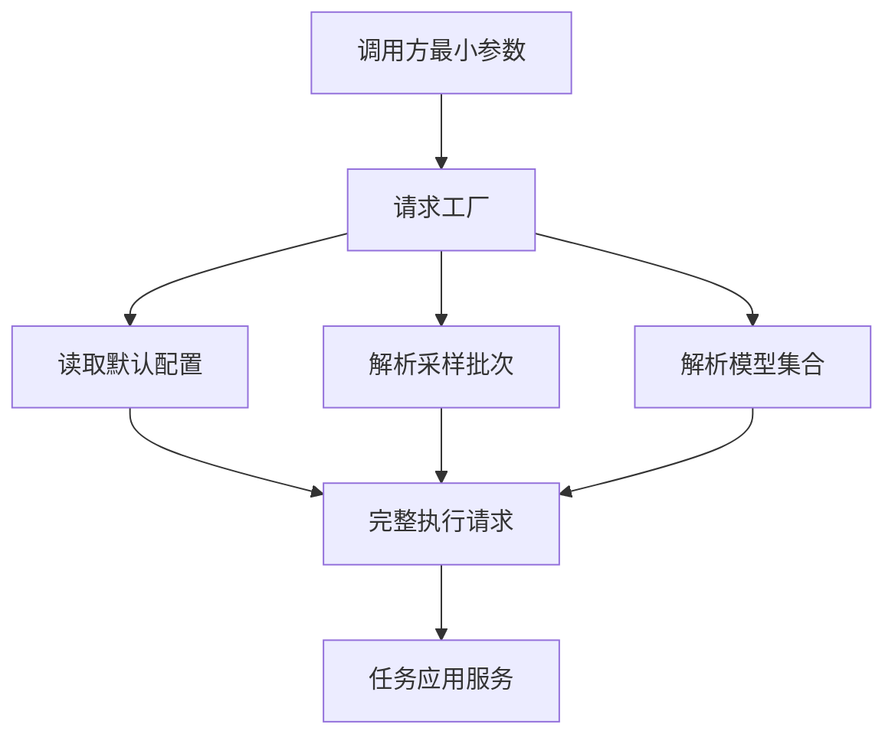

# RahaTaskExecutionRequest 最小请求方法分析

## 1. 分析结论

为采样、训练和检测提供最小请求入口是合理的，可以显著减少调用方重复组装 `RahaJobConfig`、`DataLoadRequest` 及各类默认配置的代码。

但不建议把全部逻辑都放进 `RahaTaskExecutionRequest` 的静态方法。当前请求对象是不可变数据载体，训练批次解析和模型集合解析需要访问仓储，将这些外部依赖放进静态方法会造成全局依赖、测试困难和配置缓存边界不清晰。

建议采用两层入口：

1. `RahaTaskExecutionRequest` 保留当前面向完整领域对象的静态方法。
2. 新增带依赖的 `RahaTaskRequestFactory`，向 FMDB 调用方提供表、SQL、采样批次和模型集合级别的最小方法。

三个请求的总体判断如下：

| 请求 | 方案合理性 | 当前可直接支持 | 主要缺口 |
| --- | --- | --- | --- |
| 数据采样 | 基本合理 | 默认配置、默认首轮、内容哈希行身份 | 输入类型推导、表名规范化、稳定快照规则 |
| 模型训练 | 目标合理，但字段不足 | 单个采样批次和单个标注批次训练 | 仅凭批次标识解析、多个批次合并、标注版本选择 |
| 模型检测 | 显式模型集合版本非常合理 | 按字段加载当前唯一已发布模型 | 按模型集合版本加载、模型集合清单、行身份继承、幂等键隔离 |

“模型采样”建议统一称为“数据采样”或“主动采样”。当前 `SAMPLING` 工作流采样的是待人工标注的数据行，不是模型。

## 2. 当前实现事实

### 2.1 当前最小方法仍要求完整领域对象

`RahaTaskExecutionRequest` 已提供以下简化方法：

```java
training(RahaJobConfig config,
         DataLoadRequest dataLoadRequest,
         List<CellLabel> directLabels)

sampling(RahaJobConfig config,
         DataLoadRequest dataLoadRequest)

detection(RahaJobConfig config,
          DataLoadRequest dataLoadRequest)
```

这些方法只简化了传播参数、训练参数、采样轮次和评估器等字段，并没有简化 `RahaJobConfig` 与 `DataLoadRequest` 的创建。

### 2.2 数据加载当前不能省略的内容

`DataLoadRequest` 构造器当前强制要求：

- `datasetId`
- `inputReference`
- `tableName`
- `rowIdentityConfig`
- `DataFormat`

因此，若要让调用方只传入表名或 SQL，必须新增一层输入规则解析和默认对象组装。

### 2.3 行身份默认规则确实会合并相同行

`RowIdentityConfig.contentHash()` 会按全部业务字段的规范化内容生成 SHA-256 行标识。`RowIdentityService` 会按该行标识分组，只保留一条确定性代表行，并在技术字段中记录物理重复数量。

所以“未提供业务键时，按全部列内容分组并合并相同行”的描述与当前实现一致。

需要同时明确一个边界：任意业务字段发生变化都会得到新的行标识。因此内容哈希适合没有主键的一次性数据处理，但不适合需要跨快照稳定跟踪同一业务实体的场景。存在稳定业务键时，应优先传入 `rowKeyColumns`。

### 2.4 当前自动快照不是输入内容指纹

`SnapshotMetadataFactory` 在没有 `snapshotId` 时使用以下内容生成标识：

```text
datasetId + inputReference + sourceVersion + schemaHash + rowCount
```

当 `sourceVersion` 为空时，代码使用当前读取时间代替。这意味着同一份未变化数据在不同时间读取，可能得到不同的 `snapshotId`。

因此，“否则计算输入内容指纹”目前并未真正实现。当前实现更准确的描述是“根据来源版本、模式和行数生成快照标识；没有来源版本时包含读取时间”。如果需要稳定幂等，应优先接入平台数据版本，或者增加真正的确定性内容指纹算法。

### 2.5 当前持久化训练只支持一组批次

当前训练请求只保存以下一组引用：

- `sampleBatchId`
- `samplePartitionMonth`
- `annotationBatchId`
- `annotationPartitionMonth`
- `rowIdentityConfig`

五个字段必须同时存在。当前工作流不支持 `sampleBatchIds` 列表，也不会仅凭采样批次标识自动选择标注批次。

### 2.6 当前检测没有显式模型集合选择

当前检测流程针对每个字段调用 `findPublished(datasetId, columnName)`，加载该字段唯一处于 `PUBLISHED` 状态的模型。

虽然 FMDB 模型物理表已经包含 `model_set_version`，但 `RahaColumnModel`、`ModelMetadataRepository`、`PublishedColumnModelLoader` 和 `RahaTaskExecutionRequest` 没有形成按模型集合版本贯通的读取链路。

## 3. 采样请求分析

### 3.1 建议字段契约

| 字段 | 最小入口是否必填 | 建议生成规则 |
| --- | --- | --- |
| `inputReference` | 是 | 表入口传 FMDB 完整表名；SQL 入口传只读查询 |
| `datasetId` | 条件必填 | 表入口按完整规范表名生成；SQL 入口必须提供稳定逻辑标识 |
| `sourceType` | 否 | 不建议猜测，建议由不同方法名确定为 `FMDB_TABLE` 或 `FMDB_SQL` |
| `rowKeyColumns` | 否 | 非空时使用 `sourceKey`，为空时使用 `contentHash` |
| `snapshotId` | 否 | 优先使用调用方或平台版本映射值 |
| `sourceVersion` | 否，但强烈建议 | 使用 FMDB 数据版本、分区版本或业务批次版本，保证快照稳定 |
| `labelingBudget` | 否 | 默认读取 `raha.sampling.labeling-budget`，当前默认值为 `20` |
| `samplingRound` | 否 | 默认值为 `1` |
| `existingLabels` | 否 | 默认空集合 |

### 3.2 不建议自动解析 sourceType

从文本开头判断表或 SQL 存在歧义，例如 SQL 可能包含注释、公共表表达式或前置空白；表名也可能使用复杂引用规则。当前 FMDB 加载器只允许以 `SELECT` 或 `WITH` 开头的 SQL，但这属于执行安全校验，不应承担公共接口的类型推断。

建议使用两个语义明确的方法：

```java
samplingTable(String tableName)

samplingSql(String datasetId,
            String sql)
```

高级字段通过不可变选项对象提供：

```java
sampling(FmdbInputSpec input,
         SamplingRequestOptions options)
```

### 3.3 datasetId 生成规则

表来源可以默认使用完整规范表名生成 `datasetId`，但不能只保留末级表名，否则不同库或模式中的同名表会发生冲突。

建议规范化时保留 `catalog.schema.table` 的完整层级，并明确大小写、引号和特殊字符的处理规则。SQL 来源必须由调用方提供稳定逻辑标识，因为 SQL 文本格式变化不应自动创建一个新的逻辑数据集。

### 3.4 labelingBudget 覆盖规则

默认值应通过 `RahaConfigFactory` 读取，而不是在最小方法中写死 `20`。调用方显式提供预算时，应创建新的 `SamplingConfig` 并只覆盖 `labelingBudget`，其他采样配置继续继承合并后的运行配置。

## 4. 训练请求分析

### 4.1 仅提供 sampleBatchIds 的目标是合理的

从调用方角度，已完成标注的采样批次应当足以定位训练输入。采样记录中已经保存数据集标识、输入引用、来源版本、模式哈希和行身份规则，因此具备自动组装大部分训练请求的基础。

但当前仓储查询必须同时提供 `datasetId`、月份分区和批次标识，静态请求方法无法仅凭 `sampleBatchId` 完成查询。

### 4.2 建议先支持单批次，再扩展多批次

第一阶段建议提供：

```java
training(String sampleBatchId)
```

由 `RahaTaskRequestFactory` 完成以下解析：

1. 按全局唯一批次标识查找采样批次及月份分区。
2. 查找该采样批次最新有效的标注批次。
3. 还原 `datasetId`、`inputReference`、`sourceVersion` 和行身份规则。
4. 创建训练类型的默认 `RahaJobConfig` 与 `DataLoadRequest`。
5. 使用默认同质性传播、默认逻辑回归训练配置和默认模型名前缀。

当前 `AnnotationBatchStatus` 没有“已完成”状态，只有 `IMPORTED`、`PARTIAL`、`REJECTED` 和 `DUPLICATE`。因此必须定义“已完成标注”的准确规则。建议默认只接受 `IMPORTED`；是否允许 `PARTIAL` 应由显式选项控制，不能静默混入训练。

### 4.3 多批次训练需要补充的规则

如果直接支持 `List<String> sampleBatchIds`，至少需要明确：

- 所有批次是否必须属于同一 `datasetId`。
- 模式哈希和行身份规则是否必须完全相同。
- 每个采样批次如何选择标注修订版本。
- 同一行、同一字段出现冲突标签时的优先级。
- 多个批次之间的重复样本如何去重。
- 多个来源快照如何形成训练快照和训练幂等键。
- 输入顺序是否影响模型集合版本；建议先排序后生成版本。

当前训练合并服务只处理一个采样批次和一个标注批次，因此多批次不是单纯修改请求字段，还需要改造合并服务和训练版本生成规则。

### 4.4 训练请求建议补充的可选字段

| 字段 | 默认规则 |
| --- | --- |
| `annotationSelection` | 选择采样批次最新的 `IMPORTED` 标注修订 |
| `allowPartialAnnotation` | 默认 `false` |
| `modelNamePrefix` | 默认 `raha` |
| `propagationMethod` | 默认 `HOMOGENEITY` |
| `inputReferenceOverride` | 默认使用采样记录中的来源，仅在受控迁移场景允许覆盖 |
| `sourceVersion` | 默认使用采样记录值，也可由平台提供当前明确版本 |

## 5. 检测请求分析

### 5.1 modelSetVersion 应当必填

要求调用方明确指定不可变 `modelSetVersion` 是合理且必要的。它能保证同一输入在模型发布状态变化后仍然可以复现，并避免一次检测从不同发布时间选择到互不一致的列模型。

目标最小方法建议为：

```java
detectionTable(String inputReference,
               String modelSetVersion)

detectionSql(String datasetId,
             String sql,
             String modelSetVersion)
```

若模型集合清单能唯一提供逻辑 `datasetId`，SQL 入口的 `datasetId` 也可以省略；但在模型集合清单落地前，不应做此假设。

### 5.2 需要新增模型集合清单

建议建立明确的 `ModelSetManifest`，至少保存：

- `modelSetVersion`
- `datasetId`
- `schemaHash`
- 行身份模式、业务键字段和指纹协议版本
- 策略计划版本
- 各字段对应的不可变 `modelVersion`
- 模型集合状态和发布时间

当前模型表虽然包含 `model_set_version`，但行身份信息没有进入模型集合元数据，因此“默认使用模型集合记录的行身份规则”目前无法实现。

### 5.3 datasetId 不应简单从检测表名生成

检测输入表可能不同于训练输入表，但仍然使用同一个逻辑模型集合。检测请求中的 `datasetId` 应优先从 `ModelSetManifest` 取得，并校验输入模式兼容性，而不是根据待检测物理表名重新生成。

### 5.4 modelSetVersion 必须进入任务幂等语义

当前应用服务在创建工作流之前先使用 `RahaJobConfig` 提交幂等任务。如果只把 `modelSetVersion` 放在 `RahaTaskExecutionRequest`，它不会自然进入现有任务幂等键。

这会导致同一输入使用两个模型集合执行检测时，第二次请求错误复用第一次任务。实现时必须让 `modelSetVersion` 进入配置规范文本、执行输入指纹或幂等键生成器。

### 5.5 检测请求建议补充的规则

| 字段 | 最小入口是否必填 | 建议生成规则 |
| --- | --- | --- |
| `inputReference` | 是 | 指定待检测 FMDB 表或只读 SQL |
| `modelSetVersion` | 是 | 选择不可变模型集合，不允许自动漂移到最新发布版本 |
| `datasetId` | 条件必填 | 优先从模型集合清单取得，SQL 逻辑来源可用于一致性校验 |
| `sourceType` | 否 | 由表方法或 SQL 方法确定 |
| `rowKeyColumns` | 否 | 默认使用模型集合行身份规则；覆盖时必须做兼容校验 |
| `snapshotId` | 否 | 优先使用平台数据版本；没有稳定版本时不能声称是内容指纹 |
| `sourceVersion` | 否，但强烈建议 | 用于稳定快照和任务幂等 |
| `missingModelPolicy` | 否 | 建议默认失败；允许部分成功时必须显式配置并返回缺失字段 |

## 6. 推荐接口结构

### 6.1 最小调用入口

```java
public final class RahaTaskRequestFactory {

    public RahaTaskExecutionRequest samplingTable(String tableName);

    public RahaTaskExecutionRequest samplingSql(String datasetId,
                                                String sql);

    public RahaTaskExecutionRequest training(String sampleBatchId);

    public RahaTaskExecutionRequest training(List<String> sampleBatchIds,
                                             TrainingRequestOptions options);

    public RahaTaskExecutionRequest detectionTable(String inputReference,
                                                   String modelSetVersion);

    public RahaTaskExecutionRequest detectionSql(String datasetId,
                                                 String sql,
                                                 String modelSetVersion);
}
```

### 6.2 高级入口

```java
public RahaTaskExecutionRequest sampling(FmdbInputSpec input,
                                         SamplingRequestOptions options);

public RahaTaskExecutionRequest detection(FmdbInputSpec input,
                                          String modelSetVersion,
                                          DetectionRequestOptions options);
```

`FmdbInputSpec` 建议统一保存：

- `inputReference`
- `datasetId`
- `DataFormat`
- `rowKeyColumns`
- `snapshotId`
- `sourceVersion`
- 字段白名单、黑名单和敏感字段集合

### 6.3 为什么不全部放入 RahaTaskExecutionRequest



`RahaTaskExecutionRequest` 只保存最终不可变输入；`RahaTaskRequestFactory` 负责读取配置和仓储并完成推导。这样可以保持请求对象无外部副作用，也便于对批次选择和模型选择进行单元测试。

## 7. 必要改造清单

### 7.1 采样最小入口

1. 新增 FMDB 表名规范化和 `datasetId` 生成器。
2. 新增 `FmdbInputSpec` 或等价内部构建方法。
3. 从 `RahaConfigFactory` 获取完整默认值，只覆盖调用方明确提供的字段。
4. 明确 `sourceVersion` 与 `snapshotId` 的优先级。
5. 分别提供表和 SQL 方法，避免不可靠的文本猜测。

### 7.2 训练最小入口

1. 为采样仓储增加按全局批次标识查询的方法，或者引入批次索引表。
2. 明确采样批次标识的全局唯一性约束。
3. 自动选择最新有效标注修订，并明确 `PARTIAL` 策略。
4. 从采样记录还原输入来源和行身份规则。
5. 第一阶段支持单批次；第二阶段再改造多批次合并及冲突策略。

### 7.3 检测最小入口

1. 新增 `ModelSetManifest` 及其仓储接口。
2. 为模型仓储增加按 `modelSetVersion` 查询整套列模型的能力。
3. 将 `modelSetVersion` 贯穿请求、检测阶段、模型加载器和结果持久化。
4. 将 `modelSetVersion` 纳入任务幂等键。
5. 在模型集合中保存行身份规则，并在检测时校验覆盖兼容性。
6. 校验模型集合的模式哈希、特征字典和策略计划版本完整一致。

## 8. 推荐实施顺序

1. 先实现 `samplingTable`、`samplingSql` 和统一输入规格，验证默认配置覆盖规则。
2. 实现单个 `sampleBatchId` 的训练解析工厂，默认只接受最新 `IMPORTED` 标注批次。
3. 建立模型集合清单并实现显式 `modelSetVersion` 检测。
4. 将模型集合版本加入任务幂等语义并补充回归测试。
5. 最后扩展多个采样批次训练，避免在最小入口阶段同时引入复杂标签冲突和跨快照合并。

## 9. 最终建议

你提出的采样字段设计基本可以采用，但建议用表方法和 SQL 方法代替自动解析 `sourceType`，并增加 `sourceVersion`。

训练只暴露 `sampleBatchIds` 是合适的调用体验，但当前应先落地单个 `sampleBatchId`；批次、分区、标注修订、输入来源和行身份都由带仓储依赖的请求工厂解析。

检测显式要求 `modelSetVersion` 是本次设计中最重要的改进。它不应只是新增一个请求字段，而应作为模型集合清单、模型加载、兼容校验、结果落库和任务幂等的统一版本边界。
