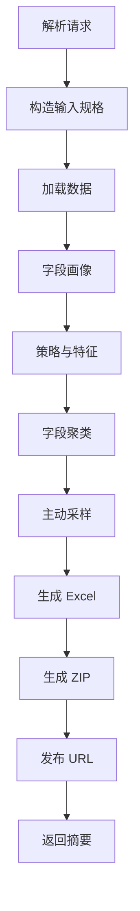
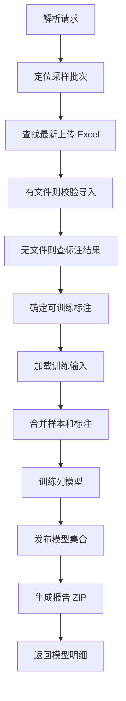
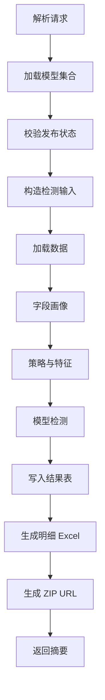

# Raha 三函数 UDF 契约与实现方案

## 1. 目标与边界

本文明确 Raha 采集样本、模型训练、执行检测三个 UDF 函数的入参、出参、文件命名、ZIP 发布和核心实现逻辑。

需求开头提到“4 个 UDF 函数”，正文实际列出 3 个函数。本文先按 3 个核心函数设计：

| 序号 | 函数 | 业务含义 | 本文状态 |
| --- | --- | --- | --- |
| 1 | 采集函数 | 读取表或 SQL，生成快照、采样批次、待标注 Excel 和 ZIP URL | 明确 |
| 2 | 训练函数 | 读取表或 SQL，根据 sampleBatchId 找最新标注文件并训练模型 | 明确 |
| 3 | 执行检测函数 | 读取表或 SQL，使用模型版本输出检测摘要和明细 ZIP | 明确 |
| 4 | 标注导入函数 | 可选拆分，用于只导入和校验标注 Excel | 暂不作为必选 |

如果平台强制要求 4 个 UDF，建议把“标注导入和校验”从训练函数中拆出为 `F_DW_DETANNOTATIONIMPORT`。第一阶段可以先把标注导入作为训练函数的前置步骤，减少用户调用次数。

## 2. 函数命名建议

函数名统一使用检测业务前缀 `DET`，避免与旧 Raha 实验函数混用。

| 功能 | 推荐函数名 | 含义 |
| --- | --- | --- |
| 采集样本 | `F_DW_DETCOLLECT` | Detection Collect，采集检测样本 |
| 模型训练 | `F_DW_DETTRAIN` | Detection Train，训练检测模型 |
| 执行检测 | `F_DW_DETRUN` | Detection Run，执行检测 |

## 3. 统一调用约定

三个函数都建议只接收一个 `request` 字符串，便于以后扩展参数。当前工程已有 `FormDataCodec`，第一阶段建议使用表单编码：

```text
sourceType=TABLE&tableName=dw.customer&caller=raha-ui
```

如果平台更适合 JSON，也可以保留同名字段。本文只定义字段语义，不绑定唯一编码格式。

### 3.1 公共入参

| 字段 | 必填 | 说明 |
| --- | --- | --- |
| `sourceType` | 是 | `TABLE` 或 `SQL` |
| `tableName` | 条件必填 | `sourceType=TABLE` 时必填，完整 FMDB 表名 |
| `sqlText` | 条件必填 | `sourceType=SQL` 时必填，只允许 `SELECT` 或 `WITH` 查询 |
| `datasetId` | SQL 必填 | 逻辑数据集标识；表输入可由表名自动生成 |
| `rowKeyColumns` | 否 | 稳定业务主键，多个字段用逗号分隔；不传时使用内容哈希 |
| `snapshotId` | 否 | 调用方指定的平台快照标识 |
| `sourceVersion` | 否 | 数据源版本、业务批次或表版本 |
| `includeColumns` | 否 | 仅处理的字段白名单 |
| `excludeColumns` | 否 | 不参与处理的字段黑名单 |
| `sensitiveColumns` | 否 | 预留字段；当前检测明细按要求直接输出原值，不做脱敏展示 |
| `publishZip` | 否 | 是否生成 ZIP URL，默认 `true` |
| `caller` | 否 | 调用系统或用户，用于日志追踪 |
| `requestId` | 否 | 调用方请求标识，用于排查和幂等辅助 |

规则：

1. `sourceType=TABLE` 时，`datasetId` 默认使用 `FmdbInputSpec.datasetIdFromTable(tableName)` 生成，形如 `fmdb-table:dw.customer`。
2. `sourceType=SQL` 时，调用方必须传 `datasetId`，避免 SQL 文本变化导致同一业务数据集无法追踪。
3. 训练和执行检测必须使用与采集阶段兼容的行身份规则。生产建议显式传 `rowKeyColumns`。
4. SQL 原文不要直接打印到日志，日志中记录 SQL 指纹和长度即可。

## 4. 统一出参形态

逻辑上三个函数都输出二维表。若 FMDB 当前只支持标量 UDF，可先返回 JSON 字符串，再由外层 SQL 或平台页面解析成表格。

所有函数都包含以下公共字段：

| 字段 | 说明 |
| --- | --- |
| `status` | `SUCCESS`、`FAILED`、`PARTIAL` |
| `errorCode` | 失败时的稳定错误码 |
| `errorMessage` | 失败时的简短错误说明 |
| `datasetId` | 逻辑数据集标识 |
| `snapshotId` | 输入快照标识 |
| `sourceType` | 输入类型 |
| `inputReference` | 表名或 SQL 摘要 |
| `jobId` | Raha 任务标识 |
| `createdAt` | 结果生成时间，毫秒时间戳 |

## 5. 采集函数

### 5.1 函数职责

采集函数负责读取 FMDB 表或只读 SQL，生成数据快照、字段画像、聚类结果、采样批次、待标注 Excel，并把 Excel 和相关说明文件打包成 ZIP，返回可下载 URL。

### 5.2 专属入参

| 字段 | 必填 | 默认值 | 说明 |
| --- | --- | --- | --- |
| `labelingBudget` | 否 | 配置默认值 | 本轮最大待标注行数 |
| `samplingRound` | 否 | `1` | 采样轮次 |
| `artifactBaseDir` | 否 | 配置默认值 | 本地临时产物目录 |

### 5.3 输出字段

采集函数建议返回单行摘要：

| 字段 | 说明 |
| --- | --- |
| `datasetId` | 逻辑数据集标识 |
| `snapshotId` | 快照标识 |
| `sourceVersion` | 来源版本 |
| `schemaHash` | 输入字段结构哈希 |
| `rowCount` | 采集数据量 |
| `fieldCount` | 字段总数 |
| `validFieldCount` | 可参与检测的有效字段数 |
| `sampleBatchId` | 采样批次标识 |
| `sampleRecordCount` | 采样记录数 |
| `annotationTaskCount` | 待标注数量 |
| `clusterCount` | 聚类数量，按有效字段的实际簇数求和 |
| `clusteredFieldCount` | 成功聚类字段数 |
| `annotationExcelName` | ZIP 内待标注 Excel 文件名 |
| `annotationZipName` | 待标注 ZIP 文件名 |
| `annotationZipUrl` | 待标注 ZIP 下载地址 |
| `partitionMonth` | 采样批次月份分区 |

### 5.4 Excel 与 ZIP 命名规范

待标注 Excel 文件名：

```text
raha-annotation_<sampleBatchId>_<yyyyMMddHHmmss>.xls
```

待标注 ZIP 文件名：

```text
raha-collect_<sampleBatchId>_<yyyyMMddHHmmss>.zip
```

要求：

1. `sampleBatchId` 必须直接出现在 Excel 文件名中，训练时可根据文件名从默认 HDFS 路径 `/fmdb/detection/annotation/` 下定位候选文件。
2. Excel 隐藏工作表 `系统信息` 必须保存精确的 `sampleBatchId`、`datasetId`、`samplePartitionMonth`、`schemaHash`、`templateVersion`、`recordCount`、业务字段列表和有效字段列表。
3. 即使用户改名上传，训练函数也必须以隐藏工作表为最终可信校验来源。
4. 文件名中的 `sampleBatchId` 建议只包含英文、数字、点、下划线和中划线。

ZIP 内容建议：

| ZIP 内路径 | 内容 |
| --- | --- |
| `annotation/<excelName>` | 待标注 Excel |
| `manifest.json` | ZIP 清单、datasetId、snapshotId、sampleBatchId、schemaHash |
| `summary.json` | 采集摘要字段 |
| `sample-records.csv` | 待标注采样行快照 |
| `column-profiles.csv` | 字段画像摘要 |
| `clusters.csv` | 聚类摘要 |
| `README.txt` | 标注上传说明 |

### 5.5 核心实现逻辑



落地建议：

1. 使用 `FmdbInputSpec.table` 或 `FmdbInputSpec.sql` 构造输入。
2. 使用 `RahaTaskRequestFactory.sampling` 创建采样请求。
3. 使用 `RahaTaskApplicationService.execute` 执行采样工作流。
4. 从 `RahaSampleOutput` 读取 `ClusteringBatchResult`、`SamplingBatchResult`、`SampleBatch`。
5. 使用 `AnnotationTemplateService.exportTemplate` 生成 Excel。
6. 新增 `com.fiberhome.ml.raha.output.publish` 包，复用 SchemaMatch 的 ZIP 和 Web 发布思路。

## 6. 训练函数

### 6.1 函数职责

训练函数读取表或 SQL，根据 `sampleBatchId` 在默认 HDFS 路径 `/fmdb/detection/annotation/` 下定位最新上传的标注 Excel，导入标注结果后训练模型，并返回模型集合版本和列模型明细。模型文件和模型集合默认写入 `/fmdb/detection/model/`。

### 6.2 专属入参

| 字段 | 必填 | 默认值 | 说明 |
| --- | --- | --- | --- |
| `sampleBatchId` | 是 | 无 | 采集函数返回的采样批次标识 |
| `annotationDir` | 否 | `/fmdb/detection/annotation/` | 标注 Excel 上传 HDFS 目录 |
| `allowPartialAnnotation` | 否 | `false` | 是否允许部分有效标注参与训练 |
| `modelNamePrefix` | 否 | `raha` | 模型名称前缀 |
| `modelBasePath` | 否 | `/fmdb/detection/model/` | 模型文件和模型集合默认 HDFS 存储目录 |
| `publishZip` | 否 | `true` | 是否生成训练报告 ZIP |

### 6.3 标注数据定位规则

训练时先查找 HDFS 上传文件；上传文件不存在时，再从已导入的标注结果中恢复训练输入。

1. 在 `annotationDir` 下查找文件名匹配 `raha-annotation_<sampleBatchId>_*.xls` 的文件。
2. 只接受 `.xls` 文件，忽略临时文件、校验回写文件和非 Excel 文件。
3. 候选文件按最后修改时间倒序排序；时间相同按文件名倒序排序。
4. 如果存在候选文件，选择最新候选文件并读取隐藏工作表 `系统信息`。
5. `系统信息.sampleBatchId` 必须等于入参 `sampleBatchId`。
6. `datasetId`、`schemaHash`、`samplePartitionMonth` 必须与采样批次一致。
7. 最新候选文件结构非法或批次不匹配时，直接失败，不静默回退到旧文件或旧标注结果。
8. 如果 `annotationDir` 下没有任何匹配文件，则调用 `AnnotationRecordRepository.findLatestTrainableForSample(sampleBatchId, allowPartialAnnotation)` 查询已导入的最新可训练标注结果。
9. 如果已导入标注结果存在，则直接使用该标注批次训练，不重复执行 Excel 导入。
10. 如果 HDFS 上传文件和已导入标注结果都不存在，则返回 `MANUAL_ANNOTATION_NOT_FOUND`，错误信息必须提示“未找到人工标注数据，请将标注 Excel 上传到 HDFS 路径 `/fmdb/detection/annotation/` 下后重新训练”。

这样可以避免用户上传了新文件但格式错误时，系统误用旧标注训练。

### 6.4 输出字段

训练函数建议返回列模型明细表，每个有效字段一行。整体汇总字段在每行重复，便于二维表展示。

| 字段 | 说明 |
| --- | --- |
| `datasetId` | 逻辑数据集标识 |
| `snapshotId` | 训练输入快照 |
| `sampleBatchId` | 采样批次 |
| `annotationBatchId` | 导入后的标注批次 |
| `annotationFileName` | 本次使用的上传文件名 |
| `annotationStatus` | `IMPORTED`、`PARTIAL`、`DUPLICATE` |
| `validAnnotationCount` | 有效标注行数 |
| `invalidAnnotationCount` | 无效标注行数 |
| `modelSetVersion` | 模型集合版本，执行检测函数使用该值 |
| `columnName` | 字段名 |
| `modelVersion` | 字段模型版本 |
| `modelStatus` | 模型状态 |
| `classifierType` | 分类器类型 |
| `featureDictionaryVersion` | 特征字典版本 |
| `strategyPlanVersion` | 策略计划版本 |
| `threshold` | 模型阈值 |
| `metricJson` | 字段训练指标摘要 |
| `reportZipUrl` | 训练报告 ZIP URL |

如果某个字段训练失败，也返回一行，`modelStatus=FAILED`，并填充 `errorCode` 和 `errorMessage`。

### 6.5 核心实现逻辑



落地建议：

1. 新增 `AnnotationUploadFileLocator`，负责扫描 `/fmdb/detection/annotation/` 并选择最新文件。
2. 找到上传文件时，使用 `AnnotationImportService.importWorkbook` 导入 Excel。
3. 重复上传时，根据文件指纹识别为 `DUPLICATE`，训练可复用仓储中的最新可训练标注批次。
4. 未找到上传文件时，使用 `AnnotationRecordRepository.findLatestTrainableForSample(sampleBatchId, allowPartialAnnotation)` 查询已导入的标注结果。
5. 上传文件和标注结果都不存在时，返回 `MANUAL_ANNOTATION_NOT_FOUND`，并提示上传到 `/fmdb/detection/annotation/`。
6. 确定可训练标注后，使用 `RahaTaskRequestFactory.training(sampleBatchId)` 创建训练请求。
7. 使用 `RahaTaskApplicationService.execute` 执行训练工作流。
8. 从 `RahaTrainOutput.getModelSetVersion()` 获取执行检测所需模型集合版本。

## 7. 执行检测函数

### 7.1 函数职责

执行检测函数读取表或 SQL，使用训练函数产出的 `modelSetVersion` 执行错误检测，返回检测数据基本信息，并在需要时生成包含明细 Excel 的 ZIP。

### 7.2 专属入参

| 字段 | 必填 | 默认值 | 说明 |
| --- | --- | --- | --- |
| `modelSetVersion` | 是 | 无 | 训练函数返回的模型集合版本 |
| `missingModelPolicy` | 否 | `PARTIAL` | 字段缺少模型时的处理策略，`FAIL` 或 `PARTIAL` |
| `detailFormat` | 否 | `xls` | 明细文件格式，第一阶段固定为 `xls` |
| `publishZip` | 否 | `true` | 是否生成检测明细 ZIP |

### 7.3 输出字段

执行检测函数建议返回单行摘要：

| 字段 | 说明 |
| --- | --- |
| `datasetId` | 逻辑数据集标识 |
| `snapshotId` | 检测输入快照 |
| `modelSetVersion` | 使用的模型集合版本 |
| `schemaHash` | 输入字段结构哈希 |
| `rowCount` | 检测数据量 |
| `fieldCount` | 字段总数 |
| `validFieldCount` | 可参与检测的字段数 |
| `modelFieldCount` | 模型覆盖字段数 |
| `failedFieldCount` | 检测失败字段数 |
| `detectedCellCount` | 参与检测的单元格数 |
| `detectedErrorCount` | 检测错误量 |
| `resultTable` | FMDB 检测结果表 |
| `detailZipName` | 明细 ZIP 文件名 |
| `detailZipUrl` | 明细 ZIP 下载地址 |

### 7.4 明细 Excel 字段

检测明细 Excel 文件名：

```text
raha-detrun-detail_<modelSetVersion>_<yyyyMMddHHmmss>.xls
```

ZIP 文件名：

```text
raha-detrun_<modelSetVersion>_<yyyyMMddHHmmss>.zip
```

明细字段建议：

| 字段 | 说明 |
| --- | --- |
| `dataset_id` | 数据集标识 |
| `snapshot_id` | 快照标识 |
| `row_id` | 行标识 |
| `column_name` | 字段名 |
| `original_value` | 原始值，直接展示，不做脱敏 |
| `score` | 错误分数 |
| `threshold` | 阈值 |
| `detected_as_error` | 是否判错 |
| `model_name` | 模型名 |
| `model_version` | 模型版本 |
| `feature_dictionary_version` | 特征字典版本 |
| `strategy_ids` | 命中策略 |
| `reasons_json` | 检测原因 |

检测明细默认输出 `original_value` 原始值，不再做脱敏展示。日志仍应避免直接打印大批量原始数据，只记录定位字段、数量和摘要信息。

### 7.5 核心实现逻辑



落地建议：

1. 使用 `ModelSetRepository.find(modelSetVersion)` 查询模型集合，并调用 `requirePublished()`。
2. 表输入使用模型集合中的 `datasetId`，避免同一模型版本被错误套到其他数据集。
3. SQL 输入必须显式传 `datasetId`，且必须与模型集合 `datasetId` 一致。
4. 使用 `RahaTaskRequestFactory.detectionTable` 或 `detectionSql` 创建执行检测请求。
5. 使用 `RahaTaskApplicationService.execute` 执行检测工作流。
6. 从 `RahaDetectOutput.getResults()` 统计 `detectedErrorCount`。
7. 从 `RahaDetectOutput.getFailedColumns()` 统计 `failedFieldCount`。

## 8. ZIP 与 URL 发布实现

当前仓库没有 `com.fiberhome.ml.schemamatch.output.publish`，但同级工程中存在可参考实现：

| 类 | 可复用点 |
| --- | --- |
| `SchemaMatchZipWebPublisher` | 本地生成 ZIP、ZIP 内重名文件唯一化、HDFS 上传、远端 Web 发布、本地 Web 降级 |
| `SchemaMatchTrainingZipPublisher` | 训练摘要 Excel、日志和模型产物加入 ZIP 后统一发布 |

Raha 建议新增对应包：

```text
src/main/java/com/fiberhome/ml/raha/output/publish/
```

建议类：

| 类 | 职责 |
| --- | --- |
| `RahaZipWebPublisher` | 通用 ZIP 和 URL 发布 |
| `RahaAnnotationPackagePublisher` | 采集函数待标注包发布 |
| `RahaTrainingReportPublisher` | 训练报告包发布 |
| `RahaDetectionRunReportPublisher` | 检测明细包发布 |

发布顺序：

1. 在本地工作目录生成 ZIP。
2. 如果 Spark 使用非本地文件系统，尝试上传 HDFS。
3. 尝试发布到远端 Web 目录。
4. 远端失败时复制到本地 Web 根目录。
5. 返回 HTTP URL 或本地降级路径。

建议配置：

| 配置 key | 说明 |
| --- | --- |
| `raha.output.work-dir` | Raha 产物临时工作目录 |
| `raha.output.local-web-root` | 本地 Web 降级发布根目录 |
| `raha.output.hdfs-export-path` | HDFS 导出目录 |
| `raha.output.web-base-url` | 对外下载基础 URL |
| `raha.annotation.upload-dir` | 标注上传 HDFS 目录，默认 `/fmdb/detection/annotation/` |
| `raha.model.base-path` | 模型文件和模型集合 HDFS 目录，默认 `/fmdb/detection/model/` |

## 9. 错误码建议

| 错误码 | 说明 |
| --- | --- |
| `INVALID_ARGUMENT` | 参数缺失、冲突或格式非法 |
| `DATA_LOAD_FAILED` | 表或 SQL 读取失败 |
| `SAMPLE_NOT_FOUND` | `sampleBatchId` 不存在 |
| `ANNOTATION_FILE_NOT_FOUND` | HDFS 上传目录未找到匹配 Excel，但仍会继续查询已导入标注结果 |
| `MANUAL_ANNOTATION_NOT_FOUND` | 未找到上传 Excel 且标注结果中没有可训练人工标注，提示上传到 `/fmdb/detection/annotation/` |
| `ANNOTATION_FILE_INVALID` | Excel 无法读取或模板结构非法 |
| `ANNOTATION_BATCH_MISMATCH` | Excel 隐藏信息与采样批次不一致 |
| `ANNOTATION_IMPORT_FAILED` | 标注导入失败 |
| `TRAINING_FAILED` | 模型训练失败 |
| `MODEL_SET_NOT_FOUND` | 模型集合版本不存在 |
| `MODEL_SET_NOT_PUBLISHED` | 模型集合未发布，不能执行检测 |
| `DETECTION_RUN_FAILED` | 执行检测失败 |
| `PUBLISH_FAILED` | ZIP 生成或发布失败 |

## 10. 日志要求

三个函数必须在以下节点记录日志：

1. 开始解析请求，记录 `caller`、`requestId`、`sourceType`。
2. 读取表或 SQL 前后，记录 `datasetId`、`snapshotId`、数据量和耗时。
3. 采集函数生成 Excel 和 ZIP 前后，记录 `sampleBatchId`、文件名、URL。
4. 训练函数定位标注文件、导入标注、训练模型和发布报告前后，记录 `sampleBatchId`、`annotationBatchId`、`modelSetVersion`。
5. 执行检测函数加载模型、执行检测、写结果表和发布明细前后，记录 `modelSetVersion`、错误数量、失败字段数。
6. 所有异常捕获处必须带上下文和异常堆栈。

## 11. 第一阶段实施清单

| 步骤 | 内容 |
| --- | --- |
| 1 | 新增 Raha 产物发布包，迁移并改造 SchemaMatch ZIP 发布逻辑 |
| 2 | 新增三个 UDF 请求对象和结果对象，字段按本文命名 |
| 3 | 新增采集函数，接通采样工作流、Excel 生成和 ZIP 发布 |
| 4 | 新增标注文件定位器，支持 `/fmdb/detection/annotation/` 最新文件选择 |
| 5 | 新增训练函数，接通标注导入、训练工作流和模型明细输出 |
| 6 | 新增执行检测函数，接通模型集合版本、检测工作流和明细 ZIP |
| 7 | 增加集成测试，覆盖表输入、SQL 输入、重复上传、错文件上传、缺失模型和发布降级 |

## 12. 待确认事项

1. 是否必须落地第 4 个 UDF。如果必须，建议定义为标注导入校验函数。
2. 平台 UDF 是否支持真正返回多行多列。如果只支持标量返回，先返回 JSON，再由平台解析展示。
3. `/fmdb/detection/annotation/` 已确认为标注上传默认 HDFS 路径，训练函数的文件定位器按 HDFS 文件系统实现。
4. `/fmdb/detection/model/` 已确认为模型默认 HDFS 路径，模型发布和执行检测加载按该路径作为默认根目录。
